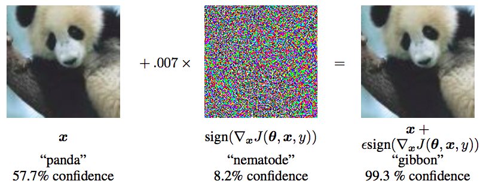
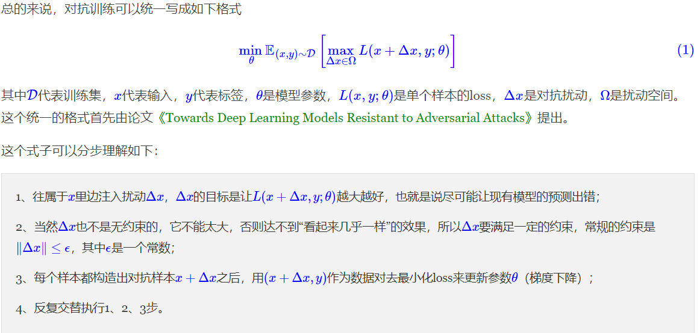
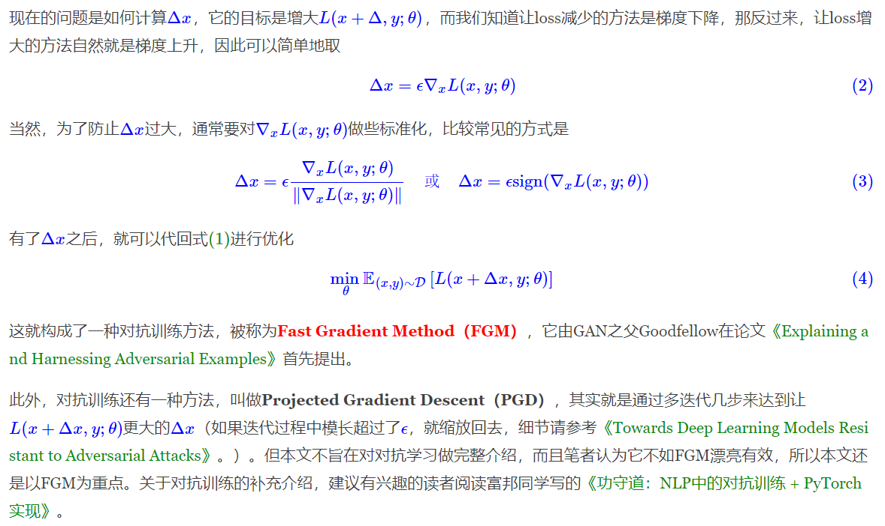
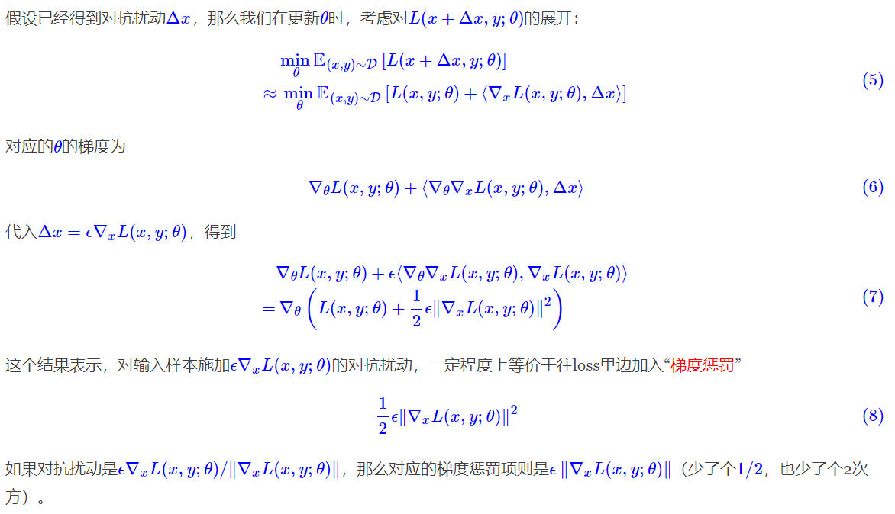
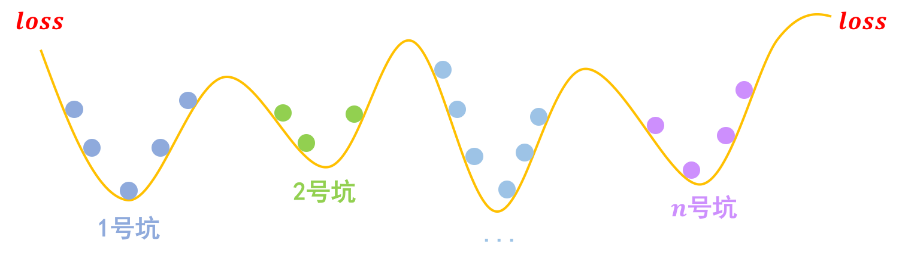
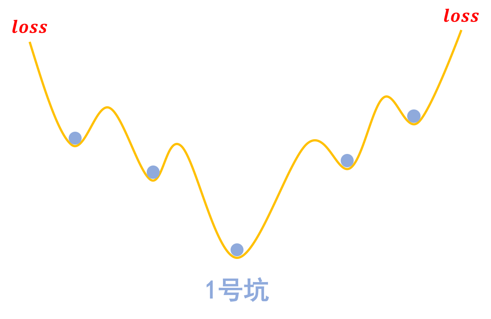
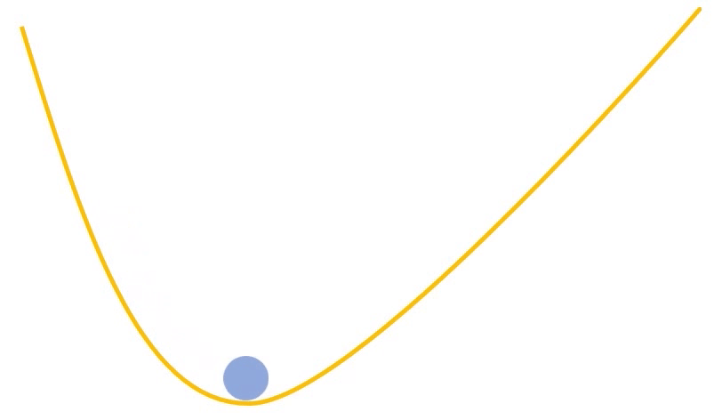
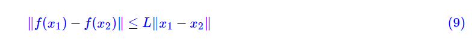

深度学习中的对抗，一般会有两个含义：一个是生成对抗网络（Generative Adversarial Networks，GAN），代表着一大类先进的生成模型；另一个则是跟对抗攻击、对抗样本相关的领域，它跟GAN相关，但又很不一样，它主要关心的是模型在小扰动下的稳健性。

在CV领域，我们需要通过对模型的对抗攻击和防御来增强模型的稳健型，比如在自动驾驶系统中，要防止模型因为一些随机噪声就将红灯识别为绿灯。在NLP领域，类似的对抗训练也是存在的，不过NLP中的对抗训练更多是作为一种正则化手段来提高模型的泛化能力！

### 基本概念

要认识对抗训练，首先要了解“对抗样本”，它首先出现在论文[《Intriguing properties of neural networks》](http://https//arxiv.org/abs/1312.6199)之中。简单来说，它是指对于人类来说“看起来”几乎一样、但对于模型来说预测结果却完全不一样的样本，比如下面的经典例子：



“对抗攻击”，其实就是想办法造出更多的对抗样本，而“对抗防御”，就是想办法让模型能正确识别更多的对抗样本。所谓对抗训练，则是属于对抗防御的一种，它构造了一些对抗样本加入到原数据集中，希望增强模型对对抗样本的鲁棒性；同时，在NLP中它通常还能提高模型的表现。

## Min-Max



由此观之，整个优化过程是max和min交替执行，这确实跟GAN很相似，不同的是，GAN所max的自变量也是模型的参数，而这里max的自变量则是输入（的扰动量），也就是说要对每一个输入都定制一步max。

## 快速梯度



## 回到NLP

对于CV领域的任务，上述对抗训练的流程可以顺利执行下来，因为图像可以视为普通的连续实数向量，Δx也是一个实数向量，因此x+Δx依然可以是有意义的图像。但NLP不一样，NLP的输入是文本，它本质上是one hot向量，而两个不同的one hot向量，其欧氏距离恒为√2，因此对于理论上不存在什么“小扰动”。

一个自然的想法是像论文[《Adversarial Training Methods for Semi-Supervised Text Classification》](https://arxiv.org/abs/1605.07725)一样，将扰动加到Embedding层。这个思路在操作上没有问题，但问题是，扰动后的Embedding向量不一定能匹配上原来的Embedding向量表，这样一来对Embedding层的扰动就无法对应上真实的文本输入，这就不是真正意义上的对抗样本了，因为对抗样本依然能对应一个合理的原始输入。

那么，在Embedding层做对抗扰动还有没有意义呢？有！实验结果显示，在很多任务中，在Embedding层进行对抗扰动能有效提高模型的性能。

## 实践

对于CV任务来说，一般输入张量的shape是(b,h,w,c)，这时候我们需要固定模型的batch size（即b），然后给原始输入加上一个shape同样为(b,h,w,c)、全零初始化的`Variable`，比如就叫做Δx，那么我们可以直接求loss对x的梯度，然后根据梯度给Δx赋值，来实现对输入的干扰，完成干扰之后再执行常规的梯度下降。

对于NLP任务来说，原则上也要对Embedding层的输出进行同样的操作，Embedding层的输出shape为(b,n,d)，所以也要在Embedding层的输出加上一个shape为(b,n,d)的`Variable`，然后进行上述步骤。但这样一来，我们需要拆解、重构模型，对使用者不够友好。

不过，我们可以退而求其次。Embedding层的输出是直接取自于Embedding参数矩阵的，因此我们可以直接对Embedding参数矩阵进行扰动。这样得到的对抗样本的多样性会少一些（因为不同样本的同一个token共用了相同的扰动），但仍然能起到正则化的作用，而且这样实现起来容易得多。

基于上述思路，这里给出Keras下基于FGM方式对Embedding层进行对抗训练的参考实现：

> https://github.com/bojone/keras_adversarial_training

核心代码如下：

```python
def adversarial_training(model, embedding_name, epsilon=1):
    """给模型添加对抗训练
    其中model是需要添加对抗训练的keras模型，embedding_name
    则是model里边Embedding层的名字。要在模型compile之后使用。
    """
    if model.train_function is None:  # 如果还没有训练函数
        model._make_train_function()  # 手动make
    old_train_function = model.train_function  # 备份旧的训练函数

    # 查找Embedding层
    for output in model.outputs:
        embedding_layer = search_layer(output, embedding_name)
        if embedding_layer is not None:
            break
    if embedding_layer is None:
        raise Exception('Embedding layer not found')

    # 求Embedding梯度
    embeddings = embedding_layer.embeddings  # Embedding矩阵
    gradients = K.gradients(model.total_loss, [embeddings])  # Embedding梯度
    gradients = K.zeros_like(embeddings) + gradients[0]  # 转为dense tensor

    # 封装为函数
    inputs = (model._feed_inputs +
              model._feed_targets +
              model._feed_sample_weights)  # 所有输入层
    embedding_gradients = K.function(
        inputs=inputs,
        outputs=[gradients],
        name='embedding_gradients',
    )  # 封装为函数

    def train_function(inputs):  # 重新定义训练函数
        grads = embedding_gradients(inputs)[0]  # Embedding梯度
        delta = epsilon * grads / (np.sqrt((grads**2).sum()) + 1e-8)  # 计算扰动
        K.set_value(embeddings, K.eval(embeddings) + delta)  # 注入扰动
        outputs = old_train_function(inputs)  # 梯度下降
        K.set_value(embeddings, K.eval(embeddings) - delta)  # 删除扰动
        return outputs

    model.train_function = train_function  # 覆盖原训练函数
```

定义好上述函数后，给Keras模型增加对抗训练就只需要一行代码了：

```python
# 写好函数后，启用对抗训练只需要一行代码
adversarial_training(model, 'Embedding-Token', 0.5)
```

需要指出的是，由于每一步算对抗扰动也需要计算梯度，因此每一步训练一共算了两次梯度，因此每步的训练时间会翻倍。

## 延伸思考

从另一个视角对上述结果进行分析，从而推出对抗训练的另一种方法，并且得到一种关于对抗训练的更直观的几何理解。



事实上，这个结果不是新的，据笔者所知，它首先出现论文[《Improving the Adversarial Robustness and Interpretability of Deep Neural Networks by Regularizing their Input Gradients》](https://arxiv.org/abs/1711.09404)里。

事实上，关于梯度惩罚，我们有一个非常直观的几何图像。以常规的分类问题为例，假设有nn个类别，那么模型相当于挖了nn个坑，然后让同类的样本放到同一个坑里边去：

[](https://kexue.fm/usr/uploads/2020/02/2156438670.png)

分类问题就是挖坑，然后将同类样本放在同一个坑内


梯度惩罚则说“同类样本不仅要放在同一个坑内，还要放在坑底”，这就要求每个坑的内部要长这样：

[](https://kexue.fm/usr/uploads/2020/02/783354977.png)

对抗训练希望每个样本都在一个“坑中坑”的坑底


为什么要在坑底呢？因为物理学告诉我们，坑底最稳定呀，所以就越不容易受干扰呀，这不就是对抗训练的目的么？

[](https://kexue.fm/usr/uploads/2020/03/3963498733.gif)

“坑底”最稳定。受到干扰后依然在坑底附近徘徊，不容易挑出坑（跳出坑往往意味着分类错误）


那坑底意味着什么呢？极小值点呀，导数（梯度）为零呀，所以不就是希望‖∇xL(x,y;θ)‖越小越好么？这便是梯度惩罚(8)的几何意义了。类似的“挖坑”、“坑底”与梯度惩罚的几何图像，还可以参考[《能量视角下的GAN模型（一）：GAN＝“挖坑”＋“跳坑”》](https://kexue.fm/archives/6316)。


我们还可以从L约束（Lipschitz约束）的角度来看梯度惩罚。所谓对抗样本，就是输入的小扰动导致输出的大变化，而关于输入输出的控制问题，我们之前在文章[《深度学习中的L约束：泛化与生成模型》](https://kexue.fm/archives/6051)就已经探讨过。一个好的模型，理论上应该是“输入的小扰动导致导致输出的小变化”，而为了做到这一点，一个很常用的方案是让模型满足L约束，即存在常数L，使得



这样一来只要两个输出的差距‖x1−x2‖足够小，那么就能保证输出的差距也足够小。而[《深度学习中的L约束：泛化与生成模型》](https://kexue.fm/archives/6051)已经讨论了，实现L约束的方案之一就是谱归一化（Spectral Normalization），所以往神经网络里边加入谱归一化，就可以增强模型的对抗防御性能。相关的工作已经被发表在[《Generalizable Adversarial Training via Spectral Normalization》](https://arxiv.org/abs/1811.07457)。

美中不足的是，谱归一化是对模型的每一层权重都进行这样的操作，结果就是神经网络的每一层都满足L约束，这是不必要的（我们只希望整个模型满足L约束，不必强求每一层都满足），因此理论上来说L约束会降低模型表达能力，从而降低模型性能。而在WGAN系列模型中，为了让判别器满足L约束，除了谱归一化外，还有一种常见的方案，那就是梯度惩罚。因此，梯度惩罚也可以理解为一个促使模型满足L约束的正则项，而满足L约束则能有效地抵御对抗样本的攻击。

既然梯度惩罚号称能有类似的效果，那必然也是要接受实验验证的了。相比前面的FGM式对抗训练，其实梯度惩罚实现起来还容易一些，因为它就是在loss里边多加一项罢了，而且实现方式是通用的，不用区分CV还是NLP。

Keras参考实现如下：

```python
def sparse_categorical_crossentropy(y_true, y_pred):
    """自定义稀疏交叉熵
    这主要是因为keras自带的sparse_categorical_crossentropy不支持求二阶梯度。
    """
    y_true = K.reshape(y_true, K.shape(y_pred)[:-1])
    y_true = K.cast(y_true, 'int32')
    y_true = K.one_hot(y_true, K.shape(y_pred)[-1])
    return K.categorical_crossentropy(y_true, y_pred)


def loss_with_gradient_penalty(y_true, y_pred, epsilon=1):
    """带梯度惩罚的loss
    """
    loss = K.mean(sparse_categorical_crossentropy(y_true, y_pred))
    embeddings = search_layer(y_pred, 'Embedding-Token').embeddings
    gp = K.sum(K.gradients(loss, [embeddings])[0].values**2)
    return loss + 0.5 * epsilon * gp


model.compile(
    loss=loss_with_gradient_penalty,
    optimizer=Adam(2e-5),
    metrics=['sparse_categorical_accuracy'],
)
```

可以看到，定义带梯度惩罚的loss非常简单，就两行代码而已。需要指出的是，梯度惩罚意味着参数更新的时候需要算二阶导数，但是Tensorflow和Keras自带的loss函数不一定支持算二阶导数，比如`K.categorical_crossentropy`支持而`K.sparse_categorical_crossentropy`不支持，遇到这种情况时，需要自定重新定义loss。

## 参考资料

[对抗训练浅谈：意义、方法和思考（附Keras实现）](https://kexue.fm/archives/7234)