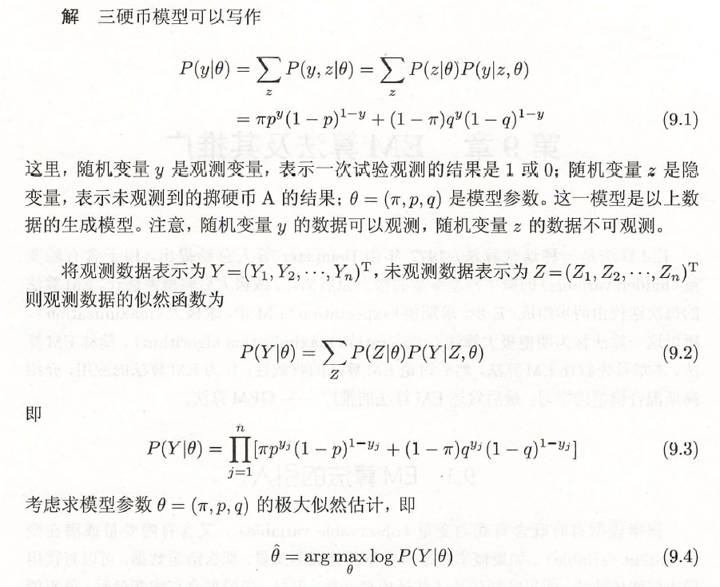

EM 算法是一种迭代算法， 1977 年由Dempster 等人总结提出，**用于含有隐变量( hidden variable) 的概率模型参数的极大似然估计，或极大后验概率估计**。EM 算法的每次迭代由两步组成： E 步，求期望(expectation ) ; M 步，求极大( maximization) 。所以这一算法称为期望极大算法(expectation maximization algorithm) ，简称EM 算法。

EM算法是通过不断求解下界的极大化逼近求解对数似然函数极大化的算法。

优点：简单，普适性

## EM算法的引入

概率模型有时既含有观测变量(observable variable) ，又含有隐变量或潜在变量(latent variable) 。如果概率模型的变量都是观测变量，那么给定数据，可以直接用极大似然估计法，或贝叶斯估计法估计模型参数。但是，当模型含有隐变量时，就不能简单地使用这些估计方法。EM 算法就是含有隐变量的概率模型参数的极大似然估计法，或极大后验概率估计法。

### EM算法

举例：

**EM算法**

### EM算法的导出

## EM算法的收敛性

## EM算法在高斯混合模型学习中的应用

EM算法的一个重要应用是高斯混合模型的参数估计。在许多情况下，EM算法是学习高斯混合模型的有效方法。

### 高斯混合模型

###  高斯混合模型参数估计的EM算法

## EM算法的推广

### F函数的极大-极大算法

### GEM算法

