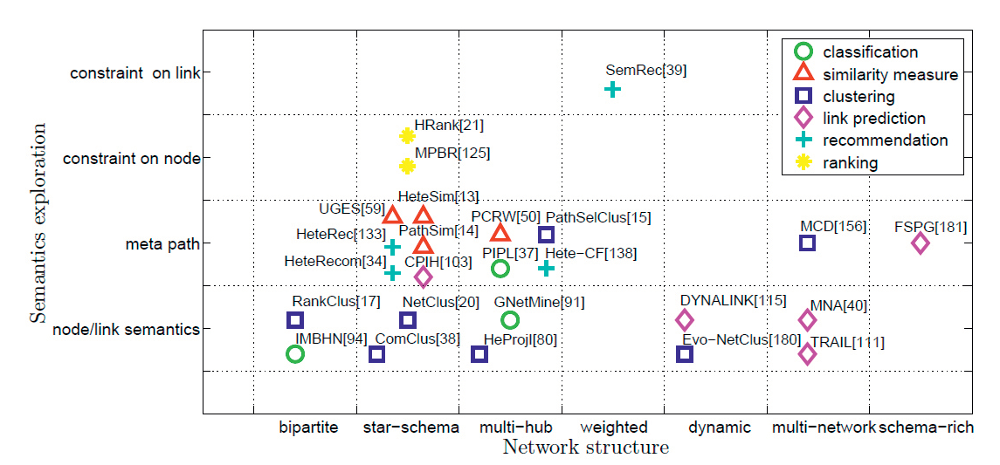
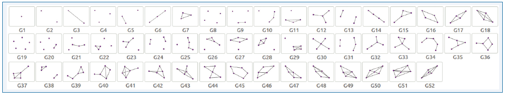
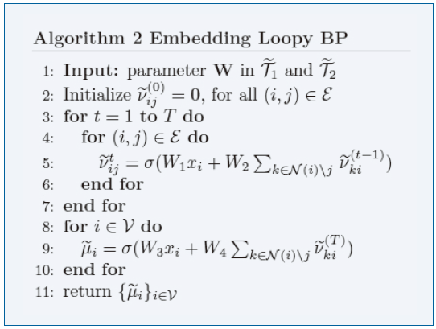
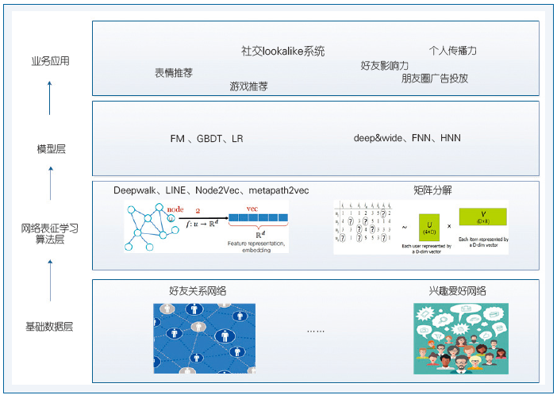
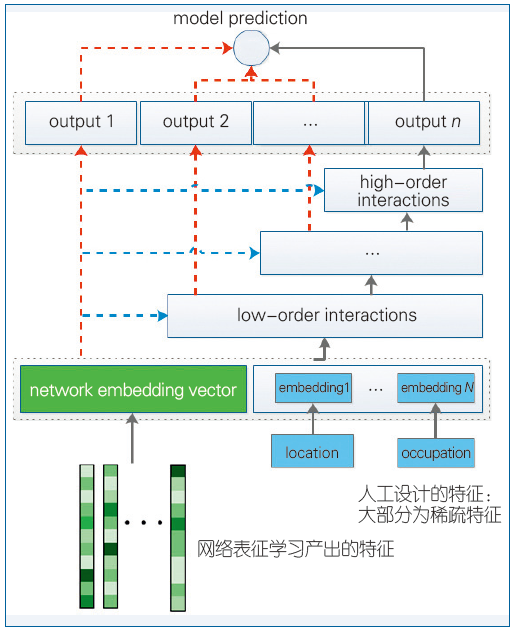

我们通常将一个网络表示为由一个点集和边集共同组合而成。网络中"边"的存在，给网络的处理和分析带来极大挑战。首先，"边"的存在使得网络分析算法是迭代的或组合爆炸的。其次，"边"的存在使得网络节点之间相互耦合。

网络是一种存在形式，但从形成机制的维度，一般有另外一个隐空间在驱动着网络的形成和演化。即存在一个表达"相近性"的隐含向量空间，产生了一个网络。但我们可观测的是网络拓扑空间，隐空间是不可观测的。核心问题是，我们是否可以将观测到的网络拓扑空间"嵌入"到隐含向量空间？如果可以，则网络中的节点对应于向量空间中的样本点，而网络中的边被向量空间的距离度量所取代。这样，网络分析中由"边"所导致的一系列瓶颈问题均得以解决。

**网络表征学习的必要性**

目前机器学习尤其是深度学习已经在许多领域显示出强大的数据处理能力，对许多问题都已给出了有效的解决方案。但是它们针对的数据表征通常为一个向量空间中的独立性数据，而非彼此关联的非独立性网络数据，这会导致很多有效解决方案无法直接应用到网络数据上，而必须重新设计基于网络拓扑的模型。由此可见，传统的基于网络拓扑的表征方式已经成为限制大规模网络处理和分析的瓶颈。

为了让网络表征更好地支持下游的网络分析任务，网络表征学习通常有两个基本目标。一是在低维空间中学习到的表征可以重构出原有网络结构。第二个目标是学习到的表征可以有效地支持网络推断。

**从图嵌入到网络表征学习**

图嵌入算法的目的与网络表征学习有相似的地方。图嵌入也是根据一个图，学习图中节点的低维表征，代表性的算法有Isomap，LLE和LE。这些传入图嵌入算法的基本思路是基于某种规则，比如KNN方法，从图像或文本数据集中构建一个相似度矩阵，利用降维方法学习得到每个数据的表征，该表征可以保持这种构建的图的结构。所以本质上图嵌入算法重点关注网络表征学习的第一个目标，即保持图的结构。

## 网络表征学习方法

###结构与性质保持的网络表征学习方法

最基本。保持网络的结构不仅仅指保持观测到的网络拓扑结构，更重要的是保持网络的高阶结构。所观测到的网络拓扑通常是**一阶结构**，高阶结构则包括**二阶结构**等。还可以结合节点的K步关系得到K阶结构来表征节点相似度。节点的高阶结构还包括**节点上下文结构**，这种结构通常由随机游走得到。基于不同的随机游走策略，所得到的结构既可以反应同质性，也可以反应节点的结构等同性。网络中还普遍存在着**社区结构**，它反映的是一个社区内节点的相似性。因此，也有方法融合这种结构，使得同一社区内的节点有相似的表征，进而增强了表征的判别性。

真实网络中所具备的性质也能为网络表征学习提供必需的指导。**非对称传递性质**在有向网络中非常普遍，它对于有向网络的链路预测有着极为重要的指导意义(HOPE, Asymmetric transitivity preserving graph embedding)。同样地，符号网络具备的**结构平衡性质**，也为衡量符号网络中三个节点的关系提供了丰富信息。

本质上大多数结构和性质保持的网络表征学习都是为了显式或隐式地引入更多更高阶的相似度信息，区别则是考虑了不同的高阶相似度以及用不同的方式引入高阶相似度。

### 融合伴随信息的网络表征学习方法

伴随信息通常指节点的标签、内容、类型等信息。节点的标签通常可以引入判别性信息，因此，有网络表征学习通过结合支持向量机的模型来融合标签信息。节点的内容可以指代文本网络中的文本信息，也可以指代社交网络中用户的属性信息，并包含了丰富的语义信息。这些节点还产生了通过基于矩阵分解的方法融合节点内容的网络表征学习模型。类型信息通常与异构信息网络表征学习息息相关。

### 融合高级信息的网络表征学习方法

针对专有任务而设计。比如在网络异常点检测中，我们需要首先定义何为异常点，进而根据这个信息设计合适的节点表征及异常点度量方法。

高级信息保持的网络表征学习通常包括两个部分，一部分是使得节点表征保持原有网络结构信息，另一部分是构建起节点表征和目标任务之间的联系。

## 常用的网络表征学习模型

通常来说，网络表征学习模型包括三种：(1) 基于矩阵分解的模型；(2) 基于随机游走的模型；(3) 基于深度神经网络的模型。

矩阵分解本身是一种最为有效的表征学习模型，已经被广泛应用在各个场景，比如维度约减。我们可以对网络的邻接矩阵进行矩阵分解，由此得到每个节点的表征。在这类模型中，奇异值分解(SVD)以及非负矩阵分解 都有着广泛的使用。基于随机游走的模型则主要是由自然语言处理中的Word2vec 启发而来，通过随机游走的方式可以定义节点的上下文节点结构，进而通过保持这种结构来学习节点表征。深度神经网络模型的有效性已经在计算机视觉以及语音处理领域得到广泛验证，它可以得到一个有效的非线性函数学习模型，非常适合用来拟合网络高度非线性的结构。

与基于邻接矩阵的传统方法相比，DeepWalk采用随机游走序列的优势在于：随机游走序列上的表示学习过程只依赖于局部信息，计算效率较高，非常适用于多线程或分布式计算。其次，随机游走序列建模能够有效缓解基于0-1二值邻接矩阵方法的数据稀疏问题。 

LINE [4]算法，适用于大规模有向带权图的网络表示学习。 

## 异质网络的表征学习

同质网络代表性模型：DeepWalk模型：将随机游走和skip-gram 模型结合起来学习网络节点表示，LINE模型：在一阶邻居相似性的基础上加上二阶相似性，从而学习到对大规模稀疏网络有更好的区分能力的节点表示，SDNE模型：借助于深度自动编码机来抽取网络结构的非线性特征。

在异质信息网络中，元路径表示连接两个对象之间的关系的组合，它刻画了网络中包含的丰富的语义信息。例如，在图1(c) 中，有多条元路径连接作者：APA表示作者之间的合作关系；APVPA 表示两个作者在同一个会议上发表过文章。

元路径不仅刻画了对象之间的语义关系，而且能够抽取对象之间的特征信息。 链接两类对象的不同元路径，表示了不同的语义关系和链接网络，这也造成了不同的分析结果和特征表示。 

异质信息网络的复杂性也为网络表征学习提出了新的挑战。(1) 节点和边的异质性带来的挑战。不同类型的节点和边代表不同的对象，因此，在异质网络的表征学习中需要考虑将不同类型的对象映射到不同的空间中。另外，如何有效地保存每个节点的异质邻居以及有效地处理异质的节点序列也是值得考虑的问题。(2)异质网络中丰富的信息带来的表示融合挑战。异质网络中的各类信息蕴含着丰富的语义，它从多个维度来刻画节点的意义，因此，如何有效地抽取和利用异质网络的多维度信息，并有效地融合这些信息以便全面地学习节点的表示是一个巨大的挑战。

###异质网络表征学习的主要进展：

**基于随机游走的方法**

随机游走作为一种经典的图分析模型，常用于刻画网络中节点间的可达性，因此也被广泛应用于网络表征学习中采样节点的邻居关系。

由于节点和边关系的类型约束，通常采用基于元路径的随机游走模型。

Metapath2vec通过在异质信息网络中做基于元路径的随机游走来抽取节点结构信息，并利用skip-gram 算法来学习节点表示。在Metapath2Vec基础上，作者进一步深化节点类型带来的差异提出了Metapath2Vec++。Metapath2Vec++ 通过将不同类型的节点映射到不同的向量空间，进一步刻画节点间的区别。

HIN2Vec同时考虑了不同类型节点及节点间复杂多样的关系，通过刻画节点对及其之间的边关系来学习节点及元路径的向量表示。

HINE首先基于元路径随机游走来计算节点间的相似性，并将其作为监督信息来指导节点的向量表示。

Shang 等人提出的ESim 在异质网络上基于元路径进行随机游走，通过使元路径
实例的概率最大化来学习出现在该实例中节点的向量表示。

PathSim[2]利用对称元路径抽取两个节点之间的连通路径来度量二者的相似性，这样不仅利用了相关的异质信息，而且体现了节点和边的丰富语义。PathSelClus[3]采用不同元路径抽取不同的网络结构进行节点聚类，并利用用户指导信息实现对聚类结果的整合。HCLP[5]使用元路径构造边的特征向量，用于不同类型边的关系预测。

图3从网络结构和语义探索两个角度，总结了该领域的一些典型工作[1]。沿着X轴，网络结构变得更加复杂；沿着Y轴，语义信息变得更加丰富。例如，PathSim[2]可以处理星型模式网络，并使用元路径挖掘语义关系。SemRec[6]在基本元路径上增加了链接的权值约束，以在带权异质网络中探索更微妙的语义信息。 

  

**基于分解的方法**

为了缓解异质网络的复杂性，可以将异质网络分解为比较简单的网络，分别对这些网络进行表征学习，然后再将这些信息融合起来，达到“分而治之”的效果。 

Chuan Shi等人提出的HERec[13]模型利用元路径抽取异质网络中的多个同质网络，并对这些同质网络进行表征学习，然后通过融合函数对不同的表示进行融合，并结合矩阵分解模型进行评分预测。PTE[14]将从文本中构建的异质网络分解成3个子网：word-word网络、word-document网络和word-label网络。对上述网络进行表征学习可以得到不同类型对象（如word、document和label）的向量表示。EOE[15]将复杂的学术异质网分解为单词共现网络和作者合作网络，对各个子网内节点对和子网间节点对同时进行表征学习。 

**基于深度网络的方法**

BL-MNE[16]采用自动编码机分别对异质网络在不同元路径下的信息进行编码，再对这些信息进行联合编码，不同网络之间通过转移矩阵进行融合。SHINE[17]也利用自动编码机分别对社交网络、情感网络和画像网络中的异质信息进行压缩编码得到特征表示，然后通过聚合函数对这些表示进行融合得到最终的节点表示。针对文本和图像并存的异质网络，HNE[18]通过CNN和MLP分别对文本和图像数据进行特征抽取，然后通过转移矩阵将不同类型的数据投影到同一个空间。上述方法均采用深度模型来学习节点的向量表示。相对于浅层模型，深度模型可以更好地对非线性关系进行建模，能够抽取节点所蕴含的复杂语义信息。 

### 应用

1. 节点分类 

Guolei Sun等人[19]提出的GERI模型通过构建一个双向异质网络，为富文本信息图形提出了一种新颖的表征学习框架，并将学习到的向量表示用于网络节点分类。Jian Tang等人[14]针对大规模异质文本网络设计了半监督表征学习模型PTE，该模型同时利用带标签数据和无标签数据学习文本的嵌入表示，依据文本的低维向量表示对其进行分类。Metapath2vec[9]通过在异质信息网络中做基于元路径的随机游走同时学习节点的向量表示，并将学到的节点向量用于节点分类任务，取得了较好的效果。 

2. 链路预测 

链路预测任务的目的在于预测网络中丢失的边，或者可能出现的边。 

Hongwei Wang等人[17]提出的SHINE模型解决异质信息网络中的情感链路预测问题，该模型利用多个深度自编码器学习节点的向量表示，并将其融合到同一空间用于情感链路预测。Taoyang Fu等人[10]提出的HIN2Vec模型基于随机游走同时学习节点和边的向量表示，并将学到的节点向量用于链路预测任务，取得了较好的效果。 

3. 推荐系统 

个性化推荐是根据用户的购买历史，为用户推荐其感兴趣的信息和商品。 

Chuan Shi等人[13]提出的HERec推荐模型，基于随机游走策略生成节点序列，学习节点的向量表示，然后利用扩展的矩阵分解模型产生推荐。Huan Zhao等人[20]根据异质信息网络中不同的元图计算得到多个交换矩阵，然后使用矩阵分解基于不同的元图分别学习多个不同的用户和物品的隐向量，最后通过因子分解机学习用户对物品的评分，并进行推荐。Yongfeng Zhang等人[21]提出的JRL推荐模型设计了一个深度表征学习框架，利用异质信息源（评分、评论和图片）学习用户和物品的特征表示，然后通过一个额外层学习到用户和物品的联合表示，最后通过Pair-wise学习，来推荐top-N的物品。Ting Chen、Yizhou Sun等人[22]提出一种混合表征学习推荐框架，并对采样策略进行优化，提出了三种可以大大提升训练效率的采样策略。 

石川等人[6]提出了个性化语义推荐方法SemRec。作为一种基本的推荐技术，协同过滤方法通过相似的用户对用户进行推荐。在异质网络中，可以利用元路径找到不同特性的相似用户。例如，通过元路径“UU”（U、M、T分别表示用户、电影、电影类型），可以找到用户的朋友，这对应于社会化推荐；通过元路径“UMU”，可以找到具有相同观影记录的用户，这对应于传统的协同过滤。不同的相似用户有不同的推荐结果，有效整合这些推荐结果，可以产生综合的最终推荐。该方法还考虑了用户和电影之间打分关系上的分值（即关系权重），提出了带权异质信息网络和带权元路径等概念，以及相应的相似性计算方法。此外，该方法还采用组推荐技术对具有相同打分偏好的用户进行聚类。实验表明，由于融合了更多信息，该方法不仅具有更高的推荐准确性，而且能够有效缓解冷启动问题。此外，该方法能够根据用户的打分特性对用户进行聚类，较好地反映了用户群体特征。 

推荐的可解释性一直是透明可信的推荐结果的必要条件，也是很多推荐模型所缺乏的功能。由于元路径的语义特性，SemRec可以对推荐结果进行解释，进而设计了可解释的语义推荐原型系统RecExp[11]。 

4. 其他任务

异质信息网络由于蕴含丰富的语义信息，常被应用于各种任务。针对双盲评审的作者身份识别问题，Ting Chen, Yizhou Sun等人[23]基于学术合作异质网络，提出了一个任务引导和路径增强的异质网络表示模型。该模型根据特定任务选择元路径，学习文章的向量表示，对双盲审情况下的匿名论文作者进行识别，取得了较高的准确率。针对不同类型事件的异常检测，Ting Chen、Yizhou Sun等人[24]提出了一种实体嵌入模型APE。该模型利用在不同事件中观察到的实体的共生性，将待检测事件和其他实体建模为一个异质信息网络，然后将各个实体学习为一个低维向量，从而有效地检测异常事件。

### 展望

1. 异质信息网络中的信息融合

异质信息网络中存在复杂的语义关系。根据不同的元路径可以从多个维度对节点的丰富信息建模。如何有效地自动筛选和融合不同元路径下的网络节点表示是一个值得关注的研究方向。目前节点的表征学习研究比较多，关系和元路径的表征学习还比较少。不同类型的节点有不同的特征表示空间，对这些表示空间之间的关系还缺乏深入探究。

2. 融合其他信息的表征学习

异质网络可以通过融合丰富的异质异构数据从而解决大数据的“多样性”挑战。因此异质网络天然包含丰富的多模信息，如属性、文本和图像等。只有将更多模态的信息考虑进来，学习到的网络节点表示才能更加准确地对节点进行描述。而现有的主要工作都致力于对异质信息网络中的结构信息建模，没有充分挖掘网络中的其他模态信息。如何更好地融合这些多模态信息的表征学习将是一个研究难点。

3. 大规模动态网络

目前网络表征学习相关工作主要集中于小规模静态网络，但是现实世界中的网络往往规模较大并且动态变化。我们需要考虑节点和边的异质性，快速高效地获取新增节点的表示，研究面向增量计算和在线计算的表征学习方法。

4. 结合具体应用

目前表征学习算法主要集中在做通用的表征学习，与具体应用相结合做任务优化的节点表示的较少。在社区发现、异常检测等特定任务上，通用表征学习的效果往往不尽如人意。如何与具体应用结合学习网络表示是重要发展方向。另外，社交网络服务的大量兴起，积累了丰富的异质数据。如何将异质网络表征学习技术真正应用于实际业务也是值得关注的方向。

更加复杂的网络构建

当前的研究，大多是假定异质信息网络是明确定义的，网络中的对象和关系是清晰的。然而，在实际应用中，用真实数据构造异质信息网络会遇到很多挑战。对于关系数据库之类的结构化数据，构造异质信息网络比较容易，然而即使是在这种网络中，对象和关系也可能具有噪声，会出现对象重名或关系不完整等问题；对于文本、图像等非结构化数据，如何准确抽取出相应的对象和关系，进而建立更加完善和准确的异质信息网络，也将面临更多挑战，在实践中会用到诸如信息抽取、自然语言处理、图像处理等技术。

更加强大的分析方法

在异质信息网络中，对象可通过不同的方式组织在一起。星型模式是广泛使用的异质信息网络类型，例如科技文献网络。之后，又出现了带环的星型模式和多中心网络等网络模式。在应用中，网络化数据通常更加复杂和没有规律性。某些网络中的链路会包含属性值，并可能包含重要的信息，这样就构成了带权异质信息网络，例如电影网络。在其他的一些应用中，用户可能存在于多个异质网络，这时需要对齐不同网络中的用户，有效融合不同网络的信息[12]。还有很多网络数据，例如知识图谱，就包含很多种类型的对象和关系，很难用简单的网络模式来描述[13]。这种丰富模式(schema-rich)的异质网络中也出现了很多新的研究问题，例如多种类型对象关系的管理以及元路径的自动产生等。这些复杂的网络化数据，给异质信息网络建模与分析提出了更多的机遇和挑战。

异质信息网络中的对象和关系包含着丰富的语义信息，而元路径可以捕捉这种语义信息。异质信息网络上的很多数据挖掘任务是基于元路径进行研究的，但是元路径在某些应用场景中并不能捕捉到精细的语义信息。例如，“作者-论文-作者”路径表示了作者之间的合作关系，但却不能描述特定条件下（例如KDD领域）的合作关系。为了克服这个不足，很多研究者提出了受限元路径[14]、带权元路径[6]、元结构[15]等概念，扩展了元路径的语义抽取能力。针对更加复杂的网络结构（如知识图谱），如何设计更加灵活精细的语义探索工具仍然需要进一步的研究。

近些年出现的深度学习在图像、自然语言等高维复杂数据处理上展现了优异的特征抽取能力，因此可以利用深度学习方法处理异质网络数据。当前深度学习和表示学习已经开始用于网络的结构特征表示[16]。异质网络中包含不同类型的节点和边，而且元路径体现了丰富的语义信息，这些特征使得异质网络的特征表示学习表现出很大的不同。异质网络的表示学习对异质网络分析提出了新思路，也为结构信息与其他模态信息融合提供了新途径。

更大数据的处理

为了展现异质网络建模的优势，我们需要在更广泛的领域中对大型网络化数据设计实用的数据挖掘算法。多样性是大数据的重要特征，异质网络是处理大数据多样性的有效方法。然而，构建一个真正的基于异质网络的大数据分析系统也是具有挑战性的工作。实际上，异质网络是巨大的，甚至是动态的，所以通常不能在内存中直接进行处理。由于用户往往只对一小部分节点、链接或子网络感兴趣，我们可以根据用户需求，从现有网络中动态地提取子网络进行分析。另外，设计基于异质网络的快速算法和并行算法也是亟需研究的内容。

其他一些研究方向也值得关注。相比于学习大数据深层特征的深度学习方法，最近兴起的广度学习(broad learning)，整合不同类型的多个数据源进行融合学习，并在一些应用中取得了显著效果[17]。由于异质信息网络是大数据时代整合不同类型数据的天然工具，因此结合异质信息网络研究广度学习方法，不仅会推动新的机器学习方法的发展，而且将为解决大数据的多样性提供新的思路。针对具体问题的异质网络分析系统也是重要发展方向。2017年KDD的最佳应用论文，就是利用异质网络和元路径构建和描述Android手机的APP应用和API调用的丰富交互，并将其用于恶意软件检测[18]。这也为采用异质信息网络解决实际问题带来了启示。 

## 属性网络表征学习

属性网络表征学习[1,3,6]旨在将系统中每个节点的属性信息及其拓扑结构，同时映射至一个联合的低维向量。 同质性和社会影响等社会科学理论表明，网络结构和节点属性往往相互作用和影响。拥有相似网络关系的节点，往往也拥有相似的属性。新构建的联合向量，即矩阵H的行，融合了拓扑信息和节点属性，可用于进一步提升分类、聚类、推荐等诸多网络分析技术的性能。 

属性网络表征学习可以更全面地探索信息系统，但也带来了新的挑战。首先，不断增长的网络规模和高维度的节点属性对算法的可扩展性提出了更高的要求[4,6]。 其次，网络结构和节点属性的异质性使得两类信息难以有效地融合[1,7]。从内容到形式，节点属性与拓扑信息截然不同，如何高效地从这些异质信息中提取同质的有用信息，是属性网络表征学习的核心课题之一。 

**大规模属性网络表征学习。**当数据规模较大时，分布式算法是常用的解决方案之一，大规模属性网络表征学习架构AANE[6]就是典型的例子。AANE主要有三大核心思想：(1)为解决异质性问题，AANE根据每个节点的属性信息，计算出节点与节点之间的相似度矩阵S。该矩阵和网络结构都描述了节点之间关系的密切程度，所以它们为同质信息。(2)为实现信息融合，AANE将矩阵S进行对称分解，同时驱使相连的节点拥有相似的低维向量，来求取联合的向量表示H。(3)为提高扩展性，AANE将整个优化过程分解为2n（n为节点总个数）个简单的独立子问题，并将它们分配给不同的处理器，每个处理器只须计算局部的节点属性相似度。AANE只须几次循环就能收敛至近优解，其时间复杂度为O(n2/t)，其中t为处理器的个数。AANE的大部分时间用在了节点属性相似度S的计算上。 

**动态属性网络表征学习**。现实中，属性网络往往是随时间而变化的，新的关系不断建立，新的节点不断加入，新的内容不断产生并体现在节点属性中。另一方面，节点可能退出网络，节点属性可以被修改或者删除。如何有效地为这些动态属性网络进行建模分析，是极具现实意义的研究课题。架构DANE[3]采用离线算法和在线算法相结合的方式，极大地降低了学习动态属性网络表示所需的时间。DANE采取的策略可归纳为两点。其一，采用离线算法获取初始t时刻属性网络的向量表示。通过谱嵌入(spectral embedding)技术将网络结构和节点属性分别映射至低维表示YA和YX，然后将这两个低维表示联合映射至一个统一的低维表示，并使它与YA, YX之间的相关系数最大化。其二，在分析t+1时刻的属性网络时，根据该时刻的网络变化和节点属性变化局部更新网络结构的低维表示YA和节点属性的低维表示YX。矩阵摄动理论(matrix perturbation theory)帮助DANE极大地降低了这一更新过程的复杂度。由此，动态的联合低维向量表示可以由被不断更新的YA和YX映射而得。 

**属性网络表征学习与多种类信息融合。**属性网络有效地表述了信息系统中最主要的两类信息，与此同时，大数据的多样性为属性网络表征学习带来了更多的机遇和挑战。标签信息和消极关系(edges with a negative sign) 就是典型的例子。

现实属性网络中，一类重要且充裕的数据是标签。例如，豆瓣用户可以加入不同的小组来寻找兴趣相同的用户，同一个小组内的用户往往互相关注，交流频繁，并倾向于分享相似主题的日记。发表于同一学术期刊或者会议的文章，内容往往高度相关，并频繁引用该期刊或者会议上已发表的其他文章。诸如豆瓣小组、学术期刊、会议之类的标签信息，和属性网络息息相关，相互影响着彼此的形成。但另一方面，标签和属性网络具有截然不同的信息形式，前者多为离散的信息高度浓缩的低维数据，后者为具有网络结构的高维数据，两者难以有效地融合。基于这些观察，架构LANE[1]将标签信息融入了属性网络表征学习，成功构建了性能更好的低维向量表示。其核心思想有两点：(1)为克服标签信息、网络结构和节点属性三者间的异质性，LANE根据这三类信息分别计算出节点的相似度矩阵，并运用谱嵌入技术将三个相似度矩阵映射至三个低维表示。(2)以协方差作为矩阵相关性的度量，LANE最大化地将这三个低维表示中相关的有用信息统一映射至最终的联合低维向量表示H。LANE使用了一个综合的目标方程来同步实现上述两个核心思想。

另一类被大量记录下的数据是消极关系。在诸如消费者评论网站Epinions.com、科技资讯网站Slashdot.org、维基百科投票网站之类的信息系统中，节点之间不仅有积极的关系，还有消极的关系，例如不信任、讨厌、反对等，此类型网络被定义为符号网络(signed network)。符号网络能更深入地描述节点之间微妙复杂的关系，为进一步提升属性网络表征学习带来了可能。架构SNEA[8]基于社会心理学中的结构平衡理论(structural balance theory)解决了符号网络与节点属性信息融合的问题。其核心思想是：(1)驱使未连接的节点的向量表示间的距离比有积极关系的节点的向量表示间的距离更远，但又比有消极关系的节点的向量表示间的距离更近。(2)有积极或者消极关系的节点趋向于拥有相似的属性。因此，SNEA将具有相似属性的节点映射至距离相近的低维向量。

### 业界应用

**数据资产管理。**阿里有超过1EB1的数据资产，300多万张数据表，如何划分数据版图，成为了一个棘手的问题。阿里的解决方案是基于元数据知识图谱构建属性网络，再结合知识推理算法[9,10]，对所有数据表进行资产分类，从而实现全域数据资产的管理。阿里根据集团财报中提示的几大核心业务方向，将数据版图划分为电子商务、大文娱、云计算、物流数据、金融支付、交通出行、物联网、人工智能、社交、移动互联、广告营销和非业务数据等。属性网络的构建与分析帮助阿里将数据分类的综合准确率从55%提高到了88%。

**反作弊。**互联网欺诈手段层出不穷，例如羊毛党、刷单客、黄牛党、骗贷套现、职业秒杀。互联网黑产已经越来越呈现专业化、团伙化、地域化的特点，花样繁复令人震惊。这些不法分子非法攫取利益，伤害了正常商家、用户的权益，破坏了互联网行业的生态。例如，截至2016年7月底，优步(Uber)在中国市场上投入了大约20亿美元，其中大部分用于市场补贴。Uber估计在中国市场的虚假订单比例为10%，浪费的资金至少为2亿美元，而业界对其虚假订单比例的估计为40%。对业务安全的忽视导致Uber在中国市场的拓展不利。阿里巴巴同样深受互联网黑产的毒害，反作弊成为其重要任务之一。将数据建模为属性网络，阿里每天可以额外抓取几千万台高可信作弊设备。以流量反作弊为例，如果单纯考虑每条流量，很容易造成漏抓。构建一个全局的属性网络后，可疑流量被聚合，在同一个集合内的信息被相互借鉴和增强，从而提高了模型的可信度。

**异构数据源自然人识别。**几乎所有的互联网企业对于用户身份的识别和追踪都有强烈的需求。精准识别用户身份后，企业可以收集用户个性化的行为和身份数据，例如商品浏览记录、视频播放历史、常去的餐厅等，从而实现对搜索、广告、推荐等场景的精准、个性化的展现。如图3所示，阿里的业务生态体系多样，数据来源非常丰富，给数据联通带来了极大的挑战。有别于谷歌、脸书或者微信的天然账号体系系统，阿里的每一个数据源都几乎有不同的账号，APP的数据采集也有多方渠道和多个标准。这是一个巨型的网络，有超过1000亿个节点，数百亿条边。结合节点属性信息，阿里从这些异构数据源中识别出了10亿多高质量自然人，有效地支持了搜索、广告等30多个核心业务。 

### 展望

**更大规模的属性网络与更高效率的算法。**规模不断增长的信息系统与总量不断累积的数据，让实际应用对更高效率算法的需求从未间断。已有的属性网络表征学习算法大多利用节点属性相似度S来处理异质性，不可避免地要花费大量时间来计算S。如何运用并行计算[6]、随机梯度下降[2]、负采样[4]、局部优化等加速算法进一步提高表示学习的效率，是一个有广泛应用前景的课题。

**更多的数据类型与更强大的算法。**除网络结构和节点属性外，现实系统中还有多个类型的信息亟待开发和利用。例如，微信朋友圈中被记录的空间信息、无处不在的时间信息、蕴含在文字间的情感信息。这些信息为提升联合低维向量H的性能提供了机遇。如何构建更强大的属性网络表征学习算法来整合更多类型的信息，是当前面临的主要挑战之一。

**结合相关领域知识的分析方法。**相关领域的知识与经验可以帮助机器探索数据中的隐藏信息。结合这些专业的知识，属性网络表征学习可以被进一步提升。例如架构NEEC[11]通过将专家的认知转化为新的网络链接，成功提升了联合低维向量H的性能。基于解释的学习(explanation-based learning)与人在回路(human-in-the-loop)等领域的研究表明，相关领域专家的参与可以进一步提高机器学习的性能。NEEC精心设计了少量的、简单的、系统的问题，来询问领域专家。原型理论(prototype theory)使得这些问题可以高效地捕获领域知识。专家的答案被建模为新的链接，被直接加入原网络结构中，因此NEEC可用于提升不同的网络表征学习算法。NEEC的提出为结合领域知识的分析方法带来了启示。

## 全图表征学习

例如，新药研发需要预测每个新研发出来的医药分子结构的性质，每个分子结构本质上也是一个图结构，通过学习分子结构的特征表示，有助于更有效地预测分子的性质。

由于不同网络的结构不同，学习整个网络的表示非常困难。传统的卷积神经网络(Convolutional Neural Network, CNN)主要适用于图像这类具有固定的二维网格结构的数据，递归神经网络(Recurrent Neural Network, RNN)主要适用于语音、自然语言处理序列数据。

### 全图表征学习的主要进展 

已有的全图表征学习算法主要包括无监督和有监督两类，其中有监督算法又可以分为基于卷积网络和神经消息通信(neural message passing)两种算法。 

**基于深度核函数的无监督方法[4] **

深度图核函数算法(deep graph kernels)建立在传统的图核函数方法的基础之上，每个图结构可以分解成为不同的子图结构（见图2）。但是，与传统的图核函数方法不同，对于深度核函数算法，每个子图结构表示为一个低维连续向量（见图3）。具体来说，每个图结构首先分解成为一系列子图结构，每个子图结构对应自然语言中的词，整个子图结构集合对应一个句子。通过分解不同的图结构，该算法建立了不同子图结构的共现关系，然后再利用词向量学习模型CBOW或者Skip-gram来学习子图结构向量。这类算法是无监督的，无须利用任何外部标签信息，只是利用了网络的内部结构。 

 

**基于卷积神经网络的监督方法[5] **

卷积神经网络在图像上取得了成功，其核心思想是构造不同的感受野(receptive fields)抽取图像的局部特征。为了把卷积神经网络运用于网络结构表征学习，关键问题是如何在网络结构上定义感受野。算法的第一步是在网络上选择一些重要的节点，把每个节点的局部结构作为感受野的输入。由于感受野必须是一个有序的特征序列，但是节点的局部网络拓扑结构是无序的，因此算法的第二步是把每个节点的局部结构变成一个有序的序列。把不同节点的局部结构变成一个有序特征序列之后，可以把标准的卷积网络算法运用到该特征序列上进行特征提取。 

**基于神经消息通信的监督方法[6] **

神经消息通信算法通过不同节点之间的通信来对节点之间的局部结构特征进行建模。该算法基于传统的消息通信算法，但是与传统消息通信算法不同的是，不同的消息都是用向量表示的。从节点j到节点i的消息可以根据节点i的属性和节点i的其他邻居节点到节点i的信息共同来决定（图5第5行）。节点可以进行多次通信获得最终的消息表示。得到不同节点之间的消息表示之后，每个节点i的状态可以根据节点i的属性和节点i的所有邻居给它发送的消息来共同决定（图5第9行）。得到每个节点的状态表示之后，整个图的特征可以表示成为所有节点状态的总和。 

 

### 应用

1. 信息传播影响力预测

信息传播是社会网络和社会媒体分析中的一个重要研究内容，其中一个重要的任务是评估信息传播的影响力[7]。例如，在Twitter或者微博上预测一条微博的转发数量，在论文引用网络上预测一篇论文的引用数等。由于利用信息内容本身不足以准确地预测信息的影响力，在实际任务中可以根据信息早期的传播网络结构特征来预测最终的影响力。深度学习技术可以有效地提取和结合节点内容特征和网络结构特征来进行特征学习。

2. 新药发现

新药发现的一个重要步骤是检测新发现的分子结构的化学与医药特性。传统的做法是通过大量的化学与临床实验来验证，整个实验周期非常长、代价高。机器学习特别是深度学习技术给新药发现领域带来了巨大的机会。每个分子结构本质上是一个图结构。全图表征学习技术可以通过学习大量的分子结构样本来准确和高效地提取分子结构的特征，准确地预测分子结构的化学属性。这将极大地降低新药发现的成本，缩短新药发现的周期。

3. 社区推荐或者分类

社区研究是社会网络分析中的一个重要课题。每个社区本质上是网络的一个子图。学习社区的特征表示可以为很多社区相关的应用服务。例如，通过学习用户和整个社区的特征向量，我们可以计算用户和不同社区的相关性，从而为用户推荐其感兴趣的社区；通过学习整个社区的特征表达，我们可以预测社区的类别、增长速度等特性。

### 展望

1. 对图中远距离节点之间的相关性进行建模。现在已有的算法（如基于卷积神经网络以及神经消息通信的算法）主要还是对局部节点之间的相关性建模，很难捕捉长距离节点之间的相关性。

2. 小数据学习。现在深度学习的主要应用领域如图像、语音、自然语言理解等都包含大量的标注数据，这也是深度学习能够在这些领域取得成功的重要原因之一。但是对于新药发现等领域，标注数据还相对较少。因此，如何利用小数据以及大量无标注数据进行学习将会成为一个重点和难点。

3. 大规模训练。已有的大部分深度学习框架如Tensorflow、Theano以及PyTorch一般都假定输入的数据具有固定的结构（如图像、自然语言处理），但是对于全图表示而言，不同输入数据的结构完全不一样，给模型训练带来了巨大的挑战。在将来，如何大规模训练全图表征学习算法将成为一个重要的瓶颈。

## 网络表征学习在微信平台的应用

网络表征学习(network embedding)的目标是为网络中的每个节点学习一个特征表达。目前学术界已经有非常多的网络表征学习算法。文献[1]对此进行了综述。Deepwalk[4]和Node2vec[7]这两个算法主要用于网络局部信息的表达，如何在游走中选择邻居以及预设窗口大小是这两个算法的关键，直接影响特征表达的物理含义。这两个算法适用于描述用户的ego-network，比如计算好友间的社交相似性或者好友影响力，适用于好友推荐、用户的ego-network的社团划分、微信游戏的好友邀请策略、微信朋友圈广告推荐等业务。LINE[6]和SDNE[2]算法也是网络局部信息的表达，他们同时考虑节点之间的一阶关系和二阶关系，其使用场景与Deepwalk或者Node2vec相同。HOPE[3]算法的目标是为节点表达更为全局化的网络信息，适用于描述微信网络的全局特征。HNE-DA[5]算法是基于深度学习模型(deep model)方法对异构信息网络进行表达，Metapath2vec[9]是基于node2vec改进的异构信息网络的网络表征学习算法，这两种算法都适用于微信的异构信息网络；Struc2vec[8]的算法目标是为了表达节点的网络位置（节点中心性），该算法适用于关键节点挖掘、信息传播研究等场景。基于这些算法，我们根据微信的数据特性以及业务需求进行了算法适配和调参，实现了多种网络表征学习算法，建立了基于网络表征学习特征表达的机器学习应用框架。见图1。 

 

模块1：基础数据层。主要是输入网络数据，比如说好友关系数据。对于一些兴趣行为数据，也可以转换成为网络数据作为输入。

模块2：网络表征学习算法层。目前该层提供了矩阵分解、Line、Node2vec、Deepwalk、metapath2vec这几种算法，工程师可以根据自己的网络特征以及业务场景进行选择。

模块3：模型层。在网络表征学习算法层，实现的算法都是无监督算法。应用到不同的机器学习任务上，需要做特征交叉和特征选择。在模型层，系统封装了FM、xgboost、deep&wide model、HNN(Holistic Neural Network)、FNN以及LR算法。以HNN为例，网络表征学习产出的特征的应用架构如图2所示，模型框架融合了网络表征学习特征以及常用的人工设计的特征，进行业务建模。

在模型层使用同一个算法的前提下，相对原先以人工设计特征为主的特征表达方法，网络表征学习的产出特征使得多个业务的相关性能得到较好的提升。在社交lookalike广告项目中，用户点击率提升约15%；在微信表情推荐项目中，用户下载量提升6%以上；在游戏好友邀请下载的项目中，下载量提升5%。另外，对于社交关系网络的特征表达，可以复用到不同的社交推荐场景中，提高了工作效率。

 

