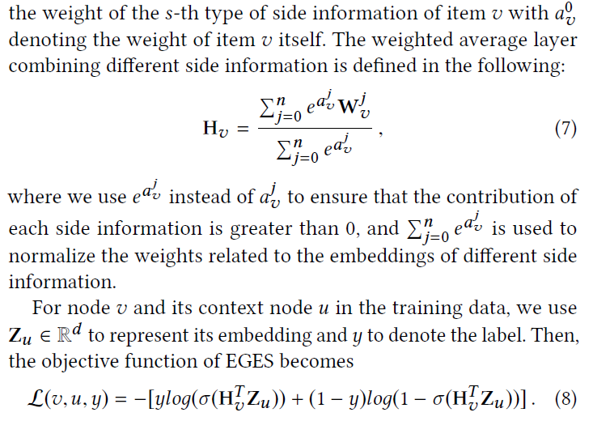
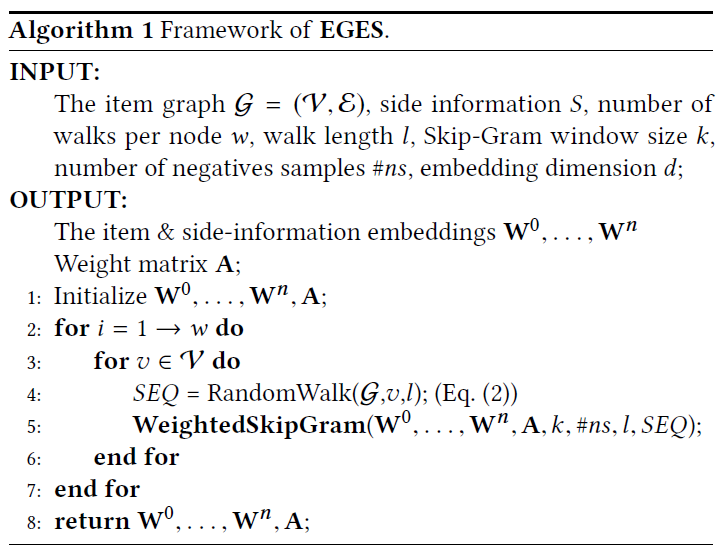
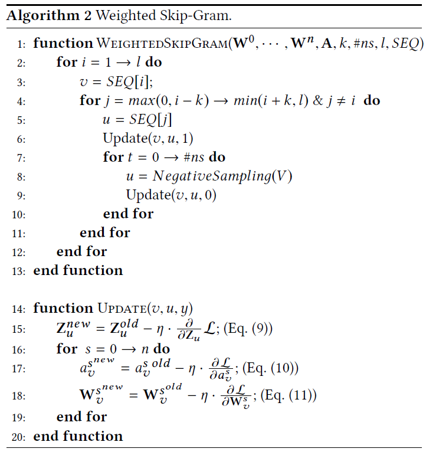

## 推荐系统中的用户画像构建与应用

目前信息处理系统有两种工作模式。第一种是“拉”模式，用户提交查询，搜索引擎返回搜索结果；第二种是“推”模式，用户不需要显式提交任何查询和兴趣偏好，推荐系统通过自动化算法来进行“信息”推送。 

推荐系统的终极目标就是能够理解用户，其中一个核心技术就是用户画像构建。用户画像(user profiling)是指在应用系统中，利用用户的相关数据（如文本、图片、社交行为等）来构建未知的用户属性特征等重要信息。用户画像具有广泛的应用领域，本文主要回顾和总结其在推荐系统中的构建与应用。 特别地，将主要关注基于社交媒体平台建立的应用系统，即社交媒体服务。用户信息纷繁复杂，而且存在缺失或者虚假信息的情况，这使得挖掘用户的属性信息具有一定的挑战性。在上述背景下，用户画像旨在为社交用户构建一个可量化的信息表示，包括简单的属性特征（如年龄、性别等）以及复杂的模式特征（如网络隐含表示等），从而应用到广泛的社交媒体应用系统中，以改进用户体验以及系统服务。 

### 用户画像的构建方法 

#### 显式用户画像的构建方法 

显式用户画像是指对应的画像表示中的特征或者维度都相对容易解释，易于直观理解。 

**用户属性特征的直接抽取与加工**

首先考虑简单的社交信息特征抽取。很多社交网站要求用户在注册时填写一些公开的身份信息。这些信息可以直接作为用户画像的信息输入和呈现形式。赵(Zhao)等人[1, 2]利用微博用户注册的属性信息进行用户画像构建，包括性别、年龄、职业、兴趣等。在构建过程中，对于部分连续或者多取值的属性进行区间离散化，减少表示维度。例如，将年龄按照少年、青壮年和老年进行分段。

除了简单的特征抽取外，还可以对获取的社交信息进行初步加工。从自然语言角度来看用户画像问题，具有不同属性特征的用户，其用词或者主题分布也不同。==常用的用户画像技术是利用用户发表的文本信息为用户打标签。==其中，TextRank[3]是一种面向文本的传统标签抽取技术。它利用标签词汇的共现信息构建语义图，然后使用PageRank算法进行排序，选择具有代表性的标签。基于TextRank，赵(Zhao)等人[4] 针对微博用户设计了一种基于主题的标签抽取方法。通过融入主题信息，使得抽取算法能够更好地进行以话题为导向的标签抽取。在文献[5]中，赵(Zhao)等人进一步拓展了文献[1]中的工作，对于文本信息使用了分布式表示学习和主题模型的方法进行初级加工表示。这些表示方法可以捕捉隐含的语义信息，克服传统标签表示中的数据稀疏问题。

在信息抽取过程中，还可以融入任务信息，加强用户画像的可用性。例如，肖(Xiao)等人[6]利用微博中用户的权威度（例如PageRank值）以及文本相关度（与知乎提问的语义相似性），来改进对知乎网上最佳答案的预测。基本的假设如下：给定一个问题，如果一个知乎用户在新浪微博中的权威度越高，那么他的答案就越有可能成为最佳答案；如果一个知乎用户所发表的新浪微博内容与问题相关度越高，那么他的答案就越有可能成为最佳答案。对于原始的用户文本信息以及网络结构信息进行初步加工学习，就可以使应用系统更符合任务目标。

**用户属性特征的补全与推断**

在社交媒体网站上，用户属性信息经常存在缺失现象，如用户隐去了年龄。这个问题影响上述直接抽取方法的准确性和适用性。为了解决此问题，可以通过用户自身的多种数据进行推断。例如，可以根据用户使用表情符号的数量和样式帮助预测用户的年龄和性别。较为深层次的推断包括建立复杂的学习模型，补全属性信息，如轨迹数据 [7]、移动数据 [8]。还可以通过社交媒体网站中其他交互链接关系，例如微博中的关注、转发和点名关系，利用图正则化技术或者标签传播算法对属性信息进行关联建模，就可以进行属性信息的全局推理。

还可以考虑在数据层面上丰富信息来源。例如，一些用户会在微博上公布自己的学校、博客、学术主页等链接。如果能够将同一个用户在不同社交网络上的账号进行统一关联（称为跨网站的实体链指），那么就可以整合这些网站上的用户信息，更好地补全用户属性信息。其中的关键技术是，如何设计有效的算法来链接同一个用户的多个社交网络账号。刘(Liu)等人[9] 利用用户社交账号的昵称以及语言学模式进行用户链指，袁(Yuan)等人[10] 利用用户的自关联行为构建图算法进行用户链指。

#### 隐含用户画像的构建方法 

与显式用户画像相对应，隐含用户画像主要是为了构建用户信息的量化表示，作为下游应用的输入，而画像表示中的特征或者维度往往都是隐含的、难于直观解释的。

**基于主题模型的用户画像构建**

基于主题模型的用户画像构建方法假设用户的画像属性（地域、职业、年龄等）与其在社交媒体发布文本内容的主题是有较强关联性的，例如，程序员更多提及的主题可能包括编程语言、开发工具等，而医生更多的是在讨论医院、药品等。通过从用户所发表的文本数据中抽取隐含的主题信息，进而将用户兴趣刻画为主题集合上的概率分布，作为用户画像的量化表示。可以使用多种主题模型用于用户画像构建，这些方法主要是在 LDA (Latent Dirichlet Allocation) 模型[11]上进行改进与扩展，陆续出现了 ATM[12] 、ARTM[13]、APTM[14]、AITM[15]、LITM[16]、Topic-link LDA[17]等多种模型。ATM(Author-Topic Model)是从作者的角度考虑文本中主题的生成。针对学术文章语料数据集，ATM 对于每个作者不再限定该作者只能对应一个主题，而是对应于一个主题分布，所有作者共享一个主题集合。ARTM(Author-Recipient-Topic Model)是在 ATM 基础上提出来的，其重点考虑信息传递过程中发送者和接受者之间的角色关系，比较典型的有电子邮件收发者之间的关系，增加对接受者信息的考虑而进行用户建模。APTM(Author-Persona-Topic Model)，从角色的生成方式对 ARTM 进行扩展。在 ATM 和ARTM 基础上，可以进一步考虑用户兴趣和主题的关系，例如 AITM(Author Interest Topic Model)和LITM(Latent-Interest-Topic Model)。刘(Liu)等人[17]认为用户在社交媒体上发布的文本主题与其社交关系有着较强的内在联系，因此将主题模型及用户的社交网络关系联合建模学习。基于主题的用户画像表示，能够有效描述用户兴趣的多样性，而且主题数量远远小于标签（如关键字）的数量，形成了一个用户信息的隐含低维表示，减少了所需要的存储空间和应用复杂度。此外，基于主题的用户模型可以将用户和各种资源（如文本）通过主题进行关联，充分利用挖掘数据信息中的用户特征。

**基于深度学习的用户画像构建**

近年来，深度学习方法使很多任务的完成效果得到了提升。其中很重要的原因就是引入了分布式表示的思想，以及对于深度模型的有效（效果和速度上）训练方法。利用分布式表示学习方法刻画用户社交关系网络，对于构建用户画像起着至关重要的作用。佩罗齐(Perozzi)[18]等人提出了DeepWalk的方法，通过在网络中随机游走的方式产生若干随机序列化路径，然后通过Skip-gram模型对节点的隐含向量进行更新，从而学习到节点的低维表示。给定一个用户的社交关系网络，可以使用DeepWalk算法得到用户的分布式表示。这种低维的隐含向量可以作为用户画像的量化表示。

DeepWalk是一种较为通用的图结构分布式表示学习方法，它可以产生一般化的用户分布式表示从而用于多种任务。然而，这种方法没有利用任何有标记的数据，其结果是产生的向量不具有任务针对性。为了提升用户画像构建的效果，文献[19]在DeepWalk得到的随机游走路径中引入用户的标记信息，然后在新的路径中学习用户的分布式表示。如原路径为：*user*1→*user*2→*user*3→…→*usern*，引入有监督信息(label)以后路径变为：*user*1→*label*1→ *user*2→*label*2→*user*3→*label*3→…→*usern*→*labeln*，从而使得DeepWalk学习出来的用户分布式表示更适用于特定任务。

对于用户画像构建任务，如何将用户的其他信息（例如文本特征）和社交网络结构信息融合使用，是最近用户画像领域的研究热点。比较直接的一种联合学习方法是对于每种信息分别学习出表示向量，然后进行组合形成一个新的用户向量[19]。然而这种方法并没有充分挖掘文本数据以及社交网络之间的关联关系。缪拉(Miura)等人[20]在学习用户的文本分布式表示和关系分布式表示的基础上，提出了基于注意力机制的神经网络模型，该模型可以将二者进行融合。孙(Sun)等人[21]则是在DeepWalk框架基础上，将文本信息看成一种特殊的网络节点，将用户文本信息和社交网络信息映射到统一的向量空间，并且在模型训练过程中联合训练二者的分布式表示。通过这种方式使得网络结构的损失能同时反向传播到文本和网络节点上，从而学习出文本和网络结构的联合表示。

#### 受众画像的构建 

除了用户画像以外，还可以考虑对物品建立受众画像。例如，一款产品的受众特征可以刻画为“单身未婚女性、年龄18~24岁、大学文化程度”。产品受众画像，指的是一个产品潜在的购买人群的整体属性特征。产品受众群体属性特征提供了一款产品的候选受众的典型个人特征，对于产品销售和推广具有重要意义。 

在文献[1, 2]中，主要利用以下两种社交数据进行产品受众特征的学习。

==利用电商平台的评论信息==：用户有时候会在产品评论中显式地提及与受众属性相关的信息。例如，“这款手机不错，给儿子买一个”。暗示当前的产品适合该评论者的儿子，也就是他的儿子是该产品的一个潜在受众，同时也可以推断 [年轻][男士] 是受众的两个特征。

==利用微博平台的关注信息==：在微博中，用户可以自由地表达自己对于某款产品或者品牌的情感。如果情感取向为“正”（褒），就可以把当前用户当作一个潜在的产品受众。搜集这样的正向情感用户，聚合他们的个人属性信息，可以推断该产品的受众特征。通过用户行为来捕捉用户对于某一产品的正向情感，包括关注关系(following)和提及关系(mentioning)：如果一个用户对某一产品感兴趣或者己经使用过该产品，则他很有可能通过发表状态文本的形式来表达自己对于该产品的情感取向。给定一款产品，可以使用产品名来检索得到所有包含该产品名字的微博，然后使用基于机器学习的方法来判定微博文本中的用户情感取向，把具有正向情感的用户当作该产品的受众。

通过上述方法对受众属性信息进行统计，然后以概率形式表示。具体的构建过程为，首先将属性维度离散化，然后根据收集到的受众属性信息，对不同维度进行数量更新，统计结束时将数量归一化成概率，最后得到的概率分布就是受众画像的表示。每个属性对应一个概率分布。 通过受众属性的分布特征可以很好地了解一款产品对应受众各种属性信息的分布情况。

### 用户画像在推荐系统中的应用 

在推荐模型的构建过程中，用户画像可以作为量化特征直接用于推荐模型；还可以通过刻画用户和物品之间的异质关联关系来完成推荐任务；此外，用户画像还可以通过映射变换转化为合适的数据形式，使之能够完成跨网站的推荐任务。

**用户画像信息的直接应用**

最早的推荐任务只关心用户、物品和反馈（如评价）三个方面的信息，因此可以使用一个二维矩阵来刻画推荐任务的输入，分别对应一个矩阵中的行、列、值。常见的推荐算法包括==基于近邻的协同过滤算法、矩阵分解==等。近些年，矩阵分解算法得到了广泛应用，具有很好的实践效果，并进一步丰富了可供推荐算法使用的信息。例如，在新闻推荐中，可以获取新闻的属性信息（如文本内容、关键词、时间等），同时可以获取用户的属性信息以及点击、收藏和浏览行为等。

==因子分解机(Factorization Machine, FM)==[22]是一种基于矩阵分解拓展而来的推荐模型，可以用于解决回归预测问题或者排序学习问题。因子分解机将特征信息进行统一编码表示（包括用户和待推荐的物品），每一个特征维度对应一个低维的隐含因子表示。最后的学习任务可以由二阶特征的交互项线性组合得来，在数学上使用两个特征所对应的隐含因子的点积来刻画特征的交互。相比传统的矩阵分解算法，因子分解机由于刻画了特征之间的二阶交互，可以在很大程度上缓解数据稀疏对目标任务的影响。==SVDFeature==[23]和因子分解机具有相似的思想，都是使用隐含因子来刻画特征，使用隐含因子之间的点积来刻画特征间的交互关系。不同的是，SVDFeature的交互有了限制，只有用户的特征和物品的特征才能进行交互，而同属于用户或者物品的特征不能进行交互。

在基于特征的矩阵分解模型中，可以直接引入用户画像信息。在使用过程中，需要对用户画像信息进行有效特征编码，使之适用于因子分解机等基于特征的推荐模型。因子分解机的输入与传统分类回归任务的输入形式较为相似（例如LibSVM），因此在预处理中可能还涉及到特征表示的归一化等步骤。由于此类方法只能刻画矩阵的线性分解关系，使用离散化的用户属性信息（如年龄、性别等）直接抽取得到的特征效果会更好。赵(Zhao)等人在SVDFeature的推荐框架中引入了受众称呼(demographic mention)以及受众类别分布，在一定程度上可以解决面向受众的推荐任务，如被推荐者需要给母亲买一款手机[24]。

**异质用户画像信息的建模与应用**

在社会化推荐系统中，用户或者物品都关联着复杂的异质信息。因此，如何刻画推荐系统中的多源异质信息也是近年来的一个研究热点。作为一个典型方法，异质信息网络[25]提供了一种通用的异质信息表示方式，可以刻画多种类型的节点和多种类型的关系（也就是边）。在异质信息网络中，节点间的关系较为复杂，节点间的邻近性往往不能通过简单的连接关系来反映，而需要通过它们之间的关系路径所对应的语义来刻画，通常使用==元路径(meta-path)==[26] 来计算异质结构所对应的关联性。元路径是指由节点和节点间关系组成的序列，可以用来衡量路径首尾两个节点的相似性。例如，“U→M→A→M→U”，表述了两位用户看了同一演员饰演的两部电影（其中U为User, M为Movie, A为Actor）。基于异质信息网络，推荐任务可以归结为求解网络中的两个实体节点间语义关联性的问题。

异质信息网络可以用来刻画多种用户画像信息，如年龄、性别等。关键点就是将属性信息映射为具有类型的实体，建立起异质信息的关联网络。给定一个异质信息网络，可以选择一些具有特殊语义的元路径，然后基于给定的元路径对实体关联性进行计算。得到了实体间的关联性后，可以直接将关联强度分数用于推荐[27]，也可以进一步将该分数作为目标数值进行矩阵分解[28]，从而获得用户与物品的隐含低维表示，加强推荐效果。

**用户画像信息的跨网站应用**

在实际情况中，往往希望构建的用户画像可以应用到多个系统服务中，因此需要考虑用户画像信息的跨网站使用。赵(Zhao)等人就提出了使用社交属性特征来进行电子商务网站中的产品推荐[1, 2]。主要想法是将用户和产品表示在相同的属性信息维度上，从而完成相关性的计算并用于推荐。首先从公开的社交账号信息中提取用户的个人属性信息，然后从社交媒体网站中学习产品受众聚合的属性信息，即产品受众画像。经过这两个步骤，可以将用户和产品表示在相同的属性维度上。基于这些特征，可以使用基于机器学习的排序算法(learning to rank)实现精准的产品推荐。学习排序算法是在学习阶段给定一些查询和相关文档，试图构建一个排序函数使训练数据的损失最小化。在检索（测试）阶段，给定一个查询，系统会返回一个候选文档的排序列表，该列表是按照相关度分数递减得到的。为了将学习排序的方法应用到产品推荐任务上，需要进行对应的类比：用户可以看作查询，待推荐产品可以看作候选文档。

另外一种方式就是借鉴迁移学习中的思想，将构建的用户画像信息进行变换，使之可以转变为对于推荐系统有用的信息表示。赵(Zhao)等人首先分别在社交平台和电商平台上进行用户的信息表示，然后建立起一个映射函数，使得社交平台的用户画像信息可以被映射为电商平台的用户表示[5]。一旦映射函数建立起来，就可以将用户的社交画像转化为其在电商平台的表示，进而完成推荐任务，可以在一定程度上缓解冷启动问题。与之类似，文献[29]研究了如何解决音乐推荐系统中的冷启动问题。基本思想是从音乐的音频数据中提取相关特征，然后将这些音乐自身的数据特征映射为在推荐中矩阵分解学习得到的隐含向量。虽然该工作主要针对物品端进行研究，但同样的思路可以应用在用户画像中。

**用户画像在工业实践中的应用**

工业界对于用户画像的应用非常广泛。首先是在精准营销上的应用。精准营销是用户画像在工业实践中最直接和有价值的应用，也是各大互联网公司广告部门最注重的工作内容。当给用户打上各种“标签”之后，广告主（即店铺、商家）就可以通过标签圈定他们想要触达的用户，进行精准的广告投放。例如，22~35岁已婚女性是母婴产品的精准营销对象（见图2）。其次，用户画像还可以助力产品开发与推广。一个产品想要得到广泛的应用，受众分析必不可少，特别是在产品早期的设计与推广过程中，可以通过用户画像的方式来研究目标受众，通过对于用户画像的分析及可视化技术直观地理解潜在用户，从而透彻地了解产品受众的需求，更有针对性地完成产品设计与推广。此外，用户画像在行业报告与用户消费研究中也起到重要作用。通过对用户画像的分析可以了解行业动态，比如不同年龄段人群的消费偏好趋势分析、不同行业用户青睐品牌分析、不同地域品类消费差异分析等。这些对于行业趋势的洞察与分析可以指导平台进行更好的运营，也能给相关公司（中小企业、店铺、媒体等）提供垂直领域的深入探究。

对于多种用户画像的构建方法，在真实应用中，往往会同时采取可解释性与应用效果的折中。因此，基于人口统计学以及兴趣标签的直接提取方法是工业界较为常用的用户画像构建方式。还有一些公司会进行大规模主题的挖掘，得到较细粒度的、层次化的、隐含的主题后，再进一步对主题打标签加强可解释性。到目前为止，在公开的工业界报道中，基于深度学习的用户画像构建方法应用还较少，特别是复杂的神经网络模型。通常都是采用浅层的简单神经网络模型抽取数据表示，进而当作特征进行应用。

###研究展望

**推荐结果与可解释性的双赢**

推荐系统中的一个重要问题就是如何加强推荐结果的可解释性，较好的可解释性将会提高用户采用推荐物品的可能性。用户画像应用方法中主要包括直接使用以及变换后使用两种途径。前者可解释性较好，但是由于刻画能力有限，往往很难取得最佳的推荐效果。而后者由于可以使用较为复杂的映射函数，能够在一些特定数据集合上取得较优的推荐效果，但是在一定程度上损害了可解释性。在未来的研究中，如何权衡推荐效果与用户画像的可解释性将是一个研究重点。

**跨平台的信息融合与聚合**

随着信息技术的不断发展，用户画像所面临的推荐场景不再局限于单一用户信息领域和单一物品信息领域。例如，同一个用户可能同时对应多个社交账号信息，可能需要对其推荐多种类型的物品，实现信息的跨网站应用。在这种情况下，对跨平台的用户信息进行融合与聚合尤为重要。之前的工作实际上已经在这方面初露端倪，传统学习模型以及最新的深度学习模型在异构信息融合上已经发挥了一定的效果。然而异质信息的融合与利用仍然是一个研究难点，已有的方法很难通用到多个领域。这一方向亟待在模型技术上取得突破。

**用户画像信息源的扩展以及隐私保护**

如何在用户画像构建过程中同时兼顾保护用户隐私也是未来的一个研究热点。这里面需要解决的主要问题是如何在已有的机器学习算法中融入隐私保护技术，以及如何在不同级别的应用里使用不同等级的用户画像信息。为了更好地解决这一课题，需要数据挖掘与信息安全两个学科进行有效结合，甚至需要一定的硬件隐私保护技术的支持。

## 阿里商品推荐-2018

Wang, Jizhe, et al. "Billion-scale Commodity Embedding for E-commerce Recommendation in Alibaba." *arXiv preprint arXiv:1803.02349* (2018). KDD

解决三个问题：数据量大，数据稀疏，冷启动，后两个用side information解决

图的构成：用户在某个时间段内如一小时购买的商品的序列，比如购买序列为D——A——B，那么就有D——>A——>B，边的权重为商品i和商品j顺序购买的次数。

邻接矩阵M

基于随机游走生成结点序列，然后用skip-gram算法学习结点的embedding，即最大化结点序列中两个结点共同出现的概率。

——捕捉用户行为序列中的高阶相似性，传统的协同过滤方法忽视了这一点

冷启动问题的解决——用side informaton

side information指的是商品的种类、商店、价格等

$W_v^0$商品v的embedding，$W_v^s$ 和商品v attach的第s类side information的embedding。他们的维度相同。将这些向量拼接起来，经过一个平均池化层，得到商品v的aggregated embedding。——GES

不同的side information有不同的贡献——EGES

