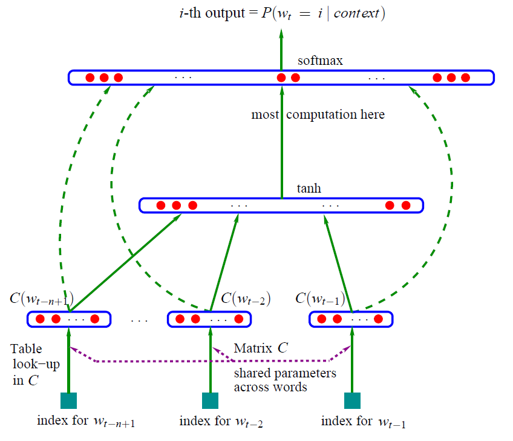

上一节介绍了N-gram模型，它很简单，但是也存在几个缺陷：

1. 无法建模更远的依赖关系。
2. 无法建模出词之间的相似度。比如在训练集中出现过句子"The cat is walking in the bedroom"，那么在碰到句子"A dog was running in a room"时，理应认为其出现的概率也是类似的，因为词"dog"和"cat"的相似性。但是N-gram并不能捕捉到这样的相似性。
3. 泛化能力不够强，对于训练集中没有出现过的n元组条件概率为0的情况，只能用平滑法或者回退法赋予它们概率。

在介绍NNLM模型之前，我们首先要知道词向量是什么。

### 词向量

人类学习过语言，所以可以很轻松地判断一句话是不是人话，但是计算机怎么判断呢？它只认识0和1，并没有学习过人类的语言呀。这也就是为什么我们要将人类的语言（比如文本、声音等）翻译成计算机能够理解的语言（数字），如果一个词对应一个数字的话，那么一句话就对应着一个向量。

那么怎么将文本转换成向量呢？首先要明确我们转换成向量的目的，是要让计算机通过向量尽可能地理解对应的文本的含义。比如你，我，他都是人称代词，其实计算机不需要知道它们是什么类型的词，只需要知道它们是一类词就可以了，至于它们是人称代词还是名词其实是由我们人类去定义的。也就是说，**计算机能够通过词向量获取的信息和人类通过文本看到的信息一致。这就是词向量的目标。**

最早的表示词向量的方法是**one-hot(独热编码)表示法**。首先我们有一个词表，里面包括了我们可能会用到的所有词，每个词占据一个位置。那么词向量就是一个该词表维度大小的向量，词所在位置取值1，其它位置取值0。例如我们的词表有下面9个词：

```
你,我,他,是,谁,哪,里,来,自
```

那么“我”就可以表示为向量[0, 1, 0, 0, 0, 0, 0, 0, 0]，“是”表示为[0, 0, 0, 1, 0, 0, 0, 0, 0]。是不是很简单？

one-hot表示法很简单，但是存在较大的问题：**维度灾难**和**语义鸿沟**。

维度灾难很好理解，如果我们的词表很大（这是通常情况），那么词向量的维度也会一样很大，这会使得数据样本稀疏，计算困难。

语义鸿沟是指one-hot表示法产生的词向量都是彼此正交的（两个向量的内积为0），体现不出任何语义上的联系。比如“我”的向量[0, 1, 0, 0, 0, 0, 0, 0, 0]和“你”的向量[1, 0, 0, 0, 0, 0, 0, 0, 0]的内积（对应位置的元素相乘得到的数值再相加）为0，“我”和“是”的向量的内积也是0，没有任何差异，并不能体现出它们之间的相似性大小。

因此，为了弥补one-hot向量的这些缺陷，分布式向量(distributed representation)就出来了，它将词表示成一个低维的实数向量，且相似的词的向量表示是相近的，可以用向量之间的距离来衡量相似度。

### NNLM

Yoshua Bengio等人于2003年发表的《A Neural Probabilistic Language Model》针对N-gram模型的问题进行了解决。这是第一篇提出神经网络语言模型的论文，它在得到语言模型的同时也产生了副产品词向量。

下图是NNLM的模型结构。



对于一个词序列$w_1, ..., w_T$，其中$w_t\in V$，$V$是一个很大但是有限的单词集合。我们的目标是训练一个模型，来预测给定词序列的条件下，下一个词是$w_t$的概率。

$f(w_t, ..., w_{t-n+1})=\hat P(w_t|w_1^{t-1})$

我们定义$w_i^j=(w_i, w_{i+1},...,w_{j-1}, w_j)$，即$w_i^j$表示从i到j的单词序列。因此上式的$w_1^{t-1}$表示从位置1到t-1的单词序列，也就是第t个单词前面的单词序列。**和N-gram类似，NNLM也假设当前词仅依赖于前n-1个词。**

该模型需要满足约束条件：

$\sum_{i=1}^{|V|}f(i,w_{t-1}, ..., w_{t-n+1})=1$，其中$f>0$

也就是说给定一个单词序列$w_1^{t-1}$，预测下一个词是i的概率，i是词表V中的单词，这些概率之和为1，且每一个概率值均大于0。

我们将模型$f(w_t, ..., w_{t-n+1})=\hat P(w_t|w_1^{t-1})$分解成**两个部分**：

1. 将词表V中的单词i映射为向量的函数$C(i)\in R^m$，这表示每个词的分布式向量表示(distributed feature vectors)。实际上C是一个$|V| \times m$的矩阵,m表示词向量的维度，矩阵的第i行是单词i的词向量。
2. 函数g将词向量表示的输入序列$(C(w_{t-n+1}), ..., C(w_{t-1}))$映射成一个预测下一个词的概率分布，注意这个分布是在词表V上的。g的输出是一个向量，向量的第i个值代表下一个词是i的概率，即$\hat P(w_t=i|w_1^{t-1})$。

两个部分融合得到$f$：

$f(i,w_{t-1}, ..., w_{t-n+1})=g(i, C(w_{t-1}), ..., C(w_{t-n+1}))$

第一个部分对应着输入层，第二个部分对应着隐层和输出层。

首先是将词序列$(w_{t-1}, w_{t-2}, ..., w_{t-n+1})$映射成向量，将它们首尾拼接得到新的向量：

$x=(C(w_{t-1}),C(w_{t-2}), ..., C(w_{t-n+1}))$

其中C是参数矩阵。然后是将输入序列的向量建模成概率分布，由函数g实现。函数g的实现可以是前向神经网络或者循环神经网络或者其它参数化的函数(parametrized function)。论文中的实现如下：

$y=b+Wx+Utanh(d+Hx)$

$tanh(d+Hx)$是隐藏层。这里的$W, H, U, b$都是参数矩阵，W矩阵包含了从输入层到输出层的直连边。$W$可以是$0$，即$x$对$y$没有直接影响。实验结果没有表明直连边是否有效，不过在小样本实验中发现，有直连边可以减少迭代次数，没有直连边的模型泛化能力更好一些。

为了使得概率和为1，还要应用softmax函数到输出层：

$\hat P(w_t|w_{t-1}, ..., w_{t-n+1})=\frac{e^{y_{w_t}}}{\sum_i e^{y_i}}$

$y_i$是$y$的一部分，表示下一个单词是i的概率，这个概率没有经过归一化。

模型训练时，需要最大化下列的式子：

$L=\frac 1 T \sum_t logf(w_t, w_{t-1}, ..., w_{t-n+1};\theta)+R(\theta)$

第一部分是最大化给定序列$w_1^{t-1}$，下一个词是$w_t$的概率，也就是最大化真实序列的概率。第二部分的$R(\theta)$是正则项。

模型是采用随机梯度下降法进行优化的。

对于OOV（词表之外的词），会给它一个初始的向量，这个向量是和这个词上下文相似的词的向量的加权和。即对于一个在$w_{t-n+1}^{t-1}$上下文的词j：

$C(j)\leftarrow \sum_{i\in V}C(i)\hat P(i|w_{t-n+1}^{t-1})$

实验结果表明，NNLM模型比smoothed trigram（平均分布, unigram, bigram, trigram的加权结果）表现更好。接下来就是神经网络模型的天下了~

论文中还有一些并行化计算的部分，感兴趣的可以去看看。

