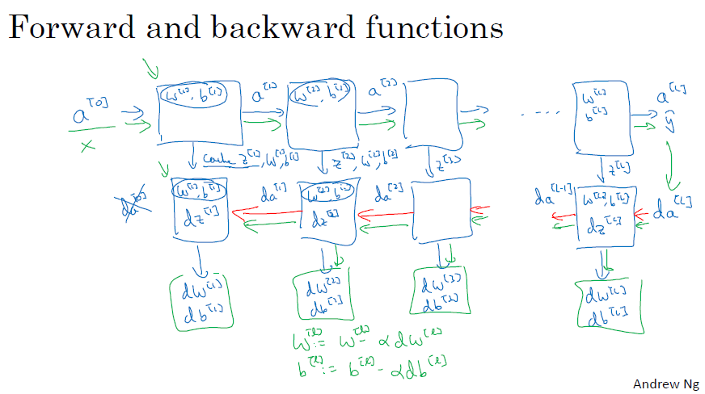

---

---

# 神经网络基础

## What is neural network?

It is a powerful learning algorithm inspired by how the brain works.

Example 1 – single neural network  
Given data about the size of houses on the real estate market and you want to fit a function that will predict their price. It is a linear regression problem because the price as a function of size is a continuous output.  
We know the prices can never be negative so we are creating a function called **Rectified Linear Unit (ReLU)** which starts at zero.  
The input is the size of the house (x)  
The output is the price (y)  
The “neuron” implements the function ReLU (blue line)  

Example 2 – Multiple neural network  
The price of a house can be affected by other features such as size, number of bedrooms, zip code and wealth. The role of the neural network is to predicted the price and it will automatically generate the
hidden units. We only need to give the inputs x and the output y.  

## Supervised learning for Neural Network
In supervised learning, we are given a data set and already know what our correct output should look like,having the idea that there is a relationship between the input and the output.  

**Supervised learning problems are categorized into "regression" and "classification" problems. **

In a regression problem, we are trying to predict results within a continuous output, meaning that we are trying to map input variables to some continuous function. 

In a classification problem, we are instead trying to predict results in a discrete output. In other words, we are trying to map input variables into
discrete categories.

There are different types of neural network, for example **Convolution Neural Network (CNN)** used often for image application and **Recurrent Neural Network (RNN)** used for one-dimensional sequence data such as translating English to Chinses or a temporal component such as text transcript. As for the autonomous driving, it is a hybrid neural network architecture.

**Structured vs unstructured data**  
Structured data refers to things that has a defined meaning such as price, age whereas unstructured data refers to thing like pixel, raw audio, text.

## Why is deep learning taking off?
Deep learning is taking off due to a large amount of data available through the digitization of the society, faster computation and innovation in the development of neural network algorithm.

Two things have to be considered to get to the high level of performance:
1. Being able to train a big enough neural network
2. Huge amount of labeled data

The process of training a neural network is iterative.  
**Idea——Code——Experiment——Idea——Code——Experiment...  **
It could take a good amount of time to train a neural network, which affects your productivity. Faster computation helps to iterate and improve new algorithm.

## Logistic Regression
Logistic regression is a learning algorithm used in a supervised learning problem when the output 𝑦 are all either zero or one. The goal of logistic regression is to minimize the error between its predictions and training data.  
𝐺𝑖𝑣𝑒𝑛 𝑥 ,𝑦̂=𝑃(𝑦=1|𝑥), where 0 ≤𝑦̂≤1  
$\hat{y}^{(𝑖)}=𝜎(𝑤^𝑇𝑥^{(𝑖)}+𝑏)$, where $𝜎(𝑧^{(𝑖)})= \frac{1}{1+ 𝑒^{−𝑧^{(𝑖)}}}$,$𝑥^{(𝑖)}$ the i-th training example

Loss (error) function:

$L(\hat{y}^{(𝑖)}, y^{(𝑖)})= \frac12(\hat{y}^{(i)}−𝑦^{(i)})^2$ 非凸函数
$L(\hat{y}^{(𝑖)}, y^{(𝑖)})= -(y^{(i)}log(\hat{y}^{(i)})+(1-y{(i)})log(1-\hat{y}^{(i)}))$ 凸函数

+ If $𝑦^{(𝑖)}$=1: $L(\hat{y}^{(𝑖)}, y^{(𝑖)})= −log(\hat{y}^{(i)})$ where $log(\hat{y}^{(i)})$ and $\hat{y}^{(𝑖)}$ should be close to 1
+ If $𝑦^{(𝑖)}$=0: $L(\hat{y}^{(𝑖)}, y^{(𝑖)})= −log(1-\hat{y}^{(i)})$ where $log(1-\hat{y}^{(i)})$ and $\hat{y}^{(𝑖)}$ should be close to 0

Cost function
The cost function is the average of the loss function of the entire training set. We are going to find the parameters 𝑤 𝑎𝑛𝑑 𝑏 that minimize the overall cost function. 

$J(w,b)=\frac1m\sum_{i=1}^{m} L(\hat{y}^{(𝑖)}, y^{(𝑖)})=-\frac1m\sum_{i=1}^{m}[(y^{(i)}log(\hat{y}^{(i)})+(1-y^{(i)})log(1-\hat{y}^{(i)}))]$

## Gradient descent

## Computation Graph流程图

链式法则，计算L对w的偏导

## python实现

```python
# sigmoid function, np.exp()
import numpy as np
x = np.array([1,2,3])
s = 1 / (1+np.exp(-x))
print("The sigmoid of x is:"+ str(s))

# sigmoid gradient
# sigmoid_derivative(x)=σ(x)(1-σ(x))
ds = s*(1-s)
print("sigmoid_derivative(x) = " + str(ds))

# Reshaping arrays
# image2vector
image = np.array([[[ 0.67826139,  0.29380381],
        [ 0.90714982,  0.52835647],
        [ 0.4215251 ,  0.45017551]],

       [[ 0.92814219,  0.96677647],
        [ 0.85304703,  0.52351845],
        [ 0.19981397,  0.27417313]],

       [[ 0.60659855,  0.00533165],
        [ 0.10820313,  0.49978937],
        [ 0.34144279,  0.94630077]]])
v = image.reshape((image.shape[0]*image.shape[1]*image.shape[2], 1))
print ("image2vector(image) = " + str(v))

# Normalizing rows
x = np.array([
    [0, 3, 4],
    [1, 6, 4]])
x_norm = np.linalg.norm(x,axis=1,keepdims=True)
x = x / x_norm
print("normalizeRows(x) = " + str(x))

# broadcasting and softmax function
# 矩阵的每个元素= exp(xik)/sum(exp(xij)),即每个元素的exp除以该行所有元素的exp值之和
x = np.array([
    [9, 2, 5, 0, 0],
    [7, 5, 0, 0 ,0]])
x_exp = np.exp(x)
x_sum = np.sum(x_exp, axis=1, keepdims=True)
s = x_exp / x_sum
print("softmax(x) = " + str(s))
```

```python
# Vectorization
import time

x1 = [9, 2, 5, 0, 0, 7, 5, 0, 0, 0, 9, 2, 5, 0, 0]
x2 = [9, 2, 2, 9, 0, 9, 2, 5, 0, 0, 9, 2, 5, 0, 0]

### CLASSIC DOT PRODUCT OF VECTORS IMPLEMENTATION ###
tic = time.process_time()
dot = 0
for i in range(len(x1)):
    dot+= x1[i]*x2[i]
toc = time.process_time()
print ("dot = " + str(dot) + "\n ----- Computation time = " + str(1000*(toc - tic)) + "ms")

### CLASSIC OUTER PRODUCT IMPLEMENTATION ###
tic = time.process_time()
outer = np.zeros((len(x1),len(x2))) # we create a len(x1)*len(x2) matrix with only zeros
for i in range(len(x1)):
    for j in range(len(x2)):
        outer[i,j] = x1[i]*x2[j]
toc = time.process_time()
print ("outer = " + str(outer) + "\n ----- Computation time = " + str(1000*(toc - tic)) + "ms")

### CLASSIC ELEMENTWISE IMPLEMENTATION ###
tic = time.process_time()
mul = np.zeros(len(x1))
for i in range(len(x1)):
    mul[i] = x1[i]*x2[i]
toc = time.process_time()
print ("elementwise multiplication = " + str(mul) + "\n ----- Computation time = " + str(1000*(toc - tic)) + "ms")

### CLASSIC GENERAL DOT PRODUCT IMPLEMENTATION ###
W = np.random.rand(3,len(x1)) # Random 3*len(x1) numpy array
tic = time.process_time()
gdot = np.zeros(W.shape[0])
for i in range(W.shape[0]):
    for j in range(len(x1)):
        gdot[i] += W[i,j]*x1[j]
toc = time.process_time()
print ("gdot = " + str(gdot) + "\n ----- Computation time = " + str(1000*(toc - tic)) + "ms")
```

```python
x1 = [9, 2, 5, 0, 0, 7, 5, 0, 0, 0, 9, 2, 5, 0, 0]
x2 = [9, 2, 2, 9, 0, 9, 2, 5, 0, 0, 9, 2, 5, 0, 0]

### VECTORIZED DOT PRODUCT OF VECTORS ###
tic = time.process_time()
dot = np.dot(x1,x2)
toc = time.process_time()
print ("dot = " + str(dot) + "\n ----- Computation time = " + str(1000*(toc - tic)) + "ms")

### VECTORIZED OUTER PRODUCT ###
tic = time.process_time()
outer = np.outer(x1,x2)
toc = time.process_time()
print ("outer = " + str(outer) + "\n ----- Computation time = " + str(1000*(toc - tic)) + "ms")

### VECTORIZED ELEMENTWISE MULTIPLICATION ###
tic = time.process_time()
mul = np.multiply(x1,x2)
toc = time.process_time()
print ("elementwise multiplication = " + str(mul) + "\n ----- Computation time = " + str(1000*(toc - tic)) + "ms")

### VECTORIZED GENERAL DOT PRODUCT ###
tic = time.process_time()
dot = np.dot(W,x1)
toc = time.process_time()
print ("gdot = " + str(dot) + "\n ----- Computation time = " + str(1000*(toc - tic)) + "ms")
```

```python
# Implement the L1 and L2 loss functions
yhat = np.array([.9, 0.2, 0.1, .4, .9])
y = np.array([1, 0, 0, 1, 1])
L1 = np.sum(abs(y-yhat))
L2 = np.dot(y-yhat,y-yhat)
```

```python
# Logistic Regression with a Neural Network mindset
# Packages
# numpy is the fundamental package for scientific computing with Python.
# h5py is a common package to interact with a dataset that is stored on an H5 file.
# matplotlib is a famous library to plot graphs in Python.
# PIL and scipy are used here to test your model with your own picture at the end.
import numpy as np
import matplotlib.pyplot as plt
import h5py
import scipy
from PIL import Image
from scipy import ndimage
from lr_utils import load_dataset

%matplotlib inline
# assignment2_2
# A trick when you want to flatten a matrix X of shape (a,b,c,d) to a matrix X_flatten of shape (b ∗∗ c ∗∗ d, a) is to use:
X_flatten = X.reshape(X.shape[0], -1).T      # X.T is the transpose of X
```


# 浅层神经网络

## Activation functions激活函数

sigmoid activation function:  $a=\frac{1}{1+e^{-z}}$

二分分类，输出结果是0或者1，用作输出层，只有同时满足这三个条件时，sigmoid函数才会好过别的激活函数。

tanh activation function: $a = \frac{e^z- e^{-z}} {e^z+ e^{-z}}$

tanh激活函数是将sigmoid函数向下移动，它有类似数据中心化的效果，使得数据的平均值接近0，从而让下一层的学习更方便。吴恩达老师说，他现在几乎不用sigmoid，因为tanh几乎在任何时候，效果都更好。

Relu activation function: a = max(0,z)

leaky activation Relu function: a = max(0.01z, z)

why do you need non-linear activation  functions?

如果不用非线性的激活函数，而用线性的激活函数，那么输出可直接表示成输入的线性函数形式，无需隐藏层。

==**以下图像位深度神经网络激活函数的函数图像,最有可能发生梯度消失的是(sigmoid函数) **==

如果此部分大于1，那么层数增多的时候，最终的求出的梯度更新将以指数形式增加，即发生梯度爆炸，如果此部分小于1，那么随着层数增多，求出的梯度更新信息将会以指数形式衰减，即发生了梯度消失

==**常用的激活函数有**==：线性函数、斜坡函数、阶跃函数、符号函数、Sigmoid函数、双曲正切函数、Softplus函数、Softsign函数、Relu函数及其变形、Maxout函数等。


## Formulas for computing derivatives

Forward propagation

$Z^{[1]} = W^{[1]}X + b^{[1]}$

$A^{[1]} = g^{[1]}(Z^{[1]}) $

$Z^{[2]} = W^{[2]}A^{[1]} + b^{[2]}$

$A^{[2]} = g^{[2]}(Z^{[2]}) = \sigma(Z^{[2]}) $


Back propagation

$dz^{[2]} = a^{[2]} - y$                              $dZ^{[2]} = A^{[2]} - Y$,         $Y=[y^{(1)}, y^{(2)}, ..., y^{(m)}]$

$dW^{[2]} = dz^{[2]} a^{[1]^T}$                         $dW^{[2]} = \frac1m dZ^{[2]} A^{[1]T}$

$db^{[2]} = dz^{[2]}$                                     $db^{[2]} = \frac1m np.sum(dZ^{[2]}, axis=1, keepdims=True)$

$dz^{[1]} = W^{[2]T} dz^{[2]} * g^{[1]'}(z^{[1]})$      $dZ^{[1]} = W^{[2]T} dZ^{[2]} * g^{[1]'}(Z^{[1]})$

$dW{[1]} = dz^{[1]} x^T$                             $dW{[1]} = \frac1m dZ^{[1]} X^T$

$db^{[1]} = dz^{[1]}$,                                  $db^{[1]} = \frac1m np.sum(dZ^{[1]}, axis=1, keepdims=True)$

## Random Initialization初始化


$W^{[1]}$ = np.random.randn((2,2))*0.01

$b^{[1]}$ = np.zeros((2,1))

$W^{[2]}$ = np.random.randn((1,2))*0.01

$b^{[2]}$ = 0

如果把所有的w都初始化为0，根据对称性原理，第一隐层上的所有节点做的计算和该层上所有的其他节点都是一样的，无论迭代多少次，每次都在计算同样的函数，无法收敛。

对logistic回归，可以将w初始化为0，因为它的输出层只有一个节点。

如果w很大，根据z=wx+b，z也会很大，那么tanh函数值也会很大，在这些地方，tanh函数的斜率很小，接近于0，会导致梯度下降收敛很慢。所以一般初始化w时会再乘上一个比较小的系数。

==xavier==

思想：为了使得网络中信息更好的流动，每一层输出的方差应该尽量相等。

权重方差应满足：$Var[W^i]=2/(n_i+n_{i+1})$

即：2/(输入层神经元个数+输出层神经元个数)

因为[a,b]间的均匀分布的方差为$Var=(b-a)^2/12$，因此Xavier初始化的实现就是下面的均匀分布：

$W\sim U[-\frac{\sqrt{6}}{\sqrt{n_j+n_{j+1}}},\frac{\sqrt{6}}{\sqrt{n_j+n_{j+1}}}]$

https://blog.csdn.net/shuzfan/article/details/51338178

# 深层神经网络

##矩阵维数

$W^{[l]} : (n^{[l]}, n^{[l-1]})$,   $b^{[l]} : (n^{[l]}, 1)$,           $d^W{[l]}: (n^{[l]}, n^{[l-1]}),          db^{[l]}: (n^{[l]}, l)$

$z^{[l]}, a^{[l]}:  (n^{[l]},  1)$

$Z^{[l]}, A^{[l]}:  (n^{[l]},  m)$,         $l=0时，A^{[0]} = X = (n^{[0]}, m)$

$dZ^{[l]},  d A{[l]}: (n^{[l]}, m)$

## Forward and backward functions



Forward propagation for layer $l$

Input $a^{[l-1]}$

Output $a^{[l-1]}$, cash ($z^{[l]}$)


$z^{[l]} = W^{[l]} a^{[l-1]} + b^{[l]},   a^{[l]} = g^{[l]}(z^{[l]})$                  $Z^{[l]} = W^{[l]} A^{[l-1]} + b^{[l]},   A^{[l]} = g^{[l]}(Z^{[l]})$

对于正向传播，要遍历每一层是需要有一个显示循环的。

Backward propagation for layer $l$

Input $da^{[l]}$

Output $da^{[l-1]}, dW^{[l]}, db^{[l]}$


$dz^{[l]} = da^{[l]} * g^{[l]'} (z^{[l]})$                                       $dZ^{[l]} = dA^{[l]} * g^{[l]'} (Z^{[l]})$

$dW^{[l]} = dz^{[l]} a^{[l-1]}$                                             $dW^{[l]} = \frac1m dZ^{[l]} A^{[l-1]T}$

$db^{[l]} = dz^{[l]}$                                                        $db^{[l]} = \frac1m np.sum(dZ^{[l]}, axis=1, keepdims=True)$

$da^{[l-1]} = W^{[l]T} dz^{[l]}$                                          $dA^{[l-1]} = W^{[l]T} dZ^{[l]}$

$dz^{[l]} = W^{[l+1]T} dz^{[l+1]} * g^{[l]'}(z^{[l]})$


## Parameters vs Hyperparameters

Parameters: $ W^{[1]},  b^{[1]}, W^{[2]}, b^{2]}, W^{[3]}, b^{[3]}$

Hyperparameters:  能够控制W和b的值

Learning rate $\alpha$,    # iterations,  # hidden layer L,  # hidden unites $n^{[1]}, n^{[2]},...$,  choice of activation functio

other : Momentum,  minibatch size, regularization parameters

参数是指模型能自己计算出来的，比如w，b，a等；而超参数是指需要人经验判断的参数，比如学习率，迭代次数，网络模型的形状，包括层数及每层有多少节点。


