# 深度学习的实用层面

## 训练/开发/测试集

training set, Hold-out cross validation set / Developement set, testing set

训练集用来训练，验证集用来优化模型，选择参数，测试集用来无偏评估模型效果

小数据时：train/test:70/30,     train/dev/test: 60/20/20

大数据时：如1百万，98/1/1，超过1百万，99.5/0.4/0.1


Mismatched train/test distribution

例如，Training set是来自网页的猫的图片，比较清晰，而Dev/test sets是来自使用app的用户所拍的照片，不清晰

**要确保dev和test sets来自同一分布**

没有test set也可以（只有dev set）

## 偏差/方差

high bias——underfitting

high variance——overfitting

在human error约为0%，即optimal/bayes error约为0%,且训练集和验证集来自同一分布的前提下

| Train set error |      1%       |    15%    |           15%           |         0.5%          |
| :-------------: | :-----------: | :-------: | :---------------------: | :-------------------: |
|  Dev set error  |      11%      |    16%    |           30%           |          1%           |
|                 | high variance | high bias | high bias&high variance | low bias&low variance |

## 机器学习基础

High bias(training data performance)——Bigger network, Train longer, NN architectural search

High variance(dev set performance)——More data, Regularization, NN architectural search

bias-variance tradeoff问题其实已经不存在了，在深度学习早期阶段，减少其中一个势必会使得另一个受影响，而现在，只要保证网络够深、训练时间够长、训练数据多等（也就是上面说到的高偏差高方差的解决方案），就可以做到减少其中一个而不影响到另一个。

# Regularizing your neural network

## 正则化

Logitstic regression

$min_{w,b} J(w,b),  w\in R^{n_x}, b\in R$

$\lambda$ = regularization parameter

$J(w,b)=\frac1m\sum_{i=1}^{m} L(\hat{y}^{(𝑖)}, y^{(𝑖)}) + \frac{\lambda}{2m} ||w||_2^2 +  \frac{\lambda}{2m} b^2$

最后一项忽略，因为b只是众多参数中的一个，影响不大。

L2 regularization， $||w||_2^2 = \sum_{j=1}^{n_x} w_j^2 = w^Tw$

L1 regularization，$\frac{\lambda}{2m}\sum_{j=1}^{n_x} |w_j| = \frac{\lambda}{2m}||w||_1$

​                                  $w$ will be sparse


Neural network

$J(W^{[1]}, b^{[1]}, ..., W^{[l]}, b^{[l]}) = \frac1m \sum_{i=1}^{n} L(\hat{y}^{(𝑖)}, y^{(𝑖)}) + \frac{\lambda}{2m} \sum_{l=1}^{L} ||W^{[l]}|| _F^2$

$||W^{[l]}|| _F^2 = \sum_{i=1}^{n{[l]}} \sum_{j=1}^{n{[l-1]}} (W_{ij}^{[l]}) ^2 $,  $ W^{[l]} : (n^{[l]}, n^{[l-1]})$

Frobenius norm

$dW^{[l]} = (from backprop) + \frac{\lambda}{m} w^{[l]}$

$\frac{\partial J}{\partial W^{[l]}} = dW^{[l]}$

$W^{[l]} : = W^{[l]} - \alpha dW^{[l]} $

$W^{[l]} : = W{[l]} - \frac {\alpha \lambda}{m} W^{[l]} - \alpha (from backprop) = (1-\frac{\alpha \lambda}{m}) w^{[l]} - \alpha (from backprop)$

"Weight decay"权重衰减，$(1-\frac{\alpha \lambda}{m})$

权重衰减：A regularization technique (such as L2 regularization) that results in gradient descent shrinking the weights on every iteration.

## 为什么正则化可以减少过拟合？

通过使部分权重接近于0消除或减小这些隐藏层的影响，网络变得简单，避免过拟合

比如对于tanh激活函数，即$g^{(z)}: tanh(z)$ 时，当$\lambda$ 增大时，$W^{[l]}$ 减小，$z^{[l]} = W^{[l]} a^{[l-1]} + b^{[l]}$ 也会减小，那么g(z)就接近于一个线性函数，因为tanh在0附近接近于线性函数。

所以极端情况下，每一层都接近线性函数，整个网络接近线性——防止了过拟合

对于$J(W^{[1]}, b^{[1]}, ..., W^{[l]}, b^{[l]}) = \frac1m \sum_{i=1}^{m} L(\hat{y}^{(𝑖)}, y^{(𝑖)}) + \frac{\lambda}{2m} \sum_{l=1}^{L} ||W^{[l]}|| _F^2$ 

用梯度下降法求解时，the cost function J decreases monotonically after every elevation of gradient descent，注意J要用加入正则化项后的J，否则可能不会递减。

## Dropout 正则化

dropout会遍历网络的每一层，并设置消除神经网络节点的概率

对于每一个训练样本，我们都将采用一个精简后的神经网络来训练它

Implementing dropout("Inverted dropout")

Illustrate with layer l=3, keep-prob = 0.8

d3 = np.random.rand(a3.shape[0],a3.shape[1]) <keep-prob

激活函数a3=np.multiply(a3,d3)

a3 /= keep-prob, 为了弥补消除的20%

50 units —— 10 units shut off

$Z^{[4]} = W^{[4]} a^{[3]} + b^{[4]}$

在做预测的时候不用dropout

## Understanding Dropout

Intuition: Can't rely on any one feature,因为任意一个feature都有可能被消除 so have to spread out weigths.

dropout的作用类似于正则化

如果某一层更容易过拟合，比如参数很多，keep-prob可以设置得更小。或者有些层使用dropout，有些层不用。

计算机视觉领域常常用，因为没有足够数据，常常过拟合

缺点：代价函数不再well-defined，不知道在每次梯度下降时，代价函数是否减小了。可以先关闭dropout，使用梯度下降看看代价函数是否减小，再开启dropout。

## 其它正则化方法

Data augmentation

扩大训练集代价很高，可以扩增数据集。比如把图片水平翻转，随机裁剪图片，加入训练集。

对于数字，可以加上随机的旋转和变形

这些额外的伪训练样本能增加的信息量不如全新的样本多，但因为这么做是几乎不需要任何开销的，只有一些计算代价，所以这是一个廉价的方式来为算法获得更多数据。

数据扩增可以作为一种正则化技术，准确地说是接近正则化

Early stopping

在运行梯度下降算法时，通常会画一张图，表明训练误差或者成本函数和验证集误差随着迭代地增加的变化情况。理想状况下，训练的成本函数应该是递减的。通常验证集误差会先下降一段，然后开始增大。所以early stopping就是要在这个最小验证集误差所对应的地方停止。

**这个方法为什么有用？**

 当你刚开始在神经网络上迭代时 ,你的参数w会接近于0 ,因为通过随机初始化(random initialization) ,很可能你给w的初始值是一个较小值 ,因此在训练足够长时间前w仍然很小. 然后随着你继续迭代训练,w越来越大, 可能你的神经网络就有一个很大的参数w了. 所以early stopping做的是通过停在半路 ,你能得到一个不大不小的w值 .这点和L2正则化有点像 通过选一个参数w范数较小的神经网络, 理想状况下就能少点过拟合了.

但是early stopping有一个缺点.

把机器学习过程看作几个不同的步骤，其中之一是你需要一个算法能够最优化成本函数J ，有很多工具可以做到这点， 比如梯度下降、Momentum算法、 RMSProp算法 、Adam算法等等。 然而即便优化了成本函数J ，你还是希望不要过拟合， 我们有些工具可以做到这点 ，比如正则化 、获取更多数据等等。 现在的机器学习中已经激增了很多超参数(hyper-parameter) ，在诸多可能的算法中选择已经相当复杂了。 

如果你有一套工具来优化成本函数J ，而当你专注于优化成本函数J时 ，你在乎的只是找到合适的w和b， 使得J(w,b)尽可能的小 ，其他东西都不用考虑 。然后，避免过拟合， 也可以说成减小方差， 就是另一项完全不同的任务 ，而你在做这件事的时候 又有另一套完全不同的工具来实现 。这个原则我们有时候叫它 正交化(orthogonalization) ，这概念就是指同一时间只考虑一个任务。 

**early stopping的主要缺点**就是 ，它把这两个任务结合了 ，所以你无法分开解决这两个问题。 因为提早停止了梯度下降， 意味着打断了优化成本函数J的过程， 因为现在在降低成本函数J这件事上 ，你做得就不够好了， 同时你又想做到避免过拟合， 所以你没有用不同方法来解决这两个问题， 而是用一个工具解决两个问题， 这就意味着你要做的事情考虑起来更复杂了。

 如果不用early stopping ，可以替代的选择是L2正则化， 那么你可以尽可能久的训练神经网络， 这样可以让超参数的搜索空间更易分解 ，也因此更易搜索。 但这么做的缺点是 ，你可能必须尝试大量的正则化参数λ的值， 这使得搜索这么多λ值的计算代价很高 ，而**early stopping的优势**是只要运行一次梯度下降过程 ，你需要尝试小w值 、中等w值和大w值， 而不用尝试L2正则化中超参数λ的一大堆值 。

尽管有些缺点,很多人还是在使用它,吴恩达偏爱只用L2正则化，并尝试不同的λ值，这预设你的计算能力是足够的 ,但早终止法确实能够实现相近的效果，而不用一个个尝试不同的λ值 。

# Setting up your optimization problem

## 正则化输入

均值，方差，x = (x-μ)/σ

训练集和测试集应该做同样的归一化操作

为什么要归一化？

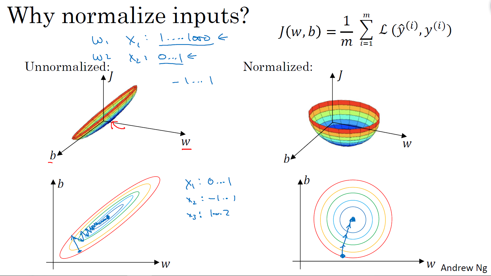

## 梯度消失与梯度爆炸

梯度消失/爆炸

当每一层的W都比1大很多或者比1小很多时，激活函数将会指数级增长或下降，与该层相关的梯度或导数也会指数级增长或下降。

##神经网络的权重初始化

## Weight Initialization for Deep Networks

激活函数是Relu时，设置W = np.random.randn(shape) * np.sqrt($ \frac{2}{n^{l-1}}$)

激活函数是tanh时，设置W = np.random.randn(shape) * np.sqrt($ \frac{1}{n^{l-1}}$) 或 np.sqrt($\frac{2}{n^{l-1}+ n^{l}}$)

可以减缓梯度消失和爆炸问题

## 梯度的数值逼近

双边误差比单边误差更接近真实导数

即$\frac{f(\theta + \epsilon) - f(\theta - \epsilon)}{2\epsilon}$ 比 $\frac{f(\theta + \epsilon) - f(\theta)}{\epsilon}$ 更接近$f(\theta)$ 的导数 $g(\theta)$

## 梯度检验

Take $ W^{[1]}, b^{[1]}, ..., W^{[l]}, b^{[l]} $ and reshape into a big vector $\theta$

Take $ dW^{[1]}, db^{[1]}, ..., dW^{[l]}, db^{[l]} $ and reshape into a big vector $d\theta$

for each i

$ d\theta_{approx}[i] = \frac{J(\theta_1, \theta_2, ..., \theta_{i+\epsilon}, ...) - J(\theta_1, \theta_2, ..., \theta_{i-\epsilon}, ...)}{2\epsilon} $

$\approx d\theta[i] = \frac{\partial J}{\partial\theta_i} $

$ d\theta_{approx}\approx d\theta$ ？

check $ \frac {||d\theta_{approx}- d\theta||_2}{||d\theta_{approx}||_2- ||d\theta||_2}$

当$\epsilon = 10^{-7}$ ，上式 $\approx 10^{-7}$   ——Great!， $\approx 10^{-5}$   ——OK，$\approx 10^{-3}$   ——Worry

## 关于梯度检验实现

* Don't use in training - only to debug
* If algorithm fails grad check, look at components to try to identify bug
* Remember regularization
* Doesn't work with dropout
* Run at random initialization; perhaps again after some training.


# 优化算法

## Mini-batch 梯度下降法

假设X的维度是$(n_x, m)$ , Y的维度是(1, m)，假设m=5,000,000,   且5,000 mini-batches of 1000 each，则mini-batch t的样本为$X^{\lbrace t \rbrace}, Y^{\lbrace t \rbrace}$

repeat {

for t = 1, ..., 5000

​    {  Forward prop on $X^{\lbrace t \rbrace}$

​       		 $Z^{[1]} = W^{[1]}X^{\lbrace t \rbrace} + b^{[1]}$

​		$A^{[1]} = g^{[1]}(Z^{[1]}) $

​		...

​		$A^{[l]} = g^{[l]}(Z^{[l]}) $

​	Compute cost  $J^{\lbrace t \rbrace} = \frac{1}{1000} \sum_{i=1}^{m} L(\hat{y}^{(𝑖)}, y^{(𝑖)}) + \frac{\lambda}{2*1000} \sum_{l=1}^{L} ||W^{[l]}|| _F^2$

​	Backprop to compute gradient with $J^{\lbrace t \rbrace} (using X^{\lbrace t \rbrace}, Y^{\lbrace t \rbrace})$

​	$W^{[l]} = W^{[l]} - \alpha dW^{[l]}, b^{[l]} = b^{[l]} - \alpha db^{[l]}$

​    }   **1 epoch —— pass through training set.**

}

## 理解mini-batch 梯度下降法

Batch gradient descent的cost function随着迭代次数的增加而下降

Mini-batch gradient descent的cost function不一定随着t的增加而下降，有噪声，但总体趋势是下降的

如果 mini-batch size=m: Batch gradient descent.——单次迭代时间太长

如果 mini-batch size=1: Stochastic gradient descent.每个样本都是自己的mini-batch——失去了向量化的speed up,效率低下。永远不会收敛到全局最小值，而是在附近波动。可以通过减少学习速率来减少噪声。

取中间值：学习速度快，利用了向量化Vectorization的优势，可以同时处理多个batch，不必等待


选择mini-batch size

如果训练集很小（m<=2000),用batch gradient descent

典型的mini-batch size:  64, 128, 256, 512.            2的n次方是考虑到计算机内存设置和运行方式

make sure minibatch fit in CPU/GPU memory

## 指数加权平均

$V_t = \beta V_{t-1} + (1-\beta) \theta_t $

$V_t $  as approximatly average over过去 $\approx \frac 1 {1-\beta}$ 天的 数据

$V_t$ 可以画出一条曲线，增大$\beta$ 的值会使得曲线右移（绿色线），减少$\beta$ 的值会增多oscillation振荡（黄色线）

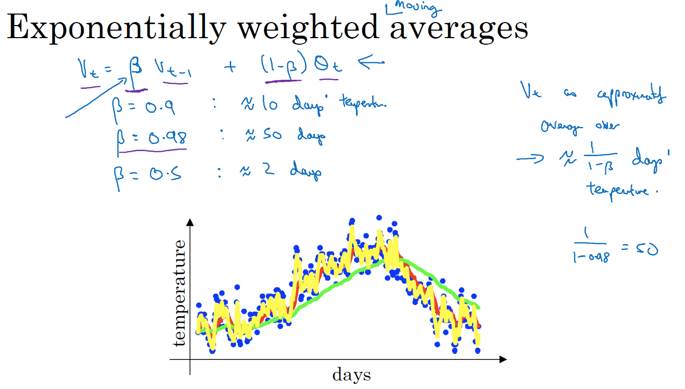

## 理解指数加权平均

反复代入，$V_t =   (1-\beta) \theta_t + (1-\beta)*\beta \theta_{t-1} +......$ 

$V_\theta = 0$

repeat

​	Get next $\theta$

​	$V_\theta = \beta V_\theta + (1-\beta)\theta_t $


## 指数加权平均的偏差修正

$\frac {V_t}{1-\beta^t} $ 作为预测

## 动量梯度下降法

基本思想：计算梯度的指数加权平均数，并利用该梯度更新权重

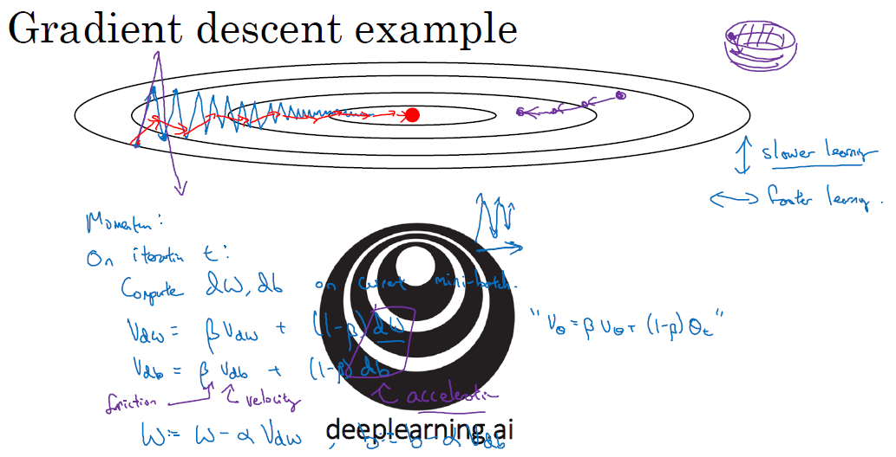

Momentum

On iteration t:

​	Compute dW, db on the current mini-batch

​	$V_{dW}=\beta V_{dW} + (1-\beta)dW$

​	$V_{db}=\beta V_{db} + (1-\beta)db$

​	$W = W -\alpha V_{dW} , b = b -\alpha V_{db}$

纵向：正负抵消，平均值接近于零，波动变小

横轴：方向都是指向最小值方向

如果最小化碗状代价函数，$dW$ 、$db$ 相当于加速度，$V_{dW}$、$V_{db}$ 相当于速度，$\beta$ 相当于摩擦

Hyperparameters: $\alpha, \beta, 一般 \beta=0.9$

好于没有momentum的梯度下降

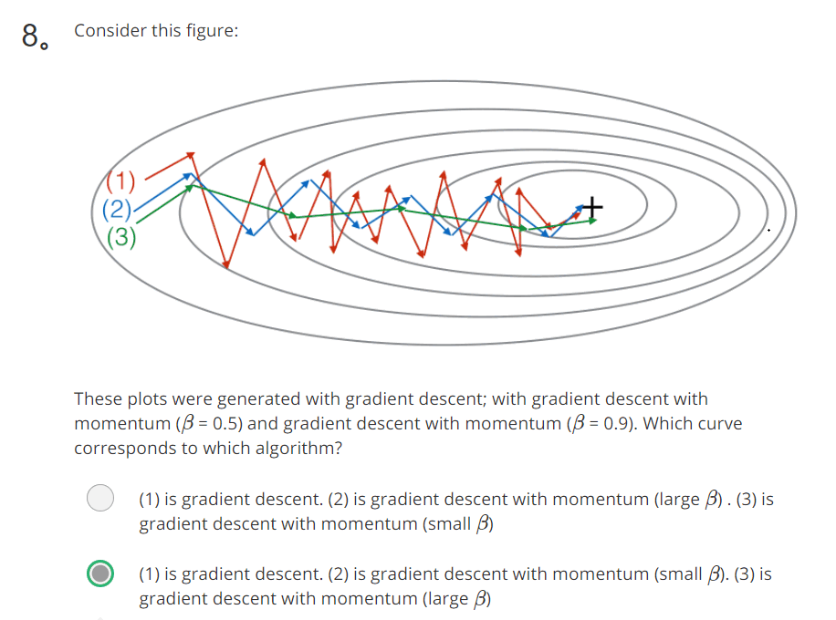

## RMSprop

root mean square prop算法

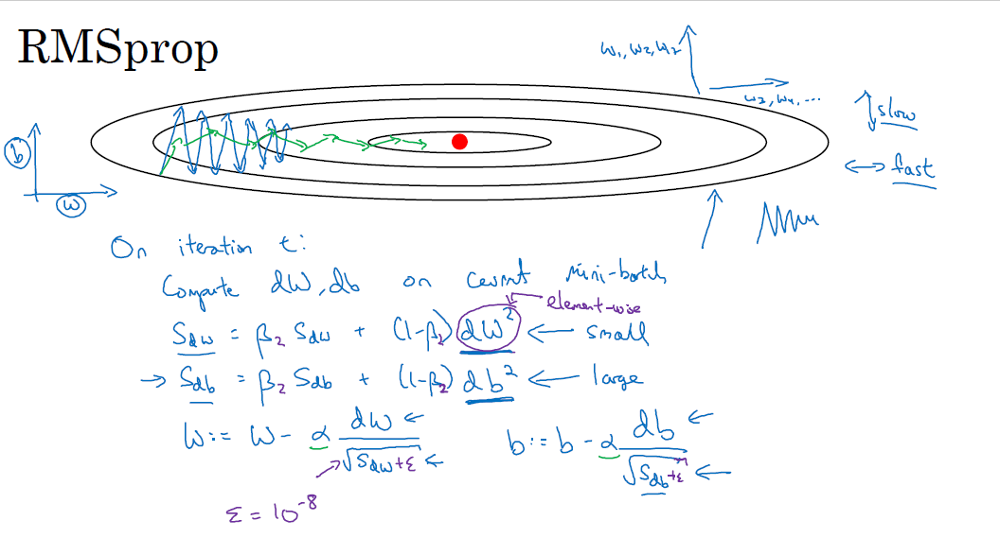

注意：这里的W和b只是向量表示，没有具体意义

On iteration t:

​	Compute dW, db on the current mini-batch

​	$S_{dW}=\beta_2 S_{dW} + (1-\beta_2)dW^2$  ——small     逐元素平方

​	$S_{db}=\beta_2 S_{db} + (1-\beta_2)db^2$  ——large

​	$W = W -\alpha \frac{dW}{\sqrt {S_{dW} + \epsilon}} , b = b -\alpha  \frac{db}{\sqrt {S_{db} + \epsilon}}$

$\epsilon = 10^{-8}$

水平上的更新W会变大，纵轴上的更新b会变大

## Adam 优化算法

Adaptive momentum estimation


$\beta_1,\beta_2,\epsilon$ 的默认值通常设为$\beta_1=0.9,\beta_2=0.999,\epsilon=10^{-8}$

## 学习率衰减

一开始步伐大，快要收敛时步伐小

一次遍历训练集是一次epoch

$\alpha = \frac 1 {1+decayrate*epochnum} \alpha_0$

其它衰减方法

$\alpha = 0.95^{epochnum} *\alpha_0$  指数衰减

$\alpha = \frac k {\sqrt{epochnum}} \alpha_0  或者 \frac k {\sqrt{t}} \alpha_0$

$\alpha$ 先固定一段时间，然后变小...     离散衰减

手动进行衰减


学习率是神经网络训练中最重要的超参数之一,针对学习率的优化方式很多,Warmup是其中的一种

(一)、什么是Warmup?
Warmup是在ResNet论文中提到的一种学习率预热的方法，它在训练开始的时候先选择使用一个较小的学习率，训练了一些epoches或者steps(比如4个epoches,10000steps),再修改为预先设置的学习来进行训练。

(二)、为什么使用Warmup?

由于刚开始训练时,模型的权重(weights)是随机初始化的，此时若选择一个较大的学习率,可能带来模型的不稳定(振荡)，选择Warmup预热学习率的方式，可以使得开始训练的几个epoches或者一些steps内学习率较小,在预热的小学习率下，模型可以慢慢趋于稳定,等模型相对稳定后再选择预先设置的学习率进行训练,使得模型收敛速度变得更快，模型效果更佳。

Example：Resnet论文中使用一个110层的ResNet在cifar10上训练时，先用0.01的学习率训练直到训练误差低于80%(大概训练了400个steps)，然后使用0.1的学习率进行训练。

(三)、Warmup的改进

(二)所述的Warmup是constant warmup，它的不足之处在于从一个很小的学习率一下变为比较大的学习率可能会导致训练误差突然增大。于是18年Facebook提出了gradual warmup来解决这个问题，即从最初的小学习率开始，每个step增大一点点，直到达到最初设置的比较大的学习率时，采用最初设置的学习率进行训练。

1.gradual warmup的实现模拟代码如下:

```python
"""
Implements gradual warmup, if train_steps < warmup_steps, the
learning rate will be `train_steps/warmup_steps * init_lr`.
Args:
    warmup_steps:warmup步长阈值,即train_steps<warmup_steps,使用预热学习率,否则使用预设值学习率
    train_steps:训练了的步长数
    init_lr:预设置学习率
"""
import numpy as np
warmup_steps = 2500
init_lr = 0.1  
# 模拟训练15000步
max_steps = 15000
for train_steps in range(max_steps):
    if warmup_steps and train_steps < warmup_steps:
        warmup_percent_done = train_steps / warmup_steps
        warmup_learning_rate = init_lr * warmup_percent_done  #gradual warmup_lr
        learning_rate = warmup_learning_rate
    else:
        #learning_rate = np.sin(learning_rate)  #预热学习率结束后,学习率呈sin衰减
        learning_rate = learning_rate**1.0001 #预热学习率结束后,学习率呈指数衰减(近似模拟指数衰减)
    if (train_steps+1) % 100 == 0:
             print("train_steps:%.3f--warmup_steps:%.3f--learning_rate:%.3f" % (
                 train_steps+1,warmup_steps,learning_rate))

```

2.上述代码实现的Warmup预热学习率以及学习率预热完成后衰减(sin or exp decay)的曲线图如下:

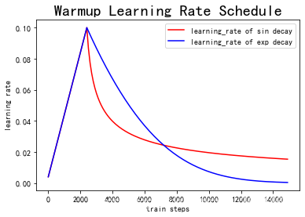


(四)总结

使用Warmup预热学习率的方式,即先用最初的小学习率训练，然后每个step增大一点点，直到达到最初设置的比较大的学习率时（注：此时预热学习率完成），采用最初设置的学习率进行训练（注：预热学习率完成后的训练过程，学习率是衰减的），有助于使模型收敛速度变快，效果更佳。

原文链接：https://blog.csdn.net/sinat_36618660/article/details/99650804

## 局部最优的问题

saddle point，导数为0，不是局部最优，高维空间更容易出现，不太可能困在不好的局部最优点

problem of plateaus   使得学习变慢，走出平稳段

## 优化算法补充

参考https://mp.weixin.qq.com/s/7pUMmMwvo6t06u0lOJlNAA

来自知乎专栏：机器学习炼丹记
作者：Juliuszh

深度学习优化算法经历了 SGD -> SGDM -> NAG ->AdaGrad -> AdaDelta -> Adam -> Nadam 这样的发展历程。 

**1.1 优化算法通用框架**

首先定义：待优化参数：w ，目标函数： f(w)，初始学习率 α。

而后，开始进行迭代优化。在每个epoch t：

1. 计算目标函数关于当前参数的梯度：

   ​	$ g_t = \nabla f(w_t)$

2. 根据历史梯度计算一阶动量和二阶动量： 

   ​	$m_t = \phi(g_1, g_2, ..., g_t)$

   ​	$V_t = \psi(g_1, g_2, ..., g_t)$

3. 计算当前时刻的下降梯度： 

   ​	$\eta_t = \alpha· m_t / \sqrt{V_t}$

4. 根据下降梯度进行更新： 

   ​	$w_{t+1} = w_t - \eta_t$

**2. 固定学习率的优化算法**

**2.1 SGD**

先来看SGD。SGD没有动量的概念，也就是说： 

​		$m_t = g_t ; V_t = I^2$

代入步骤3，可以看到下降梯度就是最简单的 

​		$\eta_t = \alpha · g_t$

SGD最大的缺点是**下降速度慢**，而且可能会在沟壑的两边持续震荡，停留在一个局部最优点。 

**2.2 SGD with Momentum**

为了抑制SGD的震荡，SGDM认为梯度下降过程可以加入惯性。下坡的时候，如果发现是陡坡，那就利用惯性跑的快一些。SGDM全称是SGD with momentum，在SGD基础上引入了一阶动量： 

​		$m_t = \beta_1 \cdot m_{t-1} + (1-\beta_1) \cdot g_t$

一阶动量是各个时刻梯度方向的指数移动平均值，约等于最近 1/(1-β1) 个时刻的梯度向量和的平均值。

也就是说，t 时刻的下降方向，不仅由当前点的梯度方向决定，而且由**此前累积的下降方向**决定。β1的经验值为0.9，这就意味着下降方向主要是此前累积的下降方向，并略微偏向当前时刻的下降方向。想象高速公路上汽车转弯，在高速向前的同时略微偏向，急转弯可是要出事的。

**2.3. SGD with Nesterov Acceleration**

SGD 还有一个问题是困在局部最优的沟壑里面震荡。想象一下你走到一个盆地，四周都是略高的小山，你觉得没有下坡的方向，那就只能待在这里了。可是如果你爬上高地，就会发现外面的世界还很广阔。因此，我们不能停留在当前位置去观察未来的方向，而要向前一步、多看一步、看远一些。

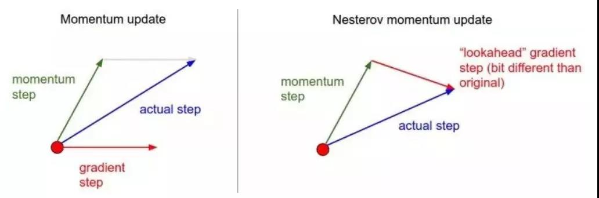

NAG全称Nesterov  Accelerated Gradient，是在SGD、SGD-M的基础上的进一步改进，改进点在于步骤1。我们知道在时刻t的主要下降方向是由累积动量决定的，自己的梯度方向说了也不算，那与其看当前梯度方向，不如先看看如果跟着累积动量走了一步，那个时候再怎么走。因此，NAG在步骤1，不计算当前位置的梯度方向，而是计算如果按照累积动量走了一步，那个时候的下降方向： 

​	$g_t = \nabla f(w_t - \alpha \cdot m_{t-1} / \sqrt{V_{t-1}})$

然后用下一个点的梯度方向，与历史累积动量相结合，计算步骤2中当前时刻的累积动量。 

**3. 自适应学习率的优化算法**

此前我们都没有用到二阶动量。二阶动量的出现，才意味着“自适应学习率”优化算法时代的到来。SGD及其变种以同样的学习率更新每个参数，但深度神经网络往往包含大量的参数，这些参数并不是总会用得到（想想大规模的embedding）。对于经常更新的参数，我们已经积累了大量关于它的知识，不希望被单个样本影响太大，希望学习速率慢一些；对于偶尔更新的参数，我们了解的信息太少，希望能从每个偶然出现的样本身上多学一些，即学习速率大一些。 

**3.1 AdaGrad**

怎么样去度量历史更新频率呢？那就是二阶动量——该维度上，迄今为止所有梯度值的平方和： 

​		$V_t = \sum_{\tau=1}^t g_{\tau}^2$

我们再回顾一下步骤3中的下降梯度： 

​		$\eta_t = \alpha· m_t / \sqrt{V_t}$

可以看出，此时实质上的学习率由$\alpha$变成了$\alpha / \sqrt{V_t}$。 一般为了避免分母为0，会在分母上加一个小的平滑项。因此$sqrt{V_t}$是恒大于0的，而且参数更新越频繁，二阶动量越大，学习率就越小。 

这一方法在**稀疏数据**场景下表现非常好。但也存在一些问题：因为$sqrt{V_t}$是单调递增的，会使得学习率单调递减至0，可能会使得**训练过程提前结束**，即便后续还有数据也无法学到必要的知识。

 **3.2  AdaDelta / RMSRrop**

由于AdaGrad单调递减的学习率变化过于激进，我们考虑一个改变二阶动量计算方法的策略：不累积全部历史梯度，而只关注过去一段时间窗口的下降梯度。这也就是AdaDelta名称中Delta的来历。

修改的思路很简单。前面我们讲到，指数移动平均值大约就是过去一段时间的平均值，因此我们用这一方法来计算二阶累积动量：

​		$V_t = \beta_2 * V_{t-1} + (1-\beta_2)  g_t^2$

就避免了二阶动量持续累积、导致训练过程提前结束的问题了。 

**3.3 Adam**

谈到这里，Adam和Nadam的出现就很自然而然了——它们是前述方法的集大成者。我们看到，SGD-M在SGD基础上增加了一阶动量，AdaGrad和AdaDelta在SGD基础上增加了二阶动量。把一阶动量和二阶动量都用起来，就是Adam了——Adaptive + Momentum。

SGD的一阶动量：

​		$m_t = \beta_1 \cdot m_{t-1} + (1-\beta_1) \cdot g_t$

加上AdaDelta的二阶动量： 

​		$V_t = \beta_2 * V_{t-1} + (1-\beta_2)  g_t^2$

优化算法里最常见的两个超参数 $\beta_1, \beta_2$，都在这里了，前者控制一阶动量，后者控制二阶动量。 

**3.4 Nadam**

最后是Nadam。我们说Adam是集大成者，但它居然遗漏了Nesterov，这还能忍？必须给它加上，按照NAG的步骤1： 

$g_t = \nabla f(w_t - \alpha \cdot m_{t-1} / \sqrt{V_{t-1}})$

就是Nesterov + Adam = Nadam了。

说到这里，大概可以理解为什么j经常有人说 Adam / Nadam 目前最主流、最好用的优化算法了。

**4  Adam:可能不收敛**

这篇是正在深度学习领域顶级会议之一 ICLR 2018 匿名审稿中的一篇论文《On the Convergence of Adam and Beyond》，探讨了Adam算法的收敛性，通过反例证明了Adam在某些情况下可能会不收敛。 

回忆一下上文提到的各大优化算法的学习率： 

​		$\eta_t = \alpha/ \sqrt{V_t}$

其中，SGD没有用到二阶动量，因此学习率是恒定的（实际使用过程中会采用学习率衰减策略，因此学习率递减）。AdaGrad的二阶动量不断累积，单调递增，因此学习率是单调递减的。因此，这两类算法会使得学习率不断递减，最终收敛到0，模型也得以收敛。

但AdaDelta和Adam则不然。二阶动量是固定时间窗口内的累积，随着时间窗口的变化，遇到的数据可能发生巨变，使得$V_t$ 可能会时大时小，不是单调变化。这就可能在训练后期引起学习率的震荡，导致模型无法收敛。

这篇文章也给出了一个修正的方法。由于Adam中的学习率主要是由二阶动量控制的，为了保证算法的收敛，可以对二阶动量的变化进行控制，避免上下波动。

​		$V_t = max(\beta_2 * V_{t-1} + (1-\beta_2)g_t^2, V_{t-1})$

通过这样修改，就保证了 

​		$||V_t|| \geq ||V_{t-1}||$

从而使得学习率单调递减。 

**5 Adam：可能错过全局最优解**

深度神经网络往往包含大量的参数，在这样一个维度极高的空间内，非凸的目标函数往往起起伏伏，拥有无数个高地和洼地。有的是高峰，通过引入动量可能很容易越过；但有些是高原，可能探索很多次都出不来，于是停止了训练。

近期Arxiv上的两篇文章谈到这个问题。

第一篇就是前文提到的吐槽Adam最狠的UC Berkeley的文章《The Marginal Value of Adaptive Gradient Methods in Machine Learning》。文中说到，**同样的一个优化问题，不同的优化算法可能会找到不同的答案，但自适应学习率的算法往往找到非常差的答案（very poor solution）**。他们设计了一个特定的数据例子，自适应学习率算法可能会对前期出现的特征过拟合，后期才出现的特征很难纠正前期的拟合效果。但这个文章给的例子很极端，在实际情况中未必会出现。

另外一篇是《Improving Generalization Performance by Switching from Adam to SGD》，进行了实验验证。他们CIFAR-10数据集上进行测试，Adam的收敛速度比SGD要快，但最终收敛的结果并没有SGD好。他们进一步实验发现，主要是**后期Adam的学习率太低，影响了有效的收敛**。他们试着对Adam的学习率的下界进行控制，发现效果好了很多。

于是他们提出了一个用来改进Adam的方法：**前期用Adam，享受Adam快速收敛的优势；后期切换到SGD，慢慢寻找最优解。**这一方法以前也被研究者们用到，不过主要是根据经验来选择切换的时机和切换后的学习率。这篇文章把这一切换过程傻瓜化，给出了切换SGD的时机选择方法，以及学习率的计算方法，效果看起来也不错。

这个算法挺有趣，算法框架图：

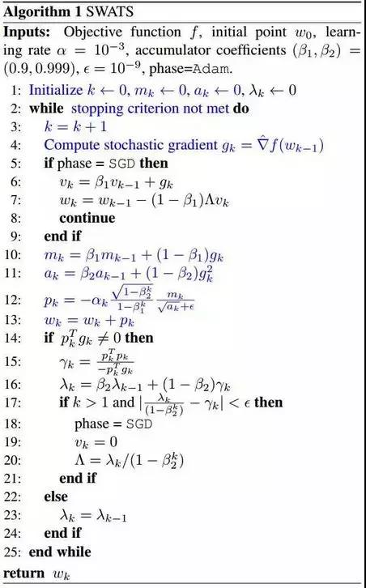

**6 到底用Adam还是SGD**

所以，谈到现在，到底Adam好还是SGD好？这可能是很难一句话说清楚的事情。去看学术会议中的各种paper，用SGD的很多，Adam的也不少，还有很多偏爱AdaGrad或者AdaDelta。可能研究员把每个算法都试了一遍，哪个出来的效果好就用哪个了。毕竟paper的重点是突出自己某方面的贡献，其他方面当然是无所不用其极，怎么能输在细节上呢？

而从这几篇怒怼Adam的paper来看，多数都构造了一些比较极端的例子来演示了Adam失效的可能性。这些例子一般过于极端，实际情况中可能未必会这样，但这提醒了我们，理解数据对于设计算法的必要性。优化算法的演变历史，都是基于对数据的某种假设而进行的优化，那么某种算法是否有效，就要看你的数据是否符合该算法的胃口了。

**算法固然美好，数据才是根本。**

另一方面，Adam之流虽然说已经简化了调参，但是并没有一劳永逸地解决问题，默认的参数虽然好，但也不是放之四海而皆准。因此，在充分理解数据的基础上，依然需要根据数据特性、算法特性进行充分的调参实验。

**7 不同算法的核心差异**

从第一篇的框架中我们看到，不同优化算法最核心的区别，就是第三步所执行的**下降方向**： 

​		$\eta_t = \alpha/ \sqrt{V_t} \cdot m_t$

这个式子中，前半部分是实际的学习率（也即下降步长），后半部分是实际的下降方向。SGD算法的下降方向就是该位置的梯度方向的反方向，带一阶动量的SGD的下降方向则是该位置的一阶动量方向。自适应学习率类优化算法为每个参数设定了不同的学习率，在不同维度上设定不同步长，因此其下降方向是缩放过（scaled）的一阶动量方向。

**由于下降方向的不同，可能导致不同算法到达完全不同的局部最优点**。《An empirical analysis of the optimization of deep network loss surfaces》 这篇论文中做了一个有趣的实验，他们把目标函数值和相应的参数形成的超平面映射到一个三维空间，这样我们可以直观地看到各个算法是如何寻找超平面上的最低点的。

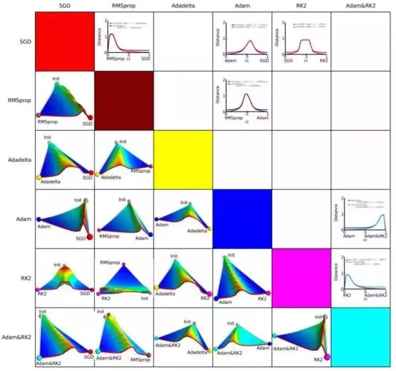

上图是论文的实验结果，横纵坐标表示降维后的特征空间，区域颜色则表示目标函数值的变化，红色是高原，蓝色是洼地。他们做的是配对儿实验，让两个算法从同一个初始化位置开始出发，然后对比优化的结果。可以看到，几乎任何两个算法都走到了不同的洼地，他们中间往往隔了一个很高的高原。这就说明，**不同算法在高原的时候，选择了不同的下降方向。** 

**8 Adam+SGD组合策略**

正是在每一个十字路口的选择，决定了你的归宿。如果上天能够给我一个再来一次的机会，我会对那个女孩子说：SGD！

不同优化算法的优劣依然是未有定论的争议话题。据我在paper和各类社区看到的反馈，主流的观点认为：Adam等自适应学习率算法对于稀疏数据具有优势，且收敛速度很快；但精调参数的SGD（+Momentum）往往能够取得更好的最终结果。

那么我们就会想到，可不可以把这两者结合起来，**先用Adam快速下降，再用SGD调优**，一举两得？思路简单，但里面有两个技术问题：

1. **什么时候切换优化算法**？——如果切换太晚，Adam可能已经跑到自己的盆地里去了，SGD再怎么好也跑不出来了。
2. **切换算法以后用什么样的学习率**？——Adam用的是自适应学习率，依赖的是二阶动量的累积，SGD接着训练的话，用什么样的学习率？

上一篇中提到的论文 Improving Generalization Performance by Switching from Adam to SGD 提出了解决这两个问题的思路。

**首先来看第二个问题，切换之后的学习率。**

Adam的下降方向是

​		$\eta_t^{Adam} = (\alpha / \sqrt{V_t} \cdot m_t)$

而SGD的下降方向是 

​		$\eta_t^{Adam} = \alpha^{SGD} \cdot g_t$

SGD下降方向必定可以分解为Adam下降方向及其正交方向上的两个方向之和，那么其在Adam下降方向上的投影就意味着SGD在Adam算法决定的下降方向上前进的距离，而在Adam下降方向的正交方向上的投影是 SGD 在自己选择的修正方向上前进的距离。 

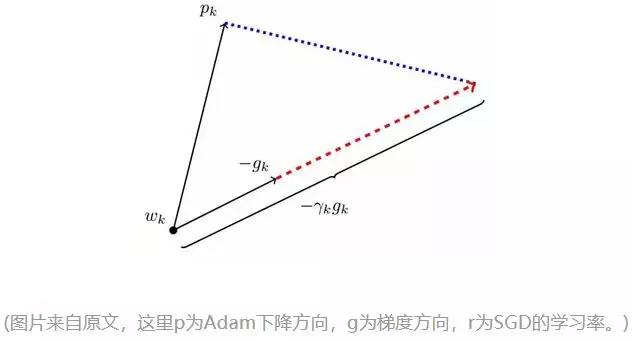

如果SGD要走完Adam未走完的路，那就首先要接过Adam的大旗——沿着 $\eta_t^{Adam}$方向走一步，而后在沿着其正交方向走相应的一步。

这样我们就知道该如何确定SGD的步长（学习率）了——**SGD在Adam下降方向上的正交投影，应该正好等于Adam的下降方向（含步长）**。也即：


解这个方程，我们就可以得到接续进行SGD的学习率：


为了减少噪声影响，我们可以使用移动平均值来修正对学习率的估计：


这里直接复用了Adam的 beta 参数。

**然后来看第一个问题，何时进行算法的切换。**

作者提出的方法很简单，那就是当 SGD的相应学习率的移动平均值基本不变的时候，即：


每次迭代完都计算一下SGD接班人的相应学习率，如果发现基本稳定了，那就SGD以$\tilde\lambda_t^{SGD}$为学习率接班前进。不过，这一时机是不是最优的切换时机，作者并没有给出数学证明，只是通过实验验证了效果，切换时机还是一个很值得深入研究的话题。

**9 优化算法的常用tricks**

最后，分享一些在优化算法的选择和使用方面的一些tricks。

1. **首先，各大算法孰优孰劣并无定论**。如果是刚入门，**优先考虑 SGD+Nesterov Momentum或者Adam**.（Standford 231n : The two recommended updates to use are either SGD+Nesterov Momentum or Adam）
2. **选择你熟悉的算法**——这样你可以更加熟练地利用你的经验进行调参。
3. **充分了解你的数据**——如果模型是非常稀疏的，那么优先考虑自适应学习率的算法。
4. **根据你的需求来选择**——在模型设计实验过程中，要快速验证新模型的效果，可以先用Adam进行快速实验优化；在模型上线或者结果发布前，可以用精调的SGD进行模型的极致优化。
5. **先用小数据集进行实验**。有论文研究指出，随机梯度下降算法的收敛速度和数据集的大小的关系不大。（The mathematics of stochastic gradient descent are amazingly independent of the training set size. In particular, the asymptotic SGD convergence rates are independent from the sample size. [2]）因此可以先用一个具有代表性的小数据集进行实验，测试一下最好的优化算法，并通过参数搜索来寻找最优的训练参数。
6. **考虑不同算法的组合**。先用Adam进行快速下降，而后再换到SGD进行充分的调优。切换策略可以参考本文介绍的方法。
7. **数据集一定要充分的打散（shuffle）**。这样在使用自适应学习率算法的时候，可以避免某些特征集中出现，而导致的有时学习过度、有时学习不足，使得下降方向出现偏差的问题。
8. 训练过程中**持续监控训练数据和验证数据**上的目标函数值以及精度或者AUC等指标的变化情况。对训练数据的监控是要保证模型进行了充分的训练——下降方向正确，且学习率足够高；对验证数据的监控是为了避免出现过拟合。
9. **制定一个合适的学习率衰减策略**。可以使用定期衰减策略，比如每过多少个epoch就衰减一次；或者利用精度或者AUC等性能指标来监控，当测试集上的指标不变或者下跌时，就降低学习率。

## **补充：指数移动平均值的偏差修正**

前面我们讲到，一阶动量和二阶动量都是按照指数移动平均值进行计算的：


实际使用过程中，参数的经验值是


初始化：


这个时候我们看到，在初期，$m_t, V_t$都会接近于0，这个估计是有问题的。因此我们常常根据下式进行误差修正：


参考文献：

[1] Stanford CS231n Convolutional Neural Networks for Visual Recognition

[2] Stochastic Gradient Descent Tricks.

[3] Efficient BackProp

# 超参数调试、Batch正则化和程序框架

## 调试处理

随机选择参数值，精确搜索，从粗糙到精细的搜索。

## 为超参数选择合适的范围

想要alpha在[0.0001，1]中取值

首先log0.0001=-4, 1og1=0

r = -4 * np.random.rand()    [-4,0]     #在[-4,0]中随机取

alpha = 10^r                           [10^-4,... 10^0]

举例：

假如你认为$\beta$ 的值在0.9到0.99之间，应该用下列方法为$\beta$ 赋值

```python
r = np.random.rand()
beta = 1-10**（-r-1)
```


## 超参数训练的实践：pandas VS Caviar

Babysitting one model——Pandas

Training many models in parallel——Caviar，计算资源多时

取决于拥有的计算能力

## 正则化网络的激活函数

Batch归一化

在逻辑回归中，归一化输入特征可以快速训练W,b

在深层网络中，输入不仅仅有x，还有a。

在激活函数之前归一化。

隐藏层的Z值归一化

$\mu = \frac 1m \sum_i z^{(i)} , \sigma^2=\frac 1m \sum_i (z_i -\mu)^2$

$z_{norm}^{(i)} = \frac {z^{(i)} -\mu}{\sqrt{\sigma^2+\epsilon}}$

有时候并不想这些值是平均值为0，方差为1的值，比如在用sigmoid激活函数时，不想要函数值都集中在一块。这时可以设置两个参数，使得归一化的Z可以是任意均值和方差的。这两个参数也是需要学习的。可以用梯度下降、Adam、动量梯度下降、RMSprop来学习。但他们不是算法的超参数(不确定?)。

$\tilde z^{(i)}=\gamma z_{norm}^{(i)} + \beta $

然后用$\tilde z^{(i)}$ 代替$z^{(i)}

如果$\gamma=\sqrt{\sigma^2+\epsilon}, \beta=\mu,那么 \tilde z^{(i)}=z^{(i)}$


## 将Batch Norm拟合进神经网络

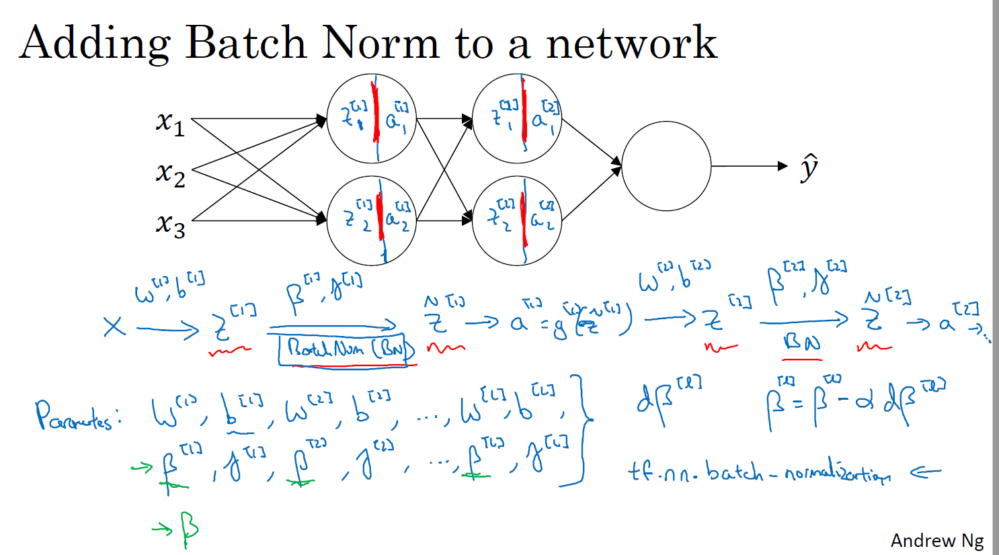

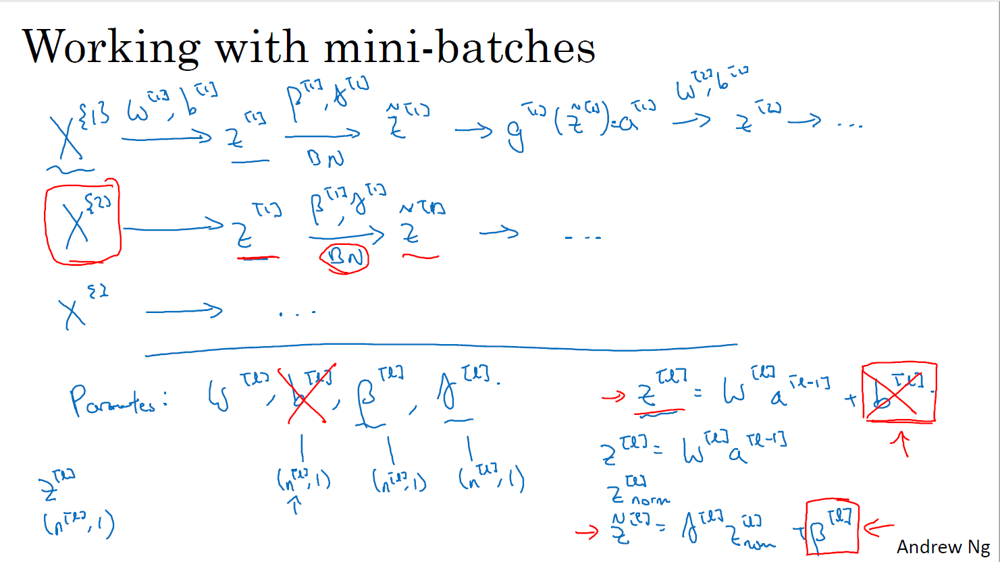

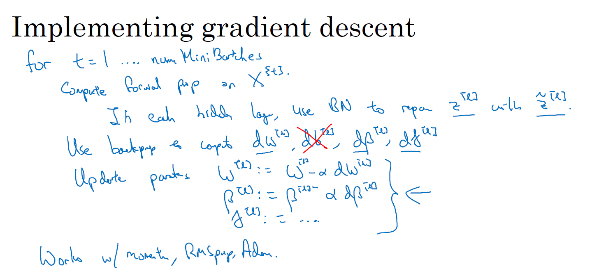

After training a neural network with Batch Norm, at test time, to evaluate the neural network on a new example you should:

Perform the needed normalizations, use $\mu$ and $\sigma^2$ estimated using an exponentially weighted average across mini-batches seen during training.

## Batch Norm为什么奏效？

covariate shift问题：数据分布的改变可能会使得模型需要重新训练

Batch norm 保持Z^[1], Z^[1]均值和方差不变,减少了输入值（包括输入层和隐藏层）发生改变的问题

• Each mini-batch is scaled by the mean/variance computed on just that mini-batch.
• This adds some noise to the values $𝑧^{[𝑙]}$ within that minibatch. So similar to dropout, it adds some noise to each hidden layer’s activations.
• This has a slight regularization effect. 

## 测试时的Batch Nrom

不像训练的时候可以一次用mini-batch来计算均值和方差，测试时往往是逐个样本进入，所以要改变计算均值和方差的方法。

用指数加权平均来估算均值和方差

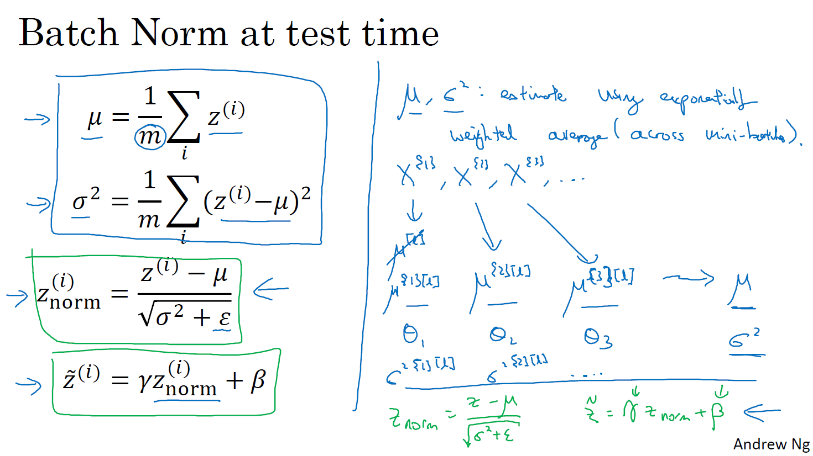

## Softmax回归

多分类问题

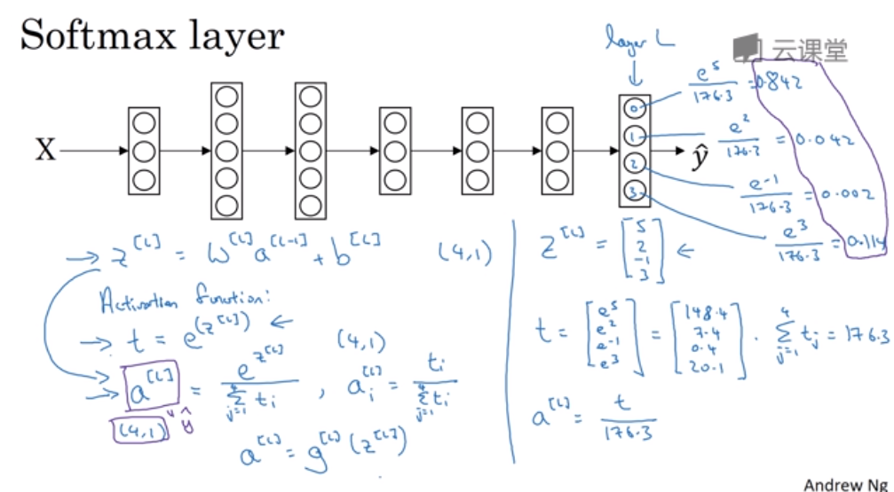

## 训练一个Softmax分类器

单个样本的损失函数

$L(\hat{y}, y)=-\sum_{j=1}^{c} y_j log \hat y_j$ c是类别数

整个训练集的损失函数

$J(w,b)=\frac1m\sum_{i=1}^{m} L(\hat{y}^{(𝑖)}, y^{(𝑖)})$

## 深度学习框架

Caffe/Caffe2

CNTK

DL4J

Keras

Lasagne

mxnet

PaddlePaddle

TensorFlow

Theano

Torch

选择框架：易于编程，运行速度，开放、开源。

## TensorFlow

```python
import numpy as np
import tensorflow as tf

coefficients = np.array([[1], [-20], [25]])

w = tf.Variable([0],dtype=tf.float32)
x = tf.placeholder(tf.float32, [3,1])
cost = x[0][0]*w**2 + x[1][0]*w + x[2][0] # (w-5)**2
train = tf.train.GradientDescentOptimizer(0.01).minimize(cost)
init = tf.global_variables_initializer()
session = tf.Session()
# with tf.Session() as session:
session.run(init)
print(session.run(w))

for i in range(1000):
	session.run(train, feed_dict={x:coefficients})
print(session.run(w))
```

# 补充

Suppose batch gradient descent in a deep network is taking excessively long to find a value of the parameters that achieves a small value for the cost function $J(W^{[1]}, b^{[1]},...,W^{[l]}, b^{[l]})$.Which of the following techniques could help find parameter values that attain a small value for $J$ ?

Try using Adam       √

Try better random initialization for the weights      √

Try mini-batch gradient descent       √

Try tuning the learning rate  $\alpha$        √

Try initializing all the weights to zero


ICLR论文集

