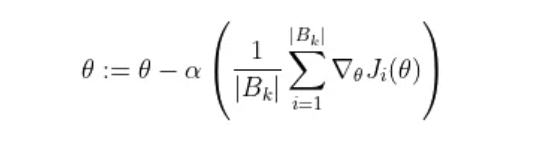
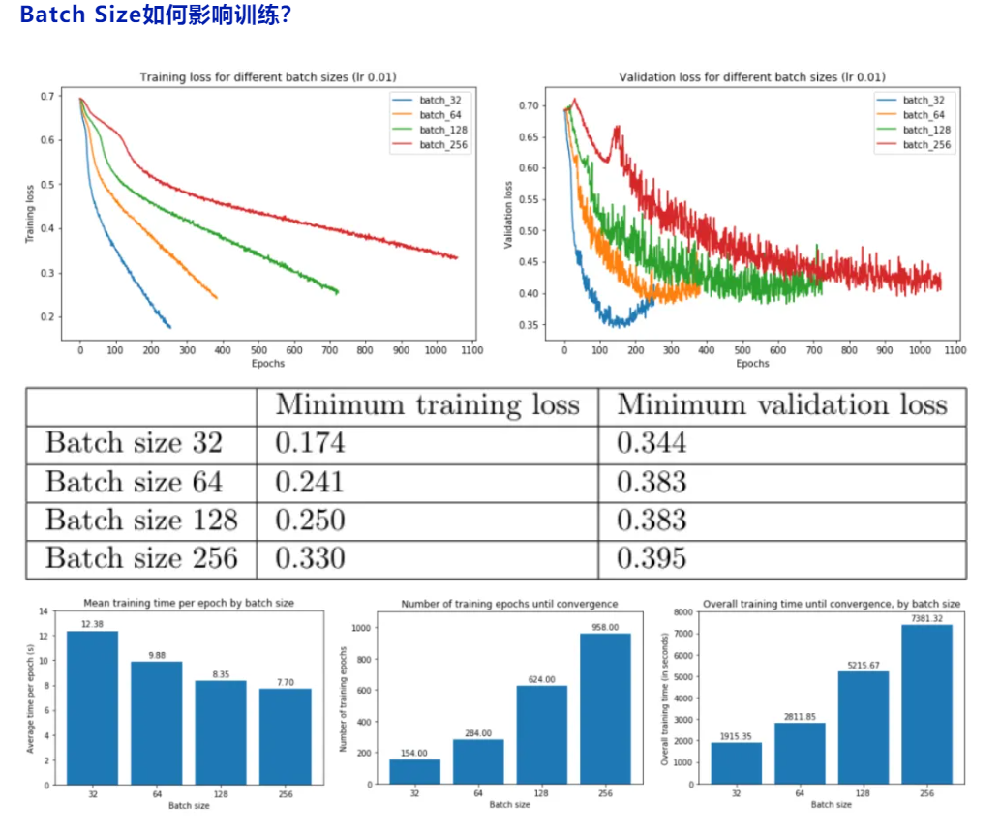
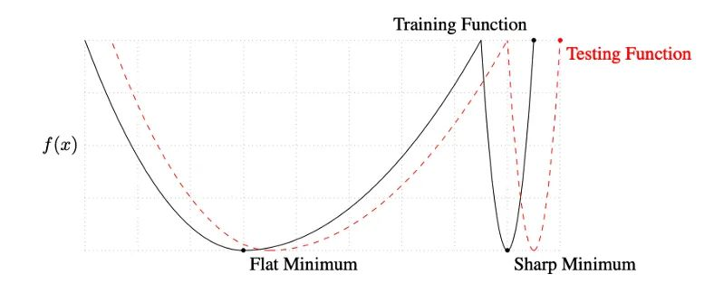

# **什么是Batch Size？**

训练神经网络以最小化以下形式的损失函数：

$J(\theta)=\frac 1m \sum_{i=1}^m J_i(\theta)$

- theta 代表模型参数
- m 是训练数据样本的数量
- i 的每个值代表一个单一的训练数据样本
- J_i 表示应用于单个训练样本的损失函数

通常，这是使用梯度下降来完成的，它计算损失函数相对于参数的梯度，并在该方向上迈出一步。随机梯度下降计算训练数据子集 B_k 上的梯度，而不是整个训练数据集。



B_k 是从训练数据集中采样的一批，其大小可以从 1 到 m（训练数据点的总数）。这通常称为批量大小为 |B_k| 的小批量训练。我们可以将这些批次级梯度视为“true”梯度的近似值，即整体损失函数相对于 theta 的梯度。**我们使用小批量是因为它倾向于更快地收敛，因为它不需要完全遍历训练数据来更新权重。**

# **为什么**Batch Size**很重要？**

Keskar 等人指出，**随机梯度下降是连续的，且使用小批量，因此不容易并行化 。使用更大的批量大小可以让我们在更大程度上并行计算，因为我们可以在不同的工作节点之间拆分训练示例。这反过来可以显着加快模型训练**。

**然而，较大的批大小虽然能够达到与较小的批大小相似的训练误差，但往往对测试数据的泛化效果更差** 。训练误差和测试误差之间的差距被称为“泛化差距”。因此，“holy grail”是使用大批量实现与小批量相同的测试误差。这将使我们能够在不牺牲模型准确性的情况下显着加快训练速度。



从上图中，我们可以得出结论，**batch size越大：**

- **训练损失减少的越慢。**
- **最小验证损失越高。**
- **每个时期训练所需的时间越少。**
- **收敛到最小验证损失所需的 epoch 越多。**

首先，在大批量训练中，训练损失下降得更慢，如红线（批量大小 256）和蓝线（批量大小 32）之间的斜率差异所示。

其次，大批量训练比小批量训练实现更糟糕的最小验证损失。例如，批量大小为 256 的最小验证损失为 0.395，而批量大小为 32 时为 0.344。

第三，大批量训练的每个 epoch 花费的时间略少——批量大小 256 为 7.7 秒，而批量大小 256 为 12.4 秒，这反映了与加载少量大批量相关的开销较低，而不是许多小批量依次。如果我们使用多个 GPU 进行并行训练，这种时间差异会更加明显。

然而，大批量训练需要更多的 epoch 才能收敛到最小值——批量大小 256 为 958，批量大小 32 为 158。因此，大批量训练总体上花费的时间更长：批量大小 256 花费的时间几乎是 32 的四倍！请注意，我们没有在这里并行化训练——如果我们这样做了，那么大批量训练的训练速度可能与小批量训练一样快。

如果我们并行化训练运行会发生什么？为了回答这个问题，我们使用 TensorFlow 中的 MirroredStrategy 在四个 GPU 上并行训练：

```
with tf.distribute.MirroredStrategy().scope():   # Create, compile, and fit model   # ...
```

MirroredStrategy 将模型的所有变量复制到每个 GPU，并将前向/后向传递计算批量分发到所有 GPU。然后，它使用 all-reduce 组合来自每个 GPU 的梯度，然后将结果应用于每个 GPU 的模型副本。本质上，它正在划分批次并将每个块分配给 GPU。

我们发现**并行化使每个 epoch 的小批量训练速度稍慢，而它使大批量训练速度更快**——对于 256 批大小，每个 epoch 需要 3.97 秒，低于 7.70 秒。然而，即使有 per-epoch 加速，它也无法在总训练时间方面匹配批量大小 32——当我们乘以总训练时间 (958) 时，我们得到大约 3700 秒的总训练时间，即 仍然远大于批大小 32 的 1915 秒。

**到目前为止，大批量训练看起来并不值得，因为它们需要更长的时间来训练，并且训练和验证损失更严重。** 为什么会这样？有什么办法可以缩小性能差距吗？

# **为什么较小的批量性能更好？**

Keskar 等人对小批量和大批量之间的性能差距提出了一种解释：**使用小批量的训练倾向于收敛到平坦的极小化，该极小化在极小化的小邻域内仅略有变化，而大批量则收敛到尖锐的极小化，这变化很大。平面minimizers 倾向于更好地泛化，因为它们对训练集和测试集之间的变化更加鲁棒** 。



此外，他们发现**与大批量训练相比，小批量训练可以找到距离初始权重更远的最小值**。他们解释说，**小批量训练可能会为训练引入足够的噪声，以退出锐化minimizers 的损失池，而是找到可能更远的平坦minimizers** 。

# 参考资料

[Batch Size对神经网络训练的影响](https://mp.weixin.qq.com/s/PXwZ41lTtkq_s_o0yYuO_Q)