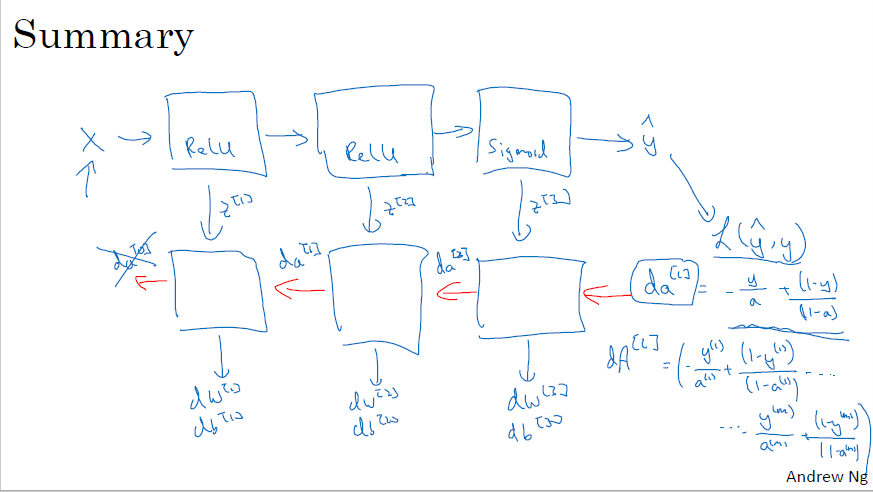

## 浅层神经网络

Forward propagation

$Z^{[1]} = W^{[1]}X + b^{[1]}$

$A^{[1]} = g^{[1]}(Z^{[1]})$

$Z^{[2]} = W^{[2]}A^{[1]} + b^{[2]}$

$A^{[2]} = g^{[2]}(Z^{[2]}) = \sigma(Z^{[2]})$

Back propagation

$dz^{[2]} = a^{[2]} - y$                              $dZ^{[2]} = A^{[2]} - Y$,         $Y=[y^{(1)}, y^{(2)}, ..., y^{(m)}]$

$dW^{[2]} = dz^{[2]} a^{[1]^T}$                         $dW^{[2]} = \frac1m dZ^{[2]} A^{[1]T}$

$db^{[2]} = dz^{[2]}$                                     
$db^{[2]} = \frac1m np.sum(dZ^{[2]}, axis=1, keepdims=True)$

$dz^{[1]} = W^{[2]T} dz^{[2]} * g^{[1]'}(z^{[1]})$      $dZ^{[1]} = W^{[2]T} dZ^{[2]} * g^{[1]'}(Z^{[1]})$

$dW{[1]} = dz^{[1]} x^T$                             $dW{[1]} = \frac1m dZ^{[1]} X^T$

$db^{[1]} = dz^{[1]}$,                                  $db^{[1]} = \frac1m np.sum(dZ^{[1]}, axis=1, keepdims=True)$

## 深层神经网络

矩阵维数

$W^{[l]} : (n^{[l]}, n^{[l-1]})$,   $b^{[l]} : (n^{[l]}, 1)$,           $d^W{[l]}: (n^{[l]}, n^{[l-1]}),          db^{[l]}: (n^{[l]}, l)$

$z^{[l]}, a^{[l]}:  (n^{[l]},  1)$

$Z^{[l]}, A^{[l]}:  (n^{[l]},  m)$,         $l=0时，A^{[0]} = X = (n^{[0]}, m)$

$dZ^{[l]},  d A{[l]}: (n^{[l]}, m)$

Forward and backward functions

Forward propagation for layer $l$

Input $a^{[l-1]}$

Output $a^{[l-1]}$, cash ($z^{[l]}$)

$z^{[l]} = W^{[l]} a^{[l-1]} + b^{[l]},   a^{[l]} = g^{[l]}(z^{[l]})$                  $Z^{[l]} = W^{[l]} A^{[l-1]} + b^{[l]},   A^{[l]} = g^{[l]}(Z^{[l]})$

对于正向传播，要遍历每一层是需要有一个显示循环的。

Backward propagation for layer $l$

Input $da^{[l]}$

Output $da^{[l-1]}, dW^{[l]}, db^{[l]}$

$dz^{[l]} = da^{[l]} * g^{[l]'} (z^{[l]})$                                       $dZ^{[l]} = dA^{[l]} * g^{[l]'} (Z^{[l]})$

$dW^{[l]} = dz^{[l]} a^{[l-1]}$                                             $dW^{[l]} = \frac1m dZ^{[l]} A^{[l-1]T}$

$db^{[l]} = dz^{[l]}$                                                        $db^{[l]} = \frac1m np.sum(dZ^{[l]}, axis=1, keepdims=True)$

$da^{[l-1]} = W^{[l]T} dz^{[l]}$                                          $dA^{[l-1]} = W^{[l]T} dZ^{[l]}$

$dz^{[l]} = W^{[l+1]T} dz^{[l+1]} * g^{[l]'}(z^{[l]})$

## **Pooling池化操作的反向梯度传播**

CNN网络中另外一个不可导的环节就是Pooling池化操作，因为Pooling操作使得feature map的尺寸变化，假如做2×2的池化，假设那么第$l$+1层的feature map有16个梯度，那么第$l$层就会有64个梯度，这使得梯度无法对位的进行传播下去。其实解决这个问题的思想也很简单，就是把1个像素的梯度传递给4个像素，但是 **需要保证传递的loss（或者梯度）总和不变** 。根据这条原则，mean pooling和max pooling的反向传播也是不同的。

 **1、mean pooling**

 mean pooling的前向传播就是把一个patch中的值求取平均来做pooling，那么反向传播的过程也就是把某个元素的梯度等分为n份分配给前一层，这样就保证池化前后的梯度（残差）之和保持不变，还是比较理解的，图示如下 ：

 mean pooling比较容易让人理解错的地方就是会简单的认为直接把梯度复制N遍之后直接反向传播回去，但是这样会造成loss之和变为原来的N倍，网络是会产生梯度爆炸的。

**2、max pooling**

 max pooling也要满足梯度之和不变的原则 ，max pooling的前向传播是把patch中最大的值传递给后一层，而其他像素的值直接被舍弃掉。那么反向传播也就是 把梯度直接传给前一层某一个像素，而其他像素不接受梯度，也就是为0 。所以max pooling操作和mean pooling操作不同点在于需要记录下池化操作时到底哪个像素的值是最大，也就是max id ，这个变量就是记录最大值所在位置的，因为在反向传播中要用到，那么假设前向传播和反向传播的过程就如下图所示 ：

## 参考资料

[深度学习笔记（3）——CNN中一些特殊环节的反向传播](https://blog.csdn.net/qq_21190081/article/details/72871704)

