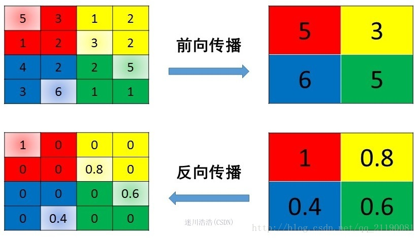

## **Pooling池化操作的反向梯度传播**

CNN网络中另外一个不可导的环节就是Pooling池化操作，因为Pooling操作使得feature map的尺寸变化，假如做2×2的池化，假设那么第$l$+1层的feature map有16个梯度，那么第$l$层就会有64个梯度，这使得梯度无法对位的进行传播下去。其实解决这个问题的思想也很简单，就是把1个像素的梯度传递给4个像素，但是 **需要保证传递的loss（或者梯度）总和不变** 。根据这条原则，mean pooling和max pooling的反向传播也是不同的。

 **1、mean pooling**

 mean pooling的前向传播就是把一个patch中的值求取平均来做pooling，那么反向传播的过程也就是把某个元素的梯度等分为n份分配给前一层，这样就保证池化前后的梯度（残差）之和保持不变，还是比较理解的，图示如下 ：

 mean pooling比较容易让人理解错的地方就是会简单的认为直接把梯度复制N遍之后直接反向传播回去，但是这样会造成loss之和变为原来的N倍，网络是会产生梯度爆炸的。

**2、max pooling**

 max pooling也要满足梯度之和不变的原则 ，max pooling的前向传播是把patch中最大的值传递给后一层，而其他像素的值直接被舍弃掉。那么反向传播也就是 把梯度直接传给前一层某一个像素，而其他像素不接受梯度，也就是为0 。所以max pooling操作和mean pooling操作不同点在于需要记录下池化操作时到底哪个像素的值是最大，也就是max id ，这个变量就是记录最大值所在位置的，因为在反向传播中要用到，那么假设前向传播和反向传播的过程就如下图所示 ：

## 参考资料

[深度学习笔记（3）——CNN中一些特殊环节的反向传播](https://blog.csdn.net/qq_21190081/article/details/72871704)

