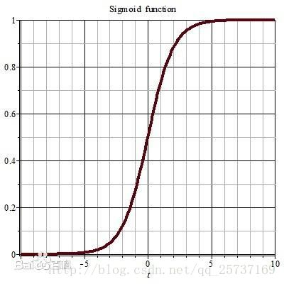
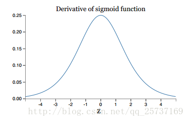
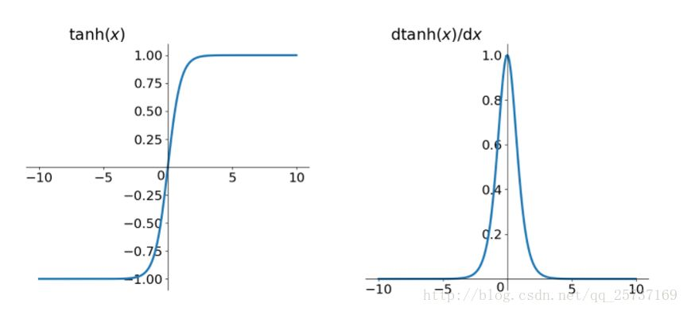
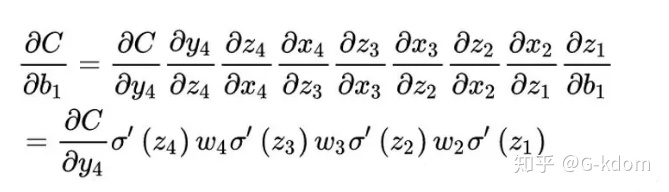
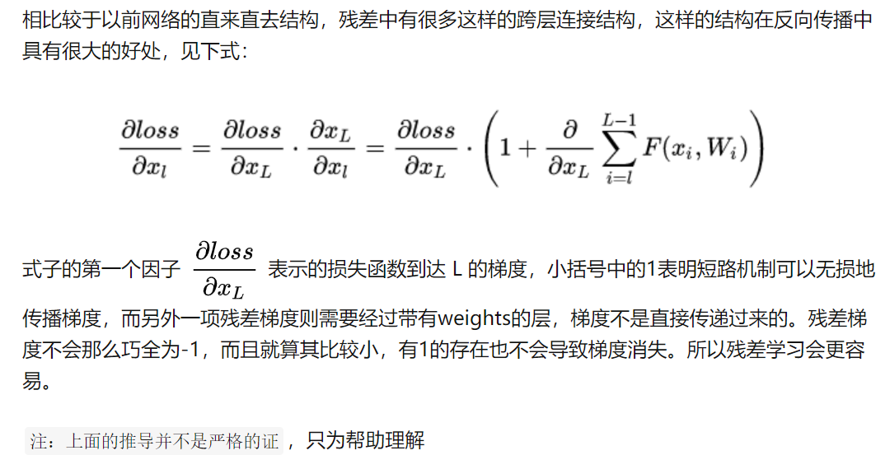

两种情况下梯度消失经常出现，一是在**深层网络**中，二是采用了**不合适的损失函数**，比如sigmoid。梯度爆炸一般出现在**深层网络**和**权值初始化值太大**的情况下。

## 深层网络角度

由于深度网络是多层非线性函数的堆砌，整个深度网络可以视为是一个**复合的非线性多元函数**（这些非线性多元函数其实就是每层的激活函数），那么对loss function求不同层的权值偏导，相当于应用梯度下降的链式法则，链式法则是一个连乘的形式，所以当层数越深的时候，梯度将以指数传播。

如果接近输出层的激活函数求导后梯度值大于1，那么层数增多的时候，最终求出的梯度很容易指数级增长，就会产生**梯度爆炸**；相反，如果小于1，那么经过链式法则的连乘形式，也会很容易衰减至0，就会产生**梯度消失**。

从深层网络角度来讲，不同的层学习的速度差异很大，表现为网络中靠近输出的层学习的情况很好，靠近输入的层学习的很慢，有时甚至训练了很久，前几层的权值和刚开始随机初始化的值差不多。因此，梯度消失、爆炸，其根本原因在于反向传播训练法则，本质在于方法问题。对于人来说，在大脑的思考机制里是没有反向传播的，Hinton提出capsule的原因就是为了彻底抛弃目前基于反向传播的深度学习算法

## 激活函数角度

计算权值更新信息的时候需要计算前层偏导信息，因此如果激活函数选择不合适，比如使用sigmoid，梯度消失就会很明显。左图是sigmoid的损失函数图，右边是其导数的图像，如果使用sigmoid作为损失函数，其梯度是不可能超过0.25的，初始化的网络权值通常都小于1，这样经过链式求导之后，很容易发生梯度消失。





同理，tanh作为损失函数，它的导数图如下，可以看出，tanh比sigmoid要好一些，但是它的倒数仍然是小于1的。



## 权重角度

**初始化权重的值过大**



根据链式相乘(反向传播)可得，则前面的网络层比后面的网络层梯度变化更快，很容易发生梯度爆炸的问题。

## 其它角度

数据输入有异常值，导致损失函数值变大。

## 梯度消失、爆炸的解决方案

### 方案1-预训练加微调

此方法来自Hinton在2006年发表的一篇论文，Hinton为了解决梯度的问题，提出采取无监督逐层训练方法，其基本思想是每次训练一层隐节点，训练时将上一层隐节点的输出作为输入，而本层隐节点的输出作为下一层隐节点的输入，此过程就是逐层“预训练”（pre-training）；在预训练完成后，再对整个网络进行“微调”（fine-tunning）。Hinton在训练深度信念网络（Deep Belief Networks中，使用了这个方法，在各层预训练完成后，再利用BP算法对整个网络进行训练。此思想相当于是先寻找局部最优，然后整合起来寻找全局最优，此方法有一定的好处，但是目前应用的不是很多了。

### 方案2-梯度剪切、正则

**梯度剪切**这个方案主要是针对梯度爆炸提出的，其思想是设置一个梯度剪切阈值，然后更新梯度的时候，如果梯度超过这个阈值，那么就将其强制限制在这个范围之内。这可以防止梯度爆炸。

注：在WGAN中也有梯度剪切限制操作，但是和这个是不一样的，WGAN限制梯度更新信息是为了保证lipchitz条件。

另外一种解决梯度爆炸的手段是采用**权重正则化**（weithts regularization）比较常见的是l1正则，和l2正则，在各个深度框架中都有相应的API可以使用正则化，比如在tensorflow中，若搭建网络的时候已经设置了正则化参数，则调用以下代码可以直接计算出正则损失：

```text
regularization_loss = tf.add_n(tf.losses.get_regularization_losses(scope='my_resnet_50'))
```

如果没有设置初始化参数，也可以使用以下代码计算$l2$正则损失：

```text
l2_loss = tf.add_n([tf.nn.l2_loss(var) for var in tf.trainable_variables() if 'weights' in var.name])
```

正则化是通过对网络权重做正则限制过拟合，仔细看正则项在损失函数的形式：

![[公式]](img/equation)

其中， alpha是指正则项系数，因此，如果发生梯度爆炸，权值的范数就会变的非常大，通过正则化项，可以部分限制梯度爆炸的发生。

注：事实上，在深度神经网络中，往往是梯度消失出现的更多一些

### 方案3-relu、leakrelu、elu等激活函数

**Relu**:思想也很简单，如果激活函数的导数为1，那么就不存在梯度消失爆炸的问题了，每层的网络都可以得到相同的更新速度，relu就这样应运而生。

**relu**的主要贡献在于：

- `缓解了梯度消失、爆炸的问题`
- `计算方便，计算速度快`
- `加速了网络的训练`

同时也存在一些**缺点**：

```
由于负数部分恒为0，会导致一些神经元无法激活（可通过设置小学习率部分解决）
输出不是以0为中心的
```

**leakrelu**

leakrelu就是为了解决relu的0区间带来的影响

elu激活函数也是为了解决relu的0区间带来的影响

### 方案4-batchnorm

**Batchnorm**是深度学习发展以来提出的最重要的成果之一了，目前已经被广泛的应用到了各大网络中，具有加速网络收敛速度，提升训练稳定性的效果，Batchnorm本质上是解决反向传播过程中的梯度问题。batchnorm全名是batch normalization，简称BN，即批规范化，通过规范化操作将输出信号x规范化到均值为0，方差为1保证网络的稳定性。

反向传播中，经过每一层的梯度会乘以该层的权重。权重w的大小影响了梯度的消失和爆炸，batchnorm就是通过对每一层的输出做scale和shift的方法，通过一定的规范化手段，把每层神经网络任意神经元这个输入值的分布强行拉回到接近均值为0方差为1的标准正太分布，即严重偏离的分布强制拉回比较标准的分布，这样使得激活输入值落在非线性函数对输入比较敏感的区域，这样输入的小变化就会导致损失函数较大的变化，使得让梯度变大，避免梯度消失问题产生，而且梯度变大意味着学习收敛速度快，能大大加快训练速度。

### 方案5-残差结构

残差可以很轻松的构建几百层，一千多层的网络而不用担心梯度消失过快的问题，原因就在于残差的捷径（shortcut）部分。



### 方案6-LSTM

LSTM全称是长短期记忆网络（long-short term memory networks），是不那么容易发生梯度消失的，主要原因在于LSTM内部复杂的“门”(gates)，如下图，LSTM通过它内部的“门”可以接下来更新的时候“记住”前几次训练的”残留记忆“，因此，经常用于生成文本中。

## 参考资料

[详解深度学习中的梯度消失、爆炸原因及其解决方法](https://zhuanlan.zhihu.com/p/33006526?from_voters_page=true)

[梯度消失和梯度爆炸及解决方法](https://zhuanlan.zhihu.com/p/72589432)