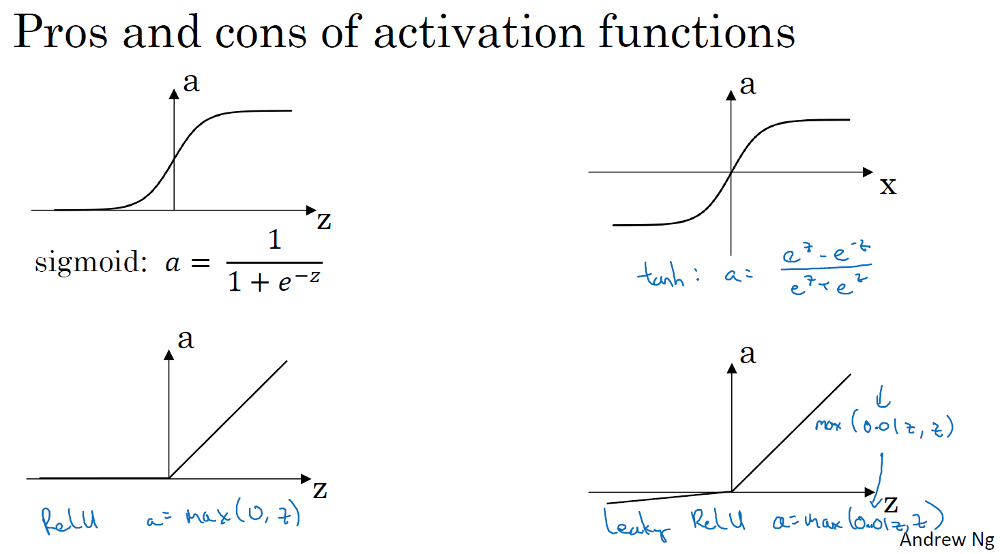

## Activation functions激活函数

sigmoid activation function:  $a=\frac{1}{1+e^{-z}}$

二分分类，输出结果是0或者1，用作输出层，只有同时满足这三个条件时，sigmoid函数才会好过别的激活函数。

tanh activation function: $a = \frac{e^z- e^{-z}} {e^z+ e^{-z}}$

tanh激活函数是将sigmoid函数向下移动，它有类似数据中心化的效果，使得数据的平均值接近0，从而让下一层的学习更方便。吴恩达老师说，他现在几乎不用sigmoid，因为tanh几乎在任何时候，效果都更好。

Relu activation function: a = max(0,z)

leaky activation Relu function: a = max(0.01z, z)

why do you need non-linear activation  functions?

如果不用非线性的激活函数，而用线性的激活函数，那么输出可直接表示成输入的线性函数形式，无需隐藏层。

==**以下图像位深度神经网络激活函数的函数图像,最有可能发生梯度消失的是(sigmoid函数) **==

如果此部分大于1，那么层数增多的时候，最终的求出的梯度更新将以指数形式增加，即发生梯度爆炸，如果此部分小于1，那么随着层数增多，求出的梯度更新信息将会以指数形式衰减，即发生了梯度消失

==**常用的激活函数有**==：线性函数、斜坡函数、阶跃函数、符号函数、Sigmoid函数、双曲正切函数、Softplus函数、Softsign函数、Relu函数及其变形、Maxout函数等。

