- 一种基本的分类与回归方法
- k值的选择、距离度量及分类决策规则是k近邻法的三个基本要素，给定三要素，其结果是唯一确定的
- 1968年由Cover和Hart提出
- 判别模型

## k近邻算法

给定测试样本，基于某种度量距离找出训练样本集中最靠近的k个训练样本。然后基于这k个训练样本（称为近邻）的标签信息来进行预测：

**分类任务**用投票法：选择k个近邻中出现最多的类别标签作为预测标签

**回归任务**用平均法：将k个近邻的标签的平均值作为预测标签

k=1时称为最近邻算法。

k近邻是一种**“懒惰学习lazy learning”**算法。它没有显式的训练过程。在训练阶段仅仅是把样本保存起来，训练时间开销为零，等接收到测试样本后在进行处理。

KNN 分类的计算复杂度和训练集中的文档数目成正比，也就是说，如果训练集中文档总数为n，那么KNN 的分类时间复杂度为O(n)。

问题：该算法在分类时有个主要的不足是，当样本不平衡时，如一个类的样本容量很大，而其他类样本容量很小时，有可能导致当输入一个新样本时，该样本的K 个邻居中大容量类的样本占多数

解决：不同的样本给予不同权重项

## k近邻模型

k近邻法使用的模型实际上对应于对特征空间的划分。模型由三个基本要素：距离度量、k值的选择及分类决策规则决定。

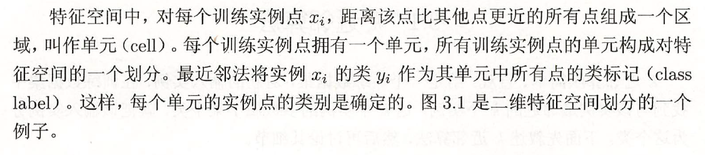

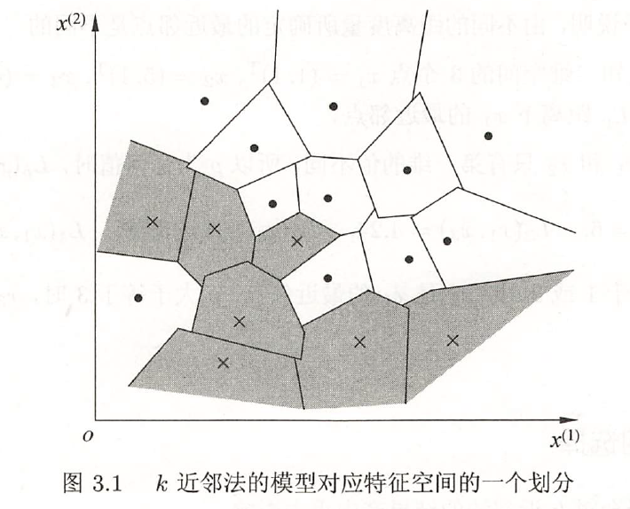

### 距离度量

欧氏距离，Lp距离，Minkowski距离

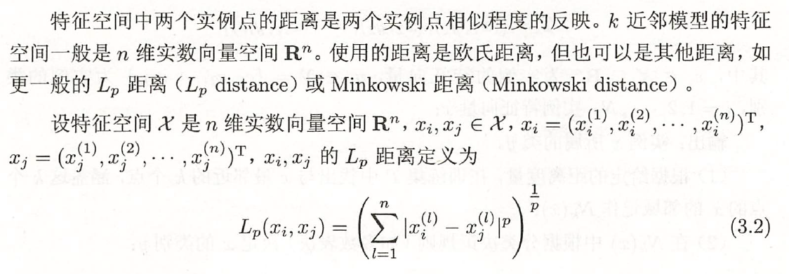

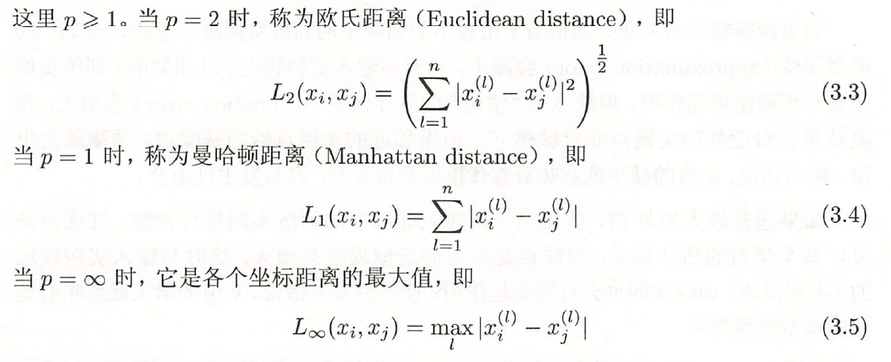

最后一个是切比雪夫距离。

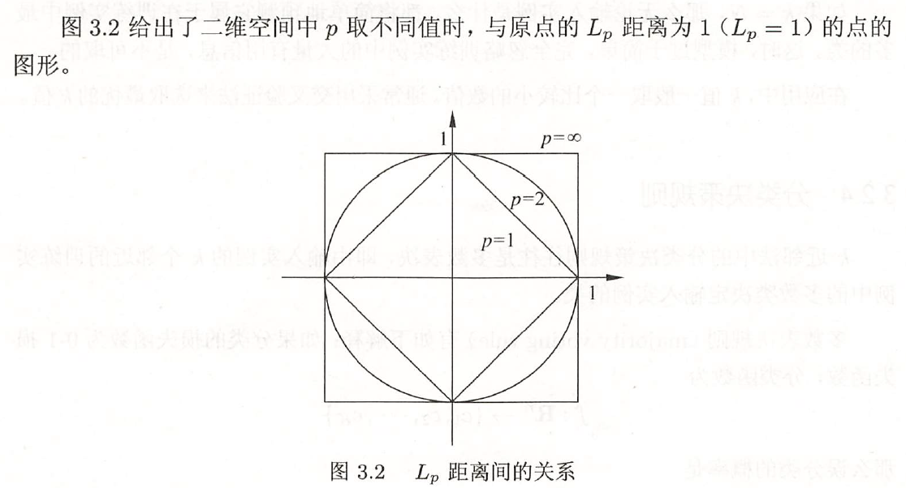

### k值的选择

K 值的选择会对K 近邻法的结果产生重大影响。

如果选择较小的K 值，就相当千用较小的邻域中的训练实例进行预测，”学习＂的
近似误差(approximation error ) 会减小，只有与输入实例较近的（相似的）训练实例
才会对预测结果起作用。但缺点是“学习＂的**估计误差**(estimation error) 会增大，预
测结果会对近邻的实例点非常敏感[2] 。如果邻近的实例点恰巧是噪声，预测就会出
错。换句话说， k 值的减小就意味着整体模型变得复杂，容易发生过拟合。

如果选择较大的K 值，就相当千用较大邻域中的训练实例进行预测。其优点是
可以减少学习的估计误差，但缺点是学习的**近似误差**会增大。这时与输入实例较远
的（不相似的） 训练实例也会对预测起作用，使预测发生错误。K 值的增大就意味着整
体的模型变得简单。

如果k = N, 那么无论输入实例是什么，都将简单地预测它属于在训练实例中最
多的类。这时，模型过于简单，完全忽略训练实例中的大量有用信息，是不可取的。
在应用中， K 值一般取一个比较小的数值。通常采用交叉验证法来选取最优的K 值。

### 分类决策规则

k 近邻法中的分类决策规则往往是多数表决，即由输入实例的K 个邻近的训练实
例中的多数类决定输入实例的类。

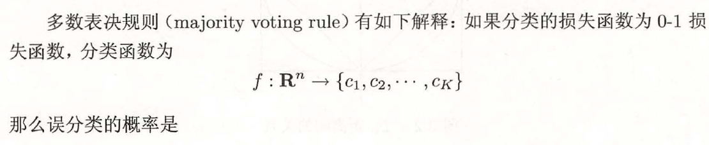

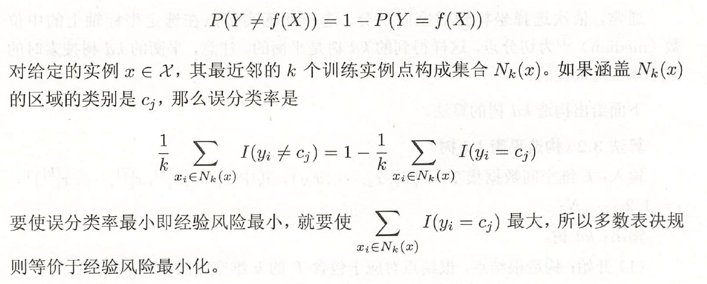

## k近邻法的实现：kd树

实现k 近邻法时，主要考虑的问题是如何对训练数据进行快速k 近邻搜索。这点在特征空间的维数大及训练数据容量大时尤其必要。

k 近邻法最简单的实现方法是线性扫描(linear scan) 。这时要计算输入实例与每一个训练实例的距离。当训练集很大时，计算非常耗时，这种方法是不可行的。为了提高k 近邻搜索的效率，可以考虑使用特殊的结构存储训练数据，以减少计算距离的次数。具体方法很多，下面介绍其中的kd 树(kd tree) 方法。

（kd 树是存储k 维空间数据的树结构，这里的K 与K 近邻法的K 意义不同）

### 构造kd 树

kd 树是一种对K 维空间中的实例点进行存储以便对其进行快速检索的树形数据结构。kd 树是二叉树，表示对K 维空间的一个划分(partition) 。**构造kd 树相当于不断地用垂直千坐标轴的超平面将K 维空间切分，构成一系列的K 维超矩形区域。**kd树的每个结点对应千一个K 维超矩形区域。

构造kd 树的方法如下：构造根结点，使根结点对应于K 维空间中包含所有实例点的超矩形区域；通过下面的递归方法，不断地对K 维空间进行切分，生成子结点。

在超矩形区域（结点）上选择一个坐标轴和在此坐标轴上的一个切分点，确定一个超
平面，这个超平面通过选定的切分点并垂直千选定的坐标轴，将当前超矩形区域切分
为左右两个子区域（子结点）；这时，实例被分到两个子区域。这个过程直到子区域
内没有实例时终止（终止时的结点为叶结点）。在此过程中，将实例保存在相应的结
点上。

通常，依次选择坐标轴对空间切分，选择训练实例点在选定坐标轴上的中位数(median)为切分点，这样得到的kd树是平衡的。注意，**平衡的kd树搜索时的效率未必是最优的**。

构造kd树的算法

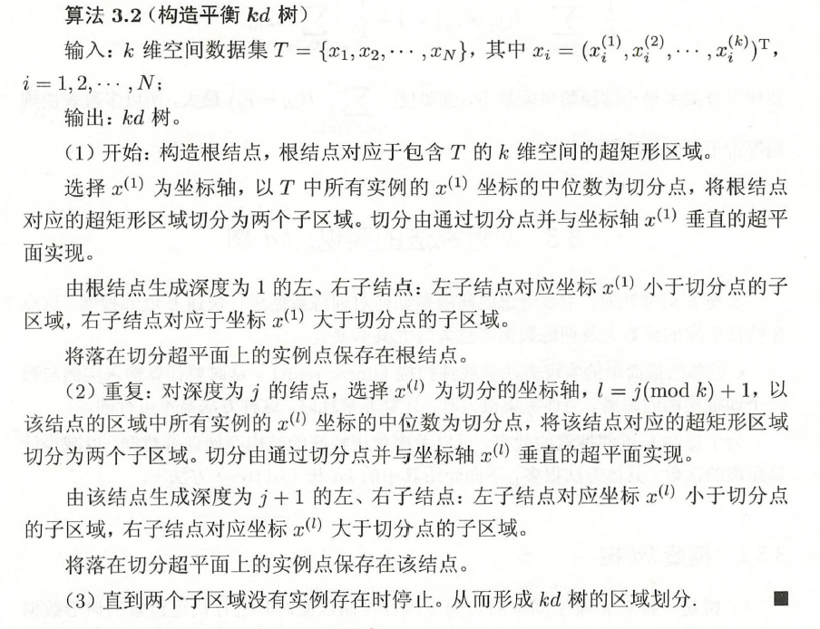

### 搜索kd树

利用kd树可以省去对大部分数据点的搜索，从而减少搜索的计算量。

以最近邻为例

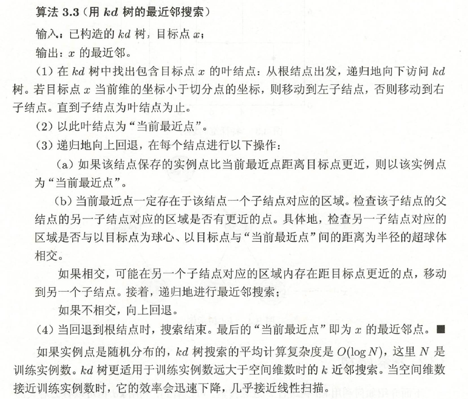

举例说明

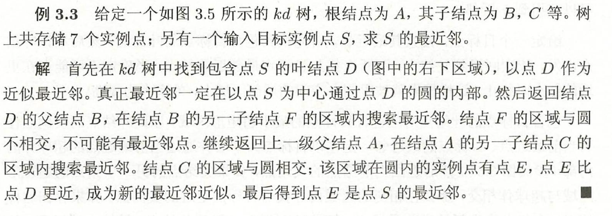

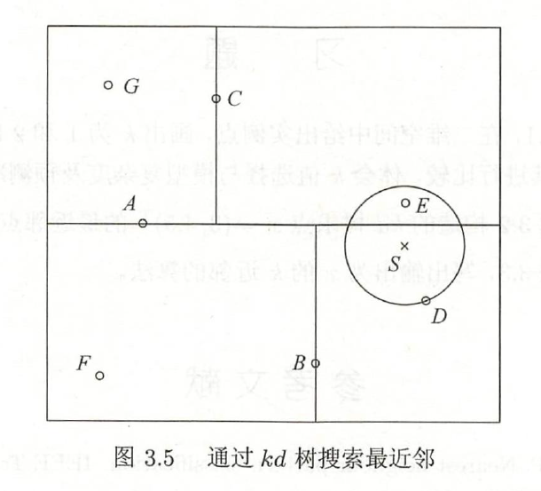

