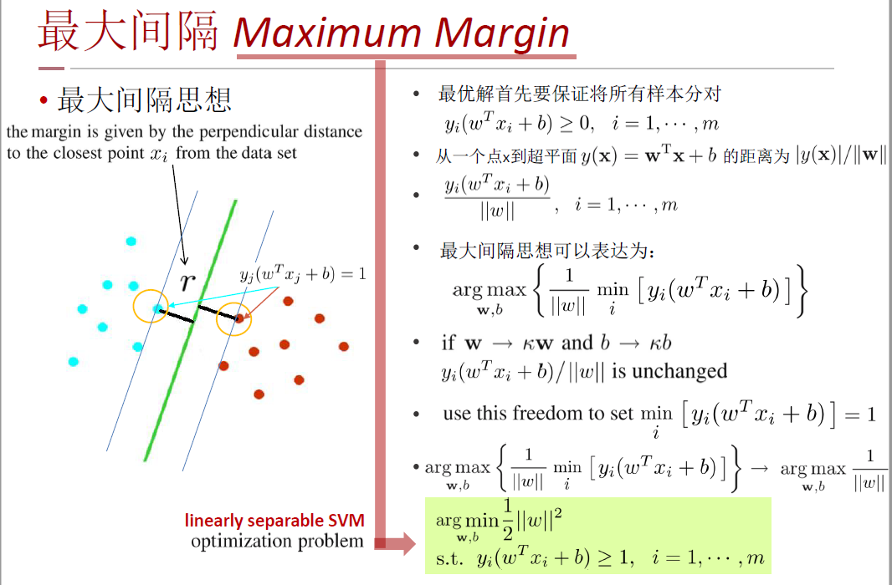
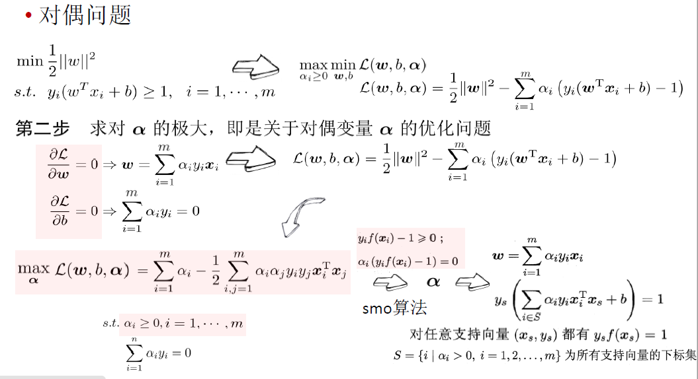
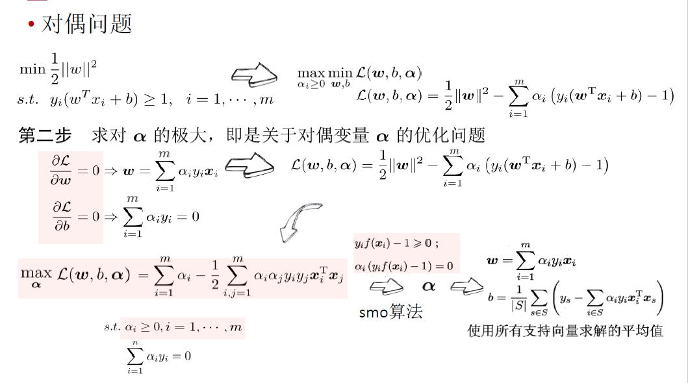
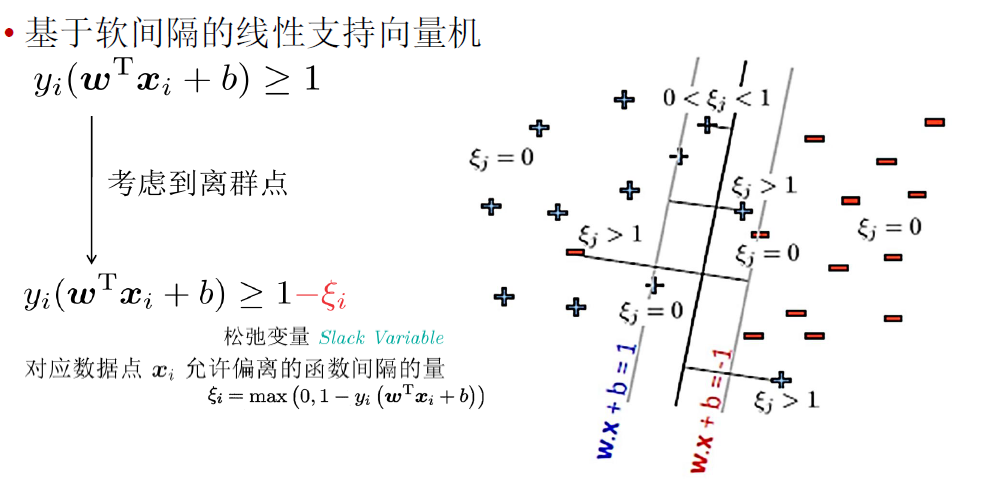
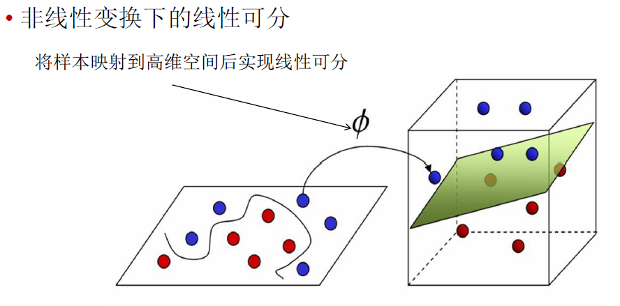
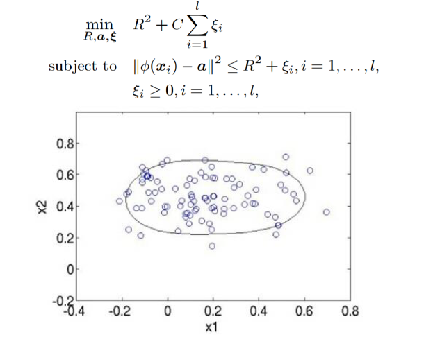

# 最大间隔

==SVM是结构风险最小化，基于最大间隔的思想==

当一个数据集中的带有类别{+1, -1}的样本能够被某个线性决策面给完美地分开来的话。则称这个数据集是线性可分的linearly separable

$y_i (w^T x_i + b) ≥ 0, i=1, ..., m$

当训练数据集是线性可分的，存在无穷个线性决策面能够将两类数据正确划分

 

支持向量Support Vector
支撑着两个对应于最大间隔的超平面：

$w^Tx+b=1$

$w^Tx+b=-1$

# 支持向量机

## 线性可分支持向量机

$min \frac{1}{2} ||w||^2$

$s.t.$    $y_i(w^Tx_i+b)≥1, i=1, ..., m$

有约束，不能用梯度下降法。

凸二次规划(convex quadratic programming)问题，能直接用现成的优化计算包求解

更高效的方法：转化成对偶问题，然后用SMO算法

线性可分条件下支持向量机的对偶算法，这样做的优点在于：一者对偶问题往往更容易求解；二者可以自然的引入核函数，进而推广到非线性分类问题

## 对偶问题

原问题是minmax，对偶问题是maxmin


  






SMO的基本思路是先固定$\alpha_i$ 之外的所有参数，然后求$\alpha_i$ 上的极值。由于存在约束$\sum_{i=1}^n \alpha_i y_i =0$ ，若固定$\alpha_i$ 之外的其他变量，则$\alpha_i$ 可由其他变量导出。于是，SMO每次选择两个变量$\alpha_i$ 和 $\alpha_j$ ，并固定其他参数。这样，在参数初始化后，SMO不断执行如下两个步骤直至收敛：

选取一对需更新的变量$\alpha_i$ 和 $\alpha_j$

固定$\alpha_i$ 和 $\alpha_j$ 以外的参数，求解上式获得更新后的$\alpha_i$ 和$\alpha_j$


## 软间隔


离群点(Outliers):偏离群体的个别样本点
有可能为噪声，有可能不是
一定程度地考虑离群点

基于软间隔的线性支持向量机

所有样本都必须划分正确，这称为“硬间隔”（hard margin)

允许某些样本不满足约束，这称为“软间隔”（soft margin)




## 核函数




==**SVM核函数**包括线性核函数、多项式核函数、径向基核函数、高斯核函数、幂指数核函数、拉普拉斯核函数、ANOVA核函数、二次有理核函数、多元二次核函数、逆多元二次核函数以及Sigmoid核函数==

## 支持向量机小结

当数据

线性可分时：线性可分支持向量机

接近线性可分时：基于软间隔的线性支持向量机

线性不可分时：核函数（非线性支持向量机）

支持向量机与对率回归的优化目标相近，通常情形下它们的性能也相当.对率回归的优势主要在于其输出具有自然的概率意义，即在给出预测标记的同时也给出了概率，而支持向量机的输出不具有概率意义，欲得到概率输出需进行特殊处理[Platt ， 2000]; 此外，对率回归能直接用于多分类任务，支持向量机为此则需进行推广[Hsu and Li，2002]. 另一方面， hinge 损失有一块"平坦"的零区域，这使得支持向量机的解具有稀疏性，而对率损失是光滑的单调递减函数，不能导出类似支持向量的概念，因此对率回归的解依赖于更多的训练样本， 其预测开销更大.

## 支持向量机与正则化


## 支持向量回归SVR

对样本(x,y)，传统回归模型通常直接基于模型输出f(x) 与真实输出y 之间的差别来计算损失，当且仅当f(x) 与y 完全相同时，损失才为零.与此不同，支持向量回归(Support Vector Regression，简称SVR)假设我们能容忍f(x) 与y 之间最多有$\epsilon$  的偏差，即仅当f(x) 与y 之间的差别绝对值大于$\epsilon$ 时才计算损失..如下图 所示，这相当于以f(x) 为中心，构建了一个宽度为$2\epsilon$  的间隔带，若训练样本落入此间隔带，则认为是被预测正确的.


## 单类支持向量

### 异常检测与单类分类问题

异常检测outlier detection / anomaly detection
即发现一组数据点中和大多数数据不同的数据点。

1. 欺诈检测：比如信用诈骗，电信诈骗，信用卡盗刷等
2. 入侵检测：搞安全的都知道，黑客或者白帽子经常设法攻击一些公司或者个人的服务器或PC机。
3. 生态灾难预警：各种自然灾害，极端天气的预警
4. 公共健康：禽流感等传染类疾病的预警
5. 反垃圾：但凡现在一个app用户有了一定的基数，立马成为各种黑产的目标，各种垃圾广告，垃圾邮件满天飞，让app的运营者不胜其扰，用户体验变的很差。

**非监督异常检测方法**能通过寻找与其他数据最不匹配的实例来检测出未标记测试数据的异常。
**监督式异常检测方法**需要一个已经被标记“正常”与“异常”的数据集，并涉及到训练分类器（与许多其他的统计分类问题的关键区别是异常检测的内在不均衡性）。
**半监督式异常检测方法根据一个给定的正常训练数据集创建一个表示正常行为的模型，然后检测由学习模型生成的测试实例的可能性。[单分类问题]**

### SVDD算法

(Support Vector Data Description)

学习出一个**最小**的超球面（超球面是指3维以上的空间中的球面，对应的2维空间中就是曲线，3维空间中就是球面，3维以上的称为超球面），**把这堆数据尽可能全都包起来**，识别一个新的数据点时，如果这个数据点落在超球面内，就是这个类，否则不是。



ScholkopfB., Platt J., Shawe-Taylor J., SmolaA.J. , and Williamson R.C. 2001. Estimating the support of a high-dimensional distribution. Neural Computation, 13(7): 1443–1471

http://scikit-learn.org/stable/modules/generated/sklearn.svm.OneClassSVM.html

# 实例

**有两个样本点，第一个点为正样本,它的特征向量是(0,-1);第二个点为负样本,它的特征向量是(2,3),从这两个样本点组成的训练集构建一个线性SVM分类器的分类面方程是() **

```
2x+y=4
x+2y=5
x+2y=3
以上都不对
```

SVM分类面即是最大分割平面， 

  求斜率：-1/[(y1-y2)/(x1-x2)]=-1/[(3-(-1))/(2-0)]=-1/2 

  求中点：((x1+x2)/2,(y1+y2)/2)=((0+2)/2, (-1 + 3)/2)=(1, 1) 

  最后表达式：x+2y=3.


首先确定这题出错了，应该是(0,-1)是负样本，(2,3)是正样本，因为必须满足约束条件，（看了好多人解析求斜率过中点求出来的都是碰巧的，之前的答案是C选项此时应该将正负样本颠倒就是这个答案：x+2y=3，但不改的话就是D） 

  于是必须满足： 

  min  1/2(w12+w22) 

  s.t.   -1\*(0\*w1-1*w2+b)>=1 

  1\*(2\*w1+3*w2+b)>=1 

  这样联立方程组可以解出w1=1/5，w2=2/5，b= -3/5，所以就是答案三


