集成学习 Ensemble learning

# 集成思想

训练性能很好的单一分类器可能是困难的，是否可以通过将一系列性能一般的分类器集合成更好性能的组合分类器

个体学习器1，个体学习器2，...，个体学习器T——结合模块——输出

- 集成中只包含同种类型的个体学习器，这样的集成是“同质”的（homogeneous）

​       同质集成中的个体学习器亦称“基学习器”（base learner），相应的学习算法称为“基学习算法”（base learning algorithm）。

- 集成中也可包含不同类型的个体学习器，这样的集成是“异质”的（heterogenous）

  个体学习器一般不称为基学习器，常称为“组件学习器”（component learner）或直接称为个体学习器。

研究如何**构建**并**结合**多个学习器来完成学习任务

集成学习的好处：

* 提高稳健性，降低单一学习器造成的风险 
* 增大假设空间

具体来说，学习器结合可能会从三个方面带来好处[Dietterich， 2000] : 首先，从统计的方面来看，由于学习任务的假设空间往往很大，可能有多个假设在训练集上达到同等性能，此时若使用单学习器可能因误选而导致泛化性能不佳，结合多个学习器则会减小这一风险；第二，从计算的方面来看，学习算法往往会陷入局部极小，有的局部极小点所对应的泛化性能可能很糟糕， 而通过多次运行之后进行结合， 可降低陷入糟糕局部极小点的风险；第三， 从表示的方面来看，某些学习任务的真实假设可能不在当前学习算法所考虑的假设空间中，此时若使用单学习器则肯定无效，而通过结合多个学习器， 由于相应的假设空间有所扩大，有可能学得更好的近似。

## 结合策略

（加权）平均法，（加权）投票法，绝对多数投票法，相对多数投票法等

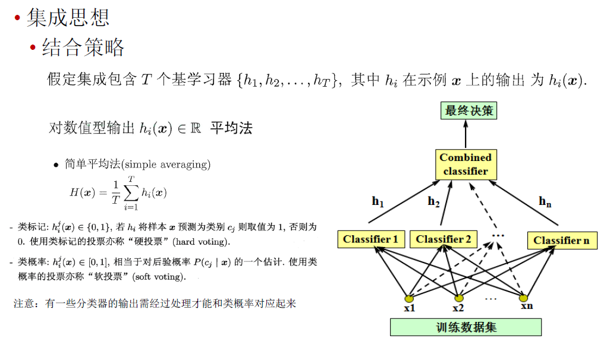

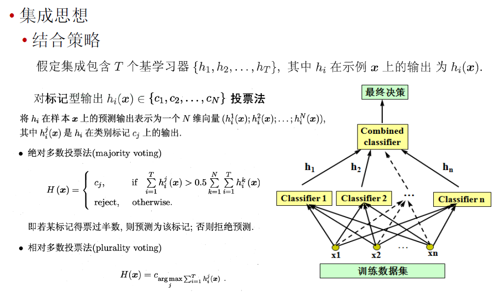

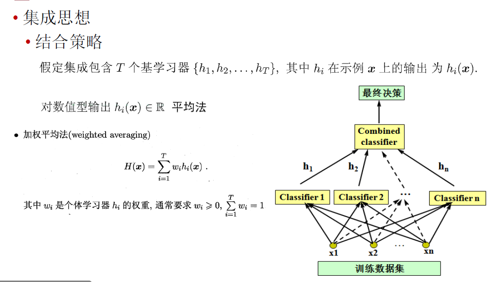

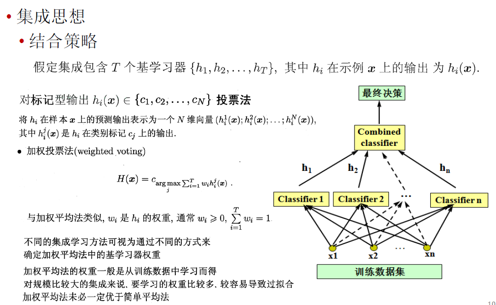

一般而言，在个体学习器性能相差较大时宜使用加权平均法，而在个体学习器性能相近时宜使用简单平均法.

## 构建准则

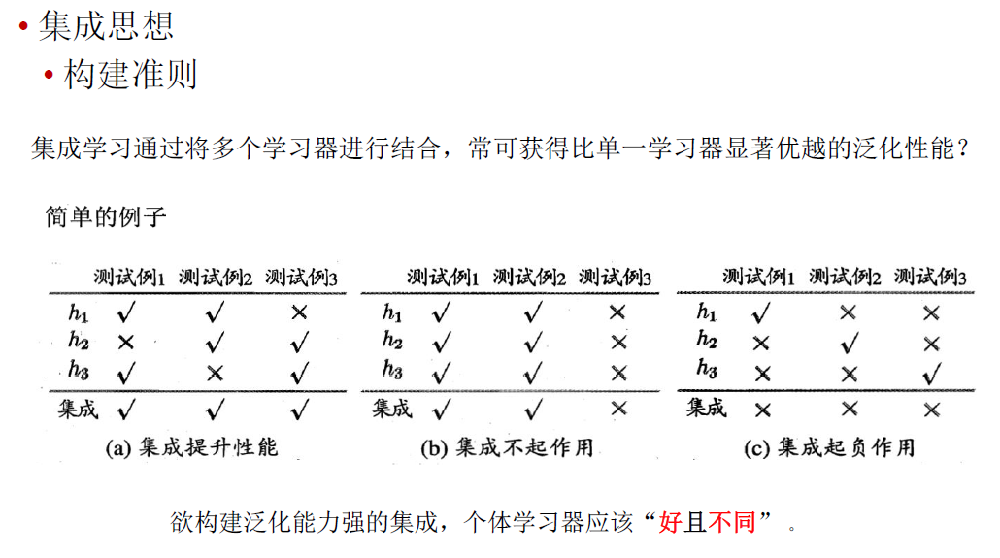

# 集成学习算法

三种流行策略：Stacking, Bagging, Boosting

## Stacking

当训练数据很多时，一种更为强大的结合策略是使用“学习法”，即通过另一个学习器来进行结合。

Stacking [Wolpert, 1992; Breiman, 1996b]是学习法的典型代表，把个体学习器称为初级学习器，用于结合的学习器称为次级学习器或元学习器（meta-learner)

Stacking 先从初始数据集训练出初级学习器，然后"生成"一个新数据集用于训练次级学习器.在这个新数据集中，初级学习器的输出被当作样例输入特征，而初始样本的标记仍被当作样例标记。即初始数据集训练出若干个初级学习器——初级学习器的输出作为次级学习器的输入——初始数据集的类别标记作为次级学习器训练样本的真实标记。

在训练阶段，次级训练集是利用初级学习器产生的，若直接用初级学习器的训练集来产生次级训练集，则过拟合风险会比较大;因此，一般是通过使用交叉验证或留一法这样的方式，**用训练初级学习器未使用的样本来产生次级学习器的训练样本**。

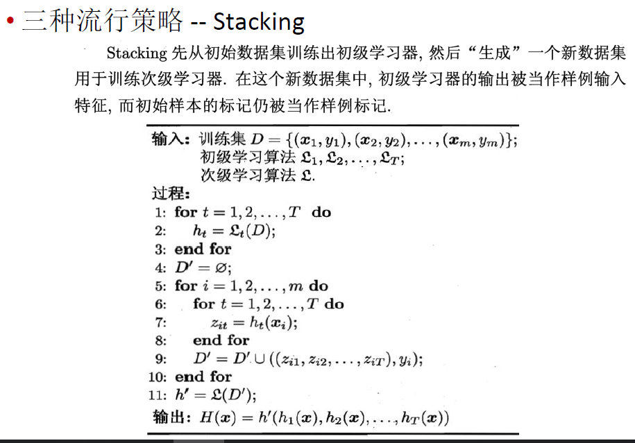

只考虑了初级学习器的训练误差，没有考虑泛化误差，会偏向于训练误差小的初级学习器

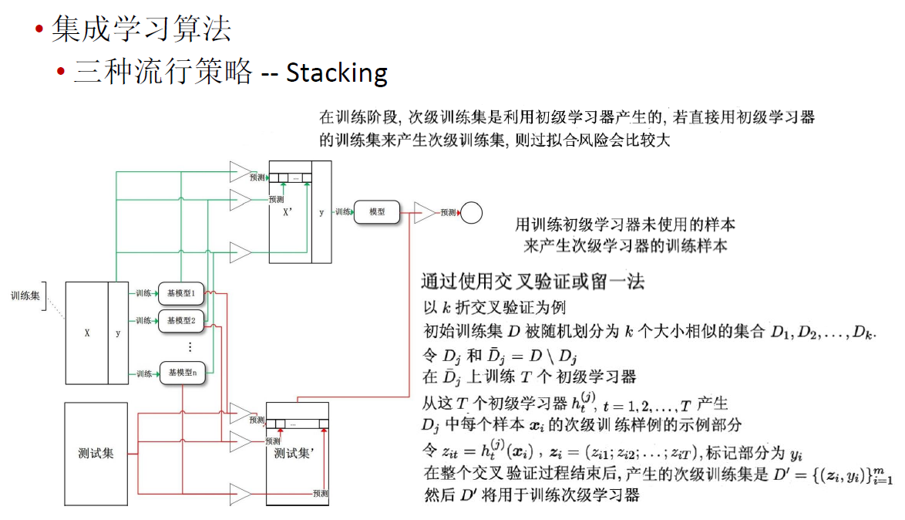

## Bagging & Boosting

个体学习器是同质的，在如何构建个体学习器上做文章

### Bagging

自助采样法（bootstrap sampling）

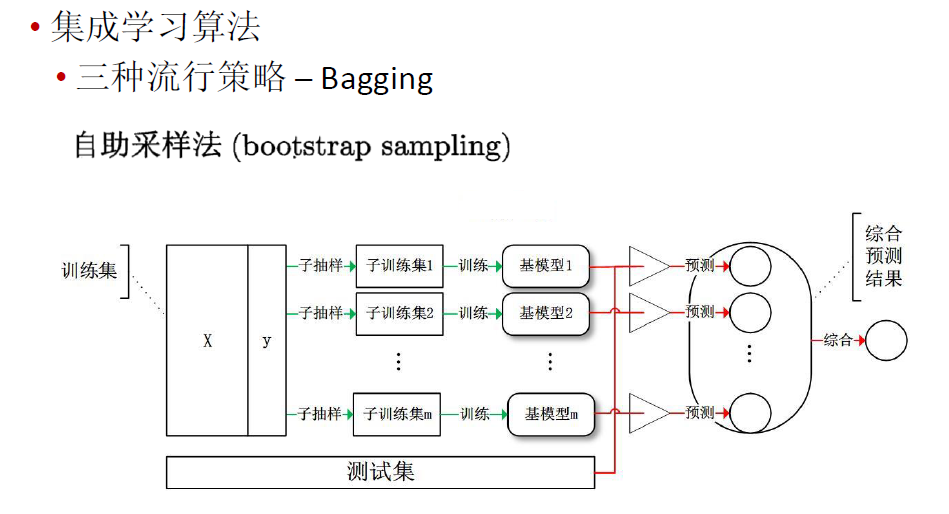

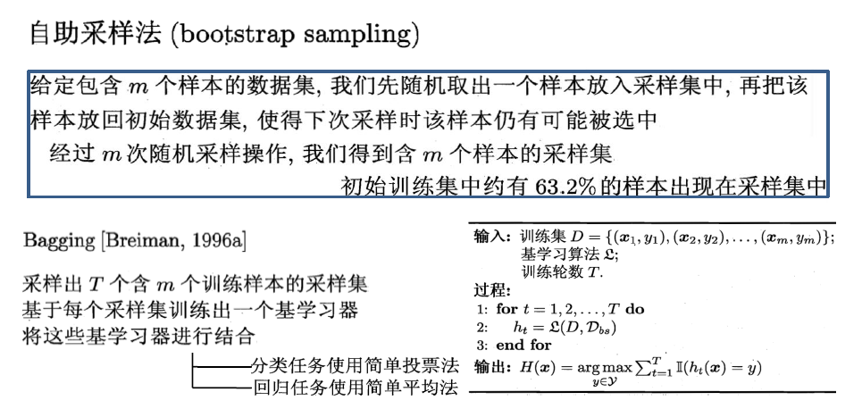

假定基学习器的计算复杂度为O(m) ， 则Bagging的复杂度大致为T (O(m) + O(s)) ，考虑到采样与投票/平均过程的复杂度O(s)很小，而T通常是一个不太大的常数，因此，训练一个Bagging 集成与直接使用基学习算法训练一个学习器的复杂度同阶，这说明Bagging 是一个很高效的集成学习算法。另外，与标准AdaBoost 只适用于二分类任务不同， Bagging 能不经修改地用于多分类、回归等任务。

值得一提的是，自助采样过程还给Bagging 带来了另一个优点:由于每个基学习器只使用了初始训练集中约63.2% 的样本，剩下约36.8% 的样本可用作验证集来对泛化性能进行"包外估计" (out-of-bag estimate)。为此需记录每个基学习器所使用的训练样本.

“包外估计”（out-of-bag estimate）

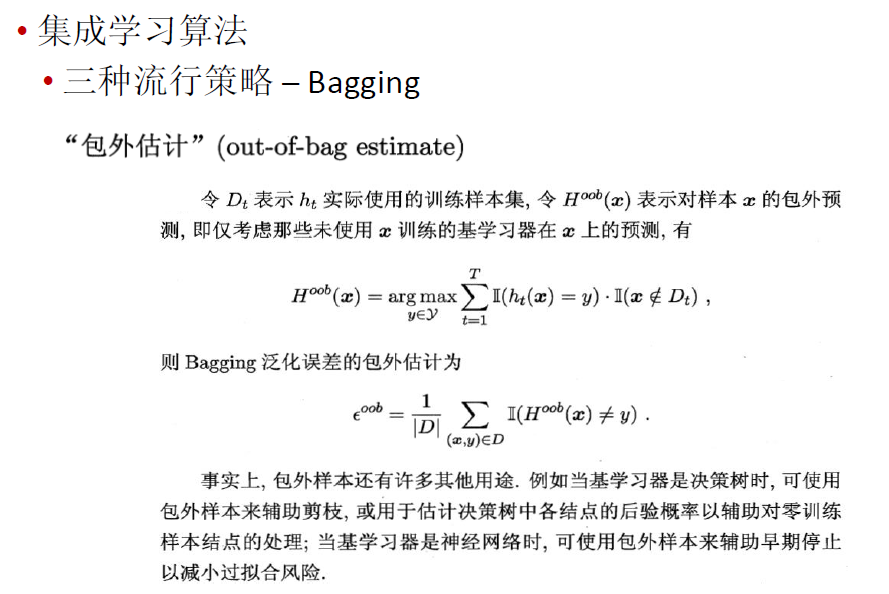

从偏差方差分解的角度看， Bagging 主要关注降低方差，因此它在不剪枝决策树、神经网络等易受样本扰动的学习器上效用更为明显.

### Boosting

Boosting是一族可将弱学习器提升为强学习器的算法。这族算法的工作机制类似：先从初始训练集训练出一个基学习器，==再根据基学习器的表现对训练样本分布进行调整== （**使得个体分类器有所不同**），==使得先前基学习器做错的训练样本在后续受到更多关注，然后基于调整后的样本分布来训练下一个基学习器== （**使得组合分类器变强**）；如此重复进行，直至基学习器数目达到事先指定的值T，最终将这T个基学习器进行加权结合。

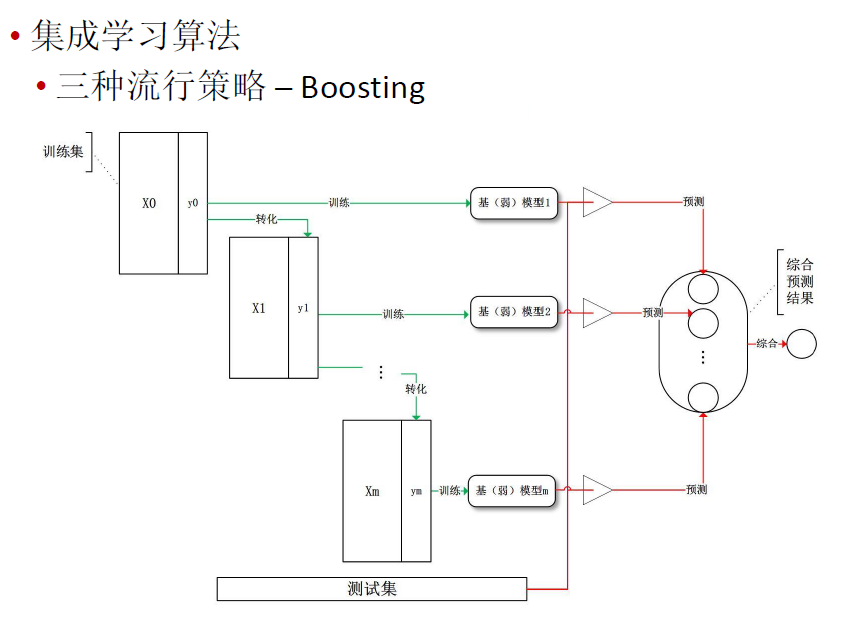

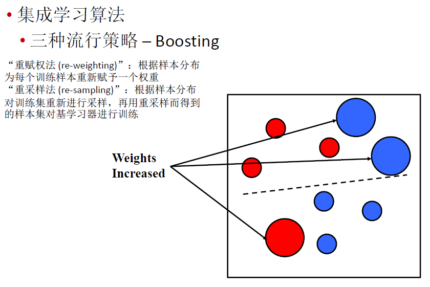

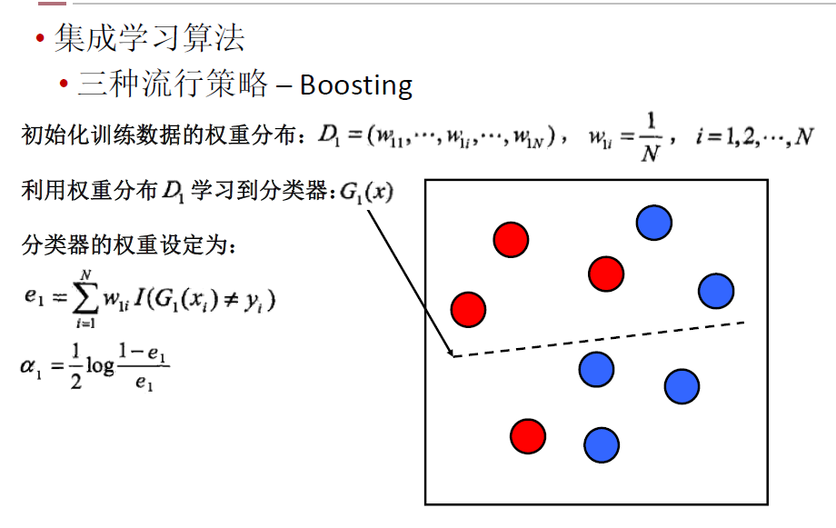

e1是误差，当e1≤1/2时，α1≥0，α1与e1成反比，误差率>50%的学习器不要。

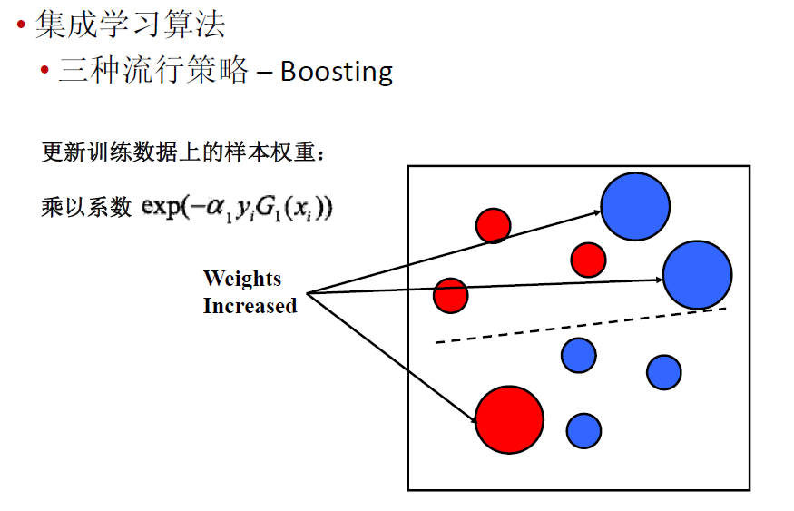

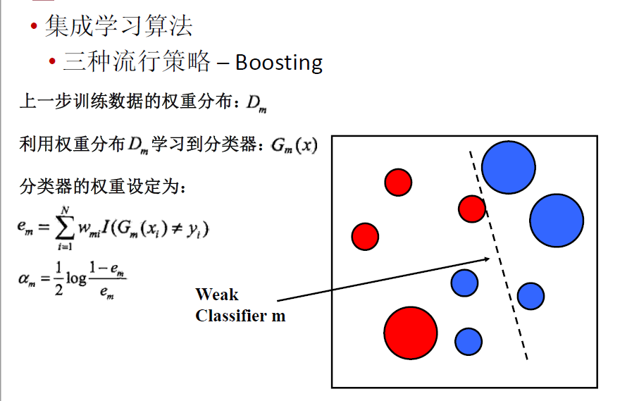

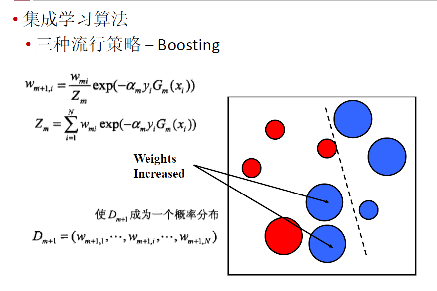

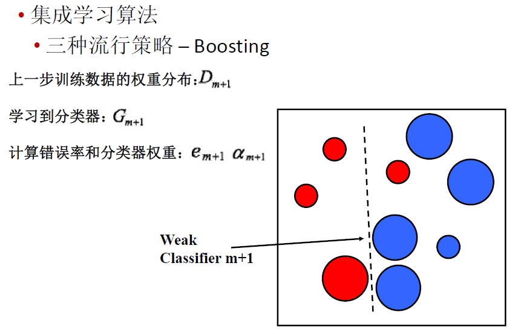

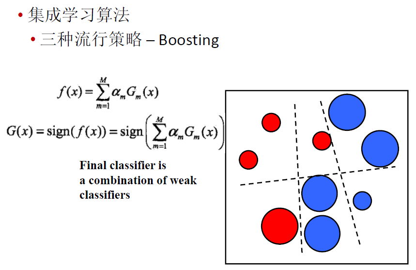

#### 集成学习算法AdaBoost

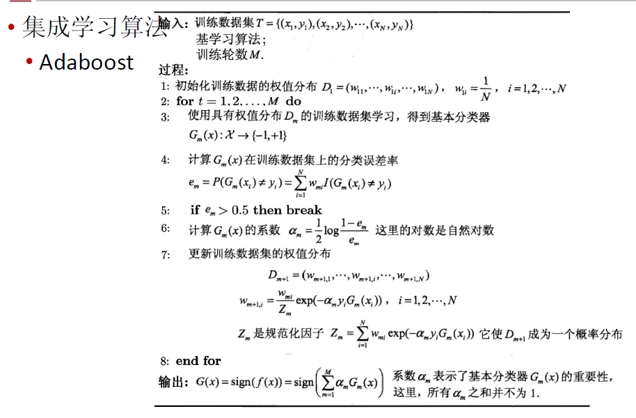

过程3：

“重赋权法(re-weighting)”：

根据样本分布为每个训练样本重新赋予一个权重

“重采样法(re-sampling)”：

根据样本分布对训练集重新进行采样，再用重采样而得到的样本集对基学习器进行训练

可获得“重启动”机会以避免训练过程过早停止

一般而言，这两种做法没有显著的优劣差别.需注意的是， Boosting 算法在训练的每一轮都要检查当前生成的基学习器是否满足基本条件(例如检查当前基分类器是否是比随机猜测好) ，一旦条件不满足，则当前基学习器即被抛弃，且学习过程停止.在此种情形下，初始设置的学习轮数T 也许还远未达到，可能导致最终集成中只包含很少的基学习器而性能不佳.**若采用"重采样法"，则可获得"重启动"机会以避免训练过程过早停止**,即在抛弃不满足条件的当前基学习器之后，可根据当前分布重新对训练样本进行采样，再基于新的采样结果重新训练出基学习器，从而使得学习过程可以持续到预设的T 轮完成。

过程4：

分类误差率是被$G_m(x)$ 误分类样本的权值之和

过程7：

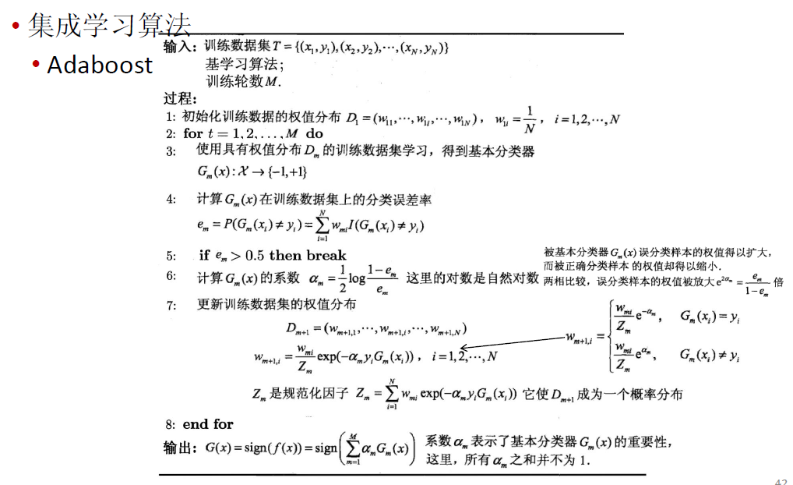

AdaBoost算法有多种推导方式，比较容易理解的是基于“加性模型”（additive model），即基学习器的线性组合 来最小化指数损失函数（exponential loss function）. 求上式关于H(x)的导数，令其为零，可以发现如果指数损失函数最小化，分类错误率也将最小化。

  

AdaBoost算法中，第一个基分类器h1  是通过直接将基学习算法用于初始数据分布而得；此后迭代地生成 $h_t$和$\alpha_t$  ，当基分类器 $h_t$  基于分布 $D_t$  产生后，该基分类器的权重$\alpha_t$  应使得 $\alpha_th_t$ 最小化指数损失函数 )  。通过求关于 $\alpha_t$ 的导数并使其为0可以求得 $\alpha_t$ ，即为算法第6步的分类器权重更新公式。AdaBoost在获得 $H_{t-1} $ （即之前学到的基学习器的线性组合）之后样本分布将进行调整，使下一轮的基学习器 $h_t$能纠正$H_{t-1}$ 的一些错误。理想的能纠正全部错误，即最小化 )  。该式可近似为其泰勒展开式，经过一系列推导得到算法第7步的样本分布更新公式。

AdaBoost算法的流程可以总结为：初始化样本权重分布——训练第一个基分类器——更新该基分类器的权重——更新样本权重分布——训练第二个基分类器——更新该基分类器的权重——更新样本权重分布——...

## Bagging vesus Boosting

**Bagging主要减小了方差variance**

- Bagging采用重复取样,每个个体所采用的训练样本都是从训练集中按等概率抽取的，因此Bagging的各子网能够很好的覆盖训练样本空间，从而有着良好的稳定性。

**Boosting主要减少了偏差bias** （过拟合风险大）

- Boosting是基于权重的弱学习器的结合，采用迭代算法，每一次迭代都根据上一次迭代的预测结果对样本进行加权，所以随着迭代不断进行，误差会越来越小，越来越接近真实值。
- Bagging的训练集的选择是随机的，各轮训练集之间相互独立；Bagging的各个预测函数没有权重；Bagging的各个预测函数可以并行生成，对于神经网络这样极为耗时的学习方法，Bagging可通过并行训练节省大量时间开销。
- Boosting的训练集的选择是独立的，各轮训练集的选择与前面各轮的学习结果有关；
- Boosting的各个预测函数只能顺序生成。

# 集成树算法

## 随机森林RF

随机森林是Bagging的一个扩展变体，RF在以决策树为基学习器构建Bagging集成的基础上，进一步在决策树的训练过程中引入了随机属性选择。

Random Forest = Bagging（减小方差） + CART（减小偏差，fully-grown完整成长）

随机森林实现多样化的子学习器：

- Bagging策略中的数据随机采样思想将会使得各个决策树在训练集方面有多样化。
- RF中另一个增加多样化的策略是候选属性集也将经历一个随机采样形成新的候选属性（子）集。

即样本扰动+属性扰动，使得最终集成的泛化性能可通过个体学习器之间差异度的增加而进一步提升。

CART不用剪枝，完整生长，（Bagging已经可以避免过拟合）。先随机采样形成候选属性集，再根据基尼指数选择划分属性。

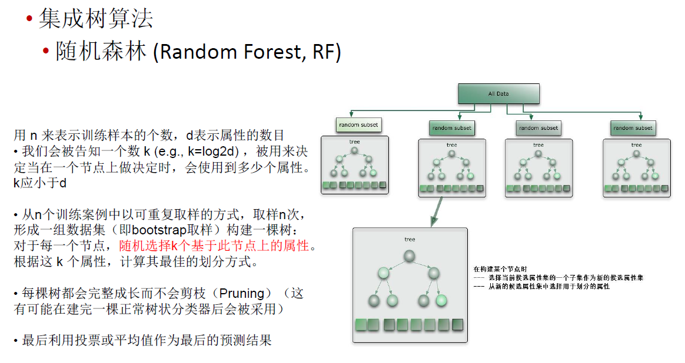

随机森林简单、容易实现、计算开销小，在很多现实任务中展现出强大的性能，被誉为“代表集成学习技术水平的方法”。

随机森林的收敛性与Bagging 相似.如图所示，随机森林的起始性能往往相对较差， 特别是在集成中只包含一个基学习器时。这很容易理解，因为通过引入属性扰动，随机森林中个体学习器的性能往往有所降低。然而，随着个体学习器数目的增加，随机森林通常会收敛到更低的泛化误差. 值得一提的是，随机森林的训练效率常优于Bagging，因为在个体决策树的构建过程中， Bagging使用的是" 确定型" 决策树，在选择划分属性时要对结点的所有属性进行考察，而随机森林使用的" 随机型"决策树则只需考察一个属性子集。

## 梯度提升树GBDT

单独成了一篇，见集成学习之GBDT

xgboost(https://homes.cs.washington.edu/~tqchen/pdf/BoostedTree.pdf)

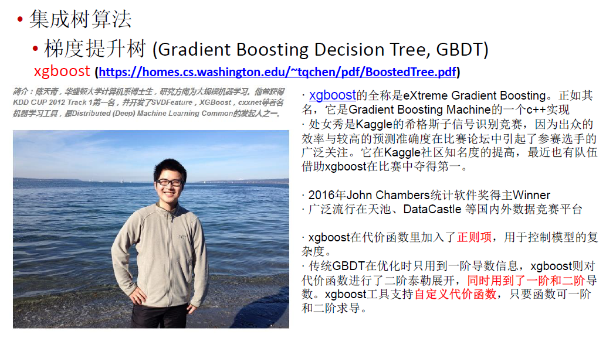

Complete Guide to Parameter Tuning in XGBoost(with codes in Python)

https://www.analyticsvidhya.com/blog/2016/03/complete-guide-parameter-tuning-xgboost-with-codes-python/

1. The XGBoostAdvantage

2. Understanding XGBoostParameters

   General Parameters: Guide the overall functioning
   Booster Parameters: Guide the individual booster (tree/regression) at each step
   Learning Task Parameters: Guide the optimization performed

3. Tuning Parameters (with Example)

==对异常值敏感？==

## xgboost

xgboost的最终结果是每棵树的结果之和

结构风险是叶子的个数和权重的L2平滑组成

回归树的预测输出是实数分数，可以用于回归、分类、排序等任务中。对于回归问题，可以直接作为目标值，对于分类问题，需要映射成概率，比如采用逻辑函数。

目标就是最小化目标值和预测值之间的差异，加上结构风险。根据泰勒展开式可以将损失函数分解，得到含有损失函数对上一棵树的一阶导数和二阶导数的等式。通过这种近似，可以自定义一些损失函数（只要保证二阶可导）。

重新组合化简目标函数，变成在叶子节点上遍历。每个样本都落在一个叶子节点上，q(xi)表示样本xi在某个叶子节点上，wq(xi)是该节点的打分，即该样本的模型预测值。

如果确定了树的结构（即q(x)确定），为了使目标函数最小，可以令其导数为0，解得每个叶节点的最优预测分数。这就是结构分数，wj是叶子j的最优权重值，obj是相应的最优目标函数值。

当回归树的结构确定时，我们前面已经推导出其最优的叶节点分数以及对应的最小损失值，问题是怎么确定树的结构？

- 暴力枚举所有可能的树结构，选择损失值最小的 - NP难问题

- 贪心法，每次尝试分裂一个叶节点，计算分裂前后的增益，选择增益最大的

在实际操作中，我们贪心地增长这棵树：

树的初始深度为0

对于树的每个叶子节点，尝试增加一个划分点。增加划分点之后目标函数值的变化就是：

选择Gain最大的作为最优分割点。

算法步骤：

遍历所有特征的所有可能的分割点，计算gain值，选取值最大的（feature，value）去分割

根据特征划分有无数可能的树结构，因此采用近似算法（特征分位点，候选分割点） 

- Global：学习每棵树前，提出候选切分点
-  Local：每次分裂前，重新提出候选切分点

Boosted Tree Algorithm 

## **xgboost特点（与gbdt对比）**

1.传统GBDT以CART作为基分类器，xgboost还支持线性分类器，这个时候xgboost相当于带L1和L2正则化项的逻辑斯蒂回归（分类问题）或者线性回归（回归问题）。 **—可以通过booster [default=gbtree]设置参数:gbtree: tree-based models/gblinear: linear models**

2.传统GBDT在优化时只用到一阶导数信息，xgboost则对代价函数进行了二阶泰勒展开，同时用到了一阶和二阶导数。顺便提一下，xgboost工具支持自定义代价函数，只要函数可一阶和二阶求导。 **—对损失函数做了改进（泰勒展开，一阶信息g和二阶信息h）**  

3.xgboost在代价函数里加入了正则项，用于控制模型的复杂度。正则项里包含了树的叶子节点个数、每个叶子节点上输出的score的L2模的平方和。从Bias-variance tradeoff角度来讲，正则项降低了模型variance，使学习出来的模型更加简单，防止过拟合，这也是xgboost优于传统GBDT的一个特性 
 **—正则化包括了两个部分，都是为了防止过拟合，剪枝是都有的，叶子结点输出L2平滑是新增的。**

4.shrinkage and column subsampling —**还是为了防止过拟合，论文2.3节有介绍**

> （1）shrinkage缩减类似于学习速率，在每一步tree boosting之后增加了一个参数n（权重），通过这种方式来减小每棵树的影响力，给后面的树提供空间去优化模型。  
>
> （2）column subsampling列(特征)抽样，说是从随机森林那边学习来的，防止过拟合的效果比传统的行抽样还好（行抽样功能也有），并且有利于后面提到的并行化处理算法。  

5.split finding algorithms(划分点查找算法)：
 （1）exact greedy algorithm—**贪心算法获取最优切分点** 
 （2）approximate algorithm— **近似算法，提出了候选分割点概念，先通过直方图算法获得候选分割点的分布情况，然后根据候选分割点将连续的特征信息映射到不同的buckets中，并统计汇总信息。详细见论文3.3节** 
 （3）Weighted Quantile Sketch—**分布式加权直方图算法，论文3.4节** 
 **这里的算法（2）、（3）是为了解决数据无法一次载入内存或者在分布式情况下算法（1）效率低的问题，以下引用的还是wepon大神的总结：**  

> 可并行的近似直方图算法。树节点在进行分裂时，我们需要计算每个特征的每个分割点对应的增益，即用贪心法枚举所有可能的分割点。当数据无法一次载入内存或者在分布式情况下，贪心算法效率就会变得很低，所以xgboost还提出了一种可并行的近似直方图算法，用于高效地生成候选的分割点。

6.对缺失值的处理。对于特征的值有缺失的样本，xgboost可以自动学习出它的分裂方向。  **—稀疏感知算法，论文3.4节，Algorithm 3: Sparsity-aware Split Finding**

7.**Built-in Cross-Validation（内置交叉验证)**  

> XGBoost allows user to run a cross-validation at each iteration of the boosting process and thus it is easy to get the exact optimum number of boosting iterations in a single run. 
>    This is unlike GBM where we have to run a grid-search and only a limited values can be tested.

8.**continue on Existing Model（接着已有模型学习）**   

> User can start training an XGBoost model from its last iteration of previous run. This can be of significant advantage in certain specific applications. 
>    GBM implementation of sklearn also has this feature so they are even on this point.

9.**High Flexibility（高灵活性）**    

> **XGBoost allow users to define custom optimization objectives and evaluation criteria. 
>    This adds a whole new dimension to the model and there is no limit to what we can do.**

10.并行化处理 **—系统设计模块,块结构设计等**

> xgboost工具支持并行。boosting不是一种串行的结构吗?怎么并行的？注意xgboost的并行不是tree粒度的并行，xgboost也是一次迭代完才能进行下一次迭代的（第t次迭代的代价函数里包含了前面t-1次迭代的预测值）。xgboost的并行是在特征粒度上的。我们知道，决策树的学习最耗时的一个步骤就是对特征的值进行排序（因为要确定最佳分割点），xgboost在训练之前，预先对数据进行了排序，然后保存为block结构，后面的迭代中重复地使用这个结构，大大减小计算量。这个block结构也使得并行成为了可能，在进行节点的分裂时，需要计算每个特征的增益，最终选增益最大的那个特征去做分裂，那么各个特征的增益计算就可以开多线程进行。  

此外xgboost还设计了高速缓存压缩感知算法，这是系统设计模块的效率提升。 
 当梯度统计不适合于处理器高速缓存和高速缓存丢失时，会大大减慢切分点查找算法的速度。 
 （1）针对 exact greedy algorithm采用缓存感知预取算法 
 （2）针对 approximate algorithms选择合适的块大小

https://blog.csdn.net/a819825294/article/details/51206410

https://blog.csdn.net/sb19931201/article/details/52557382

http://wepon.me/

https://www.zhihu.com/question/41354392

## 多样性增强

在集成学习中需有效地生成多样性大的个体学习器. 与简单地直接用初始数据训练出个体学习器相比，如何增强多样性呢?一般思路是在学习过程中引入随机性，常见做法主要是对数据样本、输入属性、输出表示、算法参数进行扰动。

- 数据样本扰动

给定初始数据集， 可从中产生出不同的数据子集， 再利用不同的数据子集训练出不同的个体学习器.数据样本扰动通常是基于采样法， 例如在Bagging中使用自助采样，在AdaBoost 中使用序列采样. 此类做法简单高效，使用最广.对很多常见的基学习器，例如决策树、神经网络等， 训练样本稍加变化就会导致学习器有显著变动，数据样本扰动法对这样的"不稳定基学习器"很有效;然而，有一些基学习器对数据样本的扰动不敏感，例如线性学习器、支持向量机、朴素贝叶斯、k 近邻学习器等， 这样的基学习器称为稳定基学习器(stable base learner) ，对此类基学习器进行集成往往需使用输入属性扰动等其他机制.

- 输入属性扰动

训练样本通常由一组属性描述，不同的"子空间" (subspace，即属性子集，子空间一般指从初始的高维属性空间投影产生的低维属性空间，描述低维空间的属性是通过初始属性投影交换而得，未必是初始属性)提供了观察数据的不同视角.显然，从不同子空间训练出的个体学习器必然有所不同.著名的随机子空间(random subspace)算法[Ho， 1998] 就依赖于输入属性扰动，该算法从初始属性集中抽取出若干个属性子集，再基于每个属性子集训练一个基学习器，算法描述如图所示.对包含大量冗余属性的数据，在子空间中训练个体学习器不仅能产生多样性大的个体，还会因属性数的减少而大幅节省时间开销，同时，由于冗余属性多，减少一些属性后训练出的个体学习器也不至于太差.若数据只包含少量属性，或者冗余属性很少，则不宜使用输入属性扰动法.

- 输出表示扰动

此类做法的基本思路是对输出表示进行操纵以增强多样性.可对训练样本的类标记稍作变动，如"翻转法" (Flipping Output) [Breiman, 2000] 随机改变一些训练样本的标记;也可对输出表示进行转化，如"输出调制法" (Output Smearing) [Breiman, 2000] 将分类输出转化为回归输出后构建个体学习器;还可将原任务拆解为多个可同时求解的子任务，如ECOC 法[Dietterich and Bakiri, 1995] 利用纠错输出码将多分类任务拆解为一系列二分类任务来训练基学习器.

- 算法参数扰动

基学习算法一般都有参数需进行设置，例如神经网络的隐层神经元数、初始连接权值等，通过随机设置不同的参数，往往可产生差别较大的个体学习器.例如"负相关法" (Negative Correlation) [Liu and Yao, 1999] 显式地通过正则化项来强制个体神经网络使用不同的参数.对参数较少的算法，可通过将其学习过程中某些环节用其他类似方式代替，从而达到扰动的目的，例如可将决策树使用的属性选择机制替换成其他的属性选择机制.值得指出的是，使用单一学习器时通常需使用交叉验证等方法来确定参数值，这事实上已使用了不同参数训练出多个学习器，只不过最终仅选择其中一个学习器进行使用，而集成学习则相当于把这些学习器都利用起来;由此也可看出，集成学习技术的实际计算开销并不比使用单一学习器大很多.

# Blending

也是集成学习的一种。和Stacking类似，只是把Stacking流程中的K-Fold CV 改成 HoldOut CV。

