**有监督算法**

1.逻辑回归——二分类，softmax

2.树模型，ID3，C45，CART，DT——并行：RandomForest, 串行：GBDT，xgboost, lightgbm

NB——贝叶斯


**无监督算法**

聚类：K-means（EM算法）——k怎么确定(百面机器学习)，缺点？初始值的影响——改进？sklearn

降维：PCA


**损失函数**

回归：L2 loss

分类：log loss, cross-entropy, hinge loss


**评估方法**：K-Fold，Hold-out, bootstrap, A-B-test

**评估准则**：precision, recall, Confusion matrix, auc-roc, KS, mae, mse, r2, mape, macro, micro


**面试**

原理型：

1.各类模型原理知识

2.模型评估

应用型：

1.数据处理、清洗方式，异常点，格式组织(csv, libsvm, libFM)，缺失值(ffill, bfill, fillna)

2.特征工程，连续性、离散型、时间型，embedding

3.特征选择

4.模型选择

5.模型优化


**LR**

损失函数——与极大似然的关系——GD/二阶/学习率

LR与SVM、DT、KNN对比

决策边界：LR是一条直线，DT的决策边界是锯齿状的，KNN垂直平分线？

LR与SVM的差别：画图，LR是计算所有样本的loss，求和优化，而SVM只关心支持向量。

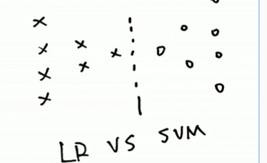


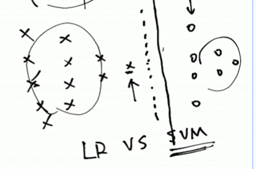

KNN和K-means不要弄混

LR是分类算法，overfitting，正则化

L1——阶段性效应，可以产生稀疏解

L2——压缩性效应，

百面机器学习，prml

贝叶斯角度理解L1和L2正则化：L1加了个拉普拉斯先验，L2加了个高斯先验


**SVM**

核函数：linear kernel, 多项式，rbf——映射到无穷多维(泰勒展开)

对缺失值/异常值敏感性？对缺失值敏感，需要提前填充，对异常值不太敏感


**DT**

ID3、C4.5、CART的差异

DT对于缺失值怎么处理？sklearn如果有缺失值会报错，xgb/lgb库不会，内部处理

DT泛化——RF(并行)——boosting, GBDT, xgboost, Adaboost，他们的区别？

SVM把原始问题转为对偶问题的目的

LR和SVM、SVM的kernel分别在什么场景用

GBDT和xgboost, xgboost(level-wise)和lightgbm(leaf-wise，深度优先)的差异，调参：重要参数(树深，叶子最大数，学习率，轮次)

xgboost控制树深，lightgbm控制叶子数量，最大叶子数更有效

xgboost和lightgbm如何控制过拟合的？正则化，采样，

RF——并行，xgboost——并行化在哪里？选取属性，属性的分裂层面

xgboost的二分类：score——logloss，多分类——one vs rest思想，构建多棵树

xgboost 近似算法是怎么做的？

串行算法，每次生成1棵树，score，乘以系数，为什么要乘以系数，不直接相加？shrinkage


**过拟合和欠拟合**

怎么评估模型状态？overfitting/underfitting

train, valid之间的diff

缓解overfitting：

1.加数据；2.正则化(L1, dropout)；3.集成学习(工业界不常用)；4.xgb/lgb/DL，early stopping；5.RF采样


**数据不均衡**

imbalanced data，比如点击/不点击，病人/正常人

比如GridSearchCV不起作用，原因可能是：

1.scoring是不是用default，不均衡的时候不能用accuracy，用auc或F1

2.数据分层采样，k-fold， stratifiedCV

如果有100亿样本，怎么计算auc？

快速估算，并行计算

auc的物理含义是你预估的正样本概率大于你预估的负样本概率的概率

如果陷入overfitting，缓解，提高效果？

1.采样，欠采样(要考虑样本本身的数量大小)

2.过采样，直接重复；SMOTE

3.cost-sensitive learning 

4.把大的数据拆成很多份，构建多个模型，集成


**特征工程与特征选择**

离散化的作用，为什么？

比如给LR这样的线性模型带来非线性

DT是非线性模型，不需要做离散化,scaling,xgb/lgb缺失值

特征选择

xgb/lgb——feature importance，比如基于特征分裂次数


**如何系统化、高效的学习AI算法**

编程——数据分析/处理/可视化——大数据——算法原理——机器学习DL动手

项目


**NLP工程师的职责、工作内容**

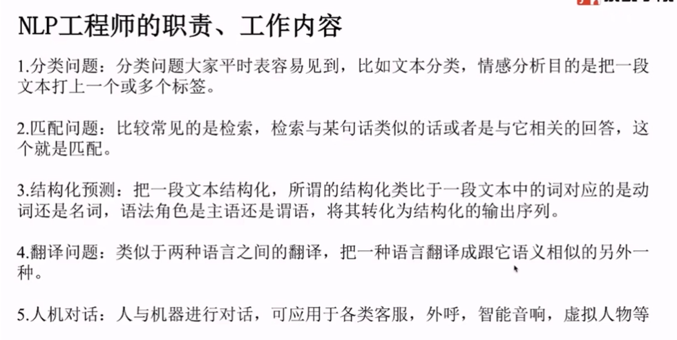

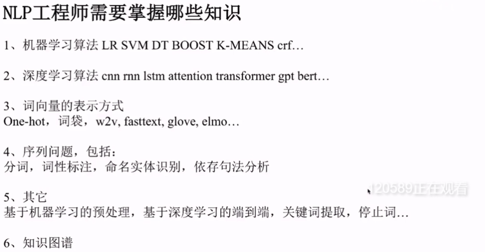


**推荐算法工程师面试**

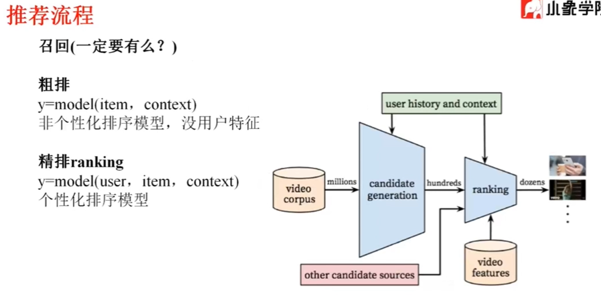

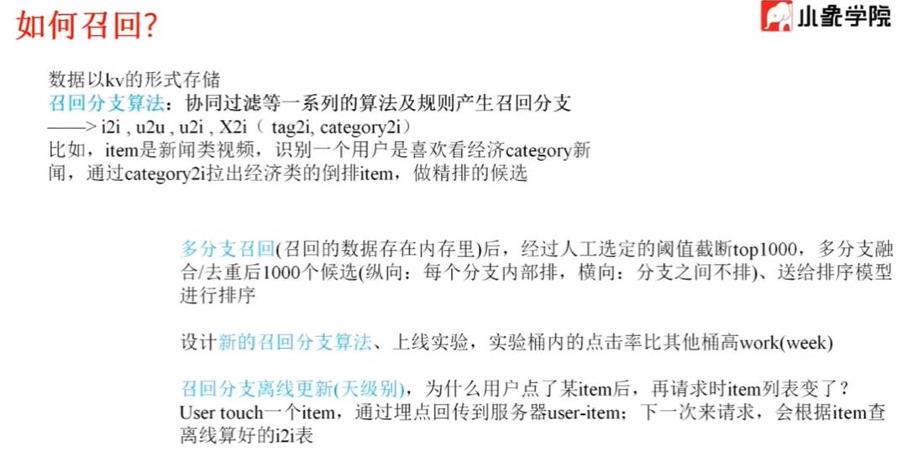

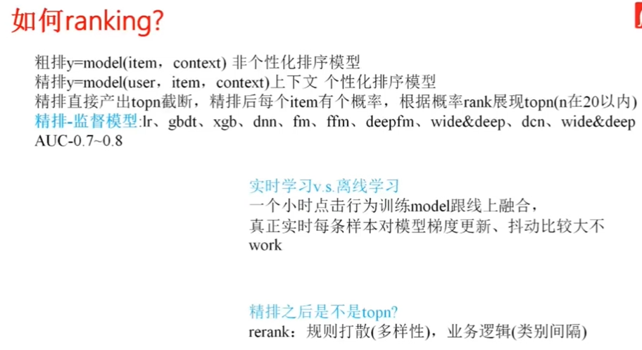


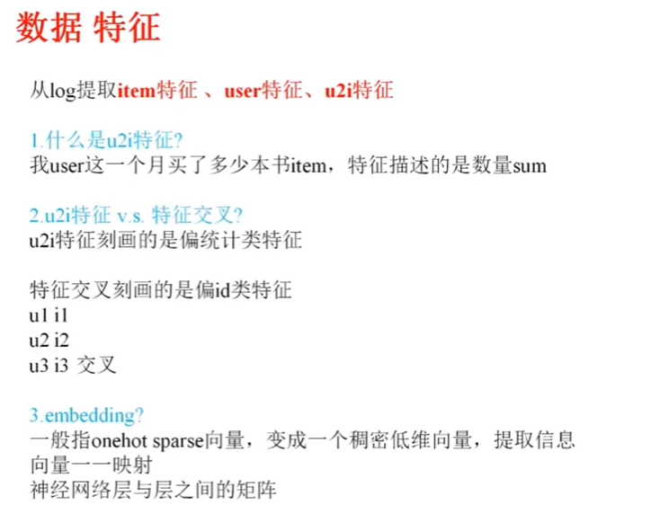

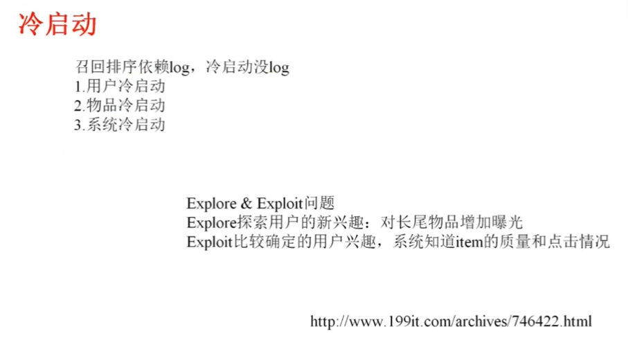

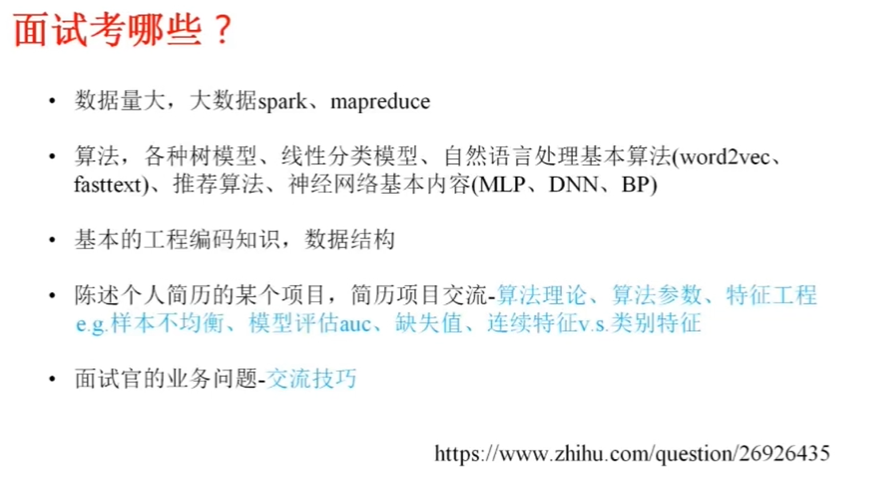

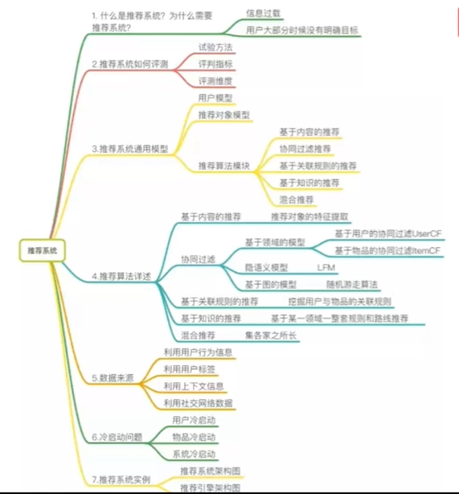

## 其它

**鞍点上的Hessian矩阵是正定的？负定的？**

鞍点：梯度等于零，在其附近Hessian矩阵有正的和负的特征值，行列式小于0，即是不定的。 

鞍点和局部极值的区别： 

鞍点和局部极小值相同的是，在该点处的梯度都等于零，不同在于在鞍点附近Hessian矩阵是不定的，非正定，非负定，非半正定(行列式小于0)，而在局部极值附近的Hessian矩阵是正定的。

**已知一组数据的协方差矩阵P,下面关于主分量说法错误的是()**

```
主分量分析的最佳准则是对一组数据进行按一组正交基分解, 在只取相同数量分量的条件下,以均方误差计算截尾误差最小
在经主分量分解后,协方差矩阵成为对角矩阵
主分量分析就是K-L变换
主分量是通过求协方差矩阵的特征值得到
```

C，K-L变换与PCA变换是不同的概念，PCA的变换矩阵是协方差矩阵，K-L变换的变换矩阵可以有很多种（二阶矩阵、协方差矩阵、总类内离散度矩阵等等）。当K-L变换矩阵为协方差矩阵时，等同于PCA。

**位势函数法的积累势函数K(x)的作用相当于Bayes判决中的()**

```
后验概率
先验概率
类概率密度
类概率密度与先验概率的乘积
```

AD

**统计模式分类问题中，当先验概率未知时，可以使用()**

```
最小最大损失准则
最小误判概率准则
最小损失准则
N-P判决
```

AD，

A. 考虑p(wi)变化的条件下，是风险最小

B. 最小误判概率准则， 就是判断p(w1|x)和p(w2|x)哪个大，x为特征向量，w1和w2为两分类，根据贝叶斯公式，需要用到先验知识

C. 最小损失准则，在B的基础之上，还要求出p(w1|x)和p(w2|x)的期望损失，因为B需要先验概率，所以C也需要先验概率

D. N-P判决，即限定一类错误率条件下使另一类错误率为最小的两类别决策，即在一类错误率固定的条件下，求另一类错误率的极小值的问题，直接计算p(x|w1)和p(x|w2)的比值，不需要用到贝叶斯公式_

**基于二次准则函数的H-K算法较之于感知器算法的优点是()?**

```
计算量小
可以判别问题是否线性可分
其解完全适用于非线性可分的情况
其解的适应性更好
```

BD，HK算法思想很朴实,就是在最小均方误差准则下求得权矢量.
他相对于感知器算法的优点在于,他适用于线性可分和非线性可分得情况,对于线性可分的情况,给出最优权矢量,对于非线性可分得情况,能够判别出来,以退出迭代过程.
