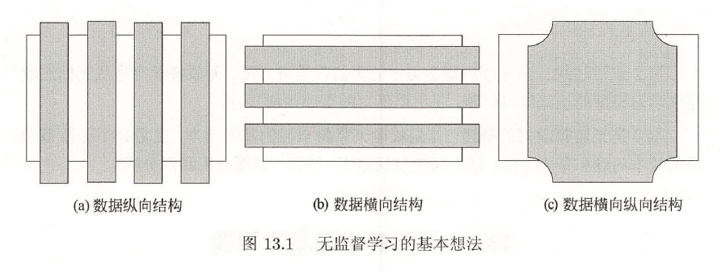
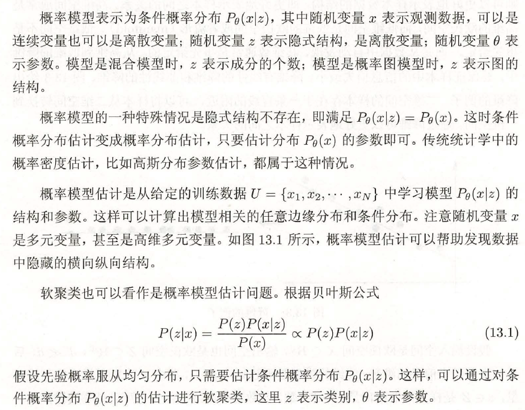
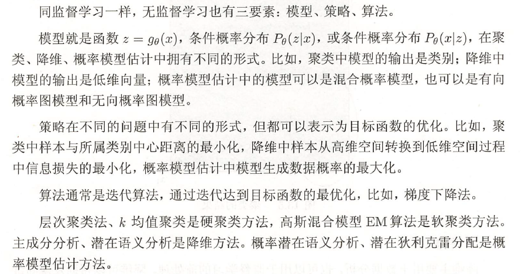

无监督学习的基本想法是对给定数据（矩阵数据）进行某种“压缩＂，从而找到数据的潜在结构。假定损失最小的压缩得到的结果就是最本质的结构。图13 . l 是这种想法的一个示意图。可以考虑发掘数据的纵向结构，把相似的样本聚到同类， 即对数据进行聚类。还可以考虑发掘数据的横向结构，把高维空间的向量转换为低维空间的向量，即对数据进行降维。也可以同时考虑发掘数据的纵向与横向结构，假设数据由含有隐式结构的概率模型生成得到， 从数据中学习该概率模型。

## 基本问题

### 聚类

聚类(clustering) 是将样本集合中相似的样本（实例）分配到相同的类，不相似的样本分配到不同的类。聚类时， 样本通常是欧氏空间中的向量， 类别不是事先给定，而是从数据中自动发现，但类别的个数通常是事先给定的。样本之间的相似度或距离由应用决定。如果一个样本只能属于一个类，则称为硬聚类(hard clustering) ；如果一个样本可以属于多个类，则称为软聚类(soft clustering) 。

### 降维

降维(dimensionality reduction) 是将训练数据中的样本（实例）从高维空间转换到低维空间。假设样本原本存在千低维空间， 或者近似地存在于低维空间，通过降维则可以更好地表示样本数据的结构，即更好地表示样本之间的关系。高维空间通常是高维的欧氏空间，而低维空间是低维的欧氏空间或者流形(manifold) 。低维空间不是事先给定，而是从数据中自动发现， 其维数通常是事先给定的。从高维到低维的降维中，要保证样本中的信息损失最小。降维有线性的降维和非线性的降维。

### 概率估计模型

概率模型估计(probability model estimation) ，简称概率估计，假设训练数据由一个概率模型生成，由训练数据学习概率模型的结构和参数。概率模型的结构类型，或者说概率模型的集合事先给定，而模型的具体结构与参数从数据中自动学习。学习的目标是找到最有可能生成数据的结构和参数。概率模型包括混合模型、概率图模型等。概率图模型又包括有向图模型和无向图模型。

## 三要素

话题分析是文本分析的一种技术。给定一个文本集合，话题分析旨在发现文本集合中每个文本的话题，而话题由单词的集合表示。注意，这里假设有足够数量的文本，如果只有一个文本或几个文本，是不能做话题分析的。话题分析可以形式化为概率模型估计间题，或降维问题。

很多应用中的数据是以图的形式存在，图数据表示实体之间的关系，包括有向图、无向图、超图。图分析(graph analytics) 的目的是发掘隐藏在图中的统计规律或潜在结构。链接分析(link analysis) 是图分析的一种，包括PageRank 算法， 主要是发现有向图中的重要结点。

PageRank 算法是无监督学习方法。给定一个有向图，定义在图上的随机游走即马尔可夫链。随机游走者在有向图上随机跳转，到达一个结点后以等概率跳转到链接出去的结点，并不断持续这个过程。PageRank 算法就是求解该马尔可夫链的平稳分布的算法。一个结点上的平稳概率表示该结点的重要性，称为该结点的PageRank 值。被指向的结点越多，该结点的PageRank 值就越大； 被指向的结点的PageRank 值越大， 该结点的PageRank 值就越大。直观上PageRank 值越大结点也就越重要。

