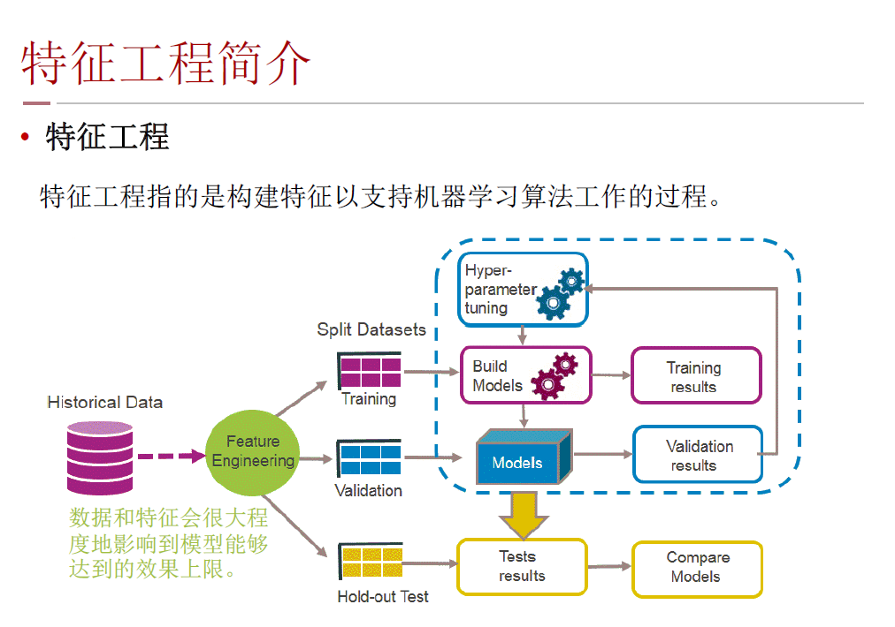
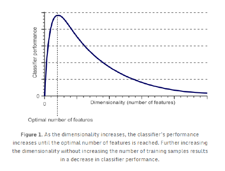
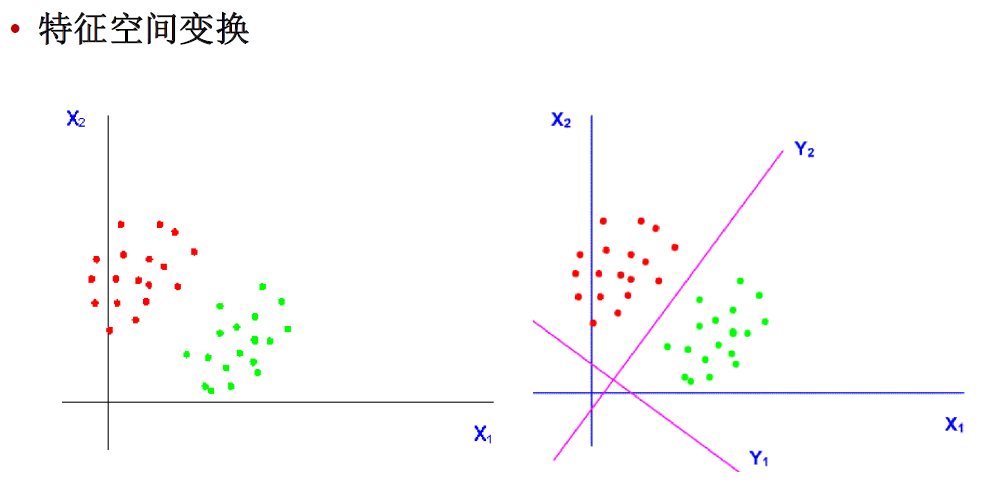
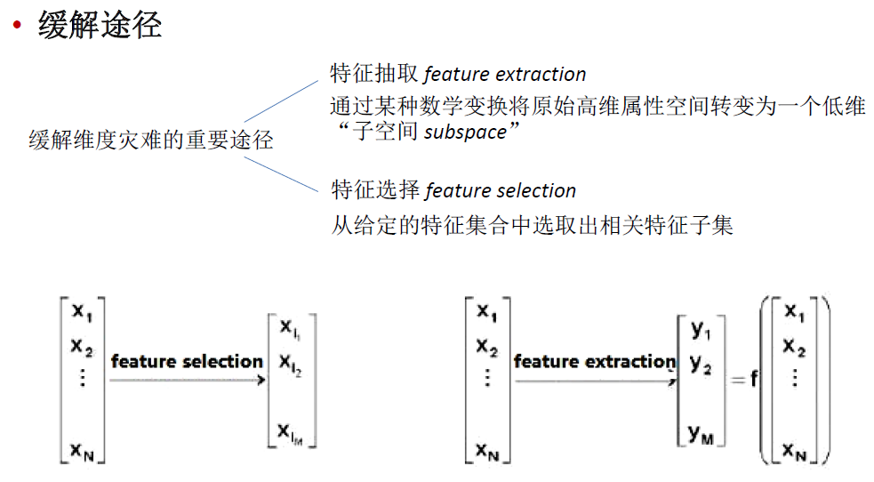
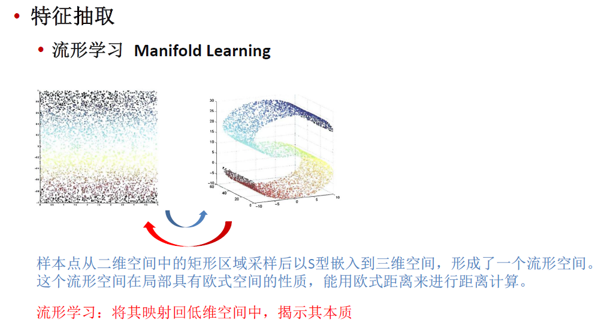
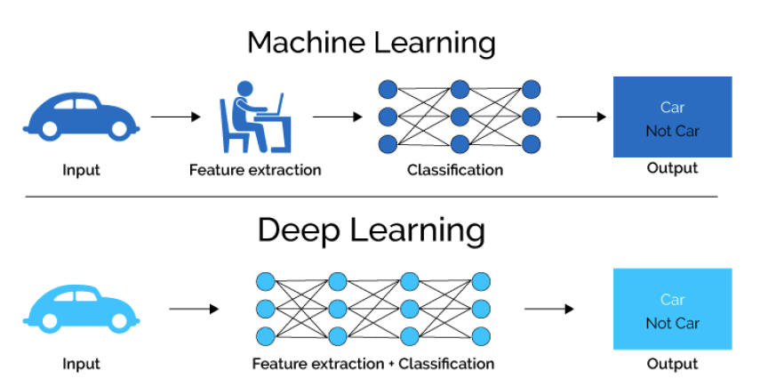

特征工程 Feature Engineering

# 特征工程简介

## 特征工程



## 特征类型

- 标称特征Nominal/Categorical feature
- 二值特征Binary feature
- 序数特征Ordinal feature
- 数值特征Numeric feature

离散特征， 连续特征

## 独热编码One-hot encoding

| is_red | is_green | is_blue |
| ------ | :------: | ------: |
| 1      |    0     |       0 |
| 0      |    1     |       0 |
| 0      |    0     |       1 |

哑变量编码 dummy encoding

| is_red | is_green |
| ------ | :------: |
| 1      |    0     |
| 0      |    1     |
| 0      |    0     |

# 特征预处理

- 特征标准化 Standardization
- 特征归一化、正规化 Normalization
- 特征平滑，如log平滑

# 维度约简

**请解释什么是降维，在哪些地方会用到位置，以及它的好处是什么？**

降维是通过获得一组重要特征的主要变量来减少特征变量数量的过程。特征的重要性取决于特征变量对数据信息的贡献程度，以及你所使用的技术。而决定使用哪种技术取决于反复的试验和个人偏好。通常是从线性技术开始，然后转向非线性技术。数据集降维的好处是：（1）减少所需的存储空间（2）加速计算（例如在机器学习算法中），更少的维度意味着更少的计算，更少的维度允许使用不适用于高维度的算法（3）删除冗余特征，例如以平方米和平方英里存储地形大小没有任何意义（可能数据收集存在缺陷）（4）将数据维度减少到 2D 或 3D，这样我们就可以绘制和可视化它们，从而获得更多见解（5）太多的特征或太复杂的模型可能导致过拟合。

## 维度灾难

- 特征个数越多，分析特征、训练模型所需的时间就越长。
- 特征个数越多，模型也会越复杂，其推广能力会下降。

在高维情形下容易出现数据样本稀疏、距离计算困难等问题，这些对于大部分的机器学习方法而言都是严重障碍。这种现象称为“维度灾难curse of dimensionality”





缓解维度灾难的重要途径

特征抽取feature extraction
通过某种数学变换将原始高维属性空间转变为一个低维“子空间subspace”

特征选择feature selection
从给定的特征集合中选取出相关特征子集




## 特征抽取

**下列哪些方法可以用来对高维数据进行降维:**

```
LASSO
主成分分析法
聚类分析
小波分析法
线性判别法
拉普拉斯特征映射
```

都可以，lasso通过参数缩减达到降维的目的；

线性鉴别法即LDA通过找到一个空间使得类内距离最小类间距离最大所以可以看做是降维；

小波分析有一些变换的操作降低其他干扰可以看做是降维

拉普拉斯请看这个http://f.dataguru.cn/thread-287243-1-1.html

### 主成分分析PCA

### 线性判别分析LDA

### 多维尺度变换/多维缩放 MDS

多维尺度变换/多维缩放multi-dimensional scaling (MDS)

希望在低维空间中，原始空间样本之间的距离得以保持。


假设m个样本在原始空间的距离矩阵为D $ \in R^{m×m} $

第$i$ 行$j$ 列的元素$dist_{ij}$ 为样本$x_i$ 到 $x_j$ 的距离

样本在$d'$ 维空间的表示$Z\in R^{d'×m}, d' \leq d$

任意两个样本在$d'$ 维空间中的欧式距离等于原始空间中的距离

### 流形学习

样本点从二维空间中的矩形区域采样后以S型嵌入到三维空间，形成了一个流形空间。这个流形空间在局部具有欧式空间的性质，能用欧式距离来进行距离计算。
流形学习：将其映射回低维空间中，揭示其本质

学习流形学习理论可从Isomap算法看起



# 特征工程利器-深度学习

 

## 参考资料

[一日一学--如何对数值型特征进行分桶](https://cloud.tencent.com/developer/article/1590912)

[http://www.huaxiaozhuan.com/统计学习/chapters/8_feature_selection.html](http://www.huaxiaozhuan.com/统计学习/chapters/8_feature_selection.html)

[一文读懂特征工程](https://segmentfault.com/a/1190000024522693)

[美团机器学习实践第二章-特征工程总结](https://www.jianshu.com/p/6133dc3bf190)

[浅谈微视推荐系统中的特征工程](https://cloud.tencent.com/developer/article/1550427)

[基于sklearn决策树的最优分箱与IV值计算-Python实现](https://zhuanlan.zhihu.com/p/58824825)

[LightGBM分箱算法](https://blog.csdn.net/yftadyz/article/details/108466687)

[连续特征的离散化：在什么情况下将连续的特征离散化之后可以获得更好的效果？](https://www.zhihu.com/question/31989952/answer/54184582)

[特征离散化（分箱）综述](https://zhuanlan.zhihu.com/p/68865422)

[XGBoost+LR融合的原理和简单实现](https://zhuanlan.zhihu.com/p/42123341)

