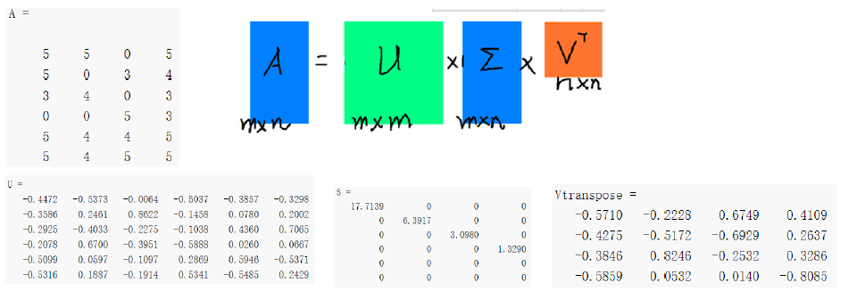
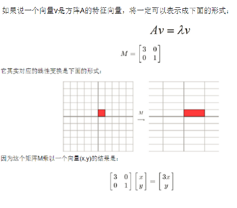
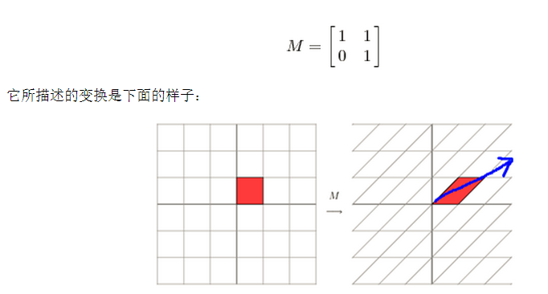
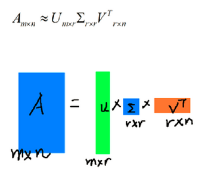
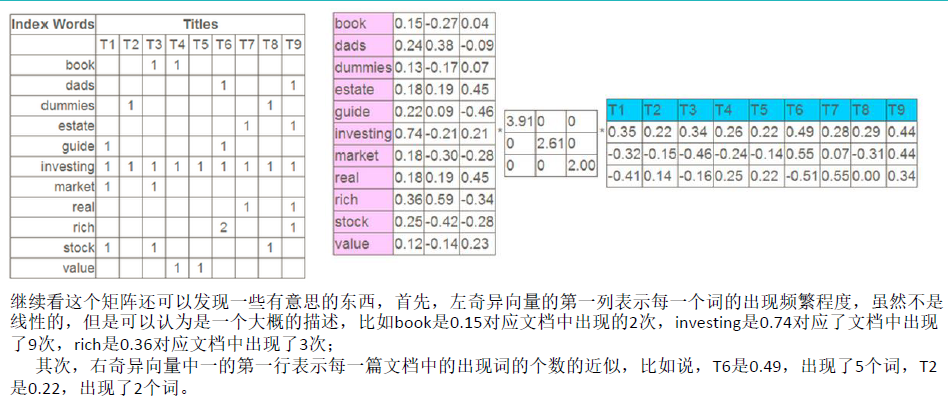
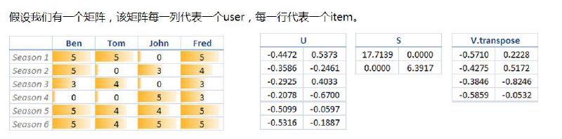
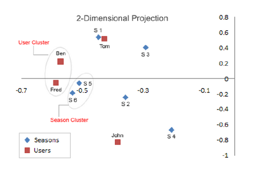
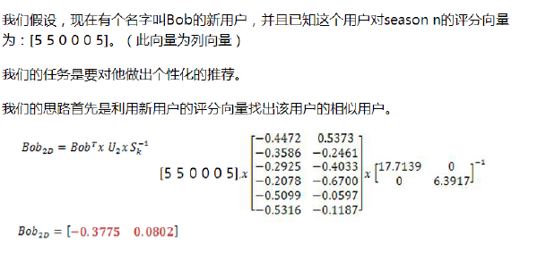
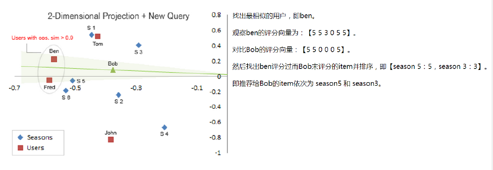

## SVD

矩阵分解：将矩阵分解为一个方阵、一个对角矩阵和另一个方阵

一个矩阵乘以一个向量相当于对这个向量做了线性变换

这其实是在平面上对一个轴进行的拉伸变换（如蓝色的箭头所示），在图中，蓝色的箭头是一个最主要的变化方向（变化方向可能有不止一个），如果我们想要描述好一个变换，那我们就描述好这个变换主要的变化方向就好了。反过头来看看之前特征值分解的式子，分解得到的Σ矩阵是一个对角阵，里面的特征值是由大到小排列的，**这些特征值所对应的特征向量就是描述这个矩阵变化方向（从主要的变化到次要的变化排列）**

如果我们想提取矩阵的r个主要特征，就可以只保留它的最大的r个特征值对应的特征向量。

看一个例子，左边矩阵分解为右边三个矩阵

SVD就是对原始矩阵的一个特征压缩，压缩成了特征向量。可以用在推荐上。

对角矩阵2×2，只保留最重要的两个特征。将U和V画在坐标轴中，U呈现了物体之间的关系，V呈现了人之间的关系。

画到坐标轴中

