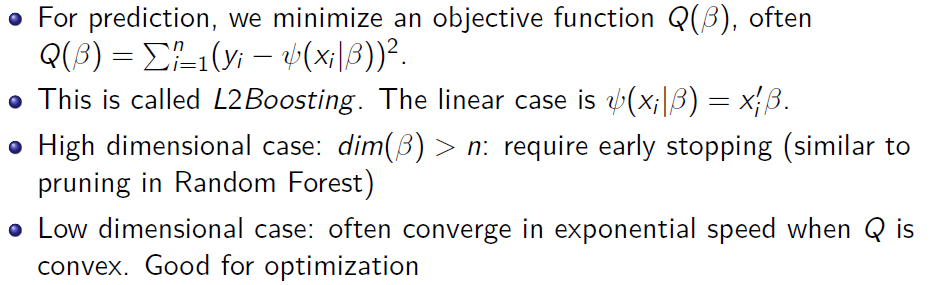

Statistical Theory of Deep Learning and Its Applications

Ye Luo (University of Hong Kong)

## Day 1

**Why do we study neural networks?**

- Neural network (intuitively) has much better properties than other statistical/ machine learning procedures, which means that it also has greater potentials.
- Many theoretical properties are still unknown. Guidance is needed for practical purposes.
- In practice, neural network outperforms almost every other statistical/machine learning procedures when large amount of data is available.

**What does people do with neural networks in practice?**

- Image recognition/ Speech recognition.
- Predict outcomes of individual behaviors based on big data.
- Develop just-in-time system to predict gaps in supply and demand and therefore automatically generate pricing policies.
- Build complicated models to interpret patterns of data that humans do not understand.
- There exists huge potential in using neural networks in analyzing complicated data.

**Performance comparison**

线性回归的收敛速度是$1/\sqrt{n}$，n是数据量

**What is a neural network?**

- Neural network consists one input layer, with independent variables z serving as inputs. So the number of input neurons equals to the dimensionality of z.
- one output layer, with dependent variable y serving as the target of outputs (y is not output, but you want the output to be as close to y as possible under a certain norm/a loss function). The number of output neurons equals to the dimensionality of y.
- one or more hidden layers of neurons that link inputs and outputs.
- One hidden layer: shallow neural network. More than one: deep neural network. Deep Learning: using deep neural network as estimators.
- Values propagate from inputs to outputs layer after layer, via activation functions (will explain shortly).

**What do neural networks do?**

- Each neuron has a few parameters of its own (w and b). So there are many parameters in total, denoted them as a vector $\beta$.
- Given all the values of the links, you can calculate the output vector $\hat y$ given x through feedforward, i.e., you can forward propagate the values of neurons layer by layer. Therefore, the output of neural network is a function of x, depending on the parameter . Denote it as $\hat y=\psi (x|\beta)$ .
- Given a loss function L(·, ·), you solve: $min_{\beta}\sum_{i=1}^n L(\hat y_i, y_i)min_{\beta}\sum_{i=1}^n L(\psi(x_i|\beta), y_i)$L can be any function of interests, including:
  - L2 loss:$L(\hat y, y) = ||\hat y − y||_2^2$
  - L1 loss:$L(\hat y, y) = ||\hat y − y||_1$.
  - Entropy (for y being one-dimensional): $L(\hat y, y) = ylog(\frac{\hat y}{y})$

**Neural Network in 1990s**

- Mostly used Neural Networks were shallow neural Networks. Deep Neural Networks are too difficult to optimize.
- It was also known as “projection pursuit”. Neural Networks, as “projection pursuit”, has nothing to do with human brain structures. Model $f (x) = \sum_{i=1}^k\phi_i(x\beta_i).\beta_ i $: projection parameter.  $\phi_i$: non-linear functional link needed to be learned.
- Later, researchers discover that it is ok to set $\phi_i=c_i\phi, \phi$ is a common (increasing) non-linear link function.
- Training cost were high compared to other methods such as regression, SVM and others. Non-linear, non convex optimization.
- Bayesian Networks and Markov Chain Monte-Carlo methods were a popular way to work with neural networks. Also computational costly.

**Some other popular Machine Learning methods**

- Monitored Learning: there is a guidance variable y to be fitted against some predictors x.
- Regression-based machine learning methods: Regression, LASSO, Ridge, Boosting.
- Classification-based machine learning methods: Random Forest, AdaBoost, Support Vector Machines(SVM), etc..
- Un-Monitored Learning: There is no guidance variable y to be fitted. What is the objective function to optimize?
- K-Means algorithm, Mixture models and EM algorithms, clustering algrithms, discrete smoothing.
- Many other modern machine learning techniques that performs multiple of above tasks together. Multi-algorithms AI systems that may include one or more ML algorithms such as DL and others.

**LASSO**

$\beta = argmin_\beta Q(\beta) +\lambda \sum_{i=1}^p |\beta_i|$

- $\lambda$ is a tuning parameter.
- Q is the objective function.
- Good when Q is convex - convex optimization.
- Variable Selection and good performance in high dimensional models (dim($\beta$) > n, where n is sample size).

**SVM**

**Non-linearity**

- In LASSO or SVM, the way to solve non-linearity is to introduce non-linear transformations of x - expanding the base functions/base learners.
- In LASSO, we can use z = polynomials of x to replace x.
- In SVM, we can use kernel functions K(x, x') to replace x.
- SVM was highly successful and popular before Deep Learning rises.

**Key Features of these machine learning methods other than neural networks**

- Need to specify x. For non-linear models, use non-linear transformations of x as functional bases, e.g., polynomials, splines,Fourier Series, wavelets, kernels, etc..
- Pre-specify the functional bases before learning. Additive structure.
- Coefficients/weights on predictors are trainned after choosing base functions.
- Doing well when base function are properly chosen. Not so well if otherwise. **Representation is key!**

**Why neural networks are different?**

- The base function are not pre-specified.
- Train the base functions together with coefficients.
- Neural Networks is a type of “flexible base” learners, versus “fixed base” learners.

**Why flexible base is good?**

- Let us go back to a more fundamental question: What does machine learning do?
- We know that Machine Learning recognizes (unknown) patterns and rules hidden in the data.
- But what are patterns? What are rules?

**How could a machine find out Kepler’s rules?**

- It is well known that $T^2/R^3$ = constant. Kepler found these rules by scanning a large amount of data.
- How to find out (or approximate) this rule in data?
- In 1970s, AI scientists uses a decision tree to find out. Operators allowed are × and . Leaves are either R or T.
- A combinatorial problem, extremely difficult to solve.
- What if you are not using × and as operators? What if you are using $T^2$ and $R^3$ to replace T and R?

**Another Example: Einstein’s Theory of Relativity**

**Problems for fixed base estimators**

- The performance highly relies on the choice of functional base and operations.
- Requires a lot of modelling process. However, human intuitions towards complex problems are always wrong, and at best an approximation.
- The underlying assumption of these machine learning algorithm is: “there exists a simple expression of the rules under this set of base function.”
- Such an assumption is not always true.

**Patterns are simple expression of the base functions**

- Imagine a Chess board with 64 grids. Each grid is either White or Black. Assume that there is only 8 grids are Black, with the rest of them being White.
- If all the Black grids lie on the diagonal, do you think this is a pattern? Use i = j to charactize a pattern.
- If randomly select 8 Black grids, do you consider it as a pattern? -You need 8 equations instead of 1 equation.
- So, many machine learning algorithms learn simple expressions (or we call them as patterns) under the “base functions” that are pre-specify.

**Modern Data Calls for Deep Learning**

- Modern Data: complex, unstructured/structured, high dimensional. Non-linear representation of patterns are everywhere, e.g., computer vision, natural language proessing, and many others.
- Chentong Qiu: Modern data is high dimensional data that is embedded “around” low dimensional manifold.
- (Non-Linear) Dimensionality Reduction; Geometric Transformation of Masses.

**Dimensionality Reduction by controlling the size of DNN**

Autoencoder，可以用来降维，先经历一个encoder降维，后经历decoder恢复原来的维度。如果想大幅度降维，如8维降到1维，最好先降到一个中间维度，再降到目标维度，这样比直接降维到目标维度要好。

主要用于自然语言处理中。

**Geometric of Deep Learning**

Figure: Picture from Gu et. al. (2018)

螺旋线，先降维到1维，再恢复2维

2层(x——y) logistic regression linear algebra

3层(x——O——y)  傅里叶变换

**Deep Learning is fundamentally different compared to traditional methods**

- Deep Learning does not pre-specify base functions. Rather, it learns the base functions which adapt to data. So in general, it has better performances than other fixed base machine learning methods.
- In some specific problems, fixed base methods can have better performances.
- Deep Learning has much stronger expression power compared to other traditional methods.
- Deep Learning gains more and more benefits as the problems to be solved becomes larger and larger, i.e., more and more dimension of the variable x.

**Universal Approximation property**一致逼近理论

- It is also known that neural network with large depth can have similar properties.
- Rojas (2003) shows that recurrent neural network with Perceptron as activation function and width = 1 can approximate any two-way classifiers.
- Sutskever and Hinton (2008) shows that Deep RBM can approximate any binary distributions.

**Universal Approximation property in depth**

- Luo and Liang(2017) proves that neural network with fixed width and large depth can approximate any countinuous functions or multi-way classifiers for general activation functions.
- We started with showing the results for rectified linear functions.
- Then, the results can be generalized to abitrary activation functions such as sigmoid. Our theoretical results show that many local optimals can have similar performance as the global optimal.
- Extension to High Dimensional Variable Selection problems.

**Andrew Baron’s early work on Shallow Neural Networks**

- Andrew Baron (1990), Andew Baron (1994) establish approximation bound of shallow neural networks.

- The proof of the theory has an interesting link with Fourier analysis. In fact, a shallow neural network can be viewed as approximating a function on the Fourier space.

**Risk bounds on neural network**

$O_p$表示同阶，可以视作等式左边≤$C(\frac1{K_n}+\frac{pK_n}nlog(n))$，第一部分表示逼近，第二部分表示overfitting，n是sample size，p是dim(x).

$K_n$不能太大，也不能太小。要使上式的上界最小，需要两项相等，得到$K_n^2=\frac n{plog(n)}$，因此逼近部分为$\frac1{K_n}=(\frac{plog(n)}n)^{-1/2}$，随p(x的维度)线性增长.

而对于fixed base methods，逼近随着p指数级增长（见下图）

维度诅咒

**Universal Approximation property in depth in nonparametric regression**

**Why Overfitting is important?**

- When the number of parameters is numerous, it is quite possible to overfit the data.
- The parameter to data ratio p/n appears in many different risk bounds of linear models, e.g., regression.
- Neural Networks is born to have many parameters. Great approximation ability comes along with great danger of overfitting.
- In principle, simple models tends to have less risk of overfitting.

**Complexity Measures in Statistics**

- In statistics, there is a few ways to measure complexity of models.
- First way is the VC dimension. VC dimension is popular in statistics.
- Second way is statistical entropy. We will focus on entropy today. Entropy can be viewed as a distribution-specific way of characterzing VC dimensions.
- Reference: Van der Vaart and Wellner (1996). Empirical process.

$B_{\epsilon}(f)=\{g| ||f-g||^2 \leq \epsilon\}, ||f-g||^2=\int ||f(x)-g(x)||^2 d\mu(x) ，\mu(x)是x的密度函数$

$\hat \beta=argmin_\beta \sum(y_i - g(x_i, \beta))^2$

$\beta_0=argmin_\beta E[(y - g(x, \beta))^2]$

$\hat\beta ——> \beta_0 \text{   if   } \frac1n \sum(y_i - g(x_i, \beta))^2 ——> E[(y - g(x, \beta))^2] \text{ for all } \beta \in R^\beta$

也就是要求处处收敛。

过拟合产生的原因：没有处处收敛

中心极限定理：

$\frac1{\sqrt{n}}[\sum x_i - E[x_i]] ——> N(0, \sigma^2)$

对于单位球，$N(\epsilon, \mathcal{F}, || . ||) \leq \frac1{\epsilon^{2dim(\beta)}}$，其中分母是每个小球的面积

**Examples**

**How much overfitting?**

**Approximation**

**References**

- A. Barron, 1990, Universal Approximation Bounds for Superpositions of a Sigmoidal Function.
- A. Barron, 1994, Approximation and Estimation Bound for Artificial Neural Networks.
- Hornik, Stinchcombe and White, 1989, Universal Approximation of an Unknown Mapping and Its Derivatives Using Multilayer Feedforward Networks.
- R. Rojas, 2003, Networks of Width One Are Universal Classifiers.
- Sutskever and Hinton 2008, Deep, narrow sigmoid belief networks are universal approximators.
- Luo and Liang(2017), Universal Approximation of Deep Neural Networks and Estimation Bounds.

## Day 2

**Backpropagation**

- Rumelhard, Hinton and Williams (1986), learning representation by back-propagating errors.
- Loss function $L = (t − y)^2$, where t is the value predicted by the neural network.
- Neural network with L layers.

**Standard backpropagation algorithm as gradient descent**

- Learning rate $\lambda_k$ is often chosen as a small constant.
- Drawbacks: no theoretic garrantee of convergence. No good local performance.
- Instead, use step size shrinking to 0. E.g., $\lambda_k=1/k$ or $\lambda_k=1/\sqrt{k}$ .
- Does not work when data set is too large.
- Large computational burden when data set is too large. Switch to stochastic gredient descent.
- Good for fine tuning. No garrantee for good global performances.

数据量大时，需要计算每个数据点的梯度，然后取平均，计算量太大，因此不适合用梯度下降

**Stochastic gradient descent**

- Instead of using the full data to evaluate L, we use a batch of (randomly drawn) data $D_k$ to evaluate the loss function at this small batch of data.
- Stochastic gradient descent requires learning rate to satisfy $\sum_{k=1}^{\infty}\lambda_k=\infty, \sum_{k=1}^{\infty}\lambda_k ^2<\infty$
- On the one hand, you need to have enough length of total step size能够走足够远. On the other hand, the stochastic error must be contained.
- For example, one can pick $\lambda_k : = k^{\alpha}, \text{ with } \alpha \in (0.5,1)$
- In statistics, this trick is referred as “stochastic approximation”.

GD: $\beta^{k+1}=\beta^k -\lambda_k\frac{\partial L}{\partial \beta^k}$

SGD:$\beta^{k+1}=\beta^k -\lambda_k(\frac{\partial L}{\partial \beta^k}+\eta_k)，\eta_k$ 是noise，服从标准正态分布

GD:$\beta^{\infty}=\beta^0 -\sum_{k=1}^\infty\lambda_k\frac{\partial L}{\partial \beta^k}$

SGD:$\beta^{\infty}=\beta^0-\sum_{k=1}^\infty\lambda_k\frac{\partial L}{\partial \beta^k}-\sum_{k=1}^\infty\lambda_k\eta_k$

要使SGD最终收敛到最优点，最后一项需要收敛到0，其方差必须收敛，因此

$\sum_{k=1}^\infty\lambda_k^2\gamma_k^2 \leq \sum_{k=1}^\infty\lambda_k^2\lt\infty$

**Challenges with Gredient Descent algorithm**

- Vanishing /Exploding Gredient problem.
- Good initialization.
- Picking “optimal” learning rate.

**Problems with gradient**

梯度接近0，一个原因是快到最优点了，另一个原因是梯度数值小，乘积更小

sigmoid函数容易出现这个问题，它的两端梯度小

- The derivative of Sigmoid function $\phi(x) = 1/(1+e^{-x})$ derivative is $\phi(x)(1 − \phi(x))$.

- The derivative is bounded by $e^{−|x|}$. So when x is large, the gradient vanishes in an exponential speed.

- Vanishing gradient makes the optimization stack at local optimum.

**Exploding gradient**

一层有很多神经元，很宽，前一层的梯度需要将上一层的梯度相加，sigmoid也容易出现梯度爆炸问题

- Let us look at a deep neural network with a single neuron in each layer.
- By the chain rule, the gradient is a product of many terms.
- The gradient can be super large! Need adaptive learning rate.

relu不容易出现这两个问题

**Solutions to Vanishing gredient and exploding gradient**

- Normalization of each variable xi .
- Normalizing gradient/ adaptive learning rate.
- Add regularization.
- Use Rectified Linear instead of Sigmoid.
- Many other ways, see Pascanu, Mikolov and Beggio (2013).

**Initialization and pretraining**

- Initialization is extremely important for training deep neural networks.
- Traditional way of initialization: set all weights as small random variables drawn from $[−\alpha, \alpha]$. Rule of thumb: $\alpha$ = 1.
- Hueristics: the neural network is locally linear. Fit the “best” linear function first, then fine tuning.

**pretraining with AutoEncoders**

- Pretraining is to get a good recipe for the deep neural network to start with.
- How to do pretraining: Stacked AutoEncoders.
- What is an autoencoder: train X to X.
- Deep Belief neural networks.

**An illustrative Figure**

Why Does Unsupervised Pre-training Help Deep Learning 

Let’s get back to one of the prior motivations of going deep with neural networks. One of the primary reason for doing so was to capture transformations of input features and then further transformations of the output of the first layer and so on. Learning a representation was not part of the learning method described above. One trick to learn the representation is to reproduce the input. Suppose we want to learn a L depth neural network. We start by first training the first layer so that the input can be produced as output. The is shown in the first row of Figure 4. By trying to reproduce the output the hope is that the neurons will learn a representation of the input. This is called an auto-encoder. (If noise is added to the input, but not to the output which is meant to be learned, then it is a denoising auto-encoder.) Next, weights of the first layer are kept fixed and the second layer’s weights are learned so as to reproduce the output of the first layer. This hopes to capture a bit more complex of a representation than the first layer. This method of greedily training each layer one at a time is called pre-training with stacked auto-encoders. Finally all the weights are initialised to the learnt weights and the backpropagation algorithm is run on supervised data to get the final weights. This step is called finetuning. This procedure of learning has been shown to outperform just learning a DNN all at once from randomly initialised weights. There were two prominent hypotheses that were proposed in the paper to justify why this way of training works better than no pre-training. 

**The Optimisation Hypothesis**: The first hypothesis is that since this is a non-convex optimisation problem the pre-training helps in providing a better initialisation point leading to better optimisation of the empirical risk. 

**The Regularisation Hypothesis**: The second hypothesis that this paper checks for is whether such a method acts as a better regularisation and hence leads to a better generalization error. 

**AutoEncoders**

- AutoEncoders as Nonlinear PCA.
- It compresses variable x into a lower dimensional representation.
- The representation is non-linear. Solution may be non-unique.
- Luo and Liang (2016) shows consistency of Deep AutoEncoders.

**Ideas behind pretraining**

- Idea 1: Denoising. Pretraining obtains key features/representation of x.

- Idea 2: Better Initialization.
- Idea 3: Better Regularization: avoid overfitting.

层数越多，pretraning 的优势越大

**problems with learning rate**

- Picking the right learning rate is extremely important in training a neural network.
- Convergence of the algorithm depends on the setup of learning rate.
- Learning rate too small: The algorithm is easy to be trapped at local minima.
- Learing rate too large: The algorithm does not converge well.

**Several different ways to adjust learning rate**

**Accelerated Gredient Descent**

Accelerated Gredient Descent: Study of Hinton et.al. 2013

**Historical Remark**   Boosting算法

- AdaBoost for classification by Freund and Shapire.
  - Ensemble method, combining of many “weak”classifiers to produce a powerful “committee”(majority voting)
  - “best off-the-shelf classifier in the world”(Breiman, 1998)
  - Resistance to overfitting
- AdaBoost algorithm as gradient descent algorithm in function space(Breiman, 1998)
- Embedding of boosting algorithms into the framework of statistical estimation and additive basis expansion (Friedman, 2001, and Friedman et al. 2000)
- Representation of boosting as “stagewise, additive modelling” 
- “matching pursuit”, “greedy algorithm”

**L2Boosting: Prediction**

**Boosting**

- Ensemble method, combining of many “weak” classifiers to produce a powerful
- Gradient descent algorithm in function space
- “best off-the-shelf classifier in the world”(Breiman, 1998)
- Unusual penalization scheme via early stopping
- Very flexible by combination of criterion functions and learners.
- Stepwise Algorithm.

**L2Boosting (BA)**

**Post-L2Boosting algorithm (post-BA)**

例如一共五个变量$x_1, x_2, ..., x_5$，经过L2Boosting，跑了三步停止了，选择了$x_1, x_2, x_3$，那么$\hat T=\{1, 3, 5\}$即$\beta$中的非零元素index集合

$\tilde\beta = argmin\sum_{i=1}^n (y_i-x_{i1}\beta_1-x_{i3}\beta_3-x_{i5}\beta_5)$

**Greedy algorithms**

- Temlyakov (and coauthors) seminal contributions to the theory of greedy algorithms / approximation theory
- Rate of convergence for the pure greedy algorithm(PGA) $m^{−1/6}$ where m denotes the number of steps (later improved to $m^{−11/62}$, but a lower bound of $m^{−0.27}$)
- Idea: Improve rates by additional assumptions on the design matrix and analysis of the revisiting behavior of boosting
- Intuition: slow rate of convergence if continuously new variables are selected / visited.

Boosting：$y=x\beta+\epsilon$会overfit

PGA：$y=x\beta$不会overfit

**Approximation Theory of PGA based on revisiting (Luo and Spindler (2017))**

$||y-x\beta||^2=O(m^{-11/62})$

$||y-x\beta||^2=O((\frac s{m+s})^{\epsilon^*(c)-\delta})，s=|supp(\beta)|$

**Main result for L2Boosting**

**Boosted Backpropagation**

- Grubb and Bagwell (2010). Train the neural network in a greedy way.

  Schwenk and Bengio (2010). Applying Adaboost to neural network.

- Idea: After calculate the gredient g.  Pick a direction from the set $\mathcal{H}$ to 

  maximize < H, g >.

- $\mathcal{H}$ can be set as element vectors, i.e., only one-component is 1, with the rest of them being 0. Leads to greedy algorithm.

- Substantial improvement of performance.

**Boosted Backpropagation: Study from Schwenk and Beggio**

**Resnet: mixing Boosting with DNN**

**Predictive Resnet: training DNN with Boosting**

一块一块地优化

**Classification Resnet: training DNN with Boosting**

Huang et.al. (2017).

**Over view of non-local optimization methods**

- Markov Chain Monte-Carlo.将优化问题变成积分问题，不断sampling，低维情形表现好，高维表现不好
- Simulated Annealling.有cooling down问题
- EM algorithm.可以处理missing variables的情况
- Genetics Algorithm.

**EM-algorithm**

- Missing variables $x=(x^{obs}, x^{mis})$，Predicting y
- Likelihood: $f(y|x^{obs},\theta)=\int_{x^{mis}}f(y|x^{obs}, x^{mis}, \theta)f(x^{mis}|x^{obs}, \theta)dx^{mis}$
- Difficult for optimization

例如：quantile regression百分位回归

$y=x'\beta(\tau)，\tau\sim U[0,1]，\tau未知，\tau|x \sim U[0,1]$

$y=x'\beta(\tau)+\epsilon，\epsilon \sim f_\epsilon(.)$

$Pr(y|x)=\int_0^1f_\epsilon(y-x\beta(\tau))d\tau难以优化，log\int d\tau \ne \int logd\tau$

**Luo and Liang 2018 ICC(JRSSB)**

Initialize $\theta^0$

step 1：Draw a copy of $x^{mis}, 其中x^{mis}\sim f(x^{mis}|x^{obs}, \theta)$，可用MCMC

step 2： Maximize log-likelihood assuming $x^{mis}$ is given. The likelihood is now $f (y|x^{obs} , x^{mis} , \theta)$. Obtain new $\theta$.

$\theta^{(1)}=argmax_\theta \sum_{i=1}^n logf(y|x^{obs} , x^{mis} , \theta)$容易

之前的$argmax_\theta \sum_{i=1}^n log\int f(y|x^{obs} , x^{mis} , \theta)f(x^{mis}|x^{obs} , \theta)dx^{mis}$难

step 3：k=k+1, return to step 1

Garanteed path convergence. Very fast compared to other existing algorithms.

**Luo and Liang 2018**

- We mix MCMC with EM algorithms to train Deep Belief Networks.
- Consistency and convergence of the algorithm is proved under weak conditions.
- Hinton (2006): constrastive Divergence algorithm. The gredient is approximated by a short run of MCMC. Then perform gredient descent.
- CD does not necessarily converge to the maximum likelihood estimate (MLE) of the parameters as noted by Carreiera-PerpiÃan and Hinton(2005) and Bengio and Delalleau (2009).

**A gredient Free Algorithm to train Deep Belief Networks**

- Idea: Treating the values of neurons in the Deep Belief Networks as missing variables. We name this algorithm as “GICC”.
- Apply EM algorithm layerwise.
- The Bayesian probability can be separated because of the dependency structure.
- Imputing/sampling the values by MCMC.
- The only thing to solve is many logistic regressions.

- Benefits: 100000 times faster than CD algorithm in convergence.
- Good global convergence property.
- Logistic regressions are easy to solve and converge well in global sense.

**Restricted Bolzmann Machine**

Deep Belief Networks传递的是分布，而不是值（一般神经网络传递的是值），来自限制玻尔兹曼机

hidden states是不可见的

令$w_{ij} ：h_i <—> v_j$，即两个结点连接的权重

$Pr(h_i=1|v)=\sigma(\sum_{j=1}^n w_{ij}v_j + a_i)，\sigma(x)=1/(1+e^{-x})$，hi只能取0和1

$Pr(v_j|h)=\sigma(\sum_{i=1}^m w_{ij}h_i + b_j)$

$P(V)=\prod_{i=1}^nP(v_i)，P(v_i)=\sum_h P(v_i|h)p(h)，logP(v_i)难，log里有加法$

用ICC算法：

(1) Draw $h_i \sim \sigma(\sum_{j=1}^n w_{ij}v_j + a_i)$

(2) $w=argmax\sum_{j=1}^n logP(v_j|h)$，logistic regression

(3)go back to (1)

**Experiments Results**

**Conclusion**

- SGD is still the most popular way of optimizing Neural Networks.
- Requires a lot of computing power and good tricks to make it work.
- Intialization, learning rate, etc..
- Non-gredient based methods may take over in the future.

**References**

- Rumelhard, Hinton and Williams, 1986, learning representation by back-propagating errors.
- Luo and Liang, 2016, Consistency of Stacked Deep AutoEncoders.
- Pascanu, Mikolov and Bengio, 2013, on the difficulty of training recurrent neural networks.
- Sutskever, Martens, Dahl and Hinton, 2013, On the importance of initialization and momentum in deep learning.
- Grubb and Bagwell, 2010, Boosted Backpropagation Learning for Training Deep Modular Networks.
- Schwenk and Bengio, 2010, Boosting Neural Networks. 
- Hinton, Osindero and Teh, 2006, A Fast Learning Algorithm for Deep Belief Nets.
- Liang and Luo, 2017, A likelihood gredient free algorithm for fast training of Restricted Boltzmann Machines.

## Day 3

**What is overfitting?**

Complexity principle，Simplicity principle，人们总是更倾向于简单的模型，但不代表简单模型就是好的。

Bet of sparsity 数据少，发现不了复杂的模型，干脆假设模型是简单的

Bet for similarity 假设个体是相似的，可以只用几个模型表达所有的个体

A和B点越接近越好

**Key Observations**

- In complicated problems, we need models that are **flexible** enough to approximate the “true model”.
- If the complexity of the model is too large, or if too many models are fitted in the same time, overfitting occurs.
- Number of parameters p and the sample size n are enemies. **For larger n, with the same confidence level, a bigger model can be allowed**. For larger p, it requires more data, i.e., larger n to obtain good “confidence” on the trained model.
- Again, the ability of representation is the key! **If a model with small size can capture the main pattern of data, then this model is likely to have better generalizability compared to a bigger model**.
- Modelling is important in traditional Machine Learning: Requires good intuitions (or luck?) to choose models and base functions. 传统方法是人为选择模型，现代方法是meta modeling
- For flexible learners like Neural Networks, such modelling problem does not exist.
- Complexity of a model comes from two sources: Number of Variables, and structure of the model.
- Neural Networks is complicated in the structure, but can save slots for the number of variables for approximating any functions.
- The complexity of Neural Networks is hidden in the complicated connections of neurons.

**MetaModeling**

A metamodel or surrogate model is a model of the model, i.e. a simplified model of an actual model of a circuit, system, or software like entity.[[3\]](https://en.wikipedia.org/wiki/Metamodeling#cite_note-3)[[4\]](https://en.wikipedia.org/wiki/Metamodeling#cite_note-4)Metamodel can be a mathematical relation or algorithm representing input and output relations. A [model](https://en.wikipedia.org/wiki/Model_(abstract)) is an abstraction of phenomena in the [real world](https://en.wikipedia.org/wiki/Real_life_(reality)); a metamodel is yet another abstraction, highlighting properties of the model itself. A model conforms to its metamodel in the way that a computer program conforms to the grammar of the programming language in which it is written. Various types of metamodels include polynomial equations, neural network, [Kriging](https://en.wikipedia.org/wiki/Kriging), etc. "Metamodeling" is the construction of a collection of "concepts" (things, terms, etc.) within a certain domain. Metamodeling typically involves studying the output and input relationships and then fitting right metamodels to represent that behavior. 

一系列base function的集合

举例：

(1) $y=x\beta+\epsilon$ 回归

(2) $|t(x_j)|<C$ not significant

(3)Drop $x_j$，back to (1)

This is **t stats-picking**，会违反$E[\epsilon|x]=0$的假设，得到的$\beta$是有偏的

**One Key question in Machine Learning**

The following questions are either equivalent or closely connected.

- How to increase generalizability of the model (or out of sample performance in statistics)?
- Which machine learning method captures the pattern of data in the most “efficient” 更简单way? (How to select the “best” model?)
- How do we know that our model really captures the pattern of data?
- How to reduce overfitting of the model but keep or increase the effectiveness of the model at the same time?

**Review of overfitting for Several Simple Models: Linear Regression**

when $n —>\infty，需\lambda —>0$

when $p —>\infty，需\lambda —>\infty$

thumb rule，$\lambda=\sigma \sqrt{\frac{logp}n}，\sigma^2=var(\epsilon)$

**Review of overfitting for Several Simple Models: Decision Tree**

- A tree structure with each node as $1(x_j ≤ t)$ or $1(x_j > t)$ for some $x_j \in {x_1, ..., x_k}$ and some $t \in R$.
- Base function is $1(x_j ≤ t)$. Can approximate and decision rules based on x1, ..., xk .
- Pre-pruning that stop growing the tree earlier, before it perfectly classifies the training set.(Early stopping)
- Post-pruning that allows the tree to perfectly classify the training set, and then post prune the tree.
- Bootstrap and model aggregation: Random Forest.

重抽样，每次bootstrap得到一棵树，然后投票。

决策树与神经网络：

决策树的决策边界只能是横向或竖向(二维空间中)，比如x≤0，要拟合一个不是这种形式的决策边界需要很多决策树。而神经网络完全可以处理这种情况。

**Overview of Methods that help to prevent overfitting**

- Model Selection Methods: AIC, BIC, LASSO, etc..
- Penalization: LASSO, Ridge, etc..
- Early Stopping: Try to stop the learner before it overfits.
- Model Averaging.
- Cross-Validation.
- PCA (Non-linear PCA - AutoEncoders).

**Overfitting Issues with Deep Neural Networks**

- Neural Networks typically have many parameters with complicated structures.
- The supreme power of the representing unknown functions of Neural Networks comes along with great danger of overfitting.会把outlier也表达出来
- Taming overfitting is critical in applying Deep Learning.

**Penalization**

- The first way to reduce overfitting is to penalize the coefficients in Deep Neural Networks.
- In practice, most of the cofficients you trained in the Deep Neural Networks are quite close to 0.
- In monitored learning, min $L( \psi(x|\beta) − y) + \lambda ||\beta||$.
- The Norm can be picked as $|| · ||_1, || · ||_2$, and many others.
- Back propagation still works when || · || is almost everywhere differentiable.

**Drawbacks of Penalization**

- When the SGD algorithm does not converge well, even for “sparsity” case , i.e., only a few links/variables are effectly informative on y, the penalization does not help too much.
- $\lambda$ is difficult to pick. Also, $\lambda$ should be specific/or adaptive to each different weight in the neural network.
- No clear theoretical garrantee compared to the linear models.
- Hinton et. al. (2012) points out that penalizing the max of the absolute values of weights starting from the same neuron performs better.
- This leads to Selecting Neural Network Structures in a data driven manner.

**Can we do Network Structure Selection to improve the performance of Neural Networks?**

- Can we select which variables (in the input layer) to use? I.e., drop neurons in the input layer.
- Can we select the structure of Neural Networks? I.e, drop/add neurons in the middles layers.
- Can we select the links within the Neural Networks? Non-fully connected neural networks. CNN has won great success in many applications, especially in image recognition.利用图像相邻pixel之间的相关性
- Can all the works be done in an automated way (black box procedure to pick hyperparameters of Deep Neural Networks)?

**An ongoing work of Luo and Liang 2016**

**Why non-linear variable selection is important?**

- Simplies the structure of neural network.
- Can be applied repeatly over the layers of the neural network.
- Data-Adaptive Neural Network structure may have better generalizability and less overfitting.

**Traditional Methods for non-linear variable selection**

- Additive model (Ravikumar et al., 2009): Each nonlinear feature is expressed as a basis function of a single variable. It fails to model interactions between variables.
- Lin and Zhang (2006) encodes more complex interactions among the variables, e.g., the features defined by a second-degree polynomial kernel. The size of the dictionary grows more than exponentially as one considers high-order interactions.
- Tree Based Approach: It makes the use of internals of the decision tree structure in variable selection. All observations begin in single root node and are split into two groups based on whether $x_k \ge c \text{  or  } x_k < c$, where $x_k$ is a chosen splitting variable and c is a chosen splitting point.

$y=f(x)+\epsilon$，fully non-linear

$y=f_1(x_1)+f_2(x_2)+...+f_p(x_p)+\epsilon$，partially linear，有x1x2交互项

**An ongoing work of Luo, Liang, Li and Yang 2016**

- Use Deep Neural Networks to approximate f .
- Only penalize links in the first layer. This layer determines which variables are used in the model.
- Deep Neural Networks have won a great benefit compared to shallow NN.第一层做variable selection，后面的DNN做universal approximation，而浅层神经网络只有一层，既要负责变量选取又要负责universal approximation
- When the SGD algorithms works well, L1 and L0 penalities select the correct variables!
- For L − 0 penality, we use Shen (2008)’s method: Using weighted L − 1 penalty to approximate L − 0 penalty.
- Our methods works well when n = 10000 and p = 100, s = 5.
- Does not work well when n = 1000 and p = 2000 (p > n) case.
- The SGD does not converge well in such a case.
- The good thing of this procedure is that you can prove convergence rate under good optimization.

**penalty on DNN**

**Selection with DNN**

**Simulation**

**Selection Results**

**Bayesian Neural Networks on Non-parameteric variable selection**

- A similar work is done by Liang (2016). The approach adopts Bayesian Neural Networks.
- Benefits: Avoid regularization and optimization.
- Drawbacks: Does not apply for Deep Neural Network structures. Computation cost is high when model becomes too large.
- Experiments: 995 noisy variables, sample size = 500. Shallow Neural Networks.

**Examples**

**Bayesian Neural Networks for Variable Selection**

**Add Additional Penality on objective functions**

- Tradition prediction in Time series: $x_{t+1} = f (x_t , x_{t−1}, ...)$, where f is learned directly from data.
- Auto-regressions.
- This does not work well when x itself is complicated.
- Mathieu, Couprie and LeCun (2016), “DEEP MULTI-SCALE VIDEO PREDICTION BEYOND MEAN SQUARE ERROR”.

**Additional Penality on objective functions**

- Let Y = {Y1, ...,Yn} be a sequence of frames to predict from input frames X1, ...,Xm from a sequence of video images.
- Usually we minimize $||Y − G(X)||_2^2$ to obtain some predictor G(x).
- **Adversial Training and adding a loss function based on gredient difference**. Image gredient difference loss. So the true loss function to minimize is the original loss function plus loss functions from Adversial training and the loss function from the gredient difference.

$||Y − G(X)||_2^2+||\beta||^2 +||\nabla G(x)||$

**Image Prediction by Penalized DNN**

**Random Dropout**

- Random Dropout is a very special type of regularization for Deep Learning.
- Srivastava et. al. (2014): Dropout: A Simple Way to Prevent Neural Networks from Overfitting.
- So far the most successful way of prevent overfitting in Deep Learning. “Best” algrithm to optimize a complex deep neural network. Good for fine tuning.
- Has a strong tie with Bayesian Model Averaging.

**What is Random Dropout**

- In each epoch, randomly drop a few neurons in each layer. Each neuron is dropped with probability p. At test time, the neuron always exists but the weights is multiplied by p.
- Hueristics1: The representation power of deep neural networks is so strong that even by dropping many neurons, the pattern can be well approximated.
- Hueristics2: There are many different ways of a neural network the represent the same functions: the representation is non-unique.
- Hueristics3: The random dropping is performing model averaging, which leads to better generalizability and more robust results.
- Hueristics4: Adding noise to neurons is helpful in characterizing patterns of data.

相当于多个网络的平均

**Optimization in Dropout**

- Training many different Architectures is hard and expensive. Random dropout kills two birds with one stone.
- Backpropagation after dropping neurons randomly.
- Pretraining: (1) Using Stacked RBMs: Hinton and Salakhutdinov(2006). (2) Use Deep Boltzman Machines (Salakhutdinov and Hinton, 2009) . (3) Use autoencoders (Vincent et al., 2010).
- Pretraining before dropout. Pretrained weights are multiplied by 1/p.
- Fine tuning with dropout.
- Very good performance in many different experiments.

**Results from Srivastava(2012) et. al.**

**Further Improvements in Pretraining**

- For p being very large, Stacked AutoEncoders are hard to train.
- Idea: Split and Merge (Luo and Liang (2017)). Use many small AutoEncoders to replace a large AutoEncoder.
- Step k: Partition the current variables $x_1^{(k)} , ..., x_{qk}^{(k)}$ into m groups. Perform AutoEncoder in each group.
- Take the low dimensional representation $w_j$ , j = 1, 2, ...,m from each AutoEncoder, then combine these $w_j$s into a new vector called x^{(k+1)}$.
- The number of variables reduces in an exponential way along with iteration.

**Results from Srivastava(2012) et. al.**

激活的神经元少，small neural network

**Early Stopping**

- For any step-wise algorithms, early stopping is an efficient way to avoid overfitting as well as saving computation.
- An early stopping criterion is trying to judge whether the algorithm is fitting the pattern or fitting the error terms.
- Does not require a validation set or cross-validation.
- Not widely used in Deep Learning.

多用在高维数据中。

而early stopping 不需要计算那么多P(γ)

**Constrained Optimization/ Data Augmentation**

- Sometimes one can enforce some weights in the neural networks to be the same. Parameter sharing in Convolutional Neural Networks. This helps with reducing overfitting.
- Data Augmentation. For some learning tasks, there are intuitions about which part of the data is informative or not. E.g., rotating the picture does not change the identity of what is described in the picture. So one can augment data by rotating the original pictures.

- Sometimes the number of variables can be large. E.g., pixels in graphs.
- Directly training the data with neural networks is costly.
- Dimensionality reduction. Try to obtain features before the main training task.
- AutoEncoders as a tool for Feature construction.

- Vicent et. al (2008). Extracting and composing robust features with denoising autoencoders.
- MNIST data. Compared with many other existing machine learning methods.
- Use AutoEncoders to construct features, then fine tuning.

**Results from Vicent et. al(2008) et. al.**

SdA-3:3层stacked autoencoders，DBN: 多层玻尔兹曼机

**References**

- Srivastava et. al., 2013, Dropout: A Simple Way to Prevent Neural Networks from Overfitting.
- Mathieu, Couprie and LeCun, 2016, Deep Multi-Scale Video Prediction Beyond Mean Square Error.
- Vicent et. al., 2010, Extracting and Composing Robust Features with Denoising Autoencoders.
- Luo and Liang 2017, A split and merge algorithm for Deep AutoEncoders.
- F. Liang, 2016, Bayesian Neural Networks for High-Dimensional Nonlinear Variable Selection with a Double Parallel Monte Carlo Algorithm.
- Luo and Liang 2016, Nonparametric Variable Selection Via Penalized Neural Networks.
- Kamper et. al., 2014, Unsupervised Neural Network Based Feature Extraction Using Weak Top-Down Constraints.

## Day 4

**Dynamic Demand Estimation**

- Goal: Build a demand model and construct the ”best” pricing policy function.
  - Observables: consumer’s real actions to prices; control variables: time, weather, location, etc.
  - Build behavior model for consumers
  - What is the (distribution of) maximum price that consumers are willing to pay?
- Complex environment and multiple factor, non-linearity.
- What is the fallacy of traditional pricing methods (such as taxi).
- How to use data to construct complex pricing policies?

**Problems**

消费者的决定受价格还有其他因素的影响，但是其它因素很难考虑进去

**Consumer choice**

- Consumers’ input: call of service/ product.
- E-platform: propose a price.
- Consumer: decide to buy (D = 1) or not buy (D = 0).
- Consumer’s decision: Buy with probability Pr(D = 1|Z, p).

**Consumer behavior and probability function**

$p_0(Z)$是可预测的部分，$(1+\epsilon)$是不可预测的部分

**Methods**

- Linear/Fixed Base: $p_0(X) = X\beta$, X as a set of transformations of Z.
- Non-linear: p0(X) non parameteric, use DNN to approximate (Universal approximation).

- Fixed base: easy to optimize/ understand, bad performance compared to DNN.

**qualitative results**

- Willingness to pay is concave in distance.
- Low convertion rate when distance is far - prices too high.
- Weather is significantly affecting willingness to pay.
- Non-linearity is important.

**non-parametrics**

- 512 by 512 DNN.
- Relu activation function.
- SDG with Dropout.
- batch normalization.

先有一个baseline，再设计算法，比较是不是有improve

**Pricing Optimization**

约束条件：保持Q不变，拉格朗日项：$\lambda(Q-\tilde Q)$

**Basic Tasks with NLP**

- Relatively Easy Task: Spell Check/Grammar Check, Key Word Search(Search Engine), Finding Synonyms, segmentation (in Chinese), etc..
- Medium Difficult Task: Parse a sentence, Information Extraction from certain documents, Sentiment Analysis, etc..
- Hard Task: Machine Traslation, Natural Language Understanding (Semantic Analysis), Understanding polysemic words, Coreference (“it”, “She”), Question and Answering Systems (One stage or multi-stage).
- Core Difficulty: how to analyze information from unstructured text data?

**Nature Language Processing: Before Deep Learning**

- Understanding sentences, paragraphs and text.
- Before Deep Learning: k-gram HMM models, CRF models, etc..
- Problems: Each word is atomic: Difficult to work with. Dimensionality too large.
- There always exists unseen combinations, due to limitation of data. Requires labelling data in many different situations.

**Nature Language Processing**

- From the view of statistics, these the dimensionality of these language models are too large. For many methods based on k-grams: if k is too small, it does not capture the relationship between words that are far away. If k is too large, the model’s complexity is too high
- Lead to smoothing methods. But this is still quite undesirable
- Need other representations other than atomic representation - dimensionality reduction.
- Need unsupervised machine learning to utilize the vast amount of texts.

**Main Idea**

- Construct a word vector instead of using Atomic word representations.
- But how to represent a word semantically? Or what is semantics?
- If these is no labelling data, we can only observe the co-occurance of words in the same sentences, and there relative positions.
- Hypothesis: The neighbors of a word could represent the means of a word.
- In Machine Learning, this is a clustering task.

**why distributed representation?**

- Fighting curse of dimensionality.
- Express the joint probability function of word sequences in terms of the feature vectors of these words in the sequence.
- Learn simultaneously the word feature vectors and the parameters of that probability function.

**Bag of words**

- Look at the sentence: “This morning, I ate a very dilicious meal with my fork.”
- k-Bag of words: find bag of words that are within distance of k of the word. For example, the word meal’s neighbors with distance of 2 are {very, dilicious, with, my}.
- Such a method has many drawbacks. First, the geographical neighbors do not necessarily have related semantic meaning.
- Second, if we increase k, many unrelated words are included, for example, “this morning”.
- Many other tricks. Downweighting the words that are far away, etc..

**Early Methods: SVD**

- A very large co-occurance matrix.
- Assume that matrix is low rank. SVD decomposition.
- Cutoff the eigenvectors at where the desired percentage of variance is achieved.
- Does not work very well. The meanings of words are non-linear functions of neighbors rather than linear.
- Drastic imbalance of words. Large matrices are difficult to work with.
- Manually construct forbbiden words list.

**Continuous Bag of Words Models**

**Word2Vec**

**Mikolov’s Skip Grams.**

- “Distributed Representations of Words and Phrases and their Compositionality” (Mikolov et al. 2013)
- Similar to Continous Bag of Words models. But to maximize the classification of a word based on another word in the same sentence.
- Better performance in many tasks. Does not restrict to geographical neighbors. Often times the important and meaningful neighbors are identified.
- Sampling probability $P(w) \propto U(w)^{\frac34}$ . Make the less frequent words being sampled more often.

**Performance of Skip Gram**

**Several Drawbacks of Distributed Word Representation**

- Some information are missing. E.g., the representation vectors sell and buy often look like the same. The bag of words do not count directions of neighbors.
- Similarity is restricted to word level, but not phrase level. Does not understand operations.
- Representations need to be re-trained if new words comes in.

**word representation in Chinese: A real example**

- Model is trained by 8M Tencent Weixin articles.
- Model Skip-Gram.
- Test Simple Single Word Classification using Word2vec.
- Results are not quite satisfactory in the examples of the next page.

**Performance of Skip Gram**

Similar words to 微信
QQ 0.752506, 订阅号 0.714340 , QQ 号 0.695578 ,扫一扫 0.695488 ,微信公众号 0.694692, 私聊
0.681655 ,微信公众平台 0.674171, 私信 0.653821, 微信平台 0.651757,
官方 0.643621

Similar words to 中国
亚洲 0.653344, 大国 0.634759, 本国 0.632525, 全球 0.629047, 大陆 0.625511, 国内 0.620223, 亚太地区
0.612389, 美国 0.609993, 全世界 0.601425, 各国 0.588970

**Improving Word to Vec?**

- Try to obtain a better representation than Skip-Gram.
- Idea: Use Trigrams “Subjective-verb-Objective” to train Word to Vec. Avoid predicting and interacting local nuisance words.
- Alternative way of representation: Bayesian Networks.
- Key question: how to incorporate Structured data, such as Knowledge graph, dictionary/ encyclopedia data into word representation.

**Identify clusters of words**

- A data set (xi , yi ) with labellings yi .
- yi can include: One word/ word category. E.g., whether a word xi indicates for a location, or a name, etc.. —> Name Entity Recognition. Sentiment Analysis: yi : indicator for good word or bad word. Preditive models: Predicting the words after xi .
- For the classifier, we can use simple methods like SVM or logistic regression, or we can use Neural Networks.

- Use Word to Vec as imputs.
- With a sample of labelled data, train a classifier to detect the boundary of different groups.
- Generalizability is key! When the labelled data is small, use the original general purpose vector representation. Representation vectors will move around: —>  there is a danger of overfitting.
- If the data set is large, you can train the vec to task.

**Problems with Classifying one single word**

- Ambiguities is a big problem. The meaning of a word is only fixed in the context.
- “I ate the banana with a fork” and “I ate the banana with Katch up”.
- Use neighbors in the classification as well.
- Neural Networks or Kernel SVM as classifiers are much better than linear models in these tasks.

**Single Layer Recurrent Neural Networks**

**Recurrent Neural Networks**

- We can add additional layers and form a deep Recurrent neural networks.
- The machine has memories over the past experience.
- Can be bidirectional as well. x → y, y → x.

**Application in Machine Translation**

- Source Language in English, Target Language, e.g., French.

- Probabilitics formulation (Bayesian Rule):

  $e = argmaxp(e|f ) = argmax_ep(f |e)p(e)$.

- The language model is trained on English corpus. The probabilitic model p(e|f ) is trained on parallel corpus.

**Traditional Way**

- Alignment: Matching words. E.g., poor  → pauvres, the  → Les.
- Hard to work with. And there are many words or phrases can not be translated directly into another language. Non-linear alignment.
- Positions and directions can be reversed. Alignment is hard to deal with these situation.

**Translate Directly with RNN**

**Main Improvement**

- Memories over the past. Reduces ambiguity.
- Automatic Alignment.
- Phrase to Phrase translation, instead of word to word.
- Even Modern Way: Long short term memory models (LSTM).

**Bengio’s work on applying RNN on Machine Translation**

- Learning Phrase Representations using RNN EncoderâASDecoder for

  Statistical Machine Translation (2014).

- Performance increased by 2-4 percentage points.

- Phrase to phrase translation.

**Performance of Skip Gram**

**Traditional Ways to Learn time series models**

**Non-linear time series models and neural networks**

- If the model $y_t = f (y_{t−1}, ..., ) + \epsilon_t$ , where f is non-linear, the traditional model fail to predict well. Biased estimate.
- Two Mostly used Neural networks: Deep Bolzmann machines and Stochastic Neural network.
- Idea: Make the neurons being stochastic. Easy to train and approximate the time series better.

**Applying Neural Networks to time series**

**Experiment**

**Performance of SNN**

**Sun Spot data**

- Sun spot observations from 1700-1979. Annual data.
- Predict Sun spot activity in 1980-1987.
- Better Performances over non-neural network based models.

**Performance of SNN:Sun Spots predictions**

**References**

- Mikolov et. al., 2013, Distributed Representations of Words and Phrases and their Compositionality.

- Cho, Merrienboer, Gulcehre, Bahdanau, Bougares, Schwenk and Bengio, 2014, Learning Phrase Representations using RNN 

  EncoderâASDecoder for Statistical Machine Translation.

- Lai and Wong, 2001, Stochastic Neural Networks With Applications to Nonlinear Time Series.
- 