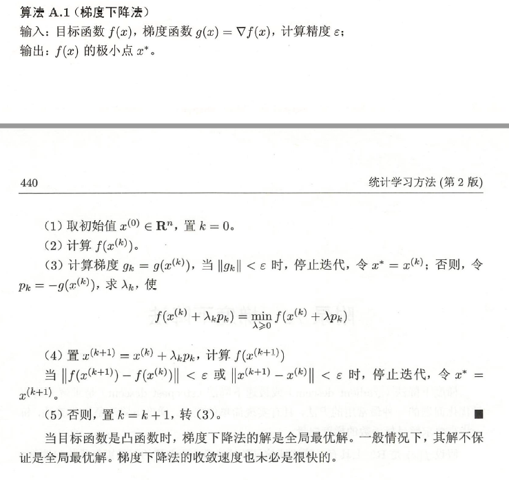

梯度下降法是求解无约束最优化问题的一种最常用的方法，具有实现简单的优点。梯度下降法是迭代算法，每一步需要求解目标函数的梯度向量。

## 梯度下降法

迭代的方式有很多种，比如**坐标下降法（coordinate descent）**，它的想法很简单，将变量分组然后针对每一组变量的坐标方向最小化Loss，循环往复每一组变量，直到到达不再更新Loss的坐标点。但即便这样，坐标下降法仍然迭代的非常缓慢，很大一部分原因在于它的搜索方向是固定的，只能沿着坐标的方向，而这样的方向并不能保证是最快的。同时，坐标下降需要假设变量之间的影响非常微弱，一个变量的最优不会影响到另一个变量的更新，但这一条件往往很难满足。


图为坐标下降应用到两个参数构成的Loss，我们可以发现，**参数只在两个垂直的方向上进行更新**，这是因为我们看到的contour就处在两个参数构成的直角坐标系中，分别对应着坐标的方向。

相较于坐标下降，基于梯度是所有方向导数中变化最快的，**梯度下降（gradient descent）**也被叫做最速下降，梯度下降的公式：$$\theta_{i+1}=\theta_i-\epsilon\nabla_{\theta_i}L(X,\theta,y)$$

Loss function一般都是标量，它的雅可比矩阵就是一个列向量，其梯度指明了下降的方向，说明沿Loss梯度方向更新参数会得到最大程度的改变，学习率是一个标量，与梯度相乘，指明了下降的幅度。


图为梯度下降在两参数构成的Loss，可以发现，**参数会沿着垂直于contour的方向进行更新**，垂直于contour的方向正是梯度的方向。



## 实现

梯度下降法（一维）：

```python
import numpy as np
import matplotlib.pyplot as plt
from matplotlib import animation
from matplotlib.animation import FuncAnimation
import seaborn as sns

sns.set(style='darkgrid')
FFwriter =animation.FFMpegWriter()
fig, ax = plt.subplots()
fig.set_tight_layout(True)
  
def f(x):
  return(x**2)
def df(x):
  return(2*x)

points_x = np.linspace(-20, 20, 1000)
points_y = f(points_x)

ax.plot(points_x,points_y, c="k", alpha=0.9, linestyle="-")


def GD(lr,start):
  x = start
  GD_x, GD_y = [], []
  for it in range(100):
   GD_x.append(x)
   GD_y.append(f(x))
   dx = df(x)
   x = x - lr * dx
  return(GD_x,GD_y)
  
GD_x,GD_y=GD(lr=pow(2,-10)*16,start=-20)

print('fig size: {0} DPI, size in inches {1}'.format(
    fig.get_dpi(), fig.get_size_inches()))

point_line,=ax.plot(GD_x[0],GD_y[0],'or')

def update(i):
  label ='timestep {0}'.format(i)
  print(label)
  point_line.set_xdata(GD_x[i])
  point_line.set_ydata(GD_y[i])
  ax.set_xlabel(label)
  return point_line, ax

if__name__=='__main__':
    anim = FuncAnimation(fig, update, frames=np.arange(0, 100), interval=200)
    anim.save('GD.gif', writer=FFwriter)
```

• 在使用matplotlib保存图片的时候，即使安装了ffmpeg（添加到环境变量），仍然有可能出现保存GIF出错的问题，推荐使用保存先保存为MP4文件，然后在当前文件目录下运行如下命令，即可获得GIF图

• 本文所采用的Loss function较为简单，实际过程中我们可能还会面临全局最小和局部最小的问题，但在深度学习中，凸优化并不是一个大问题，因为我们只要求找到使得泛化误差达到我们接受的程度，同时全局优化算法目前在理论上并没有可靠的保证。

• 除了学习率和Loss function的适应性问题，参数的初始值和鞍点也是优化过程中非常头疼的问题，牛顿法最大的问题就是它找到的一般都是鞍点

## 参考资料

[梯度下降（Gradient Descent）小结](https://www.cnblogs.com/pinard/p/5970503.html)