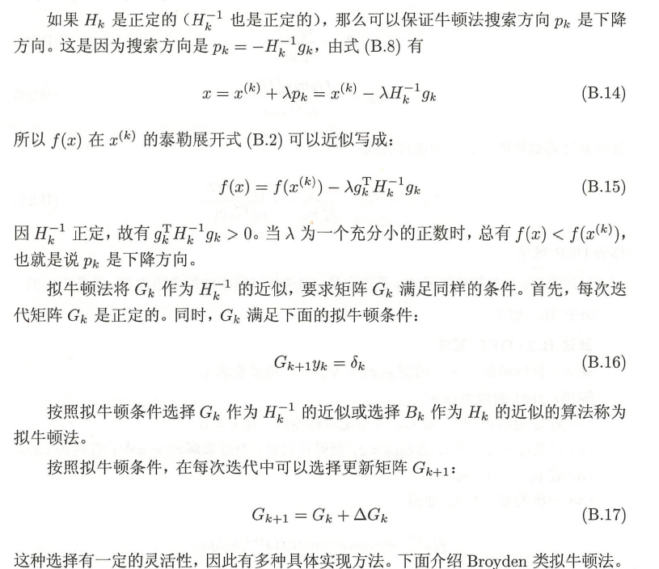
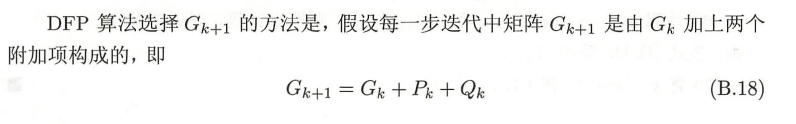

牛顿法(Newton method) 和拟牛顿法(quasi- Newton method) 也是求解无约束最优化问题的常用方法， 有收敛速度快的优点。牛顿法是迭代算法，每一步需要求解目标函数的黑塞矩阵的逆矩阵，计算比较复杂。拟牛顿法通过正定矩阵近似黑塞矩阵的逆矩阵或黑塞矩阵，简化了这一计算过程。

## 牛顿法

## 解析

Hessian中包含了Loss function的曲率信息，因为Hessian可以理解为梯度的雅可比，**一个函数的导数衡量的是函数的变化率，所以Hessian衡量的就是梯度的变化率**。同时Hessian矩阵由于是厄米矩阵，可以被对角化，它的特征值和特征向量可以分别定义为：$$Hd=\lambda d$$

**如果特征向量被正交归一化，那么特征向量d就是基，那么特征值就是该方向上的二阶导数**，两边同时乘以特征向量的转置，就可以得到：$d^THd=\lambda d^Td=\lambda$

比如对于鞍点，某个特征向量所对应的特征值就是负的，就意味着是这个方向上的极大值点，而另一特征向量所对应的特征值就是正的，意味着同时也是另一方向上的极小值点。从数学上来说，鞍点的来源是极大值极小值都要通过导数为零得到，但不同的方向导数定义在了不同的维度上。

如图，AB方向和CD方向，二阶导数的正负并不一致，产生了X这样一个鞍点。

其余的方向的二阶导数就可以通过特征向量来计算，因为特征向量可以构成一组基（完备正交），所有向量都可以用这组基进行线性表示，任意方向f可以被表示为：$f=a_1d_1+a_2d_2+a_3d_3+...+a_nd_n$

所以，**任意方向的二阶导数都可以得到**:$f^THf=a_1\lambda_1+a_2\lambda_2+...+a_n\lambda_n$

**Hessian能够告诉我们非常重要的一点，随着参数点的不断更新，梯度会如何变化。**举个例子，在很多教材上都会讲学习率的设定，学习率如果过大，就会在很大的Loss附近震荡，如果太小，需要迭代的次数又太多。

如图，不同的学习率会对梯度下降的性能造成影响。

那么，多大的学习率才合适呢？具体到这个例子上，这明显是一个凸函数（特指向下凸），代表着梯度会变得越来越小，也就是说固定好学习率的前提下，随着参数点的下降，我们下降的会越来越慢，我们将Loss function做泰勒展开：

$L(X,\theta,y)=L(X,\theta_0,y)+(\theta-\theta_0)^T\nabla_{\theta}L(X,\theta_0,y)+\frac12(\theta-\theta_0)^TH(L)(\theta-\theta_0)$

假设从$\theta_0$到$\theta$，我们执行了一次梯度下降，那么就有关系：

$\theta=\theta_0-\epsilon\nabla_{\theta}L(X,\theta_0,y)$

将梯度$\nabla_{\theta}L(X,\theta_0,y)$表示为g，代入泰勒展开式，可以得到：

$L(X,\theta_0-\epsilon g,y)=L(X,\theta_0,y)-\epsilon g^Tg+\frac12\epsilon^2g^TH(L)g$

如果我们将后面两项写作一项：

$L(X,\theta_0-\epsilon g,y)=L(X,\theta_0,y)-[\epsilon g^Tg-\frac12\epsilon^2g^TH(L)g]$

如果中括号里面的项大于零，那么Loss 总会减小，比如Hessian的特征值均为负，其实对应着极大值点，那么无论学习率多小，Loss总会下降很大。但是，如果Hessian特征值均为正，而且非常大，就意味着极小值附近的曲率非常大，那么执行梯度下降反而会导致Loss的上升。如果我们希望Loss能下降最多，其实就是希望中括号项越大越好，在Hessian特征值为正的情况下，在我们将$\epsilon$看作变量，令其一阶导数为零，这样就求到了极大值(因为在Hessian特征值为正的前提下，二阶导数小于零)：

$g^Tg-\epsilon g^TH(L)g=0$

就可以得到：$\epsilon=\frac{g^Tg}{g^TH(L)g}$

就给出了我们的最优步长。同时，我们可以将Loss function做泰勒展开，展开到二阶：

$L(X,\theta,y)=L(X,\theta_0,y)+(\theta-\theta_0)^T\nabla_{\theta}L(X,\theta_0,y)+\frac12(\theta-\theta_0)^TH(L)(\theta-\theta_0)$

考虑到一阶导数为零的点对应着极值点，我们对上式求一阶导数，并令其为零可得：

$\theta-\theta_0=H(L)^{-1}\nabla_{\theta}L(X,\theta_0,y)$

这样就得到了牛顿法（Newton method）的更新公式。牛顿法已经默认使用了一阶导数为零的信息，理想情况下，它只需要从初始参数点迭代一次就可以找到极小值点。同时，它利用了Hessian中的曲率信息，一般而言也要比梯度更快，在下降方向上并不是梯度的方向，从数学上可以看出Hessian乘以梯度，本质上会得到Hessian特征向量的线性叠加，如果梯度恰好作为了Hessian的特征向量，那么牛顿法和梯度下降的下降方向才会一致。

如图，红线表示梯度下降的路径，绿线表示牛顿法的路径。

这里着重强调：优化算法的快慢和计算代价是两回事情。优化至局部最小值所需要的迭代次数越少，就可以说优化地越快。梯度下降比坐标下降快，牛顿法比梯度下降更快，但我们可以非常容易的看到，在每次迭代时，梯度下降需要计算全部样本的梯度，牛顿法甚至需要计算全部样本的Hessian，虽然迭代次数减少了，但每次的计算代价却增加了。

牛顿法看起来很快，但我们在不清楚loss function性质的情况下却很少使用它，尤其是在深度学习中，这不仅是因为需要每一步需要计算Hessian，还因为我们如果真的希望牛顿法执行下降步骤，必须保证Hessian的正定，这在某些情况下是不成立的。

如何解决牛顿法不降反升的问题呢？我们可以模仿Ridge regression添加L2正则化的办法，使得样本矩阵强行满秩，同样的，我们也可以在Hessian上加上一个正则化项，使得Hessian强行正定

## 拟牛顿法

## DPF算法

DPF(Davidon-Fletcher-Powell)算法

## BFGS算法

BFGS(Broyden-Fletcher-Glodfarb-Shanno)算法

BFGS算法是最流行的拟牛顿算法

## Broyden类算法

