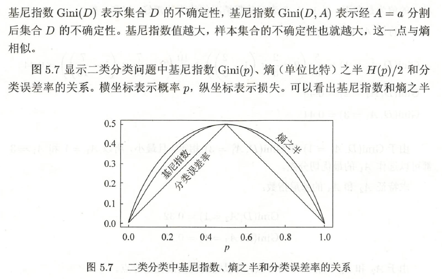
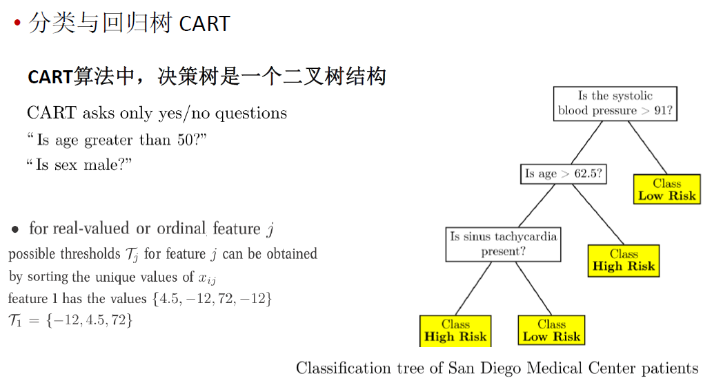

决策树是一种基本的分类与回归方法。

决策树模型呈树形结构，在分类问题中， 表示基于特征对实例进行分类的过程。它可以认为是if-then 规则的集合，也可以认为是定义在特征空间与类空间上的条件概率分布。

其主要优点是模型具有可读性，分类速度快。

学习时，利用训练数据，根据损失函数最小化的原则建立决策树模型。预测时，对新的数据，利用决策树模型进行分类。决策树学习通常包括3 个步骤：特征选择、决策树的生成和决策树的修剪。

这些决策树学习的思想主要来源千由Quinlan 在1986 年提出的ID3 算法和1993 年提出的C4.5 算法，以及由Breiman 等人在1984 年提出的CART算法。

# 分类决策树

## 决策树模型

构造决策树的基本思想是随着树深度的增加，节点的熵迅速地降低。熵降低的速度越快越好，这样我们有望得到一棵高度最矮的决策树。

当系统的信息熵降为0时，就没有必要再往下构造决策树了，此时叶子节点都是纯的——这是理想情况。最坏情况下，决策树的高度为属性(决策变量)的个数，叶子节点不纯(这意味着我们要以一定的概率来作出决策)。

**决策树的定义**

决策树各个部分的定义

用决策树分类，从根结点开始，对实例的某一特征进行测试，根据测试结果，将实例分配到其子结点；这时，每一个子结点对应着该特征的一个取值。如此递归地对实例进行测试并分配，直至达到叶结点。最后将实例分到叶结点的类中。

什么时候会产生叶子节点？

## 决策树与条件概率分布

决策树还表示给定特征条件下类的条件概率分布。这一条件概率分布定义在特征空间的一个划分(partition) 上。将特征空间划分为互不相交的单元(cell ) 或区域(region) ， 并在每个单元定义一个类的概率分布就构成了一个条件概率分布。决策树的一条路径对应千划分中的一个单元。决策树所表示的条件概率分布由各个单元给定条件下类的条件概率分布组成。假设X 为表示特征的随机变量， Y 为表示类的随机变掀，那么这个条件概率分布可以表示为P(YIX) 。X 取值于给定划分下单元的集合， Y 取值于类的集合。各叶结点（单元） 上的条件概率往往偏向某一个类，即属于某一类的概率较大。决策树分类时将该结点的实例强行分到条件概率大的那一类去。

图5.2 (a) 示意地表示了特征空间的一个划分。图中的大正方形表示特征空间。这个大正方形被若干个小矩形分割，每个小矩形表示一个单元。特征空间划分上的单元构成了一个集合， X 取值为单元的集合。为简单起见，假设只有两类： 正类和负类，即Y 取值为＋1 和－1 。小矩形中的数字表示单元的类。图5.2 (b) 示意地表示特征空间划分确定时，特征（单元）给定条件下类的条件概率分布。图5 .2 (b) 中条件概率分布对应于图5.2 (a) 的划分。当某个单元c 的条件概率满足P(Y = +1|X = c) > 0.5时，则认为这个单元属于正类，即落在这个单元的实例都被视为正例。图5 . 2 (c) 为对应于图5 .2 (b) 中条件概率分布的决策树。

## 决策树学习

决策树学习本质上是从训练数据集中归纳出一组分类规则。与训练数据集不相矛盾的决策树（即能对训练数据进行正确分类的决策树）可能有多个，也可能一个都没有。**我们需要的是一个与训练数据矛盾较小的决策树，同时具有很好的泛化能力。**从另一个角度看，决策树学习是由训练数据集估计条件概率模型。基千特征空间划分的类的条件概率模型有无穷多个。我们选择的条件概率模型应该不仅对训练数据有很好的拟合，而且对未知数据有很好的预测。

决策树学习用损失函数表示这一目标。**决策树学习的损失函数通常是正则化的极大似然函数。**决策树学习的策略是以损失函数为目标函数的最小化。

当损失函数确定以后，学习问题就变为在损失函数意义下选择最优决策树的问题。因为从所有可能的决策树中选取最优决策树是NP 完全问题，所以现实中决策树学习算法通常采用启发式方法，近似求解这一最优化间题。这样得到的决策树是次最优(sub-optimal) 的。

决策树学习的算法通常是一个递归地选择最优特征，并根据该特征对训练数据进行分割，使得对各个子数据集有一个最好的分类的过程。这一过程对应着对特征空间的划分，也对应着决策树的构建。

开始，构建根结点，将所有训练数据都放在根结点。选择一个最优特征，按照这一特征将训练数据集分割成子集，使得各个子集有一个在当前条件下最好的分类。如果这些子集已经能够被基本正确分类，那么构建叶结点，并将这些子集分到所对应的叶结点中去；如果还有子集不能被基本正确分类，那么就对这些子集选择新的最优特征，继续对其进行分割，构建相应的结点。如此递归地进行下去，直至所有训练数据子集被基本正确分类，或者没有合适的特征为止。最后每个子集都被分到叶结点上，即都有了明确的类。这就生成了一棵决策树。

可能发生过拟合现象。我们需要对已生成的树自下而上进行剪枝，将树变得更简单，从而使它具有更好的泛化能力。具体地，就是去掉过于细分的叶结点，使其回退到父结点，甚至更高的结点，然后将父结点或更高的结点改为新的叶结点。

如果特征数量很多，也可以在决策树学习开始的时候，对特征进行选择，只留下
对训练数据有足够分类能力的特征。

可以看出，决策树学习算法包含特征选择、决策树的生成与决策树的剪枝过程。

由于决策树表示一个条件概率分布，所以深浅不同的决策树对应着不同复杂度的概率
模型。**决策树的生成对应于模型的局部选择，决策树的剪枝对应于模型的全局选择。**
决策树的生成只考虑局部最优，相对地，决策树的剪枝则考虑全局最优。

决策树学习常用的算法有ID3 、C4.5 与CART。

# 特征选择

特征选择在于选取对训练数据具有分类能力的特征。这样可以提高决策树学习的效率。如果利用一个特征进行分类的结果与随机分类的结果没有很大差别，则称这个特征是没有分类能力的。经验上扔掉这样的特征对决策树学习的精度影响不大。通常特征选择的准则是信息增益或信息增益比。

评价函数：$C(T)=\sum_{r\in leaf}N_t·H(t)$，其中H(t)是熵或者基尼系数。希望这个评价函数越小越好，类似于损失函数

## 信息增益

### 熵

熵越高，类别分布越均匀，越混乱，纯度越低

### 条件熵

### 信息增益

信息增益表示得知特征X的信息而使得类Y的信息的不确定性减少的程度。

决策树学习应用信息增益准则选择特征。给定训练数据集D 和特征A, 经验嫡H(D ) 表示对数据集D 进行分类的不确定性。而经验条件嫡H(DIA) 表示在特征A给定的条件下对数据集D 进行分类的不确定性。那么它们的差，即信息增益，就表示由于特征A 而使得对数据集D 的分类的不确定性减少的程度。显然，对于数据集D而言， 信息增益依赖于特征，不同的特征往往具有不同的信息增益。信息增益大的特征具有更强的分类能力。

根据信息增益准则的特征选择方法是： 对训练数据集（或子集） D, 计算其每个特
征的信息增益，并比较它们的大小， 选择信息增益最大的特征。

**信息增益的算法**

## 增益率(信息增益比)

信息增益对可取值数目较多的属性有偏好

ID3决策树的信息增益有偏向性的前提是某个特征的每个取值下的样本数非常少。当数据集非常大，或者说那些取值多的特征并没有多到很夸张时，信息增益并没有多大偏向性。

参考：[c4.5为什么使用信息增益比来选择特征？](https://www.zhihu.com/question/22928442)

增益率对可取值数目较少的属性有所偏好。

所以C4.5算法并不是直接选择增益率最大的候选划分属性，而是使用了一个启发式：先从候选划分属性中找出信息增益高于平均水平的属性，再从中选择增益率最高的。

## 基尼指数

基尼指数和熵之半的曲线很接近，都可以近似地代表分类误差率。

# 决策树的生成

## ID3算法

ID3相当于用极大似然法进行概率模型的选择

结束条件：所有特征的信息增益均很小或没有特征可以选择为止。

ID3算法只有树的生成，所以该算法生成的树容易产生过拟合。

## 二分法（C4.5算法）

C4.5算法对ID3算法进行了改进，C4.5在生成的过程中，用信息增益比来选择特征。

连续属性情况下：

# 决策树的剪枝

## 过拟合问题

过拟合的原因在于学习时过多地考虑如何提高对训练数据的正确分类，从而构建出过于复杂的决策树。解决这个问题的办法是考虑决策树的复杂度，对已生成的决策树进行简化。

## 剪枝

剪枝prunning：决策树中避免过拟合的策略

决策树的剪枝往往通过极小化决策树整体的损失函数或代价函数来实现。

设树T的叶结点个数为|T|，t是树T的叶结点，该叶结点有N_t个样本点。

剪枝，就是当α确定时，选择损失函数最小的模型，即损失函数最小的子树。当α值确定时，子树越大，往往与训练数据的拟合越好，但是模型的复杂度就越高；相反，子树越小，模型的复杂度就越低，但是往往与训练数据的拟合不好。损失函数正好表示了对两者的平衡。

可以看出，决策树生成只考虑了通过提高信息增益（或信息增益比）对训练数据进行更好的拟合。而决策树剪枝通过优化损失函数还考虑了减小模型复杂度。决策树生成学习局部的模型，而决策树剪枝学习整体的模型。

**式(5.11) 或式(5.14) 定义的损失函数的极小化等价千正则化的极大似然估计。**所以，利用损失函数最小原则进行剪枝就是用正则化的极大似然估计进行模型选择。

[如何理解决策树的损失函数?](https://www.zhihu.com/question/34075616)

**剪枝算法**

**预剪枝**

在决策树生成过程中，对每个节点在划分前先进行估计
若当前节点的划分不能带来决策树**泛化性能的提升**，则停止划分并将当前节点标记为叶节点

**后剪枝**

先从训练集生成一颗完整的决策树
然后自底向上地对非叶节点进行考察
若将该节点对应的子树替换成叶节点能够带来决策树**泛化性能的提升**，则将该子树替换为叶节点

采用留出法，即预留一部分数据用作验证集

预剪枝

降低过拟合风险

减少了训练和测试开销
有欠拟合的风险（有些分支的当前划分虽不能提高泛化性能，但在此基础上的后续划分可能导致泛化性能显著提高，但却被预剪枝“贪心”地剪掉了）

后剪枝

后剪枝通常比预剪枝保留了更多的分支。经验上来看，后剪枝已经能够一定程度避免决策树过拟合的风险，又不会有过多的欠拟合的风险。故泛化性能往往优于预剪枝操作。

然而后剪枝操作的训练开销比较大。（后剪枝过程是在生成完全决策树之后进行的，并且要自底向上地对树中的所有非叶结点进行逐一考察）

# 分类与回归树CART

CART 是在给定输入随机变量X 条件下输出随机变量Y 的条件概率分布的学习方法。CART 假设决策树是二叉树，内部结点特征的取值为“是“和“否＂，左分支是取值为“是＂的分支，右分支是取值为“否＂的分支。这样的决策树等价千递归地二分每个特征，将输入空间即特征空间划分为有限个单元，并在这些单元上确定预测的概率分布，也就是在输入给定的条件下输出的条件概率分布。

CART 算法由以下两步组成：

(1) 决策树生成：基千训练数据集生成决策树，生成的决策树要尽量大；

(2) 决策树剪枝： 用验证数据集对已生成的树进行剪枝并选择最优子树，这时用
损失函数最小作为剪枝的标准。

## CART生成

决策树的生成就是递归地构建二叉决策树的过程。**对回归树用平方误差最小化准
则，对分类树用基尼指数(Gini index) 最小化准则**，进行特征选择，生成二叉树。

### 回归树的生成

算法

### 分类树的生成

分类树用基尼指数选择最优特征，同时决定该特征的最优二值切分点。

分类：决策区域的区域R中正类所占比例

回归：决策区域的区域R中训练样本的均值

## CART剪枝

**1.剪枝，形成一个子树序列**

**2.在剪枝得到的子树序列T0, T1, ..., Tn中通过交叉验证选择最优子树Tn**

# 参考资料

[熵，条件熵，互信息，交叉熵 的理解总结](https://zhuanlan.zhihu.com/p/32401995)

[c4.5为什么使用信息增益比来选择特征？](https://www.zhihu.com/question/22928442)
