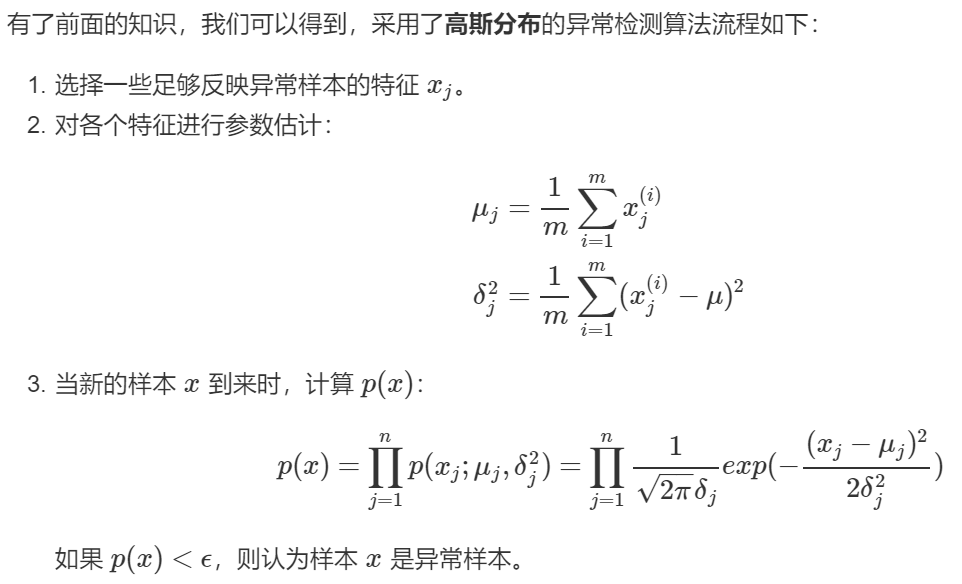

##概述

根据已有数据集构建一个**概率模型 p(x)**，如果某一样本被认为是正常样本的概率足够小，它就该被当做是异常。

1. 用XGBOOST进行有监督异常检测

2. 仅有少量标签的情况下，也可采用半监督异常检测模型。比如把无监督学习作为一种特征抽取方式来辅助监督学习[4，8]，和stacking比较类似。这种方法也可以理解成通过无监督的特征工程对数据进行预处理后，喂给有监督的分类模型。（Learning Representations for Outlier Detection on a Budget，XGBOD: Improving Supervised Outlier Detection with Unsupervised Representation Learning）
3. 但在现实情况中，**异常检测问题往往是没有标签的，训练数据中并未标出哪些是异常点，因此必须使用无监督学习**。

## 无监督异常检测

无监督异常检测模型可以大致分为：

- **统计与概率模型**（statistical and probabilistic and models）：主要是对数据的分布做出假设，并找出假设下所定义的“异常”，因此往往会使用极值分析或者假设检验。比如对最简单的一维数据假设高斯分布，然后将距离均值特定范围以外的数据当做异常点。而推广到高维后，可以假设每个维度各自独立，并将各个维度上的异常度相加。如果考虑特征间的相关性，也可以用马氏距离（mahalanobis distance）来衡量数据的异常度[12]。不难看出，这类方法最大的好处就是速度一般比较快，但因为存在比较强的“假设”，效果不一定很好。
- **线性模型**（linear models）：假设数据在低维空间上有嵌入，那么无法、或者在低维空间投射后表现不好的数据可以认为是离群点。举个简单的例子，PCA可以用于做异常检测[10]，一种方法就是找到*k*个特征向量（eigenvector），并计算每个样本再经过这*k*个特征向量投射后的重建误差（reconstruction error），而正常点的重建误差应该小于异常点。同理，也可以计算每个样本到这*k*个选特征向量所构成的超空间的加权欧氏距离（特征值越小权重越大）。在相似的思路下，我们也可以直接对协方差矩阵进行分析，并把样本的马氏距离（在考虑特征间关系时样本到分布中心的距离）作为样本的异常度，而这种方法也可以被理解为一种软性（Soft PCA） [6]。同时，另一种经典算法One-class SVM[3]也一般被归类为线性模型。
- **基于相似度衡量的模型**（proximity based models）：异常点因为和正常点的分布不同，因此相似度较低，由此衍生了一系列算法通过相似度来识别异常点。比如最简单的*K*近邻就可以做异常检测，一个样本和它第k个近邻的距离就可以被当做是异常值，显然异常点的k近邻距离更大。同理，基于密度分析如LOF [1]、LOCI和LoOP主要是通过局部的数据密度来检测异常。显然，异常点所在空间的数据点少，密度低。相似的是，Isolation Forest[2]通过划分超平面来计算“孤立”一个样本所需的超平面数量（可以想象成在想吃蛋糕上的樱桃所需的最少刀数）。在密度低的空间里（异常点所在空间中），孤例一个样本所需要的划分次数更少。另一种相似的算法ABOD[7]是计算每个样本与所有其他样本对所形成的夹角的方差，异常点因为远离正常点，因此方差变化小。换句话说，**大部分异常检测算法都可以被认为是一种估计相似度，无论是通过密度、距离、夹角或是划分超平面**。通过聚类也可以被理解为一种相似度度量，比较常见不再赘述。
- 集成**异常检测与模型融合**：在无监督学习时，提高模型的鲁棒性很重要，因此集成学习就大有用武之地。比如上面提到的Isolation Forest，就是基于构建多棵决策树实现的。最早的集成检测框架feature bagging[9]与分类问题中的随机森林（random forest）很像，先将训练数据随机划分（每次选取所有样本的d/2-d个特征，d代表特征数），得到多个子训练集，再在每个训练集上训练一个独立的模型（默认为LOF）并最终合并所有的模型结果（如通过平均）。值得注意的是，因为没有标签，异常检测往往是通过bagging和feature bagging比较多，而boosting比较少见。boosting情况下的异常检测，一般需要生成伪标签，可参靠[13, 14]。集成异常检测是一个新兴但很有趣的领域，综述文章可以参考[16, 17, 18]。
- **特定领域上的异常检测**：比如图像异常检测 [21]，顺序及流数据异常检测（时间序列异常检测）[22]，以及高维空间上的异常检测 [23]，比如前文提到的Isolation Forest就很适合高维数据上的异常检测。

**不难看出，上文提到的划分标准其实是互相交织的**。比如k-近邻可以看做是概率模型非参数化后的一种变形，而通过马氏距离计算异常度虽然是线性模型但也对分布有假设（高斯分布）。Isolation Forest虽然是集成学习，但其实和分析数据的密度有关，并且适合高维数据上的异常检测。**在这种基础上，多种算法其实是你中有我，我中有你，相似的理念都可以被推广和应用**，比如计算重建误差不仅可以用PCA，也可以用神经网络中的auto-encoder。另一种划分异常检测模型的标准可以理解为局部算法（local）和全局算法（global），这种划分方法是考虑到异常点的特性。想要了解更多异常检测还是推荐看经典教科书Outlier Analysis [6]，或者综述文章[15]。

1. PCA [10]
2. MCD: Minimum Covariance Determinant [11, 12]
3. OCSVM: One-Class Support Vector Machines [3]
4. LOF: Local Outlier Factor [1]
5. kNN: k Nearest Neighbors [19, 20]
6. HBOS: Histogram-based Outlier Score [5]
7. FastABOD: Fast Angle-Based Outlier Detection using approximation [7]
8. Isolation Forest [2]
9. Feature Bagging [9]

[1] Breunig, M.M., Kriegel, H.P., Ng, R.T. and Sander, J., 2000, May. LOF: identifying density-based local outliers. In *ACM SIGMOD Record*, pp. 93-104. ACM.

[2] Liu, F.T., Ting, K.M. and Zhou, Z.H., 2008, December. Isolation forest. In *ICDM '08*, pp. 413-422. IEEE.

[3] Ma, J. and Perkins, S., 2003, July. Time-series novelty detection using one-class support vector machines. In *IJCNN' 03*, pp. 1741-1745. IEEE.

[4] Micenková, B., McWilliams, B. and Assent, I. 2015. Learning Representations for Outlier

Detection on a Budget. arXiv Preprint arXiv:1507.08104.

[5] Goldstein, M. and Dengel, A., 2012. Histogram-based outlier score (hbos): A fast unsupervised anomaly detection algorithm. In*KI-2012: Poster and Demo Track*, pp.59-63.

[6] Aggarwal, C.C., 2015. Outlier analysis. In*Data mining*(pp. 237-263). Springer, Cham.

[7] Kriegel, H.P. and Zimek, A., 2008, August. Angle-based outlier detection in high-dimensional data. In*KDD '08*, pp. 444-452. ACM.

[8] Zhao,Y. and Hryniewicki, M.K. 2018. XGBOD: Improving Supervised Outlier Detection

with Unsupervised Representation Learning. *IJCNN*. (2018).

[9] Lazarevic, A. and Kumar, V., 2005, August. Feature bagging for outlier detection. In *KDD '05*. 2005.

[10] Shyu, M.L., Chen, S.C., Sarinnapakorn, K. and Chang, L., 2003. A novel anomaly detection scheme based on principal component classifier. *MIAMI UNIV CORAL GABLES FL DEPT OF ELECTRICAL AND COMPUTER ENGINEERING*.

[11] Rousseeuw, P.J. and Driessen, K.V., 1999. A fast algorithm for the minimum covariance determinant estimator. *Technometrics*, 41(3), pp.212-223.

[12] Hardin, J. and Rocke, D.M., 2004. Outlier detection in the multiple cluster setting using the minimum covariance determinant estimator. *Computational Statistics & Data Analysis*, 44(4), pp.625-638.

[13] Rayana, S. and Akoglu, L. 2016. Less is More: Building Selective Anomaly Ensembles. *TKDD*. 10, 4 (2016), 1–33.

[14] Rayana, S.,Zhong, W. and Akoglu, L. 2017. Sequential ensemble learning for outlier
detection: A bias-variance perspective. *ICDM*. (2017), 1167–1172.

[15] Chandola, V., Banerjee, A. and Kumar, V., 2009. Anomaly detection: A survey.*ACM computing surveys*, 41(3), p.15.

[16] Aggarwal, C.C., 2013. Outlier ensembles: position paper. *ACM SIGKDD Explorations Newsletter*, 14(2), pp.49-58. [[Download PDF\]](https://link.zhihu.com/?target=https%3A//pdfs.semanticscholar.org/841e/ce7c3812bbf799c99c84c064bbcf77916ba9.pdf)

[17] Zimek, A., Campello, R.J. and Sander, J., 2014. Ensembles for unsupervised outlier detection: challenges and research questions a position paper. *ACM Sigkdd Explorations Newslette*r, 15(1), pp.11-22.

[18] Aggarwal, C.C. and Sathe, S., 2017.*Outlier ensembles: an introduction*. Springer.

[19] Ramaswamy, S., Rastogi, R. and Shim, K., 2000, May. Efficient algorithms for mining outliers from large data sets. *ACM Sigmod Record*, 29(2), pp. 427-438).

[20] Angiulli, F. and Pizzuti, C., 2002, August. Fast outlier detection in high dimensional spaces. In *European Conference on Principles of Data Mining and Knowledge Discovery*pp. 15-27.

[21] Akoglu, L., Tong, H. and Koutra, D., 2015. Graph based anomaly detection and description: a survey.*Data Mining and Knowledge Discovery*, 29(3), pp.626-688.

[22] Gupta, M., Gao, J., Aggarwal, C.C. and Han, J., 2014. Outlier detection for temporal data: A survey.*IEEE Transactions on Knowledge and Data Engineering*, 26(9), pp.2250-2267.

[23] Zimek, A., Schubert, E. and Kriegel, H.P., 2012. A survey on unsupervised outlier detection in high‐dimensional numerical data.*Statistical Analysis and Data Mining: The ASA Data Science Journal*, 5(5), pp.363-387.

https://www.zhihu.com/question/280696035

## 高斯分布

异常检测的核心就在于找到一个概率模型，帮助我们知道一个样本落入正常样本中的概率，从而帮助我们区分正常和异常样本。**高斯分布（Gaussian Distribution）**模型就是异常检测算法最常使用的概率分布模型。

假设有数据集，并且，各个特征服从高斯分布，可以用参数估计估计出分布的均值和方差。假设各个特征之间相互独立，那么每个样本的概率就是它对应的各个特征的概率的乘积。

## 有监督学习与异常检测

很多人会认为异常检测非常类似于有监督学习，尤其是逻辑回归，但我们用一张表格来描述有监督学习与异常检测的区别：

| 有监督学习                                                   | 异常检测                                                     |
| ------------------------------------------------------------ | ------------------------------------------------------------ |
| 数据分布均匀                                                 | 数据非常偏斜，异常样本数目远小于正常样本数目                 |
| 可以根据对正样本的拟合来知道正样本的形态，从而预测新来的样本是否是正样本 | 异常的类型不一，很难根据对现有的异常样本（即正样本）的拟合来判断出异常样本的形态 |

下面的表格则展示了二者的一些应用场景：

| 有监督学习                               | 异常检测                     |
| ---------------------------------------- | ---------------------------- |
| 垃圾邮件检测                             | 故障检测                     |
| 天气预测（预测雨天、晴天、或是多云天气） | 某数据中心对于机器设备的监控 |
| 癌症的分类                               | 制造业判断一个零部件是否异常 |
| ......                                   | ......                       |

https://yoyoyohamapi.gitbooks.io/mit-ml/content/%E5%BC%82%E5%B8%B8%E6%A3%80%E6%B5%8B/articles/%E6%A6%82%E8%BF%B0.html

http://www.cnblogs.com/LittleHann/p/7086851.html