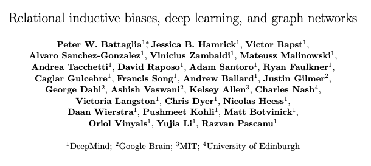
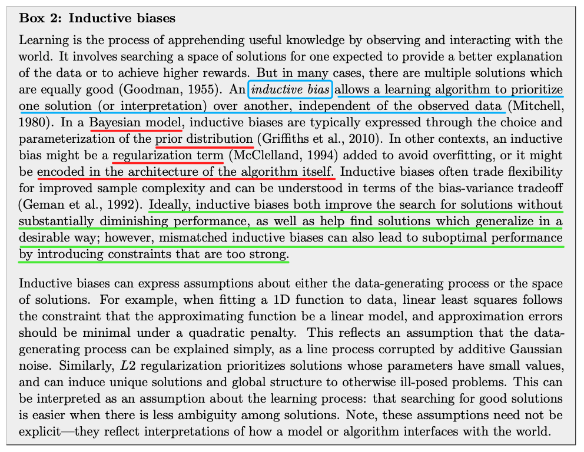
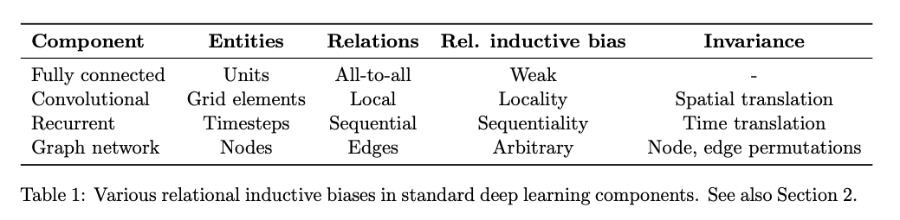

> 本文由 [简悦 SimpRead](http://ksria.com/simpread/) 转码， 原文地址 [mp.weixin.qq.com](https://mp.weixin.qq.com/s/bGdH53Cw4aT4-9jJRAi79A)

什么是 Inductive bias（归纳偏置）？
=========================

> 近日看论文，总是看到 inductive bias（归纳偏置）这个词，虽然之前也听过，但其实也没去仔细了解，遂趁机去网上查了查相关资料，翻了翻知乎，学习到了很多。这里记录一下，分享给大家。

一、权威论文的定义：_Relational inductive biases, deep learning, and graph networks_
--------------------------------------------------------------------------

这个论文是知乎网友推荐的。我翻了翻，好像是一篇神作（目前引用量 1300+）：

image-20211213230018752

文章比较长，也不是我熟悉的领域，所以我只是随便瞅了瞅，里面有一段话和一个表，对 inductive bias 做了很详细清楚的解释：

image-20211213230839925

上面这大段文字，我简单翻译总结一下：

*   归纳偏置，让算法优先某种解决方案，这种偏好是独立于观测的数据的。
    
*   常见的归纳偏置，包括：贝叶斯算法中的先验分布、使用某些正则项来惩罚模型、设计某种特殊的网络结构等。
    
*   好的归纳偏置，会提升算法搜索解的效率（同时不会怎么降低性能），而不好的归纳偏置则会让算法陷入次优解，因为它对算法带来了太强的限制。
    
*   归纳偏置，一般是对样本的产生过程，或者最终解的空间的一些假设。例如我们设计各种模型结构 / 形式，就是对解的空间上的假设。
    

然后，文章给出了下面这张图，总结了一下主要的神经网络结构背后的 inductive bias 是啥：

image-20211213231601858

可以看到，全连接网络的 inductive bias 是最轻微的，它就是假设所有的单元都可能会有联系；卷积则是假设数据的特征具有局部性和平移不变性，循环神经网络则是假设数据具有序列相关性和时序不变性，而图神经网络则是假设节点的特征的聚合方式是一致的。总之，网络的结构本身就包含了设计者的假设和偏好，这就是归纳偏置。

二、知乎网友的解答
---------

① 知乎作者 **TniL** (https://www.zhihu.com/people/tylin98) 的解答:

*   回答链接🔗 ：https://www.zhihu.com/question/264264203/answer/830077823
    

> **归纳偏置**在机器学习中是一种很微妙的概念：在机器学习中，很多学习算法经常会对学习的问题做一些假设，这些假设就称为归纳偏置 (Inductive Bias)。归纳偏置这个译名可能不能很好地帮助理解，不妨拆解开来看：归纳 (Induction) 是自然科学中常用的两大方法之一 (归纳与演绎, induction and deduction)，指的是从一些例子中寻找共性、泛化，形成一个比较通用的规则的过程；偏置(Bias) 是指我们对模型的偏好。因此，归纳偏置可以理解为，从现实生活中观察到的现象中归纳出一定的规则 (heuristics)，然后对模型做一定的约束，从而可以起到“模型选择” 的作用，即从假设空间中选择出更符合现实规则的模型。其实，贝叶斯学习中的 “先验(Prior)” 这个叫法，可能比 “归纳偏置” 更直观一些。归纳偏置在机器学习中几乎无处不可见。老生常谈的 “奥卡姆剃刀” 原理，即希望学习到的模型复杂度更低，就是一种归纳偏置。另外，还可以看见一些更强的一些假设：KNN 中假设特征空间中相邻的样本倾向于属于同一类；SVM 中假设好的分类器应该最大化类别边界距离；等等。在深度学习方面也是一样。以神经网络为例，各式各样的网络结构 / 组件 / 机制往往就来源于归纳偏置。在卷积神经网络中，我们假设特征具有局部性 (Locality) 的特性，即当我们把相邻的一些特征放在一起，会更容易得到 “解”；在循环神经网络中，我们假设每一时刻的计算依赖于历史计算结果；还有注意力机制，也是基于从人的直觉、生活经验归纳得到的规则。在自然语言处理领域赫赫有名的 word2vec，以及一些基于共现窗口的词嵌入方法，都是基于分布式假设：A word’s meaning is given by the words that frequently appear close-by. 这当然也可以看作是一种归纳偏置；一些自然语言理解的模型中加入解析树，也可以类似地理解。都是为了选择“更好” 的模型。

② 知乎用户 rA9aoM 的解答：

*   回答链接🔗 ：https://www.zhihu.com/question/264264203/answer/1085271521
    

> No-Free-Lunch 不存在免费午餐理论提出：学习是不可能的，除非有先验知识。通常情况下，我们不知道具体上帝函数的情况，但我们猜测它属于一个比较小的假设类别之中，这种基于先验知识对目标模型的判断就是 Inductive bias - 归纳误差。归纳误差所做的事情，是将无限可能的目标函数约束在一个有限的假设类别之中，这样，模型的学习才成为可能。
> 
> 如果给出更加宽松的模型假设类别，即使用更弱的 Inductive bias，那么我们更有可能得到强力模型 - 接近目标函数 f。损失由近似损失和估计损失组成，这样做虽然减少了近似损失，但会增大估计损失，模型将更加难以学习，更容易过拟合。

三、论文中的例子，看看大家是怎么用这个词的
---------------------

论文 1：_**Good-Enough Compositional Data Augmentation**_

这篇论文是 NLP 中数据增强的经典论文（ACL2020，引用量 95+），主要是提出了一种组合式的数据增强方法。在这篇文章的摘要中写到：

> We propose a simple data augmentation protocol aimed at providing a compositional **inductive bias** in conditional and unconditional sequence models.

意思就是，本文提出的方法，目的就是为了给模型提供一种样本组合方面的归纳偏置。就是，作者认为，某种方式的样本的组合也可以产生正常的样本，而作者希望模型也可以学习到这种组合方式，因此通过这种数据增强，就人为地从数据层面给模型加了某种限制或者说先验知识，从而让模型在学习上靠近这个先验知识。

论文 2：_**Good-Enough Example Extrapolation**_

这个篇文章发表在 EMNLP2021 上，一定程度上仿照了上篇文章的写法（连标题都是致敬上篇文章的），这个文章提出了一种新的在特征空间进行数据增强的方法，同样的，它也在摘要中写到：

> This paper asks whether extrapolating the hidden space distribution of text examples from one class onto another is a valid **inductive bias** for data augmentation.

即，本文想验证它提出的某种方法是否是数据增强的一个有效方法，所以 inductive bias 也可以直接拿来当 “假设的方法” 来用，因为提出某种方法，肯定是带有作者个人的先验假设的，然后我们把这种假设，设计成方法，加到模型的身上，那如果模型表现更好的话，就说明这个假设是符合实际情况的，从而是有效的假设。

遐（瞎）想
-----

其实想想，这个词几乎在所有的提出新方法、新模型的论文中都有所体现，只是很多时候并不会直接写出来。好的论文，多半都是包含了作者丰富的经验，然后设计出有效的归纳偏置。机器本身是没法学习的，只能按照人定义的方式去学习，学习的目的，也是为了让机器能接近人的能力，因此从这种视角看，有丰富的人生经验的人，对事物有深刻思考和体验的人，能有可能提出对机器、模型有效的先验假设，从而让机器、模型学习得更好。

说到这里，就想到最近看了一期之前的许知远的节目，在节目的最后，看到许知远说过的一句话，印象很深刻：

> “每个人都是带着成见来看待世界的，如果你没有带着成见，那你对世界根本没有看待方式。”

这句话挺有意思的，但其实也是一句有意思的废话。对世界，我们没办法保持客观，我们都是先入为主、根据自己的人生经验做出的判断。而那些所谓的客观的人，也只是他们经历了更多，有了更多的经验，所以看起来会更客观一些，但世界这么大，历史这么久，我们谁也无法了解全部，因此我们就没法做到真正的客观。训练模型也是一样，我们都是多多少少带着自己的 “偏见” 或者 “偏好” 去训练模型的，而那些 benchmark，GLUE 啊 CLUE 啊，你说它们真的客观吗？也不一定，我们见过太多例子，在 GLUE 榜单上表现很好的模型，受到轻微的攻击，就表现地像屎一样。这只能说明，某些偏好训练出的模型，正好也符合了数据集本身的偏好，所以在数据集上才能得到很好的成绩。

这给我最大的启示是什么？无论在工业界还是学术界，我们都需要去努力挖掘 target 场景中的各种规律、偏好甚至是偏见，然后尽可能把这些先验的知识给注入到我们机器学习模型的开发过程中来。一味的调参、排列组合式地修改模型结构，可能大部分都是无用功吧。可惜，调参往往是最无脑的，而挖掘数据往往是最枯燥的。

* * *

本文大致了解了 inductive bias（归纳偏置）的定义、背景和具体使用。理解这个词，对于我们理解机器学习中的各种方法是很有帮助的，如果在写作中正确使用这个词，也可以让咱们的论文显得更加专业吧！