## AdaBoost算法

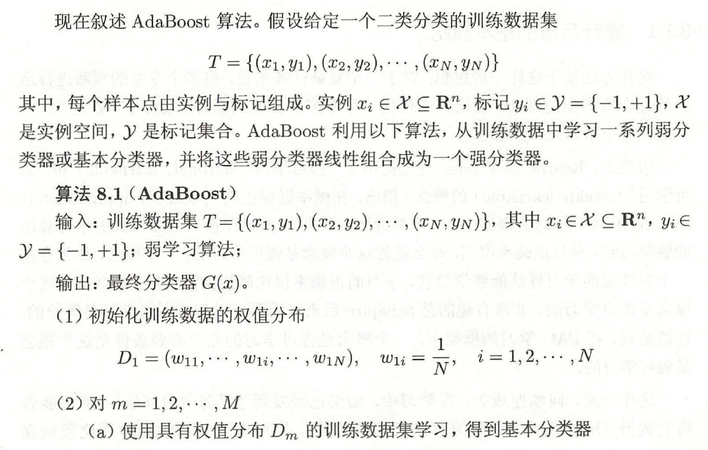

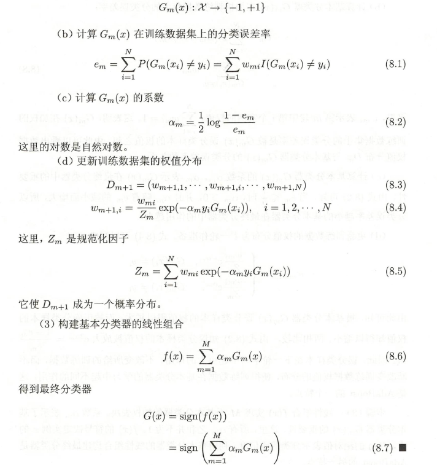

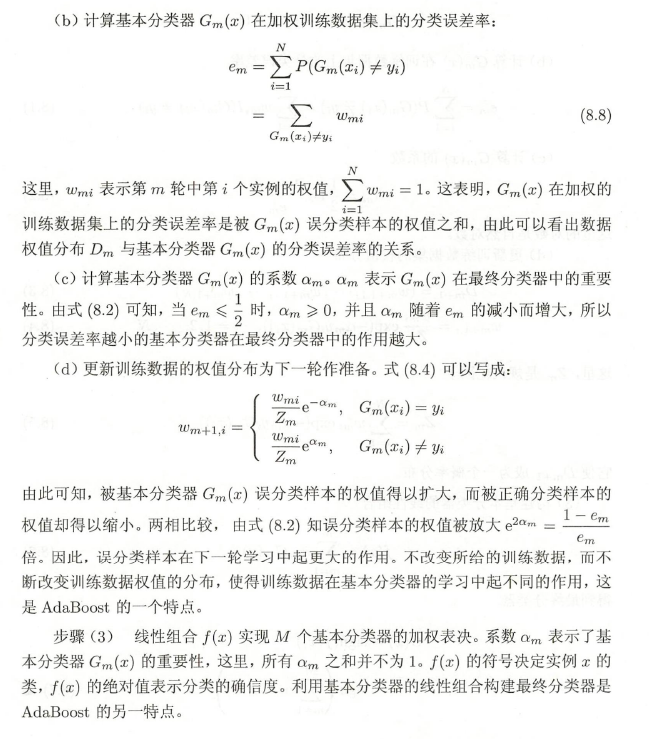

## 训练误差分析

AdaBoost最基本的性质是它能在学习过程中不断减少训练误差，即在训练数据集上的分类误差率。

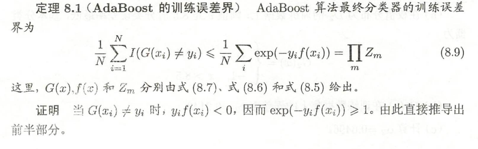

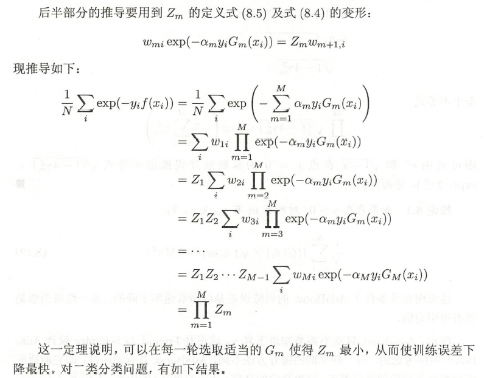

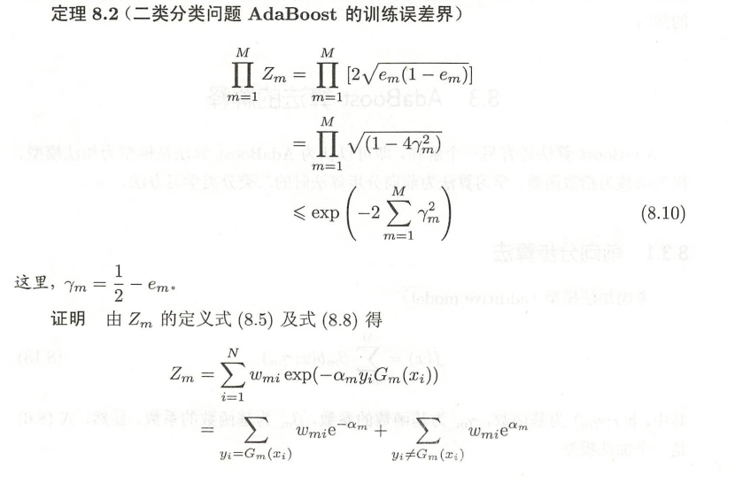

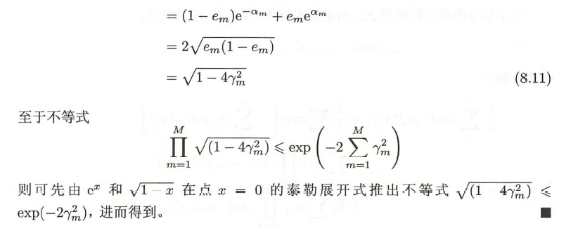

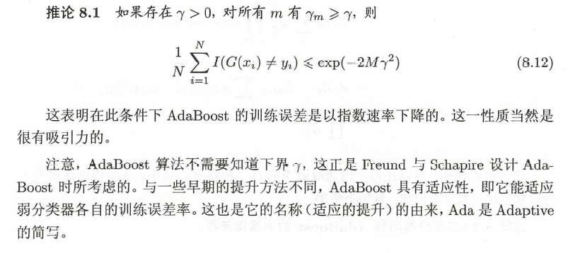

## 算法的解释

可以认为AdaBoost算法是模型为加法模型、损失函数为指数函数、学习算法为前向分步算法时的二类分类学习方法。

### 前向分步算法

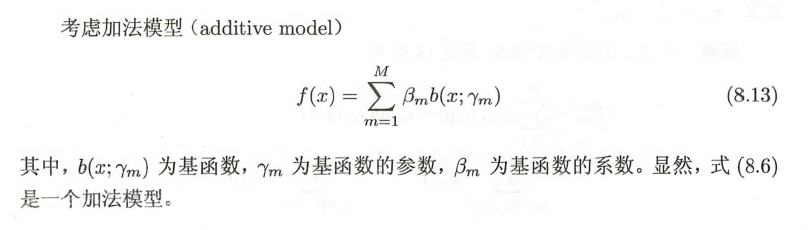

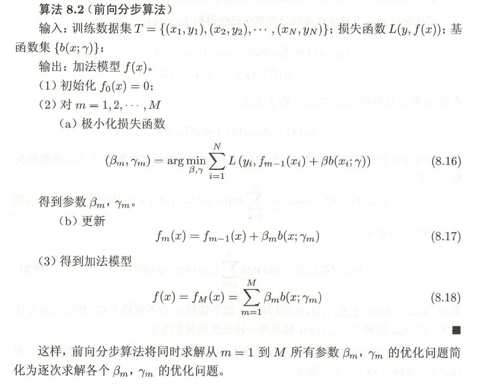

### 前向分步算法与AdaBoost

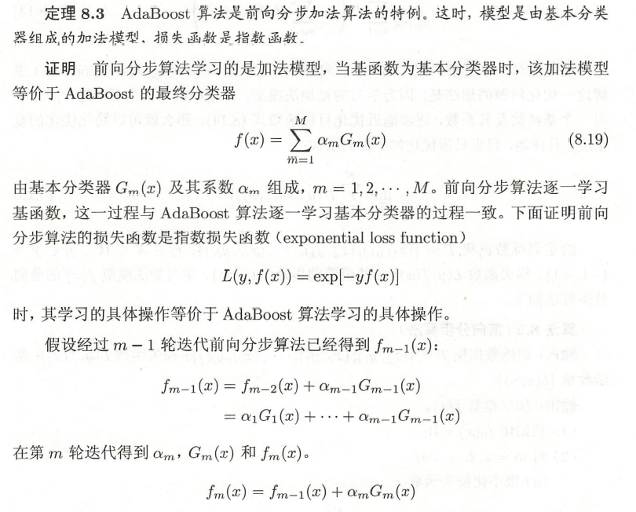

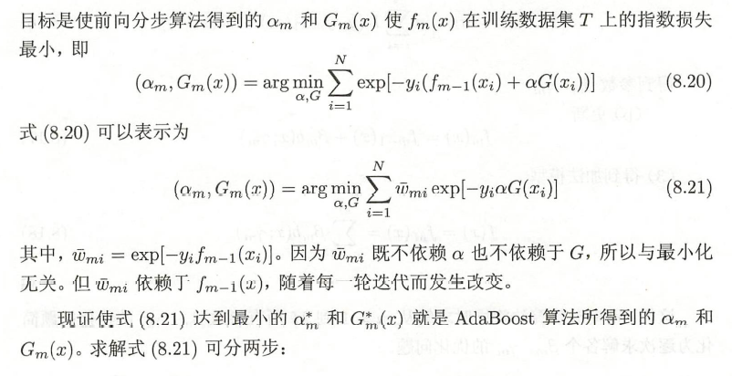

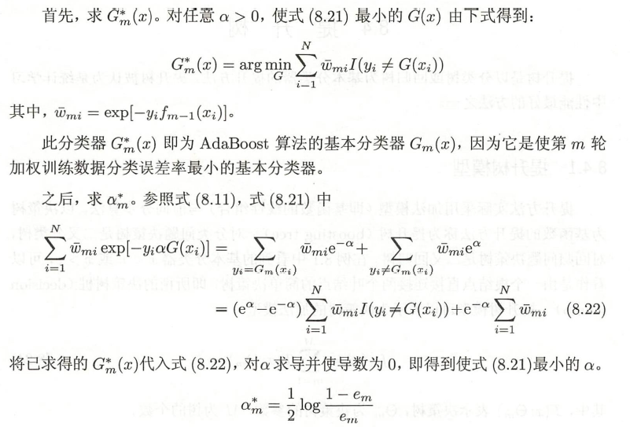

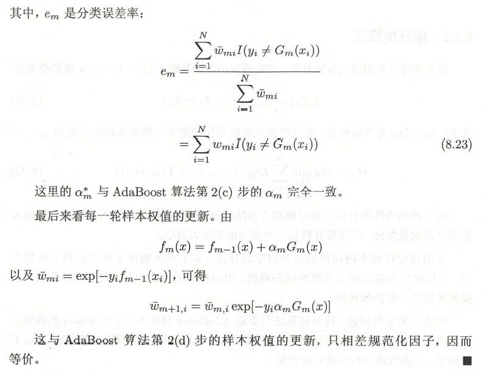

