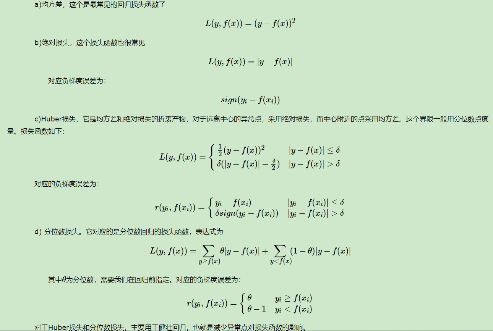
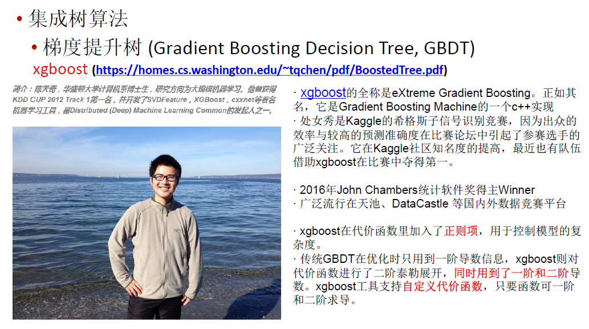

提升树是以分类树或回归树为基本分类器的提升方法。

GBDT（梯度提升树）的思想可以用一个通俗的例子解释，假如有个人30岁，我们首先用20岁去拟合，发现损失有10岁，这时我们用6岁去拟合剩下的损失，发现差距还有4岁，第三轮我们用3岁拟合剩下的差距，差距就只有一岁了。如果我们的迭代轮数还没有完，可以继续迭代下面，每一轮迭代，拟合的岁数误差都会减小。

# 提升树模型

# 提升树算法

针对不同问题的提升树学习算法， 其主要区别在于使用的损失函数不同。包括用平方误差损失函数的回归问题，用指数损失函数的分类问题，以及用一般损失函数的一般决策问题。

**对于二类分类问题**，提升树算法只需将AdaBoost 算法8. 1 中的基本分类器限制为二类分类树即可，可以说这时的提升树算法是AdaBoost 算法的特殊情况。

**对于回归问题的提升树**

# 梯度提升

提升树利用加法模型与前向分步算法实现学习的优化过程。当损失函数是平方损失和指数损失函数时，每一步优化是很简单的。但对一般损失函数而言，往往每一步优化并不那么容易。针对这一问题， Freidman 提出了梯度提升(gradient boosting) 算法，这是利用最速下降法（梯度下降法）的近似方法。

算法第1 步初始化，估计使损失函数极小化的常数值，它是只有一个根结点的树。第2(a) 步计算损失函数的负梯度在当前模型的值，将它作为残差的估计。对于平方损失函数，它就是通常所说的残差；对于一般损失函数，它就是残差的近似值。第2(b) 步估计回归树叶结点区域，以拟合残差的近似值。第2(c) 步利用线性搜索估计叶结点区域的值，使损失函数极小化。第2(d) 步更新回归树。第3 步得到输出的最终模型f(x) 。

## GBDT分类算法

GBDT的分类算法从思想上和GBDT的回归算法没有区别，但是由于样本输出不是连续的值，而是离散的类别，导致我们无法直接从输出类别去拟合类别输出的误差。

为了解决这个问题，主要有两个方法，一个是用指数损失函数，此时GBDT退化为Adaboost算法。另一种方法是用类似于逻辑回归的对数似然损失函数的方法。也就是说，我们用的是类别的预测概率值和真实概率值的差来拟合损失。而对于对数似然损失函数，我们又有二元分类和多元分类的区别。

### 二元GBDT分类算法

### 多元GBDT分类算法

## GBDT常用损失函数

对于分类算法，其损失函数一般有对数损失函数和指数损失函数两种:

对于回归算法，常用损失函数有如下4种:

## GBDT的正则化

和AdaBoost一样，我们也需要对GBDT进行正则化，防止过拟合。GBDT的正则化主要有三种方式。

第二种正则化的方式是通过子采样比例（subsample）。取值为(0,1]。注意这里的子采样和随机森林不一样，随机森林使用的是放回抽样，而这里是不放回抽样。如果取值为1，则全部样本都使用，等于没有使用子采样。如果取值小于1，则只有一部分样本会去做GBDT的决策树拟合。选择小于1的比例可以减少方差，即防止过拟合，但是会增加样本拟合的偏差，因此取值不能太低。推荐在[0.5, 0.8]之间。

使用了子采样的GBDT有时也称作随机梯度提升树(Stochastic Gradient Boosting Tree, SGBT)。由于使用了子采样，程序可以通过采样分发到不同的任务去做boosting的迭代过程，最后形成新树，从而减少弱学习器难以并行学习的弱点。

 第三种是对于弱学习器即CART回归树进行正则化剪枝。

## GBDT小结

GBDT主要的优点有：

1）可以灵活处理各种类型的数据，包括连续值和离散值。

2）在相对少的调参时间情况下，预测的准确率也可以比较高。这个是相对SVM来说的。

3）使用一些健壮的损失函数，对异常值的鲁棒性非常强。比如 Huber损失函数和Quantile损失函数。

GBDT的主要缺点有：

1)由于弱学习器之间存在依赖关系，难以并行训练数据。不过可以通过自采样的SGBT来达到部分并行。

## XGBoost

xgboost(https://homes.cs.washington.edu/~tqchen/pdf/BoostedTree.pdf)

Complete Guide to Parameter Tuning in XGBoost(with codes in Python)

https://www.analyticsvidhya.com/blog/2016/03/complete-guide-parameter-tuning-xgboost-with-codes-python/

1. The XGBoostAdvantage

2. Understanding XGBoostParameters

   General Parameters: Guide the overall functioning
   Booster Parameters: Guide the individual booster (tree/regression) at each step
   Learning Task Parameters: Guide the optimization performed

3. Tuning Parameters (with Example)

==对异常值敏感？==

xgboost的最终结果是每棵树的结果之和

结构风险是叶子的个数和权重的L2平滑组成

回归树的预测输出是实数分数，可以用于回归、分类、排序等任务中。对于回归问题，可以直接作为目标值，对于分类问题，需要映射成概率，比如采用逻辑函数。

目标就是最小化目标值和预测值之间的差异，加上结构风险。根据泰勒展开式可以将损失函数分解，得到含有损失函数对上一棵树的一阶导数和二阶导数的等式。通过这种近似，可以自定义一些损失函数（只要保证二阶可导）。

重新组合化简目标函数，变成在叶子节点上遍历。每个样本都落在一个叶子节点上，q(xi)表示样本xi在某个叶子节点上，wq(xi)是该节点的打分，即该样本的模型预测值。

如果确定了树的结构（即q(x)确定），为了使目标函数最小，可以令其导数为0，解得每个叶节点的最优预测分数。这就是结构分数，wj是叶子j的最优权重值，obj是相应的最优目标函数值。

当回归树的结构确定时，我们前面已经推导出其最优的叶节点分数以及对应的最小损失值，问题是怎么确定树的结构？

- 暴力枚举所有可能的树结构，选择损失值最小的 - NP难问题

- 贪心法，每次尝试分裂一个叶节点，计算分裂前后的增益，选择增益最大的

在实际操作中，我们贪心地增长这棵树：

树的初始深度为0

对于树的每个叶子节点，尝试增加一个划分点。增加划分点之后目标函数值的变化就是：

选择Gain最大的作为最优分割点。

算法步骤：

遍历所有特征的所有可能的分割点，计算gain值，选取值最大的（feature，value）去分割

根据特征划分有无数可能的树结构，因此采用近似算法（特征分位点，候选分割点） 

- Global：学习每棵树前，提出候选切分点
- Local：每次分裂前，重新提出候选切分点

Boosted Tree Algorithm 

## **xgboost特点（与gbdt对比）**

1.传统GBDT以CART作为基分类器，xgboost还支持线性分类器，这个时候xgboost相当于带L1和L2正则化项的逻辑斯蒂回归（分类问题）或者线性回归（回归问题）。 **—可以通过booster [default=gbtree]设置参数:gbtree: tree-based models/gblinear: linear models**

2.传统GBDT在优化时只用到一阶导数信息，xgboost则对代价函数进行了二阶泰勒展开，同时用到了一阶和二阶导数。顺便提一下，xgboost工具支持自定义代价函数，只要函数可一阶和二阶求导。 **—对损失函数做了改进（泰勒展开，一阶信息g和二阶信息h）**  

3.xgboost在代价函数里加入了正则项，用于控制模型的复杂度。正则项里包含了树的叶子节点个数、每个叶子节点上输出的score的L2模的平方和。从Bias-variance tradeoff角度来讲，正则项降低了模型variance，使学习出来的模型更加简单，防止过拟合，这也是xgboost优于传统GBDT的一个特性 
 **—正则化包括了两个部分，都是为了防止过拟合，剪枝是都有的，叶子结点输出L2平滑是新增的。**

4.shrinkage and column subsampling —**还是为了防止过拟合，论文2.3节有介绍**

> （1）shrinkage缩减类似于学习速率，在每一步tree boosting之后增加了一个参数n（权重），通过这种方式来减小每棵树的影响力，给后面的树提供空间去优化模型。  
>
> （2）column subsampling列(特征)抽样，说是从随机森林那边学习来的，防止过拟合的效果比传统的行抽样还好（行抽样功能也有），并且有利于后面提到的并行化处理算法。  

5.split finding algorithms(划分点查找算法)：
 （1）exact greedy algorithm—**贪心算法获取最优切分点** 
 （2）approximate algorithm— **近似算法，提出了候选分割点概念，先通过直方图算法获得候选分割点的分布情况，然后根据候选分割点将连续的特征信息映射到不同的buckets中，并统计汇总信息。详细见论文3.3节** 
 （3）Weighted Quantile Sketch—**分布式加权直方图算法，论文3.4节** 
 **这里的算法（2）、（3）是为了解决数据无法一次载入内存或者在分布式情况下算法（1）效率低的问题，以下引用的还是wepon大神的总结：**  

> 可并行的近似直方图算法。树节点在进行分裂时，我们需要计算每个特征的每个分割点对应的增益，即用贪心法枚举所有可能的分割点。当数据无法一次载入内存或者在分布式情况下，贪心算法效率就会变得很低，所以xgboost还提出了一种可并行的近似直方图算法，用于高效地生成候选的分割点。

6.对缺失值的处理。对于特征的值有缺失的样本，xgboost可以自动学习出它的分裂方向。  **—稀疏感知算法，论文3.4节，Algorithm 3: Sparsity-aware Split Finding**

7.**Built-in Cross-Validation（内置交叉验证)**  

> XGBoost allows user to run a cross-validation at each iteration of the boosting process and thus it is easy to get the exact optimum number of boosting iterations in a single run. 
> This is unlike GBM where we have to run a grid-search and only a limited values can be tested.

8.**continue on Existing Model（接着已有模型学习）**   

> User can start training an XGBoost model from its last iteration of previous run. This can be of significant advantage in certain specific applications. 
> GBM implementation of sklearn also has this feature so they are even on this point.

9.**High Flexibility（高灵活性）**    

> **XGBoost allow users to define custom optimization objectives and evaluation criteria. 
> This adds a whole new dimension to the model and there is no limit to what we can do.**

10.并行化处理 **—系统设计模块,块结构设计等**

> xgboost工具支持并行。boosting不是一种串行的结构吗?怎么并行的？注意xgboost的并行不是tree粒度的并行，xgboost也是一次迭代完才能进行下一次迭代的（第t次迭代的代价函数里包含了前面t-1次迭代的预测值）。xgboost的并行是在特征粒度上的。我们知道，决策树的学习最耗时的一个步骤就是对特征的值进行排序（因为要确定最佳分割点），xgboost在训练之前，预先对数据进行了排序，然后保存为block结构，后面的迭代中重复地使用这个结构，大大减小计算量。这个block结构也使得并行成为了可能，在进行节点的分裂时，需要计算每个特征的增益，最终选增益最大的那个特征去做分裂，那么各个特征的增益计算就可以开多线程进行。  

此外xgboost还设计了高速缓存压缩感知算法，这是系统设计模块的效率提升。 
 当梯度统计不适合于处理器高速缓存和高速缓存丢失时，会大大减慢切分点查找算法的速度。 
 （1）针对 exact greedy algorithm采用缓存感知预取算法 
 （2）针对 approximate algorithms选择合适的块大小

# 问答

## GBDT为什么用CART回归树做基学习器？

**基于梯度提升算法的学习器叫做GBM(Gradient Boosting Machine)**。

**理论上，GBM可以选择各种不同的学习算法作为基学习器。**

**现实中，用得最多的基学习器是决策树。**

**为什么梯度提升方法倾向于选择决策树（通常是CART树）作为基学习器呢？**
这与决策树算法自身的优点有很大的关系。决策树可以认为是if-then规则的集合，易于理解，可解释性强，预测速度快。同时，决策树算法相比于其他的算法需要更少的特征工程，比如可以不用做特征标准化，可以很好的处理字段缺失的数据，也可以不用关心特征间是否相互依赖等。决策树能够自动组合多个特征，它可以毫无压力地处理特征间的交互关系并且是非参数化的，因此你不必担心异常值或者数据是否线性可分（举个例子，决策树能轻松处理好类别A在某个特征维度x的末端，类别B在中间，然后类别A又出现在特征维度x前端的情况）。不过，单独使用决策树算法时，有容易过拟合缺点。所幸的是，通过各种方法，抑制决策树的复杂性，降低单颗决策树的拟合能力，再通过梯度提升的方法集成多个决策树，最终能够很好的解决过拟合的问题。

由此可见，梯度提升方法和决策树学习算法可以互相取长补短，是一对完美的搭档。至于抑制单颗决策树的复杂度的方法有很多，比如限制树的最大深度、限制叶子节点的最少样本数量、限制节点分裂时的最少样本数量、吸收bagging的思想对训练样本采样（subsample），在学习单颗决策树时只使用一部分训练样本、借鉴随机森林的思路在学习单颗决策树时只采样一部分特征、在目标函数中添加正则项惩罚复杂的树结构等。

## GBDT不擅长处理离散特征，你在应用的时候是怎么处理的

GBDT不擅长处理高基数类别特征，如果基数低，问题也不大。
原因可见：**lightgbm和catboost内部对类别特征有自己的特征工程方案，而xgboost这类无法直接处理类别特征的库则一般来说：1、单值离散用编码的方法；2、多值离散用embedding**。

## GBDT在回归和多分类当中有什么不同，在预测的时候的流程是怎样的

损失函数不同（废话），预测存在差异。
回归则直接加权求和输出全部基学习器的预测结果，分类还要将预测结果加权求和的结果放到sigmoid或者softmax里面转化为概率值。

## GBDT的优点和局限性有哪些？

**优点：**
（1）预测结点的计算速度，树与树之间可并行计算。
（2）在分布稠密的数据上，泛化能力和表达能力都很好，这使得GBDT在kaggle的众多竞赛上，经常名列榜首。
（3）采用决策树作为弱分类器使得GBDT模型具有较好的解释性和鲁棒性，能够自动发现特征间的高阶关系，并且也不需要对数据进行特殊的预处理，如归一化。

**局限性：**
（1）GBDT在高维稀疏的数据集上，表现不如支持向量机或者神经网络。
（2）GBDT在处理文本分类特征问题上，相对其他模型的优势不如它在处理数值特征时明显。
（3）训练过程需要串行训练，只能在决策树内部采用一些局部并行的手段提高训练速度。

## GBDT在什么情况下比逻辑回归算法要差？

高维稀疏的数据集，gbdt对维度超高的稀疏数据集，其正则项约束基本没用，并且决策空间会变成太多零散的决策小空间，具体可见上gbdt为何不好处理高基数类别特征的问题。
而lr的l1正则项可以很好的约束没啥用 的稀疏特征，直接w置0即可。

## GBDT与RF区别

1. 组成随机森林的树可以是分类树，也可以是回归树；而GBDT只由回归树组成，GBDT的会累加所有树的结果，而这种累加是无法通过分类完成的，因此GBDT的树都是CART回归树，而不是分类树（尽管GBDT调整后也可以用于分类但不代表GBDT的树为分类树）
2. 组成随机森林的树可以并行生成；而GBDT只能是串行生成
3. 对于最终的输出结果而言，随机森林采用多数投票或简单平均等；而GBDT则是将所有结果累加起来，或者加权累加起来（存在学习率）
4. 随机森林对异常值不敏感，GBDT对异常值非常敏感
5. 随机森林对训练集一视同仁，GBDT是基于权值的弱分类器的集成
6. 随机森林是通过减少模型方差提高性能，GBDT是通过减少模型偏差提高性能，但是xgb引入了正则项和列采样等等正则化手段之后，可以在少量增加偏差的情况下大幅度缩减模型的方差。

## GBDT和xgb的区别有哪些？

**1、算法层面：**

（1）**损失函数的二阶泰勒展开**；（GBDT只是泰勒公式的一阶展开）

（2）树的正则化概念的引入，**XGB对叶节点数量和叶子节点输出进行了约束，方式是将二者形成的约束项加入损失函数中**；

（3）**XGB二阶泰勒展开与树正则化推出了新的叶子节点输出的计算公式**而不是原始gbdt那样的简单平均；

（4）a、对于基础学习器的改进，

**分裂的时候自动根据是否产生正增益指导是否进行分裂**，因为引入了正则项的概念，分裂的时候这个预剪枝更加严苛；

b、**对于缺失值的处理**，**xgboost根据左右子节点的增益大小将缺失值分到增益大的节点中，而sklearn中的gbdt是无法处理缺失值的**，因为sklearn中的gbdt是以sklearn中的cart为基学习器的，而sklearn中的cart也并没有实现对缺失值的处理功能。

（5）**学习率**，Shrinkage，对每一颗树都乘以小于1的学习率，来削弱每一颗树的影响，这样的结果就是会引入更多的树来处理使得基学习器得数量变多，从而降低过拟合，不过其实sklearn中的gbdt也实现了。。。不知道为什么这么多人把这一点也列为不同；

（6）**引入了随机森林使用的列采样功能，便于降低过拟合**；

（7）**引入了许多近似直方图之类的优化算法来进一步提高树的训练速度与抗过拟合的能力**，这个比较复杂，因为实现了很多种算法，后面单独写一篇来总结；

**2.工程层面**

(1)**对每个特征进行分块（block）并排序（pre_sort）**，将排序后的结构保存在内存中，这样后续分裂的时候就不需要重复对特征进行排序然后计算最佳分裂点了，并且能够进行并行化计算.这个结构加速了split finding的过程，只需要在建树前排序一次，后面节点分裂时直接根据索引得到梯度信息

(2) https://zhuanlan.zhihu.com/p/75217528 其它更复杂的工程优化处理见这里。。。。

## GBDT和RF哪个树比较深

**第一种解释： RF深**。随机森林的思路是用大量低偏差高方差的基学习器进行集成，简单平均（不过lightgbm中的rf貌似不太一样，没有细致研究过），降低方差，所以希望每一个基学习器的精度尽量高，如果随机森林的基学习器偏差大，对于100个或者10000个精度为0.6的学习器，很难通过随机森林的集成方式来达到好的效果；而gbdt本身就是对误差的不断拟合，本身就是一个偏差很低的集成框架，那么为了同时也使得方差缩小，需要基学习器的泛化性能好一些，避免整个框架的偏差很低但方差很大的窘境；

**第二种解释：随机森林每一颗树都是独立的，每一颗树都是以原始标签进行训练的，在不进行任何限制的情况下会生长的比较深**，而gbdt不一样，每一轮都是以上一轮的负梯度为新标签进行训练，训练到一定程度的时候我们去观察负梯度就可以发现，因为很多样本已经得到很好的拟合，所以负梯度会比较小，比如可能是这样的[0.000000001,0.000000001,0.000000001,0.0000000015…]，这样树在分裂的时候实际上再进行分裂的增益并不大，甚至分裂之后的增益反而减少，这就导致了基树训练的时候很早就停止了，从而导致树的深度降低。

## 为什么gbdt不能用分类树？

分类树无法处理连续值，负梯度一般都是连续值。

## **为什么基于残差的gbdt不是一个好的选择**

基于残差的gbdt在解决回归问题上不算是一个好的选择，一个比较明显的缺点就是对异常值过于敏感。所以一般回归类的损失函数会用绝对损失或者huber损失函数来代替平方损失函数。

# 参考资料

[梯度提升树(GBDT)原理小结](https://www.cnblogs.com/pinard/p/6140514.html)

[树模型(六)：XGBoost](https://blog.csdn.net/a819825294/article/details/51206410)

[xgboost入门与实战（原理篇）](https://blog.csdn.net/sb19931201/article/details/52557382)

http://wepon.me/

[机器学习算法中 GBDT 和 XGBOOST 的区别有哪些？](https://www.zhihu.com/question/41354392)

[GBDT和XGB算法问题总结](https://www.codenong.com/cs106070699/)（关于GBDT和XGB的一些常见问答）

[GBDT算法原理以及实例理解](https://blog.csdn.net/zpalyq110/article/details/79527653)

[机器学习-一文理解GBDT的原理-20171001](https://zhuanlan.zhihu.com/p/29765582)

