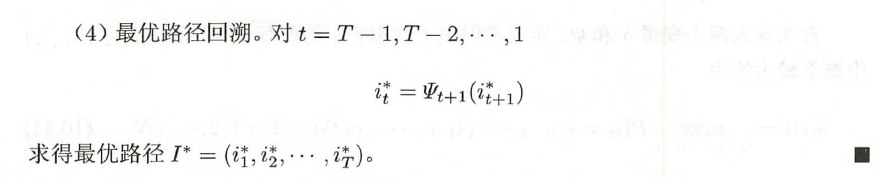

## 隐马尔可夫模型的基本概念

### 定义

隐马尔可夫模型可以用于标注，这时状态对应着标记。标注问题是给定观测的序列预测其对应的标记序列。可以假设标注问题的数据是由隐马尔可夫模型生成的。这样我们可以利用隐马尔可夫模型的学习与预测算法进行标注。

### 观测序列的生成过程

### 隐马尔可夫模型的3个基本问题

## 概率计算方法

### 直接计算法

但是，这样计算量很大，是O(TN^T)阶的，这种算法不可行。

### 前向算法

前向概率

### 后向算法

### 一些概率与期望值的计算

## 学习算法

隐马尔可夫模型的学习，根据训练数据是包括观测序列和对应的状态序列还是只有观测序列，可以分别由监督学习与无监督学习实现。

### 监督学习方法

### Baum-Welch算法

## 预测算法

### 近似算法

### 维特比算法

