https://www.zhihu.com/question/35866596

## 概述

在概率模型(probabilistic model)中，利用已知变量推测未知变量的分布称为"推断"（inference），其核心是如何基于可观测变量推测出未知变量的条件分布。具体来说，假定所关心的变量集合为Y，可观测变量集合为O，其他变量的集合为R，"生成式"（generative）模型考虑联合分布P(Y,R,O)，"判别式"(discriminative)模型考虑条件分布P(Y,R|O).给定一组观测变量值，推断就是要由P(Y,R,O)或P(Y,R|O)得到条件概率分布P(Y|O)。

概率图模型(probabilistic graphical model)是一类用图来表达变量相关关系的概率模型。它以图为表示工具，最常见的是用一个结点表示一个或一组随机变量，结点之间的边表示变量间的概率相关关系，即"变量关系图"。

根据边的性质不同，概率图模型大致分为两类：

第一类是使用**有向无环图**表示变量间的依赖关系，称为有向图模型或**贝叶斯网**(Bayesian network)；

第二类是使用**无向图**表示变量间的相关关系，称为无向图模型或**马尔科夫网**(Markov network)。

若变量间存在显式的因果关系，则常使用贝叶斯网；若变量间存在相关性，但难以获得显式的因果关系，则常使用马尔科夫网

贝叶斯网络（信念网络）都是有向的，马尔科夫网络无向。所以，贝叶斯网络适合为有单向依赖的数据建模，马尔科夫网络适合实体之间互相依赖的建模。

## 概率无向图模型

概率无向图模型(probabilistic undirected graphical model) ，又称为马尔可夫随机场(Markov random field) ，是一个可以由无向图表示的联合概率分布。

### 模型定义

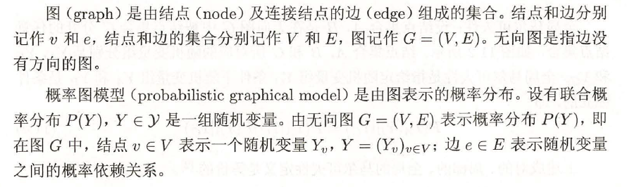

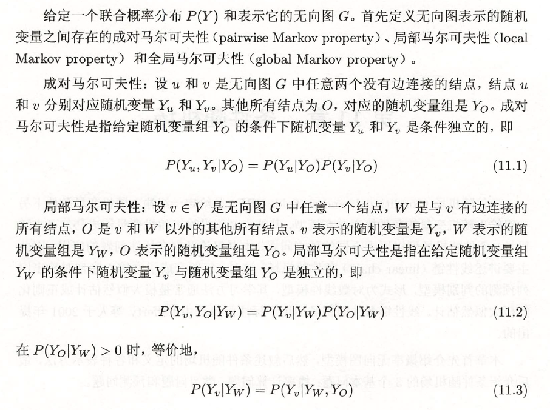

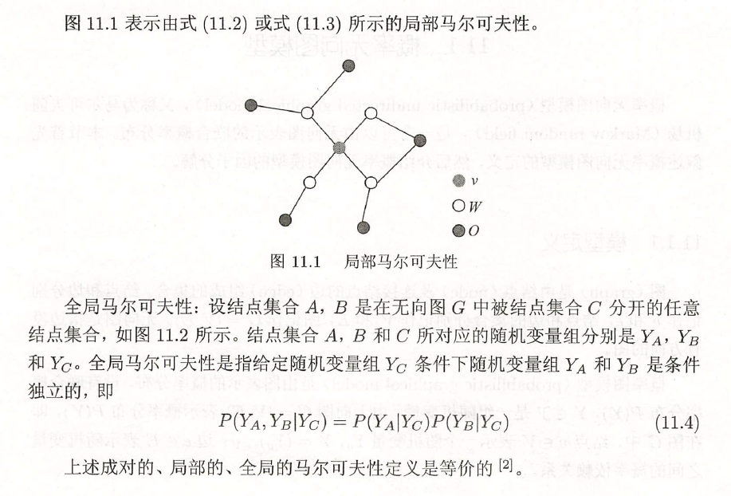

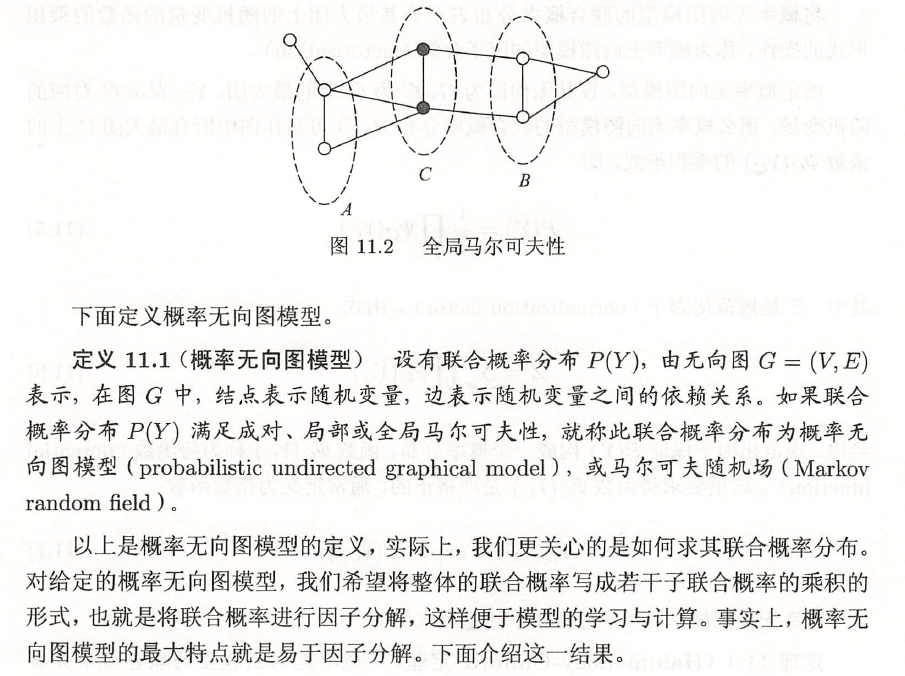

### 因子分解

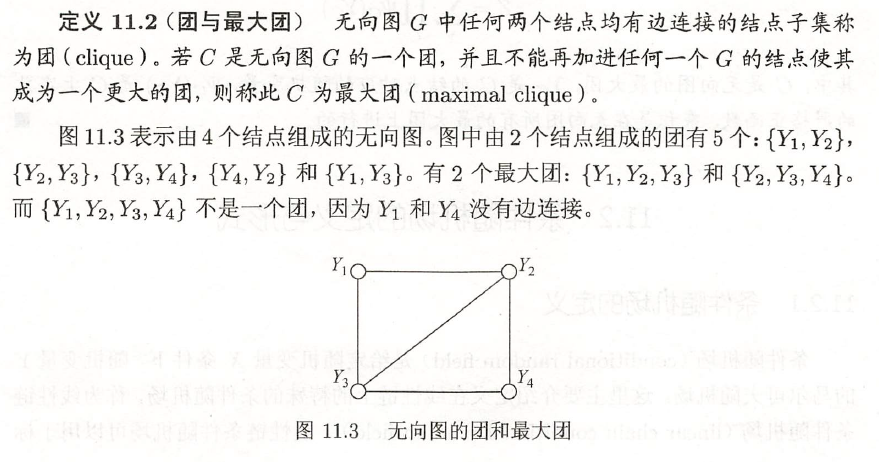

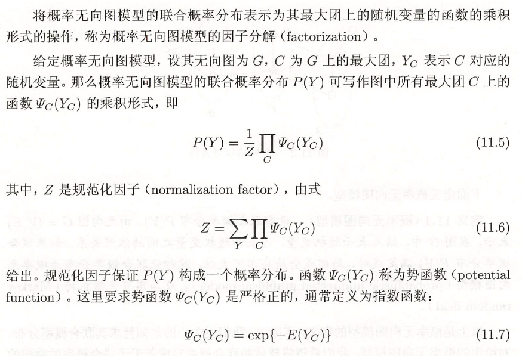

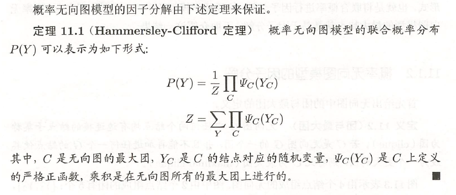

## HMM隐马尔可夫模型

隐马尔可夫模型(Hidden Markov Model，简称HMM)是结构最简单的**动态贝叶斯网(dynamic Bayesian network)**，这是一种著名的**有向图**模型，主要用于时序数据建模，在语音识别、自然语言处理等领域有广泛应用。

隐马尔可夫模型中的变量可分为两组，第一组是**状态变量**$\{y_1, y_2,...,y_n\}$，其中yi表示第i时刻的系统状态。通常假定状态变量是隐藏的、不可被观测的，因此状态变量亦称**隐变量**(hidden variable).第二组是**观测变量**$\{x_1, x_2,...,x_n\}$，其中xi表示第i时刻的观测值。

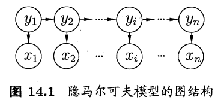

在隐马尔可夫模型中，系统通常在多个状态$\{s_1, s_2,...,s_N\}$ 之间转换，因此状态变量yi的取值范围Y(称为状态空间)通常是有N 个可能取值的**离散空间**.观测变量xi可以是离散型也可以是连续型，为便于讨论，**我们仅考虑离散型观测变量**，并假定其取值范围X 为$\{o_1, o_2,...,o_M\}$ .

在任一时刻，观测变量的取值仅依赖于状态变量，即xt 由yt 确定，与其他状态变量及观测变量的取值无关.

同时， t 时刻的状态如仅依赖于t-1 时刻的状态 ，与其余n-2 个状态无关.这就是所谓的"马尔可夫链" (Markov chain) ，即:==系统下一时刻的状态仅由当前状态决定，不依赖于以往的任何状态==.基于这种依赖关系，所有变量的联合概率分布为

$$P(x_1,y_1,...,x_n,y_n)=P(y_1)P(x_1|y_1)\prod_{i=2}^nP(y_i|y_{i-1})P(x_i|y_i)$$

除了结构信息，欲确定一个隐马尔可夫模型还需以下三组参数：

- **状态转移概率**：模型在各个状态间转换的概率，通常记为矩阵$A=[a_{ij}]_{N\times N}$，其中

$$a_{ij}=P(y_{t+1}=s_j|y_t=s_i)，1\le i,j\le N，$$

表示在任意时刻t，若状态为$s_i$，则在下一时刻状态为$s_j$的概率。

- **输出观测概率**：模型根据当前状态获得各个观测值的概率，通常记为矩阵$B=[b_{ij}]_{N\times M}$，其中

$$b_{ij}=P(x_{t}=o_j|y_t=s_i)，1\le i,j\le N，$$

表示在任意时刻t，若状态为$s_i$，则观测值$o_j$被获取的概率。

- **初始状态概率**：模型在初始时刻各状态出现的概率，通常记为$\pi=(\pi_1, \pi_2,...,\pi_N)$，其中

$$\pi_i=P(y_1=s_i)，1\le i \le N$$

表示模型的初始状态为$s_i$的概率。

==通过指定状态空间Y、观测空间X和上述三组参数，就能确定一个隐马尔可夫模型，通常用参数$\lambda=[A,B,\pi]$来指代。==

给定隐马尔可夫模型$\lambda$，它按如下过程产生观测序列$\{x_1, x_2,...,x_n\}$：

(1) 设置t=1，并根据初始状态概率$\pi$选择初始状态$y_1$；

(2) 根据状态$y_t$和输出观测概率B选择观测变量取值$x_t$；

(3) 根据状态$y_t$和状态转移矩阵A转移模型状态，即确定$y_{t=1}$；

(4) 若t<n，设置t=t+1，并转到第(2)步，否则停止。

**在实际应用中，人们常关注隐马尔可夫模型的三个基本问题：**

- 给定模型$\lambda=[A,B,\pi]$，如何有效计算其产生观测序列x的概率$P(x|\lambda)$？换言之，如何评估模型与观测序列之间的匹配程度？（比如需根据以往的观测序列来推测当前时刻最有可能的观测值$x_n$，这可转化为求取概率$P(x|\lambda)$）
- 给定模型$\lambda=[A,B,\pi]$和观测序列x，如何找到与此观测序列最匹配的状态序列y？换言之，如何根据观测序列推断出隐藏的模型状态？（在语音识别等任务中，观测值为语音信号，隐藏状态为文字，目标就是根据观测信号来推断最有可能的状态序列(即对应的文字)）
- 给定观测序列x，如何调整模型参数$\lambda=[A,B,\pi]$使得该序列出现的概率$P(x|\lambda)$最大？换言之，如何训练模型使其能最好地描述观测数据？（人工指定模型参数已经越来越不可行，如何根据训练样本学得最优的模型参数）

==举例子说明（序列标注问题，POS，标注集BES）==：

> input: "学习出一个模型，然后再预测出一条指定"
>
> expected output: 学/B 习/E 出/S 一/B 个/E 模/B 型/E ，/S 然/B 后/E 再/E 预/B 测/E ……
>
> 其中，input里面所有的char构成的字表，形成观测集 M ，因为字序列在inference阶段是我所能看见的；标注集BES构成隐藏状态集N ，这是我无法直接获取的，也是我的预测任务；至于A、B、π ，这些概率分布信息（上帝信息)都是我在学习过程中所确定的参数。

==**模型运行过程**==

模型的运行过程（工作流程）对应了HMM的3个问题。

**1. 学习训练过程**

HMM学习训练的过程，就是找出数据的分布情况，也就是模型参数的确定。

主要学习算法按照训练数据除了观测状态序列$$（o_{1}, \cdots, o_{i}) $$ 是否还有隐状态序列$（i_{1}, \cdots, i_{i})$  分为：

- 极大似然估计, with 隐状态序列
- Baum-Welch(前向后向)（是一个EM过程）, without 隐状态序列

**2 序列标注（解码）过程**

好了，学习完了HMM的分布参数，也就确定了一个HMM模型。需要注意的是，这个HMM是对我这一批全部的数据进行训练所得到的参数。

序列标注问题也就是“预测过程”，通常称为解码过程。对应了序列建模问题3.。对于序列标注问题，我们只需要学习出一个HMM模型即可，后面所有的新的sample我都用这一个HMM去apply。

我们的目的是，在学习后已知了 $P(Q,O)$ ,现在要求出 $P(Q|O)$ ，进一步$Q_{max} = argmax_{allQ}\frac{P(Q,O)}{P(O)}$

再直白点就是，我现在要在给定的观测序列下找出一条隐状态序列，条件是这个隐状态序列的概率是最大的那个。

具体地，都是用Viterbi算法解码，是用DP思想减少重复的计算。Viterbi也是满大街的，不过要说的是，Viterbi不是HMM的专属，也不是任何模型的专属，他只是恰好被满足了被HMM用来使用的条件。

Viterbi计算有向无环图的一条最大路径，应该还好理解。如图：

关键是注意，每次工作热点区只涉及到t 与 t-1,这对应了DP的无后效性的条件。如果对某些同学还是很难理解，请参考[这个答案](https://www.zhihu.com/question/20136144)下@Kiwee的回答吧。

**3 序列概率过程**

实际上，序列概率过程对应了序列建模问题2.，即序列分类。
在序列标注问题中，我用一批完整的数据训练出了一支HMM模型即可。好，那在序列分类问题就不是训练一个HMM模型了。我应该这么做（结合语音分类识别例子）： 

> 目标：识别声音是A发出的还是B发出的。 
> HMM建模过程： 
>
> 1. 训练：我将所有A说的语音数据作为dataset_A,将所有B说的语音数据作为dataset_B（当然，先要分别对dataset A ,B做预处理encode为元数据节点，形成sequences）,然后分别用dataset_A、dataset_B去训练出HMM_A/HMM_B
> 2. inference：来了一条新的sample（sequence），我不知道是A的还是B的，没问题，分别用HMM_A/HMM_B计算一遍序列的概率得到 $P_{A}(S)、P_{B}(S)$ ，比较两者大小，哪个概率大说明哪个更合理，更大概率作为目标类别。

所以，本小节的理解重点在于，**如何对一条序列计算其整体的概率**。即目标是计算出 $P(O|λ)$ 。这个问题前辈们在他们的经典中说的非常好了，比如参考李航老师整理的：

- 直接计算法（穷举搜索）
- 前向算法
- 后向算法

后面两个算法采用了DP思想，减少计算量，即每一次直接引用前一个时刻的计算结果以避免重复计算，跟Viterbi一样的技巧。

EM算法： 只有观测序列，无状态序列时来学习模型参数，即Baum-Welch算法

维特比算法： 用动态规划解决HMM的预测问题，不是参数估计

前向后向：用来算概率

极大似然估计：即观测序列和相应的状态序列都存在时的监督学习算法，用来估计参数

## MEMM最大熵马尔科夫模型

判别式模型

## MRF马尔可夫随机场

马尔可夫随机场（Markov Random Field，简称MRF）是典型的**马尔可夫网**，这是一种著名的**无向图**模型。

图中每个结点表示一个或一组变量，结点之间的边表示两个变量之间的依赖关系。马尔可夫随机场有一组**势函数(potential functions)，亦称"因子"(factor)**，这是定义在变量子集上的非负实函数，主要用于定义概率分布函数。

下图显示出一个简单的马尔可夫随机场。对于图中结点的一个子集，若其中任意两结点间都有边连接，则称该结点子集为一个**"团"(clique)**。若在一个团中加入另外任何一个结点都不再形成团，则称该团为"极大团"(maximal clique)；换言之，极大团就是不能被其他团所包含的团。显然，每个结点至少出现在一个极大团中。

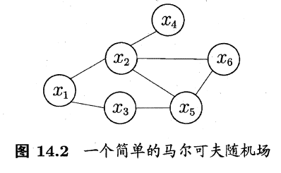

在马尔可夫随机场中，多个变量之间的联合概率分布能基于团分解为多个因子的乘积，每个因子仅与一个团相关。具体来说，对于n个变量$x=\{x_1,x_2,...,x_n\}$，所有团构成的集合为C，与团$Q\in C$对应的变量集合记为$x_Q$，则**联合概率P(x)**定义为

$$P(x)=\frac1Z\prod_{Q\in C}\psi_Q(x_Q)$$

其中$\psi_Q$ 为团Q对应的势函数，用于对团Q中的变量关系进行建模，$Z=\sum_x\prod_{Q\in C}\psi_Q(x_Q)$为规范化因子，以确保P(x)是被正确定义的概率。许多任务往往不需要获得Z的精确值。

显然，若变量个数较多，则团的数目将会很多（例如，所有相互连接的两个变量都会构成团），这就意味着上式会有很多乘积项，显然会给计算带来负担。注意到若团Q不是极大团，则它必被一个极大团Q\*所包含，即$x_Q\subseteq x_{Q*}$；这意味着变量$x_Q$之间的关系不仅体现在势函数$\psi_Q$ 中，还体现在$\psi_Q*$ 中。于是，联合概率P(x)可基于极大团来定义。假定所有极大团构成的集合为C*，则有

$$P(x)=\frac1{Z*}\prod_{Q\in C*}\psi_Q(x_Q)$$

在马尔可夫随机场中如何得到"条件独立性"呢？同样借助"分离"的概念，如图所示，若从结点集A中的结点到B中的结点都必须经过结点集C中的结点，则称结点集A和B被结点集C分离，C称为**"分离集"(separating set)**.对马尔可夫随机场，有

- ==全局马尔可夫性(global Markov property)：给定两个变量子集的分离集，则这两个变量子集条件独立。==

记为$x_A⊥x_B |x_C$，xi为对应的变量集。可用联合概率公式进行验证。

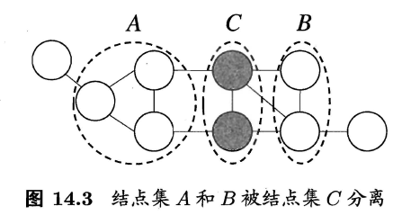

由全局马尔可夫性可得到两个很有用的推论：

- ==局部马尔可夫性(local Markov property)==：**给定某变量的邻接变量，则该变量条件独立于其他变量**。形式化地说，令V为图的结点集，n(v)为结点v在图上的邻接结点，$n^*(v)=n(v)∪{v}$，有$x_v ⊥ x_{V\setminus n^*(v)} | x_{n(v)}$.
- ==成对马尔可夫性(pairwise Markov property)==：**给定所有其他变量，两个非邻接变量条件独立**。形式化地说，令图的结点集合边集分别为V和E，对图中的两个结点u和v，若$<u,v>\notin E，则x_u⊥x_v|x_{V\setminus <u,v>}$。

某变量的所有邻接变量组成的集合称为该变量的**"马尔可夫毯"(Markov blanket)**。

**显然，势函数$\psi_Q(x_Q)$ 的作用是定量刻画变量集$x_Q$中变量之间的相关关系，它应该是非负函数，且在所偏好的变量取值上有较大函数值。** 例如，上图可抽象为xA——xB——xC，假定图中的变量均为二值变量，若势函数为

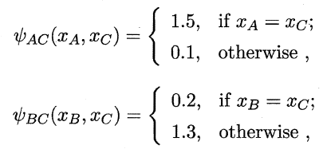

则说明模型偏好变量$x_A$和$x_C$拥有相同的取值，$x_B$和$x_C$拥有不同的取值；换言之，在该模型中$x_A$和$x_C$正相关，$x_B$和$x_C$负相关。令$x_A$和$x_C$相同且$x_B$和$x_C$的变量值指派将取得较高的联合概率。

为了满足非负性，指数函数常被用于定义势函数，即

$$\psi_Q(x_Q)=e^{-H_Q(x_Q)}$$

$H_Q(x_Q)$是一个定义在变量$x_Q$上的实值函数，常见形式为

$$H_Q(x_Q)=\sum_{u,v \in Q, u\ne v}\alpha_{uv}x_ux_v+\sum_{v\in Q}\beta_vx_v$$

其中$\alpha_{uv}$和$\beta_v$是参数。上式中的第二项仅考虑单结点，第一项则考虑每一对结点的关系。

## CRF条件随机场模型

条件随机场(Conditional Random Field，简称CRF)是一种**判别式无向图模型**。前面的隐马尔可夫模型和马尔可夫随机场都是生成式模型，而条件随机场是判别式模型。条件随机场可看作给定观测值的马尔可夫随机场，也可看作对率回归的扩展。

条件随机场**试图对多个变量在给定观测值后的条件概率进行建模**。具体来说，若令$x=\{x_1,x_2,...x_n\}$为观测序列，$y=\{y_1,y_2,...y_n\}$为与之对应的标记序列，则条件随机场的目标是构建条件概率模型P(y|x)。需注意的是，标记变量y可以是结构型变量，即其分量之间具有某种相关性。例如在自然语言处理的词性标注任务中，观测数据为语句(即单词序列)，标记为相应的词性序列，具有线性序列结构，如图(a)所示；在语法分析任务中，输出标记则是语法树，具有树形结构，如图(b)所示。

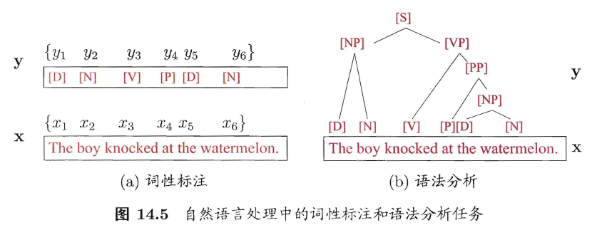

令G=<V,E>表示结点与标记变量y中元素一一对应的无向图，$y_v$表示与结点v对应的标记变量，n(v)表示结点v的邻接结点，若图G的每个变量$y_v$都满足马尔可夫性，即

$P(y_v|x,y_{V\setminus \{v\}})=P(y_v|x,y_{n(v)})$

**则(y,x)构成一个条件随机场**。

理论上来说，图G可具有任意结构，只要能表示标记变量之间的条件独立性关系即可。但在现实应用中，尤其是对标记序列建模时，最常用的仍是下图所示的链式结构，即"链式条件随机场"(chain-structured CRF).

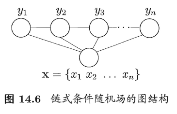

与马尔可夫随机场定义联合概率的方式类似，条件随机场使用势函数和图结构上的团来定义条件概率P(y|x).给定观测序列x，上图所示的链式条件随机场主要包含两种关于标记变量的团，即单个标记变量{$y_i$}以及相邻的标记变量{$y_{i-1},y_i$}。选择合适的势函数，即可得到条件概率定义。

在条件随机场中，通过选用**指数势函数**并引入特征函数(feature function)，**条件概率被定义为**

$$P(y|x)=\frac1Zexp(\sum_j\sum_{i=1}^{n-1}\lambda_jt_j(y_{i+1},y_i,x,i)+\sum_k\sum_{i=1}^n\mu_ks_k(y_i,x,i))$$

其中$t_j(y_{i+1},y_i,x,i)$是定义在观测序列的两个相邻标记位置上的**转移特征函数**(transition feature function)，用于刻画相邻标记变量之间的相关关系以及观测序列对它们的影响，$s_k(y_i,x,i)$是定义在观测序列的标记位置i上的**状态特征函数**(status feature function)，用于刻画观测序列对标记变量的影响，$\lambda_j和\mu_k$为参数，Z为规范化因子，用于确保上式是正确定义的概率。

显然，要使用条件随机场，还需定义合适的特征函数。特征函数通常是实值函数，以刻画数据的一些很可能成立或期望成立的经验特性。举个例子：

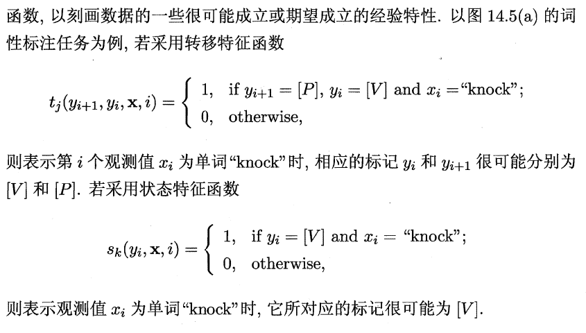

对于CRF和MRF的概率公式可看出，条件随机场和马尔可夫随机场均使用团上的势函数定义概率，两者在形式上没有显著区别；但条件随机场处理的是条件概率，而马尔可夫随机场处理的是联合概率。

==CRF的特点==

1）CRF没有HMM那样严格的独立性假设条件，因而可以容纳任意的上下文信息。特征设计灵活（与ME一样） ————与HMM比较

（2）同时，由于CRF计算全局最优输出节点的条件概率，它还克服了最大熵马尔可夫模型标记偏置（Label-bias）的缺点。 ­­————与MEMM比较

（3）CRF是在给定需要标记的观察序列的条件下，计算整个标记序列的联合概率分布，而不是在给定当前状态条件下，定义下一个状态的状态分布。

————与ME比较

缺点：训练代价大、复杂度高

## 学习与推断

基于概率图模型定义的联合概率分布，我们能对目标变量的边际分布(marginal distribution)或以某些可观测变量为条件的条件分布进行推断.条件分布我们已经接触过很多，例如在隐马尔可夫模型中要估算观测序列x 在给定参数入下的条件概率分布.边际分布则是指对无关变量求和或积分后得到结果，例如在马尔可夫网中，变量的联合分布被表示成极大团的势函数乘积，于是，给定参数θ求解某个变量x 的分布，就变成对联合分布中其他无关变量进行积分的过程，这称为"**边际化**" (marginalization).

对概率图模型，还需确定具体分布的参数，这称为**参数估计或参数学习问题，通常使用极大似然估计或最大后验概率估计求解**.但若将参数视为待推测的变量，则参数估计过程和推断十分相似，可以"吸收"到推断问题中.因此，下面我们只讨论概率图模型的推断方法.

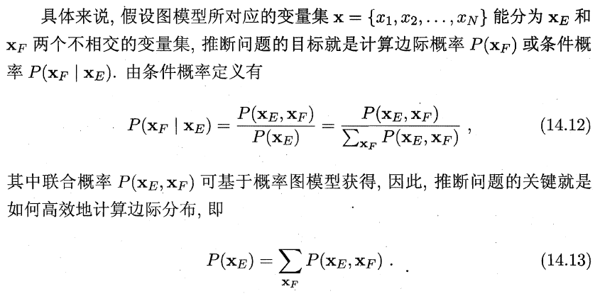

概率图模型的推断方法大致可分为两类.**第一类是精确推断方法**，希望能计算出目标变量的边际分布或条件分布的精确值;遗憾的是，一般情形下，此类算法的计算复杂度随着极大团规模的增长呈指数增长，适用范围有限.**第二类是近似推断方法**，希望在较低的时间复杂度下获得原问题的近似解;此类方法在现实任务中更常用.

==精确推断方法：变量消去==

精确推断的实质是一类动态规划算法，**它利用图模型所描述的条件独立性来削减计算目标概率值所需的计算量**.变量消去法是最直观的精确推断算法，也是构建其他精确推断算法的基础.

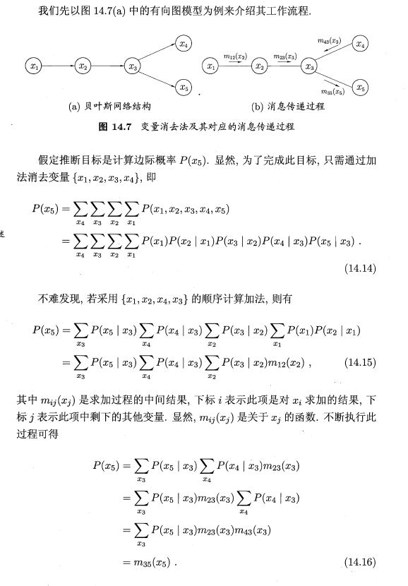

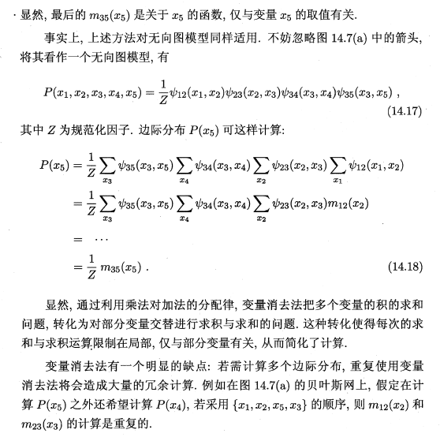

==精确推断方法：信念传播==

信念传播(Belief Propagation)算法将变量消去法中的求和操作看作一个消息传递过程，较好地解决了求解多个边际分布时的重复计算问题.（亦称Sum-Product算法）

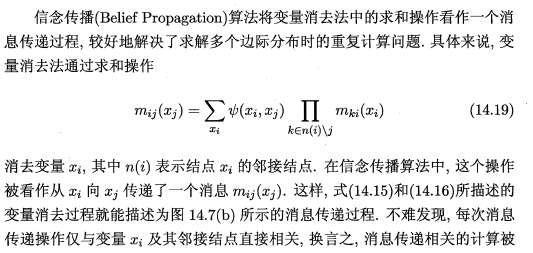

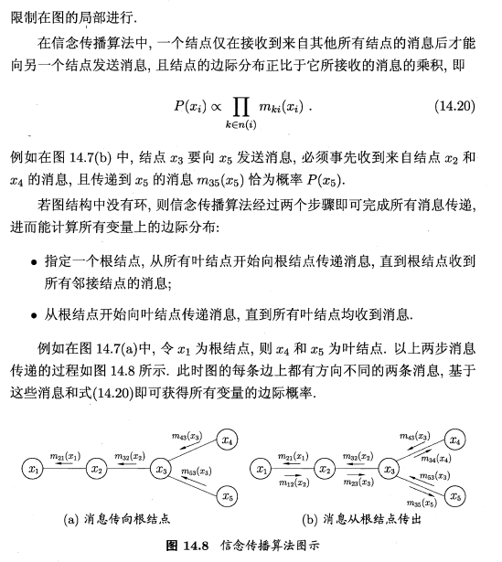

精确推断方法通常需要很大的计算开销，因此在现实应用中近似推断方法更为常用.近似推断方法大致可分为两大类:第一类是采样(sampling) ，通过使用随机化方法完成近似;第二类是使用确定性近似完成近似推断，典型代表为变分推断(variational inference).

==近似推断方法：MCMC采样==

在很多任务中，我们关心某些概率分布并非因为对这些概率分布本身感兴趣，而是要基于它们计算某些期望，并且还可能进一步基于这些期望做出决策.例如对图14.7(a) 的贝叶斯网，进行推断的目的可能是为了计算变量x5的期望.若直接计算或逼近这个期望比推断概率分布更容易,则直接操作无疑将使推断问题的求解更为高效.

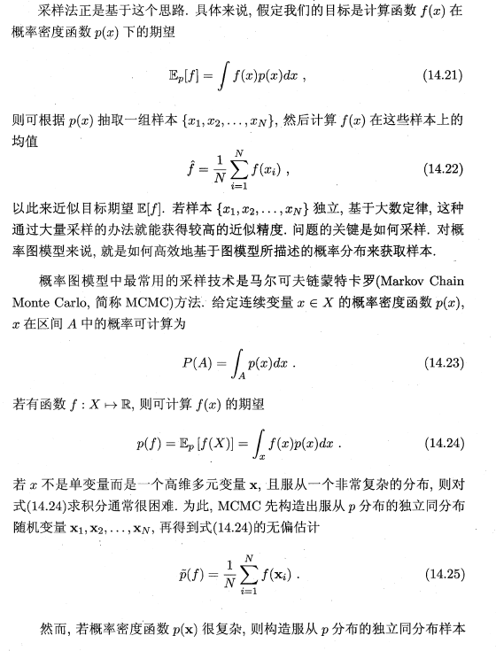

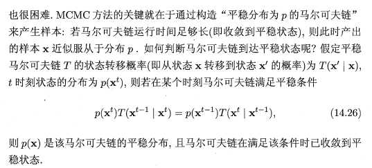

也就是说， MCMC 方法先设法构造一条马尔可夫链，使其收敛至平稳分布恰为待估计参数的后验分布，然后通过这条马尔可夫链来产生符合后验分布的样本，并基于这些样本来进行估计.这里马尔可夫链转移概率的构造至关重要，不同的构造方法将产生不同的MCMC 算法.

Metropolis-Hastings (简称MH) 算法是MCMC 的重要代表.它基于"拒绝采样" (rejeet sampling) 来逼近平稳分布p. 

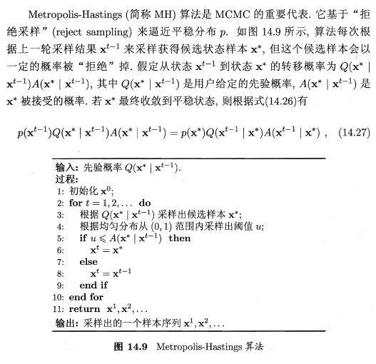

实践中常会丢弃前面若干个样本，因为达到平稳分布后产生的才是希望得到的样本。

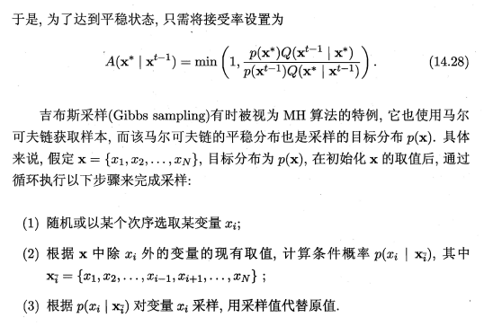

==近似推断方法：变分推断==

变分推断通过使用己知简单分布来逼近需推断的复杂分布，并通过限制近似分布的类型，从而得到一种局部最优、但具有确定解的近似后验分布.

变分推断使用的近似分布需具有良好的数值性质，通常是基于连续型变量的概率密度函数来刻画的。

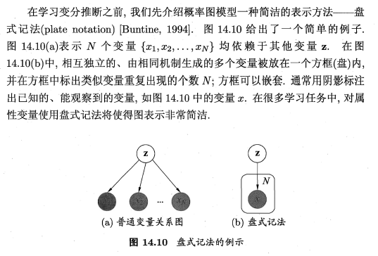

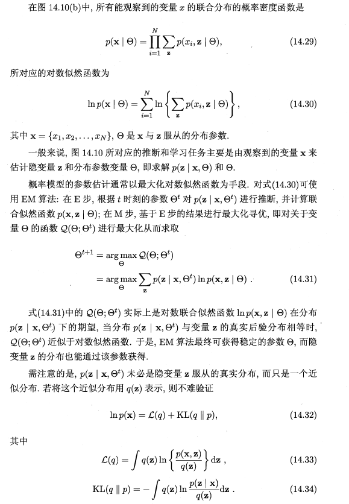

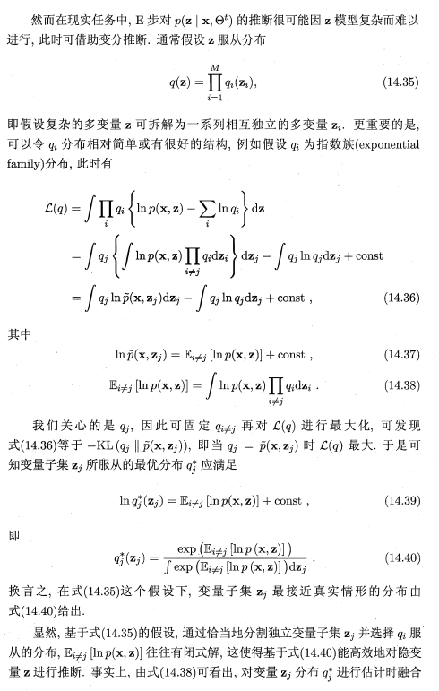

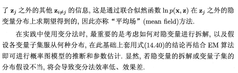

## 话题模型

话题模型(topic model)是一族**生成式有向图模型**，主要用于处理**离散型的数据**(如文本集合) ，在信息检索、自然语言处理等领域有广泛应用.**隐狄利克雷分配模型(Latent Dirichlet Allocation，简称LDA)** 是话题模型的典型代表.

我们先来了解一下话题模型中的几个概念:词(word) 、文档(document) 和话题(topic). 具体来说，"词"是待处理数据的基本离散单元，例如在文本处理任务中，一个词就是一个英文单词或有独立意义的中文词。"文档"是待处理的数据对象，它由一组词组成，这些词在文档中是不计顺序的，例如一篇论文、一个网页都可看作一个文档;这样的表示方式称为"词袋" (bag-of-words). **数据对象只要能用词袋描述，就可使用话题模型**。"话题"表示一个概念，具体表示为一系列相关的词，以及它们在该概念下出现的概率.（例如若把图像中的小块看作词，则可将图像表示为词袋，于是话题模型也可用于图像数据）。

形象地说，如图14.11 所示，一个话题就像是一个箱子，里面装着在这个概念下出现概率较高的那些词.不妨假定数据集中一共包含K 个话题和T 篇文档，文档中的词来自一个包含N 个词的词典.我们用T 个N 维向量$W=\{w_1,w_2,...w_T\}$ 表示数据集(即文档集合)， K 个N 维向量$\beta_k$(k = 1 ， 2 ，… ， K) 表示话题，其中$w_t\in R^N$ 的第n 个分量$w_{t,n}$表示文档t 中词n的词频， $\beta_k\in R^N$ 的第n 个分量$\beta_{k,n}$ 表示话题k 中词n 的词频.

在现实任务中可通过统计文档中出现的词来获得词频向量$w_i$(i=1,2,...,T)，但通常并不知道这组文档谈论了哪些话题，也不知道每篇文档与哪些话题有关。LDA从生成式模型的角度来看待文档和话题。具体来说，**LDA认为每篇文档包含多个话题**，不妨用向量$\Theta_t\in R^K$表示文档t中所包含的每个话题的比例，$\Theta_{t,k}$即表示文档t中包含话题k的比例，进而通过下面的步骤由话题"生成"文档t：

(1) 根据参数为$\alpha$的狄利克雷分布随机采样一个话题分布$\Theta_t$；

(2) 按如下步骤生成文档中的N个词：

​	(a) 根据$\Theta_t$进行话题指派，得到文档t中词n的话题$z_{t,n}$；

​	(b) 根据指派的话题所对应的词频分布$\beta_k$随机采样生成词。

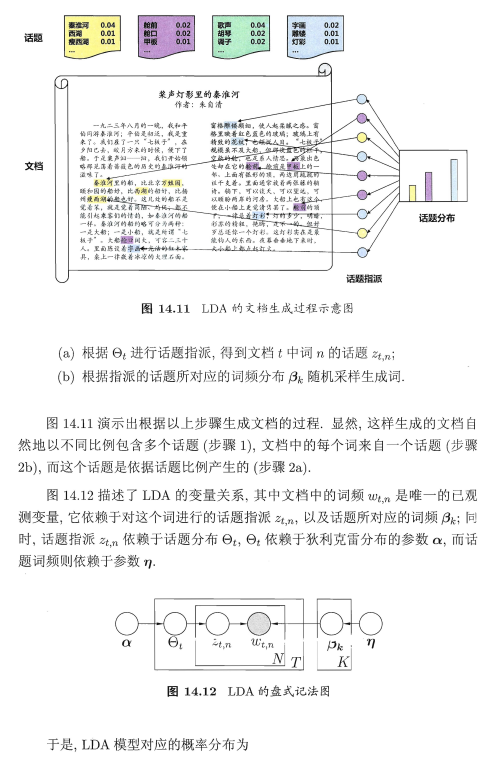

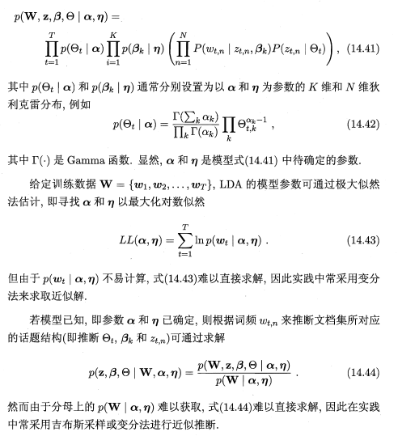

## HMM、MEMM vs CRF

1）HMM是有向图模型，是生成模型；HMM有两个假设：一阶马尔科夫假设和观测独立性假设；但对于序列标注问题不仅和单个词相关，而且和观察序列的长度，单词的上下文，等等相关。

2）MEMM（最大熵马尔科夫模型）是有向图模型，是判别模型；MEMM打破了HMM的观测独立性假设，MEMM考虑到相邻状态之间依赖关系，且考虑整个观察序列，因此MEMM的表达能力更强；但MEMM会带来标注偏置问题：由于局部归一化问题，MEMM倾向于选择拥有更少转移的状态。这就是标记偏置问题。

3）CRF模型解决了标注偏置问题，去除了HMM中两个不合理的假设，当然，模型相应得也变复杂了。

HMM、MEMM和CRF的优缺点比较：

a）与HMM比较。CRF没有HMM那样严格的独立性假设条件，因而可以容纳任意的上下文信息。特征设计灵活（与ME一样）

b）与MEMM比较。由于CRF计算全局最优输出节点的条件概率，它还克服了最大熵马尔可夫模型标记偏置（Label-bias）的缺点。

c）与ME比较。CRF是在给定需要标记的观察序列的条件下，计算整个标记序列的联合概率分布，而不是在给定当前状态条件下，定义下一个状态的状态分布.

> 首先，CRF，HMM(隐马模型)，MEMM(最大熵隐马模型)都常用来做序列标注的建模，像分词、词性标注，以及命名实体标注  
> 隐马模型一个最大的缺点就是由于其输出独立性假设，导致其不能考虑上下文的特征，限制了特征的选择  
> 最大熵隐马模型则解决了隐马的问题，可以任意选择特征，但由于其在每一节点都要进行归一化，所以只能找到局部的最优值，同时也带来了标记偏见的问题，即凡是训练语料中未出现的情况全都忽略掉。  
> 条件随机场则很好的解决了这一问题，他并不在每一个节点进行归一化，而是所有特征进行全局归一化，因此可以求得全局的最优值。

# 参考资料
[条件随机场（CRF）和隐马尔科夫模型（HMM）最大区别在哪里？CRF的全局最优体现在哪里？](https://www.zhihu.com/question/53458773)

[如何用简单易懂的例子解释条件随机场（CRF）模型？它和HMM有什么区别？](https://www.zhihu.com/question/35866596)

 #td 
