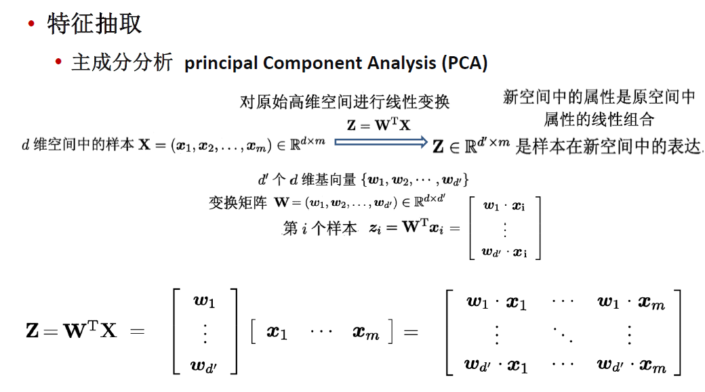
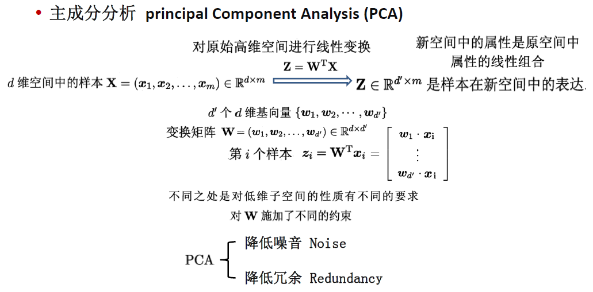
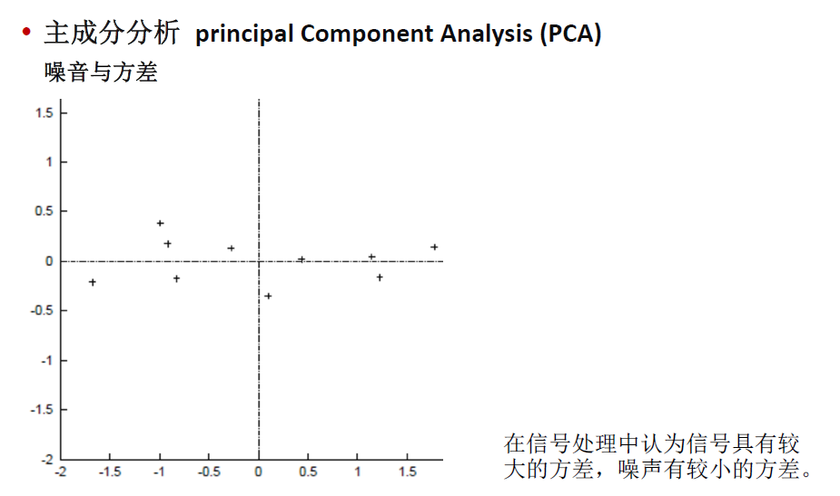
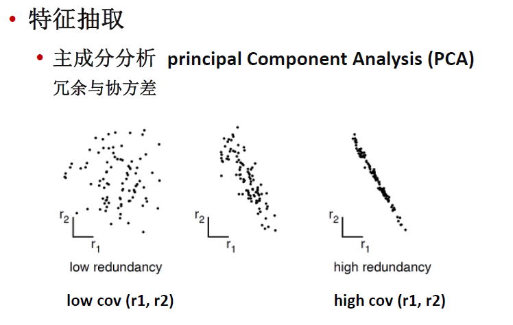
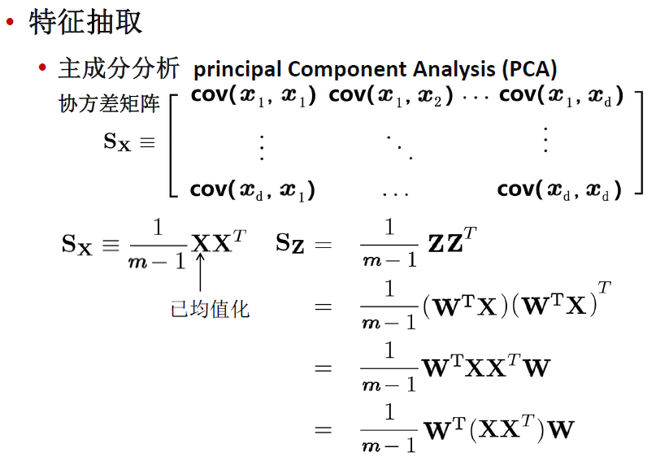
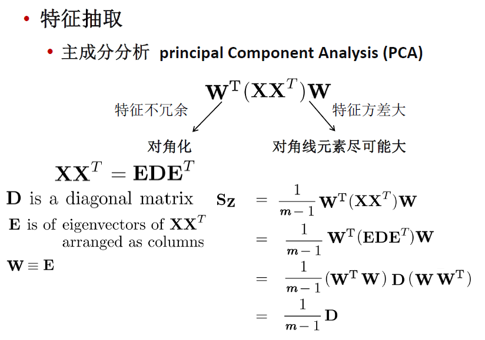
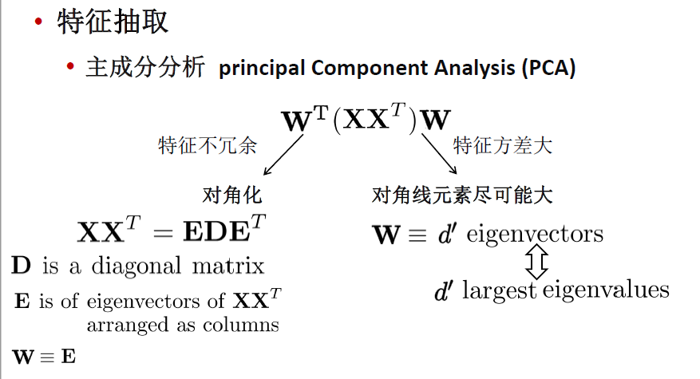
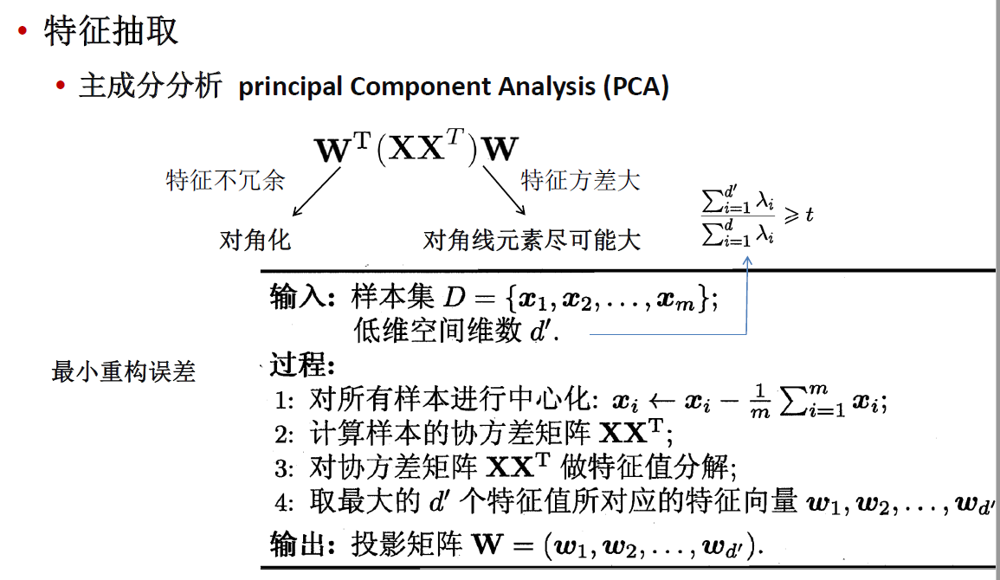

非监督算法，不考虑预测任务

==奇异值分解总是存在，但不一定唯一==

==在信号处理中认为信号具有较大的方差，噪声有较小的方差，信噪比就是信号与噪声的方差比，越大越好。==

PCA(principal Component Analysis)，即主成分分析方法，是一种使用最广泛的数据压缩算法。在PCA中，数据从原来的坐标系转换到新的坐标系，由数据本身决定。转换坐标系时，以方差最大的方向作为坐标轴方向，因为数据的最大方差给出了数据的最重要的信息。第一个新坐标轴选择的是原始数据中方差最大的方法，第二个新坐标轴选择的是与第一个新坐标轴正交且方差次大的方向（从直观上说，让两个字段尽可能表示更多的原始信息，我们是不希望它们之间存在（线性）相关性的，因为相关性意味着两个字段不是完全独立，必然存在重复表示的信息。）。重复该过程，重复次数为原始数据的特征维数。

通过这种方式获得的新的坐标系，我们发现，大部分方差都包含在前面几个坐标轴中，后面的坐标轴所含的方差几乎为0。于是，我们可以忽略余下的坐标轴，只保留前面的几个含有绝不部分方差的坐标轴。事实上，这样也就相当于只保留包含绝大部分方差的维度特征，而忽略包含方差几乎为0的特征维度，也就实现了对数据特征的降维处理。

那么，我们如何得到这些包含最大差异性的主成分方向呢？事实上，通过计算数据矩阵的协方差矩阵，然后得到协方差矩阵的特征值及特征向量，选择特征值最大（也即包含方差最大）的N个特征所对应的特征向量组成的矩阵，我们就可以将数据矩阵转换到新的空间当中，实现数据特征的降维（N维）。

去除平均值
计算协方差矩阵（协方差矩阵表明了特征之间的相关性程度）
计算协方差矩阵的特征值和特征向量
将特征值排序
保留前N个最大的特征值对应的特征向量
将数据转换到上面得到的N个特征向量构建的新空间中（实现了特征压缩）

选择top最大的几个特征值对应的特征向量组合起来作为中间矩阵A(m×r)。原始数据标准化后的矩阵X(n×m)和A(m×r)相乘就得到主成分矩阵。（特征从m维压缩到r维)

X矩阵均值为0，所以Sx就是协方差矩阵。

$Z=W^TX$，Z为X对W做基变换后的数据，设Z的协方差矩阵为Sz，上述过程推导了Sx和Sz之间的关系。

PCA就是试图：

将一组N维向量降为K维（K大于0，小于N），其目标是选择K个单位正交基，使得原始数据变换到这组基上后，各字段两两间协方差为0，而字段的方差则尽可能大。

想让原始数据集X =>pca成数据集Z，使得Z的协方差矩阵是个对角矩阵。 
有上述推导可得，若有矩阵W能使X的协方差矩阵对角化，则W就是我们要找的PCA变换。

优化目标变成了寻找一个矩阵W，满足$W^TS_xW$是一个对角矩阵，并且对角元素按从大到小依次排列，那么W的前K行就是要寻找的基，用W的前K行组成的矩阵乘以X就使得X从N维降到了K维并满足上述优化条件。

首先，原始数据矩阵X的协方差矩阵C是一个实对称矩阵，它有特殊的数学性质：

1. 实对称矩阵不同特征值对应的特征向量必然正交。
2. 设特征值λ重数为r，则必然存在r个线性无关的特征向量对应于λ，因此可以将这r个特征向量单位正交化。

一个n行n列的实对称矩阵一定可以找到n个单位正交特征向量，将其按列组成矩阵E，则对协方差矩阵Sx有：$E^TS_xE$=对角矩阵

在解释一下，特征值λ为什么要从大到小排列，为什么要选较大的λ？
  因为我们协方差矩阵的对角线元素是方差，我们想要找方差较大的特征维度，所以要选择较大的对角线元素。 
  而对角矩阵Λ虽然是Sx经过线性变化后的矩阵，但它在对角线上元素的大小关系没变，特征维度i对应的特征值λi越大，该维度上数据的方差越大。

总结一下PCA的算法步骤： 
 设有n条m维数据。

1. 将原始数据按列组成m行n列矩阵X
2. 将X的每一行(代表一个属性字段）进行零均值化
3. 求出协方差矩阵$C=\frac1mXX^T$
4. 求出协方差矩阵的特征值及对应的特征向量
5. 将特征向量按对应特征值大小从上到下按行排列成矩阵，取前k行组成矩阵P
6. Y=PX即为降维到k维后的数据