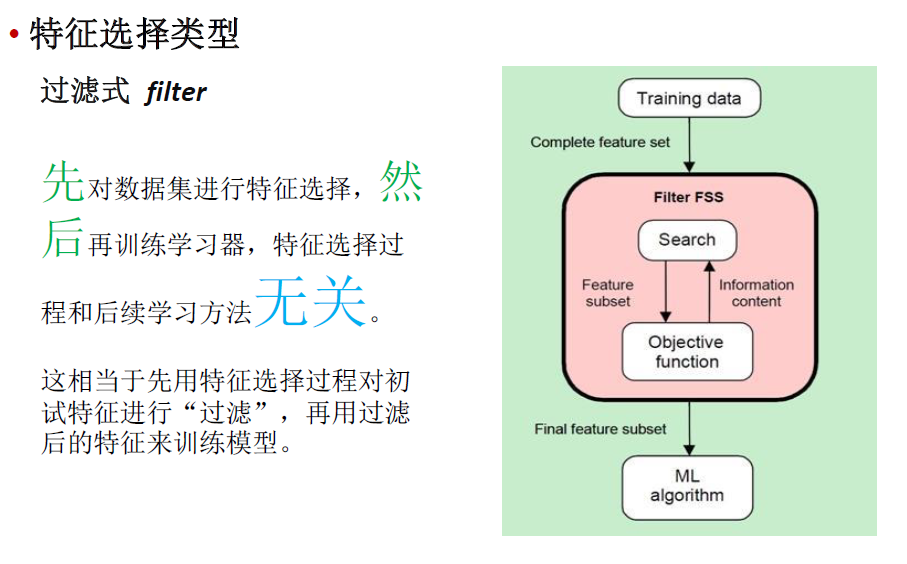
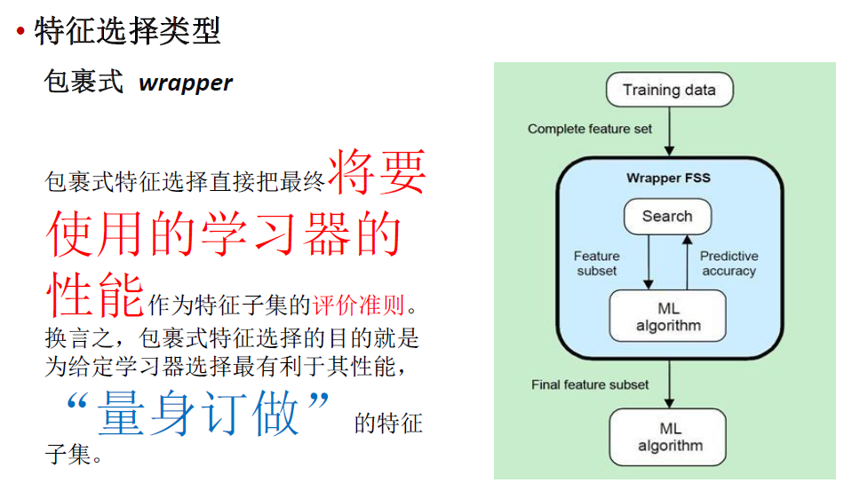
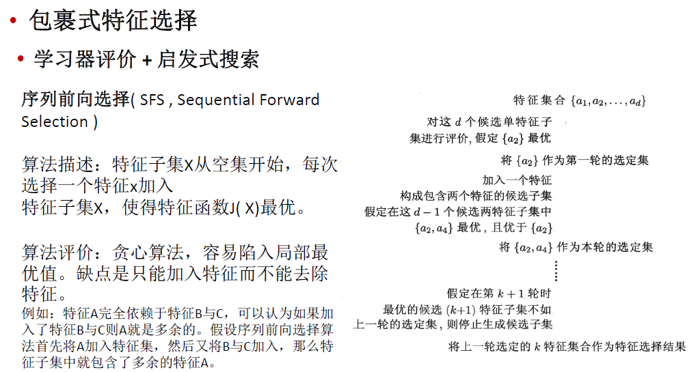
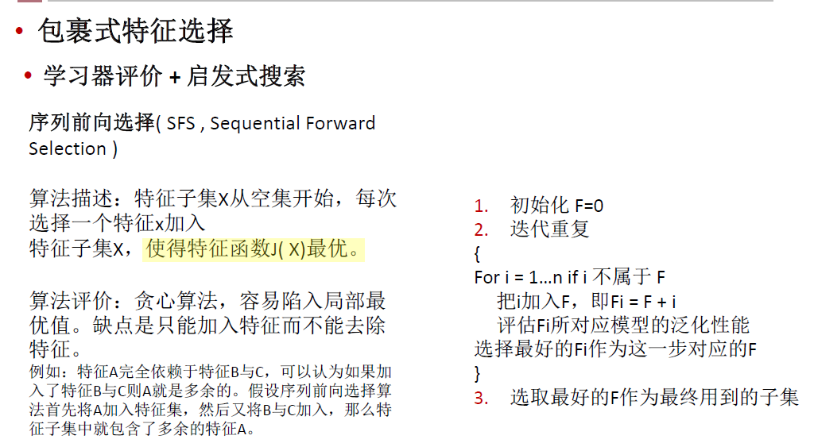
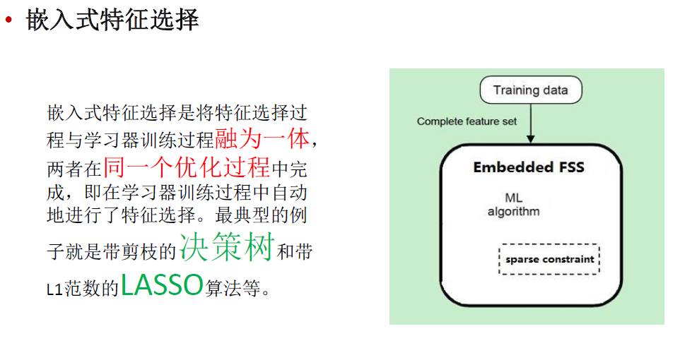

定义：

特征选择( Feature Selection )也称特征子集选择( Feature Subset Selection , FSS ) ，或属性选择( Attribute Selection ) ，是指从全部特征中选取一个特征子集，使构造出来的模型更好。

目的：

解决维度灾难问题
选取出真正相关的特征简化了模型，使研究人员易于理解数据产生的过程。

## [机器学习中，有哪些特征选择的工程方法？](http://www.zhihu.com/question/28641663)

特征选择是特征工程中的重要问题（另一个重要的问题是特征提取），坊间常说：数据和特征决定了机器学习的上限，而模型和算法只是逼近这个上限而已。由此可见，特征工程尤其是特征选择在机器学习中占有相当重要的地位。机器学习做得好不好，被数据和模型共同影响，比如说，数据本身不可分，那么SVM等分类算法再牛逼，也不能完全正确分开。数据集本身是有内在特性的，数据集本身的特征决定了机器学习的上限。所以，一个机器学习算法可能在数据集A上效果很好，但在数据集B上效果很差，这是很正常的现象，因为数据集A和B的内在特性不一样。我以前学别人使用GBDT提取特征，别人使用GBDT提取特征，可以使分类效果提升，但是，我使用了GBDT提特征，并没有使效果提升。因为数据集特性不一样。所以，数据集的特性决定了算法能达到效果的上限。

通常而言，特征选择是指选择获得相应模型和算法最好性能的特征集，工程上常用的方法有以下：
1.计算每一个特征与响应变量的相关性：工程上常用的手段有计算皮尔逊系数和互信息系数，皮尔逊系数只能衡量线性相关性而互信息系数能够很好地度量各种相关性，但是计算相对复杂一些，好在很多toolkit里边都包含了这个工具（如sklearn的MINE），得到相关性之后就可以排序选择特征了.(其实就是计算输出关于输入的导数，如果某个特征很大程度上影响了输出，那么该特征就会比较重要)。

2. 构建单个特征的模型，通过模型的准确性为特征排序，借此来选择特征，另外，记得JMLR'03上有一篇论文介绍了一种基于决策树的特征选择方法，本质上是等价的。当选择到了目标特征之后，再用来训练最终的模型；
3. 通过L1正则项来选择特征：L1正则方法具有稀疏解的特性，因此天然具备特征选择的特性，但是要注意，L1没有选到的特征不代表不重要，原因是两个具有高相关性的特征可能只保留了一个，如果要确定哪个特征重要应再通过L2正则方法交叉检验；
4. 训练能够对特征打分的预选模型：RandomForest和Logistic Regression等都能对模型的特征打分，通过打分获得相关性后再训练最终模型；
5. 通过特征组合后再来选择特征：如对用户id和用户特征最组合来获得较大的特征集再来选择特征，这种做法在推荐系统和广告系统中比较常见，这也是所谓亿级甚至十亿级特征的主要来源，原因是用户数据比较稀疏，组合特征能够同时兼顾全局模型和个性化模型，这个问题有机会可以展开讲。
6. 通过深度学习来进行特征选择：目前这种手段正在随着深度学习的流行而成为一种手段，尤其是在计算机视觉领域，原因是深度学习具有自动学习特征的能力，这也是深度学习又叫unsupervisedfeature learning的原因。从深度学习模型中选择某一神经层的特征后就可以用来进行最终目标模型的训练了。

http://www.zhihu.com/question/34271604

## 在广告LR模型中，为什么要做特征组合？

 在业界，LR模型之所以很受欢迎，主要是因为LR模型本质是对数线性模型，实现简单，易于并行，大规模扩展方便，迭代速度快，同时使用的特征比较好解释，预测输出在0与1之间契合概率模型。（模型的可解释性举例，比如A-B的权重比较大，A代表用户，B代表物品，那么可以认为A是对B比较感兴趣的）但是，线性模型对于非线性关系缺乏准确刻画，特征组合正好可以加入非线性表达，增强模型的表达能力。另外，广告LR中，基本特征可以认为是用于全局建模，组合特征更加精细，是个性化建模，因为在这种大规模离散LR中，单对全局建模会对部分用户有偏，对每一用户建模又数据不足易过拟合同时带来模型数量爆炸，所以基本特征+组合特征兼顾了全局和个性化。比如特征向量中，有用户A，B，C，物品E,F,G。基本的特征A,B.C.E.F.G对应的权重，对应的是每个对象的偏置权重，但如果A偏好E,B偏好F，那么组合特征A-E,B-F就是对用户的个性进行建模，组合特征A-E,B-F的权重就是代表A对E的喜好，和B-F的喜好。

### 文本中常见的六种特征选择方法

1）DF(Document Frequency) 文档频率

DF:统计特征词出现的文档数量，用来衡量某个特征词的重要性

2）MI(Mutual Information) 互信息法

互信息法用于衡量特征词与文档类别直接的信息量。

如果某个特征词的频率很低，那么互信息得分就会很大，因此互信息法倾向"低频"的特征词。

相对的词频很高的词，得分就会变低，如果这词携带了很高的信息量，互信息法就会变得低效。

3）(Information Gain) 信息增益法

通过某个特征词的缺失与存在的两种情况下，语料中前后信息的增加，衡量某个特征词的重要性。

4）CHI(Chi-square) 卡方检验法

利用了统计学中的"假设检验"的基本思想：首先假设特征词与类别直接是不相关的

如果利用CHI分布计算出的检验值偏离阈值越大，那么更有信心否定原假设，接受原假设的备则假设：特征词与类别有着很高的关联度。

5）WLLR(Weighted Log Likelihood Ration)加权对数似然

6）WFO（Weighted Frequency and Odds）加权频率和可能性

http://blog.csdn.net/ztf312/article/details/50890099

### 子集搜索和子集评价

首先从特征全集中产生出一个特征子集，然后用评价函数对该特征子集进行评价，评价的结果与停止准则进行比较，若评价结果比停止准则好就停止，否则就继续产生下一组特征子集，继续进行特征选择。选出来的特征子集一般还要验证其有效性

#### 过滤式 filter

先对数据集进行特征选择，然后再训练学习器，特征选择过程和后续学习方法无关。
这相当于先用特征选择过程对初始特征进行“过滤”，再用过滤后的特征来训练模型。



**单变量评价+ Threshold Filter/Select K Best**

- Information Gain (IG)  信息增益
- $\chi^2$ statistic (CHI)  卡方统计量
- Mutual Information (MI)  互信息，度量两个变量的相似性

特征子集的重要性是由子集中每个特征所对应的相关统计量分量之和来决定。

指定一个阈值τ，然后选择比τ大的相关统计量分量所对应的特征即可；

也可指定欲选取的特征个数k，然后选择相关统计量分量最大的k个特征。

For regression: **f_regression, mutual_info_regression**

For classisification: **chi2, f_classif, mutual_info_classif**

**SelectKBest** removes all but the k highest scoring features

**SelectPercenttile** removes all but a user-specified highest scoring percentage of features.

```python
from sklearn.datasets import load_iris
from sklearn.feature_selection import SelectKBest
from sklearn.feature_selection import chi2
iris = load_iris()
X, y = iris.data, iris.target
print(X.shape)  # (150,4)
X_new = SelectKBest(chi2, k=2).fit_transform(X,y)
print(X_new.shape)  # (150,2)
```

可以先过滤，再用更高级的方法进行特征选择

#### 包裹式 wrapper

包裹式特征选择直接把最终将要使用的学习器的性能作为特征子集的评价准则。
换言之，包裹式特征选择的目的就是为给定学习器选择最有利于其性能，“量身订做”的特征子集。



**学习器评价+ 启发式搜索**

子集评价：分类器错误率(Classifier error rate )
使用特定的分类器，用给定的特征子集对样本集进行分类，用分类的精度来衡量特征子集的好坏。
子集搜索：假如有p个特征，那么就会有2p种特征组合，每种组合对应了一个模型。由于每种特征组合都需要训练一次模型，而训练模型的代价实际上是很大的，无法枚举所有的特征子集来选最优的特征子集。简单的想法是利用启发式搜索方法：forward search（前向搜索）和backward search（后向搜索）。

序列前向选择( SFS , Sequential Forward Selection )

算法描述：特征子集X从空集开始，每次选择一个特征x加入特征子集X，使得特征函数J( X)最优。

算法评价：贪心算法，容易陷入局部最优值。缺点是只能加入特征而不能去除特征。





#### 包裹式 vs 过滤式

一般而言，由于包裹式特征选择方法直接针对给定学习器进行优化，因此从最终**学习器性能**来看，包裹式特征选择比过滤式特征选择**更好**，但另一方面，由于在特征选择过程中需多次训练学习器，因此包裹式特征选择的**计算开销**通常比过滤式特征选择**大得多**。

#### 嵌入式特征选择

嵌入式特征选择是将特征选择过程与学习器训练过程融为一体，两者在同一个优化过程中完成，即在学习器训练过程中自动地进行了特征选择。最典型的例子就是带剪枝的决策树和带L1范数的LASSO算法等。



### 分支定界法

**在()情况下,用分支定界法做特征选择计算量相对较少?**

选用的可分性判据J具有可加性
选用的可分性判据J对特征数目单调不减
样本较多

C(n,d)>>n（n为原特征个数，d为要选出的特征个数）

BD,该算法的主要思路是：定义一个满足单调性条件的评价准则函数，对两个特征子集S1和S2而言,如果S1是S2的子集, 那么S1所对应的评价函数值必须要小于S2所对应的评价函数值,在定义了该评价函数的前提下,该算法对最终特征子集的选择过程可以用一棵树来描述,树根是所有特征的集合从树根可分性判据值和事先定义的最佳特征子集的特征数目,搜索满足要求的特征子集

但存在3个问题：

1于该算法无法对所有的特征依据其重要性进行排序!如何事先确定最优特征子集中特征的数目是一个很大的问题2合乎问题要求的满足单调性的可分性判据难以设计3当处理高维度多分类问题时!算法要运行多次!计算效率低下的问题将非常明显