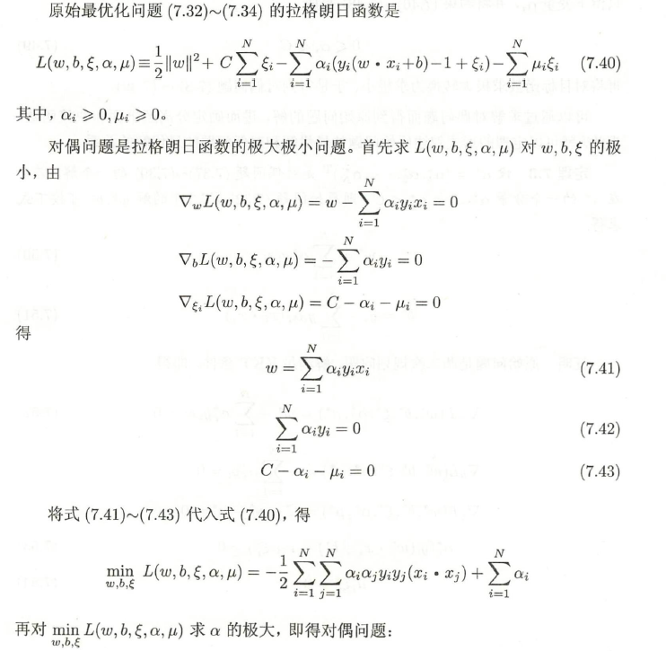
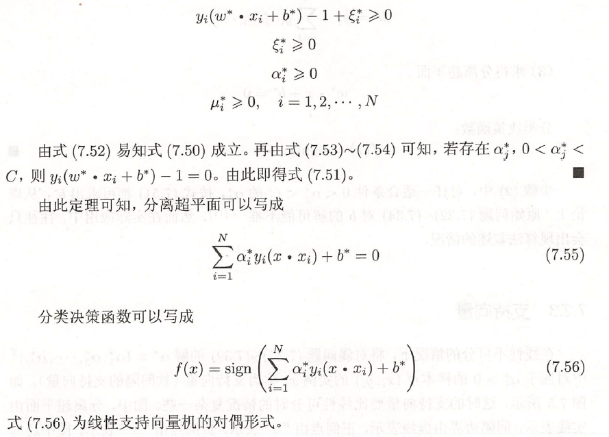
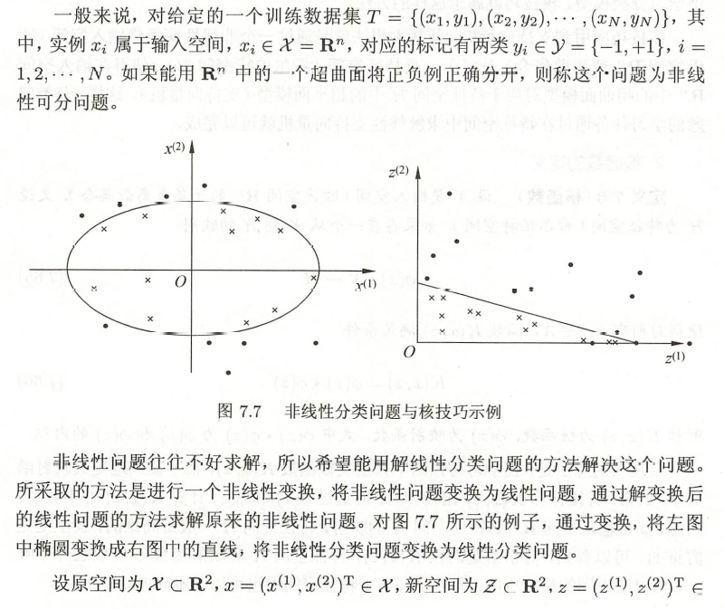
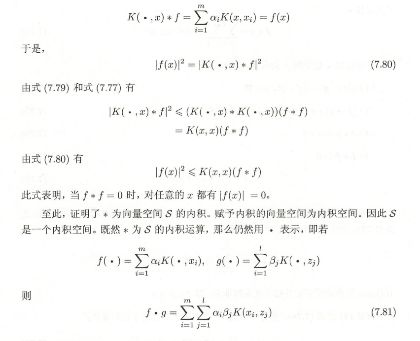
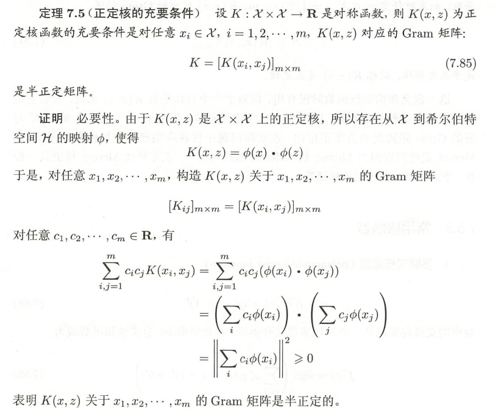

SVM是结构风险最小化，基于最大间隔的思想。

支持向量机(support vector machines, SVM) 是一种二类分类模型。它的基本模型是定义在特征空间上的间隔最大的线性分类器，间隔最大使它有别于感知机；支持向量机还包括核技巧，这使它成为实质上的非线性分类器。支待向量机的学习策略就是间隔最大化，可形式化为一个求解凸二次规划(convex quadratic programming) 的问题，也等价于正则化的合页损失函数的最小化问题。支持向量机的学习算法是求解凸二次规划的最优化算法。

支持向量机学习方法包含构建由简至繁的模型：线性可分支持向量机(linear support vector machine in linearly separable case) 、线性支持向量机(linear support vector machine) 以及非线性支持向量机(non-linear support vector machine) 。简单模型是复杂模型的基础，也是复杂模型的特殊情况。当训练数据线性可分时，通过硬间隔最大化( hard margin maximization) ， 学习一个线性的分类器，即线性可分支支持向量机， 又称为硬间隔支持向量机； 当训练数据近似线性可分时，通过软间隔最大化( soft margin maximization) ，也学习一个线性的分类器，即线性支持向量机，又称为软间隔支持向量机； 当训练数据线性不可分时，通过使用核技巧( kernel trick) 及软间隔最大化， 学习非支持支待向量机。

当输入空间为欧氏空间或离散集合、特征空间为希尔伯特空间时，核函数(kernel function) 表示将输入从输入空间映射到特征空间得到的特征向量之间的内积。通过使用核函数可以学习非线性支持向量机，等价于隐式地在高维的特征空间中学习线性支持向量机。这样的方法称为核技巧。核方法( kernel method ) 是比支持向量机更为一般的机器学习方法。

Cortes 与Vapnik 提出线性支持向量机， Boser 、Guyon 与Vapnik 又引入核技巧，提出非线性支持向量机。

# 线性可分支持向量机与硬间隔最大化

## 线性可分支持向量机

考虑一个二类分类问题。假设输入空间与特征空间为两个不同的空间。输入空间为欧氏空间或离散集合，特征空间为欧氏空间或希尔伯特空间。线性可分支持向量机、线性支持向量机假设这两个空间的元素一一对应，并将输入空间中的输入映射为特征空间中的特征向量。非线性支持向量机利用一个从输入空间到特征空间的非线性映射将输入映射为特征向量。所以，输入都由输入空间转换到特征空间，支持向量机的学习是在特征空间进行的。

当一个数据集中的带有类别{+1, -1}的样本能够被某个线性决策面给完美地分开来的话。则称这个数据集是线性可分的linearly separable。

$y_i (w^T x_i + b) ≥ 0, i=1, ..., m$


一般地，当训练数据集线性可分时， 存在无穷个分离超平面可将两类数据正确分开。感知机利用误分类最小的策略，求得分离超平面，不过这时的解有无穷多个。线性可分支持向量机利用间隔最大化求最优分离超平面，这时，解是唯一的。

定义：


## 函数间隔和几何间隔

函数间隔


函数间隔可以表示分类预测的正确性及确信度，但是选择分离超平面时，只有函数间隔还不够。因为只要等比例地改变w和b，超平面并没有改变，但函数间隔却变为原来的2倍。

可以对分离超平面的法向量w加某些约束，如规范化，||w||=1，使得间隔是确定的，这时函数间隔成为几何间隔。


函数间隔和几何间隔的关系


## 间隔最大化

支持向量机学习的基本想法是求解能够正确划分训练数据集并且几何间隔最大的分离超平面。对线性可分的训练数据集而言，线性可分分离超平面有无穷多个（ 等价于感知机），但是几何间隔最大的分离超平面是唯一的。这里的间隔最大化又称为硬间隔最大化（与将要讨论的训练数据集近似线性可分时的软间隔最大化相对应） 。

间隔最大化的直观解释是：对训练数据集找到几何间隔最大的超平面意味着以充分大的确信度对训练数据进行分类。也就是说，不仅将正负实例点分开，而且对最难分的实例点（离超平面最近的点）也有足够大的确信度将它们分开。这样的超平面应该对未知的新实例有很好的分类预测能力。

### 最大间隔分离超平面


算法


### 最大间隔分离超平面的存在唯一性

线性可分训练数据集的最大间隔分离超平面是存在且唯一的。

定理7.1 （最大间隔分离超平面的存在唯一性） 若训练数据集T 线性可分，则可将训练数据集中的样本点完全正确分开的最大间隔分离超平面存在且唯一。

证明见《统计学习方法》

### 支持向量和间隔边界

在线性可分情况下，训练数据集的样本点中与分离超平面距离最近的样本点的实例称为支持向量。

 

H1和H2平行，并且没有实例点落在它们中间。在H1与H2之间行程一条长带，分离超平面与它们平行且位于它们中央。长带的宽度，即H1与H2之间的距离称为**间隔**(margin)。间隔依赖于分离超平面的法向量w，等于2/||w||。H1和H2称为**间隔边界**。

支持向量Support Vector支撑着两个对应于最大间隔的超平面：

$w^Tx+b=1$

$w^Tx+b=-1$

在决定分离超平面时只有支持向量起作用，而其他实例点并不起作用。如果移动支持向量将改变所求的解；但是如果在间隔边界以外移动其他实例点，甚至去掉这些点，则解是不会改变的。由于支持向量在确定分离超平面中起着决定性作用，所以将这种分类模型称为支持向量机。支持向量的个数一般很少，所以支持向量机由很少的“重要的＂训练样本确定。

## 学习的对偶算法

$min \frac{1}{2} ||w||^2$

$s.t.$    $y_i(w^Tx_i+b)≥1, i=1, ..., m$

有约束，不能用梯度下降法。

凸二次规划(convex quadratic programming)问题，能直接用现成的优化计算包求解

更高效的方法：转化成对偶问题，然后用SMO算法

线性可分条件下支持向量机的对偶算法，这样做的优点在于：一者对偶问题往往更容易求解；二者可以自然的引入核函数，进而推广到非线性分类问题

### 求解过程

原问题是minmax，对偶问题是maxmin


先求L对w, b的极小，求偏导数并令其等于0.


将w,b的值代入拉格朗日函数


再求minL对α的极大


### 算法


### 支持向量


# 线性支持向量机与软间隔最大化

线性可分问题的支持向量机学习方法，对线性不可分训练数据是不适用的，因为这时上述方法中的不等式约束并不能都成立。怎么才能将它扩展到线性不可分问题呢？这就需要修改硬间隔最大化，使其成为软间隔最大化。

## 线性支持向量机


## 软间隔


离群点(Outliers):偏离群体的个别样本点
有可能为噪声，有可能不是
一定程度地考虑离群点

基于软间隔的线性支持向量机

所有样本都必须划分正确，这称为“硬间隔”（hard margin)

允许某些样本不满足约束，这称为“软间隔”（soft margin)


## 学习的对偶算法


### 求解过程






### 算法


### 支持向量


### 合页损失函数


# 非线性支持向量机与核函数

## 核技巧

### 非线性分类问题





### 核函数的定义


### 核技巧在支持向量机中的应用


**SVM核函数**包括线性核函数、多项式核函数、径向基核函数、高斯核函数、幂指数核函数、拉普拉斯核函数、ANOVA核函数、二次有理核函数、多元二次核函数、逆多元二次核函数以及Sigmoid核函数

## 正定核


**1.定义映射，构成向量空间S**


**2.在S上定义内积，使其成为内积空间**




**3.将内积空间S完备化为希尔伯特空间**


**4.正定核的充要条件**




## 常用核函数


## 非线性支持向量分类机


# 序列最小最优化算法

支持向量机学习的实现问题。

支持向量机的学习问题可以形式化为求解凸二次规划问题，这样的凸二次规划问题具有全局最优解，并且有许多最优化算法可以用于这一问题的求解。但是当训练样本容量很大时，这些算法往往变得非常低效，以致无法使用。所以，如何高效地实现支持向量机学习就成为一
个重要的问题。目前人们已提出许多快速实现算法。其中的序列最小最优化(sequential minimal optimization, SMO) 算法1998 年由Platt 提出。


SMO 算法是一种启发式算法， 其基本思路是：如果所有变量的解都满足此最优化问题的KKT 条件(Karush-Kuhn-Tucker conditions) ，那么这个最优化问题的解就得到了。因为KKT 条件是该最优化问题的充分必要条件。否则，选择两个变量，固定其他变量，针对这两个变量构建一个二次规划问题。这个二次规划问题关于这两个变量的解应该更接近原始二次规划问题的解，因为这会使得原始二次规划问题的目标函数值变得更小。重要的是，这时子问题可以通过解析方法求解，这样就可以大大提高整个算法的计算速度。子问题有两个变量，一个是违反KKT 条件最严重的那一个，另一个由约束条件自动确定。如此， SMO 算法将原问题不断分解为子问题并对子问题求解，进而达到求解原问题的目的。


整个SMO 算法包括两个部分：求解两个变量二次规划的解析方法和选择变量的启发式方法。

## 两个变量二次规划的求解方法


## 变量的选择方法


## SMO算法


## 补充


SMO的基本思路是先固定$\alpha_i$ 之外的所有参数，然后求$\alpha_i$ 上的极值。由于存在约束$\sum_{i=1}^n \alpha_i y_i =0$ ，若固定$\alpha_i$ 之外的其他变量，则$\alpha_i$ 可由其他变量导出。于是，SMO每次选择两个变量$\alpha_i$ 和 $\alpha_j$ ，并固定其他参数。这样，在参数初始化后，SMO不断执行如下两个步骤直至收敛：

选取一对需更新的变量$\alpha_i$ 和 $\alpha_j$

固定$\alpha_i$ 和 $\alpha_j$ 以外的参数，求解上式获得更新后的$\alpha_i$ 和$\alpha_j$


# 支持向量机小结

当数据

线性可分时：线性可分支持向量机

接近线性可分时：基于软间隔的线性支持向量机

线性不可分时：核函数（非线性支持向量机）

支持向量机与对率回归的优化目标相近，通常情形下它们的性能也相当.对率回归的优势主要在于其输出具有自然的概率意义，即在给出预测标记的同时也给出了概率，而支持向量机的输出不具有概率意义，欲得到概率输出需进行特殊处理[Platt ， 2000]; 此外，对率回归能直接用于多分类任务，支持向量机为此则需进行推广[Hsu and Li，2002]. 另一方面， hinge 损失有一块"平坦"的零区域，这使得支持向量机的解具有稀疏性，而对率损失是光滑的单调递减函数，不能导出类似支持向量的概念，因此对率回归的解依赖于更多的训练样本， 其预测开销更大.

## 支持向量机与正则化


## 支持向量回归SVR

对样本(x,y)，传统回归模型通常直接基于模型输出f(x) 与真实输出y 之间的差别来计算损失，当且仅当f(x) 与y 完全相同时，损失才为零.与此不同，支持向量回归(Support Vector Regression，简称SVR)假设我们能容忍f(x) 与y 之间最多有$\epsilon$  的偏差，即仅当f(x) 与y 之间的差别绝对值大于$\epsilon$ 时才计算损失..如下图 所示，这相当于以f(x) 为中心，构建了一个宽度为$2\epsilon$  的间隔带，若训练样本落入此间隔带，则认为是被预测正确的.


## 单类支持向量

### 异常检测与单类分类问题

异常检测outlier detection / anomaly detection
即发现一组数据点中和大多数数据不同的数据点。

1. 欺诈检测：比如信用诈骗，电信诈骗，信用卡盗刷等
2. 入侵检测：搞安全的都知道，黑客或者白帽子经常设法攻击一些公司或者个人的服务器或PC机。
3. 生态灾难预警：各种自然灾害，极端天气的预警
4. 公共健康：禽流感等传染类疾病的预警
5. 反垃圾：但凡现在一个app用户有了一定的基数，立马成为各种黑产的目标，各种垃圾广告，垃圾邮件满天飞，让app的运营者不胜其扰，用户体验变的很差。

**非监督异常检测方法**能通过寻找与其他数据最不匹配的实例来检测出未标记测试数据的异常。
**监督式异常检测方法**需要一个已经被标记“正常”与“异常”的数据集，并涉及到训练分类器（与许多其他的统计分类问题的关键区别是异常检测的内在不均衡性）。
**半监督式异常检测方法根据一个给定的正常训练数据集创建一个表示正常行为的模型，然后检测由学习模型生成的测试实例的可能性。[单分类问题]**

### SVDD算法

(Support Vector Data Description)

学习出一个**最小**的超球面（超球面是指3维以上的空间中的球面，对应的2维空间中就是曲线，3维空间中就是球面，3维以上的称为超球面），**把这堆数据尽可能全都包起来**，识别一个新的数据点时，如果这个数据点落在超球面内，就是这个类，否则不是。


ScholkopfB., Platt J., Shawe-Taylor J., SmolaA.J. , and Williamson R.C. 2001. Estimating the support of a high-dimensional distribution. Neural Computation, 13(7): 1443–1471

http://scikit-learn.org/stable/modules/generated/sklearn.svm.OneClassSVM.html

# 实例

**有两个样本点，第一个点为正样本,它的特征向量是(0,-1);第二个点为负样本,它的特征向量是(2,3),从这两个样本点组成的训练集构建一个线性SVM分类器的分类面方程是() **

```
2x+y=4
x+2y=5
x+2y=3
以上都不对
```

SVM分类面即是最大分割平面， 

  求斜率：-1/[(y1-y2)/(x1-x2)]=-1/[(3-(-1))/(2-0)]=-1/2 

  求中点：((x1+x2)/2,(y1+y2)/2)=((0+2)/2, (-1 + 3)/2)=(1, 1) 

  最后表达式：x+2y=3.


首先确定这题出错了，应该是(0,-1)是负样本，(2,3)是正样本，因为必须满足约束条件，（看了好多人解析求斜率过中点求出来的都是碰巧的，之前的答案是C选项此时应该将正负样本颠倒就是这个答案：x+2y=3，但不改的话就是D） 

  于是必须满足： 

  min  1/2(w12+w22) 

  s.t.   -1\*(0\*w1-1*w2+b)>=1 

  1\*(2\*w1+3*w2+b)>=1 

  这样联立方程组可以解出w1=1/5，w2=2/5，b= -3/5，所以就是答案三


