感知机

- 二类分类的线性分类模型
- 输入为实例的特征向量，输出为实例的类别，取+1和-1二值

- 判别模型
- 旨在求出将训练数据进行线性划分的分离超平面，导入基于误分类的损失函数，利用梯度下降法对损失函数进行极小化，求得感知机模型。
- 模型简单而易于实现，分为原始形式和对偶形式
- 1957年由Rosenblatt提出，是神经网络与支持向量机的基础

## 感知机模型

感知机定义

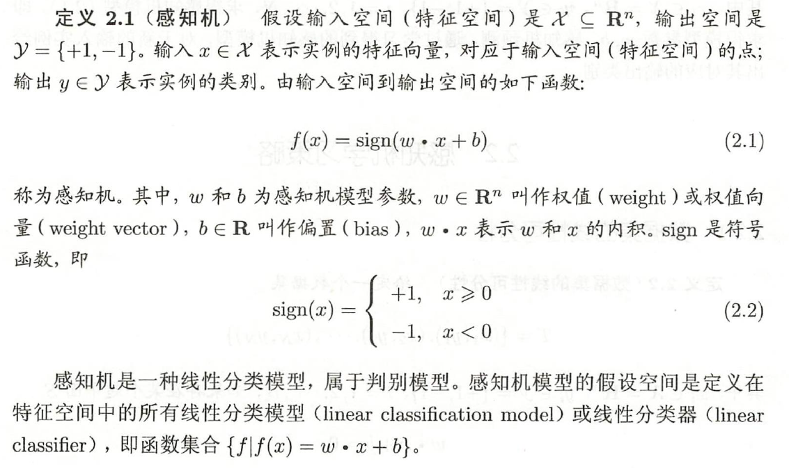

几何解释

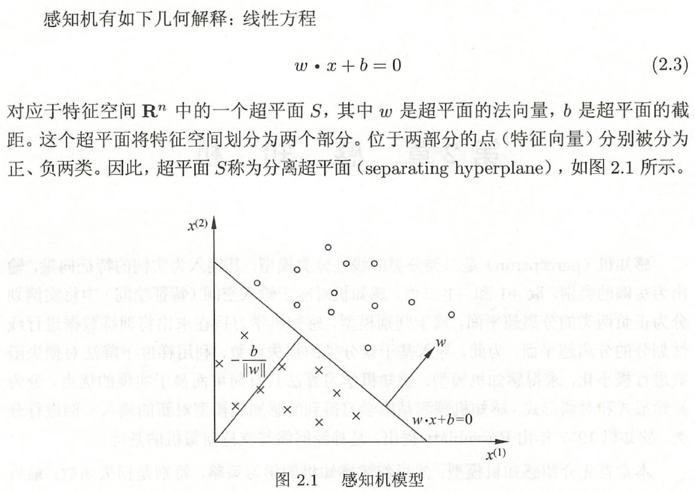

感知机学习和感知机预测

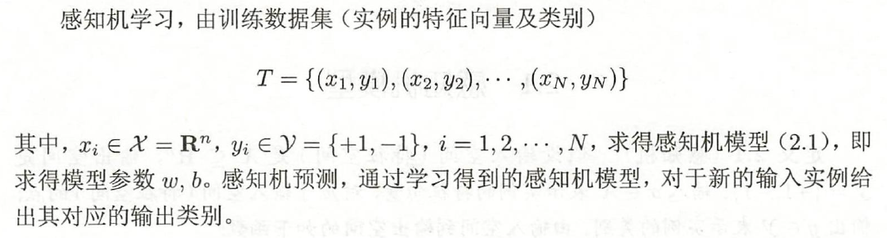

## 感知机学习策略

数据集的线性可分性

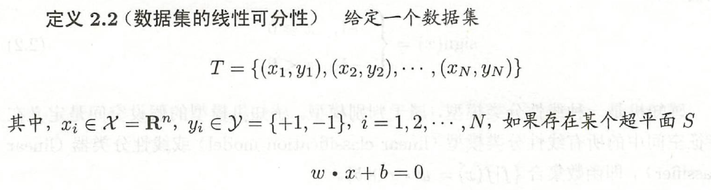

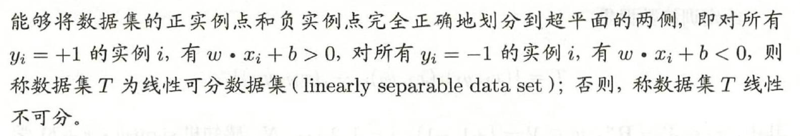

损失函数：误分类点到超平面S的总距离。

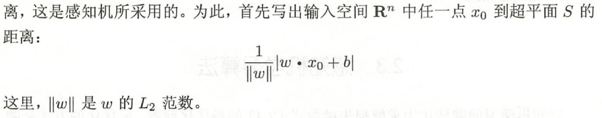

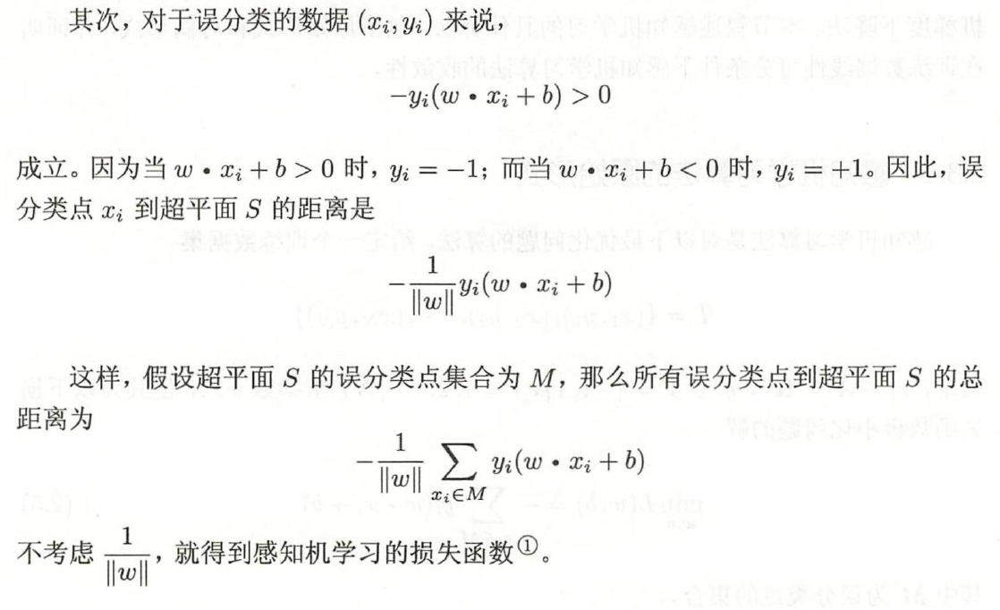

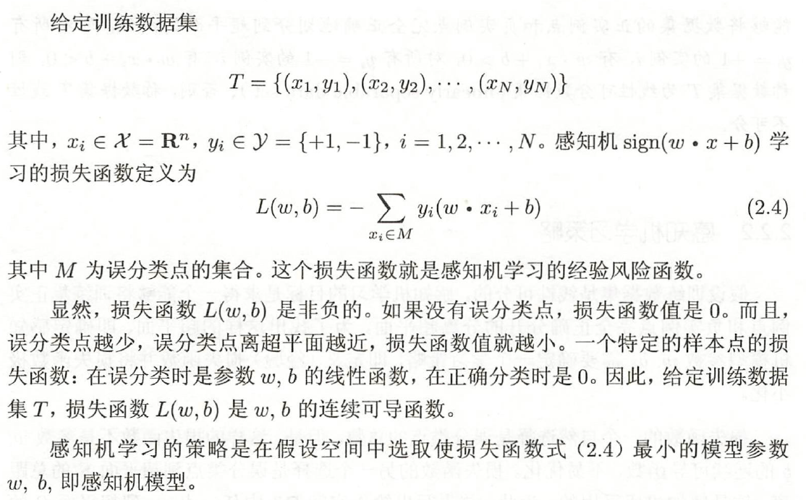

## 感知机学习算法

感知机学习算法是误分类驱动的，具体采用随机梯度下降法。

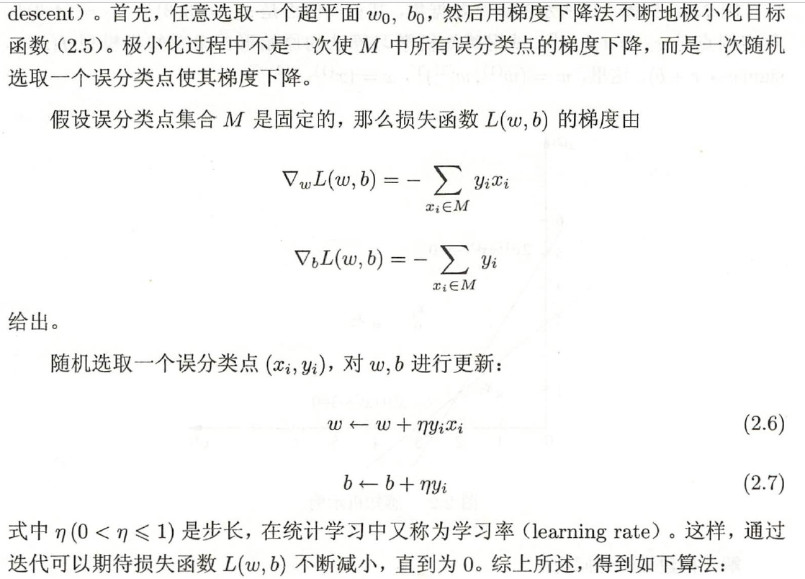

### 原始形式

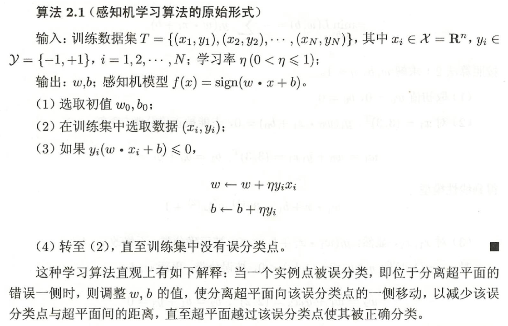

感知机学习算法由于采用不同的初值或选取不同的误分类点，解可以不同。

### 算法的收敛性

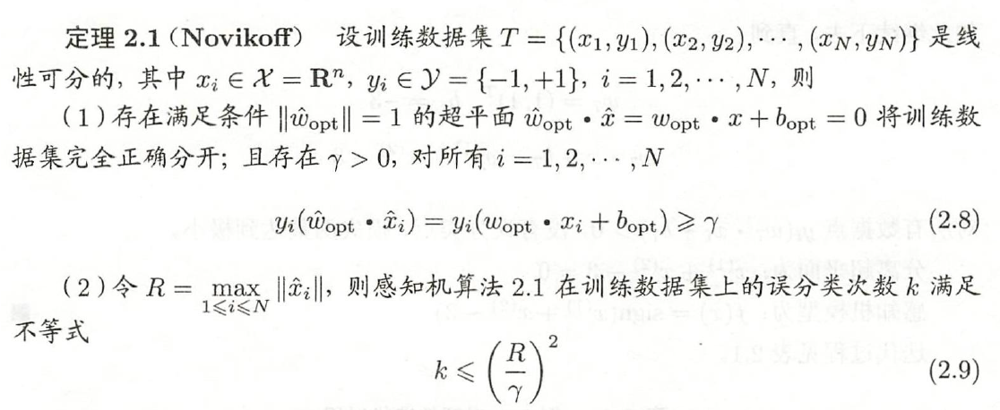

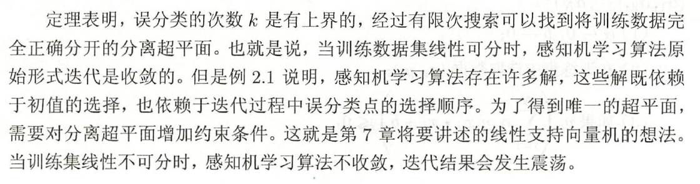

### 对偶形式

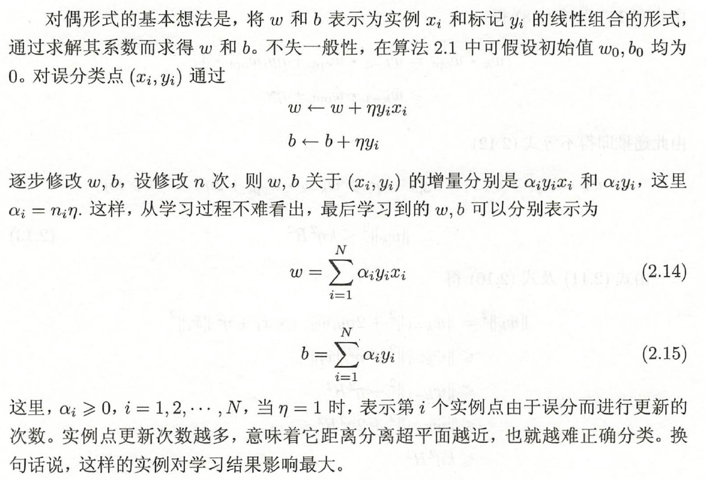

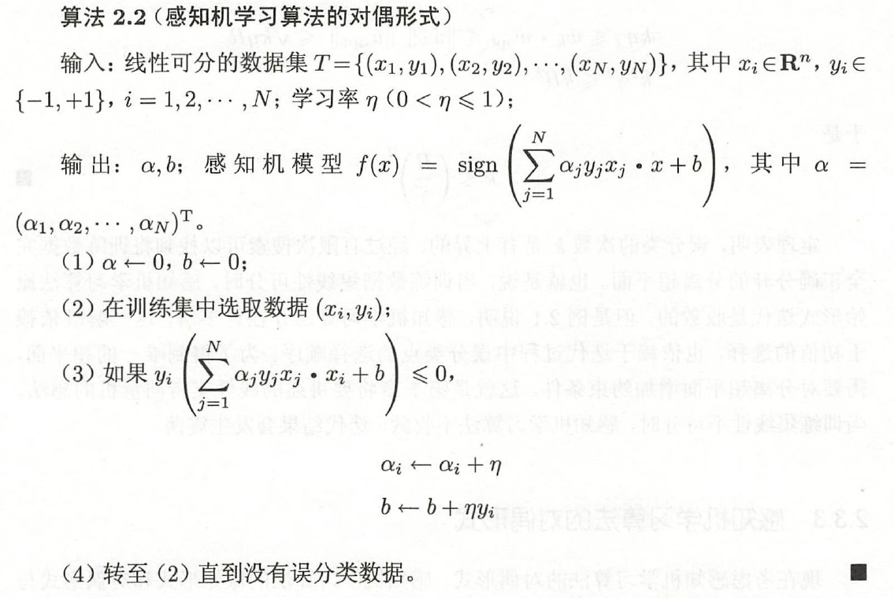

Gram矩阵

对偶形式中训练实例仅以内积的形式出现。为了方便，可以预先将训练集中实例间的内积计算出来并以矩阵的形式存储。这个矩阵就是所谓的Gram矩阵

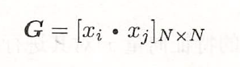

与原始形式一样，感知机学习算法的对偶形式迭代是收敛的，存在多个解。

