是对数线性模型

## 相关定义

**熵**度量了事物的不确定性，越不确定的事物，它的熵就越大。

$$H(X)=-\sum_{i=1}^np_ilogp_i$$

两个变量X和Y的**联合熵**表达式：

$$H(X，Y)=-\sum_{i=1}^np(x_i,y_i)logp(x_i,y_i)$$

**条件熵**的表达式：
$$
\begin{aligned}
H(Y|X)
&=-\sum_{i=1}^np(x_i,y_i)logp(y_i|x_i) \\
&=\sum_{i=1}^np(x_i)H(Y|x_i) \\
&=-\sum_{i=1}^np(x_i)\sum_{j=1}^mp(y_j|x_i)logp(y_j|x_i)
\end{aligned}
$$

条件熵度量了在知道X以后Y的不确定性。

用下面这个图很容易明白他们的关系。左边的椭圆代表H(X),右边的椭圆代表H(Y),中间重合的部分就是我们的互信息或者信息增益I(X,Y), 左边的椭圆去掉重合部分就是H(X|Y),右边的椭圆去掉重合部分就是H(Y|X)。两个椭圆的并就是H(X,Y)。

## 最大熵原理

最大熵原理是概率模型学习的一个准则。最大熵原理认为，学习概率模型时， 在所有可能的概率模型（分布）中，熵最大的模型是最好的模型。通常用约束条件来确定概率模型的集合，所以，最大熵原理也可以表述为在满足约束条件的模型集合中选取熵最大的模型。

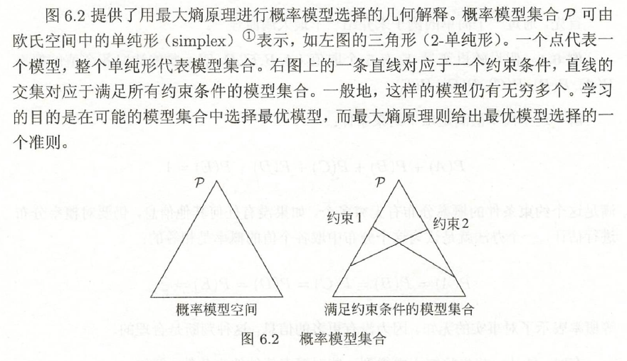

单纯形是在n维欧式空间中的n+1个放射无关的点的集合的凸包。

## 最大熵模型的定义

最大熵原理是统计学习的一般原理，将它应用到分类得到最大熵模型。

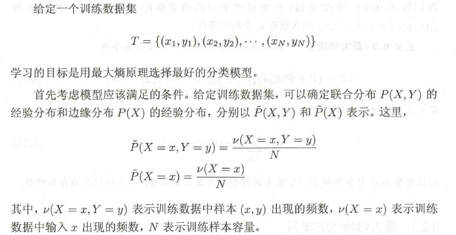

**特征函数**

上式就是最大熵模型学习的约束条件，假如我们有M个特征函数fi(x,y)(i=1,2...,M)，就有M个约束条件。可以理解为我们如果训练集里有m个样本，就有和这m个样本对应的M个约束条件。

**最大熵模型的定义**

模型集合中条件熵最大的模型称为最大熵模型。式中的对数为自然对数。

## 最大熵模型的学习

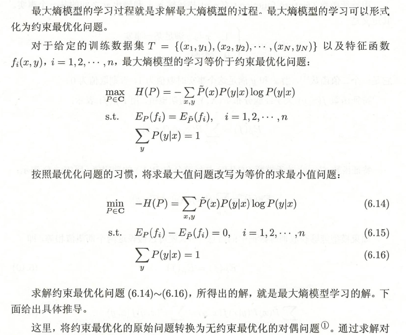

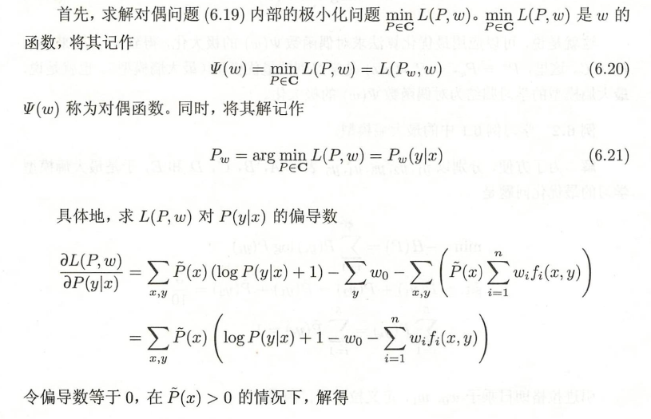

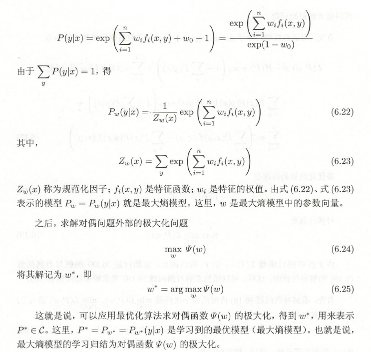

## 极大似然估计

最大熵模型是由(6.22), (6.23)表示的条件概率分布。

证明对偶函数的极大化等价于最大熵模型的极大似然估计。

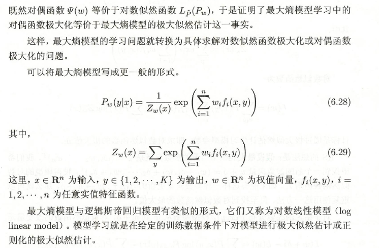

## 与逻辑回归的关系

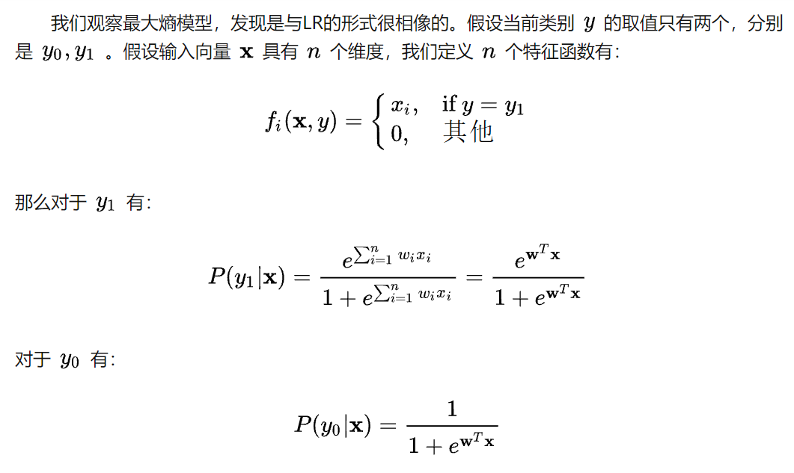

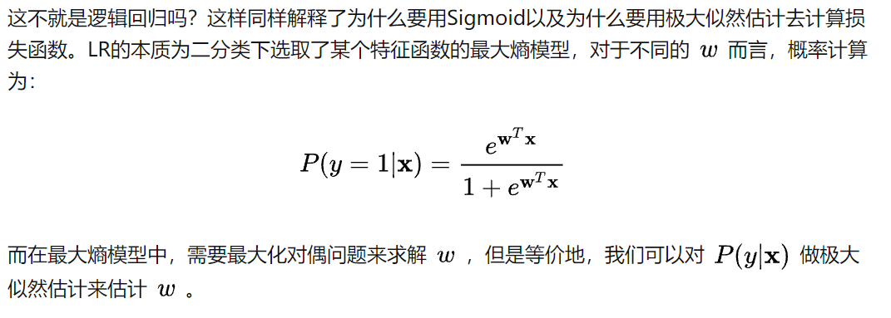

## 模型学习的最优化算法

逻辑斯谛回归模型、最大熵模型学习归结为以似然函数为目标函数的最优化问题，通常通过迭代算法求解。从最优化的观点看，这时的目标函数具有很好的性质。它是光滑的凸函数，因此多种最优化的方法都适用，保证能找到全局最优解。常用的方法有改进的迭代尺度法、梯度下降法、牛顿法或拟牛顿法。牛顿法或拟牛顿法一般收敛速度更快。

### 改进的迭代尺度法

改进的迭代尺度法(improved iterative scaling, IIS) 是一种最大熵模型学习的最优化算法。

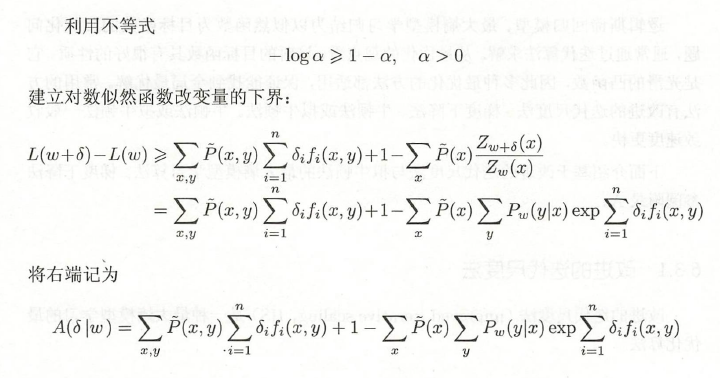

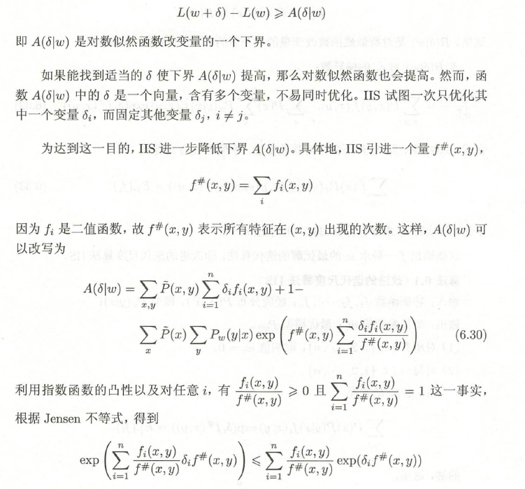

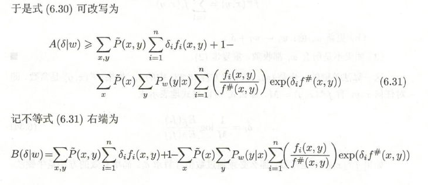

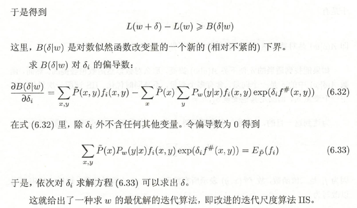

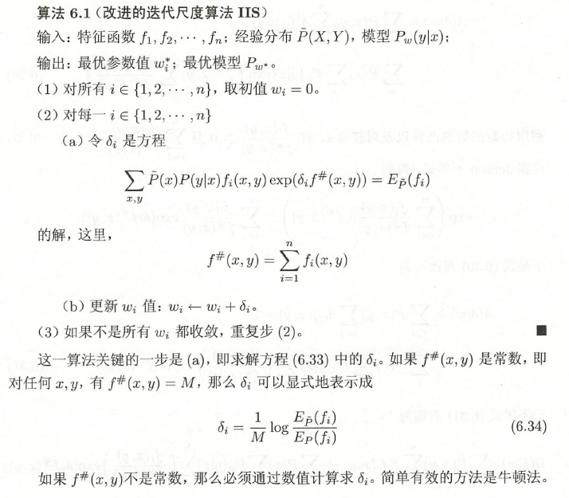

### 拟牛顿法

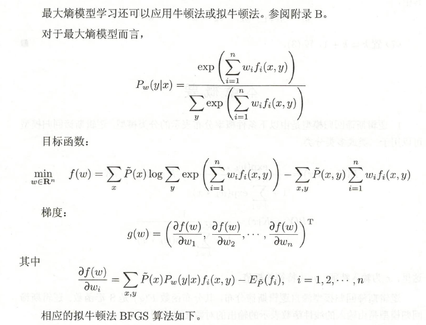

## 优缺点

最大熵模型的优点有：

a) 最大熵统计模型获得的是所有满足约束条件的模型中信息熵极大的模型,作为经典的分类模型时准确率较高。

b) 可以灵活地设置约束条件，通过约束条件的多少可以调节模型对未知数据的适应度和对已知数据的拟合程度

最大熵模型的缺点有：

a) 由于约束函数数量和样本数目有关系，导致迭代过程计算量巨大，实际应用比较难。

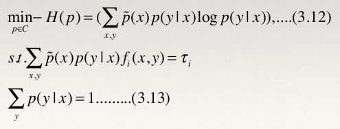

## 参考资料

[最大熵模型原理小结](https://www.cnblogs.com/pinard/p/6093948.html)

[深入机器学习系列21-最大熵模型](https://zhuanlan.zhihu.com/p/29978153)

[《统计学习方法》最大熵模型推导注解](https://zhuanlan.zhihu.com/p/59519202)

