# 线性回归

决策函数：$f(x) = w_1x_1 + w_2 x_2 + ... + w_d x_d + b = w^T x + b$

线性模型形式简单、易于建模，但却蕴涵着机器学习中一些重要的基本思想。许多功能更为强大的非线性模型可在线性模型的基础上通过引入层级结构或高维映射而得。此外，由于w直观表达了各属性在预测中的重要性，因此线性模型有更好的可解释性。例如影响目标的因素有哪些，哪个因素最重要等。

考虑单调可微函数g(.)，令 $y=g^{-1}(w^Tx+b)$，这样的模型称为"广义线性模型"，其中函数g称为"联系函数"(link function).对数线性回归是广义线性模型在g(.)=ln(.)时的特例。

损失函数：squared error  $ err(\hat{y}, y) = (\hat{y}, y)^2 $

### **损失函数的推导**-极大似然

$y^{(i)}=\theta^Tx^{(i)}+\epsilon^{(i)}$

误差$\epsilon^{(i)}$是独立同分布的，通常认为服从均值为0方差为$\sigma^2$的高斯分布(可以通过平移得到均值为0)

之所以独立同分布，可以理解为不同样本之间是独立的，希望决策函数对每个样本拟合的误差服从同一个分布。


### **最小化损失函数（参数学习/假设搜索）**

均方误差，对应了常用的欧几里得距离。基于均方误差最小化来进行模型求解的方法称为"最小二乘法"。

$$   (w^*,b^*) = \mathop{\arg\min}_{(w,b)} \sum\limits_{i=1}^{m}(f(x_i)-y_i)^2=arg min_{(w,b)} \sum\limits_{i=1}^{m}(y_i-wx_i-b)^2 $$

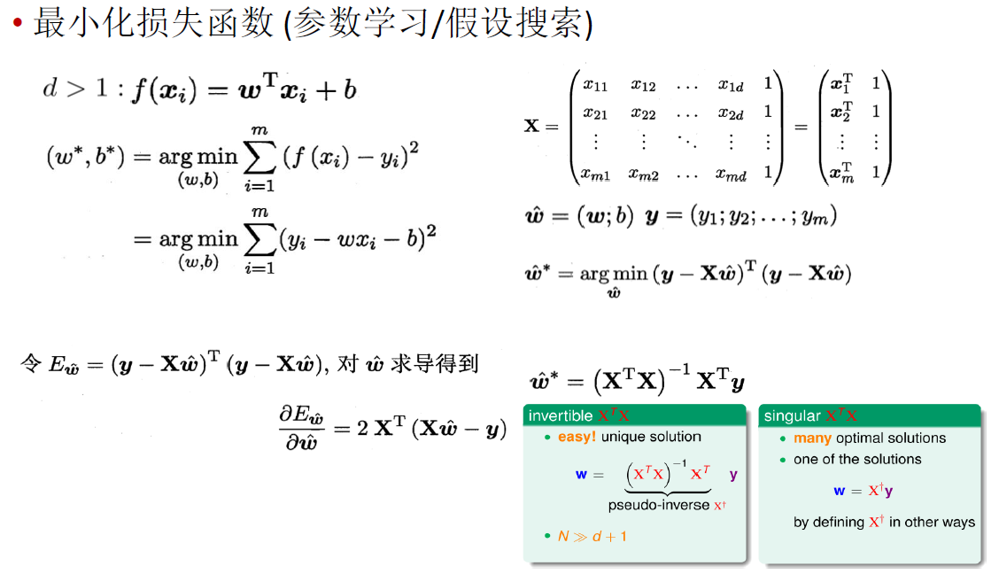

矩阵为满秩矩阵或正定矩阵时，可逆；不可逆时，存在多个解，选择哪个由学习算法的归纳偏好决定，常见的做法是引入正则化项。

### **基于梯度下降的参数学习/假设搜索**

梯度下降法：求解无约束优化问题最简单、最经典的方法之一

当目标函数为凸函数时，局部极小点对应着函数的全局最小点，此时梯度下降法可确保收敛到全局最优解


考虑无约束优化问题$min_x f(x)$, 其中f(x)为连续可微函数

若能构造一个序列$x^0, x^1, x^2,...满足f(x^{t+1}) < f(x^t), t=0,1,2,...$

则不断执行该过程即可收敛到局部极小点

根据泰勒展开式有$f(x+\Delta x) ~= f(x) + \Delta x^T \nabla f(x) $

于是，欲满足$f(x+\Delta x) < f(x)$，可选择 $ \Delta x = -\gamma\nabla f(x)$

其中步长$\gamma$ 是一个小常数。这就是梯度下降法


为了找到一个函数的局部极小值，于是让x朝着当前点对应梯度（或者是近似梯度）的反方向行走一定的距离进行迭代搜索

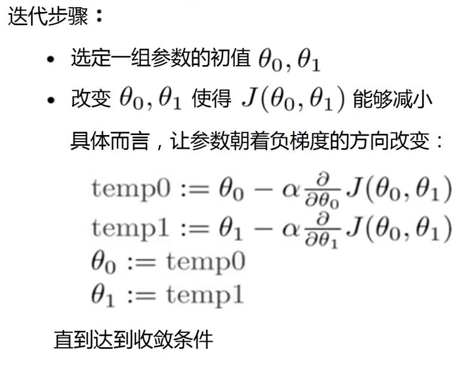

批量梯度下降，随机梯度下降，小批量梯度下降


迭代终止：
定义一个合理的阈值，当两次迭代之间的差值小于该阈值时，迭代结束;
设置一个大概的迭代步数;
设置函数阈值；

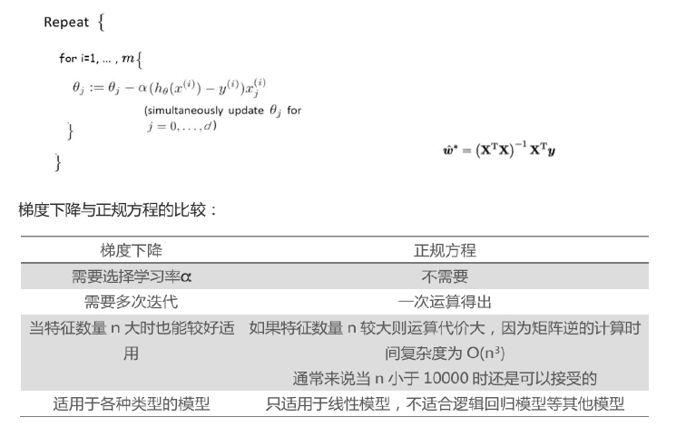


# 其他问题(从线性到非线性、从二分类到多分类、类别不平衡)

### 从线性到非线性

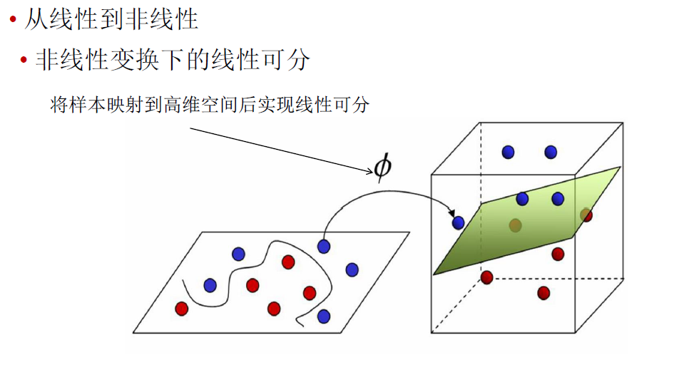 

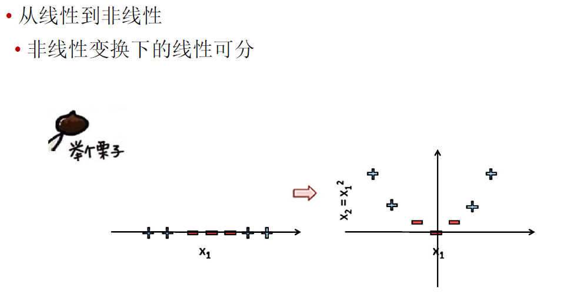 

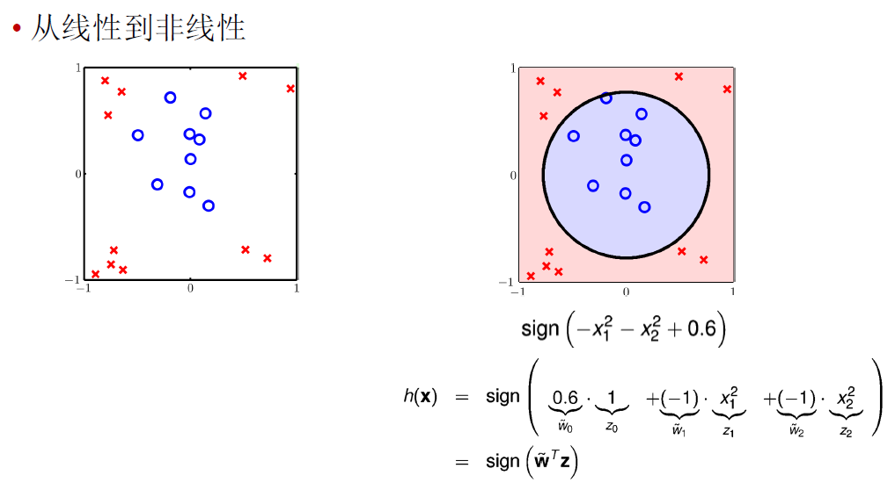 

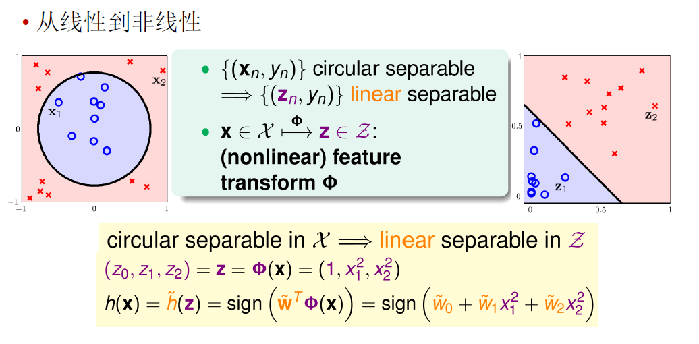 

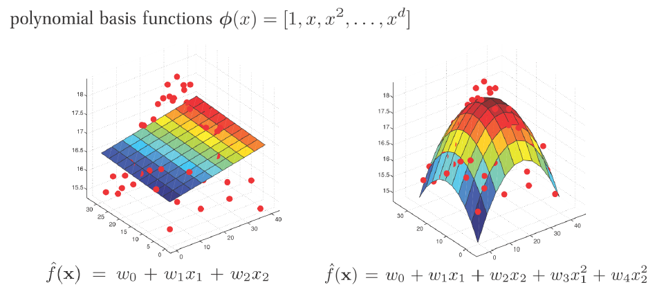

### 从二分类到多分类 

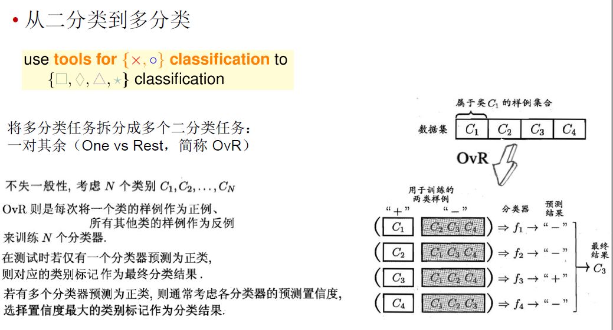 

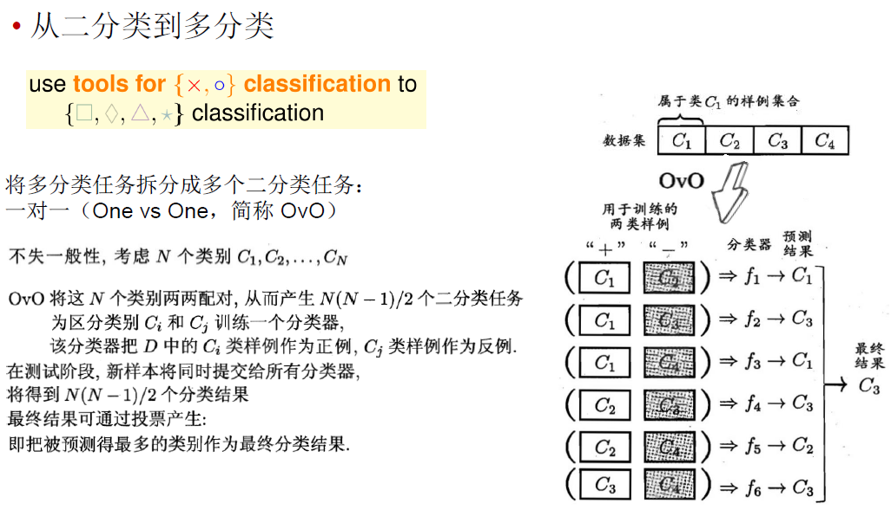 

# 参数调节

本质就是模型选择：不同的参数对应不同的模型

如何构建候选模型（参数）集合：
将各参数变量值的可行区间（可从小到大），划分为一系列的小区
产生对应各参数变量值组合
计算各参数组合下的模型的性能
逐一比较择优，从而求得最佳参数组合。

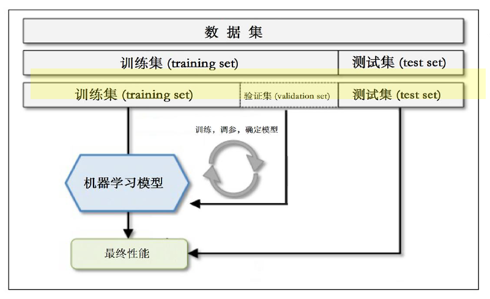 

# ==线性分类器==

**以下()属于线性分类器最佳准则?**

```
感知准则函数
贝叶斯分类
支持向量机
Fisher准则
```

ACD，[赵子龙](https://www.nowcoder.com/profile/730218)

线性分类器有三大类：感知器准则函数、SVM、Fisher准则，而贝叶斯分类器不是线性分类器。

感知器准则函数：代价函数J=-(W*X+w0)，分类的准则是最小化代价函数。感知器是神经网络（NN）的基础，网上有很多介绍。

SVM：支持向量机也是很经典的算法，优化目标是最大化间隔（margin），又称最大间隔分类器，是一种典型的线性分类器。（使用核函数可解决非线性问题）

Fisher准则：更广泛的称呼是线性判别分析（LDA），将所有样本投影到一条远点出发的直线，使得同类样本距离尽可能小，不同类样本距离尽可能大，具体为最大化“广义瑞利商”。

贝叶斯分类器：一种基于统计方法的分类器，要求先了解样本的分布特点（高斯、指数等），所以使用起来限制很多。在满足一些特定条件下，其优化目标与线性分类器有相同结构（同方差高斯分布等），其余条件下不是线性分类。

参考：http://blog.163.com/rustle_go_go/blog/static/20294501420122110431306/