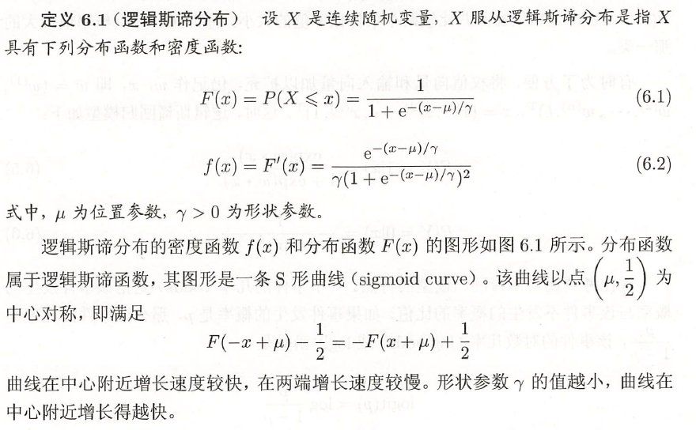
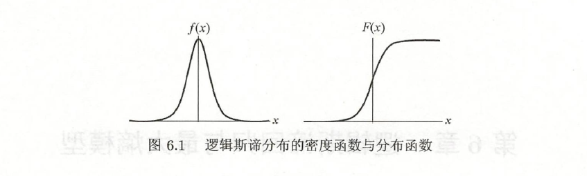
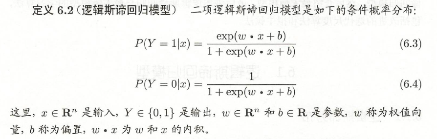
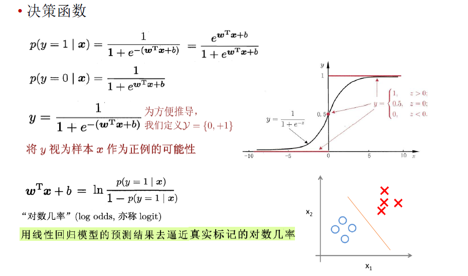
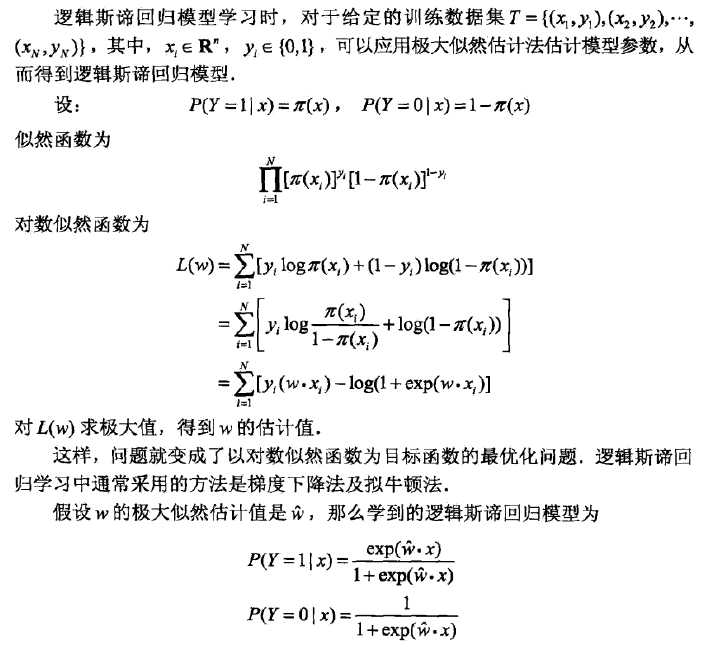
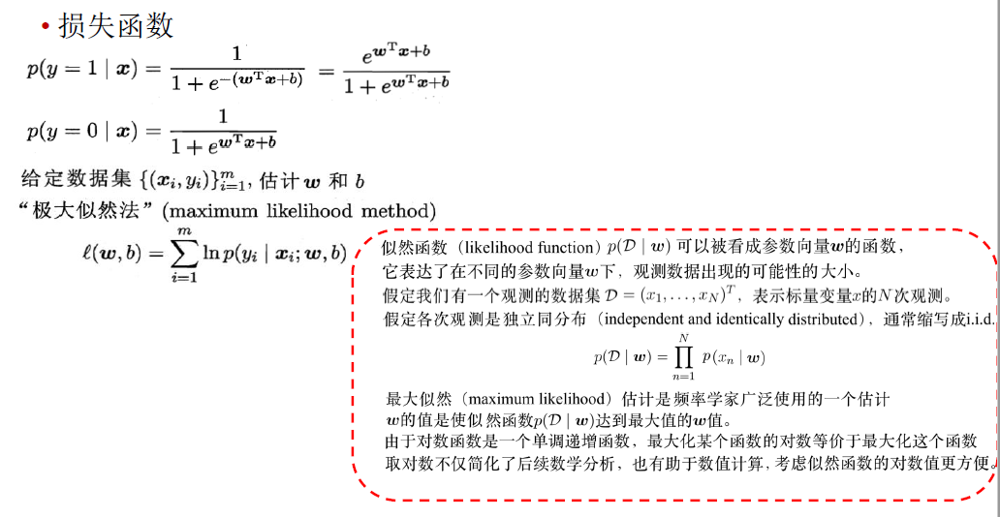
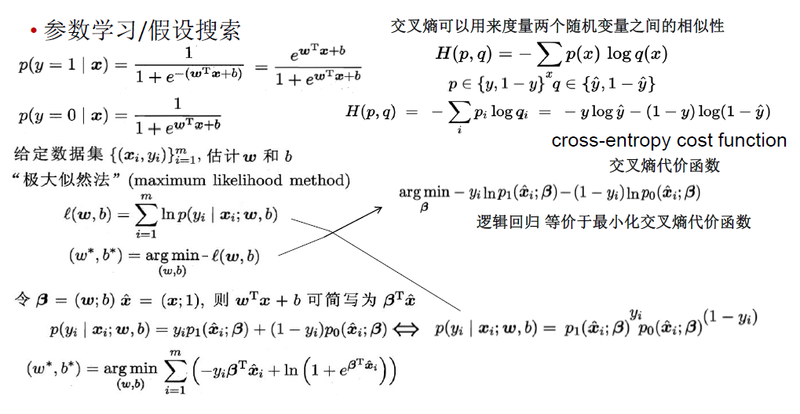
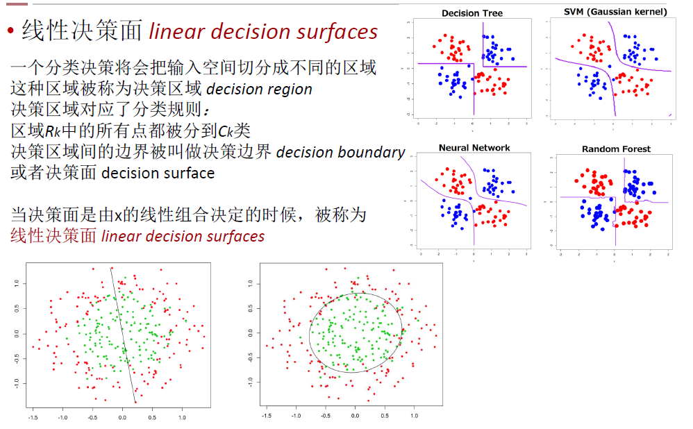
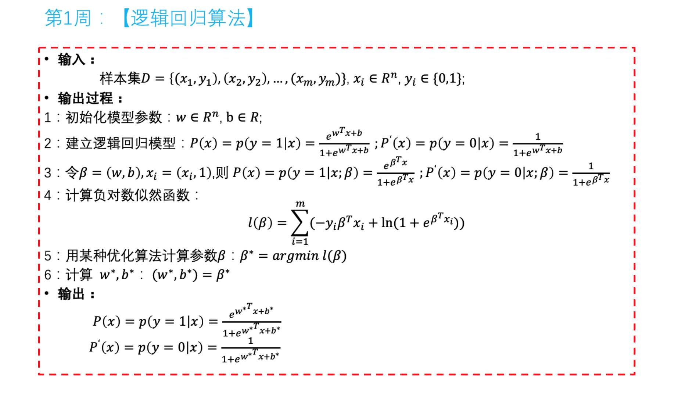
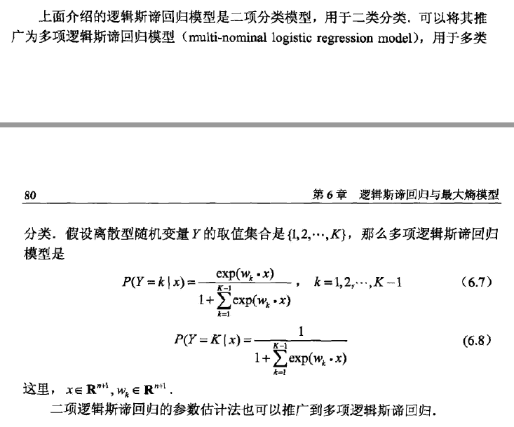

## 逻辑斯谛分布

## 逻辑回归

如何使用线性模型进行回归学习？只需找一个单调可微函数将分类任务的真实标记y与线性回归模型的预测值联系起来。

g'(x)=g(x)(1-g(x))

二项逻辑斯蒂回归模型是条件概率分布（图中p(y=1|x)和p(y=0|x)的公式）。逻辑斯蒂回归比较两个条件概率值得大小，将实例x分配到概率值较大的那一类。

## 逻辑斯蒂回归模型的特点

**一个事件的几率（odds）**是指该事件发生的概率与该事件不发生的概率的比值。如果事件发生的概率是p，那么该事件的几率是p/(1-p)，该事件的对数几率（log odds）或logit函数是

$logit(p)=log\frac{p}{1-p}$

对逻辑斯蒂回归而言，代入p(y=1|x)和p(y=0|x)的公式可以得到

$log\frac{P(Y=1|x)}{(1-P(Y=1|x))}=w^Tx$

输出Y=1的对数几率是输入x的线性函数。或者说，输出Y=1的对数几率是由输入x的线性函数表示的模型，即逻辑斯蒂回归模型。

换个角度看，考虑对输入x进行分类的线性函数$w^Tx$，其值域为实数域。通过逻辑斯蒂回归模型的定义式可以将线性函数转换为概率

$P(Y=1|x)=\frac{exp(w^Tx)}{1+exp(w^Tx)}$

这时，线性函数的值越接近正无穷，概率值就越接近1；线性函数的值越接近负无穷，概率值就越接近0.这样的模型就是逻辑斯蒂回归模型。

## 模型参数估计

补充：

 

 

## 多项逻辑斯蒂回归模型

## 优点

对数几率回归方法的优点：

1. 它是直接对分类可能性进行建模，无需实现假设数据分布，这样就避免了假设分布不准确所带来的问题；
2. 它不是仅预测出“类别”，而是可得到近似概率预测，这对许多需利用概率辅助决策的任务很有用；
3. 对数函数是任意阶可导的凸函数，有很好的数学性质，现有的许多数值优化算法都可直接用于求取最优解。

## **连续特征如何离散化，为什么要离散化**

连续特征的离散化：在什么情况下将连续的特征离散化之后可以获得更好的效果？

Q:CTR预估，发现CTR预估一般都是用LR，而且特征都是离散的。为什么一定要用离散特征呢？这样做的好处在哪里？

A:

在工业界，很少直接将连续值作为逻辑回归模型的特征输入，而是将连续特征离散化为一系列0、1特征交给逻辑回归模型，这样做的优势有以下几点：

0、 离散特征的增加和减少都很容易，易于模型的快速迭代。(离散特征的增加和减少，模型也不需要调整，重新训练是必须的，相比贝叶斯推断方法或者树模型方法迭代快)

1、稀疏向量内积乘法运算速度快，计算结果方便存储，容易扩展；

2、离散化后的特征对异常数据有很强的鲁棒性：比如一个特征是年龄>30是1，否则0。如果特征没有离散化，一个异常数据“年龄300岁”会给模型造成很大的干扰；离散化后年龄300岁也只对应于一个权重，如果训练数据中没有出现特征"年龄-300岁"，那么在LR模型中，其权重对应于0，所以，即使测试数据中出现特征"年龄-300岁",也不会对预测结果产生影响。特征离散化的过程，比如特征A，如果当做连续特征使用，在LR模型中，A会对应一个权重w,如果离散化，那么A就拓展为特征A-1，A-2，A-3...,每个特征对应于一个权重，如果训练样本中没有出现特征A-4，那么训练的模型对于A-4就没有权重，如果测试样本中出现特征A-4,该特征A-4也不会起作用。相当于无效。但是，如果使用连续特征，在LR模型中，y = w\*a,a是特征，w是a对应的权重,比如a代表年龄，那么a的取值范围是[0..100]，如果测试样本中,出现了一个测试用例，a的取值是300，显然a是异常值，但是w*a还是有值，而且值还非常大，所以，异常值会对最后结果产生非常大的影响。

3、逻辑回归属于广义线性模型，表达能力受限；单变量离散化为N个后，每个变量有单独的权重，相当于为模型引入了非线性，能够提升模型表达能力，加大拟合；在LR模型中，特征A作为连续特征对应的权重是Wa。A是线性特征，因为y = Wa\*A, y对于A的导数就是Wa, 如果离散化后，A按区间离散化为A_1,A_2,A_3。那么$y = w_1*A_1+w_2*A_2+w_3*A_3$.那么y对于A的函数就相当于分段的线性函数，y对于A的导数也随A的取值变动，所以，相当于引入了非线性。

4、 离散化后可以进行特征交叉，假如特征A 离散化为M个值，特征B离散为N个值，那么交叉之后会有M*N个变量，进一步引入非线性，提升表达能力；

5、特征离散化后，模型会更稳定，比如如果对用户年龄离散化，20-30作为一个区间，不会因为一个用户年龄长了一岁就变成一个完全不同的人。当然处于区间相邻处的样本会刚好相反，所以怎么划分区间是门学问；按区间离散化，划分区间是非常关键的。

6、特征离散化以后，起到了简化了逻辑回归模型的作用，降低了模型过拟合的风险。(当使用连续特征时，一个特征对应于一个权重，那么，如果这个特征权重较大，模型就会很依赖于这个特征，这个特征的一个微小变化可能会导致最终结果产生很大的变化，这样子的模型很危险，当遇到新样本的时候很可能因为对这个特征过分敏感而得到错误的分类结果，也就是泛化能力差，容易过拟合。而使用离散特征的时候，一个特征变成了多个，权重也变为多个，那么之前连续特征对模型的影响力就被分散弱化了，从而降低了过拟合的风险。)

7、 可以将缺失作为独立的一类带入模型；

8、将所有的变量变换到相似的尺度上。

李沐曾经说过：模型是使用离散特征还是连续特征，其实是一个“海量离散特征+简单模型” 同 “少量连续特征+复杂模型”的权衡。既可以离散化用线性模型，也可以用连续特征加深度学习。就看是喜欢折腾特征还是折腾模型了。通常来说，前者容易，而且可以n个人一起并行做，有成功经验；后者目前看很赞，能走多远还须拭目以待。

## 参考资料

[机器学习中，有哪些特征选择的工程方法？](http://www.zhihu.com/question/28641663/answer/41653367)

[【机器学习】逻辑回归（LR）与最大熵模型](https://mp.weixin.qq.com/s/6Z88hodFlqJQLYsRpgxA_w)（苏学算法的文章，讲了线性回归和逻辑回归，以及他们之间的关系，以及一些数学推导）
