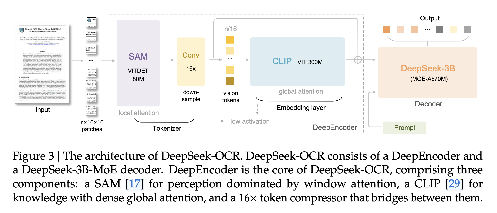
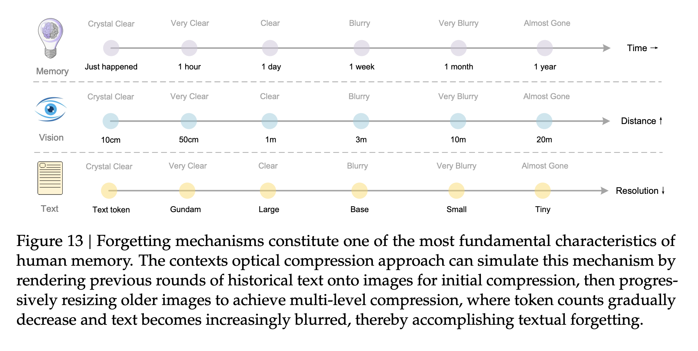

## 论文基本信息

标题：DeepSeek-OCR: Contexts Optical Compression

作者：（DeepSeek-AI）Haoran Wei, Yaofeng Sun, Yukun Li

链接：https://github.com/deepseek-ai/DeepSeek-OCR/blob/main/DeepSeek_OCR_paper.pdf

代码和模型：http://github.com/deepseek-ai/DeepSeek-OCR

框架图：

## 核心亮点

这篇论文提出了一个全新的概念：**用视觉模态做“上下文压缩”**。

也就是说：

- 把长文本渲染成一张图；
    
- 图像中的信息密度更高；
    
- 模型只需处理少量「视觉 token」；
    
- 最后再通过解码器还原成文字。
    

结果惊人：

> 一页 1000 个文本 token 的文档，只需 **100 个视觉 token** 就能还原出 **97% 的准确率**。

压缩率达到 **10×** 以上，  
意味着相同算力下，模型可以处理 **十倍更长的上下文**。

## DeepSeek-OCR 的结构

整个系统由两部分组成：
- **DeepEncoder（视觉压缩编码器）**
    
- **DeepSeek-3B-MoE 解码器**

信息流：  
📄 图片（文档）→ DeepEncoder 压缩 → 少量视觉 token → 解码器恢复 → 输出文本。

### 🧠 1. DeepEncoder —— 视觉压缩引擎

- 输入图片，输出少量视觉 token
    
- 混合了 **SAM-base（局部感知）** + **CLIP-large（全局理解）**
    
- 中间通过一个 **16× 卷积压缩模块**
    
- 能把 1024×1024 图像（4096 patch）→ 压缩到仅 256 token
    

支持多种模式：

|模式|分辨率|视觉 token 数|
|---|---|---|
|Tiny|512×512|64|
|Small|640×640|100|
|Base|1024×1024|256|
|Large|1280×1280|400|
|Gundam|动态多视图拼接|800 左右|

### 💬 2. DeepSeek-3B-MoE 解码器

- 采用 DeepSeek 自家的 Mixture-of-Experts 架构
    
- 推理时只激活 570M 参数
    
- 性能≈3B 模型，速度≈500M 模型
    

## 训练与数据引擎

DeepSeek-OCR 的数据量非常可观：

| 数据类型    | 内容                          |
| ------- | --------------------------- |
| OCR 1.0 | 文档、场景文字识别                   |
| OCR 2.0 | 图表、化学式、几何图                  |
| 通用视觉任务  | caption/detection/grounding |
| 纯文本数据   | 语言建模能力                      |

共计数千万级图文对，覆盖约 100 种语言。

训练过程

- 先训练 DeepEncoder（单独阶段），使用上述所有OCR 1.0和2.0数据，以及从LAION数据集中采样的100M通用数据
    
- 再联合训练 DeepSeek-OCR，使用70%的OCR数据，20%的通用视觉数据，10%的纯文本数据。
    使用 **DeepSeek-3B-MoE** 解码器（570M 激活参数），可获得 3B 模型表达能力 + 小模型推理速度。

## 实验结果

### 🔹 Vision-Text 压缩测试（Fox benchmark）

|压缩率|准确率|
|---|---|
|6–10×|≈97%|
|10–12×|≈90%|
|20×|≈60%|

> 在 10× 压缩下几乎“无损”，说明视觉压缩真的可行。

### 🔹 实际 OCR 性能（OmniDocBench）

| 模型                        | Vision Tokens   | 性能           |
| ------------------------- | --------------- | ------------ |
| GOT-OCR2.0                | 256             | 弱            |
| MinerU2.0                 | 6790            | 强            |
| **DeepSeek-OCR (Base)**   | **256 (182有效)** | 与 SOTA 持平    |
| **DeepSeek-OCR (Gundam)** | **795**         | 超越 MinerU2.0 |

也就是说，DeepSeek-OCR 仅用 **1/10 token 数**，达到甚至超越最强 OCR 模型。

## 能力拓展：不只是 OCR

DeepSeek-OCR 还能：

- 解析 **图表 → HTML 表格**
    
- 识别 **化学式 → SMILES**
    
- 理解 **几何图形结构**
    
- 支持 **多语言文档识别（≈100 种语言）**
    
- 甚至能做 **图像描述 / 检测 / 定位**
    

它本质上是一个具备通用视觉理解接口的“文档大模型”。

## 人类式的“遗忘机制”

论文最后提出一个很有趣的想法：

> 视觉压缩不仅可以节省算力，还可以模拟人类“记忆遗忘”。

方法：
- 将历史上下文渲染成图像；
    
- 随时间推移逐步降采样（图像模糊）；
    
- 越旧的上下文 → 压缩越多 → 模糊越大；
    
- 模拟记忆淡化的自然过程。

这就是所谓的 **optical forgetting** ——  视觉化的记忆遗忘机制。

## 总结

**DeepSeek-OCR 的核心贡献：**

1. 提出“视觉上下文压缩”新范式；
    
2. 设计高效视觉编码器 DeepEncoder；
    
3. 实现 10–20× 压缩率；
    
4. 在 OCR 基准上超越所有开源模型；
    
5. 为 LLM 的长期记忆提供了可行的物理路径。
    

这不只是一个 OCR 模型，更是一个**面向未来的大模型基础设施方向**——  
让模型“看”文字，而不是只“读”文字。

## 参考资料
