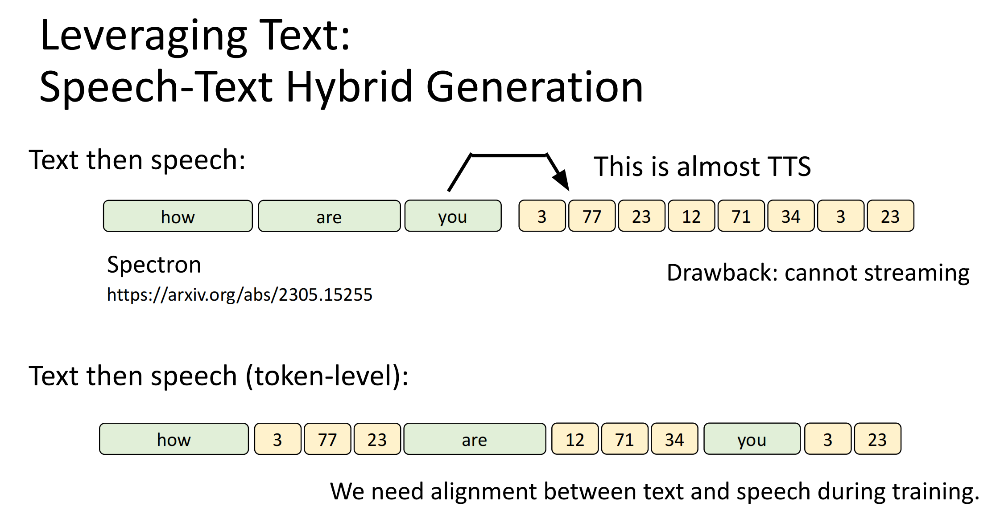

# 语音语言模型介绍

语音语言模型支持输入/输出文本和语音，和语言模型不同的是，它还需要识别说话人，说话人的情绪，该段语音所在的环境等，所以相比语言模型来说，它的挑战要更大一些。

这样语音语言模型的例子有：
• ChatGPT voice mode
• Gemini Live
• Moshi
	• https://arxiv.org/abs/2410.00037
• GLM-4-Voice
	• https://arxiv.org/abs/2412.02612
• Step-Audio
	• https://arxiv.org/abs/2502.11946
• Qwen2.5-Omni
	• https://arxiv.org/abs/2503.20215
• Kimi-Audio
	• https://arxiv.org/abs/2504.18425
• SpeechGPT
	• https://github.com/OpenMOSS/SpeechGPT-2.0-preview
• Sesame
	• https://www.sesame.com/research/crossing_the_uncanny_valley_of_voice

李宏毅老师觉得说Sesame是最流畅的语音语言模型。

这堂课主要讲语音/声音是如何产生出来的。

和语言模型类似，语音模型也是输入Token，输出Token，将输入的声音经过tokenization得到speech token，输出的token经过detokenization得到人类可听懂的声音。

语音模型的训练也是像语言模型一样，第一步是经过大量的无监督语音数据的预训练，第二步是SFT，将人类标注的语音数据拿来训练，之后还可以做RLHF。

# 语音生成的基本单位-Speech Token

语音生成的基本单位是什么？(Speech Token)

对于文本来说，可以很自然地将文本分割成多个单词，长的单词可以再进行细分，这样就得到了文本的token sequence。

声音怎么表示成token sequence呢？

有一个极端的方法是，因为声音最基础的内容还是文字，所以可以将输入的声音转成文本（ASR），对文本进行分词得到token序列；输出文字之后，再经过一个文字转声音的模型（TTS）转成声音。实际上这里面的"Speech LLM"就是"Text LLM"了。那么我们无需训练Speech LLM了吗？

虽然但是，这里面存在一些问题，这个过程会忽略很多语音中重要的信息，比如无法识别不同语气的文字。

由于声音是一个一个的取样点，我们可以把这些取样点全部输入模型，这样就不会损失信息了。但是为了表示完整的声音，每秒钟至少有8000个取样点，就是8000个token，一个1分钟的声音就对应着50万token，这个输入sequence太长了，是不切实际的。

那么就需要做取舍了，我们希望尽量保留声音的信息，同时对其做压缩，使得输入的sequence不要太长。

怎么把语音变成token，打造语音的tokenization，是目前语音领域的热门课题，因此有非常多种类的表示方法。下图摘要了过去一年的新的语音tokenization方法。

下面是2篇综述。

如何知道哪种tokenization方法更好呢？精确的方法是拿这些方法分别去训练模型，然后比较哪种语音语言模型最好，但是这样做耗费的资源非常大。所以有一些benchmark来评估tokenization方法的好坏。

Codec-SUPERB: 先对声音做tokenizer得到token，然后再做de-tokenizer，比较输出的声音讯号的音质怎么样，或者把输入和输出的声音分别输入到现有的语音模型（比如语音辨识系统）中，看语音辨识结果是否有损失。

DASB: 把声音转成token，然后直接拿这些token去训练一个语音辨识系统，看是否能训练出来，如果能说明有文字资讯；训练一个情绪识别系统，能训练出来说明token中有情绪的资讯。

# 语音生成token的方式

产生token的方式，有2大方式

## SSL

 第一种是拿现有的encoder（通常叫做Speech Self-supervised Learning Model），它可以支持输入一段声音，将其转成一段vector sequence，通常0.02s是一个vector。至于这样的模型是怎么训练出来的呢？可以看李宏毅老师在2022年写的一篇综述：

或者看2022年的课程：

前面得到的是连续的vector sequence，那么怎么得到离散的token sequence呢？

可以先对vector做Quantization，类似于把向量做聚类，每个类用一个ID或者token来表示。因为声音讯号通常是平滑的，所以相邻的vector可能对应着同一个ID，为了把sequence变短，有时候会用Deduplicate把重复的ID拿掉，有时候也会用BPE把常常一起出现的ID合并成一个新的ID，进一步变短sequence。

这样就得到了离散的token sequence。

这些步骤就是tokenization，可以不需要训练。相应的我们还需要一个detokenization，这个就需要训练了。

## Neural Speech Codec

第二种tokenization的方法叫做Neural Speech Codec，这类方法里tokenizer和detokenizer是一起训练的。声音经过tokenizer得到token序列，然后token序列经过detokenizer得到声音讯号，这个过程和autoencoder的训练过程是大同小异的。有一些autoencoder是可以将latent representation变成离散的，那么就可以用这些autoencoder方法当作Neural Speech Codec。

Codec：co代表compression, dec代表decompression。

总结一下这两种方法，分别是SSL和Neural Codec，SSL产生的token通常叫做"Sematic Token"，Neural Codec产生的token通常叫做“Acoustic Token”。不过"Sematic Token"并不代表说SSL产生的token能捕捉语义上的相近性，它更多的是更像音速（发音的基本单位），但它也可以有情绪的资讯。“Acoustic Token”也不是只有情绪资讯，它也有内容的资讯、音速的资讯等。所以这2种token的叫法跟方法的特点并没有什么太大的关系。

 Neural Codec往往是一段声音抽出好几个token出来，每个token代表声音的不同方面的信息。具体内容不在课程讲述，感兴趣可以去搜索RVQ（Residual vector Quantization）这个词。

举例来说，可以用其中一个token去学习SSL产生出来的"Sematic Token"（比如SpeechTokenizer，Moshi中的Mini都采取了这种方法），那么这个token就是表示类似音速的信息，其他的token就是表示其他方面的信息。

那么有这么多token，应该选哪一个呢？答案是全都要！每一组token都用上去。

一个热门课题就是如何在做生成的时候结合多种不同层级的token。比如下图中从左到右就是三组从粗到细的token。一种方法是让LLM模型依次产生三组token，先是比较粗的token(比如内容)，最后是最细致的token（比如韵律）。AudioLM, VALLE都是用的类似的方法。

LLM模型可以是上图中一个模型产生三组token，也可以是下图中不同的模型产生不同类型的token。不同的LLM可以是不同的架构。比如VALLE在第二个LLM就采用了non-autoregressive的语言模型，这种模型的生成速度比autoregressive模型的快。由于是在已经生成粗资讯的前提下，已经知道大概要输出什么内容了，第二步是细化和丰富，是一个相对简单的问题，可以用non-autoregressive的模型。

但是这样的方法没有办法支持streaming输出（希望模型马上输出声音，一边生成一边输出，不要有停顿），因为要所有token生成完成之后才能做Detokenizer。

如果想支持streaming可以怎么做呢？可以在生成第一个coarse token之后，依次也生成第一个fine-grain token和finer token，这样就直接先detokenize第一个token，也就支持streaming了。

这里面存在的问题是，LLM要产生的sequence会变得非常长：token per second x types of tokens x dialogue length。比如Moshi要产生30k的token才能讲5分钟。

那么文字模型支持的长度是多少呢？虽然现在支持输入30k token的语言模型已经很多了，但是早期并不是这样。如果要训练一个支持输入30k token的模型，并没有那么容易，而且需要很多数据。

有没有办法缩短sequence长度呢？能不能一步产生多个token？同时产生第一个coarse token, 第一个fine-grain token, 第一个finer token。但是我们前面有说到，fine-grain token的产生是依赖于coarse token的，这怎么办呢？

有一个叫做Acoustic Delay的方法，先产生第一个coarse token, 然后产生第二个coarse token和第一个fine-grain token, 然后产生第三个coarse token和第二个fine-grain token和第一个finer token，以此类推。

还有一个方法是用2个Transformer，Temporal Transformer给一个vector给Depth Transformer，后者生成第一个coarse token, 第一个fine-grain token, 第一个finer token。

## 离散 or 连续

接下来的问题是，一定要用离散的token吗？为什么不能是连续的向量呢？

对于一个语音语言模型来说，输入是离散的还是连续的差别不大，甚至现在有一个发现是输入是连续的效果比较好（因为离散的会丢失信息）。所以输入用离散的token其实没什么好处。

但是生成就不一样了，生成的特性是同样的输入可以产生不同的输出，离散的token在这种情况下是有优势的。

假如生成的时候是连续的向量，有2种输出都是对的（图中蓝色和绿色的），训练的时候要求模型输出既接近蓝色的，也接近绿色的，最终它可能得到了一个平均，但是这个平均的答案显然是不对的。

而在离散token输出的场景下，是教模型产生一个概率分布，它输出的结果还是要么是1，要么是2，并不是2个token的平均。

那么就因为这个理由，连续向量就不能作为输出了吗？我们可以改造loss函数，让模型的输出只能跟正确答案特别接近，而不是平均。这样做可行吗？在图片上是可行的，图片的生成就是一个连续的向量。

语音领域也开始有一些研究往这个方向发展了。

# 以文字模型作为Foundation Model

## 背景

上述讲了这么多方法，但是基本上这些方法只能在语音合成（TTS）任务上有非常好的表现。语音合成和语音语言模型还是有很大差别的。TTS是把输入的文字转成声音讯号。现在的TTS模型也能支持输入一段声音，教模型产生什么特性（比如同一个声音）的声音讯号。

用上述的方法去训练一个语音语言模型，发现效果并不是很好（即使有上万小时的数据）。比如生成的句子根本不通顺，不知道在说什么。

为什么会这样呢？

假设我们有1M小时的语音数据，转成文字相当于6B的文本token，而LLaMA 3的预训练有15T的文本tokens，相当于285k年的语音数据，这个数据量是不可能搜集到的。

文字是语音的压缩版本，所以在文本上训练是更容易的，在语音上训练模型是更难的。

下图中黑色的线代表文字模型，绿色的线代表语音语言模型，纵轴代表在故事接龙任务上的表现，横轴代表投入的资源。

故事接龙任务：给定模型故事的前半段，计算两个不同版本的后半段故事的模型的概率，模型会选择一个概率更高的，再看模型选择的版本是不是正确的故事结尾。正确率越大，代表语义理解能力越强。

语音模型在投入更多算力的时候，成长的速度比LLM慢很多。

可以从现有的文字模型开始打造语音语言模型。比如早期可以拿文字的bert去初始化语音的bert，提升效果。

现在的做法就是用文字的LLM初始化语音模型的参数，TWIST应该是最早这么做的。

现在一个主流的做法是，不仅用文字LLM初始化语音模型，还让语音模型同时产生文字和语音（因为使用文字LLM初始化的，本身就会产生文字），文字作为语音的辅助。这就类似于先在心里想想要怎么说，然后再说出来。这个叫做Speech-Text Hybrid Generation。

一个模型怎么同时生成文字和语音呢？

第一种方法是先产生文字，再产生语音。比如Spectron。这个方法很容易实现，因为文字模型本来就可以产生文字，先产生文字再产生语音，相当于一个TTS过程，TTS本身也很成熟了。它的缺点就是不能streaming，需要等待文字生成完。

第二种方法是先产生一个文字token，再产生文字对应的语音token，以此类推。想一个字，念一个字。这种方法训练的时候需要有文字和语音的对齐，文字对应哪个语音，哪一分钟。

第三种方法是同时产生一个文字和语音的token，但是文字和语音的token通常不是同样长度的，这时候就需要想一些生成的策略。

接下来是一些生成策略的介绍。

通常生成一句话，文字token要比语音token短，如果每次同时产生一个文字和一个语音，那文字很快就生成完了。

可以在文字生成完成之后就不产生任何内容（例如Mini-Omni）

也可以文字等一下语音，每次生成一个文字之后，就生成固定数量的“什么都没有”。但是语音和文字的对应数目不一定都是4个，因此语音也需要考验产生“什么都没有”。这就比较复杂，模型既要产生正常的token，也要产生空信息的token。（例如LLaMA-Omni）

还可以让模型自己决定生成多少个空信息的token（例如Moshi）。

## TASTE

考虑文字的语音tokenization，TASTE。

因为现在模型是同时生成文字和语音的，那么语音的token其实不需要像之前那样存储所有信息，只需要存储文字没有的信息即可。另外，文字和语音的token是不一样的，那么有没有一种放啊能够两者的token数呢？比如有一个tokenizer，输出文字的token，能够输出同样长度的语音token。

一般的tokenize的方式是，输入一段声音，输出representation，输出的向量的长度和输入的长度有关系，但是跟输入的文字的token数量无关。通常一个向量就对应一个固定长度的语音（比如0.02s）。不同的layer抽出不同的向量，这里是两排。

一段声音背后对应着多少个文字token，可以通过一个好的ASR来知道。然后我们有一个Aggregator，他会把ASR得到的文字token当作query，把Pre-trained Speech Encoder产生的向量中的一组当作key，另一组当作value。query会对key做attention，然后再把value的vector做加权求和。每一个文字token输入，就会产生一个对应的输出语音token。然后把文字token和对应的语音token输入detokenizer，还原得到原来的语音讯号。

Detokenizer的模型架构和一个TTS模型(CozyVoice)的架构是一样的。

训练的时候，输入一段语音，输出一段语音，让输入-输入的语音之间的loss越小越好

这个架构里，Pre-trained Speech Encoder和Aggregator合起来的部分叫做tokenization.输入一段声音，会输出一段声音token，token数目和声音的文字部分的token数目是一样的。Detokenizer像是一个TTS部分，但是又不完全是，因为会有一个语音的token来指导模型怎么把文字念出来。

接下来的问题是，这些语音token真的有包含怎么念这些文字的资讯吗？

作者们做了一个实验来验证。下图中蓝色部分是念的很慢的一个声音讯号，红色部分是念的很快的声音讯号。

接下来，把两个的token做交换。把蓝色的"came around to"部分的对应语音token和红色的"news on the"的对应语音token交换，然后就发现蓝色部分的"came around to"部分就会念的快一些，"news on the"念的比较慢。

接下来就可以训练语音版的语言模型了。

首先有一大堆的语音资料，通过ASR转成文字资料，然后通过上述讲的TASTE抽出每个文字token对应的语音token。然后就可以训练一个语音的LLM，每次会产生一个文字的token和一个语音的token，看到文字和语音token “look”就会产生文字和语音token “at”。

作者因为没有很多资料，所以是用现成的一些corpus，语言模型用llama-3.2-1B训练的。

语音接龙的效果（这个模型只做过预训练）：

还有一个李老师做的demo： https://www.youtube.com/watch?v=Dc7gc7BECk0 

## More...(简单说说)

我们已经讨论了很多生成语音的方式，然后怎么训练（SFT+RLHF）呢？

其实和文本语言模型的训练过程是一样的，先预训练，然后SFT。因为是从文本LLM初始化过来然后训练的，所以也会有遗忘问题。解决遗忘问题的一个常见的方法是，用原始的文本LLM生成一些文字版的对话，然后用TTS合成语音，把这个语音数据加到训练数据中。

接下来还可以做RLHF。

早年的跟Feedback相关的研究主要集中在提升语音的质量，所以会对语音的质量做Feedback，哪个质量更好。现在语音的质量已经很不错了，现在的研究集中在让语音模型能够听懂声音，特别是除了文字以外的声音（音乐、环境音等）。

除了RLHF，还可以做RLAIF，也就是用一个模型来提供语音反馈。

还有一个比较重要的方向，研究语音模型同时听和说，类似人类在聊天的时候不是你一句我一句，有时候对方说的时候自己也会通过“嗯”等方式有简单回应。

下图中列举了这种同时听和说的模型。

语音的评估，有一篇综述可以去看看。

其他的一些资料，语音相关的paper list：

综述：

# 参考资料

[【生成式AI時代下的機器學習(2025)】第十二講：語言模型如何學會說話 — 概述語音語言模型發展歷程 - YouTube](https://www.youtube.com/watch?v=gkAyqoQkOSk)

