## 第5章 机器学习基础

### 5.1 学习算法

对于某类任务T 和性能度量P，一个计算机程序被认为可以从经验E 中学习是指，通过经验E 改进后，它在任务T 上由性能度量P 衡量的性能有所提升。——Mitchell(1997)对学习的定义

#### 5.1.1 任务T

从‘‘任务’’ 的相对正式的定义上说，学习过程本身不能算是任务。学习是我们所谓的获取完成任务的能力。例如，我们的目标是使机器人能够行走，那么行走便是任务。我们可以编程让机器人学会如何行走，或者可以人工编写特定的指令来指导机器人如何行走。

通常机器学习任务定义为机器学习系统应该如何处理样本（example）。样本是指我们从某些希望机器学习系统处理的对象或事件中收集到的已经量化的特征（feature）的集合。我们通常会将样本表示成一个向量x∈R^n，其中向量的每一个元素xi 是一个特征。例如，一张图片的特征通常是指这张图片的像素值。

一些非常常见的机器学习任务列举如下：

- **分类**。计算机程序需要制定某些输入属于k类中的哪一类。分类任务中有一个任务是对象识别，其中输入是图片（通常由一组像素亮度值表示），输出是表示图片物体的数字码。例如，Willow Garage PR2 机器人能像服务员一样识别不同饮料，并送给点餐的顾客(Goodfellow et al., 2010)。目前，最好的对象识别工作正是基于深度学习的(Krizhevsky et al., 2012a; Ioffe and Szegedy,2015)。
- **输入缺失分类**。当输入向量的每个度量不被保证的时候，即输入向量的元素可能丢失，分类问题将会变得更有挑战性。当一些输入可能丢失时，学习算法必须学习一组函数，而不是单个分类函数。每个函数对应着分类具有不同缺失输入子集的x。这种情况在医疗诊断中经常出现，因为很多类型的医学测试是昂贵的，对身体有害的。有效地定义这样一个大集合函数的方法是学习所有相关变量的概率分布，然后通过边缘化缺失变量来解决分类任务。使用n 个输入变量，我们现在可以获得每个可能的缺失输入集合所需的所有2^n 个不同的分类函数，但是计算机程序仅需要学习一个描述联合概率分布的函数。参见Goodfellow et al. (2013d) 了解以这种方式将深度概率模型应用于这类任务的示例。
- **回归**。计算机程序需要对给定输入预测数值。例如预测投保人的索赔金额（用于设置保险费），或者预测证券未来的价格。
- **转录**。机器学习系统观测一些相对非结构化表示的数据，并转录信息为离散的文本形式。例如，光学字符识别要求计算机程序根据文本图片返回文字序列（ASCII 码或者Unicode 码）。谷歌街景以这种方式使用深度学习处理街道编号(Goodfellow et al., 2014d)。
- **机器翻译**。输入是一种语言的符号序列，计算机程序必须将其转化成另一种语言的符号序列。
- **结构化输出**。结构化输出任务的输出是向量或者其他包含多个值的数据结构，并且构成输出的这些不同元素间具有重要关系。这是一个很大的范畴，包括上述转录任务和翻译任务在内的很多其他任务。例如语法分析——映射自然语言句子到语法结构树，并标记树的节点为动词、名词、副词等等。参考Collobert(2011) 将深度学习应用到语法分析的示例。另一个例子是图像的像素级分割，将每一个像素分配到特定类别。例如，深度学习可用于标注航拍照片中的道路位置(Mnih and Hinton, 2010)。在这些标注型的任务中，输出的结构形式不需要和输入尽可能相似。例如，在为图片添加描述的任务中，计算机程序观察到一幅图，输出描述这幅图的自然语言句子(Kiros et al., 2014a,b; Mao et al.,2014; Vinyals et al., 2015b; Donahue et al., 2014; Karpathy and Li, 2015; Fang et al., 2015; Xu et al., 2015)。这类任务被称为结构化输出任务是因为输出值之间内部紧密相关。例如，为图片添加标题的程序输出的单词必须组合成一个通顺的句子。
- **异常检测**。计算机程序在一组事件或对象中筛选，并标记不正常或非典型的个体。比如信用卡欺诈检测。通过对你的购买习惯建模，信用卡公司可以检测到你的卡是否被滥用。如果窃贼窃取你的信用卡或信用卡信息，窃贼采购物品的分布通常和你的不同。参考Chandola et al. (2009) 了解欺诈检测方法。
- **合成和采样**。机器学习程序生成一些和训练数据相似的新样本。例如，视频游戏可以自动生成大型物体或风景的纹理，而不是让艺术家手动标记每个像素(Luo et al., 2013)。在某些情况下，我们希望采样或合成过程可以根据给定的输入生成一些特定类型的输出。例如，在语音合成任务中，我们提供书写的句子，要求程序输出这个句子语音的音频波形。这是一类结构化输出任务，但是多了每个输入并非只有一个正确输出的条件，并且我们明确希望输出有很多变化，这可以使结果看上去更加自然和真
  实。
- **缺失值填补**。算法必须填补给定输入中的缺失值。
- **去噪**。算法可以根据损坏后的样本预测干净的样本，或者更一般地预测条件概率分布。
- **密度估计或概率质量函数估计**。算法学习样本采样空间的概率密度函数或者概率质量函数。

注意，这里列举的任务类型只是用来介绍机器学习可以做哪些任务，并非严格地定义机器学习任务分类。

#### 5.1.2 性能度量P

为了评估机器学习算法的能力，我们必须设计其性能的定量度量。通常性能度量P 是特定于系统执行的任务T 而言的。

对于诸如分类、缺失输入分类和转录任务，我们通常度量模型的准确率（accuracy）。准确率是指该模型输出正确结果的样本比率。我们也可以通过错误率（error rate）得到相同的信息。错误率是指该模型输出错误结果的样本比率。我们通常把错误率称为0 - 1损失的期望。在一个特定的样本上，如果结果是对的，那么0 - 1损失是0；否则是1。

但是对于密度估计这类任务而言，度量准确率，错误率或者其他类型的0 - 1损失是没有意义的。反之，我们必须使用不同的性能度量，使模型对每个样本都输出一个连续数值的得分。最常用的方法是输出模型在一些样本上概率对数的平均值。

通常，我们会更加关注机器学习算法在未观测数据上的性能如何，因为这将决定其在实际应用中的性能。因此，我们使用**测试集**（test set）数据来评估系统性能，将其与训练机器学习系统的训练集数据分开。

#### 5.1.3 经验E

根据学习过程中的不同经验，机器学习算法可以大致分类为**无监督**（unsupervised）算法和**监督**（supervised）算法。

本书中的大部分学习算法可以被理解为在整个**数据集**（dataset）上获取经验。数据集是指很多样本组成的集合。有时我们也将样本称为**数据点**（data point）。

无监督学习算法（unsupervised learning algorithm）训练含有很多特征的数据集，然后学习出这个数据集上有用的结构性质。在深度学习中，我们通常要学习生成数据集的整个概率分布，显式地，比如密度估计，或是隐式地，比如合成或去噪。还有一些其他类型的无监督学习任务，例如聚类，将数据集分成相似样本的集合。

监督学习算法（supervised learning algorithm）训练含有很多特征的数据集，不过数据集中的样本都有一个标签（label）或目标（target）。例如，Iris 数据集注明了每个鸢尾花卉样本属于什么品种。监督学习算法通过研究Iris 数据集，学习如何根据测量结果将样本划分为三个不同品种。

术语监督学习（supervised learning）源自这样一个视角，教员或者老师提供目标y 给机器学习系统，指导其应该做什么。在无监督学习中，没有教员或者老师，算法必须学会在没有指导的情况下理解数据。

无监督学习和监督学习不是严格定义的术语。它们之间界线通常是模糊的。很多机器学习技术可以用于这两个任务。例如，概率的链式法则表明对于向量x ∈ R^n，联合分布可以分解成

$$P(\text x) = \prod_{i=1}^{n} P(\text{x}_i \hspace{.1cm} | \hspace{.1cm} \text{x}_1,..., \text{x}_{i-1}) $$

该分解意味着我们可以将其拆分成n 个监督学习问题，来解决表面上的无监督学习p(x)。另外，我们求解监督学习问题p(y | x) 时，也可以使用传统的无监督学习策略学习联合分布p(x, y)，然后推断

$p(y|x)=\frac {p(x,y)}{\sum_{y'}p(x,y')}$

学习范式的其他变种也是有可能的。例如，半监督学习中，一些样本有监督目标，但其他样本没有。在多实例学习中，样本的整个集合被标记为含有或者不含有该类的样本，但是集合中单独的样本是没有标记的。

有些机器学习算法并不是训练于一个固定的数据集上。例如， **强化学习**（reinforcement learning）算法会和环境进行交互，所以学习系统和它的训练过程会有反馈回路。

表示数据集的常用方法是**设计矩阵**（design matrix）。设计矩阵的每一行包含
一个不同的样本。每一列对应不同的特征。

#### 5.1.4 示例：线性回归

线性回归解决回归问题，我们的目标是建立一个系统，将向量x作为输入，预测标量y作为输出。。线性回归的输出是其输入的线性函数。令$\hat y$ 表示模型预测y 应该取的值。我们定义输出为

$ \hat y = w^Tx$

其中w是**参数**（parameter）向量。我们可以将w 看作是一组决定每个特征如何影响预测的权重（weight）。

那么我们可以定义任务T：通过输出$ \hat y = w^Tx$ 从x预测y。还需要定义性能度量P。

度量模型性能的一种方法是计算模型在测试集上的均方误差（mean squared error）。

$MSE_{test}=\frac 1 m \sum_i (\hat y^{(test)}-y^{(test)})_i^2=\frac 1 m ||\hat y^{(test)}-y^{(test)}||_2^2$

为了构建一个机器学习算法， 我们需要设计一个算法， 通过观察训练集(X^(train), y^(train)) 获得经验，减少MSE_test 以改进权重w。一种直观方式(5.5.1节会说明其合法性)是最小化训练集上的均方误差，即MSE_train。

最小化MSE_train，我们可以简单地求解其导数为0 的情况：

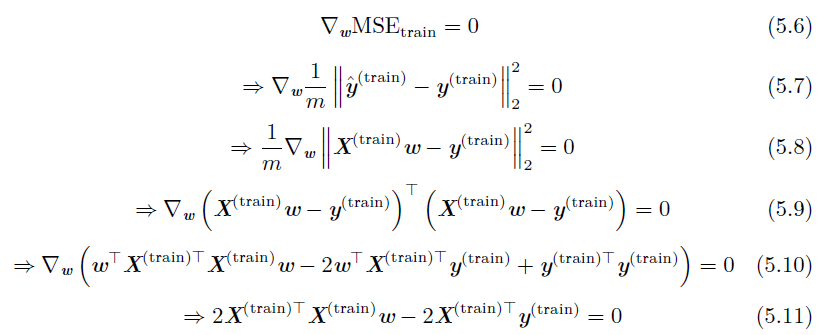

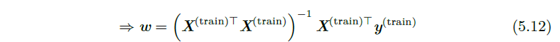

通过式(5.12)给出解的系统方程被称为**正规方程**(normal equation)。计算式(5.12) 构成了一个简单的机器学习算法。下图展示了线性回归算法的使用示例。

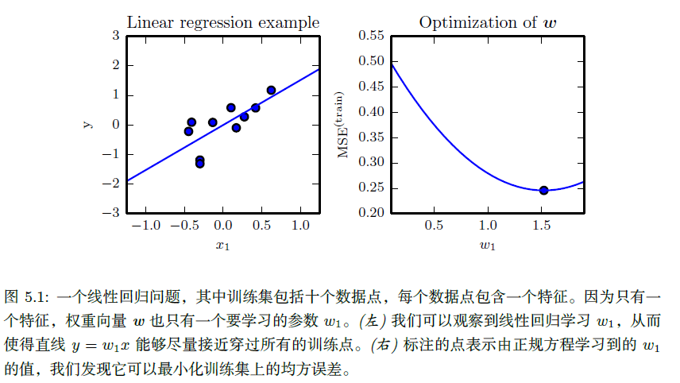

术语**线性回归**（linear regression）通常用来指稍微复杂一些，附加额外参数（截距项b）的模型。在这个模型中，

$ \hat y = w^Tx+b$

因此从参数到预测的映射仍是一个线性函数，而从特征到预测的映射是一个仿射函数。如此扩展到仿射函数意味着模型预测的曲线仍然看起来像是一条直线，只是这条直线没必要经过原点。

截距项b 通常被称为仿射变换的**偏置**（bias）参数。

### 5.2 容量、过拟合和欠拟合

机器学习的主要挑战是我们的算法必须能够在先前未观测的新输入上表现良好，而不只是在训练集上表现良好。在先前未观测到的输入上表现良好的能力被称为**泛化**（generalization）。

通常情况下，当我们训练机器学习模型时，我们可以使用某个训练集，在训练集上计算一些被称为**训练误差**（training error）的度量误差，目标是降低训练误差。目前为止，我们讨论的是一个简单的优化问题。机器学习和优化不同的地方在于，我们也希望**泛化误差**（generalization error）（也被称为测试误差（test error））很低。泛化误差被定义为新输入的误差期望。

通常，我们度量模型在训练集中分出来的测试集（test set）样本上的性能，来评估机器学习模型的泛化误差。

训练集和测试集数据通过数据集上被称为**数据生成过程**（data generating process）的概率分布生成。通常，我们会做一系列被统称为**独立同分布假设**（i.i.d. assumption）的假设。该假设是说，每个数据集中的样本都是彼此**相互独立的**（independent），并且训练集和测试集是**同分布的**（identically distributed），采样自相同的分布。这个假设使我们能够在单个样本的概率分布描述数据生成过程。然后相同的分布可以用来生成每一个训练样本和每一个测试样本。我们将这个共享的潜在分布称为**数据生成分布**（data generating distribution），记作p_data。这个概率框架和独立同分布假设允许我们从数学上研究训练误差和测试误差之间的关系。

我们能观察到训练误差和测试误差之间的直接联系是，随机模型训练误差的期望和该模型测试误差的期望是一样的。这是因为这两个期望的计算都使用了相同的数据集生成过程。

当然，当我们使用机器学习算法时，我们不会提前固定参数，然后采样得到两个数据集。我们采样得到训练集，然后挑选参数去降低训练集误差，然后采样得到测试集。在这个过程中，测试误差期望会大于或等于训练误差期望。以下是决定机器学习算法效果是否好的因素：

1. 降低训练误差。
2. 缩小训练误差和测试误差的差距。

这两个因素对应机器学习的两个主要挑战： **欠拟合**（underfitting）和**过拟合**（overfitting）。欠拟合是指模型不能在训练集上获得足够低的误差。而过拟合是指训练误差和和测试误差之间的差距太大。

通过调整模型的**容量**（capacity），我们可以控制模型是否偏向于过拟合或者欠拟合。通俗地，模型的容量是指其拟合各种函数的能力。容量低的模型可能很难拟合训练集。容量高的模型可能会过拟合，因为记住了不适用于测试集的训练集性质。

一种控制训练算法容量的方法是选择**假设空间**（hypothesis space），即学习算法可以选择为解决方案的函数集。例如，线性回归算法将关于其输入的所有线性函数作为假设空间。广义线性回归的假设空间包括多项式函数，而非仅有线性函数。这样做就增加了模型的容量。例如在线性回归模型中引入x^2， x^3等作为另外的特征。

当机器学习算法的容量适合于所执行任务的复杂度和所提供训练数据的数量时，算法效果通常会最佳。

下图展示了这个原理的使用情况。

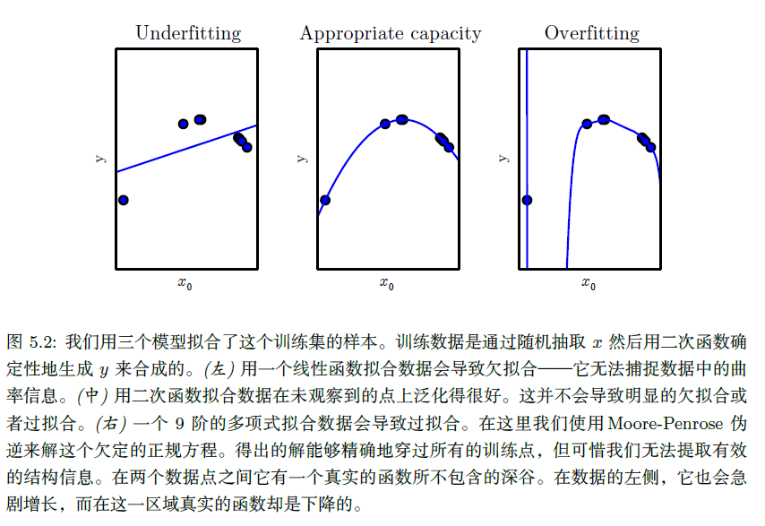

综上，改变模型的容量的方法有：

- 改变输入特征的数目

- 加入这些特征对应的参数。

事实上，还有很多方法可以改变模型的容量。容量不仅取决于模型的选择。

模型规定了调整参数降低训练目标时，学习算法可以从哪些函数族中选择函数。这被称为模型的**表示容量**（representational capacity）。在很多情况下，从这些函数中挑选出最优函数是非常困难的优化问题。实际中，学习算法不会真的找到最优函数，而仅是找到一个可以大大降低训练误差的函数。额外的限制因素，比如优化算法的不完美，意味着学习算法的**有效容量**（effective capacity）可能小于模型族的表示容量。

提高机器学习模型泛化的现代思想可以追溯到早在托勒密时期的哲学家的思想。**奥卡姆剃刀**（Occam’s razor）（c. 1287-1387）原则指出，在同样能够解释已知观测现象的假设中，我们应该挑选‘‘最简单’’ 的那一个。

统计学习理论提供了量化模型容量的不同方法。在这些中，最有名的是**Vapnik-Chervonenkis 维度**（Vapnik-Chervonenkis dimension, VC）。VC维度量二元分类器的容量。VC维定义为该分类器能够分类的训练样本的最大数目。假设存在m 个不同x 点的训练集，分类器可以任意地标记该m 个不同的x 点，VC维被定义为m的最大可能值。

量化模型的容量使得统计学习理论可以进行量化预测。统计学习理论中最重要的结论阐述了训练误差和泛化误差之间差异的上界随着模型容量增长而增长，但随着训练样本增多而下降。

我们必须记住虽然更简单的函数更可能泛化（训练误差和测试误差的差距小），但我们仍然需要选择一个充分复杂的假设以达到低的训练误差。通常，当模型容量上升时，训练误差会下降，直到其渐近最小可能误差（假设误差度量有最小值）。通常，泛化误差是一个关于模型容量的U 形曲线函数。如图5.3 所示。

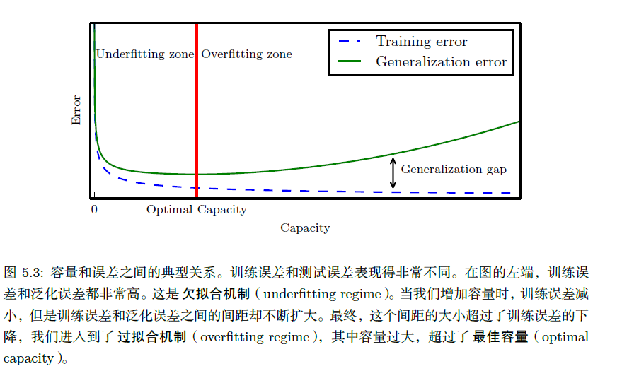

为考虑容量任意高的极端情况，我们介绍非参数（non-parametric）模型的概念。至此，我们只探讨过参数模型，例如线性回归。参数模型学习的函数在观测到新数据前，参数向量的分量个数是有限且固定的。非参数模型没有这些限制。

有时，非参数模型仅是一些不能实际实现的理论抽象（比如搜索所有可能概率分布的算法）。然而，我们也可以设计一些实用的非参数模型，使它们的复杂度和训练集大小有关。这种算法的一个示例是最近邻回归（nearest neighbor regression）。不像线性回归有固定长度的向量作为权重，最近邻回归模型存储了训练集中所有的X 和y。当需要为测试点x 分类时，模型会查询训练集中离该点最近的点，并返回相关的回归目标。

最后，我们也可以将参数学习算法嵌入另一个增加参数数目的算法来创建非参数学习算法。例如，我们可以想象这样一个算法，外层循环调整多项式的次数，内层循环通过线性回归学习模型。

理想模型假设我们能够预先知道生成数据的真实概率分布。然而这样的模型仍然会在很多问题上发生一些错误，因为分布中仍然会有一些噪声。在监督学习中，从x 到y 的映射可能内在是随机的，或者y 可能是其他变量（包括x 在内）的确定性函数。从预先知道的真实分布p(x, y) 预测而出现的误差被称为**贝叶斯误差**（Bayes error）。

训练误差和泛化误差会随训练集的大小发生变化。泛化误差的期望从不会因训练样本数目的增加而增加。对于非参数模型而言，更多的数据会得到更好的泛化能力，直到达到最佳可能的泛化误差。任何模型容量小于最优容量的固定参数模型会渐近到大于贝叶斯误差的误差值。如图5.4 所示。值得注意的是，具有最优容量的模型仍然有可能在训练误差和泛化误差之间存在很大的差距。在这种情况下，我们可以通过收集更多的训练样本来缩小差距。

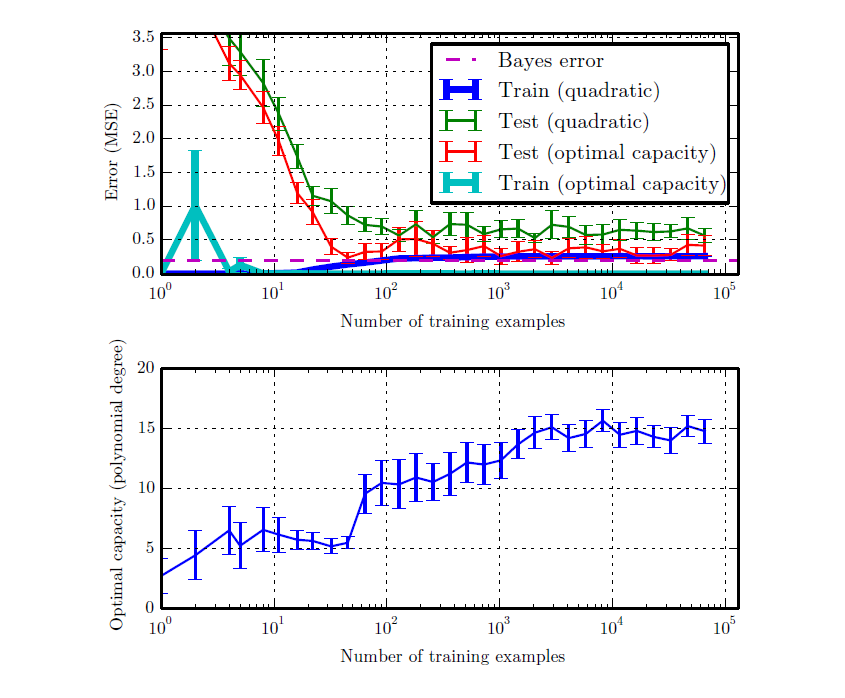

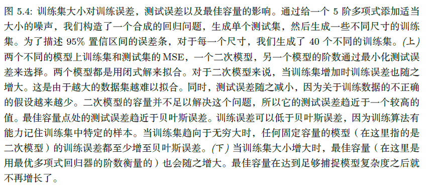

#### 5.2.1 没有免费午餐定理

机器学习的**没有免费午餐定理**（no free lunch theorem）表明(Wolpert, 1996)，在所有可能的数据生成分布上平均之后，每一个分类算法在未事先观测的点上都有相同的错误率。换言之，在某种意义上，没有一个机器学习算法总是比其他的要好。我们能够设想的最先进的算法和简单地将所有点归为同一类的简单算法有着相同的平均性能（在所有可能的任务上）。

幸运的是，这些结论仅在我们考虑所有可能的数据生成分布时才成立。在真实世界应用中，如果我们对遇到的概率分布进行假设的话，那么我们可以设计在这些分布上效果良好的学习算法。

这意味着机器学习研究的目标不是找一个通用学习算法或是绝对最好的学习算法。反之，我们的目标是理解什么样的分布与人工智能获取经验的‘‘真实世界’’ 相关，什么样的学习算法在我们关注的数据生成分布上效果最好。

#### 5.2.2 正则化

没有免费午餐定理暗示我们必须在特定任务上设计性能良好的机器学习算法。我们建立一组学习算法的偏好来达到这个要求。当这些偏好和我们希望算法解决的学习问题相吻合时，性能会更好。
至此，我们具体讨论修改学习算法的方法只有，通过增加或减少学习算法可选假设空间的函数来增加或减少模型的表示容量。

算法的效果不仅很大程度上受影响于假设空间的函数数量，也取决于这些函数的具体形式。我们已经讨论的学习算法（线性回归）具有包含其输入的线性函数集的假设空间。对于输入和输出确实接近线性相关的问题，这些线性函数是很有用的。对于完全非线性的问题它们不太有效。例如，我们用线性回归，从x 预测sin(x)，效果不会好。因此我们可以通过两种方式控制算法的性能，一是允许使用的函数种类，二是这些函数的数量。

在假设空间中，相比于某一个学习算法，我们可能更偏好另一个学习算法。这意味着两个函数都是符合条件的，但是我们更偏好其中一个。只有非偏好函数比偏好函数在训练数据集上效果明显好很多时，我们才会考虑非偏好函数。

例如，我们可以加入**权重衰减**（weight decay）来修改线性回归的训练标准。带权重衰减的线性回归最小化训练集上的均方误差和正则项的和J(w)，其偏好于平方L2 范数较小的权重。具体如下：

$J(w)=MSE_{train}+\lambda w^Tw$

其中λ是提前挑选的值，控制我们偏好小范数权重的程度。最小化J(w) 可以看作是拟合训练数据和偏好小权重范数之间的权衡。这会使得解决方案的斜率较小，或是将权重放在较少的特征上。我们可以训练具有不同λ值的高次多项式回归模型，来举例说明如何通过权重衰减控制模型欠拟合或过拟合的趋势。如图5.5 所示。

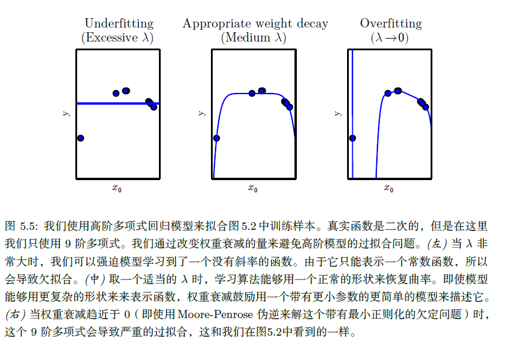

更一般地，正则化一个学习函数f(x; θ) 的模型，我们可以给代价函数添加被称为正则化项（regularizer）的惩罚。

表示对函数的偏好是比增减假设空间的成员函数更一般的控制模型容量的方法。我们可以将去掉假设空间中的某个函数看作是对不赞成这个函数的无限偏好。

有很多其他方法隐式或显式地表示对不同解的偏好。总而言之，这些不同的方法都被称为**正则化**（regularization）。正则化是指我们修改学习算法，使其降低泛化误差而非训练误差。正则化是机器学习领域的中心问题之一，只有优化能够与其重要性相媲。

没有免费午餐定理已经清楚地阐述了没有最优的学习算法，特别地，没有最优的正则化形式。反之，我们必须挑选一个非常适合于我们所要解决的任务的正则形式。深度学习中普遍的（特别是本书中的）理念是大量任务（例如所有人类能做的智能任务）也许都可以使用非常通用的正则化形式来有效解决。

### 5.3 超参数和验证集

大多数机器学习算法都有超参数，可以设置来控制算法行为。超参数的值不是通过学习算法本身学习出来的。

在图5.2 所示的多项式回归示例中，有一个超参数：多项式的次数，作为**容量**超参数。控制权重衰减程度的λ是另一个超参数。

有时一个选项被设为学习算法不用学习的超参数，是因为它太难优化了。更多的情况是，该选项必须是超参数，因为它不适合在训练集上学习。这适用于控制模型容量的所有超参数。如果在训练集上学习超参数，这些超参数总是趋向于最大可能的模型容量，导致过拟合（参考图5.3 ）。例如，相比低次多项式和正的权重衰减设定，更高次的多项式和权重衰减参数设定λ= 0 总能在训练集上更好地拟合。

为了解决这个问题，我们需要一个训练算法观测不到的**验证集**（validation set）样本。

测试样本不能以任何形式参与到模型的选择中，包括设定超参数。基于这个原因，测试集中的样本不能用于验证集。因此，我们总是从训练数据中构建验证集。特别地，我们将训练数据分成两个不相交的子集。其中一个用于学习参数。另一个作为验证集，用于估计训练中或训练后的泛化误差，更新超参数。用于学习参数的数据子集通常仍被称为训练集，尽管这
会和整个训练过程用到的更大的数据集相混。用于挑选超参数的数据子集被称为验证集（validation set）。通常，80% 的训练数据用于训练，20% 用于验证。由于验证集是用来‘‘训练’’ 超参数的，尽管验证集的误差通常会比训练集误差小，验证集会低估泛化误差。所有超参数优化完成之后，泛化误差可能会通过测试集来估计。

#### 5.3.1 交叉验证

将数据集分成固定的训练集和固定的测试集后，若测试集的误差很小，这将是有问题的。一个小规模的测试集意味着平均测试误差估计的统计不确定性，使得很难判断算法A 是否比算法B 在给定的任务上做得更好。

当数据集有十万计或者更多的样本时，这不会是一个严重的问题。当数据集太小时，也有替代方法允许我们使用所有的样本估计平均测试误差，代价是增加了计算量。这些过程是基于在原始数据上随机采样或分离出的不同数据集上重复训练和测试的想法。最常见的是k-折交叉验证过程，如算法5.1 所示，将数据集分成k 个不重合的子集。测试误差可以估计为k 次计算后的平均测试误差。在第i 次测试时，数据的第i 个子集用于测试集，其他的数据用于训练集。带来的一个问题是不存在平均误差方差的无偏估计(Bengio and Grandvalet, 2004)，但是我们通常会使用近似来解决。

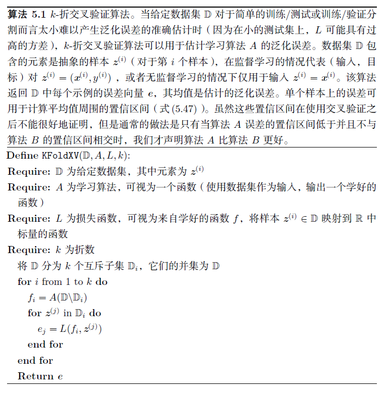

### 5.4 估计、偏差和方差

#### 5.4.1 点估计

点估计试图为一些感兴趣的量提供单个‘‘最优’’ 预测。

令${x^{(1)}, ..., x^{(m)}}$ 是m个独立同分布(i.i.d)的数据点。**点估计**（point estimator）或**统计量**（statistics）是这些数据的任意函数：
$\hat \theta_m = g(x^{(1)}, ..., x^{(m)})$

这个定义不要求g 返回一个接近真实θ的值，或者g 的值域恰好是θ的允许取值范围。

点估计也可以指输入和目标变量之间关系的估计。我们将这种类型的点估计称为函数估计。

例如从输入向量x 预测变量y，假设y=f(x)+ε，其中ε是y中未能从x预测的一部分。在函数估计中，我们感兴趣的是用模型估计取近似$f$，或者估计$\hat f$。函数估计是函数空间中的一个点估计。

#### 5.4.2 偏差

估计的偏差被定义为：

$ bias(\hat \theta_m)=E(\hat \theta_m)-\theta $

其中期望作用在所有数据（看作是从随机变量采样得到的）上，$\theta$是用于定义数据生成分布的$\theta$ 的真实值。如果bias($\hat \theta_m$) =0，那么估计量$\hat \theta_m$被称为是**无偏**（unbiased），这意味着E($\hat \theta_m$) = $\theta$。如果$lim_{m\rightarrow\infty} bias(\hat \theta_m)=0$，那么估计量$\hat \theta_m$ 被称为是**渐近无偏**(asymptotically unbiased)，这意味着$lim_{m\rightarrow\infty} E(\hat \theta_m)=0$。

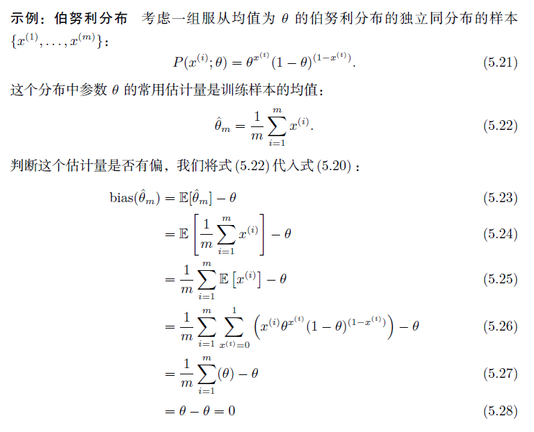

类似地，可以计算高斯分布的均值估计也是无偏的，高斯分布方差估计主要是有偏样本方差（分母是1/m）和无偏样本方差（分母是1/(m-1)）。

尽管无偏估计显然是令人满意的，但它并不总是‘‘最好’’ 的估计。

#### 5.4.3 方差和标准差

我们有时会考虑估计量的另一个性质是它作为数据样本的函数，期望的变化程度是多少。正如我们可以计算估计量的期望来决定它的偏差，我们也可以计算它的方差。估计量的**方差**（variance）就是一个方差Var($\hat\theta$)，其中随机变量是训练集。另外，方差的平方根被称为**标准差**(standard error)，记作SE($\hat\theta$)。

估计量的方差或标准差告诉我们，当独立地从潜在的数据生成过程中重采样数据集时，如何期望估计的变化。正如我们希望估计的偏差较小，我们也希望其方差较小。

均值的标准差被记作：

$SE(\hat\mu_m)=\sqrt {Var[\frac 1m\sum_{i=1}^m x^{(i)}]}=\frac {\sigma}{\sqrt m}$

其中$\sigma^2$是样本$x^{(i)}$的真实方差。标准差通常被记作$\sigma$。可惜，样本方差的平方根和方差无偏估计的平方根都不是标准差的无偏估计。这两种计算方法都倾向于低估真实的标准差，但仍用于实际中。相较而言，方差无偏估计的平方根较少被低估。对于较大的m，这种近似非常合理。

均值的标准差在机器学习实验中非常有用。我们通常用测试集样本的误差均值来估计泛化误差。测试集中样本的数量决定了这个估计的精确度。中心极限定理告诉我们均值会接近一个高斯分布，我们可以用标准差计算出真实期望落在选定区间的概率。例如，以均值$\hat \mu_m$为中心的95% 置信区间是

$(\hat\mu_m-1.96SE(\hat\mu_m), \hat\mu_m+1.96SE(\hat\mu_m))$

以上区间是基于均值$\hat\mu_m$和方差$SE(\hat\mu_m)^2$的高斯分布。在机器学习实验中，我们通常说算法A 比算法B 好，是指算法A 的误差的95% 置信区间的上界小于算法B的误差的95% 置信区间的下界。

**示例：伯努利分布** 我们再次考虑从伯努利分布中独立同分布采样出来的一组样本。这次我们关注估计$\hat\theta_m$的方差：

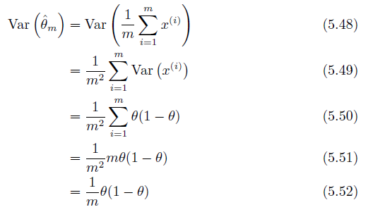

估计量方差的下降速率是关于数据集样本数目m 的函数。这是常见估计量的普遍性质。

#### 5.4.4 权衡偏差和方差以最小化均方误差

偏差和方差度量着估计量的两个不同误差来源。偏差度量着偏离真实函数或参数的误差期望。而方差度量着数据上任意特定采样可能导致的估计期望的偏差。

当我们可以在一个偏差更大的估计和一个方差更大的估计中进行选择时，会发生什么呢？我们该如何选择？

判断这种权衡最常用的方法是交叉验证。经验上，交叉验证在真实世界的许多任务中都非常成功。另外，我们也可以比较这些估计的**均方误差**（mean squared error, MSE）：

$MSE=E[(\hat\theta_m-\theta)^2]=Bias(\hat\theta_m)^2+Var(\hat\theta_m)$

MSE度量着估计和真实参数 之间平方误差的总体期望偏差。如上式所示，MSE估计包含了偏差和方差。理想的估计具有较小的MSE或是在检查中会稍微约束它们的偏差和方差。

偏差和方差的关系和机器学习容量、欠拟合和过拟合的概念紧密相联。用MSE度量泛化误差（偏差和方差对于泛化误差都是有意义的）时，增加容量会增加方差，降低偏差。如图5.6 所示，我们再次在关于容量的函数中，看到泛化误差的U 形曲线。

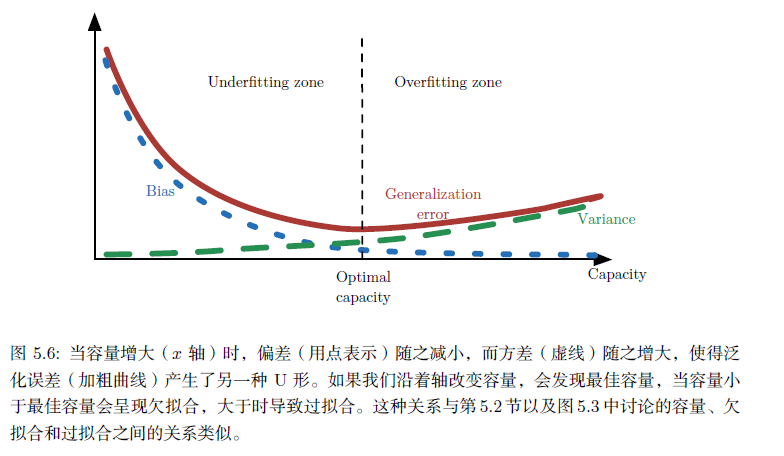

#### 5.4.5 一致性

目前我们已经探讨了固定大小训练集下不同估计量的性质。通常，我们也会关注训练数据增多后估计量的效果。特别地，我们希望当数据集中数据点的数量m 增加时，点估计会收敛到对应参数的真实值。更形式地，我们想要

$plim_{m\rightarrow \infty}\hat\theta_m=\theta$

符号plim表示依概率收敛，即对于任意的$\epsilon>0$，当$m\rightarrow \infty$时，有$P(|\hat\theta_m-\theta|>\epsilon)\rightarrow 0$。上式表示的条件被称为**一致性(consistency)**。有时它是指弱一致性，强一致性是指**几乎必然**(almost sure)从$\hat\theta$收敛到$\theta$。**几乎必然收敛**(almost sure convergence)是指当$p(lim_{m\rightarrow \infty}x^{(m)}=x)=1$时，随机变量序列$x^{(1)}, x^{(2)}, ...$收敛到x。

一致性保证了估计量的偏差会随数据样本数目的增多而减少。然而，反过来是不正确的——渐近无偏并不意味着一致性。例如，考虑用包含m 个样本的数据集${x^{(1)}, ..., x^{(m)}}$估计正态分布的均值参数$\mu$。我们可以使用数据集的第一个样本作为无偏估计量：$\hat\theta=x^{(1)}$。在该情况下，$E(\hat\theta_m)=\theta$，所以不管到多少数据点，改估计量都是无偏的。然而，这不是一个一致估计，因为它不满足当$m\rightarrow \infty$时，$\hat\theta_m\rightarrow \theta$。

### 5.5 最大似然估计

之前，我们已经看过常用估计的定义，并分析了它们的性质。但是这些估计是从哪里来的呢？**我们希望有些准则可以让我们从不同模型中得到特定函数作为好的估计**，而不是猜测某些函数可能是好的估计，然后分析其偏差和方差。

最常用的准则是最大似然估计。

==**最大似然估计的核心思想是：找到参数的一个估计值，使得当前样本出现的可能性最大。**==

考虑一组含有m 个样本的数据集$X={x^{(1)}, ..., x^{(m)}}$，独立地由未知的真实数据生成分布$p_{data}(x)$生成。

令$p_{model}(x;\theta)$是一族由$\theta$确定在相同空间上的概率分布。换言之，$p_{model}(x;\theta)$将任意输入x映射到实数来估计真实概率$p_{data}(x)$。

对$\theta$的最大似然估计被定义为：

$\theta_{ML}=arg\,\max_{\theta}p_{model}(X;\theta)=arg\,\max_{\theta}\prod_{i=1}^m p_{model}(x^{(i)};\theta)$

这个式子最大化每个样本出现的概率的连乘，也就是最大化这些样本被抽中的概率。多个概率的乘积会因很多原因不便于计算。例如，计算中很可能会出现数值下溢。为了得到一个便于计算的等价优化问题，我们观察到似然对数不会改变其arg max 但是将乘积转化成了便于计算的求和形式：

$\theta_{ML}=arg\,\max_{\theta}\sum_{i=1}^m log\,p_{model}(x^{(i)};\theta)$

因为当我们重新缩放代价函数时arg max 不会改变，我们可以除以m 得到和训练数据经验分布$\hat p_{data} $相关的期望作为准则：

$\theta_{ML}=arg\,\max_{\theta}E_{x\sim\hat p_{data}} log\,p_{model}(x^{(i)};\theta)$

**一种解释最大似然估计的观点是将它看作最小化训练集上的经验分布$\hat p_{data} $和模型分布之间的差异**，两者之间的差异程度可以通过KL 散度度量。KL 散度被定义为

$D_{KL}(\hat p_{data}||p_{model})=E_{x\sim\hat p_{data}}[log\,\hat p_{data}(x)-log\,p_{model}(x)]$

左边一项仅涉及到数据生成过程，和模型无关。这意味着当我们训练模型最小化KL散度时，我们只需要最小化

$-E_{x\sim\hat p_{data}}[log\,p_{model}(x)]$

最小化KL 散度其实就是在最小化分布之间的交叉熵。任何一个由负对数似然组成的损失都是定义在训练集上的经验分布和定义在模型上的概率分布之间的交叉熵。例如，均方误差是经验分布和高斯模型之间的交叉熵。

我们可以将最大似然看作是使模型分布尽可能地和经验分布$\hat p_{data} $相匹配的尝试。理想情况下，我们希望匹配真实的数据生成分布$p_{data} $，但我们没法直接知道这个分布。

虽然最优$\theta$在最大化似然或是最小化KL 散度时是相同的，但目标函数值是不一样的。在软件中，我们通常将两者都称为最小化代价函数。因此最大化似然变成了最小化负对数似然（NLL)，或者等价的是最小化交叉熵。将最大化似然看作最小化KL 散度的视角在这个情况下是有帮助的，因为已知KL 散度最小值是零。当x取实数时，负对数似然是负值。

#### 5.5.1 条件对数似然和均方误差

最大似然估计很容易扩展到估计条件概率$P(y|x;\theta)$，从而给定x 预测y。实际上这是最常见的情况，因为这构成了大多数监督学习的基础。如果X 表示所有的输入，Y 表示我们观测到的目标，那么条件最大似然估计是

$\theta_{ML}=arg\,\max_{\theta}P(Y|X;\theta)$

如果假设样本是独立同分布的，那么这可以分解成

$\theta_{ML}=arg\,\max_{\theta}\sum_{i=1}^m log\,P(y^{(i)}|x^{(i)};\theta)$

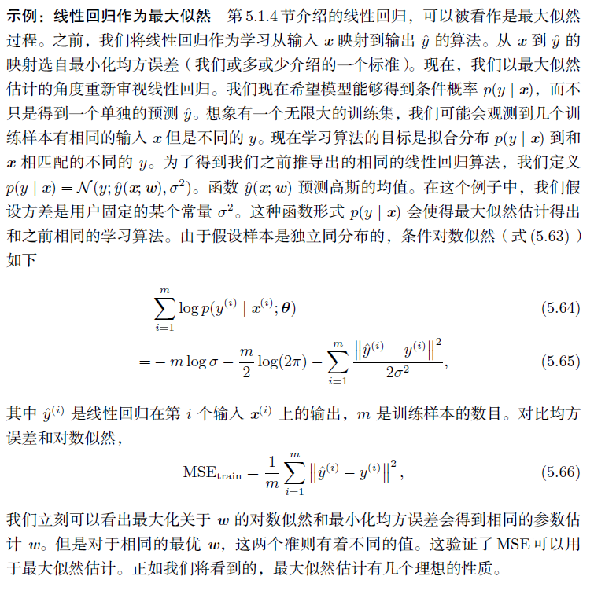

将上述条件对数似然式(5.64)中的p替换成高斯分布的概率密度即可得到(5.65)。

#### 5.5.2 最大似然的性质

最大似然估计最吸引人的地方在于，它被证明当样本数目$m \rightarrow \infty$时，就收敛率而言是最好的渐近估计。

在合适的条件下，最大似然估计具有一致性，意味着训练样本数目趋向于无穷大时，参数的最大似然估计会收敛到参数的真实值。这些条件是：

- 真实分布$p_{data}$必须在模型族$p_{model}(·;\theta)$中。否则，没有估计可以还原$p_{data}$。
- 真实分布$p_{data}$必须刚好对应一个$\theta$值。否则，最大似然估计恢复出真实分布$p_{data}$后，也不能决定数据生成过程使用哪个$\theta$。

==也就是说，数据的真实分布必须属于我们假定的模型，而且真实分布的参数值必须是一个定值，不能是随机变量。==

除了最大似然估计，还有其他的归纳准则，其中许多共享一致估计的性质。然而，一致估计的**统计效率**（statistic efficiency）可能区别很大。某些一致估计可能会在固定数目的样本上获得一个较低的泛化误差，或者等价地，可能只需要较少的样本就能达到一个固定程度的泛化误差。

统计效率通常用于**有参情况**（parametric case）的研究中（例如线性回归）。有参情况中我们的目标是估计参数值（假设有可能确定真实参数），而不是函数值。一种度量我们和真实参数相差多少的方法是计算均方误差的期望，即计算m 个从数据生成分布中出来的训练样本上的估计参数和真实参数之间差值的平方。有参均方误差估计随着m 的增加而减少，当m 较大时，Cramér-Rao 下界(Rao, 1945; Cramér,1946) 表明不存在均方误差低于最大似然估计的一致估计。

因为这些原因（一致性和统计效率），最大似然通常是机器学习中的首选估计。当样本数目小到会发生过拟合时，正则化策略如权重衰减可用于获得训练数据有限时方差较小的最大似然有偏版本。

### 5.6 贝叶斯估计

至此我们已经讨论了频率派统计（frequentist statistics）方法和基于估计单一值$\theta$ 的方法，然后基于该估计作所有的预测。另一种方法是在做预测时会考虑所有可能的$\theta$ 。后者属于贝叶斯统计（Bayesian statistics）的范畴。

频率派的视角是真实参数$\theta$ 是未知的定值，而点估计$\hat\theta$ 是考虑数据集上函数（可以看作是随机的）的随机变量。

贝叶斯统计的视角完全不同。贝叶斯用概率反映知识状态的确定性程度。数据集能够被直接观测到，因此不是随机的。另一方面，真实参数$\theta$ 是未知或不确定的，因此可以表示成随机变量。

在观察到数据前，我们将$\theta$ 的已知知识表示成先验概率分布（prior probability distribution），p($\theta$ )（有时简单地称为‘‘先验’’）。一般而言，机器学习实践者会选择一个相当宽泛的（即，高熵的）先验分布，反映在观测到任何数据前参数$\theta$ 的高度不确定性。例如，我们可能会假设先验$\theta$ 在有限区间中均匀分布。许多先验偏好于‘‘更简单’’ 的解（如小幅度的系数，或是接近常数的函数）。

==注：先验概率是指根据以往经验和分析得到的概率。==

现在假设我们有一组数据样本$\{x^{(1)}, ..., x^{(m)}\}$。通过贝叶斯规则结合数据似然$p(x^{(1)}, ..., x^{(m)}|\theta)$和先验，我们可以恢复数据对我们关于$\theta$信念的影响：

$p(\theta|x^{(x)}, ..., x^{(m)})=\frac{p(x^{(1)}, ..., x^{(m)}|\theta)p(\theta)}{p(x^{(1)}, ..., x^{(m)})}$

在贝叶斯估计常用的情景下，先验开始是相对均匀的分布或高熵的高斯分布，观测数据通常会使后验的熵下降，并集中在参数的几个可能性很高的值。

相对于最大似然估计，贝叶斯估计有两个重要区别。第一，不像最大似然方法预测时使用$\theta$的点估计，贝叶斯方法使用$\theta$的全分布。

==也就是说，最大似然是求出最有可能的$\theta$值，而贝叶斯方法则是求解$\theta$的分布。==

例如，在观测到m 个样本后，下一个数据样本x(m+1) 的预测分布如下：

$p(x^{(m+1)}|x^{(1)}, ..., x^{(m)})=\int p(x^{(m+1)}|\theta)p(\theta|x^{(1)}, ..., x^{(m)})d\theta$

这里，每个具有正概率密度的$\theta$的值有助于下一个样本的预测，其中贡献由后验密度本身加权。在观测到数据集$x^{(1)}, ..., x^{(m)}$之后，如果我们仍然非常不确定$\theta$的值，那么这个不确定性会直接包含在我们所做的任何预测中。

==注：后验概率是说，某件事情已经发生，这件事情发生原因是由某个因素引起的可能性的大小。==

在第5.4 节中，我们已经探讨频率派方法解决给定点估计$\theta$的不确定性的方法是评估方差，估计的方差评估了观测数据重新从观测数据中采样后，估计可能如何变化。对于如何处理估计不确定性的这个问题，贝叶斯派的答案是积分，这往往会防止过拟合。当然，积分仅仅是概率法则的应用，使贝叶斯方法容易验证，而频率派机器学习基于相当特别的决定构建了一个估计，将数据集里的所有信息归纳到一个单独的点估计。

贝叶斯方法和最大似然方法的第二个最大区别是由贝叶斯先验分布造成的。先验能够影响概率质量密度朝参数空间中偏好先验的区域偏移。实践中，先验通常表现为偏好更简单或更光滑的模型。对贝叶斯方法的批判认为先验是人为主观判断影响预测的来源。

==也就是说，最大似然估计认为参数的所有可能取值都是一样的概率，而贝叶斯方法认为存在一个先验，有些取值的可能性更大。==

当训练数据很有限时，贝叶斯方法通常泛化得更好，但是当训练样本数目很大时，通常会有很大的计算代价。

**示例：贝叶斯线性回归** 我们使用贝叶斯估计方法学习线性回归的参数。在线性回归中，我们学习从输入向量$x\in R^n$预测标量$y\in R$的线性映射。该预测由向量$w \in R^n$参数化：

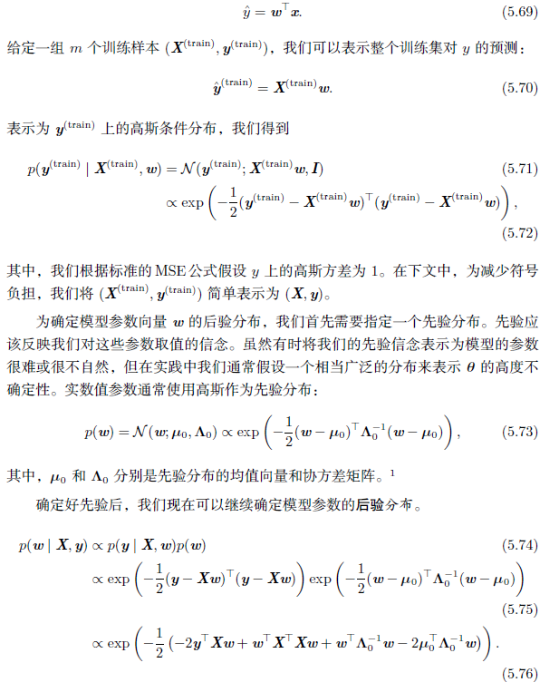

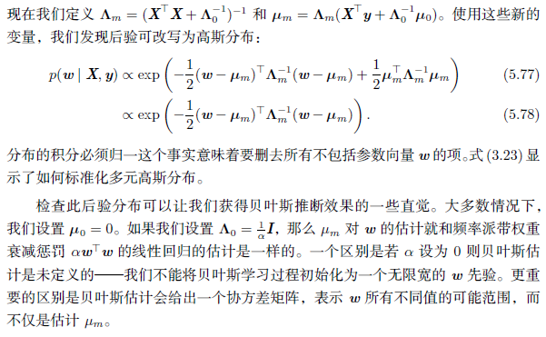

#### 5.6.1 最大后验(MAP)估计

原则上，我们应该使用参数$\theta$的完整贝叶斯后验分布进行预测，但单点估计常常也是需要的。希望使用点估计的一个常见原因是，对于大多数有意义的模型而言，大多数涉及到贝叶斯后验的计算是非常棘手的，点估计提供了一个可行的近似解。我们仍然可以让先验影响点估计的选择来利用贝叶斯方法的优点，而不是简单地回到最大似然估计。一种能够做到这一点的合理方式是选择最大后验（Maximum A Posteriori, MAP）点估计。MAP估计选择后验概率最大的点（或在$\theta$是连续值的更常见情况下，概率密度最大的点）：

$\theta_{MAP}=arg\,\max_{\theta}\,p(\theta|x)=arg\,\max_{\theta}\,log\,p(x|\theta)+log\,p(\theta)$

我们可以认出上式右边的$log\,p(x|\theta)$对应着标准的对数似然项，$log\,p(\theta)$对应着先验分布。

例如，考虑具有高斯先验权重w 的线性回归模型。如果先验是$N(w;0, \frac 1{\lambda}I^2)$，那么上式的对数先验项正比于熟悉的权重衰减惩罚$\lambda w^Tw$，加上一个不依赖于w 也不会影响学习过程的项。因此，具有高斯先验权重的MAP 贝叶斯推断对应着权重衰减。

正如全贝叶斯推断，MAP贝叶斯推断的优势是能够利用来自先验的信息，这些信息无法从训练数据中获得。该附加信息有助于减少最大后验点估计的方差（相比于ML 估计）。然而，这个优点的代价是增加了偏差。

许多正规化估计方法，例如权重衰减正则化的最大似然学习，可以被解释为贝叶斯推断的MAP近似。这个适应于正则化时加到目标函数的附加项对应着log p($\theta$)。并非所有的正则化惩罚都对应着MAP 贝叶斯推断。例如，有些正则化项可能不是一个概率分布的对数。还有些正则化项依赖于数据，当然也不会是一个先验概率分布。

MAP贝叶斯推断提供了一个直观的方法来设计复杂但可解释的正则化项。例如，更复杂的惩罚项可以通过混合高斯分布作为先验得到，而不是一个单独的高斯分布(Nowlan and Hinton, 1992)。

参考资料：

https://www.jianshu.com/p/ead99acd6437

https://blog.csdn.net/bitcarmanlee/article/details/81417151

### 5.7 监督学习算法

粗略地说，监督学习算法是给定一组输入x 和输出y 的训练集，学习如何关联输入和输出。

#### 5.7.1 概率监督学习

本书的大部分监督学习算法都是基于估计概率分布$p(y|x)$的。我们可以使用最大似然估计找到对于有参分布族$p(y|x;\theta)$最好的参数向量$\theta$。

我们已经看到，线性回归对应于分布族

$p(y|x;\theta)=N(y;\theta^Tx,I)$

通过定义一族不同的概率分布，我们可以将线性回归扩展到分类情况中。如果我们有两个类，类0 和类1，那么我们只需要指定这两类之一的概率。类1 的概率决定了类0 的概率，因为这两个值加起来必须等于1。

我们用于线性回归的实数正态分布是用均值参数化的。我们提供这个均值的任何值都是有效的。二元变量上的分布稍微复杂些，因为它的均值必须始终在0 和1之间。解决这个问题的一种方法是使用logistic sigmoid 函数将线性函数的输出压缩进区间(0; 1)。该值可以解释为概率：

$p(y=1|x;\theta)=\sigma(\theta^Tx)$

这个方法被称为逻辑回归（logistic regression），这个名字有点奇怪，因为该模型用于分类而非回归。

线性回归中，我们能够通过求解正规方程以找到最佳权重。相比而言，逻辑回归会更困难些。其最佳权重没有闭解。反之，我们必须最大化对数似然来搜索最优解。我们可以通过梯度下降算法最小化负对数似然来搜索。

通过确定正确的输入和输出变量上的有参条件概率分布族，相同的策略基本上可以用于任何监督学习问题。

#### 5.7.2 支持向量机

**支持向量机**（support vector machine, SVM）是监督学习中最有影响力的方法之一。类似于逻辑回归，这个模型也是基于线性函数$w^⊤x + b$ 的。不同于逻辑回归的是，支持向量机不输出概率，只输出类别。当$w^⊤x + b $为正时，支持向量机预测属于正类。类似地，当$w^⊤x + b$ 为负时，支持向量机预测属于负类。

支持向量机的一个重要创新是**核技巧**（kernel trick）。核技巧观察到许多机器学习算法都可以写成样本间点积的形式。例如，支持向量机中的线性函数可以重写为

$w^⊤x + b=b+\sum_{i=1}^m \alpha_i x^T x^{(i)}$ 

其中，$x^{(i)}$是训练样本，$\alpha$是系数向量。学习算法重写为这种形式允许我们将x替换为特征函数$\phi(x)$的输出，点积替换为被称为**核函数(kernel function)**的函数$k(x, x^{(i)})=\phi(x)·\phi(x^{(i)})$。运算符 · 表示类似于$\phi(x)^T\phi(x^{(i)})$的点积。对于某些特征空间，我们可能不会书面地使用向量内积。在某些无限维空间中，我们需要使用其他类型的内积，如基于积分而非加和的内积。

使用核估计替换点积之后，我们可以使用如下函数进行预测

$f(x)=b+\sum_i \alpha_i k(x, x^{(i)})$

这个函数关于x是非线性的，关于$\phi(x)$是线性的。$\alpha$和$f(x)$之间的关系也是线性的。核函数完全等价于用$\phi(x)$预处理所有的输入，然后在新的转换空间学习线性模型。

核技巧十分强大有两个原因。**首先，它使我们能够使用保证有效收敛的凸优化技术来学习非线性模型（关于x 的函数）。**这是可能的，因为我们可以认为ϕ 是固定的，仅优化$\alpha$，即优化算法可以将决策函数视为不同空间中的线性函数。**其二，核函数k 的实现方法通常有比直接构建ϕ(x) 再算点积高效很多。**

在某些情况下，ϕ(x) 甚至可以是无限维的，对于普通的显式方法而言，这将是无限的计算代价。在很多情况下，即使ϕ(x) 是难算的，k(x; x′) 却会是一个关于x非线性的、易算的函数。举个无限维空间易算的核的例子，我们构建一个作用于非负整数x 上的特征映射ϕ(x)。假设这个映射返回一个由开头x 个1，随后是无限个0 的向量。我们可以写一个核函数$k(x; x^{(i)}) = min(x; x^{(i)})$，完全等价于对应的无限维点积。

最常用的核函数是高斯核（Gaussian kernel）：

$k(\mu, v)=N(\mu-v;0,\sigma^2I)$

其中$N(x;\mu, \Sigma)$是标准正态密度。这个核也被称为**径向基函数**（radial basis function, RBF）核，因为其值沿v 中从u 向外辐射的方向减小。高斯核对应于无限维空间中的点积，但是该空间的推导没有整数上最小核的示例那么直观。

我们可以认为高斯核在执行一种**模板匹配**(template matching)。训练标签y 相关的训练样本x 变成了类别y 的模版。当测试点x′ 到x 的欧几里得距离很小，对应的高斯核响应很大时，表明x′ 和模版x 非常相似。该模型进而会赋予相对应的训练标签y 较大的权重。总的来说，预测将会组合很多这种通过训练样本相似度加权的训练标签。

支持向量机不是唯一可以使用核技巧来增强的算法。许多其他的线性模型也可以通过这种方式来增强。使用核技巧的算法类别被称为**核机器**（kernel machine）或**核方法**（kernel method）(Williams and Rasmussen, 1996; Schölkopf et al., 1999)。

核机器的一个主要缺点是计算决策函数的成本关于训练样本的数目是线性的。因为第i 个样本贡献$\alpha_ik(x,x^{(i)})$到决策函数。支持向量机能够通过学习主要包含零的向量$\alpha$，以缓和这个缺点。那么判断新样本的类别仅需要计算非零$\alpha_i$对应的训练样本的核函数。这些训练样本被称为**支持向量**（support vector）。

当数据集很大时，核机器的计算量也会很大。带通用核的核机器致力于泛化得更好。现代深度学习的设计旨在克服核机器的这些限制。当前深度学习的复兴始于Hinton et al.(2006b) 表明神经网络能够在MNIST 基准数据上胜过RBF 核的支持向量机。

这部分可以看看：https://blog.csdn.net/cqy_chen/article/details/77932270

#### 5.7.3 其他简单的监督学习算法

我们已经简要介绍过另一个非概率监督学习算法，最近邻回归。更一般地，k-最近邻是一类可用于分类或回归的技术。作为一个非参数学习算法，k-最近邻并不局限于固定数目的参数。我们通常认为k-最近邻算法没有任何参数，而是使用训练数据的简单函数。事实上，它甚至也没有一个真正的训练阶段或学习过程。反之，在测试阶段我们希望在新的测试输入x 上产生y，我们需要在训练数据X 上找到x 的k-最近邻。然后我们返回训练集上对应的y 值的平均值。这几乎适用于任何类型可以确定y 值平均值的监督学习。在分类情况中，我们可以关于one-hot 编码向量c求平均，其中c_y = 1，其他的i 值取c_i = 0。然后，我们可以解释这些one-hot 编码的均值为类别的概率分布。作为一个非参数学习算法，k-近邻能达到非常高的容量。例如，假设我们有一个用0-1 误差度量性能的多分类任务。在此设定中，当训练样本数目趋向于无穷大时，1-最近邻收敛到两倍贝叶斯误差。超出贝叶斯误差的原因是它会随机从等距离的临近点中随机挑一个。而存在无限的训练数据时，所有测试点x 周围距离为零的邻近点有无限多个。如果我们使用所有这些临近点投票的决策方式，而不是随机挑选一个，那么该过程将会收敛到贝叶斯错误率。k-最近邻的高容量使其在训练样本数目大时能够获取较高的精度。然而，它的计算成本很高，另外在训练集较小时泛化能力很差。k-最近邻的一个弱点是它不能学习出哪一个特征比其他更具识别力。例如，假设我们要处理一个回归任务，其中$x \in R^{100}$ 是从各向同性的高斯分布中抽取的，但是只有一个变量x1 和结果相关。进一步假设该特征直接决定了输出，即在所有情况中y = x_1。最近邻回归不能检测到这个简单模式。大多数点x 的最近邻将取决于x2 到x100 的大多数特征，而不是单独取决于特征x1。因此，小训练集上的输出将会非常随机。

**决策树**（decision tree）及其变种是另一类将输入空间分成不同的区域，每个区域有独立参数的算法(Breiman et al., 1984)。如图5.7 所示，决策树的每个节点都与输入空间的一个区域相关联，并且内部节点继续将区域分成子节点下的子区域（通常使用坐标轴拆分区域）。空间由此细分成不重叠的区域，叶节点和输入区域之间形成一一对应的关系。每个叶结点将其输入区域的每个点映射到相同的输出。如果允许学习任意大小的决策树，那么它可以被视作非参数算法。然而实践中通常有大小限制，作为正则化项将其转变成有参模型。由于决策树通常使用坐标轴相关的拆分，并且每个子节点关联到常数输出，因此有时解决一些对于逻辑回归很简单的问题很费力。例如，假设有一个二分类问题，当x2 > x1 时分为正类，则决策树的分界不是坐标轴对齐的。因此，决策树将需要许多节点近似决策边界，坐标轴对齐使其算法步骤不断地来回穿梭于真正的决策函数。

正如我们已经看到的，最近邻预测和决策树都有很多的局限性。尽管如此，在计算资源受限制时，它们都是很有用的学习算法。通过思考复杂算法和k-最近邻或决策树之间的相似性和差异，我们可以建立对更复杂学习算法的直觉。

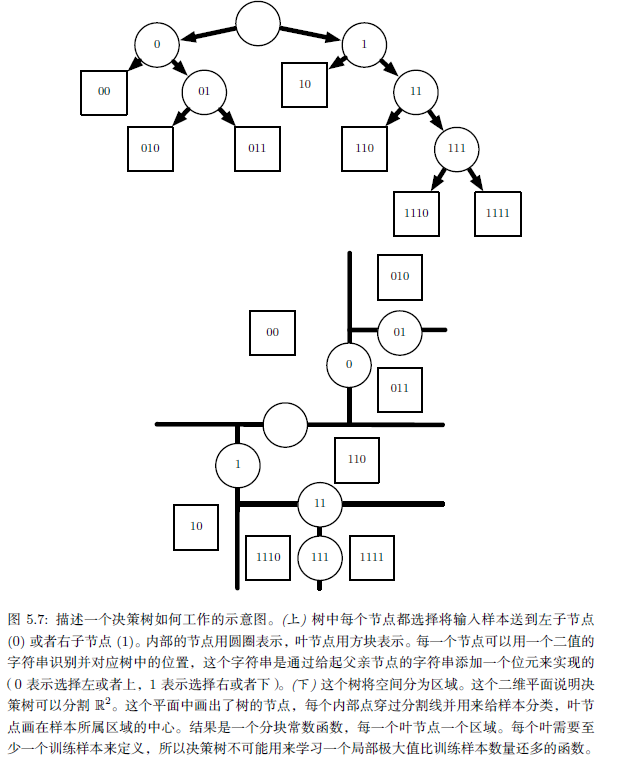

### 5.8 无监督学习算法

通俗地说，无监督学习的大多数尝试是指从不需要人为注释的样本的分布中抽取信息。该术语通常与密度估计相关，学习从分布中采样、学习从分布中去噪、寻找数据分布的流形或是将数据中相关的样本聚类。

一个经典的无监督学习任务是找到数据的‘‘最佳’’ 表示。‘‘最佳’’ 可以是不同的表示，但是一般来说，是指该表示在比本身表示的信息更简单或更易访问而受到一些惩罚或限制的情况下，尽可能地保存关于x 更多的信息。

有很多方式定义较简单的表示。最常见的三种包括低维表示、稀疏表示和独立表示。低维表示尝试将x 中的信息尽可能压缩在一个较小的表示中。稀疏表示将数据集嵌入到输入项大多数为零的表示中。稀疏表示通常用于需要增加表示维数的情况，使得大部分为零的表示不会丢失很多信息。这会使得表示的整体结构倾向于将数据分布在表示空间的坐标轴上。独立表示试图分开数据分布中变化的来源，使得表示的维度是统计独立的。

当然这三个标准并非相互排斥的。低维表示通常会产生比原始的高维数据具有较少或较弱依赖关系的元素。这是因为减少表示大小的一种方式是找到并消除冗余。识别并去除更多的冗余使得降维算法在丢失更少信息的同时显现更大的压缩。

#### 5.8.1 主成分分析

PCA算法提供了一种压缩数据的方式。我们也可以将PCA视为学习数据表示的无监督学习算法。这种表示基于上述简单表示的两个标准。PCA学习一种比原始输入维数更低的表示。它也学习了一种元素之间彼此没有线性相关的表示。这是学习表示中元素统计独立标准的第一步。要实现完全独立性，表示学习算法也必须去掉变量间的非线性关系。

如图5.8 所示，PCA将输入x 投影表示成z，学习数据的正交线性变换。在第2.12 节中，我们看到了如何学习重建原始数据的最佳一维表示（就均方误差而言），这种表示其实对应着数据的第一个主要成分。因此，我们可以用PCA作为保留数据尽可能多信息的降维方法（再次就最小重构误差平方而言）。在下文中，我们将研究PCA表示如何使原始数据表示X 去相关的.

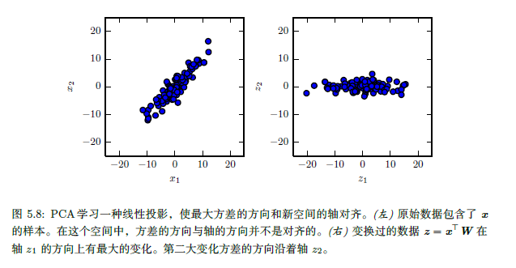

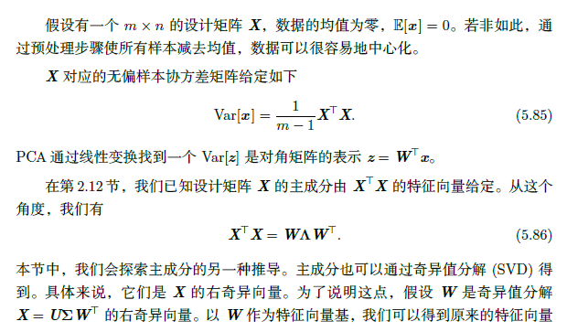

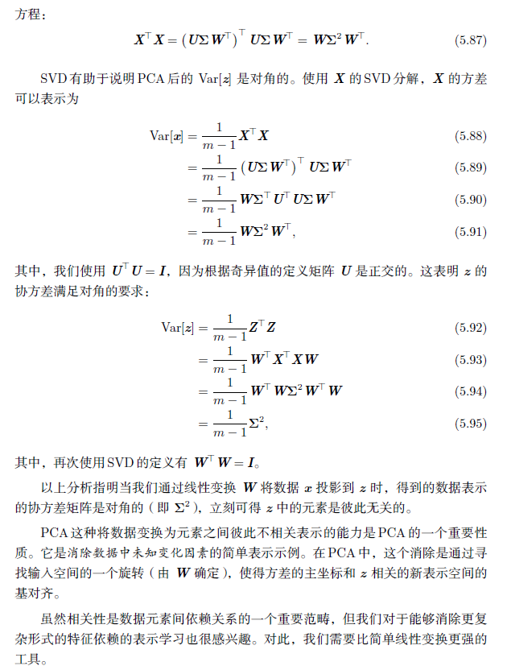

#### 5.8.2 k-均值聚类

另外一个简单的表示学习算法是k-均值聚类。k-均值聚类算法将训练集分成k个靠近彼此的不同样本聚类。因此我们可以认为该算法提供了k-维的one-hot 编码向量h 以表示输入x。当x 属于聚类i 时，有hi = 1，h 的其他项为零。

k-均值聚类初始化k 个不同的中心点$\{\mu^{(1)},...,\mu^{(k)}\}$，然后迭代交换两个不同的步骤直到收敛。步骤一，每个训练样本分配到最近的中心点$\mu^{(i)}$所代表的聚类i。步骤二，每一个中心点$\mu^{(i)}$更新为聚类i 中所有训练样本$x^{(j)}$的均值。

关于聚类的一个问题是聚类问题本身是病态的。这是说没有单一的标准去度量聚类的数据在真实世界中效果如何。我们可以度量聚类的性质，例如类中元素到类中心点的欧几里得距离的均值。这使我们可以判断从聚类分配中重建训练数据的效果如何。然而我们不知道聚类的性质是否很好地对应到真实世界的性质。此外，可能有许多不同的聚类都能很好地对应到现实世界的某些属性。我们可能希望找到和一个特征相关的聚类，但是得到了一个和任务无关的，同样是合理的不同聚类。例如，假设我们在包含红色卡车图片、红色汽车图片、灰色卡车图片和灰色汽车图片的数据集上运行两个聚类算法。如果每个聚类算法聚两类，那么可能一个算法将汽车和卡车各聚一类，另一个根据红色和灰色各聚一类。假设我们还运行了第三个聚类算法，用来决定类别的数目。这有可能聚成了四类，红色卡车、红色汽车、灰色卡车和灰色汽车。现在这个新的聚类至少抓住了属性的信息，但是丢失了相似性信息。红色汽车和灰色汽车在不同的类中，正如红色汽车和灰色卡车也在不同的类中。该聚类算法没有告诉我们灰色汽车和红色汽车的相似度比灰色卡车和红色汽车的相似度更高。我们只知道它们是不同的。

这些问题说明了一些我们可能更偏好于分布式表示（相对于one-hot 表示而言）的原因。分布式表示可以对每个车辆赋予两个属性——一个表示它颜色，一个表示它是汽车还是卡车。目前仍然不清楚什么是最优的分布式表示（学习算法如何知道我们关心的两个属性是颜色和是否汽车或卡车，而不是制造商和车龄？），但是多个属性减少了算法去猜我们关心哪一个属性的负担，允许我们通过比较很多属性而非测试一个单一属性来细粒度地度量相似性。

### 5.9 随机梯度下降

几乎所有的深度学习算法都用到了一个非常重要的算法： **随机梯度下降**（stochastic gradient descent, SGD）.

机器学习中反复出现的一个问题是好的泛化需要大的训练集，但大的训练集的计算代价也更大。

随机梯度下降的核心是，梯度是期望。期望可使用小规模的样本近似估计。具体而言，在算法的每一步，我们从训练集中均匀抽出一小批量（minibatch）样本。小批量的数目m′ 通常是一个相对较小的数，从一到几百。重要的是，当训练集大小m 增长时，m′ 通常是固定的。我们可能在拟合几十亿的样本时，每次更新计算只用到几百个样本。

梯度下降往往被认为很慢或不可靠。以前，将梯度下降应用到非凸优化问题被认为很鲁莽或没有原则。现在，我们知道梯度下降用于本书第二部分中的训练时效果不错。优化算法不一定能保证在合理的时间内达到一个局部最小值，但它通常能及时地找到代价函数一个很小的值，并且是有用的。

随机梯度下降在深度学习之外有很多重要的应用。它是在大规模数据上训练大型线性模型的主要方法。对于固定大小的模型，每一步随机梯度下降更新的计算量不取决于训练集的大小m。在实践中，当训练集大小增长时，我们通常会使用一个更大的模型，但这并非是必须的。达到收敛所需的更新次数通常会随训练集规模增大而增加。然而，当m 趋向于无穷大时，该模型最终会在随机梯度下降抽样完训练集上的所有样本之前收敛到可能的最优测试误差。继续增加m 不会延长达到模型可能的最优测试误差的时间。从这点来看，我们可以认为用SGD训练模型的渐近代价是关于m 的函数的O(1) 级别。

在深度学习兴起之前，学习非线性模型的主要方法是结合核技巧的线性模型。很多核学习算法需要构建一个m x m 的矩阵$G_{i,j} = k(x^{(i)}, x^{(j)})$。构建这个矩阵的计算量是$O(m^2)$。当数据集是几十亿个样本时，这个计算量是不能接受的。在学术界，深度学习从2006 年开始受到关注的原因是，在数以万计样本的中等规模数据集上，深度学习在新样本上比当时很多热门算法泛化得更好。不久后，深度学习在工业界受到了更多的关注，因为其提供了一种训练大数据集上的非线性模型的可扩展方式。

### 5.10 构建机器学习算法

几乎所有的深度学习算法都可以被描述为一个相当简单的配方：特定的数据集、代价函数、优化过程和模型。

通常代价函数至少含有一项使学习过程进行统计估计的成分。最常见的代价函数是负对数似然，最小化代价函数导致的最大似然估计。

代价函数也可能含有附加项，如正则化项。

组合模型、代价和优化算法来构建学习算法的配方同时适用于监督学习和无监督学习。

在某些情况下，由于计算原因，我们不能实际计算代价函数。在这种情况下，只要我们有近似其梯度的方法，那么我们仍然可以使用迭代数值优化近似最小化目标。

尽管有时候不显然，但大多数学习算法都用到了上述配方。如果一个机器学习算法看上去特别独特或是手动设计的，那么通常需要使用特殊的优化方法进行求解。有些模型，如决策树或k-均值，需要特殊的优化，因为它们的代价函数有平坦的区域，使其不适合通过基于梯度的优化去最小化。在我们认识到大部分机器学习算法可以使用上述配方描述之后，我们可以将不同算法视为出于相同原因解决相关问题的一类方法，而不是一长串各个不同的算法。

### 5.11 促使深度学习发展的挑战

本章描述的简单机器学习算法在很多不同的重要问题上效果都良好。但是它们不能成功解决人工智能中的核心问题，如语音识别或者对象识别。

深度学习发展动机的一部分原因是传统学习算法在这类人工智能问题上泛化能力不足。

本节介绍为何处理高维数据时在新样本上泛化特别困难，以及为何在传统机器学习中实现泛化的机制不适合学习高维空间中复杂的函数。这些空间经常涉及巨大的计算代价。深度学习旨在克服这些以及其他一些难题。

#### 5.11.1 维数灾难

当数据的维数很高时，很多机器学习问题变得相当困难。这种现象被称为维数灾难（curse of dimensionality）。特别值得注意的是，一组变量不同的可能配置数量会随着变量数目的增加而指数级增长。

维数灾难发生在计算机科学的许多地方，在机器学习中尤其如此。

由维数灾难带来的一个挑战是统计挑战。如图5.9 所示，统计挑战产生于x 的可能配置数目远大于训练样本的数目。为了充分理解这个问题，我们假设输入空间如图所示被分成单元格。空间是低维时，我们可以用由大部分数据占据的少量单元格去描述这个空间。泛化到新数据点时，通过检测和新输入点在相同单元格中的训练样本，我们可以判断如何处理新数据点。例如，如果要估计某点x 处的概率密度，我们可以返回x 处单位体积单元格内训练样本的数目除以训练样本的总数。如果我们希望对一个样本进行分类，我们可以返回相同单元格中训练样本最多的类别。如果我们是做回归分析，我们可以平均该单元格中样本对应的目标值。但是，如果该单元格中没有样本，该怎么办呢？因为在高维空间中参数配置数目远大于样本数目，大部分单元格中没有样本。我们如何能在这些新配置中找到一些有意义的东西呢？许多传统机器学习算法只是简单地假设在一个新点的输出应大致和最接近的训练点的输出相同。

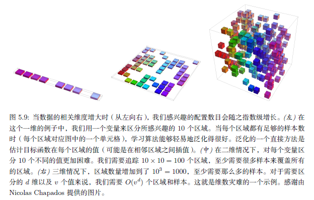

#### 5.11.2 局部不变性和平滑正则化

为了更好地泛化，机器学习算法需要由先验信念引导应该学习什么类型的函数。此前，我们已经看到过由模型参数的概率分布形成的先验。通俗地讲，我们也可以说先验信念直接影响函数本身，而不仅仅通过它们对函数的影响来间接改变参数。此外，我们还能通俗地说，先验信念还间接地体现在选择一些偏好某类函数的算法，尽管这些偏好并没有通过我们对不同函数置信程度的概率分布表现出来（也许根本没法表现）。

其中最广泛使用的隐式‘‘先验’’ 是**平滑先验**（smoothness prior），或**局部不变性先验**（local constancy prior）。这个先验表明我们学习的函数不应在小区域内发生很大的变化。

许多简单算法完全依赖于此先验达到良好的泛化，其结果是不能推广去解决人工智能级别任务中的统计挑战。本书中，我们将介绍深度学习如何引入额外的（显式或隐式的）先验去降低复杂任务中的泛化误差。这里，我们解释为什么仅依靠平滑先验不足以应对这类任务。

有许多不同的方法来显式或隐式地表示学习函数应该具有光滑或局部不变的先验。所有这些不同的方法都旨在鼓励学习过程能够学习出函数$f^*$，对于大多数设置x 和小变动ϵ，都满足条件

$f^*(x)=f^*(x+\epsilon)$

换言之，如果我们知道对应输入x 的答案（例如，x 是个有标签的训练样本），那么该答案对于x 的邻域应该也适用。如果在有些邻域中我们有几个好答案，那么我们可以组合它们（通过某种形式的平均或插值法）以产生一个尽可能和大多数输入一致的答案。

局部不变方法的一个极端例子是k-最近邻系列的学习算法。当一个区域里的所有点x 在训练集中的k 个最近邻是一样的，那么对这些点的预测也是一样的。当k = 1 时，不同区域的数目不会比训练样本还多。

虽然k-最近邻算法复制了附近训练样本的输出，大部分核机器也是在和附近训练样本相关的训练集输出上插值。一类重要的核函数是局部核（local kernel），其核函数k(u, v) 在u = v 时很大，当u 和v 距离拉大时而减小。局部核可以看作是执行模版匹配的相似函数，用于度量测试样本x 和每个训练样本x(i) 有多么相似。近年来深度学习的很多推动力源自研究局部模版匹配的局限性，以及深度学习如何克服这些局限性。

决策树也有平滑学习的局限性，因为它将输入空间分成和叶节点一样多的区间，并在每个区间使用单独的参数（或者有些决策树的拓展有多个参数）。如果目标函数需要至少拥有n 个叶节点的树才能精确表示，那么至少需要n 个训练样本去拟合。需要几倍于n 的样本去达到预测输出上的某种统计置信度。

总的来说，区分输入空间中O(k) 个区间，所有的这些方法需要O(k) 个样本。通常会有O(k) 个参数，O(1) 参数对应于O(k) 区间之一。最近邻算法中，每个训练样本至多用于定义一个区间，如图5.10 所示。

**有没有什么方法能表示区间数目比训练样本数目还多的复杂函数？显然，只是假设函数的平滑性不能做到这点。**例如，想象目标函数作用在西洋跳棋盘上。棋盘包含许多变化，但只有一个简单的结构。想象一下，如果训练样本数目远小于棋盘上的黑白方块数目，那么会发生什么。基于局部泛化和平滑性或局部不变性先验，如果新点和某个训练样本位于相同的棋盘方块中，那么我们能够保证正确地预测新点的颜色。但如果新点所在的方块没有训练样本，学习器不一定能举一反三。如果仅依靠这个先验，一个样本只能告诉我们它所在的方块的颜色。获得整个棋盘颜色的唯一方法是其上的每个方块至少要有一个样本。

只要在要学习的真实函数的峰值和谷值处有足够多的样本，那么平滑性假设和相关的无参数学习算法的效果都非常好。当要学习的函数足够平滑，并且只在少数几维变化，这样做一般没问题。在高维空间中，即使是非常平滑的函数，也会在不同维度上有不同的变化方式。如果函数在不同的区间中表现不一样，那么就非常难用一组训练样本去刻画函数。如果函数是复杂的（我们想区分多于训练样本数目的大量区间），有希望很好地泛化么？

这些问题，即是否可以有效地表示复杂的函数以及所估计的函数是否可以很好地泛化到新的输入，答案是有。关键观点是，只要我们通过额外假设生成数据的分布来建立区域间的依赖关系，那么O(k) 个样本足以描述多如O(2k) 的大量区间。通过这种方式，我们确实能做到非局部的泛化。为了利用这些优势，许多不同的深度学习算法都提出了一些适用于多种AI 任务的隐式或显式的假设。

**一些其他的机器学习方法往往会提出更强的，针对特定问题的假设。**例如，假设目标函数是周期性的，我们很容易解决棋盘问题。**通常，神经网络不会包含这些很强的（针对特定任务的）假设，因此神经网络可以泛化到更广泛的各种结构中。**人工智能任务的结构非常复杂，很难限制到简单的、人工手动指定的性质，如周期性，因此我们希望学习算法具有更通用的假设。深度学习的核心思想是假设数据由因素或特征组合产生，这些因素或特征可能来自一个层次结构的多个层级。许多其他类似的通用假设进一步提高了深度学习算法。这些很温和的假设允许了样本数目和可区分区间数目之间的指数增益。深度的分布式表示带来的指数增益有效地解决了维数灾难带来的挑战。

#### 5.11.3 流形学习

流形是一个机器学习中很多想法内在的重要概念。

流形（manifold）指连接在一起的区域。数学上，它是指一组点，且每个点都有其邻域。给定一个任意的点，其流形局部看起来像是欧几里得空间。日常生活中，我们将地球视为二维平面，但实际上它是三维空间中的球状流形。

每个点周围邻域的定义暗示着存在变换能够从一个位置移动到其邻域位置。例如在地球表面这个流形中，我们可以朝东南西北走。

尽管术语“流形’’ 有正式的数学定义，但是机器学习倾向于更松散地定义一组点，只需要考虑少数嵌入在高维空间中的自由度或维数就能很好地近似。每一维都对应着局部的变化方向。如图5.11 所示，训练数据位于二维空间中的一维流形中。在机器学习中，我们允许流形的维数从一个点到另一个点有所变化。这经常发生于流形和自身相交的情况中。例如，数字“8’’ 形状的流形在大多数位置只有一维，但在中心的相交处有两维。

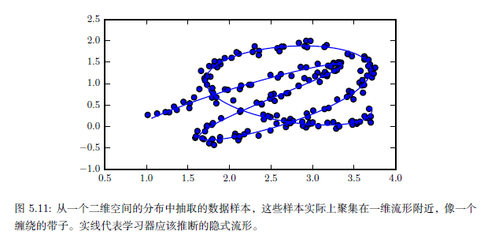

如果我们希望机器学习算法学习整个Rn 上有趣变化的函数，那么很多机器学习问题看上去都是无望的。流形学习（manifold learning）算法通过一个假设来克服这个障碍，**该假设认为Rn 中大部分区域都是无效的输入，有意义的输入只分布在包含少量数据点的子集构成的一组流形中，而学习函数的输出中，有意义的变化都沿着流形的方向或仅发生在我们切换到另一流形时。**流形学习最初用于连续数值和无监督学习的环境，尽管这个概率集中的想法也能够泛化到离散数据和监督学习的设定下：关键假设仍然是概率质量高度集中。

数据位于低维流形的假设并不总是对的或者有用的。我们认为在人工智能的一些场景中，如涉及到处理图像、声音或者文本时，流形假设至少是近似对的。这个假设的支持证据包含两类观察结果。

**第一个支持流形假设（manifold hypothesis）的观察是现实生活中的图像、文本、声音的概率分布都是高度集中的。均匀的噪声从来不会与这类领域的结构化输入类似。**图5.12 显示均匀采样的点看上去像是没有信号时模拟电视上的静态模式。

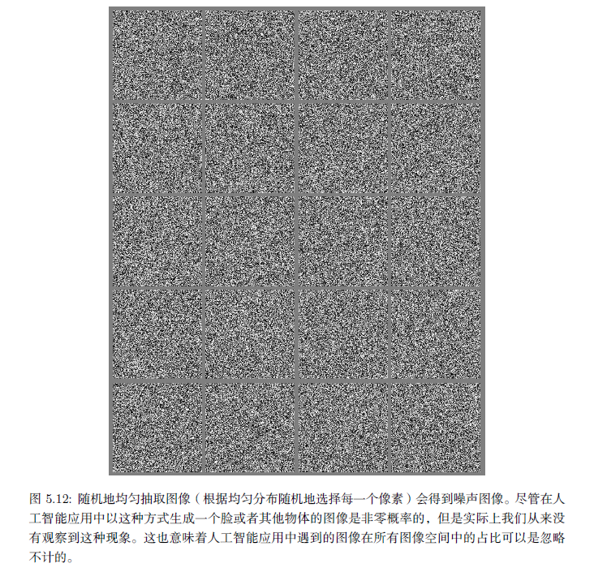

同样，如果我们均匀地随机抽取字母来生成文件，能有多大的概率得到一个有意义的英语文档？几乎是零。因为大部分字母长序列不对应着自然语言序列：自然语言序列的分布只占了字母序列的总空间里非常小的一部分。

**当然，集中的概率分布不足以说明数据位于一个相当小的流形中。我们还必须确保，我们遇到的样本和其他样本相互连接，每个样本被其他高度相似的样本包围，而这些高度相似的样本可以通过变换来遍历该流形得到。支持流形假设的第二个论点是，我们至少能够非正式地想象这些邻域和变换。**在图像中，我们当然会认为有很多可能的变换仍然允许我们描绘出图片空间的流形：我们可以逐渐变暗或变亮光泽、逐步移动或旋转图中对象、逐渐改变对象表面的颜色等等。在大多数应用中很有可能会涉及到多个流形。例如，人脸图像的流形不太可能连接到猫脸图像的流形。

这些支持流形假设的思维实验传递了一些支持它的直观理由。

**当数据位于低维流形中时，使用流形中的坐标而非Rn 中的坐标表示机器学习数据更为自然。**日常生活中，我们可以认为道路是嵌入在三维空间的一维流形。我们用一维道路中的地址号码确定地址，而非三维空间中的坐标。提取这些流形中的坐标是非常具有挑战性的，但是很有希望改进许多机器学习算法。这个一般性原则能够用在很多情况中。图5.13 展示了包含人脸的数据集的流形结构。

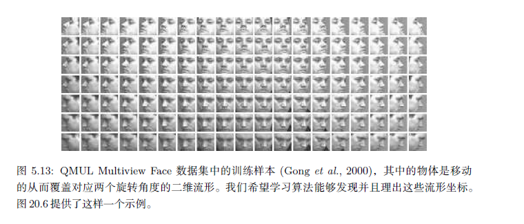