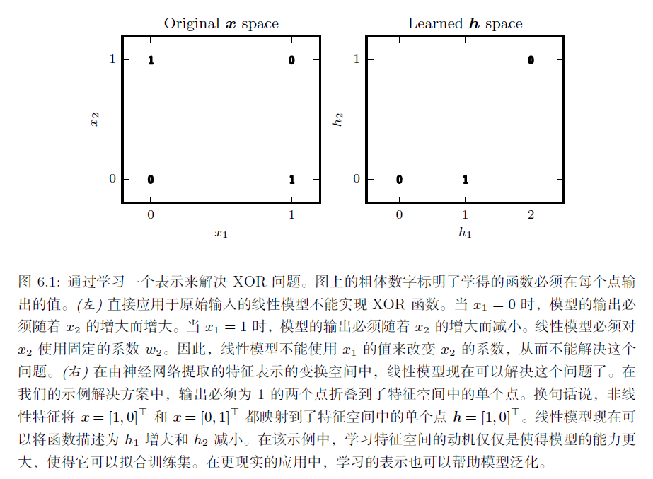
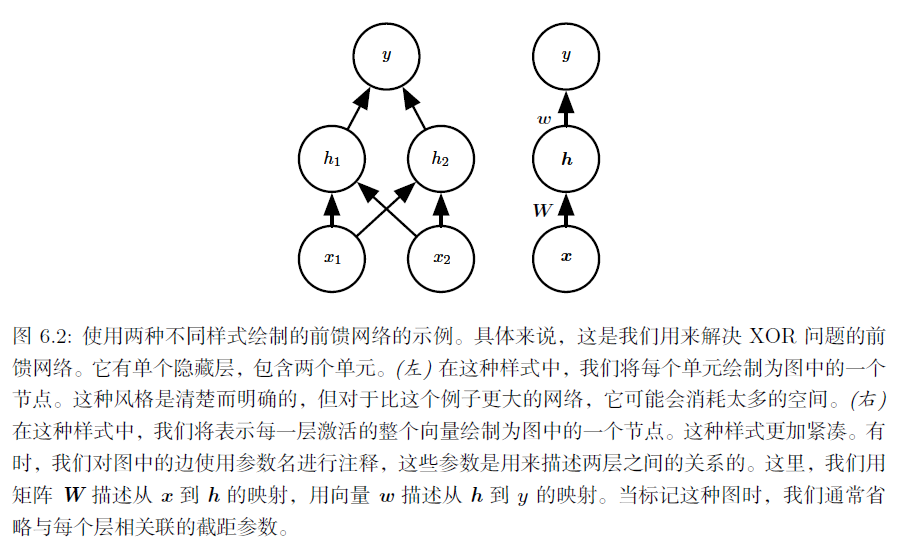
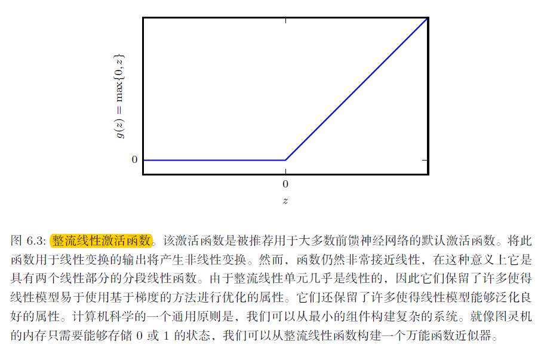
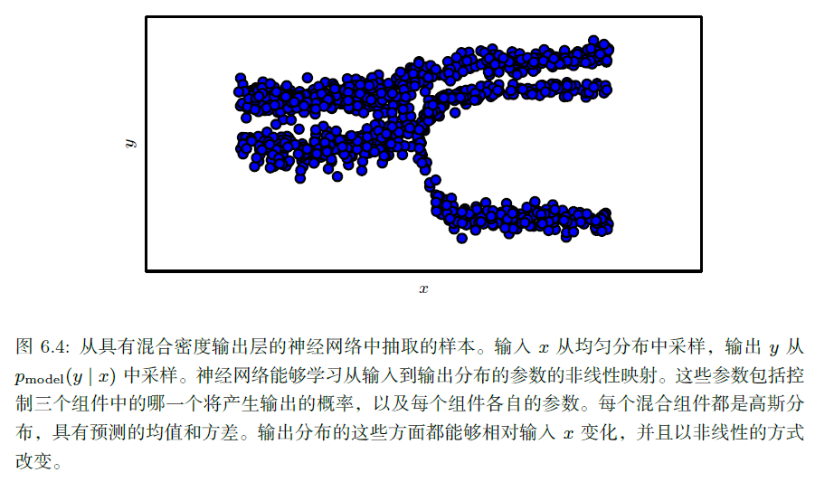

## 第六章 深度前馈网络

**深度前馈网络**（deep feedforward network），也叫作**前馈神经网络**（feedforward neural network）或者**多层感知机**（multilayer perceptron, MLP），是典型的深度学习模型。前馈网络的目标是近似某个函数$f^*$。例如，对于分类器，$y = f^*(x)$ 将输入x 映射到一个类别y。前馈网络定义了一个映射y = f(x; θ)，并且学习参数θ的值，使它能够得到最佳的函数近似。

前馈神经网络被称作**网络**（network）是因为它们通常用许多不同函数复合在一起来表示。该模型与一个有向无环图相关联，而图描述了函数是如何复合在一起的。例如，我们有三个函数$f^{(1)}, f^{(2)}, f^{(3)}$连接在一个链上以形成$f(x) = f^{(3)}(f^{(2)}(f^{(1)}(x)))$。这些链式结构是神经网络中最常用的结构。在这种情况下，$f^{(1)}$ 被称为网络的**第一层**（first layer），$f^{(2)}$  被称为**第二层**（second layer），以此类推。链的全长称为模型的**深度**（depth）。正是因为这个术语才出现了‘‘深度学习’’ 这个名字。前馈网络的最后一层被称为**输出层**（output layer）。

在神经网络训练的过程中，我们让$f(x)$去匹配$f^*(x)$的值，训练数据为我们提供了在不同训练点上取值的、含有噪声的$f^*(x)$的近似实例。每个样本x都伴随着一个标签$y\approx f^*(x)$。训练样本直接指明了输出层在每一点x上必须做什么：它必须产生一个接近y的值。但是没有直接指明其他层应该怎么做，学习算法必须决定如何使用这些层来产生想要的输出。因为训练数据并没有给出这些层中的每一层所需的输出，所以这些层被称为**隐藏层**（hidden layer）。

网络中的每个隐藏层通常都是向量值的。这些隐藏层的维数决定了模型的**宽度**（width）。

线性模型，例如逻辑回归和线性回归，是非常吸引人的，因为无论是通过闭解形式还是使用凸优化，它们都能高效且可靠地拟合。线性模型也有明显的缺陷，那就是该模型的能力被局限在线性函数里，所以它无法理解任何两个输入变量间的相互作用。

为了扩展线性模型来表示x 的非线性函数，我们可以不把线性模型用于x 本身，而是用在一个变换后的输入ϕ(x) 上，这里ϕ 是一个非线性变换。同样，我们可以使用第5.7.2 节中描述的核技巧，来得到一个基于隐含地使用ϕ 映射的非线性学习算法。我们可以认为ϕ 提供了一组描述x 的特征，或者认为它提供了x 的一个新的表示。

剩下的问题就是如何选择映射ϕ。

1. 其中一种选择是使用一个通用的ϕ，例如无限维的ϕ，它隐含地用在基于RBF 核的核机器上。如果ϕ(x) 具有足够高的维数，我们总是有足够的能力来拟合训练集，但是对于测试集的泛化往往不佳。非常通用的特征映射通常只基于局部光滑的原则，并且没有将足够的先验信息进行编码来解决高级问题。
2. 另一种选择是手动地设计ϕ。但是从业者各自擅长特定的领域（如语音识别或计算机视觉），并且不同领域之间很难迁移(transfer)。
3. 深度学习的策略是去学习ϕ。在这种方法中，我们有一个模型y = f(x; θ,w) =$ϕ(x; θ)^⊤w$。我们现在有两种参数：用于从一大类函数中学习ϕ 的参数θ，以及用于将ϕ(x) 映射到所需的输出的参数w。这是深度前馈网络的一个例子，其中ϕ 定义了一个隐藏层。这是三种方法中唯一一种放弃了训练问题的凸性的，但是利大于弊。在这种方法中，我们将表示参数化为ϕ(x; θ)，并且使用优化算法来寻找θ，使它能够得到一个好的表示。如果我们想要的话，这种方法也可以通过使它变得高度通用以获得第一种方法的优点——我们只需使用一个非常广泛的函数族ϕ(x; θ)。这种方法也可以获得第二种方法的优点。人类专家可以将他们的知识编码进网络来帮助泛化，他们只需要设计那些他们期望能够表现优异的函数族ϕ(x; θ) 即可。这种方法的优点是人类设计者只需要寻找正确的函数族即可，而不需要去寻找精确的函数。

### 6.1 实例：学习XOR

XOR 函数（‘‘异或’’ 逻辑）是两个二进制值x1 和x2 的运算。当这些二进制值中恰好有一个为1 时，XOR 函数返回值为1。其余情况下返回值为0。

在这个简单的例子中，我们不会关心统计泛化。我们希望网络在这四个点$X = \{[0, 0]^⊤, [0, 1]^⊤, [1, 0]^⊤, [1, 1]^⊤\}$ 上表现正确。我们会用全部这四个点来训练我们的网络，唯一的挑战是拟合训练集。

我们可以把这个问题当作是回归问题，并使用均方误差损失函数。我们选择这个损失函数是为了尽可能简化本例中用到的数学。

评估整个训练集上表现的MSE 损失函数为：

$J(\theta)=\frac 14 \sum_{x\in X}(f^*(x)-f(x;\theta))^2$

假设我们选择一个线性模型，定义成：

$f(x;w,b)=x^Tw+b$

我们可以使用正规方程关于w和b最小化$J(\theta)$，来得到一个闭式解：w=0, b=1/2。线性模型在任意一点都输出0.5。为什么会发生这种事？图6.1 演示了线性模型为什么不能用来表示XOR 函数。解决这个问题的其中一种方法是使用一个模型来学习一个不同的特征空间，在这个空间上线性模型能够表示这个解。

具体来说，我们这里引入一个非常简单的前馈神经网络，它有一层隐藏层并且隐藏层中包含两个单元。见图6.2 中对该模型的解释。

我们必须用非线性函数来描述这些特征。大多数神经网络通过仿射变换之后紧跟着一个被称为激活函数的固定非线性函数来实现这个目标。，默认的推荐是使用由激活函数g(z) = maxf{0, z}定义的**整流线性单元**（rectified linear unit）或者称为**ReLU** (Jarrett et al., 2009b; Nair and Hinton, 2010a; Glorot et al., 2011a)，如图6.3 所示。

我们的整个网络是

$f(x; W, c, w, b) = w^T\,max\{0, W^Tx+c\}+b$

我们可以给出XOR问题的一个解。令

$W=[[1, 1]^T, [1, 1]^T], c=[0, -1], w=[1, -2], b=0$

在结合之前给的X矩阵，代入计算，可以发现神经网络对每个样本都给出了正确的结果。

在这个例子中，我们简单地指定了解决方案，然后说明它得到的误差为零。在实际情况中，可能会有数十亿的模型参数以及数十亿的训练样本，所以不能像我们这里做的那样进行简单地猜解。与之相对的，基于梯度的优化算法可以找到一些参数使得产生的误差非常小。我们这里给出的XOR 问题的解处在损失函数的全局最小点，所以梯度下降算法可以收敛到这一点。梯度下降算法还可以找到XOR 问题一些其他的等价解。**梯度下降算法的收敛点取决于参数的初始值。**在实践中，梯度下降通常不会找到像我们这里给出的那种干净的、容易理解的、整数值的解。

### 6.2 基于梯度的学习

我们到目前为止看到的线性模型和神经网络的最大区别，在于**神经网络的非线性导致大多数我们感兴趣的代价函数都变得非凸**。这意味着神经网络的训练通常使用迭代的、基于梯度的优化，仅仅使得代价函数达到一个非常小的值；而不是像用于训练线性回归模型的线性方程求解器，或者用于训练逻辑回归或SVM 的凸优化算法那样保证全局收敛。凸优化从任何一种初始参数出发都会收敛（理论上如此——在实践中也很鲁棒但可能会遇到数值问题）。用于非凸损失函数的随机梯度下降没有这种收敛性保证，并且对参数的初始值很敏感。对于前馈神经网络，**将所有的权重值初始化为小随机数是很重要的。偏置可以初始化为零或者小的正值**。

我们当然也可以用梯度下降来训练诸如线性回归和支持向量机之类的模型，并且**事实上当训练集相当大时这是很常用的**。从这点来看，训练神经网络和训练其他任何模型并没有太大区别。计算梯度对于神经网络会略微复杂一些，但仍然可以很高效而精确地实现。

和其他的机器学习模型一样，为了使用基于梯度的学习方法我们必须选择一个代价函数，并且我们必须选择如何表示模型的输出。

#### 6.2.1 代价函数

神经网络的代价函数或多或少是和其他的参数模型例如线性模型的代价函数相同的。

##### 6.2.1.1 使用最大似然学习条件分布

大多数现代的神经网络使用最大似然来训练。这意味着代价函数就是负的对数似然，它与训练数据和模型分布间的交叉熵等价。这个代价函数表示为

$J(\theta)=-E_{x,y\sim \hat p_{data}}log\, p_{model}(y|x)$

代价函数的具体形式随着模型而改变，取决于$log\,p_{model}$ 的具体形式。

使用最大似然来导出代价函数的方法的一个优势是，它减轻了为每个模型设计代价函数的负担。明确一个模型p(y | x) 则自动地确定了一个代价函数log p(y | x)。

**贯穿神经网络设计的一个反复出现的主题是代价函数的梯度必须足够的大和具有足够的预测性，来为学习算法提供一个好的指引。**饱和（变得非常平）的函数破坏了这一目标，因为它们把梯度变得非常小。这在很多情况下都会发生，因为用于产生隐藏单元或者输出单元的输出的激活函数会饱和。负的对数似然帮助我们在很多模型中避免这个问题。很多输出单元都会包含一个指数函数，这在它的变量取绝对值非常大的负值时会造成饱和。负对数似然代价函数中的对数函数消除了某些输出单元中的指数效果。

用于实现最大似然估计的交叉熵代价函数有一个不同寻常的特性，那就是**当它被应用于实践中经常遇到的模型时，它通常没有最小值**。对于离散型输出变量，大多数模型以一种特殊的形式来参数化，即它们不能表示概率零和一，但是可以无限接近。逻辑回归是其中一个例子。对于实值的输出变量，如果模型可以控制输出分布的密度（例如，通过学习高斯输出分布的方差参数），那么它可能对正确的训练集输出赋予极其高的密度，这将导致交叉熵趋向负无穷。第七章中描述的正则化技术提供了一些不同的方法来修正学习问题，使得模型不会通过这种方式来获得无限制的收益。

##### 6.2.1.2 学习条件统计量

有时我们并不是想学习一个完整的概率分布p(y | x; θ)，而仅仅是想学习在给定x 时y 的某个条件统计量。

例如，我们可能有一个预测器f(x; )，我们想用它来预测y 的均值。如果我们使用一个足够强大的神经网络，我们可以认为这个神经网络能够表示一大类函数中的任何一个函数f，这个类仅仅被一些特征所限制，例如连续性和有界，而不是具有特殊的参数形式。从这个角度来看，我们可以把代价函数看作是一个泛函（functional）而不仅仅是一个函数。**泛函是函数到实数的映射。**我们因此可以将学习看作是选择一个函数而不仅仅是选择一组参数。我们可以设计代价泛函在我们想要的某些特殊函数处取得最小值。例如，我们可以设计一个代价泛函，使它的最小值处于一个特殊的函数上，这个函数将x 映射到给定x 时y 的期望值。对函数求解优化问题需要用到**变分法**（calculus of variations）这个数学工具，我们将在第19.4.2 节中讨论。

我们使用变分法导出的第一个结果是解优化问题

$f^*=\arg\min_f E_{x,y\sim p_{data}}||y-f(x)||^2$

得到

$f^*(x)=E_{y\sim p_{data}(y|x)}[y]$

要求这个函数处在我们要优化的类里。换句话说，如果我们能够用无穷多的、来源于真实的数据生成分布的样本进行训练，最小化均方误差代价函数将得到一个函数，它可以用来对每个x 的值预测出y 的均值。

不同的代价函数给出不同的统计量。第二个使用变分法得到的结果是

$f^*=\arg\min_f E_{x,y\sim p_{data}}||y-f(x)||_1$

将得到一个函数可以对每个x 预测y 取值的中位数，只要这个函数在我们要优化的函数族里。这个代价函数通常被称为**平均绝对误差**（mean absolute error）。

可惜的是，均方误差和平均绝对误差在使用基于梯度的优化方法时往往成效不佳。一些饱和的输出单元当结合这些代价函数时会产生非常小的梯度。这就是为什么交叉熵代价函数比均方误差或者平均绝对误差更受欢迎的原因之一了，即使是在没必要估计整个p(y | x) 分布时。

#### 6.2.2 输出单元

任何可用作输出的神经网络单元，也可以被用作隐藏单元。

##### 6.2.2.1 用于高斯输出分布的线性单元

给定特征$h$，线性输出单元层产生一个向量$\hat y = W^Th+b$

线性输出层经常被用来产生条件高斯分布的均值：

$p(y|x)=N(y;\hat y, I)$

最大化其对数似然此时等价于最小化均方误差。

最大似然框架也使得学习高斯分布的协方差矩阵更加容易，或更容易地使高斯分布的协方差矩阵作为输入的函数。然而，对于所有输入，协方差矩阵都必须被限定成一个正定矩阵。线性输出层很难满足这种限定，所以通常使用其他的输出单元来对协方差参数化。

因为线性模型不会饱和，所以它们易于采用基于梯度的优化算法，甚至可以使用其他多种优化算法。

##### 6.2.2.2 用于Bernoulli输出分布的sigmoid单元

许多任务需要预测二值型变量y的值。

此时最大似然的方法是定义y在x条件下的Bernoulli分布。

Bernoulli分布仅需单个参数来定义。神经网络只需要预测P(y=1|x)即可，为了使这个数是有效的概率，它必须处在区间[0,1]中。

假设我们打算使用线性单元，并且通过阈值来限制它成为一个有效的概率：

$P(y=1|x)=max\{0, min\{1,w^Th+b\}\}$

这的确定义了一个有效的条件概率分布，但我们无法使用梯度下降来高效地训练它。当$w^Th+b$处于单位区间外时，模型的输出对其参数的梯度都将为0.梯度为0通常是有问题的，因为学习算法对于如何改善相应的参数不再具有指导意义。

相反，最好是使用一种新的方法来保证无论何时模型给出了错误的答案时，总能有一个较大的梯度。这种方法是基于使用sigmoid 输出单元结合最大似然来实现的。

sigmoid 输出单元定义为

$\hat y =\sigma(w^Th+b)$

其中$\sigma$是logistic sigmoid函数(第3.10节介绍的)。

我们可以认为sigmoid 输出单元具有两个部分。首先，它使用一个线性层来计算$z = w^⊤h + b$。接着，它使用sigmoid 激活函数将z 转化成概率。

那么是如何用z 的值来定义y 的概率分布的呢？总的来说，通过构造一个非归一化（和不为1）的概率分布$\tilde P(y)$ 可以得到sigmoid 。随后除以一个合适的常数就能得到有效的概率分布。

我们假定非归一化概率的对数对y和z是线性的，可以取指数来得到非归一化的概率。然后我们对它归一化，可以发现这服从Bernoulli分布，该分布受z的sigmoid变换控制：
$$
log\tilde P(y)=yz,\\
\tilde P(y)=exp(yz),\\
P(y)=\frac{exp(yz)}{\sum_{y'=0}^1 exp(y'z)},\\
P(y)=\sigma((2y-1)z)
$$
基于指数和归一化的概率分布在统计建模的文献中很常见。用于定义这种二值型变量分布的变量z 被称为**分对数**（logit）。

这种在对数空间里预测概率的方法可以很自然地使用最大似然学习。因为用于最大似然的代价函数是-log P(y | x)，代价函数中的log 抵消了sigmoid 中的exp。如果没有这个效果，sigmoid 的饱和性会阻止基于梯度的学习做出好的改进。我们使用最大似然来学习一个由sigmoid 参数化的Bernoulli 分布，它的损失函数为
$$
J(\theta)=-logP(y|x)=-log\sigma((2y-1)z)=\zeta((1-2y)z)
$$
通过将损失函数写成softplus 函数的形式，我们可以看到它仅仅在(1 - 2y)z 取绝对值非常大的负值时才会饱和。因此饱和只会出现在模型已经得到正确答案时——当y = 1 且z 取非常大的正值时，或者y = 0 且z 取非常小的负值时。当z 的符号错误时，softplus 函数的变量(1 - 2y)z可以简化为|z|。当|z| 变得很大并且z 的符号错误时，softplus 函数渐近地趋向于它的变量|z|。对z 求导则渐近地趋向于sign(z)，所以，对于极限情况下极度不正确的z，softplus 函数完全不会收缩梯度。这个性质很有用，因为它意味着基于梯度的学习可以很快地改正错误的z。

当我们使用其他的损失函数，例如均方误差之类的，损失函数会在σ(z) 饱和时饱和。sigmoid 激活函数在z 取非常小的负值时会饱和到0，当z 取非常大的正值时会饱和到1。这种情况一旦发生，梯度会变得非常小以至于不能用来学习，无论此时模型给出的是正确还是错误的答案。因此，**最大似然几乎总是训练sigmoid 输出单元的优选方法**。

理论上，sigmoid 的对数总是确定和有限的，因为sigmoid 的返回值总是被限制在开区间(0, 1) 上，而不是使用整个闭区间[0, 1] 的有效概率。在软件实现时，为了避免数值问题，最好将负的对数似然写作z 的函数，而不是$\hat y = \sigma(z) $的函数。如果sigmoid 函数下溢到零，那么之后对$\hat y$ 取对数会得到负无穷。

##### 6.2.2.3 用于Multinoulli输出分布的softmax单元

任何时候当我们想要表示一个具有n 个可能取值的离散型随机变量的分布时，我们都可以使用softmax 函数。它可以看作是sigmoid 函数的扩展，其中sigmoid 函数用来表示二值型变量的分布。

softmax 函数最常用作分类器的输出，来表示n 个不同类上的概率分布。比较少见的是，softmax 函数可以在模型内部使用，例如如果我们想要在某个内部变量的n 个不同选项中进行选择。

在二值型变量的情况下，我们希望计算一个单独的数$\hat y=P(y=1|x)$，因为这个数需要处在0 和1 之间，并且我们想要让这个数的对数可以很好地用于对数似然的基于梯度的优化，我们选择去预测另外一个数$z = log \hat P(y = 1 | x)$。对其指数化和归一化，我们就得到了一个由sigmoid 函数控制的Bernoulli 分布。

为了推广到具有n 个值的离散型变量的情况，我们现在需要创造一个向量$\hat y$，它的每个元素是$\hat y_i = P(y = i | x)$。我们不仅要求每个$\hat y_i$ 元素介于0 和1 之间，还要使得整个向量的和为1，使得它表示一个有效的概率分布。用于Bernoulli 分布的方法同样可以推广到Multinoulli 分布。首先，线性层预测了未归一化的对数概率：

$z=W^Th+b$

其中$z_i=log\hat P(y=i|x)$。softmax函数然后可以对z指数化和归一化来获得需要的$\hat y$。最终，softmax函数的形式为

$softmax(z)_i=\frac{exp(z_i)}{\sum_j exp(z_j)}$

和logistic sigmoid一样，当使用最大化对数似然训练softmax 来输出目标值y时，使用指数函数工作地非常好。这种情况下，我们想要最大化$log P(y = i; z) =log\,softmax(z)_i$。将softmax 定义成指数的形式是很自然的因为对数似然中的log 可以抵消softmax 中的exp：

$log\,softmax(z)_i=z_i-log\sum_j exp(z_j)$

第一项表示输入$z_i$ 总是对代价函数有直接的贡献。因为这一项不会饱和，所以即使$z_i$ 对第二项的贡献很小，学习依然可以进行。当最大化对数似然时，第一项鼓励$z_i$ 被推高，而第二项则鼓励所有的z 被压低。为了对第二项有一个直观的理解，注意到这一项可以大致近似为$max_j z_j$。这种近似是基于对任何明显小于$max_j z_j$的$z_k$，$exp(z_k)$ 都是不重要的。我们能从这种近似中得到的直觉是，负对数似然代价函数总是强烈地惩罚最活跃的不正确预测。如果正确答案已经具有了softmax 的最大输入，那么$- z_j$项和$logΣ_j exp(z_j) \approx max_j z_j = z_i$项将大致抵消。这个样本对于整体训练代价贡献很小，这个代价主要由其他未被正确分类的样本产生。

总体来说，未正则化的最大似然会驱动模型去学习一些参数，而这些参数会驱动softmax 函数来预测在训练集中观察到的每个结果的比率：

$softmax(z(x; \theta))_i \approx \frac{\sum_{j=1}^m 1_{ y(j)=i, x(j)=x} }{\sum_{j=1}^m 1_{x(j)=x}}$
因为最大似然是一致的估计量，所以只要模型族能够表示训练的分布，这就能保证发生。在实践中，有限的模型能力和不完美的优化将意味着模型只能近似这些比率。

除了对数似然之外的许多目标函数对softmax 函数不起作用。具体来说，那些不使用对数来抵消softmax 中的指数的目标函数，当指数函数的变量取非常小的负值时会造成梯度消失，从而无法学习。特别是，平方误差对于softmax 单元来说是一个很差的损失函数，即使模型做出高度可信的不正确预测，也不能训练模型改变其输出。

像sigmoid 一样，softmax 激活函数可能会饱和。sigmoid 函数具有单个输出，当它的输入极端负或者极端正时会饱和。对于softmax 的情况，它有多个输出值。当输入值之间的差异变得极端时，这些输出值可能饱和。当softmax 饱和时，基于softmax 的许多代价函数也饱和，除非它们能够转化饱和的激活函数。

为了说明softmax 函数对于输入之间差异的响应，观察到当对所有的输入都加上一个相同常数时softmax 的输出不变：

$softmax(z)=softmax(z+c)$

使用这个性质，我们可以导出一个数值方法稳定的softmax 函数的变体：

$softmax(z)=softmax(z-max_iz_i)$

变换后的形式允许我们在对softmax 函数求值时只有很小的数值误差，即使是当z包含极正或者极负的数时.

softmax 函数的变量z 可以通过两种方式产生。最常见的是简单地使神经网络较早的层输出z 的每个元素，就像先前描述的使用线性层$z = W^⊤h + b$。虽然很直观，但这种方法是对分布的过度参数化。n 个输出总和必须为1 的约束意味着只有n-1 个参数是必要的；第n 个概率值可以通过1 减去前面n-1 个概率来获得。因此，我们可以强制要求z 的一个元素是固定的。例如，我们可以要求$z_n = 0$。事实上，这正是sigmoid 单元所做的。定义$P(y = 1 | x) = \sigma(z) $等价于用二维的z 以及$z_1 = 0$ 来定义$P(y = 1 | x) = softmax(z)_1$。无论是n - 1 个变量还是n 个变量的方法，都描述了相同的概率分布，但会产生不同的学习机制。在实践中，无论是过度参数化的版本还是限制的版本都很少有差别，并且实现过度参数化的版本更为简单。

从神经科学的角度看，有趣的是认为softmax 是一种在参与其中的单元之间形成竞争的方式：softmax 输出总是和为1，所以一个单元的值增加必然对应着其他单元值的减少。这与被认为存在于皮质中相邻神经元间的侧抑制类似。在极端情况下（当最大的ai 和其他的在幅度上差异很大时），它变成了赢者通吃（winner-take-all）的形式（其中一个输出接近1，其他的接近0）。

##### 6.2.2.4 其他的输出类型

最大似然原则给如何为几乎任何种类的输出层设计一个好的代价函数提供了指导。

一般的，如果我们定义了一个条件分布$p(y | x; \theta)$，最大似然原则建议我们使用$-log\,p(y | x; \theta)$作为代价函数。

一般来说，我们可以认为神经网络表示函数$f(x; \theta)$。这个函数的输出不是对y值的直接预测。相反，$f(x; \theta) = w$ 提供了y 分布的参数。我们的损失函数就可以表示成$log\, p(y;w(x))$。

例如，我们想要学习在给定x 时，y 的条件高斯分布的方差。简单情况下，方差$\sigma^2$ 是一个常数，此时有一个解析表达式，这是因为方差的最大似然估计量仅仅是观测值y 与它们的期望值的差值的平方平均。

一种计算上代价更加高但是不需要写特殊情况代码的方法是简单地将方差作为分布p(y | x) 的其中一个属性，这个分布由$w = f(x; \theta)$ 控制。负对数似然$-log\, p(y;w(x))$ 将为代价函数提供一个必要的合适项来使我们的优化过程可以逐渐地学到方差。在标准差不依赖于输入的简单情况下，我们可以在网络中创建一个直接复制到$w$中的新参数。这个新参数可以是$\sigma$ 本身，或者可以是表示$\sigma^2$ 的参数v，或者可以是表示$1/\sigma^2$ 的参数，取决于我们怎样对分布参数化。我们可能希望模型对不同的x 值预测出y 不同的方差。这被称为**异方差**（heteroscedastic）模型。在异方差情况下，我们简单地把方差指定为$f(x; \theta)$其中一个输出值。实现它的典型方法是使用精度而不是方差来表示高斯分布。在多维变量的情况下，最常见的是使用一个对角精度矩阵

$diag(\beta)$

这个公式适用于梯度下降，因为由 $\beta$参数化的高斯分布的对数似然的公式仅涉及$\beta_i$的乘法和$log\,\beta_i$ 的加法。乘法、加法和对数运算的梯度表现良好。相比之下，如果我们用方差来参数化输出，我们需要用到除法。除法函数在零附近会变得任意陡峭。虽然大梯度可以帮助学习，但任意大的梯度通常导致不稳定。如果我们用标准差来参数化输出，对数似然仍然会涉及除法，并且还将涉及平方。通过平方运算的梯度可能在零附近消失，这使得学习被平方的参数变得困难。无论我们使用的是标准差，方差还是精度，我们必须确保高斯分布的协方差矩阵是正定的。因为精度矩阵的特征值是协方差矩阵特征值的倒数，所以这等价于确保精度矩阵是正定的。如果我们使用对角矩阵，或者是一个常数乘以单位矩阵，那么我们需要对模型输出强加的唯一条件是它的元素都为正。如果我们假设a 是用于确定对角精度的模型的原始激活，那么可以用softplus 函数来获得正的精度向量：$\beta =\zeta (a)$。这种相同的策略对于方差或标准差同样适用，也适用于常数乘以单位阵的情况。

学习一个比对角矩阵具有更丰富结构的协方差或者精度矩阵是很少见的。如果协方差矩阵是满的和有条件的，那么参数化的选择就必须要保证预测的协方差矩阵是正定的。这可以通过写成$\sum(x) = B(x)B^⊤(x)$ 来实现，这里B 是一个无约束的方阵。如果矩阵是满秩的，那么一个实际问题是计算似然的代价是很高的，计算一个d x d 的矩阵的行列式或者$\sum(x) $的逆（或者等价地并且更常用地，对它特征值分解或者B(x) 的特征值分解）需要$O(d^3)$ 的计算量。

我们经常想要执行多峰回归(multimodal regression)，即预测条件分布p(y | x)的实值，该条件分布对于相同的x 值在y 空间中有多个不同的峰值。在这种情况下，高斯混合是输出的自然表示。将高斯混合作为其输出的神经网络通常被称为**混合密度网络**（mixture density network）。具有n 个分量的高斯混合输出由下面的条件分布定义：

$p(y|x)=\sum_{i=1}^np(c=i|x)N(y;\mu^{(i)}(x),\sum^{(i)}(x))$

神经网络必须有三个输出：定义p(c = i | x) 的向量，对所有的i 给出$\mu^{(i)}(x)$ 的矩阵，以及对所有的i 给出$\sum^{(i)}(x)$ 的张量。这些输出必须满足不同的约束：
1. 混合组件p(c = i | x)：它们由潜变量 c 关联着，在n 个不同组件上形成Multinoulli 分布。这个分布通常可以由n 维向量的softmax 来获得，以确保这些输出是正的并且和为1。
2. 均值$\mu^{(i)}(x)$：它们指明了与第i 个高斯组件相关联的中心或者均值，并且是无约束的（通常对于这些输出单元完全没有非线性）。如果y 是个d 维向量，那么网络必须输出一个由n 个这种d 维向量组成的nxd 的矩阵。用最大似然来学习这些均值要比学习只有一个输出模式的分布的均值稍稍复杂一些。我们只想更新那个真正产生观测数据的组件的均值。在实践中，我们并不知道是哪个组件产生了观测数据。负对数似然表达式将每个样本对每个组件的贡献进行赋权，权重的大小由相应的组件产生这个样本的概率来决定。
3. 协方差$\sum^{(i)}(x)$：它们指明了每个组件i 的协方差矩阵。和学习单个高斯组件时一样，我们通常使用对角矩阵来避免计算行列式。和学习混合均值时一样，最大似然是很复杂的，它需要将每个点的部分责任分配给每个混合组件。如果给定了混合模型的正确的负对数似然，梯度下降将自动地遵循正确的过程。

有报告说基于梯度的优化方法对于混合条件高斯（作为神经网络的输出）可能是不可靠的，部分是因为涉及到除法（除以方差）可能是数值不稳定的（当某个方差对于特定的实例变得非常小时，会导致非常大的梯度）。一种解决方法是**梯度截断**（clip gradient），另外一种是启发式缩放度。

高斯混合输出在语音生成模型(Schuster, 1999) 和物理运动(Graves, 2013) 中特别有效。混合密度策略为网络提供了一种方法来表示多种输出模式，并且控制输出的方差，这对于在这些实数域中获得高质量的结果是至关重要的。混合密度网络的一个实例如图6.4 所示。

一般的，我们可能希望继续对包含更多变量的、更大的向量y 来建模，并在这些输出变量上施加更多更丰富的结构。例如，我们可能希望神经网络输出字符序列形成一个句子。在这些情况下，我们可以继续使用最大似然原理应用到我们的模型$p(y;w(x))$ 上，但我们用来描述y 的模型会变得非常复杂，超出了本章的范畴。第十章描述了如何使用循环神经网络来定义这种序列上的模型，第三部分描述了对任意概率分布进行建模的高级技术。

### 6.3 隐藏单元

通常不可能预先预测出哪种隐藏单元工作得最好。设计过程充满了试验和错误，先直觉认为某种隐藏单元可能表现良好，然后用它组成神经网络进行训练，最后用验证集来评估它的性能。

大多数的隐藏单元都可以描述为接受输入向量x，计算仿射变换$z = W^⊤x + b$，然后使用一个逐元素的非线性函数g(z)。

#### 6.3.1 整流线性单元及其扩展

整流线性单元使用激活函数$g(z)=max\{0,z\}$。

整流线性单元易于优化，因为它们和线性单元非常类似。只要整流线性单元处于激活状态，它的导数都能保持较大。它的梯度不仅大而且一致。整流操作的二阶导数几乎处处为0，并且在整流线性单元处于激活状态时，它的一阶导数处处为1。这意味着相比于引入二阶效应的激活函数来说，它的梯度方向对于学习来说更加有用。

当初始化仿射变换的参数时，可以将b 的所有元素设置成一个小的正值，例如0.1。这使得整流线性单元很可能初始时就对训练集中的大多数输入呈现激活状态，并且允许导数通过。

整流线性单元的一个缺陷是它们不能通过基于梯度的方法学习那些使它们激活为零的样本。整流线性单元的各种扩展保证了它们能在各个位置都接收到梯度。

整流线性单元的三个扩展基于当$z_i<0$时使用一个非零的斜率：

$\alpha_i: h_i=g(z,\alpha)_i=max(0,z_i)+\alpha_imin(0,z_i)$。

**绝对值整流**（absolute value rectification）固定$\alpha_i=-1$ 来得到g(z) = |z|。它用于图像中的对象识别(Jarrett et al., 2009a)，其中寻找在输入照明极性反转下不变的特征是有意义的。整流线性单元的其他扩展比这应用地更广泛。**渗漏整流线性单元**（Leaky ReLU）(Maas et al., 2013) 将$\alpha_i$ 固定成一个类似0.01 的小值， **参数化整流线性单元**（parametric ReLU）或者PReLU 将$\alpha_i$ 作为学习的参数(He et al., 2015)。

**maxout 单元**（maxout unit）(Goodfellow et al., 2013a) 进一步扩展了整流线性单元。maxout 单元将z 划分为每组具有k 个值的组，而不是使用作用于每个元素的函数g(z)。每个maxout 单元则输出每组中的最大元素：

$g(z)_i = max_{j\in G^{(i)}}z_j$

这里$G^{(i)}$是组i的输入索引集{(i-1)k+1, ..., ik}。这提供了一种方法来学习对输入x空间中多个方向响应的分段线性函数。

maxout 单元可以学习具有多达k 段的分段线性的凸函数。maxout 单元因此可以视为学习激活函数本身而不仅仅是单元之间的关系。使用足够大的k，maxout 单元可以以任意的精确度来近似任何凸函数。特别地，具有两块的maxout 层可以学习实现和传统层相同的输入x 的函数，这些传统层可以使用整流线性激活函数、绝对值整流、渗漏整流线性单元或参数化整流线性单元，或者可以学习实现与这些都不同的函数。maxout 层的参数化当然也将与这些层不同，所以即使是maxout 学习去实现和其他种类的层相同的x 的函数这种情况下，学习的机理也是不一样的。

每个maxout 单元现在由k 个权重向量来参数化，而不仅仅是一个，所以maxout单元通常比整流线性单元需要更多的正则化。如果训练集很大并且每个单元的块数保持很低的话，它们可以在没有正则化的情况下工作得不错(Cai et al., 2013)。

maxout 单元还有一些其他的优点。在某些情况下，要求更少的参数可以获得一些统计和计算上的优点。具体来说，如果由n 个不同的线性过滤器描述的特征可以在不损失信息的情况下，用每一组k 个特征的最大值来概括的话，那么下一层可以获得k 倍更少的权重数。

因为每个单元由多个过滤器驱动，maxout 单元具有一些冗余来帮助它们抵抗一种被称为**灾难遗忘**（catastrophic forgetting）的现象，这个现象是说神经网络忘记了如何执行它们过去训练的任务(Goodfellow et al., 2014a)。

整流线性单元和它们的这些扩展都是基于一个原则，那就是如果它们的行为更接近线性，那么模型更容易优化。使用线性行为更容易优化的一般性原则同样也适用于除深度线性网络以外的情景。循环网络可以从序列中学习并产生状态和输出的序列。当训练它们时，需要通过一些时间步来传播信息，当其中包含一些线性计算（具有大小接近1 的某些方向导数）时，这会更容易。作为性能最好的循环网络结构之一，LSTM 通过求和在时间上传播信息，这是一种特别直观的线性激活。

#### 6.3.2 logistic sigmoid与双曲正切函数

logistic sigmoid激活函数：$g(z)=\sigma(z)$

双曲正切激活函数：$g(z)=tanh(z)$

它们之间紧密相关：$tanh(z)=2\sigma(2z)-1$

我们已经看过sigmoid 单元作为输出单元用来预测二值型变量取值为1 的概率。与分段线性单元不同，sigmoid 单元在其大部分定义域内都饱和——当z 取绝对值很大的正值时，它们饱和到一个高值，当z 取绝对值很大的负值时，它们饱和到一个低值，并且仅仅当z 接近0 时它们才对输入强烈敏感。sigmoid 单元的广泛饱和性会使得基于梯度的学习变得非常困难。因为这个原因，现在不鼓励将它们用作前馈网络中的隐藏单元。当使用一个合适的代价函数来抵消sigmoid 的饱和性时，它们作为输出单元可以与基于梯度的学习相兼容。

当必须要使用sigmoid 激活函数时，双曲正切激活函数通常要比logistic sigmoid 函数表现更好。在tanh(0) = 0 而$\sigma(0) = 1/2$ 的意义上，它更像是单位函数。因为tanh 在0 附近与单位函数类似，训练深层神经网络$\hat y = w^⊤tanh(U^⊤tanh(V^⊤x))$ 类似于训练一个线性模型$\hat y=w^TU^TV^Tx$，只要网络的激活能够被保持地很小。这就使得训练tanh网络更加容易。

sigmoid 激活函数在除了前馈网络以外的情景中更为常见。循环网络、许多概率模型以及一些自编码器有一些额外的要求使得它们不能使用分段线性激活函数，并且使得sigmoid 单元更具有吸引力，尽管它存在饱和性的问题。

#### 6.3.3 其他隐藏单元

通常新的隐藏单元类型只有在被明确证明能够提供显著改进时才会被发布。新的隐藏单元类型如果与已有的隐藏单元表现大致相当的话，那么它们是非常常见的，不会引起别人的兴趣。

完全没有激活函数，或者说使用单位函数作为激活函数。考虑具有n 个输入和p个输出的神经网络层$h = g(W^⊤x + b)$。我们可以用两层来代替它，一层使用权重矩阵U，另一层使用权重矩阵V。如果第一层没有激活函数，那么我们对基于W 的原始层的权重矩阵进行因式分解。分解方法是计算$h = g(V^⊤U^⊤x + b)$。如果U 产生了q 个输出，那么U 和V 一起仅包含(n + p)q 个参数，而W 包含np 个参数。如果q 很小，这可以在很大程度上节省参数。这是以将线性变换约束为低秩的代价来实现的，但这些低秩关系往往是足够的。线性隐藏单元因此提供了一种减少网络中参数数量的有效方法。

softmax 单元是另外一种经常用作输出的单元，但有时也可以用作隐藏单元。softmax 单元很自然地表示具有k 个可能值的离散型随机变量的概率分布，所以它们可以用作一种开关。这些类型的隐藏单元通常仅用于明确地学习操作内存的高级结构中。

其他一些常见的隐藏单元类型包括：

- 径向基函数（radial basis function, RBF）：$h_i=exp(-\frac{1}{\sigma_i^2}||W_{:,i}-x||^2)$。这个函数在x 接近模板$W_{:,i}$ 时更加活跃。因为它对大部分x 都饱和到0，因此很难优化。
- softplus函数：$g(a) = \zeta(a) = log(1 + e^a)$。这是整流线性单元的平滑版本，由Dugas et al. (2001) 引入用于函数近似，由Nair and Hinton (2010a) 引入用于无向概率模型的条件分布。Glorot et al. (2011a) 比较了softplus 和整流线性单元，发现后者的结果更好。通常不鼓励使用softplus 函数。softplus 表明隐藏单元类型的性能可能是非常反直觉的——因为它处处可导或者因为它不完全饱和，人们可能希望它具有优于整流线性单元的点，但根据经验来看，它并没有。
- 硬双曲正切函数（hard tanh）：它的形状和tanh 以及整流线性单元类似，但是不同于后者，它是有界的，$g(a) = max(-1, min(1, a))$。它由Collobert (2004)引入。

### 6.4 架构设计

**架构**（architecture）一词是指网络的整体结构：它应该具有多少单元，以及这些单元应该如何连接。

在这些链式架构中，主要的架构考虑是选择网络的深度和每一层的宽度。我们将会看到，即使只有一个隐藏层的网络也足够适应训练集。更深层的网络通常能够对每一层使用更少的单元数和更少的参数，并且经常容易泛化到测试集，但是通常也更难以优化。对于一个具体的任务，理想的网络架构必须通过实验，观测在验证集上的误差来找到。

#### 6.4.1 万能近似性质和深度

