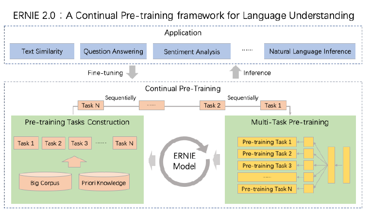

## 03.AI概览：宣传片外的人工智能

内容概述

- **人工智能是什么**

- **人工智能的发展历史**

- **人工智能的现状和展望**

人工智能之父：Fallece John McCathy

人工智能的复兴≈ 神经网络的复兴

神经网络的概念很早就已经出现，但是在2000 年左右，由于SVM 的出现，
使得神经网络没落了一段时间。

神经网络的再次兴起，主要源于2013 年深度学习的出现。GPU的出现让算力变得便宜（GPU非常适应并行计算）。一些CV领域的出现突破

真正的人工智能其实就包括两个：预测性建模和优化。

预测性建模

- 主要目的：在给定数据的基础上提升预测模型的准确率

- 绝大多数人工智能的应用在很大程度上均可以认为是预测性建模的范畴

- 预测性建模VS 统计学
  - 预测性建模：只关注模型的预测准确性
  - 统计学模型：主要关注模型的可解释性
  - 例如湖北疫情数据，预关注的是明天新增多少感染，怎么得到这些数据不是最关心的。统关心什么会影响感染率的增加，通过什么样的措施可以减少病患率
  - 预和统都是相互补偿的，只是近年来预的发展速度更快

优化问题

- 优化问题是指如何根据已有的数学模型求出最优解的过程
  - 通常是一种量上的优化而不是质上的优化。例如城市如何管控整体的交通灯，怎么尽可能的减低交通拥堵
  - 优化问题不是一个新领域，一般跟两个领域相关：运筹学和优化理论
- 近年来取得主要进展的优化问题主要在于增强学习领域
- 增强学习：解决一小部分的优化问题
  - 解决的问题：如何在动态环境下做出正确的决定。例如交通灯，动态：控制停车或通行秒数。静态：该在哪里安装交通灯
  - 主要应用：游戏AI。
    - 进展主要来自DeepMind机构，阿尔法击败李世石，AlphaStar(针对星际争霸2的游戏AI)决策空间非常复杂
  - 其他应用：内容推荐、搜索排名、智能化定价
    - 智能对话机器人的构建，最难的核心点是如何选择一个子系统，一般通过增强学习解决。
    - Youtube的推荐系统也是增强学习做的

人工智能的另外一种分类

- 结构化数据（一般存数据库，一列一列的），例如银行消费记录、贷款记录等
- 文本数据
- 图像、视频数据
- 语音数据

传统来讲是把非结构化数据转为结构化数据（例如从文本中提取一些关键词），但有些情况很复杂不能单单靠结构化。

例如：反讽的语句，如果只是通过找情感词可能会判断错误，没考虑上下文。

神经网络就是一个非常复杂的特质提取器


被媒体夸大的人工智能

- 媒体的口中，本质是追求曝光度，所以会夸大其词，很多不切实际的信息，鱼龙混杂。

人工智能和任何一个学科都一样，可能会在短暂时间内有突破发展，但本质上是遵循科学的循序渐进的过程。例如最小二乘法（高斯,1777-1855）和拟牛顿法（牛顿，1643-1727）。

人工智能常常以不同面目出现，不停地重新被包装：

机器智能、统计学、运筹学——模式识别、数据挖掘——BI（商业智能）——神经网络、深度学习——人工智能

动力：吸引更多的眼球

人工智能现状

- 有一定的进展，来源于算法进步，业界形态进步，硬件算力的进步
- 从理论上来讲我们还远远没有达到能够超越人的地步，从实践来讲很多人工智能项目是难以落地的


我们该怎么做


## 04.AI项目流程：从实验到落地

如何判断是否要做一个AI 项目

1. 技术的成熟度
   1. 底线：人工是否可以解决这个问题。人不能做的绝大多数机器也做不了
   2. Paper 中技术的复现性VS 领先厂商当前的水平。参照大厂的技术的解决程度
   3. 初期通过小Demo 测试准确率。不同实用领域的准确率可能会差很多，先提前用这个数据测试一下。
   4. 团队的时间和能力
   5. 项目部署问题。最后一刻部署的时候发现这个操作系统不能安装tf，也不能安装pytorch，因为它是AMD的系统，AMD的显卡，所有东西重做
   6. 保守估计项目的交付时间
2. 需求的可控程度
   1. 公司是销售导向OR 技术导向，是不是要跟着销售走，销售有决定话语权
   2. 客户管理能力。后端人员不直接面对客户其实很危险，可能不知道真实需求。要会处理客户提出的实现不了的要求甚至无理要求
   3. 团队整体的需求控制能力。leader要挡一些需求
3. 项目投入的周期和成本
   1. 大多数时候，人们会低估项目投入的周期和成本。
   2. 项目周期和成本不可控的原因主要来源于需求的变更。客户可能不知道他要什么，看到了才知道
   3. 其他可能出现的问题：
      1. 标注的不可控性。数据不全，标注标准，错标。
      2. 模型效果调优所需要的时间，要留出来
      3. 推断速度提升所需要的时间，容易被低估
      4. 环境部署所需要的时间
      5. 运行模型所需要的算力成本，硬盘算力要多少
4. 项目最终的交付流程
   1. 明确项目目标
   2. 不要忽略交付流程中的额外投入
   3. 组织的项目交付的流水化能力：
      1. 是否有明确的交付流程
      2. 人员职责安排是否清晰
      3. 是否严格遵循时间规范
      4. 项目是否有烂尾的风险

项目的一般流程

1.前期调研和方案确定（如何做前期的调研）

- 容易被忽略的问题：
  - 很多时候，学术结果难以复现。
  - 很多方法在某些数据上可能会非常好用，但是在另一些数据上则会失效。不仅要技术研发，还要数据研发
  - 很多方法的成功取决于一些细节，而这些细节只有真正做过的人才会知道。
  - 很多时候人们会过于关注方法的效果，而忽略了整体的运行实效。环境不一样
  - 在绝大多数的时候，人们都会低估整个项目的难度。

数据标注和开发（如何做开发的计划）

- 数据标注
  - 前期一定要制定充分的标注规则
  - 数据的采集一定要具有代表性
  - 非常不建议采用自动标注的方式。模型准确率一定不会比标注的高。数据漂移问题。例如用关键词去标注，那么模型很有可能学习到如何区分有没有关键词。
  - 先训练一个初步模型，然后只让相关人员进行校对，可以保证标注效率并减少标注成本。Active Learning
- 算法开发
  - 千万不要采用规则的方式进行开发。初期成本低，但是后期成本越来越高。规则尽量放在最后用。尽量写成可以配置的方式。
  - 初期就要引导客户使用和购买能够支持深度学习框架的硬件。一开始就申请GPU，而不是后期再提。
  - 算法开发的过程中，一定要有量化的指标并记录下来。记录方案、测试的数据集
  - 开发的过程中，多分解问题。不可能100%。怎么调优？分解成多种情况去分析。数据扩充的时候要去扩充表现不好的地方。引导客户：对于简单的问题已经达到90%的准确率，对于难的问题小冰也答不上来。
  - 前端对接的时候一定要去引导何为“智能”

3.效果调优（包括准确性和速度）（如何对结果进行验证）

- 初期要充分考虑到效果优化所需要的时间和成本
- 客户并不知道通过什么标准来评估一个系统的好坏。其实是好事，可以引导客户，比如去看整体准确率而不是某一个例子。
- 一定要从数据的角度出发进行优化。分析哪一部分数据表现比较差，而不是频繁换模型。
- 学会止损。不要投入无限的量去优化。
- 除了准确性的优化，还要注重代码运算效率的优化
- 算法开发和效果优化常常是需要反复进行的工作

4.代码部署（如何进行部署）

- 如果客户的系统比较奇怪，或者难以满足一些要求，要提前让客户知晓这些风险。AI部署常常用GPU，安装驱动CUDA，CUDA会重新编译对方的Linux内核，会改变整个系统，绝大多数公司不能承受。
- 即使再小的项目，我也强烈建议用微服务架构进行部署。Docker可以不改变对方环境，但是不稳定，配上kubernertes。
- 不要把算法部署在本地，尽量采用云端部署。可以更好地控制环境、投入，可以不用做更多的交涉。云端部署demo让客户看。


## 05. NLP领域简介：NLP基本任务及研究方向

基础性研究

- 基础性研究：网络架构。Transformer
- 基础性研究：优化理论。参数变多，模型大，优化难，优化的精度、速度的问题。Lookahead
- 基础性研究：对抗训练。数据噪声变多怎么办？对抗训练，例如虚拟的对抗训练。
- 基础性研究：数据增强。获得更多数据。但是如果有很多相似的样本，容易过拟合。
- 
- 基础研究：半监督学习。
- 
- 基础研究：域迁移
- 
- 基础研究：Meta Learning。神经网络的训练过程极其困难，让机器去看着训练。DeepMind发布文章Direct Policy Gradient。RL中，一种是MCTS（Monte Carlo Tree Search)，这个基本上是暴力去算可能性，可以理解为类似于计算的过程。另外一种就是Q-learning和policy gradient。这类基本上是基于神经网络的，所以可以认为是一种类似于“感觉”的东西。Direct Policy Gradient等于把这两个结合了。跟lookahead有相似性，可以向前看。
- 
- 基础研究：Auto ML。完全自动化。RENAS遗传算法和增强学习结合。
- 
- 基础研究：多任务学习
- 
- 基础研究：集成学习
- 
- 基础研究：图网络。抽象语法树也是图
- 基础研究：知识图谱。三元组的集合。落地难
- 基础研究：多模态学习。比如图像文本结合
- 基础研究：机器推理。很老的研究。
- 

专属NLP 领域的研究

- NLP 研究：预训练语言模型。例如XLNet
- NLP 研究：文本分类。比如情感分析
- NLP 研究：序列标注。比如NER，分词
- NLP 研究：关系提取。
- NLP 研究：Dependency Parsing
- NLP 研究：Semantic Parsing
- NLP 研究：Seq2Seq
- NLP 研究：文本生成。看着美，落地难。语法流畅，逻辑不流畅。往往需要结合模板
- 
- NLP 研究：文本推荐。今日头条文本推荐做得好。机器如何理解文本，人的兴趣漂移
- NLP 研究：翻译。例如Pivot vs. Zero-Shot Translation
- NLP 研究：指代消解
- 

NLP 综合性研究（不仅仅包括一个算法），落地难，要考虑多个算法

- 智能对话机器人
- 文本校对
- 文本检索
- 开源情报系统
- Smart BI

交叉领域的研究

## 06. NLP 应用：智能问答系统

- A Taste of Reality

- 很多系统是由多个组件组成的
- 很多系统是存在很多挑战的
- 很多系统落地是存在问题的
- 但是，很多时候有些问题也是可以解决的…

###如何构建一个智能问答系统

功能：基础问答，特定任务，闲聊功能，推理问答，话题发尾，其他

有一个增强学习控制中心，控制不同场景下上述的功能

问题——召回（需要快速）——分类（干掉完全不相干的类别）——关键词——等价性（等价/相关问题）——排序（相关性强弱）

智能对话系统的挑战

- 技术困难

- 投入巨大（需要大量的数据）

- 落地困难（有时候可能不需要那么智能的机器人，只需要一些基本功能）

有多少人会经常跟机器人闲聊？思考它的落地，是否真的有必要让它变得那么智能？

如何把一个机器人问成弱智

- 省略回复
- 知识推理（姚明的爸爸的儿子的爸爸是谁）
- 错别字
- 状态切换
- 延续话题

对话机器人的实践

- 我曾经生不如死地开发过一个对话机器人（类似于百度UNIT ）
- 挑战：
  - 技术复杂（次要）
  - 客户关系（主要）

数据扩充，通常是用等价词语替换。

例如：市政府是干什么的？

A的B是什么，C的B是什么，A和C等价

利用语法树扩充数据，比如“是什么”，“职责是什么”。

直接替换可以，但是有两个问题，量少，第二个过拟合。语法树其实是交叉的方式来增加更多看起来不一样其实一个意思的情况。

总结

- 目标分解
- 创新并非那么困难
- 综合考虑技术因素和人的因素

## 07 NLP 应用：文本校对系统

从Grammarly 出发

理论模型：Seq2Seq

实际模型：？？？（效果极其糟糕）

为什么中文校对会比英文校对要难？

- I am born im China. 看几个词同时出现的频率，发现错误
- 我在中国出生。先分词，分词器准确率？我 在中 国 出生 我在中的词频很低？有错误？如果有错误，分词器可能受影响，分词都分错。
- 本质：一旦错误，传统的模型会崩溃

如何解决

- 目标分解
- 逆向思维

例如：

这时他进来

这是他进来

去看整个句子的通顺程度，这是他进来和这时他进来哪个更通顺。

这种做法是先纠错再查错，传统的是先查错再纠错。

其他可以尝试的

- 语法错误校对（非常困难）
- 常识校对（更加复杂）

## 08 NLP 的学习方法：如何在AI 爆炸时代快速上手学习？

在最短的时间内把新的东西初步掌握；需要创造性思维

知识可以快速补充，能力需要实践去补充

AI 时代的学习

- 为什么要学习
  - 迁移学习的出现使得技术不再是数据标注的衬托
  - AI 一直在迅速发展
  - AI 本身还不成熟，有大量的创新空间
- 学习的误区
  - “大佬（同事）带带我”；（自己的担子很重，没有时间手把手教你，希望对方自己学习）
  - 夯实基础，拿下西瓜书；（真正的基础是什么？数学和编程是真正的基础，看新的模型能够快速读懂）
  - 一切要从结果出发，要务实；（如果只局限一部分会错过通用的本质）
  - 创新是给巨佬的，跟我没关系；
  - 不要造轮子；（比如只会调包也不行，需要适当地造轮子）
  - 三个月内从零到Kaggle Master；（想快速学习没问题，但不应该所有事情都想走捷径）
  - Andrew Ng 说一切机器学习问题的本质一定是要么过拟合和欠拟合；（没说过这句话，只是看问题的一种方式而不是所有的方式）
  - 看英文太费劲，国内有很多公众号不错；（翻译的过程中可能会出错，学会英文搜索更可能找到正确答案，因为英文是世界性的语言）
- 如何有效地进行学习（学习路线建议）
  - 基础= 数学+ 编程+（英语）（每天做一点）
  - 积极寻找对AI 有情怀的人（乐趣就是解决问题、分享，自己也要变成这种有情怀的人才能吸引别人）
  - 上来就是干（上手，不是去看课程，而是看开源库）
  - 考虑其它维度（是否陷入思维定势）
  - 兼听则明，AI 届没有上帝
  - 怀疑一切（即使是谷歌也会犯错，人都会犯错）
  - 人们将如此多的时间花在走捷径之上，以至于正常走远路的人反倒是首先到终点的（保证不断学习，提升）
  - 做深一点，扩展多点

## 09 深度学习框架简介：如何选择合适的深度学习框架？

深度学习框架包括什么

- GPU 为基础的Tensor 运算
- 构建网络后自动求解梯度的方法
- 模型训练体系（简洁程度，运算速度）
- 模型推断体系

选择深度学习框架的准则

- 生态圈
- 易用性（不要光看Demo 来判断）
- 功能是否完整
- API 是否稳定
- 效率

TensorFlow

- 优点
  - 谷歌爸爸一撑腰，研究代码两丰收
  - 新版TensorFlow API 较简洁
  - 天生和谷歌云兼容（谷歌云支持TPU）
  - 有良好的推断支持（tfserving）
  - 功能十分强大

- 缺点
  - API 不稳定
  - 学习成本高
  - 开发成本高


PyTorch

- 优点
  - 上手容易
  - 代码简洁
  - 发展快速，现在已经支持TPU
  - API 相对稳定
- 缺点
  - 没有Keras API 那样简洁
  - 一些功能比较难以实现（全局变量问题）


## 10 深度学习与硬件：CPU 篇

为何关注深度学习硬件

- 关注硬件不等于所有都要重新写

- 加速训练

- 避免部署出现问题

CPU 硬件基础

- Core, Register, Cache, Memory
- Cache miss

CPU 在训练时候的注意事项

- 一般不用CPU 训练深度学习模型。
- 很多if…else 出现时，CPU 会比GPU 快。（善于处理复杂逻辑）
- 如果需要加速，可以通过Cython 访问C++，这在实际业务性应用时很有用。
- 对于大部分硬件（GPU，TPU，FPGA），CPU会负责数据的读写-> 在进行训练时，有时为了加速需要选择更多核的机器。

CPU 在部署时候的注意事项

- 避免Cache Miss（常见的情况是不断地需要读写）

- 有时需要使用足够多的核来支持读写


## 11 深度学习与硬件：GPU 篇

GPU 的主要厂商

- 英伟达NVIDIA
- AMD（对深度学习支持差）

商用卡，民用卡

V100, 2080Ti, P1000

GPU 硬件特点

- SIMT，即使做一个很简单的计算也要调用大量的核core
- 显存污染
- 显存独立于内存，内存和显存的读取可能会成为问题。
- 对于显存的处理，multi-stream processer 并不如CPU 一样强大。
- GPU 是非常复杂的处理器。

GPU 训练注意事项

- GPU 训练效率可以被DeepSpeed 显著提升。
- 很少出现GPU 多线程训练。（多个用户用同一块GPU去训练，容易造成显存污染）
- GPU 训练有时可能会被一些其他因素影响，如CPU，GPU 之间沟通速度（多GPU或多节点）。
- 传统来说，NLP 的训练一般来说不会耗尽GPU的资源，但是深度迁移模型出现后，GPU 常常出现算力不足或显存资源不足的情况。
- GPU 可处理动态的网络。（AutoML）

GPU 部署的注意事项

- GPU 部署的最大问题：显存污染。（很难发现，只能避免，一台GPU只负责一个serving）
- GPU 部署经常被内存与显存之间的带宽影响。
- 部署时需要对参数做详细调整，最重要参数为Batch Size。

## 12 深度学习与硬件：TPU 篇

TPU 的特点

- 用于训练神经网络的TPU 只能通过GCP （谷歌云）获得
- TPU 本质上来说是矩阵/向量相乘的机器，构造远比GPU 简单，所以：
  - TPU 十分便宜
  - TPU 很容易预测其表现
- TPU 很擅长基于Transformer 架构的训练和预测
- TPU 不能处理动态网络（必须依赖tf静态图）

TPU 与深度学习

- 原生Tensorflow 对TPU 支持最好，PyTorch 目前通过XLA 的引进也部分支持TPU。
- TPU 的主要运算瓶颈在于IO 支持。
- 建议采用TPU V3 多线程的方式，这种方式性价比最高。

## 13 AI 项目部署：基本原则

AI 项目部署的难点

- AI 项目整体结构复杂，模块繁多。
- AI 很多时候需要大量的算力，需要使用GPU，TPU 或者FPGA。（了解硬件）
- 深度学习框架依赖十分复杂，配置环境困难。（cuda需要重新编译整个linux系统）

AI 项目部署目标

- 不要崩，不要崩，不要崩

- 保证不出大的问题

- 保证合适的效率（比如增加算力）

- 保证尽可能少的侵入性

AI 项目部署基本原则

- 采用微服务框架（方便、稳定）。
- 采用合适硬件，注意CPU 选型和GPU 选型。
- 以Profiler 为导向进行优化。
- 推断服务应该用同一个框架和一个线程，TPU 除外。
- 部署应该是在项目初期就考虑的，要制定完善的项目计划，并注意和客户的沟通。

## 14 AI 项目部署：框架

深度学习推断框架的任务

- 读取模型，提供REST 接口。
- 调用不同的硬件资源。
- 对推断过程做一定处理，其中最重要的是批处理。

选择深度学习推断框架的主要根据

- 生态圈
- 易用性和文档完整性
- 对不同硬件的支持程度
- 功能是否强大
- 推断速度

TF Serving 简介

- 同时支持CPU，GPU，TPU
- 生态圈

## 15 AI 项目部署：微服务简介

微服务基本介绍

- 微服务是一个概念，而不是一个严谨的定义

微服务的主要原件

- Docker，Kubernetes，Istio

为何选择微服务

- 入侵性小
- 稳定性高
- 功能强大

微服务部署AI 的一些基本原则

- 对于推断，一个节点只部署一个Docker！（TPU 除外）
- 如果没时间，起码选择Kubernetes 和Docker，因为Docker 很容易崩溃。
- 一些其他的考虑：
  - 错误恢复（服务崩了之后？）
  - 灰度上线（模型更新）
  - Kafka（统一一段一段去请求，而不是一个一个）
  - Actor
  - 其他功能

## 16 统计学基础：随机性是如何改变数据拟合的本质的？

出发点

- 数学定理表明，任何一个函数都可以用多项式无限接近的拟合。
- 为什么我们不用多项式呢？

随机性是如何改变数据拟合的本质的

- 数据的拟合有两种随机性：
  - 噪声->无法消除
  - 函数拟合的随机性->可以提升
- 过拟合和欠拟合
- 引入其他信息的必要性（现有信息可能不足以判断）
- 多角度考虑问题（多个数据源）

随机性对算法工程师意味着什么

- 过拟合和欠拟合是对神经网络设计和训练很重要的一点，但不是全部
- 能否解决问题在很大程度上取决于数据是否有足够信息
  - 引入结构化数据的必要性
  - 为什么人解决不了的问题机器也解决不了
- 算法除了考虑数学之外，还需要考虑实际数据的情况
- 训练集和测试集不同是机器学习算法最大的坑（尽量建立客观的测试集）

## 17 神经网络基础：神经网络还是复合函数

关于神经网络错误的说法

- 神经网络是大家根据神经科学得到的最伟大的发明

神经网络的数学本质

- 由于神经网络复合函数的本质，使得神经网络可以很方便地组合出很多复杂的函数
- 由于复合函数求导法则，所以大部分神经网络的训练过程可以自动化（反向梯度传递）

一些神经网络的术语

- 神经网络的训练
- 神经层
- 激活函数
- 隐含层

## 18 神经网络基础：训练神经网络

传统优化求解方法的问题

- 传统的求解方法：
  - 拟牛顿法等
  - Proximal Methods
- 传统求解方法的问题
  - 传统方法需要根据全部样本计算梯度（导数），这导致对于非常复杂的网络，求解计算上根本不可行

基础的梯度下降算法

- SGD（图像领域里一般用这个好）
- SGD with Momentum（新batch的方向和旧batch的方向加权，方向更稳定）
- Adagrad（陡的地方多走一些，否则少走一些）
- Adam（NLP领域里一般用这个好）

梯度消失和梯度爆炸

- 由于求解过程的复杂性，这使得神经网络的求解并不一定会收敛到最优解
- 对于神经网络训练最大的敌人是梯度消失和梯度爆炸
- 解决梯度消失和梯度爆炸往往是网络设计和优化算法需要考虑的问题

## 19 神经网络基础：神经网络的基础构成

损失函数

- y值连续时：L2 Loss（为了减少异常点的影响，用clipping），L1 Loss
- y值离散时：交叉熵

全连接层

激活函数：sigmoid，tanh，relu

Dropout

Batch Normalization

## 20 Embedding 简介：为什么Embedding更适合编码文本特征？

什么是Embedding

为什么我们需要Embedding

Embedding 是怎么训练的

## 21 RNN 简介：马尔科夫过程和隐马尔科夫过程

马尔科夫过程

隐马尔科夫过程

## 22 RNN 简介：RNN 和LSTM

RNN

LSTM

https://blog.csdn.net/dqcfkyqdxym3f8rb0/article/details/82922386

## 23 CNN 简介

CNN 简介

做max pooling和average pooling，把两个部分拼接起来——CVPR比赛的一个小trick

CNN 如何应用在文本当中

- 传统来说，NLP 当中的CNN 一般较浅，但有证据表明更深的CNN 更有效。
- 在传统文本分类模型当中，CNN 效果往往要比LSTM 分类效果好（但不一定）。

## 24 环境部署

谷歌云配置，jupyter notebook

安装Anaconda，安装cuda，安装Pytorch，docker

## 25 Pytorch简介：Tensor和相关运算

broadcast, Einsum

```python
import torch

my_tensor = torch.tensor([[0.0, 1.0],[0.1, 0.2]])
my_tensor

new_tensor= my_tensor.int().float()
new_tensor

import numpy as np
np_tensor = np.array([[0.1,1.0],[1.0,0.2]])

tensor_from_np = torch.tensor(np_tensor)
tensor_from_np

to_numpy = tensor_from_np.numpy()
to_numpy

device = torch.device('cuda' if torch.cuda.is_available() else 'cpu')
my_tensor.to(device=device) # See https://pytorch.org/docs/stable/notes/cuda.html for complete examples

to_numpy = my_tensor.numpy()
to_numpy

single_number = torch.tensor([0])
single_number

single_number.item()

tensor_with_gradient = torch.tensor([[0.1,1.0], [1.0, 2.0]], requires_grad=True)
result =tensor_with_gradient.pow(2).sum()
result.backward()
tensor_with_gradient.grad

tensor_with_gradient.detach_() # This will make sure that the Tensor will never need gradient

x = torch.tensor([[0.1, 1.0],[2.0, 1.0]])
x + 1

x * 2

y = torch.tensor([[0.1, 2.0], [2.0, 3.0]])
x + y 

x[:,:]

x[1,:]

x[:,1]

x = x.unsqueeze(0)
x
x.shape

z = x + y 
z # This is a case of broadcast, see https://pytorch.org/docs/stable/notes/broadcasting.html for details
z.shape

z = z.squeeze()
z

x = torch.randn(5)
y = torch.randn(5)
torch.einsum('i,j->ij', x, y) 

A = torch.randn(3,5,4)
l = torch.randn(2,5)
r = torch.randn(2,4)
torch.einsum('bn,anm,bm->ba', l, A, r)
```


## 26 Pytorch简介：如何构造Dataset和DataLoader

https://pytorch.org/tutorials/beginner/data_loading_tutorial.html

```python
import torch
from torch.utils.data import Dataset, DataLoader

class MyStupidDataset(Dataset):
    def __init__(self):
        super(MyStupidDataset, self).__init__()
        self.data = torch.randn([1024, 10, 10])
    def __len__(self):
        return 1024
    def __getitem__(self, idx):
        return self.data[idx, :, :] 
    
my_stupid_dataset = MyStupidDataset()

my_data_loader = DataLoader(my_stupid_dataset, batch_size=64, shuffle=True)

for i in my_data_loader:
    print(i)

# A common Pattern
class MyDictDataset(Dataset):
    def __init__(self):
        super(MyDictDataset, self).__init__()
        self.x = torch.randn(1024, 10)
        self.y = torch.randn(1024)
    def __len__(self):
        return 1024
    def __getitem__(self, idx):
        return {'x':self.x[idx,:],'y':self.y[idx]}
    
my_dict_dataset = MyDictDataset()
my_data_loader = DataLoader(my_dict_dataset, batch_size=64, shuffle=True)
for batch in my_data_loader:
    print(batch['x'])
    print(batch['y'])
    
from torch.utils.data import TensorDataset
x = torch.randn(10,100)
y = torch.randn(10)
tensor_dataset = TensorDataset(x, y)
```


## 27 Pytorch简介：如何构造神经网络

```python
import torch 
import torch.nn as nn

x = torch.rand([8, 100, 10]).detach()
x 

y = torch.rand(8)
y = (y>0.5).int()
y

class MLP(nn.Module):
    def __init__(self):
        super(MLP, self).__init__()
        # 为什么这些要写在init里？因为只有写在这才会被初始化，里面的参数才会被优化
        # 可不可以重用？比如这里的first_layer我用好几次。
        # 这样导致的结果就是这好几次的参数都是一样的。
        self.first_layer = nn.Linear(1000,50)
        self.second_layer = nn.Linear(50, 1)
    def forward(self, x):
        x = torch.flatten(x, start_dim=1, end_dim=2)
        x = nn.functional.relu(self.first_layer(x))
        x = self.second_layer(x)
        return x
    
mlp = MLP()
output = mlp(x)
output

class Embedding(nn.Module):
    def __init__(self):
        super(Embedding, self).__init__()
        self.embedding = nn.Embedding(4, 100)
    def forward(self, x):
        return self.embedding(x)
    
embedding = Embedding()

embedding_input = torch.tensor([[0,1, 0],[2,3, 3]])
embedding_output = embedding(embedding_input)
embedding_output.shape   # [2, 3, 100]

class LSTM(nn.Module):
    def __init__(self):
        super(LSTM, self).__init__()
        # 10是embedding维度，15是hidden层
        self.lstm = nn.LSTM(10, 
                           15, 
                           num_layers=2, 
                           bidirectional=True, 
                           dropout=0.1)
    def forward(self, x):
        # 一般用output, hidden
        output, (hidden, cell) = self.lstm(x)
        return output, hidden, cell
    
# 和上面的不一样，LSTM的输入第二维才是样本量
permute_x = x.permute([1,0,2])
lstm = LSTM()
output_lstm1, output_lstm2, output_lstm3 = lstm(permute_x)
output_lstm1.shape   # [100, 8, 30], 30=15*2
output_lstm2.shape   # [4, 8, 15], 15是Hidden，4是2*2？

class Conv(nn.Module):
    def __init__(self):
        super(Conv, self).__init__()
        self.conv1d = nn.Conv1d(100, 50, 2)
    def forward(self, x):
        return self.conv1d(x)
    
conv = Conv()
output = conv(x)
output.shape  # [8, 50, 9]
```

## 28 文本分类实践：如何进行简单的文本分类？

开源代码，第一先跑通，第二不要去看一些细节，先理架构逻辑，第三去看每一步中哪个地方有问题

作业：分析怎么提升准确性

https://github.com/bentrevett/pytorch-sentiment-analysis. 

```python
import nltk
nltk.download('punkt')  # punkt用来分词

from nltk.tokenize import word_tokenize
tokenizer = word_tokenize

import torch
from torchtext import data
from torchtext import datasets

SEED = 1234

torch.manual_seed(SEED)
torch.backends.cudnn.deterministic = True

TEXT = data.Field(tokenize = tokenizer, include_lengths = True)
LABEL = data.LabelField(dtype = torch.float)


from torchtext import datasets

train_data, test_data = datasets.IMDB.splits(TEXT, LABEL)


import random

train_data, valid_data = train_data.split(random_state = random.seed(SEED))


MAX_VOCAB_SIZE = 25000

TEXT.build_vocab(train_data, 
                 max_size = MAX_VOCAB_SIZE, 
                 vectors = "glove.6B.300d", 
                 unk_init = torch.Tensor.normal_)

LABEL.build_vocab(train_data)


BATCH_SIZE = 64

device = torch.device('cuda' if torch.cuda.is_available() else 'cpu')

train_iterator, valid_iterator, test_iterator = data.BucketIterator.splits(
    (train_data, valid_data, test_data), 
    batch_size = BATCH_SIZE,
    sort_within_batch = True,
    device = device)


import torch.nn as nn

class RNN(nn.Module):
    def __init__(self, vocab_size, embedding_dim, hidden_dim, output_dim, n_layers, 
                 bidirectional, dropout, pad_idx):
        
        super().__init__()
        
        self.embedding = nn.Embedding(vocab_size, embedding_dim, padding_idx = pad_idx)
        
        self.rnn = nn.LSTM(embedding_dim, 
                           hidden_dim, 
                           num_layers=n_layers, 
                           bidirectional=bidirectional, 
                           dropout=dropout)
        
        # bidirectional一般是True，双向LSTM
        self.fc = nn.Linear(hidden_dim * 2, output_dim)
        
        self.dropout = nn.Dropout(dropout)
        
    def forward(self, text, text_lengths):
        
        embedded = self.embedding(text)
        
        packed_embedded = nn.utils.rnn.pack_padded_sequence(embedded, text_lengths)
        
        packed_output, (hidden, cell) = self.rnn(packed_embedded)
        
        output, output_lengths = nn.utils.rnn.pad_packed_sequence(packed_output)
        
        # 向前和向后的
        hidden = self.dropout(torch.cat((hidden[-2,:,:], hidden[-1,:,:]), dim = 1))
                
        return self.fc(hidden)

INPUT_DIM = len(TEXT.vocab)
EMBEDDING_DIM = 300
HIDDEN_DIM = 256
OUTPUT_DIM = 1
N_LAYERS = 2
BIDIRECTIONAL = True
DROPOUT = 0.2
PAD_IDX = TEXT.vocab.stoi[TEXT.pad_token]

model = RNN(INPUT_DIM, 
            EMBEDDING_DIM, 
            HIDDEN_DIM, 
            OUTPUT_DIM, 
            N_LAYERS, 
            BIDIRECTIONAL, 
            DROPOUT, 
            PAD_IDX)


pretrained_embeddings = TEXT.vocab.vectors
model.embedding.weight.data.copy_(pretrained_embeddings)


UNK_IDX = TEXT.vocab.stoi[TEXT.unk_token]

model.embedding.weight.data[UNK_IDX] = torch.zeros(EMBEDDING_DIM)
model.embedding.weight.data[PAD_IDX] = torch.zeros(EMBEDDING_DIM)


import torch.optim as optim

optimizer = optim.Adam(model.parameters())
criterion = nn.BCEWithLogitsLoss()

model = model.to(device)
criterion = criterion.to(device)


def binary_accuracy(preds, y):
    """
    Returns accuracy per batch, i.e. if you get 8/10 right, this returns 0.8, NOT 8
    """

    #round predictions to the closest integer
    rounded_preds = torch.round(torch.sigmoid(preds))
    correct = (rounded_preds == y).float() #convert into float for division 
    acc = correct.sum() / len(correct)
    return acc


def train(model, iterator, optimizer, criterion):
    
    epoch_loss = 0
    epoch_acc = 0
    
    model.train()
    
    for batch in iterator:
        
        optimizer.zero_grad()
        
        text, text_lengths = batch.text
        
        predictions = model(text, text_lengths).squeeze(1)
        
        loss = criterion(predictions, batch.label)
        
        acc = binary_accuracy(predictions, batch.label)
        
        loss.backward()
        
        optimizer.step()
        
        epoch_loss += loss.item()
        epoch_acc += acc.item()
        
    return epoch_loss / len(iterator), epoch_acc / len(iterator)


def evaluate(model, iterator, criterion):
    
    epoch_loss = 0
    epoch_acc = 0
    
    model.eval()
    
    with torch.no_grad():
    
        for batch in iterator:

            text, text_lengths = batch.text
            
            predictions = model(text, text_lengths).squeeze(1)
            
            loss = criterion(predictions, batch.label)
            
            acc = binary_accuracy(predictions, batch.label)

            epoch_loss += loss.item()
            epoch_acc += acc.item()
        
    return epoch_loss / len(iterator), epoch_acc / len(iterator)


import time

def epoch_time(start_time, end_time):
    elapsed_time = end_time - start_time
    elapsed_mins = int(elapsed_time / 60)
    elapsed_secs = int(elapsed_time - (elapsed_mins * 60))
    return elapsed_mins, elapsed_secs


N_EPOCHS = 5

best_valid_loss = float('inf')

for epoch in range(N_EPOCHS):

    start_time = time.time()
    
    train_loss, train_acc = train(model, train_iterator, optimizer, criterion)
    valid_loss, valid_acc = evaluate(model, valid_iterator, criterion)
    
    end_time = time.time()

    epoch_mins, epoch_secs = epoch_time(start_time, end_time)
    
    if valid_loss < best_valid_loss:
        best_valid_loss = valid_loss
        torch.save(model.state_dict(), 'model.pt')
    
    print(f'Epoch: {epoch+1:02} | Epoch Time: {epoch_mins}m {epoch_secs}s')
    print(f'\tTrain Loss: {train_loss:.3f} | Train Acc: {train_acc*100:.2f}%')
    print(f'\t Val. Loss: {valid_loss:.3f} |  Val. Acc: {valid_acc*100:.2f}%')


model.load_state_dict(torch.load('model.pt'))

test_loss, test_acc = evaluate(model, test_iterator, criterion)

print(f'Test Loss: {test_loss:.3f} | Test Acc: {test_acc*100:.2f}%')
```

## 29 文本分类实践的评价：如何提升进一步的分类效果？

分词器，影响没有很大

数据清洗，但是有时候清洗之后可能效果还变差了。用最好的模型来观察数据清洗。

怎么选训练集验证集测试集？测试集一定要比较有代表性。

train一般比val大。

五折验证，模型平均，结果更有代表性。

国内比赛，更多的时候看训练集的结果，测试集可能质量很差

MAX_VOCAB_SIZE。如果embedding已经训练好了，一般会尽量让每个词都有embedding，如果要自己训练，可能需要选择一些频率高的词去训练，频率低的词可以不训练，或者一起作为一个token。

如果想发挥embedding作用的话，一般可以在目标训练集上再稍微训练一点embedding，学习率要选的小一点。

选哪个词向量，一般选更大的词向量，可以拼多个词向量，可以测试不同词向量。如果是BERT等，可以跟词向量做个平均，因为两者捕捉的东西不一样，可能会带来效果上的提升。

BERT是字向量，中文的字向量一般不太好，词向量又是词，如果平均的话，怎么把两者对应起来？这是torchtext没有解决的问题，所以不怎么用。可能需要自己去写，但是很麻烦。

BATCH_SIZE也很重要，不太大，也不太小。一般开始用比较小的batch_size，到快要收敛的时候调低学习率，增大batch_size，这样会更稳定，更有可能找到局部最优，因为收敛比较慢。一般选32,64,128，但是特殊的应用不一样，比如机器翻译一般BS比较大

DeepSpeed

LSTM的num_layers一般不要很多。dropout一般不要很大

seq_length很重要，一般不选最长的文本长度，没信息，收敛慢。

学习率要调

embedding不要和LSTM一起训练。一开始不训练，可以在最后快收敛的时候再训练。

多个LOSS相加可能的好处：如果模型收敛比较慢，再初始的时候加多个LOSS会增加收敛速度；模型快要收敛的时候，加多个LOSS，可能会收敛道更好的结果。但是多个LOSS之间的权重很重要，调整很麻烦。

不要在每个epoch结束的时候才去评价、存储。因为数据量不同的时候，收敛速度完全不一样，比如数据量比较大的时候，3个epoch就已经过拟合了，很可能错过全局最优点。

一般会在比如同样都跑100个batch以后做evaluation。

除了保存模型的状态，还应该保存优化器的状态，随着训练，优化器的有个参数会改变，如果有scheduler（改变学习率）要存学习率。wramup，学习率一开始小，然后增大，然后减小

有些模型，初始化对它影响很大。随即初始化比0好，正态比均匀好，但是正态的方差怎么选？默认何恺明的比较好。


词向量和字向量甚至句子向量的结合？

LSTM还是CNN？

CNN放到LSTM上？

## 30 经典的结构化数据挖掘方法：数据驱动型开发早期的努力

什么是结构化数据

- 结构化数据指的主要是表格数据（Tabular Data）
- 最简单的想象：可以记载在Excel 表格中的均是表格数据
  - 每列数据一般称之为一个变量（字段）
  - 变量可以分为离散型变量和连续型变量
- 绝大多数的数据都是表格数据（或可以转化为表格数据）

结构化数据的传统建模流程

- 传统来说（在某种意义上仍是如此），结构化数据常常要求大量的业务理解

- 探索性数据分析往往占很大成分
- 90% 时间花在清洗数据和探索性分析上

传统建模流程的问题

- 最核心的悖论：业务理解从哪里来？从数据里理解业务，但是建模又需要业务理解。

- 一些实际的问题
  - 高维稀疏变量（高维，稀疏，人难以理解）
  - 较差的变量质量
  - 类似的业务理解能力（业务理解这个变量有用，但是数据质量很差，建模发现没什么用）
  - 业务的多变性

## 31 表格化数据挖掘基本流程：看看现在的数据挖掘都是怎么做的？

数据挖掘竞赛和新的建模流程：竞赛基本流程和挑战

- 竞赛基本流程
- 挑战
  - 无业务理解
  - 少数提交机会
  - 测试集和训练集可能不一样-> 建模结果必须稳定
  - 时间短暂，必须充分利用时间
- 数据挖掘竞赛和实际业务中的建模有类似挑战，但有一点重要不同
  - 实际业务建模必须要逐步引入更多变量，而竞赛中变量已经给定

新的流程

- 数据清理和EDA
- 半自动的变量构建+ 手动构建
- 一类模型主要提高准确率，另一些模型做集成备选
  - 传统来说主要用于提高准确率的是靠集成树的方法
  - 近年来神经网络为基础的建模越来越多
- 集成学习
  - 被集成的模型必须有一定准确性
  - 被集成的模型必须有一定的多样性


关于新的流程的一些说明

- 前三个环节经常需要反复进行
- 基本原则：尽可能利用算力和时间（边跑边做EDA，不要让算力闲置）
- 不同人对于EDA 重要性说法不同，个人建议初学者以实验为主
- 非常重要的原则：结合全局（比如旅游出门的概率）和局部信息（订某个酒店，有酒店会员）
  - 有些变量很稀疏，但是不稀疏的地方都预测准确性很好。例如预测某个人会不会订某个酒店。他是会员（很稀疏），他去同一个地方（稀疏），但是一旦发生，就很有可能订同一个酒店。这是局部信息。驴友出门的概率和意愿，很有可能订很多酒店，订很多便宜的酒店。这个信息不只是一个变量，在好几个观测上。

## 32 Pandas简介

```python
# The data can be donwloaded here (https://www.stats.govt.nz/assets/Uploads/New-Zealand-business-demography-statistics/New-Zealand-business-demography-statistics-At-February-2019/Download-data/geographic-units-by-industry-and-statistical-area-2000-19-descending-order.zip).
import pandas as pd
in_file = "Data7602DescendingYearOrder.csv"
data = pd.read_csv(in_file, engine='python')

data

data.shape

data.columns.values

data.to_csv("out_file.csv", index=False, encoding='utf-8', sep="\t")

year = data['year']

year

geo_count = data['geo_count']

geo_count > 90

geo_count[geo_count > 90]=90

data.head()

def myfunc(x):
    if x > 90:
        return 90
    else:
        return x

data['ec_count'] = data['ec_count'].apply(myfunc)

data.head()

data['ec_count'] = data['ec_count'].apply(lambda x: 85 if x > 85 else x)

data.head()

data['anzsic06'].unique()

groupby = data.groupby('anzsic06').agg({'geo_count':['mean']})
groupby

groupby.columns = groupby.columns.droplevel(0)
groupby.rename(columns={ groupby.columns[0]: "anzsic06_mean" }, inplace = True)
groupby

data = pd.merge(data, groupby, how='left', on='anzsic06')
data.head()

data

data_part_1 = data.iloc[0:1000]
data_part_2 = data.iloc[1000:]

data_stacked = data_part_1.append(data_part_2, ignore_index=True)

data_stacked.shape

data_new_col = data['ec_count']

data_concat = pd.concat([data, data_new_col], axis=1)
data_concat
```

## 33 Matplotlib简介

```python
import pandas as pd
in_file = "Data7602DescendingYearOrder.csv"
data = pd.read_csv(in_file, engine='python')

data.columns

import matplotlib.mlab as mlab
import matplotlib.pyplot as plt

num_bins=20
n, bins, patches = plt.hist(data['geo_count'], num_bins, density=True)
plt.show()

geo_count = data['geo_count']
smaller_geo_count = geo_count[geo_count<100]

num_bins=20
n, bins, patches = plt.hist(smaller_geo_count, num_bins, density=True)
plt.show()

_ = plt.plot(data['geo_count'], data['ec_count'])
plt.show()

data['year'].unique()

ec_2000 = data[data['year']==2000]['ec_count']
ec_2001 = data[data['year']==2001]['ec_count']

_ = plt.boxplot([ec_2000[ec_2000<100], ec_2001[ec_2001<100]])
plt.show()

```

直方图，数据分布，希望是正态分布，但是现实几乎不可能出现

长尾分布（例如收入）怎么处理？

业务理解来讲为什么会出现这种情况？

如果是X值，可以做离散化处理

如果是Y值，可以做数值变换（比如Box-Cox），或者log变换。如果还是不行，就要分情况讨论。比如低收入、中等收入、高收入分别考虑。

multi-model多峰，有用的信息，可以分为不同的类。

异常值截断。（例如股票）

散点图，分布。可能不同阶段的表现很不一样。

箱线图，异常值。

## 34 半自动特征构建：Target Mean Encoding

Target Mean Encoding 简介，正样本的比例，捕捉y变量和group之间的关系

- 对于离散变量最有效编码方法之一

- 对于维度较高的离散性变量效果很好
- 重点在于防止过拟合

其他的Groupby 函数应用

- 实现Target Mean Encoding 可以使用df.groupby([A,B])[C].agg(func)
- Groupby 函数可以应用于任何其他变量，在某种程度上捕捉了多变量之间的交叉效应
- Func 可以是多种函数，如mean，std，kurtosis，min，max 等等
- 可以对残差进行以上操作

## 35 半自动特征构建：Categorical Encoders

One-hot Encoder：好处是没有丢失信息，缺点是只考虑了x本身的情况，以及高维稀疏。

有几个类别就有几个维度。线性回归存在一个多重共线性的问题，所以可以少一个维度。对于树模型则不然。

Ordinal Encoder：按照y值出现频率高低来排序，得到0、1、2等。

其他Encoder

- Count Encoder
- HashMap


## 36 半自动特征构建：连续变量的离散化方法

为什么要对连续变量进行离散化

- 捕捉非线性效应（1到500，和500到1000一样？如果用线性的话）
- 捕捉交叉效应

常见的离散化方法

- Uniform
- 基于Quantile
- 基于聚类
- 基于树

树模型的简介

## 37 半自动特征构建：Entity Embedding

Entity Embedding 基础

如何加入Vincinal Information

x是连续变量，离散化分成多个组，每个组可以看成是key，每个组可以训练得到entity embedding，可以看成是value。（key-value对）

可以将所有组的value加权平均得到x的value。权重怎么确定呢？因为x是连续的，可以计算x与每个分组的距离（比如用中位数计算），用距离来确定权重。

权重$w_i = softmax(\frac{1}{|x-c_i|+\epsilon})$

但是这个trick不太常用。一开始先普通训练得到embedding，之后用较小的学习率(比如e-5)去训练带权重的embedding。

## 38 半自动特征构建：Entity Embedding的实现

从头写

- 了解整个过程的数学表达，列清楚维度信息
- 先用例子验证是否有错误，然后再打包
- 写完之后进行测试

e：N x M

- e：Embedding Matrix
- N: No of bins
- M: Embedding

x:B

- x:Input（连续的）
- B: Batch Size

C: N

- C: Centroid

w: B x N，权重

$w_{bn} = softmax(\frac{1}{|x_b-c_n|+\epsilon})$

v: B x M，output

$v_b=\sum_nw_{bn}e_n$

推导出v=we

```python
import torch
import torch.nn as nn
import torch.nn.functional as F


EPS = 0.00001

# This is the final implementation, but not the process.
class EntityEmbeddingLayer(nn.Module):
    def __init__(self, num_level, emdedding_dim, centroid):
        super(EntityEmbeddingLayer, self).__init__()
        self.embedding = nn.Embedding(num_level, embedding_dim)
        self.centroid = torch.tensor(centroid).detach_().unsqueeze(1)
    def forward(self, x): 
        """
        x must be batch_size times 1
        """
        x = x.unsqueeze(1)
        d = 1.0/((x-self.centroid).abs()+EPS)
        w = F.softmax(d.squeeze(2), 1)
        v = torch.mm(w, self.embedding.weight)
        return v
        

# ## Experimentation
# This is the part where you experiment with the data

num_level = 10 # When configure dimension, do not use the same dimension for testing
embedding_dim = 5 
embedding = nn.Embedding(num_level, embedding_dim)

batch_size = 4
x = torch.randn(batch_size, 1)
centroid = torch.randn(num_level, 1)

embedding.weight.shape

x.shape

centroid.shape

x = x.unsqueeze(1)
centroid = centroid.unsqueeze(0) # This is not needed

(x- centroid).shape

d = 1.0/((x-centroid).abs()+EPS)

w = F.softmax(d.squeeze(2), 1)

w.shape

w.sum()

v = torch.mm(w, embedding.weight)

v.shape

# ## Testing

x = torch.randn(batch_size, 1)
centroid = torch.randn(num_level) # This differs from the above definition
entity_embedding = EntityEmbeddingLayer(num_level, embedding_dim, centroid)

entity_embedding(x)
```


## 39 半自动特征构建：连续变量的转换

- 为什么要做变换，对模型效果有什么影响
- 是变换x还是y

常见的数据转换方法：log，exp，倒数；相乘，相除，group by

标准化

- 标准化可以影响模型效果。例如PCA
- 标准化后可能更容易优化。

基于ECDF 的方法

- CDF累积概率分布
- 把x的分布转换成别的分布
- 目的：均匀分布，正态分布
- 什么时候转换：针对X，优化速度


Box-Cox 变换和Yeo-Johnson Transform


通过CV（交叉验证）的方法去测试选择哪个lambda

## 40 半自动特征构建：缺失值和异常值的处理

异常值和缺失值的处理概述

- 异常值和缺失值的定义常常是难以确定的，数理逻辑？业务逻辑？
- 异常值的检验最可靠的方法：
  - EDA 加上业务逻辑
  - 可以根据分位数或其他方法（其他方法未必靠谱）
  - 如果异常值是由于输入失误造成的，则可以将之作为缺失值处理
- 缺失值的填充往往可以根据业务决定，其他可以采用平均值、中位数或众数进行填充；也可以单独构建模型进行预测

一些异常值和缺失值的处理方法

- 缺失值的填充往往可以根据业务决定
- 缺失和异常本身可能是有信息量的，可以构造哑变量进行处理
- 成组的缺失值和异常值本身可能是有信息的
- 对于部分异常值，还需要进行截断处理
- 对于重要的缺失变量，很有可能需要进行预测

## 41 自动特征构建方法：Symbolic Learning 和AutoCross

自动特征挖掘

- 应用：
  - 数据挖掘开始时，可以先用自动特征挖掘尝试，提示我们怎么构建
  - 数据挖掘结束时，人想不出来了，利用自动特征挖掘找提升
- 难点：组合优化问题

遗传算法简介：不停地探索样本空间。交叉，变异。

Symbolic Learning 简介

- 采用遗传算法找寻如何构造衍生变量
- 在gplearn 库当中已经实现
  - 代码：https://gplearn.readthedocs.io/en/stable/examples.html

AutoCross 简介

- 第四范式开发（未开源）
- 主要目的：寻找交叉效应
- 创新
  - Beam Search
  - 简化的逻辑回归求解方式
- 可以进行提升
  - Meta Feature
  - 更好的优化方法

## 42 降维方法：PCA，NMF 和tSNE

降维：找到潜在变量可以代表X；或者选出一些重要的变量

为什么要降维

- 找到宏观信息。把不同的信息利用起来，全局。
- 找到交叉效应。
- 不建议先降维再拟合模型。会丢失很多局部信息，我们的先验信息是很有限的

到底什么是隐藏变量？每个方法都有自己的定义

PCA 和NMF 简介

- PCA假设线性不相关

tSNE 简介

- 高维情况下和低维情况下某个点的领域是一样的。

实现

- 在sklearn 当中均有实现
- PCA
  - https://scikitlearn.org/stable/modules/generated/sklearn.decomposition.PCA.html
- NMF
  - https://scikitlearn.org/stable/modules/generated/sklearn.decomposition.NMF.html
- tSNE
  -  https://scikitlearn.org/stable/modules/generated/sklearn.manifold.TSNE.html
- 隐藏维度的选择取决于数据
- 数据需要进行预处理
  - 标准化
  - 选取重要变量
  - 去掉过于稀疏的个别变量
  - 可构建2 折和3 折交叉效应
- 降维方法的参数并不十分重要，一般来说如果有时间，选取所有参数并拟合模型进行测试

## 43 降维方法：Denoising AutoEncoder

Denoising AutoEncoder 简介

- 网络结构从粗变细，比如全连接层的神经元数量越来越少。强制模型去选择维度比较低的隐藏变量

实践中的注意事项

- DAE 一般对多模态有很好效果
- 一般的噪声范畴：5%-20%
- 其他降维方法的trick 也适用于DAE
- 注意将中间层均拿出来进行预测


## 44降维方法：Variational AutoEncoder

Variational AutoEncoder 的数学形式


实践中的注意事项

- VAE 的实现可见
  - https://github.com/1Konny/Beta-VAE
- VAE 是很火的研究领域
  - 训练常常难以收敛
  - 在实际应用中较罕见

## 45 变量选择方法

变量选择概述

- 变量重要= 哲学问题（可能A没什么用，B没什么用，但是AB组合有用）
- 优化角度= 组合优化问题
- 初步选择可根据数据特点
  - 最重要的指标为缺失值和变化率
- 其他的一些选择方法：
  - “去一”的选择方法（主要方法）
  - 模型相关的方法->和模型高度相关，不可靠
  - 其他优化方法->不成熟

“去一”选择法

- 整体流程：拟合baseline模型，每次去掉或打乱一个变量，看验证集效果差多少
- 问题：分类一般用逻辑回归（速度快）
  - 比如a和b变量一样，单独去掉一个没问题，但是都去掉就有问题
  - 选多少？要做很多尝试。

## 46 集成树模型概述

树模型的缺点和优点

- 优点
  - 非线性效应（比如5000以上是一个，以下是一个），简单的非参数的拟合方式。
  - 交叉效应
  - 稀疏（即使很高维，参数也不多）
- 缺点
  - 不稳定（换一批数据可能就变了）
  - 表现力差（一棵树就那么深，不能太深，浅了又不够）
  - 精度差

集成树模型分类

- 基本思路：将多个树模型构成进行平均
- 方法：
  - 随机森林类
    - 随机森林（https://scikitlearn.org/stable/modules/generated/sklearn.ensemble.RandomForestClassifier.html）
    - ExtraTrees（防止过拟合，Stacking一般会用）（https://scikitlearn.org/stable/modules/generated/sklearn.ensemble.ExtraTreesClassifier.html）
  - 梯度提升树：GBDT，XGBoost，LightGBM，CatBoost 等

## 47 集成树模型：GBDT 和XGBoost

GBDT 的数学

- 现实中用得少，因为速度精度都不如xgb和lgb

XGBoost 的数学

XGBoost 实现

XGBoost 的重要参数

- 最重要的参数：树的深度
- 其他参数：
  - eta：一般选取为0.01-0.2，学习率
  - min_child_weight树的分支上海赛矩阵的模长：建议进行CV finetune
  - gamma：建议进行CV finetune
  - Dart 模式（类似dropout）：建议选择为True
- 树的数量可以先少一些，在最终进行增加

补充材料

- GBDT 数学推导：
  - https://towardsdatascience.com/demystifying-maths-of-gradientboosting-bd5715e82b7c
- XGBoost 数学推导
  - https://xgboost.readthedocs.io/en/latest/tutorials/model.html
- Dart：
  - https://www.cs.toronto.edu/~hinton/absps/JMLRdropout.pdf

## 48 集成树模型：LightGBM

LightGBM 概述

- 原始目的->提高GBDT 的运行效率
- 实际效果->提高了准确性
- 主要贡献
  - Gradient Based One-side Sampling
  - Exclusive Feature Bundling

LightGBM 具体算法贡献

抽样计算梯度


互斥的特征组合


Level-wise tree growth变为leaf-wise

LightGBM 参数

- 官方文档：https://lightgbm.readthedocs.io/en/latest/Parameters-Tuning.html

原始paper 地址：https://papers.nips.cc/paper/6907-lightgbm-a-highly-efficientgradient-boosting-decision-tree.pdf

## 49 集成树模型：CatBoost 和NGBoost

CatBoost 简介

- 适用于离散变量
- 核心思想：Ordered Target Mean Encoding
- 参数：
  - 树的数量
  - 树的深度
  - 学习率
- 注意：不要进行One-hot 编码
- 实现：https://github.com/catboost/catboost
- CatBoost 论文：https://arxiv.org/pdf/1706.09516.pdf

NGBoost 简介

- 与GBDT 类似，但是用Natural Gradient 替代原始的梯度
- Natural Gradient 实际为一阶导数除以二阶导数（和牛顿法类似）
- 实现：https://stanfordmlgroup.github.io/projects/ngboost/
- 计算成本很高

集成树模型回顾

- 一般来说，使用XGBoost 和LightGBM 作为初始分类器
- CatBoost 和NGBoost 可作为补充
- 特征工程的效果大于调参

## 50 神经网络建模：概述

历史

- 针对结构化数据，传统的网络主要是MLP
- 效果不好

整体方法论

- 核心
  - 尽可能捕捉不同层次的信息
    - 全局：降维后应用MLP
    - 重要变量：Transformer
    - 高维稀疏：xDeepFM
  - 尽可能在保留树模型优点的基础上进行提升
- 经常可以将问题进行转换

计划

- 神经网络的常见设计模式
- 神经网络的构成和训练审视
- 常见的网络

## 51 神经网络建模：Residual Connection 和Dense Connection

核心问题

- 信息传递
- 网络深度和预测精度

Residual Connection

Dense Connection

应用

- Residual Connection 可以保证维度
- Dense Connection 将会使维度扩大

## 52 神经网络建模：Network in Network

Network in Network


应用

- 一种非常有效的提升精度的方法
- 设计会比较耗费时间
- 一般和AutoML 结合

## 53 神经网络建模：Gating 和Attention

Gating Mechanism 回顾

Attention 综述和Multi-head Self-Attention

Attention 在推断时的一些应用

## 54 神经网络建模：Memory

Memory 机制综述

综合应用：Compositional Attention Network

## 55 神经网络建模：Activation Function

激活函数回顾

pytorch只有swish和mish没有实现

```python
import torch 
import torch.nn.functional as F

def swish(x, beta=1):
    return x * F.sigmoid(beta * x)

def mish(x):
    return x * torch.tanh(F.softplus(x))
```


一些比较重要的激活函数

- relu, prelu, gelu, swish, mish

Gradient Clipping

- 当出现梯度爆炸时候也许有用
- 在loss.backward() 和optimizer.step() 之间调用torch.nn.clip_grad_value
- （文档见
  https://pytorch.org/docs/stable/nn.html?highlight=clip_grad#torch.nn.utils.clip_grad_norm_）
- Value 需要进行尝试

补充材料

- PReLu：https://arxiv.org/pdf/1502.01852.pdf
- ELU：https://arxiv.org/pdf/1511.07289.pdf
- GeLu：https://arxiv.org/pdf/1606.08415.pdf
- Swish：https://arxiv.org/pdf/1710.05941.pdf
- Mish：https://arxiv.org/ftp/arxiv/papers/1908/1908.08681.pdf

## 56 神经网络建模：Normalization

Batch Normalization

- 放在activation 之前还是之后？放在之后效果会好一些
- 和Dropout 的关系？一般放dropout之后，有一些网络（NLP）是放在之前的。可不可以一块用，去尝试。

其他Normalization

- Layer Normalization
- Group Normalization

- Layer Normalization：https://arxiv.org/pdf/1607.06450.pdf
- Instance Normalization：https://arxiv.org/pdf/1607.08022.pdf
- Group Normalization：https://arxiv.org/pdf/1803.08494.pdf

## 57 神经网络的训练：初始化

初始化的重要性

常见初始化方法

- 常数初始化->一般效果不佳
- 随机初始化：均匀分布和正态分布
- Xavier 初始化和Kaiming 初始化
- 一般来说gain 需要进行调整

初始化的PyTorch 实现

- 大部分实现可以见PyTorch 官方文档nn.init
- Xavier Initialization：
  http://proceedings.mlr.press/v9/glorot10a/glorot10a.pdf?source=post_page---------------------------
- Kaiming Initialization：https://arxiv.org/pdf/1502.01852.pdf

```python
import torch 
import torch.nn as nn

class MLP(nn.Module):
    def __init__(self):
        super(MLP, self).__init__()
        self.first_layer = nn.Linear(1000,50)
        self.second_layer = nn.Linear(50, 1)
    def forward(self, x):
        x = torch.flatten(x, start_dim=1, end_dim=2)
        x = nn.functional.relu(self.first_layer(x))
        x = self.second_layer(x)
        return x
    
my_mlp = MLP()

def weights_init_uniform(m):
    classname = m.__class__.__name__
    # for every Linear layer in a model..
    if classname.find('Linear') != -1:
        # apply a uniform distribution to the weights and a bias=0
        m.weight.data.uniform_(0.0, 1.0)
        m.bias.data.fill_(0)
        
my_mlp.apply(weights_init_uniform)

for name, param in my_mlp.named_parameters():
    if param.requires_grad:
        print(name, param.data)
```


## 58 神经网络训练：学习率和Warm-up

学习率设定

- 神经网络炼丹最重要的参数，没有之一
- 理论来说，学习率过小->收敛过慢，学习率过大->错过局部最优
- 实际上来说（可能），学习率过小->不收敛，学习率过大->不收敛
- 设定学习率的一些常用trick：
  - 首先寻找ok 的学习率，然后调整其他参数
  - 不同层采用不同的学习率
  - 在最终阶段降低学习率；或者baby-sitting
  - Warm-up

- 常见的学习率：
  - Finetune：1e-5,2e-5,5e-5
  - 重新训练：没有公认的界定，一般0.01 开始尝试

Warm-up

- 理论上来说，小学习率有助于模型训练稳定
- 实际对随机初始化的网络而言，开始过小的学习率会导致训练不稳定
- 一般采取Warm-up：学习率从小到大再到小

PyTorch 实现

```python
import torch 
import torch.nn as nn

device = torch.device('cuda' if torch.cuda.is_available() else 'cpu')


class MLP(nn.Module):
    def __init__(self):
        super(MLP, self).__init__()
        self.first_layer = nn.Linear(100,50)
        self.second_layer = nn.Linear(50, 1)
    def forward(self, x):
        x = nn.functional.relu(self.first_layer(x))
        x = self.second_layer(x)
        return x
mlp = MLP()


from torch.utils.data import TensorDataset
x = torch.randn(1000, 100).to(device)
y = (torch.rand(1000)>0.5).int().float().to(device) # When feeding the data to optimizer, it only accepts floats

from torch.utils.data import TensorDataset, DataLoader
dataset = TensorDataset(x, y)
dataloader = DataLoader(dataset, batch_size=100, shuffle=True)

for i in dataloader:
    print(i[0])
    print(i[1])

# ## Set-up learning rate
import torch.optim as optim
# optimizer = SGD([{'params': model.classifier[0].parameters(), 'lr': 3e-6, 'momentum': 0.9 }, 

optimizer = optim.Adam([{'params':mlp.first_layer.parameters(), 'lr':1e-2}, 
                        {'params':mlp.second_layer.parameters(), 'lr':1e-3}],lr = 2e-2)
criterion = nn.BCEWithLogitsLoss()

mlp.to(device)
criterion.to(device)

n_epoch = 5
for epoch in range(n_epoch):
    for batch in dataloader:
                
        optimizer.zero_grad()
        
        x, y = batch
        
        predictions = mlp(x).squeeze() # Getting rid of batch times 1
        
        loss = criterion(predictions, y)
            
        loss.backward()
        
        optimizer.step()

for param_group in optimizer.param_groups:
    print(param_group['lr'])

optimizer.__dict__

torch.save(optimizer.state_dict(), 'optimizer.pt')

optimizer2 = optim.Adam([{'params':mlp.first_layer.parameters(), 'lr':1e-2}, 
                        {'params':mlp.second_layer.parameters(), 'lr':1e-3}],lr = 2e-2)
optimizer2.load_state_dict(torch.load('optimizer.pt'))

optimizer2.__dict__

# ## Scheduler
import torch.optim as optim
optimizer = optim.Adam(params = mlp.parameters(), lr = 0)
criterion = nn.BCEWithLogitsLoss()

mlp.to(device)
criterion.to(device)

print(optimizer.param_groups[0]['lr'])

n_epoch = 3
global_steps = 0
warm_up_steps = 1000
max_learning_rate = 0.01
for epoch in range(n_epoch):
    for batch in dataloader:
        global_steps += 1  
        optimizer.zero_grad()
        
        x, y = batch
        
        predictions = mlp(x).squeeze() # Getting rid of batch times 1
        
        loss = criterion(predictions, y)
            
        loss.backward()
        
        optimizer.step()
        if global_steps < 1000:
            optimizer.param_groups[0]['lr'] = global_steps*max_learning_rate/warm_up_steps
        else:
            optimizer.param_groups[0]['lr'] = max_learning_rate

optimizer.__dict__
```


## 59 神经网络训练：新的训练框架

分布式训练

半精度训练

梯度累积

PyTorch 实现

## 60 Transformer：如何通过Transformer 榨取重要变量

为什么需要Transformer

Transformer 整体架构

Transformer 技术细节

代码实现剖析

```python
import torch 
import torch.nn as nn
import torch.nn.functional as F
import math

batch_size = 8
n_var = 4
embedding_dim = 24
embedding_output = torch.randn((batch_size, n_var, embedding_dim))

embedding_output.shape

num_attention_heads = 2
attention_head_size = embedding_dim // 2

embedding_output.size()[:-1]

def transpose_for_scores(x):
    new_x_shape = x.size()[:-1] + (num_attention_heads, attention_head_size)
    x = x.view(*new_x_shape)
    return x.permute(0, 2, 1, 3)

new_x_shape = embedding_output.size()[:-1]+ (num_attention_heads, attention_head_size)

new_x_shape

embedding_output = embedding_output.view(*new_x_shape)

embedding_output.shape

embedding_output.permute(0, 2, 1,3).shape

hidden_size = embedding_dim
all_head_size = embedding_dim

query = nn.Linear(hidden_size, all_head_size)
key = nn.Linear(hidden_size, all_head_size)
value = nn.Linear(hidden_size, all_head_size)
hidden_states = embedding_output

embedding_output = torch.randn((batch_size, n_var, embedding_dim))
hidden_states = embedding_output

mixed_query_layer = query(hidden_states)
mixed_key_layer = key(hidden_states)
mixed_value_layer = value(hidden_states)

mixed_query_layer.shape

query_layer = transpose_for_scores(mixed_query_layer)
key_layer = transpose_for_scores(mixed_key_layer)
value_layer = transpose_for_scores(mixed_value_layer)

query_layer.shape

key_layer.transpose(-1, -2).shape

attention_scores = torch.matmul(query_layer, key_layer.transpose(-1, -2))

attention_scores.shape

attention_scores = attention_scores / math.sqrt(attention_head_size)

attention_probs = nn.Softmax(dim=-1)(attention_scores)

context_layer = torch.matmul(attention_probs, value_layer)

context_layer = context_layer.permute(0, 2, 1, 3).contiguous()

context_layer.shape

new_context_layer_shape = context_layer.size()[:-2] + (all_head_size,)
context_layer = context_layer.view(*new_context_layer_shape)

context_layer.shape

class SelfAttention(nn.Module):
    def __init__(self, config):
        super().__init__()
        if config.hidden_size % config.num_attention_heads != 0 and not hasattr(config, "embedding_size"):
            raise ValueError(
                "The hidden size (%d) is not a multiple of the number of attention "
                "heads (%d)" % (config.hidden_size, config.num_attention_heads)
            )
        self.output_attentions = config.output_attentions

        self.num_attention_heads = config.num_attention_heads
        self.attention_head_size = int(config.hidden_size / config.num_attention_heads)
        self.all_head_size = self.num_attention_heads * self.attention_head_size

        self.query = nn.Linear(config.hidden_size, self.all_head_size)
        self.key = nn.Linear(config.hidden_size, self.all_head_size)
        self.value = nn.Linear(config.hidden_size, self.all_head_size)

        self.dropout = nn.Dropout(config.attention_probs_dropout_prob)

    def transpose_for_scores(self, x):
        new_x_shape = x.size()[:-1] + (self.num_attention_heads, self.attention_head_size)
        x = x.view(*new_x_shape)
        return x.permute(0, 2, 1, 3)

    def forward(self, hidden_states):
        mixed_query_layer = self.query(hidden_states)
        mixed_key_layer = self.key(hidden_states)
        mixed_value_layer = self.value(hidden_states)

        query_layer = self.transpose_for_scores(mixed_query_layer)
        key_layer = self.transpose_for_scores(mixed_key_layer)
        value_layer = self.transpose_for_scores(mixed_value_layer)
        attention_scores = torch.matmul(query_layer, key_layer.transpose(-1, -2))
        attention_scores = attention_scores / math.sqrt(self.attention_head_size)
        attention_probs = nn.Softmax(dim=-1)(attention_scores)
        attention_probs = self.dropout(attention_probs)
        context_layer = torch.matmul(attention_probs, value_layer)

        context_layer = context_layer.permute(0, 2, 1, 3).contiguous()
        new_context_layer_shape = context_layer.size()[:-2] + (self.all_head_size,)
        context_layer = context_layer.view(*new_context_layer_shape)

        outputs = (context_layer, attention_probs) if self.output_attentions else (context_layer,)
        return outputs

class TransformerConfig:
    def __init__(self, 
                output_attentions = True,
                num_attention_heads = 2,
                hidden_size = 24,
                attention_probs_dropout_prob = 0.1,
                hidden_dropout_prob = 0.1,
                intermediate_size = 24):
        self.output_attentions = output_attentions
        self.num_attention_heads = num_attention_heads
        self.hidden_size = hidden_size
        self.attention_probs_dropout_prob = attention_probs_dropout_prob
        self.hidden_dropout_prob = hidden_dropout_prob
        self.intermediate_size = intermediate_size


transformer_config = TransformerConfig()
self_attention = SelfAttention(transformer_config)

self_attention(embedding_output)[0].shape

class TransformerOutput(nn.Module):
    def __init__(self, config):
        super().__init__()
        self.dense = nn.Linear(config.hidden_size, config.hidden_size)
        self.LayerNorm = nn.LayerNorm(config.hidden_size)
        self.dropout = nn.Dropout(config.hidden_dropout_prob)

    def forward(self, hidden_states, input_tensor):
        hidden_states = self.dense(hidden_states)
        hidden_states = self.dropout(hidden_states)
        hidden_states = self.LayerNorm(hidden_states + input_tensor)
        return hidden_states
    
class TransformerIntermediate(nn.Module):
    def __init__(self, config):
        super().__init__()
        self.dense = nn.Linear(config.hidden_size, config.intermediate_size)
        self.intermediate_act_fn = F.relu

    def forward(self, hidden_states):
        hidden_states = self.dense(hidden_states)
        hidden_states = self.intermediate_act_fn(hidden_states)
        return hidden_states


class TransformerLayer(nn.Module):
    def __init__(self, config):
        super().__init__()
        self.attention = SelfAttention(config)
        self.output = TransformerOutput(config)
        self.intermediate = TransformerIntermediate(config)
    def forward(self, hidden):
        self_attention_outputs = self.attention(hidden)
        attention_output = self_attention_outputs[0]
        outputs = self_attention_outputs[1:]  # add self attentions if we output attention weights

        intermediate_output = self.intermediate(attention_output)
        layer_output = self.output(intermediate_output, attention_output)
        outputs = (layer_output,) + outputs
        return outputs


transformer_layer = TransformerLayer(transformer_config)

transformer_layer(embedding_output)[0].shape
```


## 62 xDeepFM：如何用神经网络处理高维的特征

为什么需要xDeepFM

xDeepFM 的整体架构

xDeepFM 的数学形式

## 64 时序建模：如何利用神经网络解决时间序列预测问题

横截面数据和时序数据

传统时序建模的一些方法

- 将时间作为一个自变量
- 时间序列的方法（ARMA, VAR等会假设有很长的时间序列的数据，但是观测少）
- 面板数据的方法（时间短观测多，比如统计全北京的人的收入，半年统计一次）

使用神经网络进行时序建模的一些准则

- 通常以LSTM 和GRU 为基础
  - 好处：不需要时间序列的长度相等
- 考虑区分随时间变化的变量和不随时间变化的变量（可以尝试分别放到不同的网络，然后把结果拼接起来去预测）
- Encoder 可以单独进行训练（注意权重共享）
- Encoder 可以单独进行训练（注意权重共享）
- 通常可以通过注意力机制提升效果

案例学习：Deep Interest Evolution Network

- Deep Interest Evolution Network（https://arxiv.org/pdf/1809.03672.pdf）
- 预测给定一个广告会不会点击

## 65 图关系：如何将图关系纳入网络

从何处挖掘图关系

- 任何能够构成两两之间关系的都可以用图表示
- 几种情况：
  - 图关系为数据的本质关系-> 图网络
  - 图关系为一种重新看待问题的方式-> 图网络作为模型平均
  - 图关系作为补充信息-> 图嵌入

处理图关系的两种方法

- 图嵌入
  - 将node 或者edge 映射成为一个向量
  - 主要考虑的是图关系，而非其他性质
  - 速度较快，对现有模型起补充作用
- 图网络
  - 在整个图网络上进行更新

图嵌入方法分类：

- 矩阵分解为基础的方法

- DeepWalk 为基础的方法

图嵌入方法举例：ProNE

- Paper 见：https://keg.cs.tsinghua.edu.cn/jietang/publications/IJCAI19-Zhanget-al-ProNE-fast-and-scalable-network-representation-learning.pdf
- 实现见：https://github.com/THUDM/ProNE

图嵌入的文献回顾：https://arxiv.org/pdf/1709.07604.pdf

## 66 图网络简介：如何在图的基础上建立网络

图网络的决策因素，以下因素可能会影响图网络的效果：

- 如何构建图
- 如何构建图网络的任务（比如结点分类，边分类，图分类）
- 除去图关系外额外的信息
- 网络架构设计
- 优化设计
- 结果：
  - 科研-> 大量的创新点
  - 实践-> “悲惨的”调参

Spatial Convolution Neural Network


一些图网络的研究举例

- 谷歌提出的整体架构：Relational inductive biases, deep learning, and graph networks（比较笼统）（https://arxiv.org/pdf/1806.01261.pdf）
- Ripple Net（比较有用有意思）：https://dl.acm.org/doi/pdf/10.1145/3269206.3271739
- Graph Attention network 和Graph-star network
  - Graph Attention Network（https://arxiv.org/pdf/1710.10903.pdf）
  - Graph-star Network（https://arxiv.org/pdf/1906.12330.pdf）

## 67 模型融合基础

为什么需要模型融合

需要哪些准则：所有模型中至少有一个的准确率比较高；模型之间有不一样的表现（数学形式不一样，不同样本预测不一样等）

Stacking：KNN, SVM, LR, Eextra Trees

## 68 高级模型融合技巧：Metades


## 69 挖掘自然语言中的人工特征

人工特征的用途

- 节省算力
  - 注意：需要先阐明风险
- 补充深度学习模型
- 处理Bad-case

如何应用人工特征

- 纯人工特征
  - 尽量采用模型方式而非规则方式
- 和深度学习模型结合
  - 使用xDeepFM 进行一同训练
  - 在模型平均时候加入

人工特征的来源

- 人工特征不一定来源于文本内容
- 比赛和论文中使用的特征
- 数据
  - 和y 值相关
  - 和y 值无关
- Bad-case

挖掘人工特征的方法论

- 特征收集
- 特征归类
- 特征完善
- （可选）Bad-case 分析

应用人工特征的注意事项

- 先期投入和后期投入
- 止损点
- 定性和定量

## 70 重新审视Word Embedding

Negative Sampling

Word Embedding 的一些问题

早期解决Word Embedding 问题的一些方法

- 加入POS（词性不一样，embedding不一样）

- Context Embedding
  - https://www.aclweb.org/anthology/K16-1006.pdf

- 通过翻译加入上下文因素
  - https://papers.nips.cc/paper/7209-learned-in-translationcontextualized-word-vectors.pdf

关于Negative Sampling 的推导：

- https://arxiv.org/pdf/1402.3722.pdf

## 71 深度迁移学习模型：从ELMo 到BERT

深度迁移学习模型的核心思想

- 解决Word Embedding 不足
- 充分利用无标注的数据
- 使用较深的模型

ELMo

- 架构和任务：双向LSTM
- 使用方法：hidden状态拿出来作为word embedding
- LSTM结构不太能加很深

BERT

- 架构和任务
- 使用方法

## 72 深度迁移学习模型：RoBERTa、XLNet、ERNIE 和T5

RoBERTa

- 核心思想：
  - 通过更好地训练BERT 可以达到超过其他新的预训练语言模型的效果
- 核心改动：
  - 更大的Batch Size
  - 去掉Next Sentence Prediction
  - 采用更大的预训练语料
  - Dynamic Masking：每次mask的位置都不一样

XLNet

- 主要改动
  - Permutation Language Modeling
  - Transformer-XL
- XLNet 还在很多地方进行了改动

ERNIE

- 核心思想：使用Multi-task Learning 提升模型效果

T5

- 核心思想：
  - 将Multi-task Learning 的任务变为Seq2Seq 的任务
  - 测试了各类预训练语言模型设定的有效性

## 73 深度迁移学习模型：ALBERT 和ELECTRA

核心思想

- 只要是增加预训练模型的复杂度，人们往往可以得到更好的效果
- 但是：
  - 更大的模型意味着更大的算力消耗
  - 更大的模型意味着预训练语言模型过程的更大消耗
- 结论：应该在同等复杂度上进行模型比较

ALBERT

- 核心思想
  - 权重共享
  - 输入层的优化
  - Sentence Order Prediction

ELECTRA

- 核心思想：采用对抗训练提升模型训练效果
  - 通过MLM 训练Generator
  - Discriminator 负责区分Generator 生成的token 是否被替代
- 其他改进：
  - 采用权重共享

## 74-76 深度迁移学习模型的微调

如何使用TensorFlow在TPU对模型进行微调

- 使用谷歌的TPU
- 解释flags
- 存储checkpoint非常耗时

TensorFlow BERT代码解析

如何利用Pytorch 实现深度迁移学习模型的微调和代码解析

## 77 优化器：Adam 和AdamW

推进优化器文献进展的思想

Adam 以及Adam 的实现（PyTorch）


https://github.com/pytorch/pytorch/blob/master/torch/optim/adam.py

Weight Decay 和AdamW


Weight Decay 和Normalization

Adam：https://arxiv.org/pdf/1412.6980.pdf

AdamW：https://arxiv.org/pdf/1711.05101.pdf

Weight Decay 和Batch Normalization 之间的关系：https://blog.janestreet.com/l2-regularization-and-batch-norm/

## 78 优化器：Lookahead，Radam 和Lamb

Lookahead


RAdam


Lamb


一些trick

- 大部分时间AdamW 是一个很好的优化器
- Lookahead 有很大概率提升准确性
- Radam 在一些情况下可以提升准确性
- Lamb 是一个非常危险的优化器
- 可以将一些优化器进行结合
  - https://github.com/lessw2020/Ranger-Deep-Learning-Optimizer

补充材料

- Lookahead：https://arxiv.org/pdf/1907.08610.pdf
- Radam：https://arxiv.org/pdf/1908.03265.pdf
- Lamb： https://arxiv.org/pdf/1904.00962.pdf

## 79 如何通过多重loss 提升模型的准确率

关于loss 的设计

- 对于非标准任务，loss 的设计是至关重要的
- 对于标准任务，通常可以通过叠加多个loss 实现训练的提升

神经网络训练的基本目标和多重loss 的使用

- 基本目标：
  - 快速收敛
  - 精度提高
- 理论上-> 两者共存
- 实际上-> 常常矛盾

- 多重loss 的使用
  - 初期-> 提高收敛速度
  - 后期-> 提高模型精度
- Intuition -> 不同的loss 擅长于捕捉不同的损失
- 重点和难点：不同loss 之间的比例

Focal Loss：关心分类不太好的部分


在Huggingface Transformer 中增加多重loss

Focal Loss Paper：https://arxiv.org/pdf/1708.02002.pdf

Focal Loss 实现：https://github.com/clcarwin/focal_loss_pytorch

## 80 数据扩充的基础方法

为何要进行数据扩充

- 竞赛-> 最可靠的提升名次的方法
  - 增加数据量
  - 增加鲁棒性
- 项目
  - 目标分解（分成容易分类的和不容易分类的）
  - 不平衡的数据集
  - 增加鲁棒性

如何构造更多的数据

- 文本数据本身是离散的->数据扩充的自由度不如计算机视觉
- 保持原文通顺性：
  - 词替换/句子替换
  - 翻译（经常不靠谱，因为翻译不准确）
  - 生成式（十分不靠谱）
- 破坏原文通顺性：
  - 增减字/词
  - 替换（随机/易错词，一般不替换一些比较重要的词）
  - 其他方法

如何使用更多的数据

- 除去最初始的调参（如seq length），其他参数（尤其优化相关）应在数据扩充之后进行
- 避免过拟合
  - 完全随机地生成（每次的训练都去生成新的数据）
  - 部分随机地生成（比如把数据分成十份，每次拿一份及扩充的数据去训练epoch）
- 其他方法-> 如UDA


未标注的数据的预测结果和未标注的数据扩充后的数据的预测结果应该是相近的。

模型是有标注的数据训练出来的。

## 82 Label Smoothing 和Logit Squeezing

过于自信的神经网络

- 神经网络一般来说会对自己的预测高度自信
  - 可能来源于神经网络本身函数的复杂性
- 问题
  - 不稳定
  - 模型平均效果差

Label Smoothing 和Logit Squeezing

- Label Smoothing基本想法：将one-hot 编码平均
- 数学公式：要求给不太可能的类一定的概率值

- Logit Squeezing基本思想：直接在训练过程对Logit 进行惩罚
- 一般来说，label smoothing 效果较好
- 对于有较多噪音的数据，label smoothing 可能取得更好的效果
- 对于模型集成，label smoothing 可能会比原始模型好（即使原始模型在验证集表现更好）

## 83 底层模型拼接

为什么要做底层模型拼接

- 模型集成-> 要求预测有一定区别
- 在NLP 任务中，对模型预测有区别往往不是上层模型，而是底层模型（预训练语言模型）（因为底层模型对自然语言的理解比较深）
- 底层模型拼接也有助于迅速构建很多子模型

底层模型拼接的基本方法

- 在所有trick 都实现了以后再进行
- 将预训练语言模型和其他模型进行两两拼接（比如transformer和非transformer）
- 在上层使用其他模型（CNN，LSTM）

注意事项

- 一般不再对底层模型进行训练
- 注意加入尽可能不一样的底层模型
  - 词向量有时能起到很好的效果
- 采用最好的模型的分词器
- 拼接后的模型和底层模型finetune 的设定应该尽可能一样

## 84 如何搭载上层模型

是否要搭载上层模型

- 在BERT 之前：精度提升主要依靠不同的上层模型
- 在BERT 之后
  - 一般来说直接finetune 语言模型已经效果较好
  - 在一些情况下加入简单的模型（CNN，LSTM）可能会有一定好处
  - 对于标准问题，有些研究证明非常复杂的（CNN）网络对精度有提升
  - 对于非标准问题，需要调整上层模型

搭载上层模型的技巧

- 注意学习率调整
- 双向拼接
- CLS 拼接（把CLS和上层模型的输出拼接效果可能会更好，上层模型：双向CNN+LSTM作为Baseline）

## 85 长文本分类：截取、关键词拼接和预测平均

长文本分类的挑战

- 词向量CNN 或LSTM 模型
  - 比较容易处理任意长的模型
- BERT 类模型
  - 一般来说预训练语言模型最长为512 个token
  - 如果将BERT 类模型当作特征提取器，其效果往往不好

截取和关键词提取

- 截取
  - 一般来说，长文本的开头和结尾信息量更大
  - 随机截取或半随机截取

- 关键词提取
  - 根据各种方式提取关键词
  - 通过“[sep]”token 将关键词加入到模型当中
  - 注意指定segment
  - 注意和模型正常拼接方式一致
- 以上方法均应该使用初步探测效果最好的模型

预测平均

- 如果有多种随机截取或提取关键词的方式，如何进行最终预测
- 在预测时可将多种预测结果进行平均
  - 一般选取20 个扩充结果进行平均

## 86 Adverserial Training：神经网络的鲁棒性问题

对抗样本

- BERT 类模型在文本十分“干净”的时候表现往往是非常良好的
-  但是
  - 加入噪声后，BERT 类模型的表现往往会急转直下
  - 实际噪声来源：易混淆字
  - 在一些情况下，更深的模型可能更容易受到对抗样本的影响

对抗训练的一些问题

- 虽然有很多研究表明BERT 和类似模型在面临一些“奇怪”的样本情况下会有巨大的效率损失，但是很少有研究提出很好的解决办法
- 通用的一些准则
  - 根据实际对抗样本而构造的样本对于防止对抗样本的作用最大
  - 不知道实际对抗样本的情况下，并没有非常好的通用的方法，一些简单的方法（例如增减字词）有一定效果但比较有限
- 其他创新（如Virtual Adverserial Training）并不一定十分成熟

Virtual Adverserial Training：给文本增加小噪音应该跟之前差不多，类似UDA

## 87 其他的Embedding

如何利用其他的Embedding

- 在BERT 之前：加入其他Embedding 常常是认为加入context 的一种办法
- 在BERT 之后：
  - 其他Embedding 一般只起到锦上添花的作用
  - 但是也有一些例外

其他Embedding的分类

- 粒度：
  - Character（英文）：经过卷积后输入-> 避免词汇表不足
  - Token：不同来源，重要来源来自于基于语法结构的
  - Sentence 或Document：通常为token 程度的组合，但也有其他的例子

一些其他值得注意的例子

Distributed Representations of Sentences and Documents


DV-NGram


Neural bag-of-ngrams

- Context Guided N-gram Representation
- Text Guided N-gram Representation
- Label Guided N-gram Representation
- Improvement：DV-cosine

## 88 训练预语言模型

是否要训练其他语言模型

- 大部分时候：否
- 原因：
  - 贵
  - 语料
- 需要训练的一些情况：
  - 语料和一般语言大为不同
  - 没有对应的预训练语言模型（小语种）

训练其他语言模型的注意事项

- 训练预训练语言模型和其他模型一样，需要调参
-  一般来说，由于训练预训练语言模型的语料较大（清洗后应为百M级别），模型不容易出现很糟糕的情况
- 但是，想要将模型训练到最优也是非常困难的
- 其他事项：
  - 尽可能减少成本（Token数128，TPU）
  - 语料要进行清洗
  - 和应用方式尽可能一致

Post-train（竞赛中好用实际中不好用）

- 采用非常少的步骤对目标语料进行训练（几百步）
- 可能需要进行多次
- 建议采用官方脚本
- 训练任务一般为Masked LM

## 89 多任务学习

什么是多任务学习

- 多个目标（数据）
- 原因：
  - 表示学习（一个表示用在多个地方）
  - 知识迁移（分词和NER）
  - 问题本质造成（比如目标检测）
  - 节省算力
- 基本步骤：
  - 抽取任务（新增）
  - 抽取数据

多任务学习的一些trick

- 多任务学习的最大问题：negative transfer
- 解决方法
  - 部分权重共享
  - Soft Sharing

多任务学习的一些trick：Cascading


例子：Multi-gate Mixture-of-Experts


## 90 Domain Adaptation

Source Domain和Target Domain

Domain Adaptation 概述

- 深度学习的效果往往严重受到其数据源的影响
  - 不同标注人员都可能造成模型效果的震荡
- 根本解决办法：增加数据
- 但是如果无法增加数据呢？

Domain Adaptation 方法的分类

- 是否有y 值？没有y值的话没有办法评估效果好坏
- One Step vs Multi Step 后者实践中较少，A到B再到C
- Discrepancy-based vs Adverserial-based后者实际中很少用，因为很难训练

一些例子

Soft Label


Metric Learning

- 一个例子：Unified Deep Supervised Domain Adaptation and Generalization
- 基本想法：
  - 同类的表示应该一样
  - 不同类的表示应该不一样
- 距离函数：
  - 原文：MMD
  - 其他：CORAL，CMD

距离：仅对上层进行控制


距离：对Encoder也进行控制


一些实践经验

- 很多时候，各种domain adaptation 方法不如finetune
- 对于后BERT 时代，直接对BERT 做限制效果更好

## 91 Few Shot Learning

Few-shot Learning 概述

- 基本思想->人可以仅仅使用很少的观测就可以做推测，机器学习算法是否也可以做到这一点。
- 统计角度->不合理
- 数据角度->仍然需要足够的数据
- 一种特殊情况：在Few-shot Classification 中，有时Classification 的目标类可能是不固定的。

一些Few-shot Learning 方法

Few-shot Learning：一个例子

每一类的观测很少，但是有很多类。标签不固定。一般做法：拿特征和每个类的特征算距离，看哪个最接近


经典算法：Prototypical Networks


经典算法：Matching Network

细节见：http://papers.nips.cc/paper/6385-matching-networks-for-oneshot-learning.pdf

经典算法：Relation Network


这里是让神经网络学怎么计算相似度，而不是像之前那样指定距离函数。

经典算法：MAML


Few-shot 方法的不确定性

- Few-shot 算法的效果很大程度上取决于数据集
- Few-shot 算法取决于可能更取决于网络结构设计、数据扩充方法、训练方法
- 但是在文献中，这些细节往往被忽略
- 文本方面的Few-shot 算法的创新不多
- 一些研究表明，训练更大的语言模型可能比各种算法更为有效

任务机器人：词槽提取。文章提到北京，提取出北京是出发地还是目的地。哈工大文章。

## 92 Semi-supervised Learning 和Active Learning

Semi-supervised Learning 方法概述

- 数据包含有标签和无标签的部分
- 核心是如何利用无标签的数据
- 大体上来讲分为三类：
  - Pseudo-label有标注数据训练模型去预测无标注数据，竞赛中常用
  - Pretraining
  - 将无标签数据纳入损失函数中（UDA）

关于Pseudo-label 的一些trick

- 非常适合无标签部分（尤其是测试集）相对较小的情况
- 在数据科学比赛中，经常是一些比赛取胜的一些关键
- 一般来说，不把所有测试集加入，而是逐渐选择最有信心的一部分测试集加入（例如每次加入10%）
- 在模型优化后期进行
- 应通过lb （leaderboard)进行测试，这对于测试集和训练集有偏移的时候尤其重要

Active Learning 方法概述

- 基本思想：如果新增加的训练样本对于原始模型影响不大，则标注该样本作用不大
- 最典型的选择：选择最不确定的样本供人工标注
  - 最可能和次可能类之间的概率差别较小的（不太容易区分）
  - Entropy
  - 多个模型不统一的

## 93 Dependency Parsing 和Semantic Parsing 综述

和之前方法的区别

- 之前方法->黑箱
  - 数据喂进神经网络->炼丹->期望效果好
  - 可解释性差
- Dependency Parsing 和Semantic Parsing
  - 在某种意义上透明化了文本挖掘的过程

Dependency Parsing 和Semantic Parsing 简介

- Dependency Parsing：将自然语言转换为对应的Syntax Structure（通常为Syntax Tree）
- Semantic Parsing：将自然语言转换成另外一种语言（最常见的：Lambda Calculus、SQL 或其他编程语言）
- 两者有一定关系

为什么要介绍Dependency Parsing 和Semantic Parsing

- 两者并不是目前最主流的方法
  - 在很多时候认为是传统的NLP 方法
- 一些作用：
  - 补充黑箱方法（引入其他embedding）
  - 有助于规则的引入
  - 启发了一些其他的网络（如以树为单位的）
  - 自然联系到加入逻辑为补充的方法

## 94 Dependency Parsing 基础

Constituent Parsing

Dependency Parsing


Universal Dependency Parsing 和Relations


“官方”网站：https://universaldependencies.org/u/dep/，可以看一些例子。

## 95 Stanza：Python的包

```python
import stanza
stanza.download('en')
pipeline = stanza.Pipeline('en', processors='tokenize,mwt,pos,lemma,depparse')

text = "I love China."
doc = pipeline(text)

# Tokenize
for i, sentence in enumerate(doc.sentences):
    print(f'====== Sentence {i+1} tokens =======')
    print(*[f'id: {token.id}\ttext: {token.text}' for token in sentence.tokens], sep='\n')

# MWT
for token in doc.sentences[0].tokens:
    print(f'token: {token.text}\twords: {", ".join([word.text for word in token.words])}')

# POS
print(*[f'word: {word.text}\tupos: {word.upos}\txpos: {word.xpos}\tfeats: {word.feats if word.feats else "_"}' for sent in doc.sentences for word in sent.words], sep='\n')

# LEMMA
print(*[f'word: {word.text+" "}\tlemma: {word.lemma}' for sent in doc.sentences for word in sent.words], sep='\n')

# Dependency Parsing

print(*[f'id: {word.id}\tword: {word.text}\thead id: {word.head}\thead: {sent.words[word.head-1].text if word.head > 0 else "root"}\tdeprel: {word.deprel}' for sent in doc.sentences for word in sent.words], sep='\n')
```

## 96 Shift-reduce算法

## 97 基于神经网络的依存分析算法

Universal Dependency Parsing from Scratch

## 98 树神经网络：Tree-LSTM

LSTM 和Tree-LSTM


为什么需要Tree-LSTM

- 一些任务本质上需要以树为基础的数据结构
- 程序语言
- 减少语序对结果的影响
- 对问题等价性非常有帮助

Child-sum Tree-LSTM


N-ary Tree-LSTM


Tree-LSTM 的局限性

- 运算效率低
- 受到树结构构建准确性的影响
- 不容易和其他模型进行结合+提升有限

补充材料

- Tree-LSTM Paper：https://arxiv.org/pdf/1503.00075)
- PyTorch 实现：https://github.com/dasguptar/treelstm.pytorch

## 99 Semantic Parsing 基础

Semantic Parsing 基本任务

- 一般定义：Map natural language to its semantic representations.
- 认为是自然语言理解（NLU，Natural Language Understanding）的重要部分
- 典型例子：
  - 将自然语言映射为逻辑形式（lambda calculus）
  - 将自然语言映射为程序语言（例如SQL）


Semantic Parsing 历史

为何需要Semantic Parsing

- 自然语言处理常常被认为是“非结构化”的数据
- 但是，大量的知识可以认为是结构化的
  - 知识储备（数据库，知识图谱）
  - 推理规则
- 目前的自然语言处理
  - 难以和外部知识库做深度集成
  - 难以实现推理（Deduction）

Semantic Parsing 基本方法

- 根据模板或Dependency Parsing 的结果进行
- 最不灵活
- 是目前很多实际系统的实现方式
- 可以和部分统计方法进行
- 基于Seq2seq（类似于翻译）
- Seq2seq 出来的不一定是合理的结果
- 一些提升方式：
  - 引入中间表达
  - 引入decoder 的限制
- 在实际项目中，经常需要采用模板生成进行数据扩充
- Semantic Parsing 的数据标注十分昂贵


## 100 WikiSQL 简介

WikiSQL 任务简介

- 官方网站：https://github.com/salesforce/WikiSQL
- 官方paper：https://arxiv.org/pdf/1709.00103.pdf
- 可能是所有Semantic Parsing 最著名的数据集
- 包含简单的SQL 语句。主要任务为找到Aggregate（count），column 和
  where 语句的对应

WikiSQL 简介：初步方法


SQLLova

Paper见https://arxiv.org/pdf/1902.01069v2.pdf

WikiSQL 数据的局限性

- SQL 语句相对简单
  -  更一般的方法反而在该数据集上表现一般
- 可以采用“试错”的方式得到“正确”结果

预训练语言模型的作用

## 101 ASDL 和AST

为何需要ASDL 和AST

- WikiSQL 是一个简单的任务
  - 在这种情况下，直接根据任务设计网络效果更好
- 但是如果任务更复杂呢？
  - 需要一种可以有效的描述目标语言的方法

AST 的直观解释（抽象语法树）

ASDL 举例

## 102 TranX 简介

把转化成抽象语法树，再转成可执行程序

TranX 简介

- Paper见https://arxiv.org/pdf/1810.02720.pdf

Spider 任务简介

- 官方网站：https://yale-lily.github.io/spider

TranX 应用：IRNet

- https://arxiv.org/pdf/1905.08205.pdf

## 103 Lambda Caculus

数理逻辑系统

## 104 Lambda DCS

把逻辑表达式简化

join

## 105-106 Inductive Logic Programming

基本设定

一个可微的实现

## 107 强化学习基础

强化学习设定


强化学习设定：马尔科夫性

强化学习和一般的优化算法的关系

强化学习是一种优化算法

- 动态
- 非参数
- 基于神经网络

Single-agent和Multi-agent强化学习

- Single-Agent
  - 对人类难以决策（高频）的问题进行优化
  - 应用：AutoML
- Multi-agent
  - 通过去中心化的方法，构建复杂的强化学习系统
  - 应用：游戏AI，交通优化，推荐系统

## 108 最短路问题和Dijkstra Algorithm


## 109 Q-learning：如何进行Q-learning算法的推导

## 110 Rainbow：如何改进Q-learning算法

## 111 Policy Gradient：如何进行Policy Gradient的基本推导

## 112 A2C和A3C：如何提升基本的Policy Gradient算法

## 113 Gumbel-trick：如何将离散的优化改变为连续的优化问题


## 114 MCTS 简介：如何将“推理”引入到强化学习框架中

游戏AI 中的“直觉”和“推理”


MCTS 的基本方法


一些提升MCTS 的方法

- 采用深度神经网络而不是纯粹模拟
- 采用更有效率的搜索
- “连续可微”的“MCTS”

## 115-116 Direct Policy Gradient

白板推导

- 基本设定及Gumbel-trick的设定

- 轨迹生成方法

## 117 AutoML 及Neural Architecture Search 简介

AutoML 问题简介

- 定义：任何自动化的机器学习过程均可以称为AutoML
- 常见的领域：
  - 超参数选择
  - 基于经验的建模pipeline 组合
  - Neural Architecture Search（相对更有可能性）

Neural Architecture Search 问题分解

- 核心问题：计算效率
- 常见子问题：
  - Search Space
    - 构建神经网络的零件
    - 不同粒度
    - 常常借用成熟的框架
    - 搜索cell 而不是整个模块
  - Search Strategy
    - 本质上来说，NAS 是组合优化问题
    - 任何求解组合优化的方法都可以应用于之上
    - 如何将NAS 问题formulate 成为组合优化问题很关键
  - Performance Estimation Strategy
    - 作为组合优化的信号
    - 一些常见方法
      - Lower Fidelity Estimates
      - Learning Curve Extrapolation
      - Network Morphism
      - One-shot Search

## 118 AutoML 网络架构举例

实际

Swiss：

- Paper： https://arxiv.org/pdf/1710.05941.pdf

NASNet

- Paper：https://openaccess.thecvf.com/content_cvpr_2018/papers/Zoph_Learning_Transferable_Architectures_CVPR_2018_paper.pdf

Evolved Transformer

- Paper：https://arxiv.org/pdf/1901.11117.pdf

## 119 RENAS：如何结合遗传算法和增强学习

遗传算法回顾


遗传算法和增强学习之争

- NAS 的子战场
- 增强学习和遗传算法均被应用于NAS 中，并均取得了不错的效果
- 究竟何种效果最好并没有定论

Regularized Evolution：遗传算法比RL好


RENAS基本算法

https://openaccess.thecvf.com/content_CVPR_2019/papers/Chen_RENAS_Reinforced_Evolutionary_Neural_Architecture_Search_CVPR_2019_paper.pdf

关于遗传算法和其他类似算法的总结可见：An Introduction to Metaheuristics for Optimization

是否可以两者和睦共存

## 120 Differentiable Search：如何将NAS变为可微的问题

白板

## 121 Hierarchical Search层次搜索法

Motivation

- 绝大多数NAS 方法都对cell 内结构进行搜索
- 对标准问题（尤其是分类）来说，cell 的组合是固定的
- 对于非标准问题，如何组合cell 是一个问题

基本方法


## 122 LaNAS：如何搜索Action Space

Motivation

- 不同的NAS 文献方法不同
  - Search Strategy 不同（遗传算法，RL，Differentiable Optimization）
  - 构建不同
  - 采用的基础构成不同（卷积，自注意力，全连接……）
  - ……
-  过小的Action Space 导致错过最优；过大的Action Space 导致收敛缓慢
- 很多Action 从来都不会被采用
- 是否可以学习一个Action Space 呢

基本思想


实现细节：https://arxiv.org/pdf/1906.06832.pdf

## 123 超参数搜索：如何寻找算法的超参数

超参数寻找的基本设定

- 特指在训练过程开始前的参数
  - 一般用于结构化数据；尤其是非深度学习模型
- 为什么不用于深度学习模型
  - 穷
  - 深度学习模型算法的动态性

超参数寻找的方法

- Grid Search
- Random Search
- Bayesian Search

实践建议

- 区分重要和非重要变量
- 区分互相之间有交互影响的变量
- 有很多变量最好采用grid search 来寻找
- 但也有很多变量影响很小
- 很多时候超参数寻找仅仅在最终建模阶段再使用比较复杂的方法

Bayesian Optimization 为基础的优化

- Bayesian 分析基本想法
- Bayesian Optimization 基本流程
- 实现：https://github.com/hyperopt/hyperopt
- 耗费大

## 124 Learning to Optimize：是否可以让机器学到一个新的优化器

超参数优化和Learning To Optimize 的区别

- 为什么超参数优化方法不适合用于深度学习炼丹
  - 超参数方法大部分决定了训练开始时候的超参数
  - 深度学习训练过程的参数有些需要动态指定

核心思想

- Motivation：Learning to Optimize：https://arxiv.org/pdf/1606.01885.pdf
- 问题：从头学习一个优化器问题过难
- 突破口：
  - 是否可以仅仅学习优化器的一些参数
  - 优化过程可逆：效果不好即可回炉重练

基本思路

- 目标：在基本参数确定的范围内，对最终结果做稍许提升
- 步骤：
  - 确定基本合适的参数
  - 将模型训练到基本稳定
  - 采用MCTS 对关键参数（learning-rate，label smoothing weight 等）进行周期性调整

基本结果

- 有提升空间
- 为什么采用MCTS
  - Reinforcement Learning 不稳定，学习速率慢，试错成本太高
  - Sequential Bayesian 难以找到合适的先验和后验
- 核心问题：
  - Baseline 是什么：一个有无限算力的专家么？
  - 怎么利用反馈数据（Direct Policy Gradient？）
  - 如何收集更多数据并使用
  - 多起点问题
  - 如何减少训练成本

## 125 遗传算法和增强学习的结合

增强学习算法的缺点

- 不WORK！
- 不稳定
-  对超参数敏感
- 探索问题

遗传算法的缺点

- 弱信号（Selection）
- 学习过程慢（但是可以很容易避开局部最优）
- 对于超大空间探索慢

核心思路

- 不要指望RL 每次都work
- 但是如果只要有一个可以work 就可以，那么问题就变得简单很多
  - 超参数寻找
  - 网络架构搜索
  - 优化过程
- 不包括自动驾驶等

结合方式：将RL 作为Mutation 的工具

- 核心解决问题：对于超大空间的探索
- RENAS 当中实现

结合方法：Evolutionary Reinforcement Learning


## 126 使用增强学习改进组合优化的算法

Learning to Perform Local Rewriting for Combinational Optimization


## 127 多代理增强学习设定

基本思想

- 自然界中大量的任务是由多个Agent 联合起来完成的
- 理论上来说我们可以采用Centralized Policy
  - 问题：Action Space 过大
- Information Sharing

早期例子


数学形式

整体概况

- 最著名的应用：游戏AI
  - 例子：AlphaStar
- 学术上可以有很多idea
- 问题：
  - 一切Single-Agent RL 算法的问题
  - Instability
  - Communication and Cooperation

## 128 AlphaStar 介绍

基本任务

- 基于游戏“星际争霸2”
- 核心挑战：巨大的Action Space（每步约10 的26 次方的选择）
- 目标：
  - 尽可能以类似于人的方法击败对手，不依赖于人为规则
  - 以创新的策略击败对手
- 重要性：DeepMind 当时最主要的项目

训练流程

- 以模仿学习开始
- AlphaStar League
  - 主要的Agent 需要应付各类的策略
  - 一部分Agent 以Cheese 为主
  -  一部分Agent 不必考虑Cheese 的威胁，所以可以专心考虑策略性的问题

网络设计


实验结果

- 烧钱机器：据估计耗费100 万英镑
- 击败了几名著名的选手
  - 但是没有击败当时最顶尖的选手
- 得到了一些比较新的战术
  - 但是战术中充满了低级错误
- APM 和职业选手类似
  - 但是核心的一些操作效率可能更高（经济建设）

## 129 IMPALA：多Agent 之间的Actor-Critic 算法

核心问题

- 如何进行offline 学习？
- Actor 和Critic 策略函数可能不同
- 理想状况下，进行频繁更新
- 实际情况，希望Actor 可以长期和Critic 的策略有一定偏差

基本想法

- 可以按照正常的A3C 算法进行
- 但是：
  - 假设Actor-Critic 之间策略函数分布较大，这部分观测应该对V 函数的更新有更大的作用

数学形式

## 130 COMA：如何解决Agent 之间的交流问题

基本问题

- 多Agent 的增强学习未必比单Agent 效果好
- 很多情况可以归结为Agent 之间的沟通和协调问题

解决方式

- 独立的学习
- Weight Sharing
- 各种疯狂的解决方式
- COMA

COMA 概述

- 核心思想：每个Agent 应该关心自己在系统中的贡献
- 核心公式：


## 131 多模态表示学习

问题设定

- 很多问题数据源以多种形式出现：
  - 例：新闻中包含文本（标题，正文）、基础信息和图片信息
- 每个数据源的习惯性建模方式不一样
  - 结构化数据：树模型，MLP，xDeepFM
  - 文本：RNN，Transformer
  - 图像：CNN（ResNet，DenseNet 等）
- 如何将多个数据源结合

基本原则

- 对于大多数问题，某种模态将会是最重要的
  - 先检查加入其它模态数据后是否有助于人的判断
- 没有通用的多模态方法
  -  这里介绍的更多是一些标准问题引入多模态数据的trick
- 注意模型的训练程度
  -  直接联合训练可能会导致模型崩溃

简单拼接方法

- 常见拼接方法
  - 全连接层
  - 外积
- 问题：希望不同模态之间能够保持一定的独立性（对问题贡献不同的角度）
- 通用解决方法：加入Reconstruction Loss

Auto-Encoder

- Shared Representation 接入到不同的Reconstruction Loss
- 不一定所有Reconstruction Loss 都具备
  - Tabular 和图像的Reconstruction Loss 往往比文本要好
- 其他Auto-encoder 的trick 也适用

## 132 知识蒸馏

目标

- 基本：加速模型部署
  - 节省算力
  - 节省内存/显存消耗
- 其他可能作用
  - 减少推断方差
  - 对抗Adversarial Attack

设定

- Teacher/Student Network
- Teacher Network 应该是已经进行充分调优的（Offline Distillation）
-  Student Network 理论上可以是任何形式的网络
  - 但通常与Teacher Network 一致

训练目标

- Soft Target 为最常用的训练目标
- 中间表示层的差别也可以进行
- 其他Dark Knowledge（需要Case-by-case 进行分析）
  - 训练Embedding 时可以将两两之间的相似度作为训练目标

## 133 DeepGBM

问题：为何要将集成树模型变为神经网络模型

- 很多算法框架只能接受神经网络模型
  - 多模态学习
  - 增强学习
- 但是集成树模型在处理结构化的表现上（远远）优于神经网络

基础架构


训练目标

- 核心思想：将树进行Group，然后学习Leaf Embedding
- Leaf Embedding 学习过程：
  - 使用Leaf Index 进入全连接层，预测Leaf Values
  - 使用Embedding 后得到的结果作为学习目标

## 134 文本推荐系统和增强学习

文本推荐系统面临的问题

- 冷启动
- 评估问题->用户粘性
- 探索问题（关于类似文章的推荐）
- 兴趣漂移

增强学习和文本推荐系统结合的机遇

- 冷启动->难以彻底解决，但是有系统性的探索方式总是好的
- 评估问题->RL 可以对各种reward 进行学习
- 探索问题->可以借用RL 中的探索方法

一些研究

DRN


Personalized Attention

• https://arxiv.org/pdf/1907.05559.pdf

## 135 不靠谱的增强学习

自杀的Agent

- 多个故事版本
- 共性：Agent 学到一个速死的策略，以避免最糟糕的情况
- 通常问题根源：Reward 设计

不稳定的结果

- 大部分我们介绍的Deep Learning 方法都很大概率不会导致整体崩溃的情况
  - RL 不一定
- 一切不变的情况下，仍然有相当大的概率可以失败
  - 30% 左右的失败率可能在RL 实验中是可以接受的
- 这意味着：
  - 如何比较结果成为一个难题
  - 对于不能接受失败的系统（比如说自动驾驶），RL 落地极难
  - 对于Long Running 系统（尤其是有可能有状态改变的情况），RL 很难避免运维（如果运维能解决问题）

敏感的性格

- RL 结果可能跟各种参数有关系
  - 环境
  - 算法
  - Reward 设计
  - 各种超参数
  - Scale
  - 优化器
  - 初始化
  - ？？？

数据利用效率低下

- RL 算法对于数据利用臭名昭著的低下
- 可能是由于问题过难（从pixel 得到战略）
- 但是这对于大部分不能通过模拟得到的问题很有可能是灾难性的
- 对于环境有变化的情况（比如说Multi-agent RL），结果可能更加糟糕

巨大的实验成本

- RL 的实验成本可能由多个方面造成
  - 问题本身造成（自动驾驶）
  - 充分的探索需求（AlphaStar）
  - 失控的可能性

Reward 的设计问题

- RL 结果对Reward 设计十分敏感
  - RL 希望有信息的Reward
- Reward 的稀疏问题很难解决

这么不靠谱，还有价值研究么？

- 有些任务不需要RL 表现很好也可有可接受结果
- RL 的实现和实验有一定的trick
- 一些情况可以根据策略进行补充
- RL 本身的进展近年来是迅速的

## 136 增强学习算法的实践注意事项

代码实现

- 由于增强学习的不稳定性，尽量不要自己从头实现；
  - Github 上有大量的实现
- 采用一些小的单元测试
  -  比如说OpenAI Gym
  - 包括已实现的代码（Github 上的代码未必没有bug）
  - 不一定每次都成功；不一定所有问题都成功；但如果简单问题始终不成功，那基本可以考虑实现错误

记录

- 记录一切算法进行中出现的情况
  - 尤其注意截断发生的情况
- 记录Policy 中Entropy 的变化
  - 过小的Entropy 意味着非随机的政策->出现了退化的问题
  - 过大的Entropy 意味着纯随机的政策
- 注意Policy 的变化（KL 距离）
- 所有记录都应该存在一个类当中（而不是打印在屏幕上）

实验

- 反复实验是必须的
- 关注超参数的影响
  - 尽可能减少超参数的影响
  - 如果稍微超参数变化一下影响就很大的话
- 初始值可能起到很大作用
- Be Patient

## 137 TRPO 和PPO

TRPO（Trust-Region Policy Optimization）

基本数学形式


基本思想

PPO

https://arxiv.org/pdf/1707.06347.pdf

## 138 Reward 设计

Reward 设计的重要性

- 是RL 算法设计的最大难点之一
- Reward 可能具有误导性
- Reward 经常面临过于稀疏的问题
- Reward 的信息量可能不够
- Reward 的Scale 可能有问题

一些基本准则

- 信息量
- 噪声
- 避免鼓励Agent 自杀的Reward
- 观察可行性

Reward 的scale 问题

- 一般建议是Reward 应该进行scale
- 不要采用moving average 进行scale！

## 139 解决Sparese Reward的一些方法


## 140 Imitation Learning和Self-imitation Learning

Imit

后者解决效率不高的问题

## 141 增强学习中的探索问题


## 142 Model-based Reinforcement Learning


 ## 143 Tranfer Reinforcement Learning和Few-shot Reinforcement Learning


## 144 Quora 问题等价性案例学习：预处理和人工特征

预处理和人工特征

Quora 问题等价性比赛简介

- Kaggle最著名的比赛之一

- 训练集40 万条，测试集200 万条（有机器生成的）

- 标注质量较高

- 区分难度较大

第四名Solution 解释


预处理

- 目的：构建不同版本的数据集供模型平均使用
- 对于人工特征可采取该种方案
- 对于深度学习模型，可能需要考虑到算力均衡
- 一些注意事项：清理的未必是错误的数据
  - 例子：$->dollar
  - 例子：Machine Learning -> machine learning

特征来源

- 基础特征（无需和问题相关），比如文本长度
- 数据特征
  - 来源于统计特征，比如短语共同出现
  - 来源于直接观察
- 和问题相关的特征->区别
- 文本之外的特征

思考：如何衡量区别，比如去掉形容词之前之后，可以统计长度

思考：文本之外的特征有哪些

其他特征

- Topic-model
  - TF-IDF 矩阵进行降维
- 关键词提取
  - 讲关键词后置于原文档中

## 145 Quora 问题等价性案例学习：深度学习模型

深度学习模型分类

- Representation Based：BIMPM（https://arxiv.org/pdf/1702.03814.pdf）
- Interaction Based：MatchPyramid（https://arxiv.org/pdf/1602.06359.pdf）

思考：如何在其中引入BERT

进一步提升方法

- 网络架构的改变
- 采用更多层作为输入
- 不同语言模型concat
- Adversarial Training
-  …

## 146 文本校对案例学习

英文和中文校对的区别

翻译校对、语音转文字校对和文本校对的区别

如何定义“正确”的错误

如何解决样本分布不合理的问题

如何解决语言模型预测能力不足的问题（预测不准确）

提升

- 语言模型的post-train
- 问题的分类和分步提升
- 针对高频错误的纠正
- 其他可能性（语法）

## 147 微服务和Kubernetes

微服务

- 一种设计模式
  - Loosely coupled
  -  Independently coupled
  -  Owned by small teams
- 常常和Monolithic Architecture 对比

微服务的好处

- 开发周期和维护
- Scalable Deployment
- Fault Tolerance
- 可以选择独立的Tech Stack

微服务的问题

- 糟糕的设计
- 微服务本身带来的效率损失
- 微服务带来的其他问题

Kubernetes

- Container Orchestration 工具
- 协助实现微服务的设计模式
- 协助实现大规模云端部署
- 功能举例：
  - Service Discovery
  - Auto Scaling
  - Singleton Management

## 148 Docker 简介

环境问题

- 大部分AI 库都对环境有强烈依赖
- 大部分AI 库对于环境错误的容忍性都比较差
- 大部分AI 库都缺少部分运维的功能

Docker Container 和传统虚拟机的区别

- “A Docker container image is a lightweight, standalone, executable
  package of software that includes everything needed to run an
  application: code, runtime, system tools, system libraries and settings”
- 与虚拟机最大的区别：Shared OS Kernel
- 实际构成：由多个Layer 构成

Docker 部署的注意事项

- Docker 本身仍然有很大的overhead
-  一些老旧的系统不一定支持Docker
- Docker 对于immutable 的服务部署支持较好
- Docker 本身有可能不稳定

## 149 Docker 部署实践

Dockerfile

rwbfd/geekbang_tutorial/docker-tutorial/

利用已有镜像python:3.6，最后两行表示 `python app/app.py`

```python
FROM python:3.6
COPY . /app
WORKDIR /app
RUN pip install -r requirements.txt -i https://pypi.tuna.tsinghua.edu.cn/simple
ENTRYPOINT ["python"]
CMD ["app/app.py"]
```

`docker build -t hello-docker:latest`

`docker images`

`docker run -d -p 5000:5000 hello-docker:latest`

`curl http://localhost:5000`

https://github.com/rwbfd/geekbang_tutorial/tree/master/geek_tutorial

## 150 Kubernetes 基本概念

Kubernetes Objects

- Kubernetes objects are persistent entities in the Kubernetes system.
- A Kubernetes object is a record of intent.
- 通常通过kubectl 和YAML 文件进行描述

YAML文件举例


Pods

- A Pod (as in a pod of whales or pea pod) is a group of one or
  more containers, with shared storage/network resources, and a
  specification for how to run the containers.
- 一般不会单独创建
- Pods have life cycles.

Deployment

- A Deployment provides declarative updates for Pods ReplicaSets.
- A ReplicaSet's purpose is to maintain a stable set of replica Pods running
  at any given time.

Service

- 如果Deployment 中一些参数变化（例如IP 地址），我们如何进行访问呢？
- 定义：An abstract way to expose an application running on a set of Pods
  as a network service.
- 如何指定对应的资源：Selector

## 151 Kubernetes部署实践

https://github.com/rwbfd/geekbang_tutorial/tree/master/geek_tutorial

k8s-simple

## 153 Kubernetes AutoScaling

动态调整资源，以达到期望的资源利用率（例：CPU 利用率）

三种方法

- 基于节点（根据云服务商而定）
- Vertical AutoScaling
- Horizontal AutoScaling

Kubernetes Service Discovery

- 避免手动调整服务的网络地址
- 几种常见方式
  - InterApp Communication
  - Endpoint
  - NodePort
  - Load Balance
  -  Ingress

## 153 Kubernetes服务发现

## 154 Kubernetes Ingress

## 155 Kubernetes健康检查

## 156 Kubernetes灰度上线

## 157 Kubernetes Stateful Sets


## 158 Istio 简介

Service Mesh 简介


Istio 常见功能

- 网络管理
  - Circuit Breaker
  - A/B testing；Canary Rollouts
-  安全
- 监控

## 159 Istio实例和Circuit Breaker


## 课件和Demo地址

https://gitee.com/geektime-geekbang/NLP

