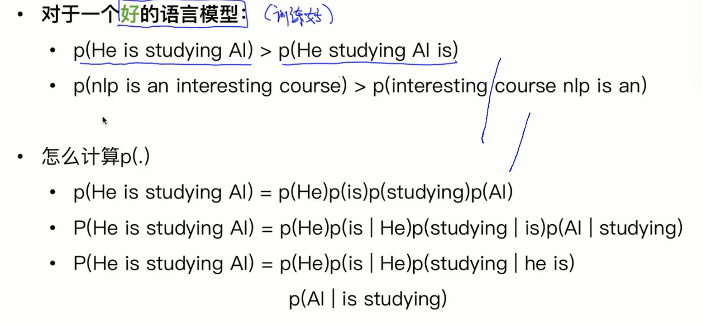
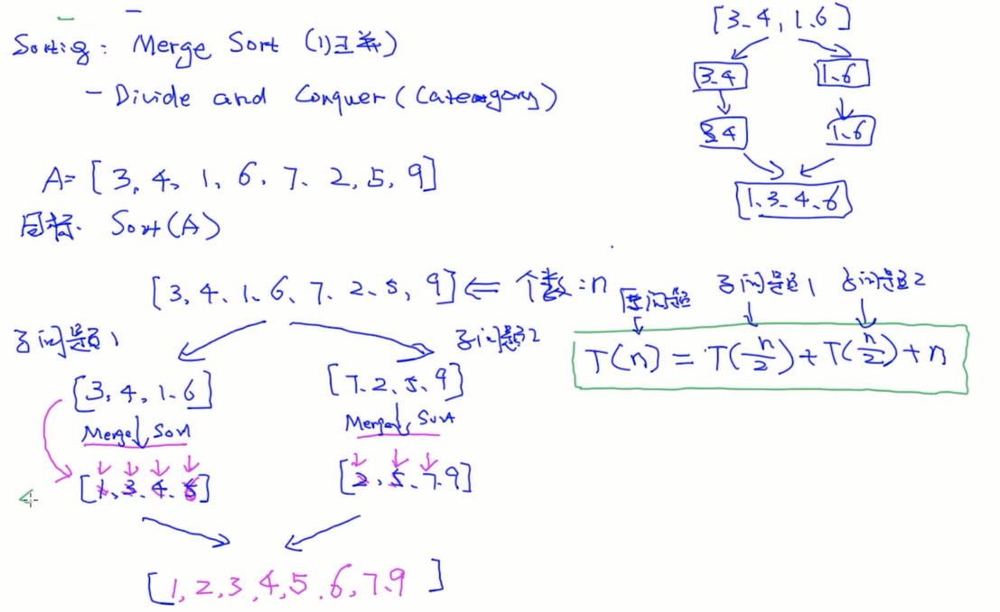
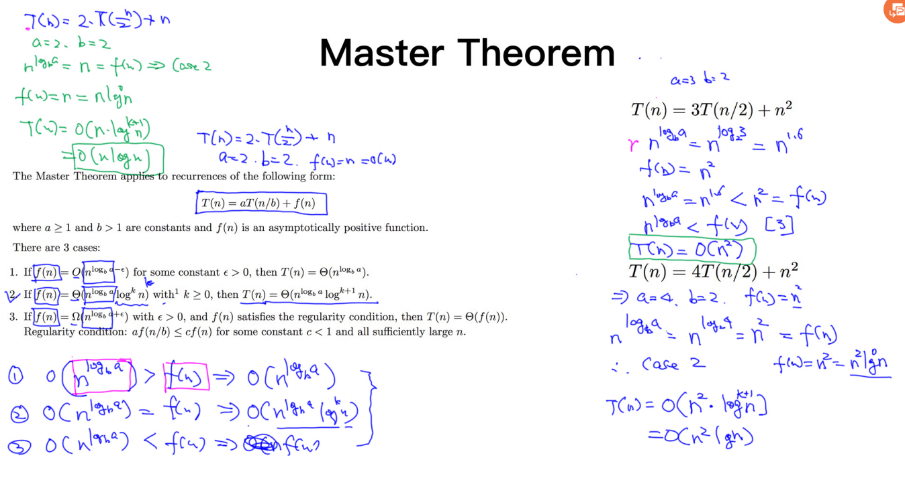

## NLP定义以及歧义性

**NLP是什么？**NLP=NLU+NLG

- NLU:语音/文本——>意思(meaning)

- NLG:意思——>文本/语音

**NLP为什么难？**

图片：看到什么就是什么，而文本还需要去理解内在的含义。

- 一个意思可以有多种表达方式

- 一词多义(Ambiguity)，解决方法：每种含义有一种概率（利用历史统计数据，利用上下文）

## 案例：机器翻译

**问题：如果现在让你写一个机器翻译系统，怎么实现？**

方法：根据语料做一个统计模型（大量双语语料中，哪两个单词总是一起出现，就很有可能是翻译），每个词对应的翻译是哪个。有什么缺点？

慢，没解决语义，上下文没考虑，语法不对，需要大量的规则统计

假设中文翻译成英文。

中文分词，根据词典把每个词翻译成英文(得到Broken English，可能不通顺)

那怎么让它通顺呢？最笨的方法就是对所有的词做排列组合，在所有可能的选择里选出最合适的句子。那怎么选出最合适的呢？假设有一个模型LM，输入句子，它就输出这个句子的概率，这样就能选出概率最高的句子作为最合适的。LM是语言模型。

缺点？计算量大

可不可以把翻译模型和语言模型两个步骤做成一个步骤？同时考虑而不是分开考虑。Decoding Model。维特比算法。

$max_{en}p(en|cn)$

根据贝叶斯定理，上式等价于$max_{en}p(cn|en)p(en)$，两个部分分别叫做翻译模型和语言模型。

维特比算法可以同时考虑2个部分。

语言模型（Language Model）

- 给定一句句英文e, 计算概率（e)
- 如果是符合英文语法的，p(e)会高
- 如果是随机语句，p(e)会低

翻译模型

- 给定一对<c,e>，计算p(c|e)
- 语义相似度高, 则p(c|e)高
- 语义相似度低，则p(c|e)低

Decoding Algorithm

- 给定语言模型，翻译模型和f, 找出最优的使得p(e)p(f|e)最大

语言模型

## NLP的关键技术

自然语言处理技术四个维度

- Semantic(语义)
- Syntax(句子结构)：句法分析，依存分析，
- Morphology(单词)：分词，词性，NER
- Phonetics(声音)

https://www.quora.com/What-are-the-major-open-problems-in-natural-language-understanding

## 复杂度

取大的

