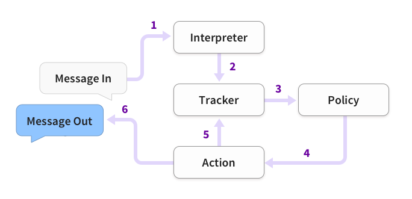

# RASA

## 安装

Windows和Linux都用下列方式安装成功

```Markdown
## conda中建一个虚拟环境
conda create -n 环境名 python=3.6
conda activate 环境名
## 安装rasa
pip --default-timeout=500 install -U rasa
# 在线安装Mitie
pip install git+https://github.com/mit-nlp/MITIE.git
pip install rasa[mitie]
# 安装jieba和flask
pip install jieba
pip install flask
## clone项目代码，根据README文件训练模型，运行服务
```


## 工作原理



- 首先，将用户输入的Message传递到Interpreter(Rasa NLU模块)，该模块负责识别Message中的"意图(intent)“和提取所有"实体”(entity)数据；

- 其次，Rasa Core会将Interpreter提取到的意图和识别传给Tracker对象，该对象的主要作用是跟踪会话状态(conversation state)；

- 第三，利用policy记录Tracker对象的当前状态，并选择执行相应的action，其中，这个action是被记录在Track对象中的；

- 最后，将执行action返回的结果输出即完成一次人机交互。

domain.yml配置意图intents、槽位slots、实体entities、行为actions、表单forms、回复responses（行为对应的回复）

表单对应的操作在actions.py里定义。

stories.md里面配置意图所对应的触发事件

文本进来——识别意图——触发表单事件——确定需要的槽位——用话术咨询获取到需要的实体——填充，返回

面向任务的对话系统整体流程由 NLU、DST、DPL、NLG 這 4 个主要模块组成。

#### 整体流程

输入：用户输入(sentence)
过程：
userAct <-- NLU(sentence)
dialogState <-- DST(userAct, dialogHistory)
systemAct <-- DPL(dialogState)
reply <-- NLG(systemAct)
输出：系统回复（reply）

#### NLU 模块

输入：用户输入(sentence)
过程：
userAct.intent <-- intentRecognizer(sentence)
userAct.slotArray <-- slotFilling(sentence, userAct.intent)
输出：用户动作(userAct)

#### DST 模块

输入：用户动作(uesrAct) & 对话历史(dialogHistory)

过程：

if userAct.intent is not None:

dialogState.intent <-- userAct.intent

dialogState.slotArray <-- userAct.slotArray

checkDefaultSlot(dialogState)

else:

dialogState.intent <-- getIntent(dialogHistory)

dialogState.slotArray <--

updateDialogState(userAct.slotArray, dialogHistory)

输出：对话状态(dialogState)

#### DPL 模块

输入：对话状态(dialogState)

过程：

if dialogState.intent == "询问天气":

if dialogState.slotArray[0] is None:

systemAct.intent <-- "AskDate"

elif dialogState.slotArray[1] is None:

systemAct.intent <-- "AskLocation"

else:

systemAct.intent <-- "AskWeather"

systemAct.slotArray[0] <- getWeather(dialogState.slotArray)

elif dialogState.intent is None:

systemAct.intent <-- Exception("IntentError")

else:

OtherService

输出：系统动作(systemAct)

#### NLG 模块

输入：系统动作(systemAct)

过程：

if systemAct.intent == "AskDate":

reply <-- "请输入时间"

elif systemAct.intent == "AskLocation":

reply <-- "请输入地点"

elif systemAct.intent == "AnswerWeather":

reply <-- systemAct.slotArray[0]

elif systemAct.intent == "IntentError":

reply <-- "抱歉，刚刚没听出，能再说一次吗"

else:

OthersystemAct

输出：系统回复(reply)

## NLU

文本进入NLU后的标准流程：

Message——tokenizer分词——featurizer提取特征——classifier意图分类

### NLU训练数据

#### NLU样本格式

Rasa框架提供了两种NLU模型训练样本数据格式，即`Markdown`或`JSON`，我们可以将NLU训练数据保存到单独的文件或者多个文件的目录。由于`JSON`的可读性不是很好，通常我们使用`Markdown`来存储训练数据。

```Markdown
## intent:request_phone_business
- 查个手机号
- 查电话号码[19800222425](phone_number)
- [余额](business)
- 查下[腾讯视频流量包](mobile_data_package)
- 你好！请帮我查询一下电话[12260618425](phone_number)的[账户余额](business)
- 帮我查个手机号[19860612222](phone_number)的[话费](business)
- 查下号码[19860222425](phone_number)的[抖音免流包](mobile_data_package)

## synonym:余额
- 余额
- 话费
- 话费余额
- 账户余额

## regex:phone_number
- ((\d{3,4}-)?\d{7,8})|(((\+86)|(86))?(1)\d{10})

## lookup: mobile_data_package
data/lookup_tables/DataPackage.txt

```


`nlu.md`训练数据包含四部分：

**（1）** **Common Examples** 

它是NLU模型的核心，也是训练NLU模型的基础。Common examples由三部分组成：intent、text和entities，其中，text表示用户自然语言文本，即用户Message；intent表示某个意图，它应于某些text相对应；entities表示将要被提取的目标实体，我们需要在text文本中标出(如果该text存在实体的话)。Common Examples一般格式如下：

```Markdown
## intent:你的意图名称
- text
```


注：text中可以不包括实体，但如果包含需要用[entityText](entityName)进行标志。

**（2）** **synonyms**  同义词，顾名思义，对于同义词来说，在实体提取时会统一被解析成同一个意思。比如：

```Markdown
## synonym:余额
- 余额
- 话费
- 话费余额
- 账户余额
```


在我们说`账户余额`、`话费`等词语时，NLU在提取实体时会能够成功被捕获，并被统一解析成`余额`。需要注意的是，为了在训练数据中使用同义词，需要pipeline中包含`EntitySynonmMapper`组件。

**（3）** **Regular Expression Features** 

正则表达式特征有助于意图分类和实体提取，但是它并不参与实体和意图的定义，仅仅是提供规则来协助意图分类和实体提取，因此，在训练文本text中，该添加的实体和意图样本需要照样添加。比如当需要用户输入的手机号实体时，我们可以再nlu.md文件中添加正则表达式特征支持，当用户输入的Message包含符合手机号正则表达式规则的内容时，Rasa可以更加容易地将其提取出来。Regular Expression Features一般格式如下：

```Markdown
## regex:phone_number
- ((\d{3,4}-)?\d{7,8})|(((\+86)|(86))?(1)\d{10})
```


注意：phone_number表示的既不是实体名也不是意图名，它只是一个便于我们阅读的标志而已。除了实体识别，我们还可以编写符合意图分类的正则表达式，这里就不演示了。另外，需要注意的是，对于实体提取来说，目前只有CRFEntityExtractor 实体提取器支持正则特征，像MitieEntityExtractor和SpacyEntityExtractor目前还不支持；对于意图分类器，目前均已支持正则特征。最后，为了使用正则特性，我们需要在pipline中添加RegexFeaturizer组件。

**（4）** **lookup tables** 

查找表有利于在加载训练数据时，生成与Regular Expression Features相同的正则特征。当在训练数据中提供查找表时，内容被组合成一个大型、不区分大小写的regex模式，该模式在训练示例中查找精确匹配。这些正则表达式匹配多个token，其处理与训练数据中直接指定的正则表达式模式相同。查找表可以包括在训练数据中，如果外部提供的数据必须要以换行进行分隔。比如data/lookup_tables/DataPackage.txt可以包含：

```Markdown
腾讯视频流量包
爱奇艺会员流量包
网易免流包
抖音免流包
流量月包
酷狗定向流量包
```


对该查找表在`nlu.md`文件中加载如下：

```Markdown
## lookup: mobile_data_package
data/lookup_tables/DataPackage.txt
```


注意：`mobile_data_package`表示实体名。为了查找表能够有效的被使用，训练数据中必须要有一些示例被匹配上。否则，模型不会使用查找表特征向查找表添加数据时必须小心，比如如果表中有误报或其他噪声，就会影响性能，因此请确保查找表包含干净的数据。

#cm：试了下总是报错。文件名、目录名或卷标语法不正确。: '\ufeff上海\n北京\n天津\n杭州\n南京'。试了各种编码都不行

要在config.yml中写上

```Markdown
- name: "RegexEntityExtractor"
  use_word_boundaries: False #中文环境要用
  use_lookup_tables: True
  use_regexes: True
```


### 阈值问题

config.yml

```Markdown
- name: "FallbackPolicy"
    nlu_threshold: 0.4
    core_threshold: 0.3
    ambiguity_threshold: 0.1
    fallback_action_name: "action_default_fallback"
```


#### 验证数据有效性

检查`domian.yml`、`NLU data`和`Story data`是否有错误。

- 使用命令`python m rasa data validate`

- 使用代码

```python
import logging
from rasa import utils
from rasa.core.validator import Validator

logger = logging.getLogger(__name__)

utils.configure_colored_logging('DEBUG')

validator = Validator.from_files(domain_file='domain.yml',
                                 nlu_data='data/nlu_data.md',
                                 stories='data/stories.md')

validator.verify_all()

```


### 意图分类器

RASA NLU意图分类器

### entity

[https://forum.rasa.com/t/introducing-entity-roles-and-groups/28156](https://forum.rasa.com/t/introducing-entity-roles-and-groups/28156)

### Slot

词槽是机器人的记忆力，它会以key-value的形式去存储用户提供的外部信息，大多数情况下，槽值都会影响整个对话。例如用户问今天天气怎么样，这个时候，如果我们要回答用户的问题，首先需要知道用户 问的天气是指的什么地点什么时间，这里的时间和地点就是所谓的词槽，在多轮对话中，主要任务就是把词槽的值填上，所以这个时候机器需要反问用户，询问的天气是什么地点，什么时间，当机器判断槽已经填满了，就可以把答案返回给用户了。而这里的地点，就应该采用Text类型的Slot。Policy是不会读取槽值里面的内容的，它只能判断是否有值。

不同的用户行为，需要使用不同类型的词槽来存储，Rasa有以下几种类型的词槽：

- Text Slot 文本类型


- Boolean Slot 布尔类型


- Categorical Slot 分类类型，举个例子，用户预定咖啡，咖啡分为Tall，Grande和Venti三种杯型，这时候只允许用户从这三种类型中选一个


- Float Slot 浮点类型


- List Slot 列表类型


- Unfeaturized Slot 该类型的词槽表示那些你想保存下来的信息，但是这些信息对于对话流程来说没有任何影响。

在domain文件中以以下格式定义slot，city是词槽的key，type是词槽的类型，initial_value是默认值，默认值是可选项，可不加。

```Markdown
slots:
  district:
    type: unfeaturized
    auto_fill: false
```


例子2

```Markdown
slots:
   account_type:
      type: categorical
      values:
      - premium
      - basic

```


### Actions

actions是接下来要执行的操作，包括返回给用户的信息。我们在上一篇博客中提到过，actions是以utter开头的，但其实actions并不只有这一种定义方法，在Rasa Core中有三种类型的actions，分别为

1.default actions：系统默认提供的action。default actions包含三个action_listen, action_restart, action_default_fallback

- action_listen，表示停止预测，等待用户的输入

- action_restart，表示重置整个会话

- action_default_fallback，撤消最后一条用户消息，并返回机器人不理解该消息

2.utter actions：模板回复，以 utter_作为开头, 该action只能用于给用户返回信息。如果你只需要给用户直接返回一条文本信息而没有其他的操作的话，那么action需要用UtterAction，并且采用utter_的前缀，如果没有这个前缀，那这个action就会被识别为custom actions。

3.custom actions：该action可执行任何的操作。custom actions表示的是用户自定义的action，这个action是多轮的关键点。custom action需要配合代码一起使用，它能返回任何你想返回的内容，甚至一些操作，例如你的对话系统连接到了你的灯泡，你可以通过custom actions来自动打开灯，当然了，你也可以用该方法来返回文本信息，达到和utter actions一样的效果。

- 在 domain.yml 文件中定义 actions

- 在 endpoint.yml 文件中指定 webserver 的 url 地址，在指定的 webserver 中实现它

- 官方提供 python sdk 使用户自定义 action，需继承 Action 并重写 name 和 run 方法

custom actions必须继承于Action类，并重写其中的两个方法，name与run，name方法是用来返回当前action的名字，这个名字必须和定义在stories中的action名字一样。run方法包括三个参数，分别是dispatcher、tracker、domain，通过tracker可以获取到槽值与用户最近输入的内容，如果想给用户返回信息，可以使用dispatcher，调用 dispatcher.utter_template, dispatcher.utter_message或者rasa_core_sdk.executor.CollectingDispatcher 方法。run方法返回的是给下一个action用的槽值，注意返回值必须是[SlotSet(key,value)]的格式。

custom actions在Rasa中的使用方式并不是直接调用，而是采用服务的形式，所以如果想使用自定义的action，还需要定义一个endpoints.yml文件，文件内容如下：

action_endpoint:

url: '[http://localhost:5055/webhook](http://localhost:5055/webhook)'

在启动会话的时候添加额外的命令--endpoints endpoints.yml，该命令会在5055端口启动一个服务，这个服务就是我们定义的action。


### 源码

C:\ProgramData\Anaconda3\envs\rasapj\Lib\site-packages\rasa

#### message.py

nlu模块接受Message类型的数据作为输入，源码在rasa.shared.nlu.training_data.message.py中。默认的变量，分别为time、data、features、output_properties。其中，text中存储的是用户输入的问题，time存储的是时间，data存储的是解析后的数据。

Message中常用的方法是get和set方法，get是从data中取出想要的数据，set是将解析后的intent等信息存入data中。

#### model.py

rasa/nlu/model.py

model.py中定义了Interpreter类，主要用于解析数据，该类在rasa/core/interpreter.py中的RasaNLUInterpreter调用，用于解析text。

#### interpreter.py

rasa/core/interpreter.py

RasaNLUInterpreter

在初始化的时候，通过self._load_interpreter()来引入rasa.nlu.model中的Interpreter模块，Interpreter有一个load方法，load传入已经训练好的模型文件路径，加载出nlu模型供interpreter调用。

如果想新建自己的interpreter类，需要注意两点：

- 如何传入已经训练好的nlu模型文件路径和在rasa中引入自己的interpreter模块，这部分可以在endpoints.yml中引入

- 额外数据的引入，由于parse方法中传入了tracker，历史信息都可以在tracker中获取。

#### processor.py

rasa/core/processor.py

在processor中，def parse_message调用interpreter方法，然后在外层封装为def _handle_message_with_tracker

## Core：对话管理

对话管理（Dialog Management，DM）控制着人机对话的进程，对话管理通过对自然语言理解模块的输出（即意图、槽位、槽位信息）的处理来进行和用户的交互和反应。针对带有明确意图的用户，在对话管理过程中用户不但可以完善或修正自己需求，管理系统也可以在用户需求不够具体的时候明确或澄清用户的需求，以达到最终的任务完成。  


对话管理系统主要包括两部分：状态追踪和对话策略。对话策略通常作为对话管理的输出，如对该场景下缺失槽位的反问策略等。以某公司智能产品介绍系统的多伦对话为示例：

|轮次|Bot / 客户|对话内容|行为判别|
|---|---|---|---|
|1|Bot|这里是 XX 公司，很高兴为您服务！|开场白|
|2|客户|我想了解贵司有哪些 AI 产品|意图识别（产品咨询）|
|3|Bot|好的，您有哪方面的业务需求？|澄清需求，以便填槽|
|4|客户|需要支持语音识别并自动识别出风险信息|槽填充（语音 & 信息）|
|5|Bot|对处理技术有要求吗？|澄清需求|
|6|客户|最好有大数据处理能力|槽填充（大数据）|
|7|Bot|好的，咱们 XX 产品非常符合您的需求！|任务完成，反馈相关产品介绍|


### Stories - 对话场景

对话的场景流程。人机对话过程中可能出现的故事情节，训练得到人机对话系统所需的对话模型。

- 场景：用 “##” 表示

- 意图：用 “*” 表示

- 活动：用 “-” 表示

## Tracker数据存储与流转

rasa中的数据存储和流转都是通过tracker来实现的。tracker类的定义DialogueStateTracker在rasa/shared/core/trackers.py中。tracker的存储则定义在rasa/core/tracker_store.py中。

### 数据传入rasa

rasa提供了数据传入接口，我们可以通过requests模块post请求数据，在rasa内部，通过inputchannel模块接收并组织数据。

在rasa/core/channels/channel.py中有一个基类class InputChannel，该类中常用的需改写的方法就是get_metadata。该方法中定义了一个字典metadata，我们可以把任何需要的数据update到metadata字典中，然后在其他地方调用。

```python
scene_id = request.json.get("scene_id")
metadata["scene_id"] = scene_id
```


在实际应用中，我们常用的inputchannel模块是RestInput（在channels/rest.py中），它继承了基类class InputChannel，其中重要的方法是_extract_sender，_extract_message，分别是获取传入的id和文本内容。

他们的key分别为"sender"和"message"，当然，key的名称可以自己指定，但要记住post请求的时候要用相同的key名称。

### tracker的定义和数据添加

DialogueStateTracker类中定义了很多方法和要存储的数据，但在实际应用中，我们可能不满足与rasa给定的那些数据，比如在我们的智能外呼项目中，对一通完整的对话，我们需要在会话结束的时候给这一通对话打上tag并存储下来，这就需要在trakcer中添加一个tag_info字段。


对话主要入口

rasa/core/agent.py的handle_text()和handle_message()

processor.py

processor.handle_message(message)

tracker = await self.log_message(message)
根据message，sender_id获取当前的**对话状态DialogueStateTracker** 

await self._predict_and_execute_next_action(message, tracker)循环计算下个action是哪个，得分和对应的policy

action, prediction = self.predict_next_action(tracker)计算下个action的得分和对应使用的policy

### 各个对话策略policy

Embedding Policy（REDP，效果最好需要重点研究）

The Recurrent Embedding Dialogue Policy (REDP) described in our paper，对应论文:
[Few-Shot Generalization Across Dialogue Tasks](https://link.zhihu.com/?target=https://arxiv.org/abs/1811.11707)

This policy only works with FullDialogueTrackerFeaturizer(state_featurizer).

FormPolicy（槽填充，重要，比较常用，详见[https://rasa.com/docs/rasa/core/forms/#forms](https://link.zhihu.com/?target=https://rasa.com/docs/rasa/core/forms/#forms)）

KerasPolicy（LSTM）

MemoizationPolicy：如果与训练数据完全一致则得分为1，否则为0

MappingPolicy：直接把识别的意图映射到一个具体action

FallbackPolicy：识别的置信度得分小于设置的阈值时进行触发的action，可设置nlu和core的阈值

## docker中运行Rasa

安装&启动docker参考 [Docker](https://www.wolai.com/8UeSFmu8pYWmHf6xx6o9yf)中的Linux安装部分

建一个文件夹，进入文件夹，按照[rasa官方教程](https://rasa.com/docs/rasa/docker/building-in-docker/)来

1.初始化建立一个rasa项目

中间遇到的问题

- 没权限建立actions：[https://github.com/rasahq/rasa/issues/4653](https://github.com/rasahq/rasa/issues/4653)，执行下面命令：

```Markdown
stat .
# 可以看到user，比如user是0，执行下面命令
docker run --user 0 -v $(pwd):/app rasa/rasa:2.8.0-full init --no-prompt
```


如果是已有项目，不需要运行上述命令

2.使用docker compose运行多个服务

要将Rasa与其他服务(例如用于自定义操作的服务)一起运行，建议使用[Docker Compose](https://rasachatbot.com/9_Running_Rasa_with_Docker/)。Docker Compose提供了一种简单的方法，可以将多个容器一起运行，而无需运行多个命令。

`touch docker-compose.yml`

写入内容

```Markdown
version: '3.0'
services:
  rasa:
    image: rasa/rasa:2.8.0-full
    ports:
      - 5390:5005
    volumes:
      - ./:/app
    command:
      - run
  action_server:
    image: rasa/rasa-sdk:latest
    ports:
      - 5350:5055
    volumes:
      - ./actions:/app/actions 
```


该文件以你要使用的Docker Compose规范版本开头。每个容器都在docker-compose文件中声明为`service` 。第一项服务是rasa服务。

该命令类似于`docker run`命令。`ports`部分定义容器和你的主机系统之间的端口映射。在这种情况下，它会在你的主机的`5390`端口上提供`5005`的`rasa`服务。这是Rasa的[REST Channel](https://rasachatbot.com/9_Running_Rasa_with_Docker/)接口的端口。

*注意: 由于Docker Compose启动了一组Docker容器，因此在执行* *run* *命令后不再可能连接到单个容器的命令行。* 

要运行`docker-compose.yml`中配置的服务，请执行: `docker-compose up`

如果命令找不到，执行`pip install docker-compose`

后台运行是`docker-compose up``-d`

注：没成功过。。。。

3.shell界面运行

`docker run -it -v $(pwd):/app rasa/rasa:2.8.0-full shell`

4.训练模型

`docker run -v $(pwd):/app rasa/rasa:2.8.0-full train --domain domain.yml --data data --out models`

5.运行

创建一个网络来连接actions和rasa：`docker network create my-project`

然后运行actions：`docker run -d -v $(pwd)/actions:/app/actions --net my-project --name action-server rasa/rasa-sdk:2.8.0`

然后在endpoints.yml里面加上（这里的端口根据情况而定，默认是5055）

```Markdown
action_endpoint:
  url: "http://action-server:5055/webhook"
```


然后可以shell中交互`docker run -it -v $(pwd):/app -p 5005:5005 --net my-project rasa/rasa:2.8.0-full shell --endpoints  configs/endpoints.yml`

或者`docker run -it -v $(pwd):/app -p 5390:5005 --net my-project rasa/rasa:2.8.0-full run`

`docker run -d -v $(pwd):/app -p 5390:5005 --net my-project rasa/rasa:2.8.0-full run`

如果是用公司的：

`docker run -d -v $(pwd)/actions:/app/actions --net my-project --name action-server hub.cloud.ctripcorp.com/rasa2.8.0/rasa-sdk:2.8.0`

`docker run -d -v $(pwd):/app -p 8080:5005 --net my-project hub.cloud.ctripcorp.com/rasa2.8.0/rasafull:20210726 run`

-it改成-d就是后台运行。

把endpoints.yml放到当前目录下，就不需要写endpoints参数了。

**问题** 

time out一般是请求不到，说明端口没有放开，没权限，改端口号

如果需要在docker中自定义别的包，参考：[https://rasa.com/docs/rasa/how-to-deploy#recommended-deployment-methods](https://rasa.com/docs/rasa/how-to-deploy#recommended-deployment-methods)

将docker镜像传到公司的dockerhub仓库：[http://conf.ctripcorp.com/pages/viewpage.action?pageId=605064180#id-复制从Dockerhub使用指南-复制从Dockerhub使用指南-三、Pull/Push镜像](http://conf.ctripcorp.com/pages/viewpage.action?pageId=605064180#id-复制从Dockerhub使用指南-复制从Dockerhub使用指南-三、Pull/Push镜像)


## 参考资料

[做了20+个AI多轮对话项目后的总结](https://www.163.com/dy/article/G3M9899R0511805E.html)

[Rasa Core开发指南](https://blog.csdn.net/AndrExpert/article/details/92805022)

[Rasa中文聊天机器人开发指南(1)：入门篇](https://blog.csdn.net/AndrExpert/article/details/104328946)

[Rasa中文聊天机器人开发指南(2)：NLU篇](https://jiangdg.blog.csdn.net/article/details/104530994)

[Rasa中文聊天机器人开发指南(3)：Core篇](https://jiangdg.blog.csdn.net/article/details/105434136)

[https://github.com/km1994/nlp_paper_study/blob/master/dialogue_system_study/rasa/rasa中文对话系统.md](https://github.com/km1994/nlp_paper_study/blob/master/dialogue_system_study/rasa/rasa中文对话系统.md)

[https://github.com/km1994/nlp_paper_study/blob/master/dialogue_system_study/rasa/rasa中文对话系统构建.md](https://github.com/km1994/nlp_paper_study/blob/master/dialogue_system_study/rasa/rasa中文对话系统构建.md) 

[https://github.com/km1994/nlp_paper_study/blob/master/dialogue_system_study/rasa/rasa系列/rasa_core_Action.md](https://github.com/km1994/nlp_paper_study/blob/master/dialogue_system_study/rasa/rasa系列/rasa_core_Action.md)

[https://github.com/km1994/nlp_paper_study/blob/master/dialogue_system_study/rasa/rasa系列/rasa_core_FormAction.md](https://github.com/km1994/nlp_paper_study/blob/master/dialogue_system_study/rasa/rasa系列/rasa_core_FormAction.md)

[https://github.com/km1994/nlp_paper_study/blob/master/dialogue_system_study/rasa/rasa系列/rasa_core_Policies.md](https://github.com/km1994/nlp_paper_study/blob/master/dialogue_system_study/rasa/rasa系列/rasa_core_Policies.md)

[https://github.com/km1994/nlp_paper_study/blob/master/dialogue_system_study/rasa/rasa系列/rasa_core_Stories.md](https://github.com/km1994/nlp_paper_study/blob/master/dialogue_system_study/rasa/rasa系列/rasa_core_Stories.md)

[https://github.com/km1994/nlp_paper_study/blob/master/dialogue_system_study/rasa/rasa系列/rasa_nlu.md](https://github.com/km1994/nlp_paper_study/blob/master/dialogue_system_study/rasa/rasa系列/rasa_nlu.md)

[Rasa安装以及项目初尝试](https://ningshixian.github.io/2020/12/14/Rasa%E5%AE%89%E8%A3%85%E4%BB%A5%E5%8F%8A%E9%A1%B9%E7%9B%AE%E5%88%9D%E5%B0%9D%E8%AF%95/)

[RASA源码解析与开发：综述](https://zhuanlan.zhihu.com/p/231020989)

[rasa core源码分析第2波-对话管理](https://zhuanlan.zhihu.com/p/76935986)

[多轮对话 - Core篇](https://www.jianshu.com/p/bd1bb573511c)（有rasa多轮对话的例子）

[rasa文章导引（用于收藏）](https://zhuanlan.zhihu.com/p/88112269)

Rasa NLU及自定义NLU组件

[https://github.com/vba34520/rasa_nlu_xercis](https://github.com/vba34520/rasa_nlu_xercis)（自定义组件）

[https://terrifyzhao.github.io/2019/02/26/Rasa使用指南02.html](https://terrifyzhao.github.io/2019/02/26/Rasa使用指南02.html)

[对话系统rasa - forms (翻译)](https://zhuanlan.zhihu.com/p/84441651)

[https://github.com/GaoQ1/rasa_chatbot_cn](https://github.com/GaoQ1/rasa_chatbot_cn)

[https://blog.csdn.net/ljp1919/category_9656007.html](https://blog.csdn.net/ljp1919/category_9656007.html)

[https://rasachatbot.com/9_Running_Rasa_with_Docker/](https://rasachatbot.com/9_Running_Rasa_with_Docker/)

[Rasa NLU（高级版）第二部分：实体识别](https://www.codenong.com/js237e2c56c035/)

[Rasa NLU及自定义NLU组件](https://puluwen.github.io/2018/12/rasa-nlu/)

[智能交互助手 - Rasa自定义的component](https://www.jianshu.com/p/1762f42d0b60)（使用BERT做分类和NER）

[rasa blog - 设计Rasa训练故事](https://www.wolai.com/q53LBnnhC49wzJNQ6Tqp5E)

[https://github.com/crownpku/Rasa_NLU_Chi/issues/57](https://github.com/crownpku/Rasa_NLU_Chi/issues/57)

**训练数据的生成工具** 

[智能交互助手 - Rasa训练数据](https://www.jianshu.com/p/197f55ff96cd)


