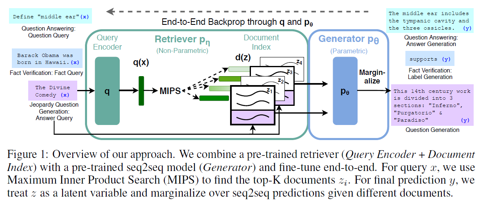
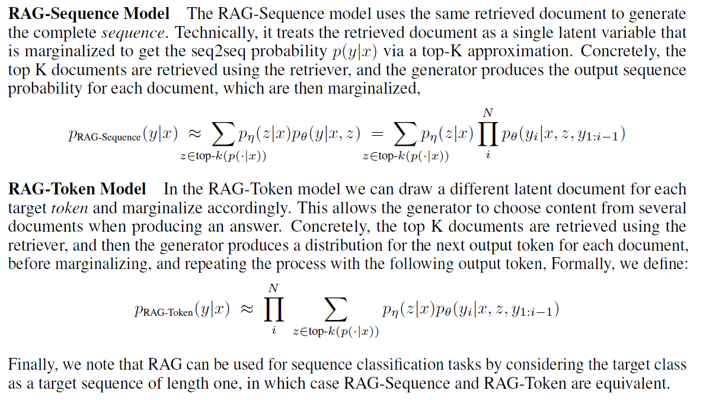
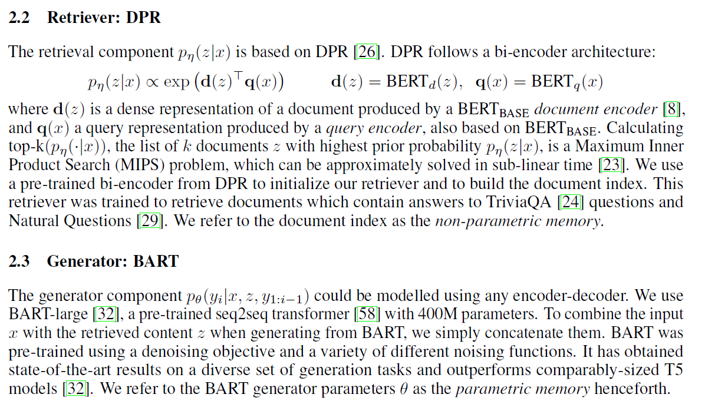

Retrieval-Augmented Generation for Knowledge-Intensive NLP Tasks

https://github.com/huggingface/transformers/blob/master/examples/rag/

论文的RAG模型：

- the parametric memory is a pre-trained seq2seq transformer(BART)
- the non-parametric memory is a dense vector index of Wikipedia, accessed with a pre-trained neural retriever(Dense Passage Retriever).

总结起来就是**拿到问题后先查资料再答题**

The retriever (Dense Passage Retriever [26], henceforth DPR) provides latent documents conditioned on the input, and the seq2seq model (BART [32]) then conditions on these latent documents together with the input to generate the output. We marginalize the latent documents with a top-K approximation,
either on a per-output basis (assuming the same document is responsible for all tokens) or a per-token
basis (where different documents are responsible for different tokens). Like T5 [51] or BART, RAG
can be fine-tuned on any seq2seq task, whereby both the generator and retriever are jointly learned

retriever：给定query x返回top k个text passages

generator：根据之前i-1个token，原始的输入x以及passage z生成当前的token

## 参考资料

https://blog.csdn.net/qq_40212975/article/details/109046150

https://zhuanlan.zhihu.com/p/339942960

