数据增强（Data Augmentation，简称DA） 是通过采用一些策略 增加 训练样本的数据量，提高模型的训练效果。

可以根据生成样本的多样性程度，将DA方法分为以下三种：

1. Paraphrasing：对句子中的词、短语、句子结构做一些更改，保留原始的语义
2. Noising：在保证label不变的同时，增加一些离散或连续的噪声，对语义的影响不大
3. Sampling：旨在根据目前的数据分布选取新的样本，会生成更多样的数据

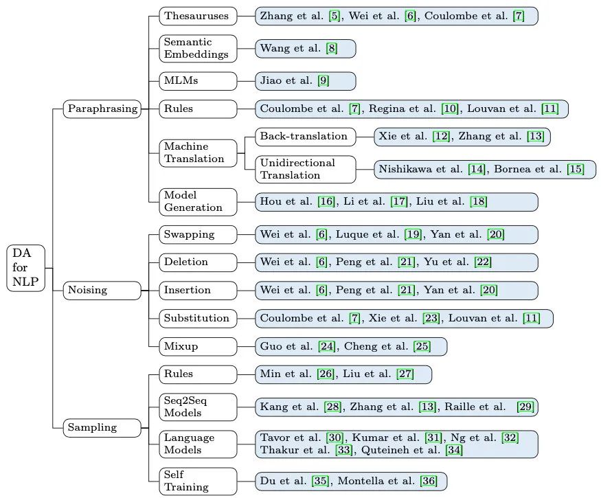

## Paraphrasing

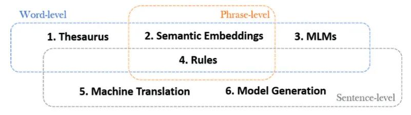

这类方法根据替换的成分不同，又可以分为词、短语、句子级别。作者共总结了6种方法：

1. Thesaurus：利用词典、知识图谱等外部数据，随机将非停用词替换成同义词或上位词，如果增加多样性的话还可以替换成相同词性的其他词
2. Semantic Embeddings：利用语义向量，将词或短语替换成相近的（不一定是同义词）。由于每个词都有语义表示，可替换的范围更大。而上一种方法只能替换图谱里的
3. MLMs：利用BERT等模型，随机mask掉一些成分后生成新的
4. Rules：利用一些规则，例如缩写、动词变位、否定等，对句子一些成分进行改写，比如把 is not 变成 isn't
5. Machine Translation：分为两种，Back-translation指把句子翻译成其他语言再翻译回来，Unidirectional Translation指在跨语言任务中，把句子翻译成其他语言
6. Model Generation：利用Seq2Seq模型生成语义一致的句子

作者还贴心地整理了上述方法的优缺点。其中「歧义」主要是指有些多义词在不同场景下意思不一样，比如「我每天吃一个苹果」，替换成「我每天吃一个iphone」就不合适了。

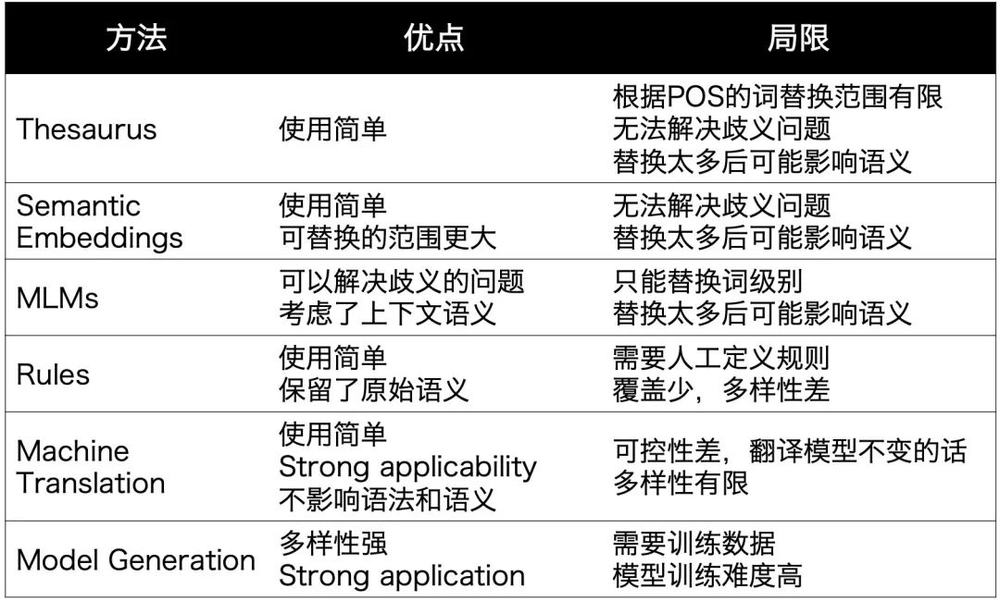

## Noising

人在读文本时对噪声是免疫的，比如单词乱序、错别字等。基于这个思想，可以给数据增加些噪声来提升模型鲁棒性。

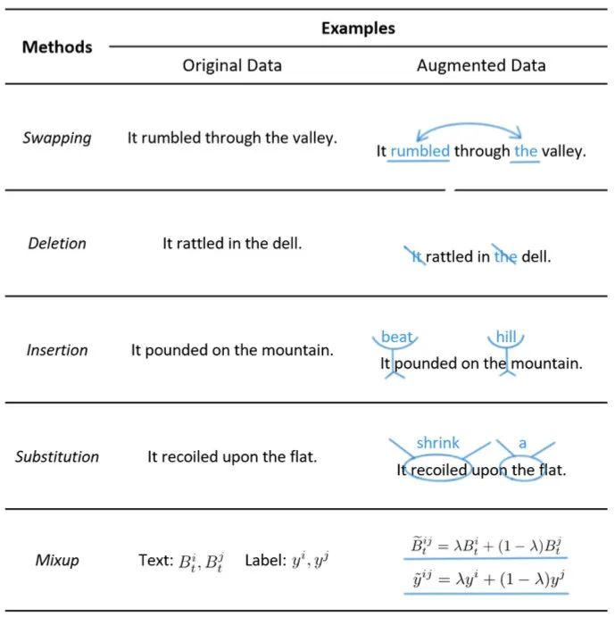

作者给出了以上5种增加噪声的方法：

1. Swapping：除了交换词之外，在分类任务中也可以交换instance或者sentence
2. Deletion：可以根据tf-idf等词的重要程度进行删除
3. Insertion：可以把同义词随机插入句子中
4. Substitution：把一些词随机替换成其他词（非同义），模拟misspelling的场景。为了避免改变label，可以使用label-independent的词，或者利用训练数据中的其他句子
5. Mixup：这个方法最近两年比较火，把句子表示和标签分别以一定权重融合，引入连续噪声，可以生成不同label之间的数据，但可解释性较差

总的来说，**引入噪声的DA方法使用简单，但会对句子结构和语义造成影响，多样性有限，主要还是提升鲁棒性**。

这里我私下多加几个没提到的，也是我们在做[ConSERT](https://mp.weixin.qq.com/s?__biz=MzAxMTk4NDkwNw==&mid=2247487041&idx=1&sn=230b6eade9b5f921e2bd3f1017b54e9b&scene=21#wechat_redirect)时用到的方法：

1. 对抗样本
2. Dropout：也是SimCSE用到的，还有R-drop，都是通过dropout来加入连续噪声
3. Feature Cut-off：比如BERT的向量都是768维，可以随机把一些维度置为0，这个效果也不错

## Sampling

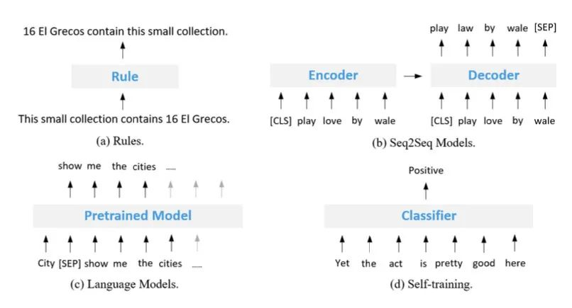

Sampling是指从数据分布中采样出新的样本，不同于较通用的paraphrasing，采样更依赖任务，需要在保证数据可靠性的同时增加更多多样性，比前两个数据增强方法更难。作者整理了4种方法：

1. Rules：用规则定义新的样本和label，比如把句子中的主谓进行变换
2. Seq2Seq Models：根据输入和label生成新的句子，比如在NLI任务中，有研究者先为每个label（entailment，contradiction，neutral）训一个生成模型，再给定新的句子，生成对应label的。对比之下，paraphrasing主要是根据当前训练样本进行复述
3. Language Models：给定label，利用语言模型生成样本，有点像前阵子看的[谷歌UDG](https://mp.weixin.qq.com/s?__biz=MzAxMTk4NDkwNw==&mid=2247488544&idx=1&sn=115d77aa56ac6c2bcff6f6258975c512&scene=21#wechat_redirect)。有些研究会加个判别模型过滤
4. Self-training：先有监督训练一个模型，再给无监督数据打一些标签，有点蒸馏的感觉

作者依旧贴心地给出了4中方法的优点和局限：

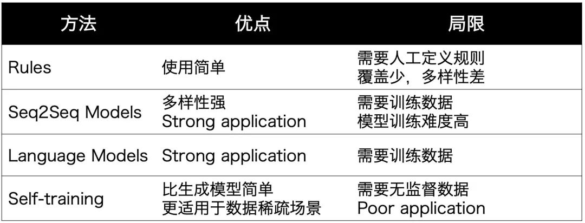

## 方法选择

作者给出了这些方法在6个维度的对比，大家可以更好地体会他们的区别和适用场景。其中Level表示DA方法会增强的部分：`t=text, e=embedding, l=label`，Granularity表示增强的粒度：`w=word, p=phrase, s=sentence`。

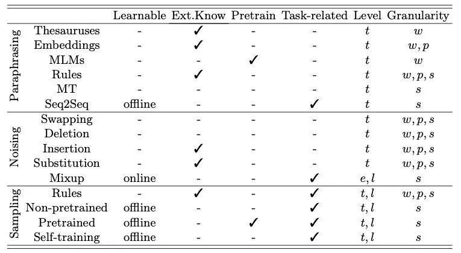

## Method Stacking

实际应用时可以应用多种方法、或者一种方法的不同粒度。

作者推荐了两款工具：

```
Easy DA: https://github.com/jasonwei20/eda_nlp
Unsupervised DA：https://github.com/google-research/uda
```

同时我搜索了一下github又发现了两个宝藏：

```
英文：https://github.com/makcedward/nlpaug
中文：https://github.com/zhanlaoban/eda_nlp_for_Chinese
```

## Optimization

第一，在使用增强的数据时，如果数据质量不高，可以先让模型在增强后的数据上pre-train，之后再用有标注数据训练。如果要一起训练，在增强数据量过大的情况下，可以对原始训练数据过采样

第二，在进行数据增强时注意这些超参数的调整：

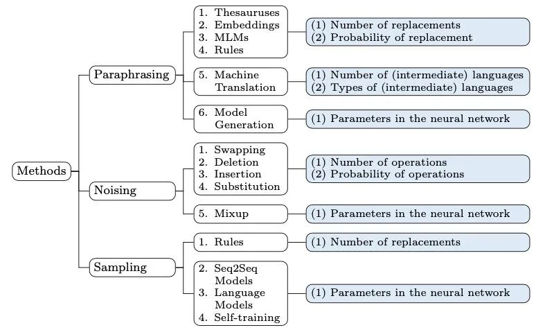

第三，其实增强很多简单数据的提升有限，可以注重困难样本的生成。比如有研究加入对抗训练、强化学习、在loss上下文章等。如果用生成方法做数据增强，也可以在生成模型上做功夫，提升数据多样性。

第四，如果生成错数据可能引入更多噪声，可以增加其他模型对准确性进行过滤。

最后，作者列举了其他研究的数据增强应用场景，大家在落地时可以借鉴：

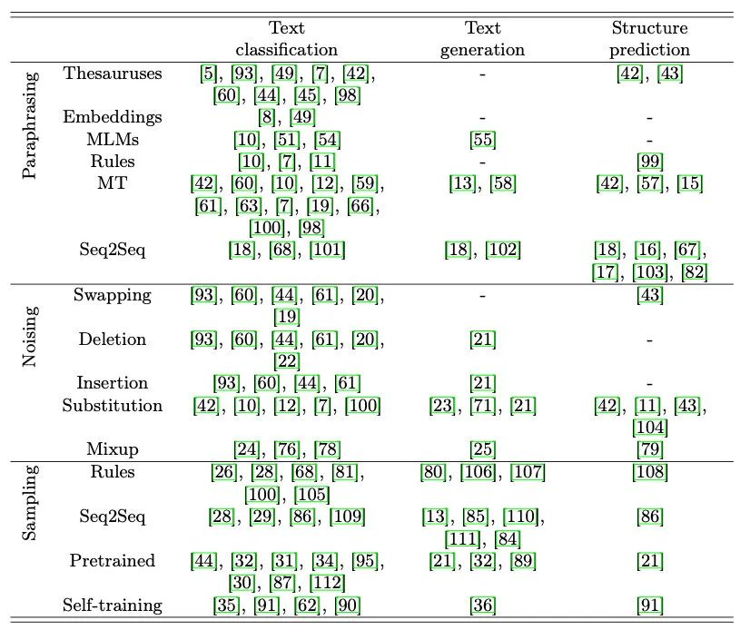


## 1. 词汇替换

### **1.1 基于同义词典的替换**

从句子中随机取出一个单词，将其替换为对应的同义词。

英文： [WordNet](https://wordnet.princeton.edu/) 数据库（NLTK， [TextBlob](https://textblob.readthedocs.io/en/dev/quickstart.html#wordnet-integration) API， [PPDB](http://paraphrase.org/#/download) ）

中文： synonyms python 同义词词典

### **1.2 基于 Word-Embeddings 的替换**

采用预先训练好的词向量，如 Word2Vec、GloVe、FastText，用向量空间中距离最近的单词替换原始句子中的单词。

例如TinyBERT就用了这种技术。

```python
# pip install gensim
import gensim.downloader as api

model = api.load('glove-twitter-25')  
model.most_similar('awesome', topn=5)
```

### **1.3 基于 Masked Language Model 的替换**

可以使用一个预先训练好的 BERT 模型，然后对文本的某些部分进行 Mask，让 BERT 模型预测被 Mask 的词语。

我们称这种方法叫 Mask Predictions。和之前的方法相比，这种方法生成的文本在语法上更加通顺，因为模型在进行预测的时候考虑了上下文信息。我们可以很方便的使用 HuggingFace 的 transfomers 库，通过设置要替换的词语并生成预测来做文本的数据增强。

```python
from transformers import pipeline
nlp = pipeline('fill-mask')
nlp('This is <mask> cool')

output:
[{'score': 0.515411913394928,
  'sequence': '<s> This is pretty cool</s>',
  'token': 1256},
 {'score': 0.1166248694062233,
  'sequence': '<s> This is really cool</s>',
  'token': 269},
 {'score': 0.07387523353099823,
  'sequence': '<s> This is super cool</s>',
  'token': 2422},
 {'score': 0.04272908344864845,
  'sequence': '<s> This is kinda cool</s>',
  'token': 24282},
 {'score': 0.034715913236141205,
  'sequence': '<s> This is very cool</s>',
  'token': 182}]
```

然而，这种方法的一个需要注意的地方是如何确定要 Mask 文本的哪一部分，一般需要使用启发式的方法来决定 Mask 的地方，否则生成的文本可能无法保留原句的含义。

### **1.4 基于 TF-IDF 的替换**

这种数据增强方法是 [Xie](https://link.zhihu.com/?target=https%3A//arxiv.org/abs/1904.12848) 等人在 "Unsupervised Data Augmentation" 论文中提出来的。其基本思想是，**TF-IDF 分数较低的单词不能提供信息，因此可以在不影响句子的基本真值标签的情况下替换它们。**

如何计算整个文档中单词的 TF-IDF 分数并选择最低的单词来进行替换，可以参考作者公开的[代码](https://github.com/google-research/uda/blob/master/text/augmentation/word_level_augment.py)。

## 2. Back Translation（回译）

使用机器翻译来回译的具体流程如下：

- 找一些句子(如英语)，翻译成另一种语言，如法语
- 把法语句子翻译成英语句子
- 检查新句子是否与原来的句子不同。如果是，那么我们使用这个新句子作为原始文本的补充版本。

对于如何实现回译，可以使用 TextBlob 或者谷歌翻译。

百度翻译

- https://api.fanyi.baidu.com/api/trans/product/desktop

- https://blog.csdn.net/HUSTHY/article/details/103887957

[Xie](https://link.zhihu.com/?target=https%3A//arxiv.org/abs/1904.12848) 等人使用这种方法来扩充未标注的样本，在 IMDB 数据集上他们只使用了 20 条标注数据，就可以训练得到一个半监督模型，并且他们的模型优于之前在 25000 条标注数据上训练得到的 SOTA 模型。

这种方法也在 Kaggle 上的 "Toxic Comment Classification Challenge" 的[第一名解决方案](https://link.zhihu.com/?target=https%3A//www.kaggle.com/c/jigsaw-toxic-comment-classification-challenge/discussion/52557)中使用。获胜者将其用于训练数据扩充和测试，在应用于测试的时候，对英语句子的预测概率以及使用三种语言(法语、德语、西班牙语)的反向翻译进行平均，以得到最终的预测。

## 3. Text Surface Transformation

这些是使用正则表达式应用的简单模式匹配变换，[Claude Coulombe](https://link.zhihu.com/?target=https%3A//arxiv.org/abs/1812.04718) 在他的论文中介绍了这些变换的方法。

在论文中，他给出了一个将动词由缩写形式转换为非缩写形式的例子，我们可以通过这个简单的方法来做文本的数据增强。比如it is 变为it's

需要注意的是，虽然这样的转换在大部分情况下不会改变句子原本的含义，但有时在扩展模棱两可的动词形式时可能会失败，比如she's是she is 还是she has？

为了解决这一问题，论文中也提出允许模糊收缩 (非缩写形式转缩写形式)，但跳过模糊展开的方法 (缩写形式转非缩写形式)。

我们可以在这里找到英语缩写的[列表](https://link.zhihu.com/?target=https%3A//en.wikipedia.org/wiki/Wikipedia%3aList_of_English_contractions)。对于展开，可以使用 Python 中的 [contractions 库](https://github.com/kootenpv/contractions)。

## 4. Random Noise Injection

这些方法的思想是在文本中注入噪声，来生成新的文本，最后使得训练的模型对扰动具有鲁棒性。

### **4.1 Spelling error injection**

在这种方法中，我们在句子中添加一些随机单词的拼写错误。可以通过编程方式或使用常见拼写错误的映射来添加这些拼写错误，具体可以参考这个[链接](https://link.zhihu.com/?target=https%3A//github.com/makcedward/nlpaug/blob/master/model/spelling_en.txt)。

### **4.2 QWERTY Keyboard Error Injection**

这种方法试图模拟在 QWERTY 键盘布局上打字时由于键之间非常接近而发生的常见错误。这种错误通常是在通过键盘输入文本时发生的。

### **4.3 Unigram Noising**

这种方法已经被 [Xie](https://link.zhihu.com/?target=https%3A//arxiv.org/abs/1703.02573) 等人和 [UDA](https://link.zhihu.com/?target=https%3A//arxiv.org/abs/1904.12848) 的论文所使用，其思想是使用从 unigram 频率分布中采样的单词进行替换。**这个频率基本上就是每个单词在训练语料库中出现的次数。**

### **4.4 Blank Noising**

该方法由 [Xie](https://link.zhihu.com/?target=https%3A//arxiv.org/abs/1703.02573) 等人在他们的论文中提出，其思想是用占位符标记替换一些随机单词。本文使用 "_" 作为占位符标记。在论文中，他们使用它作为一种避免在特定上下文上过度拟合的方法以及语言模型平滑的机制，这项方法可以有效提高生成文本的 Perplexity 和 BLEU 值。

### **4.5 Sentence Shuffling**

这是一种很初级的方法，我们将训练样本中的句子打乱，来创建一个对应的数据增强样本。

### **4.6 Random Insertion**

这个方法是由 [Wei](https://link.zhihu.com/?target=https%3A//arxiv.org/abs/1901.11196) 等人在其论文 "Easy Data Augmentation" 中提出的。在该方法中，我们首先从句子中随机选择一个不是停止词的词。然后，我们找到它对应的同义词，并将其插入到句子中的一个随机位置。（也比较 Naive）

### **4.7 Random Swap**

这个方法也由 [Wei](https://link.zhihu.com/?target=https%3A//arxiv.org/abs/1901.11196) 等人在其论文 "Easy Data Augmentation" 中提出的。该方法是在句子中随机交换任意两个单词。

### **4.8 Random Deletion**

该方法也由 [Wei](https://link.zhihu.com/?target=https%3A//arxiv.org/abs/1901.11196) 等人在其论文 "Easy Data Augmentation" 中提出。在这个方法中，我们以概率 p 随机删除句子中的每个单词。

## 5. Instance Crossover Augmentation

这种方法由 [Luque](https://link.zhihu.com/?target=https%3A//arxiv.org/abs/1909.11241) 在他 TASS 2019 的论文中介绍，灵感来自于遗传学中的染色体交叉操作。

在该方法中，一条 tweet 被分成两半，然后两个相同情绪类别（正/负）的 tweets 各自交换一半的内容。这么做的假设是，即使结果在语法和语义上不健全，新的文本仍将保留原来的情绪类别。

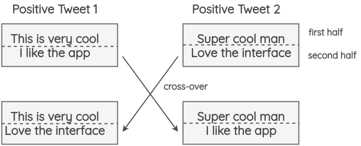

这中方法对准确性没有影响，并且在 F1-score 上还有所提升，**这表明它帮助了模型提升了在罕见类别上的判断能力，比如 tweet 中较少的中立类别。**

## 6. Syntax-tree Manipulation

这种方法最先是由 [Coulombe](https://link.zhihu.com/?target=https%3A//arxiv.org/abs/1812.04718) 提出的，其思想是解析并生成原始句子的依赖树，使用规则对其进行转换来对原句子做复述生成。

例如，一个不会改变句子意思的转换是句子的主动语态和被动语态的转换。

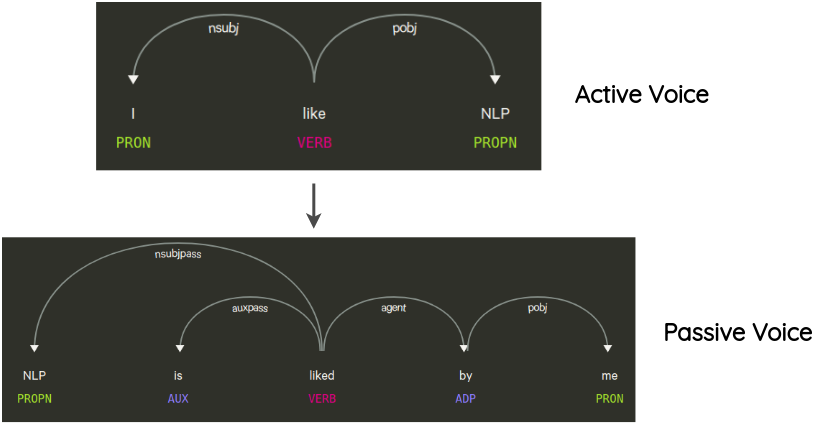

## 7. MixUp for Text

Mixup 是 [Zhang](https://link.zhihu.com/?target=https%3A//arxiv.org/abs/1710.09412) 等人在 2017 年提出的一种简单有效的图像增强方法。其思想是将两个随机图像按一定比例组合成，以生成用于训练的合成数据。对于图像，这意味着合并两个不同类的图像像素。它在模型训练的时候可以作为的一种正则化的方式。

为了把这个想法带到 NLP 中，[Guo](https://link.zhihu.com/?target=https%3A//arxiv.org/abs/1905.08941) 等人修改了 Mixup 来处理文本。他们提出了两种将 Mixup 应用于文本的方法:

**7.1 wordMixup**

在这种方法中，在一个小批中取两个随机的句子，它们被填充成相同的长度；然后，他们的 word embeddings 按一定比例组合，产生新的 word embeddings 然后传递下游的文本分类流程，交叉熵损失是根据原始文本的两个标签按一定比例计算得到的。

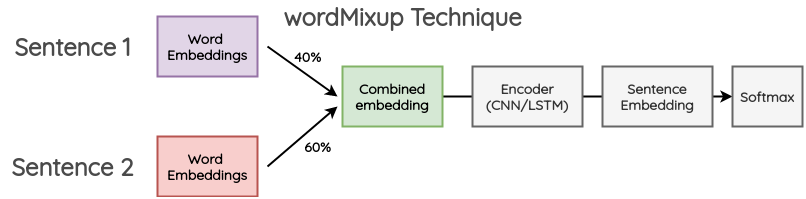

**7.2 sentMixup**

在这种方法中，两个句子首先也是被填充到相同的长度；然后，通过 LSTM/CNN 编码器传递他们的 word embeddings，我们把最后的隐藏状态作为 sentence embedding。这些 embeddings 按一定的比例组合，然后传递到最终的分类层。交叉熵损失是根据原始文本的两个标签按一定比例计算得到的。

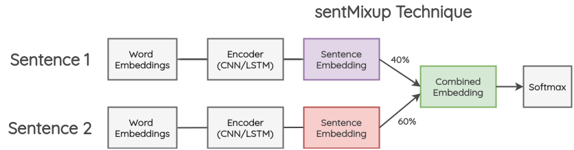

## 8. 生成式的方法

这一类的工作尝试在生成额外的训练数据的同时保留原始类别的标签。

**Conditional Pre-trained Language Models**

这种方法最早是由 Anaby-Tavor 等人在他们的论文 ["Not Enough Data? Deep Learning to the Rescue!"](https://link.zhihu.com/?target=https%3A//arxiv.org/abs/1911.03118) [Kumar](https://link.zhihu.com/?target=https%3A//arxiv.org/abs/2003.02245) 等人最近的一篇论文在多个基于 Transformer 的预训练模型中验证了这一想法。

问题的表述如下:

1. 在训练数据中预先加入类别标签，如下图所示。

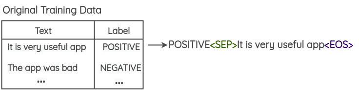

\2. 在这个修改过的训练数据上 finetune 一个大型的预训练语言模型 (BERT/GPT2/BART) 。对于 GPT2，目标是去做生成任务；而对于 BERT，目标是要去预测被 Mask 的词语。

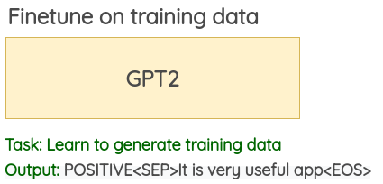

\3. 使用经过 finetune 的语言模型，可以使用类标签和几个初始单词作为模型的提示词来生成新的数据。本文使用每条训练数据的前 3 个初始词来为训练数据做数据增强。

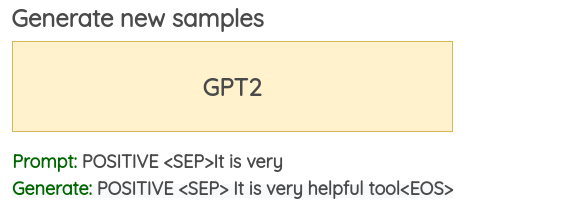

## 对抗增强

**对抗增强**: 不同于CV领域利用GAN生成对抗进行数据增强，NLP中通常在词向量上添加扰动并进行对抗训练，文献NLP中的对抗训练方法FGM, PGD, FreeAT, YOPO, FreeLB等进行了总结。

 [一文搞懂NLP中的对抗训练](https://zhuanlan.zhihu.com/p/103593948)

## 实现过程

nlpaug 和 textattack 等第三方 Python 库提供了简单易用的 API，可以轻松使用上面介绍的 NLP 数据增强方法。

eda（简单数据增强）函数

```python

# !/usr/bin/env python
# -*- coding: utf-8 -*-

import jieba
import re
import synonyms
import random
from random import shuffle

random.seed(2019)

# 停用词列表，默认使用哈工大停用词表
f = open('stop_word.txt', encoding='utf-8')
stop_words = list()
for stop_word in f.readlines():
    stop_words.append(stop_word[:-1])

# 考虑到与英文的不同，暂时搁置
# 文本清理
'''
import re
def get_only_chars(line):
    #1.清除所有的数字
'''


########################################################################
# 同义词替换
# 替换一个语句中的n个单词为其同义词
########################################################################
def synonym_replacement(words, n):
    new_words = words.copy()
    random_word_list = list(set([word for word in words if word not in stop_words]))
    random.shuffle(random_word_list)
    num_replaced = 0
    for random_word in random_word_list:
        synonyms = get_synonyms(random_word)
        if len(synonyms) >= 1:
            synonym = random.choice(synonyms)
            new_words = [synonym if word == random_word else word for word in new_words]
            num_replaced += 1
        if num_replaced >= n:
            break

    sentence = ' '.join(new_words)
    new_words = sentence.split(' ')

    return new_words


def get_synonyms(word):
    return synonyms.nearby(word)[0]


########################################################################
# 随机插入
# 随机在语句中插入n个词
########################################################################
def random_insertion(words, n):
    new_words = words.copy()
    for _ in range(n):
        add_word(new_words)
    return new_words


def add_word(new_words):
    synonyms = []
    counter = 0
    while len(synonyms) < 1:
        random_word = new_words[random.randint(0, len(new_words) - 1)]
        synonyms = get_synonyms(random_word)
        counter += 1
        if counter >= 10:
            return
    random_synonym = random.choice(synonyms)
    random_idx = random.randint(0, len(new_words) - 1)
    new_words.insert(random_idx, random_synonym)


########################################################################
# Random swap
# Randomly swap two words in the sentence n times
########################################################################

def random_swap(words, n):
    new_words = words.copy()
    for _ in range(n):
        new_words = swap_word(new_words)
    return new_words


def swap_word(new_words):
    random_idx_1 = random.randint(0, len(new_words) - 1)
    random_idx_2 = random_idx_1
    counter = 0
    while random_idx_2 == random_idx_1:
        random_idx_2 = random.randint(0, len(new_words) - 1)
        counter += 1
        if counter > 3:
            return new_words
    new_words[random_idx_1], new_words[random_idx_2] = new_words[random_idx_2], new_words[random_idx_1]
    return new_words


########################################################################
# 随机删除
# 以概率p删除语句中的词
########################################################################
def random_deletion(words, p):
    if len(words) == 1:
        return words

    new_words = []
    for word in words:
        r = random.uniform(0, 1)
        if r > p:
            new_words.append(word)

    if len(new_words) == 0:
        rand_int = random.randint(0, len(words) - 1)
        return [words[rand_int]]

    return new_words


########################################################################
# EDA函数
def eda_func(sentence, alpha_sr=0.25, alpha_ri=0.25, alpha_rs=0.25, p_rd=0.25, num_aug=12):
    seg_list = jieba.cut(text_func(sentence))
    seg_list = " ".join(seg_list)
    words = list(seg_list.split())
    num_words = len(words)

    augmented_sentences = []
    num_new_per_technique = int(num_aug / 4)
    n_sr = max(1, int(alpha_sr * num_words))
    n_ri = max(1, int(alpha_ri * num_words))
    n_rs = max(1, int(alpha_rs * num_words))

    # print(words, "\n")

    # 同义词替换sr
    for _ in range(num_new_per_technique):
        a_words = synonym_replacement(words, n_sr)
        augmented_sentences.append(''.join(a_words))

    # 随机插入ri
    for _ in range(num_new_per_technique):
        a_words = random_insertion(words, n_ri)
        augmented_sentences.append(''.join(a_words))
    #
    # 随机交换rs
    for _ in range(num_new_per_technique):
        a_words = random_swap(words, n_rs)
        augmented_sentences.append(''.join(a_words))
    #
    #
    # 随机删除rd
    for _ in range(num_new_per_technique):
        a_words = random_deletion(words, p_rd)
        augmented_sentences.append(''.join(a_words))

    # print(augmented_sentences)
    shuffle(augmented_sentences)

    if num_aug >= 1:
        augmented_sentences = augmented_sentences[:num_aug]
    else:
        keep_prob = num_aug / len(augmented_sentences)
        augmented_sentences = [s for s in augmented_sentences if random.uniform(0, 1) < keep_prob]

    # augmented_sentences.append(seg_list)

    return augmented_sentences


##
# 测试用例
# print(len(eda_func(sentence=text_func("知识图谱本质上是语义网络，是一种基于图的数据结构，由节点和边组成"))))

```


## 参考资料

[一文了解NLP中的数据增强方法](https://zhuanlan.zhihu.com/p/145521255)

[NLP中的少样本困境问题探究](https://mp.weixin.qq.com/s/gt-XJCTXJ-4GUizjoqzWvw)

[利用eda函数对文本数据进行增强](https://blog.csdn.net/python3_i_know/article/details/93894778)

[哈工大｜NLP数据增强方法？我有15种](https://mp.weixin.qq.com/s/YQ9jKtGVN9a7Uzi5zFE0pg)