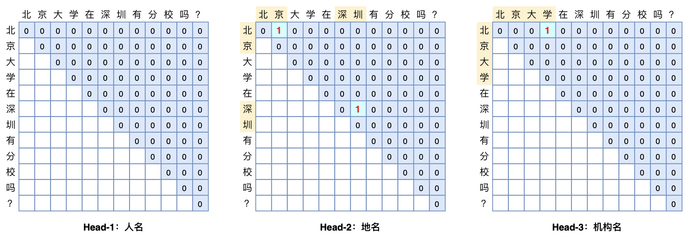
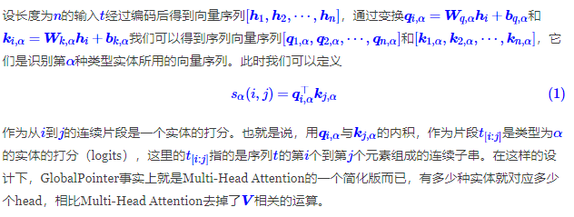
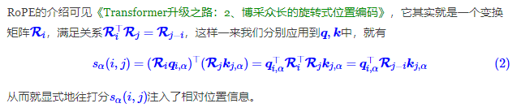
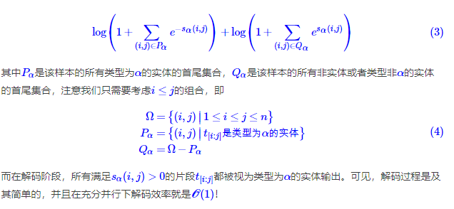
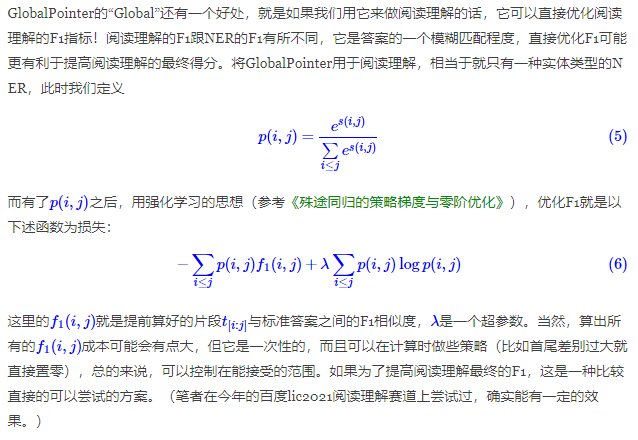
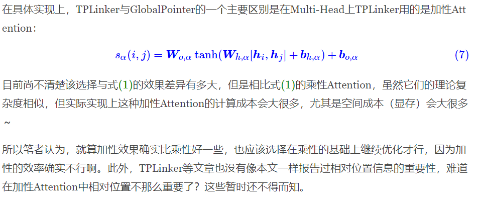

# GlobalPointer

摘要

- 将实体作为一个整体去预测。每个实体类别就是一个“n(n+1)/2选k”的多标签分类问题（文本序列长度为n，有n(n+1)/2种可能的连续片段的实体）
- 使用Transformer中的Multi-Head Attention，有多少种实体就对应多少个head，相比Multi-Head Attention去掉了V相关的运算。
- 加入相对位置，使用RoPE，在q和k前面乘以变换矩阵，整理之后就会得到相对位置编码的矩阵
- 损失函数使用的是softmax+交叉熵在多标签分类问题上的推广（因为有严重的类别不平衡）

## 基本思路

常规的Pointer Network的设计在做实体识别或者阅读理解时，一般是用两个模块分别识别实体的首和尾，这会带来训练和预测时的不一致。而GlobalPointer就是针对这个不一致而设计的，它将首尾视为一个整体去进行判别，所以它更有“全局观”（更Global）。



具体来说，假设要识别文本序列长度为n，简单起见先假定只有一种实体要识别，并且假定每个待识别实体是该序列的一个连续片段，长度不限，并且可以相互嵌套（两个实体之间有交集），那么该序列有多少个“候选实体”呢？不难得出，答案是n(n+1)/2个，即长度为n的序列有n(n+1)/2个不同的连续子序列，这些子序列包含了所有可能的实体，而我们要做的就是从这n(n+1)/2个“候选实体”里边挑出真正的实体，其实就是一个“n(n+1)/2选k”的多标签分类问题。如果有m种实体类型需要识别，那么就做成m个“n(n+1)/2选k”的多标签分类问题。这就是GlobalPointer的基本思想，以实体为基本单位进行判别。


## 数学形式



## 相对位置

理论上来说，式(1)这样的设计就足够了，但实际上训练语料比较有限的情况下，它的表现往往欠佳，因为它没有显式地包含相对位置信息。在后面的实验中我们将会看到，加不加相对位置信息，效果可以相差30个百分点以上！

比如，我们要识别出地名，输入是天气预报的内容“北京：21度；上海：22度；杭州：23度；广州：24度；...”，这时候要识别出来的实体有很多，如果没有相对位置信息输入的话，GlobalPointer对实体的长度和跨度都不是特别敏感，因此很容易把任意两个实体的首尾组合都当成目标预测出来（即预测出“北京：21度；上海”这样的实体）。相反，有了相对位置信息之后，GlobalPointer就会对实体的长度和跨度比较敏感，因此能更好地分辨出真正的实体出来。

用哪种相对位置编码呢？理论上来说，Transformer里边所有的相对位置编码都可以考虑用（参考[《让研究人员绞尽脑汁的Transformer位置编码》](https://kexue.fm/archives/8130)），但真的要去落实就会发现一个问题，大多数相对位置编码都对相对位置进行了一个截断，虽然这个截断范围对我们要识别的实体来说基本都够用了，但未免有点不优雅，不截断又会面临可学参数太多的问题。想来想去，还是觉得笔者之前构思的旋转式位置编码（RoPE）比较适合。


RoPE的介绍可见[《Transformer升级之路：2、博采众长的旋转式位置编码》](https://kexue.fm/archives/8265)



## 损失函数

到目前为止，我们已经设计好了打分$s_α(i,j)$，识别特定的类α的实体，则变成了共有n(n+1)/2类的多标签分类问题。接下来的关键是损失函数的设计。最朴素的思路是变成n(n+1)/2个二分类，然而实际使用时n往往并不小，那么n(n+1)/2更大，而每个句子的实体数不会很多（每一类的实体数目往往只是个位数），所以如果是n(n+1)/2个二分类的话，会带来极其严重的类别不均衡问题。

这时候我们之前研究的[《将“softmax+交叉熵”推广到多标签分类问题》](https://kexue.fm/archives/7359)就可以派上用场了。简单来说，这是一个用于多标签分类的损失函数，它是单目标多分类交叉熵的推广，特别适合总类别数很大、目标类别数较小的多标签分类问题。其形式也不复杂，在GlobalPointer的场景，它为



## 评价指标

对于NER来说，常见的评价指标就是F1，注意是实体级别的F1，并非标注标签级别的F1。在传统的Pointer Network或者CRF的设计下，我们并不容易在训练过程中直接计算实体级别的F1，但是在GlobalPointer的设计下，不管是计算实体级别的F1还是accuracy都是很容易的，比如F1的计算如下：

```python
def global_pointer_f1_score(y_true, y_pred):

  """给GlobalPointer设计的F1

  """

  y_pred = K.cast(K.greater(y_pred, 0), K.floatx())

  return 2 * K.sum(y_true * y_pred) / K.sum(y_true + y_pred)
```


能有这么简单，主要就是因为GlobalPointer的“Global”，它的`y_true`和`y_pred`本身就已经是实体级别了，通过`y_pred > 0`我们就可以知道哪些实体被抽取出来的，然后做个匹配就可以算出各种（实体级别的）指标，达到了训练、评估、预测的一致性。

## 优化F1值



## 相比CRF

如果序列标注的标签数为kk，那么逐帧softmax和CRF的区别在于：

前者将序列标注看成是n个k分类问题，后者将序列标注看成是1个k^n分类问题。

逐帧softmax将序列标注看成是n个k分类问题，那是过于宽松了，因为某个位置上的标注标签预测对了，不代表实体就能正确抽取出来了，起码有一个片段的标签都对了才算对；相反，CRF将序列标注看成是1个k^n分类问题，则又过于严格了，因为这意味着它要求所有实体都预测正确才算对，只对部分实体也不给分。虽然实际使用中我们用CRF也能出现部分正确的预测结果，但那只能说明模型本身的泛化能力好，CRF本身的设计确实包含了“全对才给分”的意思。

所以，CRF在理论上确实都存在不大合理的地方，而相比之下，GlobalPointer则更加贴近使用和评测场景：它本身就是以实体为单位的，并且它设计为一个“多标签分类”问题，这样它的损失函数和评价指标都是实体颗粒度的，哪怕只对一部分也得到了合理的打分。因此，哪怕在非嵌套NER场景，GlobalPointer能取得比CRF好也是“情理之中”的。

## 相比TPLinker



## 参考资料

[GlobalPointer：用统一的方式处理嵌套和非嵌套NER](https://kexue.fm/archives/8373)

**https://github.com/bojone/GlobalPointer**

