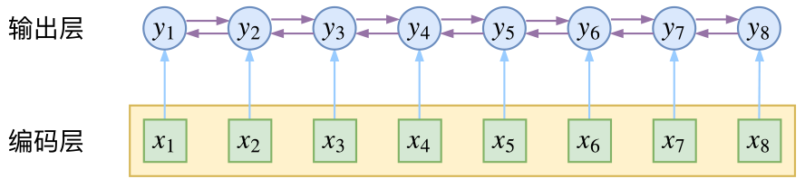
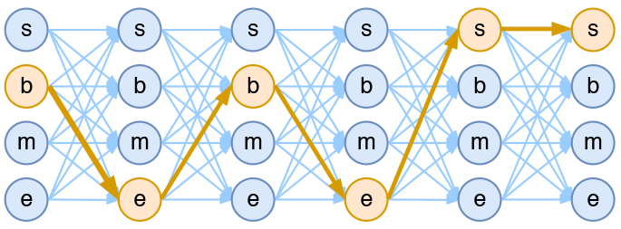
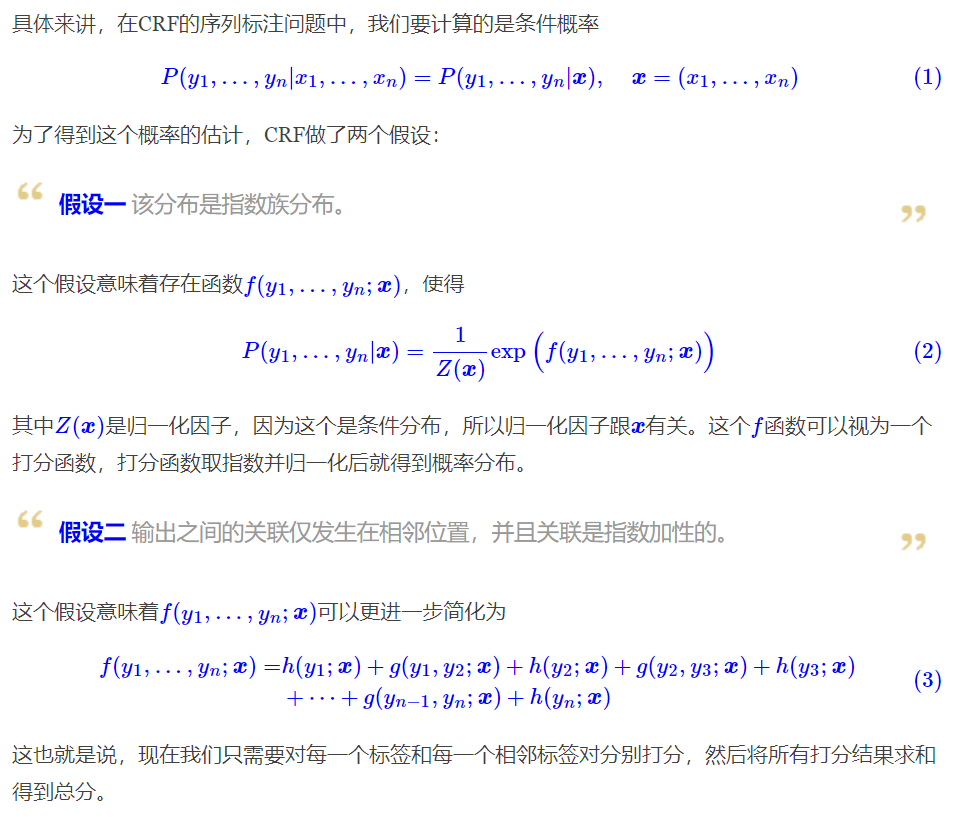
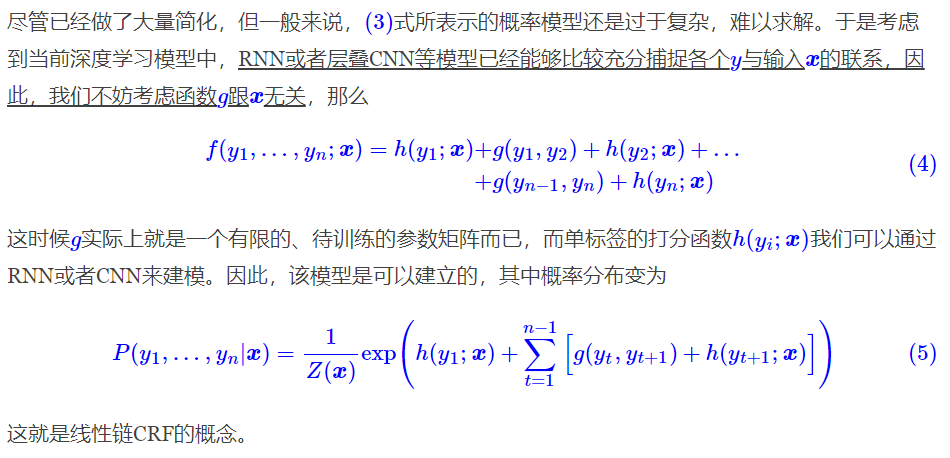
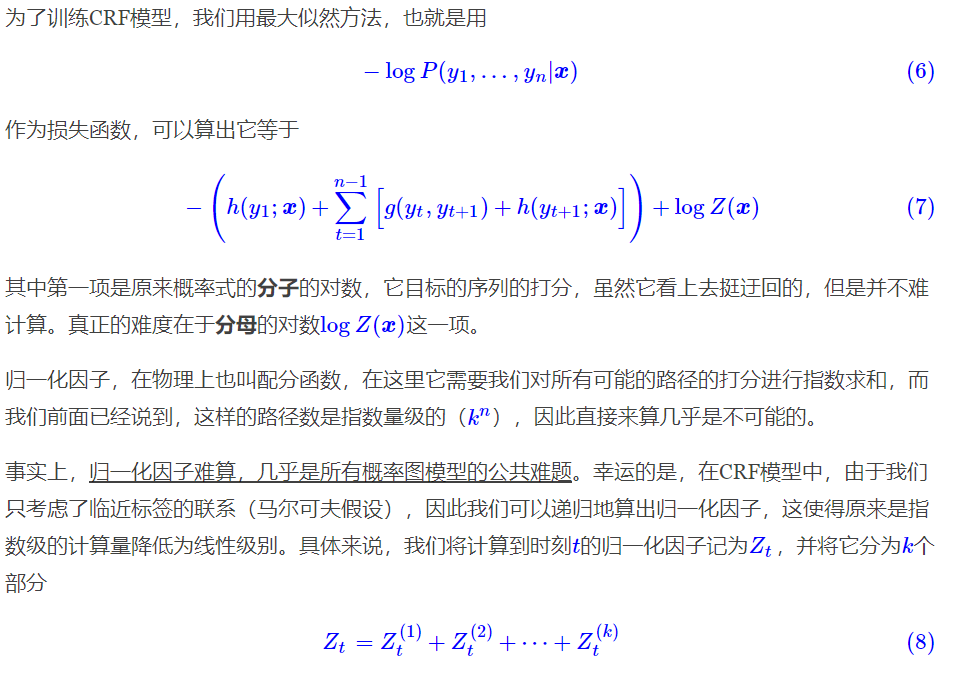
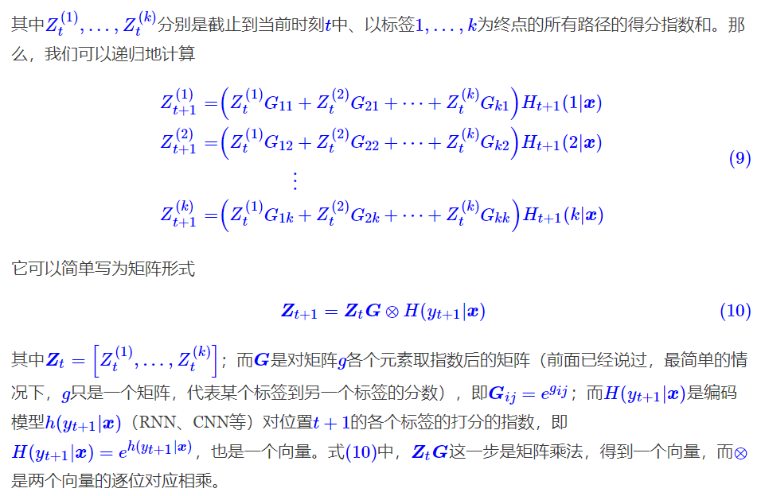
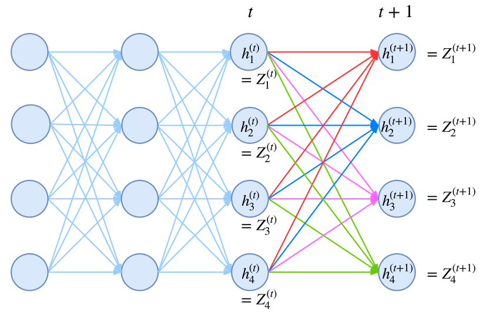
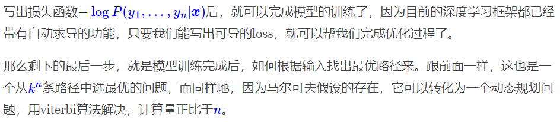
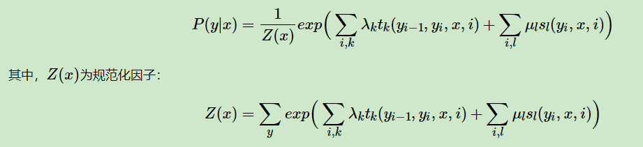
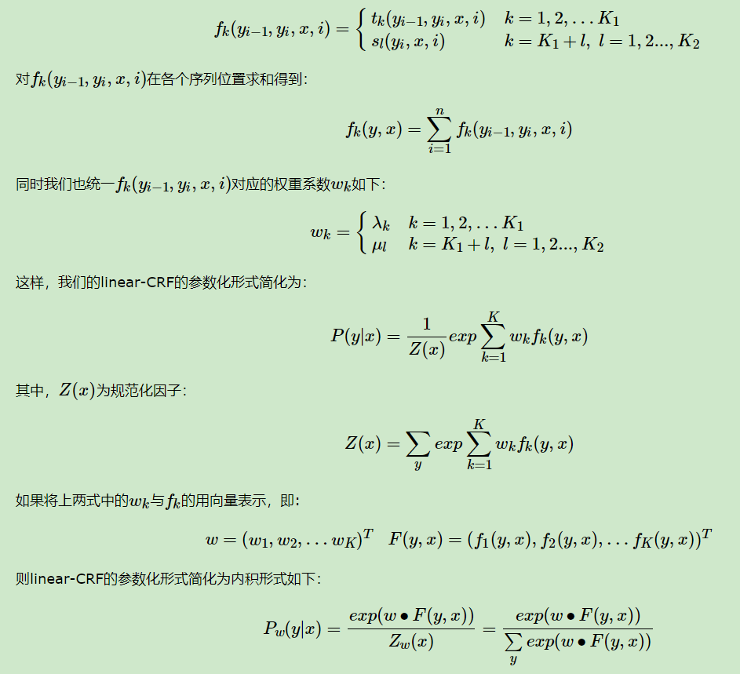

摘要：

## 概率图


贝叶斯网络（信念网络）都是有向的，马尔科夫网络无向。所以，贝叶斯网络适合为有单向依赖的数据建模，马尔科夫网络适合实体之间互相依赖的建模。

## 定义

条件随机场(Conditional Random Fields, 以下简称CRF)是给定一组输入序列条件下另一组输出序列的条件概率分布模型。**考虑相邻数据的标记信息**是普通的分类器难以做到的。而这一块，也是CRF比较擅长的地方。

**随机场是由若干个位置组成的整体，当给每一个位置中按照某种分布随机赋予一个值之后，其全体就叫做随机场。**

**马尔科夫随机场是随机场的特例，它假设随机场中某一个位置的赋值仅仅与和它相邻的位置的赋值有关，和与其不相邻的位置的赋值无关。**

CRF是马尔科夫随机场的特例，它假设马尔科夫随机场中只有X和Y两种变量，X一般是给定的，而Y一般是在给定X的条件下的输出。

**数学语言描述**：设X与Y是随机变量，P(Y|X)是给定X时Y的条件概率分布，若随机变量Y构成的是一个马尔科夫随机场，则称条件概率分布P(Y|X)是条件随机场。

为了建一个条件随机场，我们首先要定义一个**特征函数集**，每个特征函数都以整个句子s，当前位置i，位置i和i-1的标签为输入。然后为每一个特征函数赋予一个**权重**，然后针对每一个标注序列l，对所有的特征函数加权求和，必要的话，可以把求和的值转化为一个概率值。

## 对比逐帧softmax

CRF主要用于序列标注问题，可以简单理解为是给序列中的每一帧都进行分类，既然是分类，很自然想到将这个序列用CNN或者RNN进行编码后，接一个全连接层用softmax激活.

然而，当我们设计标签时，比如用s、b、m、e的4个标签来做字标注法的分词，目标输出序列本身会带有一些上下文关联，比如s后面就不能接m和e，等等。逐标签softmax并没有考虑这种输出层面的上下文关联，所以它意味着把这些关联放到了编码层面，希望模型能自己学到这些内容，但有时候会“强模型所难”。

而CRF则更直接一点，它将输出层面的关联分离了出来，这使得模型在学习上更为“从容”：



## 模型概要

如果仅仅是引入输出的关联，还不仅仅是CRF的全部，CRF的真正精巧的地方，是它**以路径为单位，考虑的是路径的概率**。

假如一个输入有n帧，每一帧的标签有k种可能性，那么理论上就有k^n种不同的输出。我们可以将它用如下的网络图进行简单的可视化。在下图中，每个点代表一个标签的可能性，点之间的连线表示标签之间的关联，而每一种标注结果，都对应着图上的一条完整的路径。



而在序列标注任务中，我们的正确答案是一般是唯一的。比如“今天天气不错”，如果对应的分词结果是“今天/天气/不/错”，那么目标输出序列就是bebess，除此之外别的路径都不符合要求。换言之，在序列标注任务中，我们的研究的基本单位应该是路径，我们要做的事情，是从k^n条路径选出正确的一条，那就意味着，如果将它视为一个分类问题，那么将是k^n类中选一类的分类问题！

这就是逐帧softmax和CRF的根本不同了：**前者将序列标注看成是n个k分类问题，后者将序列标注看成是1个k^n分类问题。**



### 线性链CRF(苏)











**动态规划的递归思想就是：一条最优路径切成两段，那么每一段都是一条（局部）最优路径。**


## linear-CRF

注意在CRF的定义中，我们并没有要求X和Y有相同的结构。而实现中，我们一般都假设X和Y有相同的结构。X和Y有相同的结构的CRF就构成了**线性链条件随机场**(Linear chain Conditional Random Fields,以下简称 linear-CRF)。在十个词的句子的词性标记中，词有十个，词性也是十个，因此，如果假设它是一个马尔科夫随机场，那么它也就是一个linear-CRF。

在linear-CRF中，特征函数分为两类，第一类是定义在Y节点上的节点特征函数$s_l$，这类特征函数只和当前节点有关。第二类是定义在Y上下文的局部特征函数$t_k$，这类特征函数只和当前节点和上一个节点有关。之所以只有上下文相关的局部特征函数，没有不相邻节点之间的特征函数，是因为linear-CRF满足马尔科夫性。

无论是节点特征函数还是局部特征函数，它们的取值只能是0或者1。即满足特征条件或者不满足特征条件。同时，我们可以为每个特征函数赋予一个权值，用以表达我们对这个特征函数的信任度。

linear-CRF的参数化形式如下：



简化形式

假设我们在某一节点我们有K1个局部特征函数和K2个节点特征函数，总共有K=K1+K2个特征函数。我们用一个特征函数fk来统一表示如下:



矩阵形式


linear-CRF的三个基本问题

linear-CRF第一个问题是评估，即给定 linear-CRF的条件概率分布P(y|x), 在给定输入序列x和输出序列y时，计算条件概率P(yi|x)和P(yi−1，yi|x)以及对应的期望. 

linear-CRF第二个问题是学习，即给定训练数据集X和Y，学习linear-CRF的模型参数wk和条件概率Pw(y|x)，这个问题的求解比HMM的学习算法简单的多，普通的梯度下降法，拟牛顿法都可以解决。

linear-CRF第三个问题是解码，即给定 linear-CRF的条件概率分布P(y|x),和输入序列x, 计算使条件概率最大的输出序列y。类似于HMM，使用维特比算法可以很方便的解决这个问题。　

## 代码实现

keras

```python
# -*- coding:utf-8 -*-

from keras.layers import Layer
import keras.backend as K


class CRF(Layer):
    """纯Keras实现CRF层
    CRF层本质上是一个带训练参数的loss计算层，因此CRF层只用来训练模型，
    而预测则需要另外建立模型。
    """
    def __init__(self, ignore_last_label=False, **kwargs):
        """ignore_last_label：定义要不要忽略最后一个标签，起到mask的效果
        """
        self.ignore_last_label = 1 if ignore_last_label else 0
        super(CRF, self).__init__(**kwargs)

    def build(self, input_shape):
        self.num_labels = input_shape[-1] - self.ignore_last_label
        self.trans = self.add_weight(name='crf_trans',
                                     shape=(self.num_labels, self.num_labels),
                                     initializer='glorot_uniform',
                                     trainable=True)

    def log_norm_step(self, inputs, states):
        """递归计算归一化因子
        要点：1、递归计算；2、用logsumexp避免溢出。
        技巧：通过expand_dims来对齐张量。
        """
        inputs, mask = inputs[:, :-1], inputs[:, -1:]
        states = K.expand_dims(states[0], 2)  # (batch_size, output_dim, 1)
        trans = K.expand_dims(self.trans, 0)  # (1, output_dim, output_dim)
        outputs = K.logsumexp(states + trans, 1)  # (batch_size, output_dim)
        outputs = outputs + inputs
        outputs = mask * outputs + (1 - mask) * states[:, :, 0]
        return outputs, [outputs]

    def path_score(self, inputs, labels):
        """计算目标路径的相对概率（还没有归一化）
        要点：逐标签得分，加上转移概率得分。
        技巧：用“预测”点乘“目标”的方法抽取出目标路径的得分。
        """
        point_score = K.sum(K.sum(inputs * labels, 2), 1, keepdims=True)  # 逐标签得分
        labels1 = K.expand_dims(labels[:, :-1], 3)
        labels2 = K.expand_dims(labels[:, 1:], 2)
        labels = labels1 * labels2  # 两个错位labels，负责从转移矩阵中抽取目标转移得分
        trans = K.expand_dims(K.expand_dims(self.trans, 0), 0)
        trans_score = K.sum(K.sum(trans * labels, [2, 3]), 1, keepdims=True)
        return point_score + trans_score  # 两部分得分之和

    def call(self, inputs):  # CRF本身不改变输出，它只是一个loss
        return inputs

    def loss(self, y_true, y_pred):  # 目标y_pred需要是one hot形式
        if self.ignore_last_label:
            mask = 1 - y_true[:, :, -1:]
        else:
            mask = K.ones_like(y_pred[:, :, :1])
        y_true, y_pred = y_true[:, :, :self.num_labels], y_pred[:, :, :self.num_labels]
        path_score = self.path_score(y_pred, y_true)  # 计算分子（对数）
        init_states = [y_pred[:, 0]]  # 初始状态
        y_pred = K.concatenate([y_pred, mask])
        log_norm, _, _ = K.rnn(self.log_norm_step, y_pred[:, 1:], init_states)  # 计算Z向量（对数）
        log_norm = K.logsumexp(log_norm, 1, keepdims=True)  # 计算Z（对数）
        return log_norm - path_score  # 即log(分子/分母)

    def accuracy(self, y_true, y_pred):  # 训练过程中显示逐帧准确率的函数，排除了mask的影响
        mask = 1 - y_true[:, :, -1] if self.ignore_last_label else None
        y_true, y_pred = y_true[:, :, :self.num_labels], y_pred[:, :, :self.num_labels]
        isequal = K.equal(K.argmax(y_true, 2), K.argmax(y_pred, 2))
        isequal = K.cast(isequal, 'float32')
        if mask == None:
            return K.mean(isequal)
        else:
            return K.sum(isequal * mask) / K.sum(mask)
```


## LSTM+CRF

**CRF有两类特征函数，一类是针对观测序列与状态的对应关系（如“我”一般是“名词”），一类是针对状态间关系（如“动词”后一般跟“名词”）。在LSTM+CRF模型中，前一类特征函数的输出由LSTM的输出替代，后一类特征函数就变成了标签转移矩阵**。

## BERT+CRF

由BERT学习序列的状态特征，从而得到一个状态分数，该分数直接输入到CRF层，省去了人工设置状态特征模板。

这里的状态特征是说序列某个位置可能对应的状态(命名实体识别中是指实体标注)，
状态分数是每个可能的状态的softmax前的概率（又称非规范化概率，或者直接称作分数），
实体标注通常用BIO标注，B表示词的开始，I表示词的延续，O表示非实体词，比如下面的句子和其对应的实体标注(假设我们要识别的是人名和地点)：
小 明 爱 北 京 的 天 安 门 。
B-Person I-Person O B-Location I-Location O B-Location I-Location I-Location O

也就是说BERT层学到了句子中每个字符最可能对应的实体标注是什么，这个过程是考虑到了每个字符左边和右边的上下文信息的，但是输出的最大分数对应的实体标注依然可能有误，不会100%正确的，出现B后面直接跟着B,后者标注以I开头了，都是有可能的，而降低这些明显不符规则的问题的情况的发生概率，就可以进一步提高BERT模型预测的准确性。此时就有人想到用CRF来解决这个问题。

CRF算法中涉及到2种特征函数，一个是状态特征函数，计算状态分数，一个是转移特征函数，计算转移分数。前者只针对当前位置的字符可以被转换成哪些实体标注，后者关注的是当前位置和其相邻位置的字符可以有哪些实体标注的组合。BERT层已经将状态分数输出到CRF层了，所以CRF层还需要学习一个转移分数矩阵，该矩阵表示了所有标注状态之间的组合，比如我们这里有B-Person I-Person B-Location I-Location O 共5种状态，有时候还会在句子的开始和结束各加一个START 和 END标注，表示一个句子的开始和结束，那么此时就是7种状态了，那么2个状态(包括自己和自己)之间的组合就有7*7=49种，上面说的转移分数矩阵中的元素就是这49种组合的分数(或称作非规范化概率)，表示了各个组合的可能性。这个矩阵一开始是随机初始化的，通过训练后慢慢会知道哪些组合更符合规则，哪些更不符合规则。从而为模型的预测带来类似如下的约束：

- 句子的开头应该是“B-”或“O”，而不是“I-”。
- “B-label1 I-label2 I-label3…”，在该模式中，类别1,2,3应该是同一种实体类别。比如，“B-Person I-Person” 是正确的，而“B-Person I-Organization”则是错误的。
- “O I-label”是错误的，命名实体的开头应该是“B-”而不是“I-”。

## 参考资料

[如何用简单易懂的例子解释条件随机场（CRF）模型？它和HMM有什么区别？](https://www.zhihu.com/question/35866596)

刘建平笔记

- [条件随机场CRF(一)从随机场到线性链条件随机场](https://www.cnblogs.com/pinard/p/7048333.html)

- [条件随机场CRF(二) 前向后向算法评估标记序列概率](http://www.cnblogs.com/pinard/p/7055072.html)

- [条件随机场CRF(三) 模型学习与维特比算法解码](http://www.cnblogs.com/pinard/p/7068574.html)

[LSTM+CRF 解析（原理篇）](https://zhuanlan.zhihu.com/p/97829287)

苏神：

- [简明条件随机场CRF介绍（附带纯Keras实现）](https://kexue.fm/archives/5542)
- [你的CRF层的学习率可能不够大](https://kexue.fm/archives/7196)
- https://github.com/bojone/crf/

[用深度学习做命名实体识别(七)-CRF介绍](https://www.cnblogs.com/anai/p/11691191.html)

[【技术分享】BERT系列（二）-- BERT在序列标注上的应用](https://cloud.tencent.com/developer/article/1454904)

