PRGC: Potential Relation and Global Correspondence Based Joint Relational Triple Extraction

先抽实体再进行关系分类，一般存在误差传递的问题

所以这篇论文采取联合抽取的方式（但其实哪种方法更好也不绝对）

方法有：百度的三元组融入序列标注，苏神的半指针，转化成QA的形式

这篇论文是基于指针的

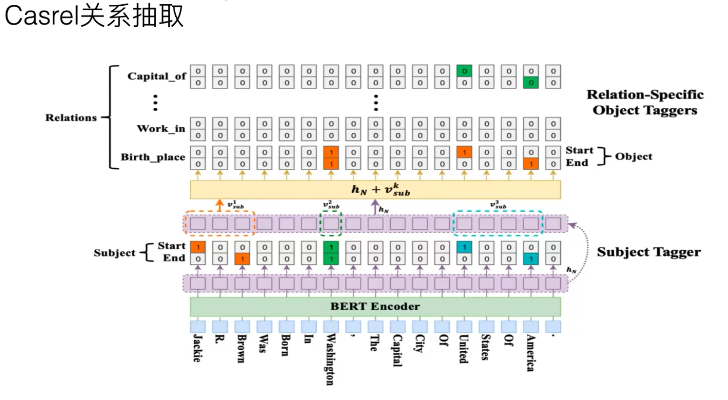

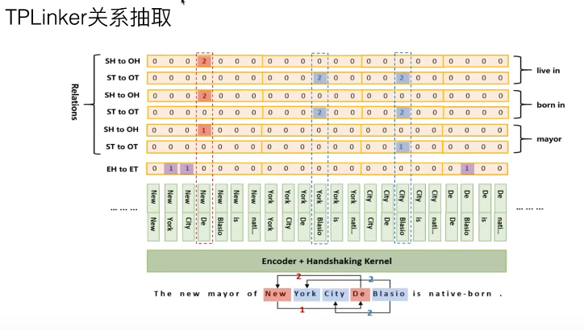

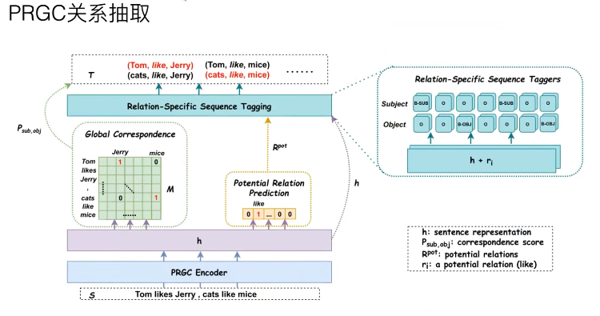

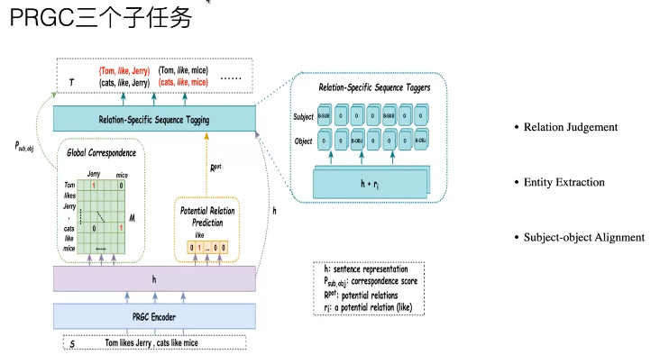

第一个：

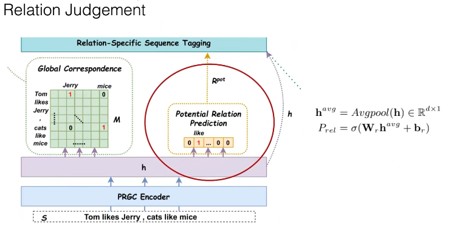

先做个分类（多分类任务），如果没有关系，后面的步骤就不需要了

文本有多个关系，会拆成多段文本，再输入预测

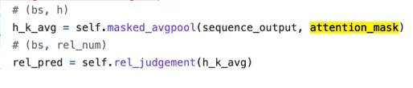

第二个：

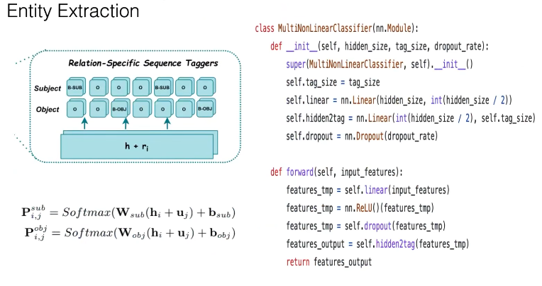

第三个：

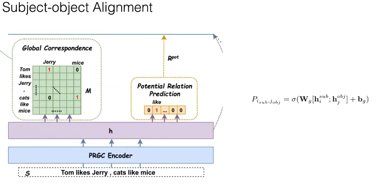

字之间是否存在关系

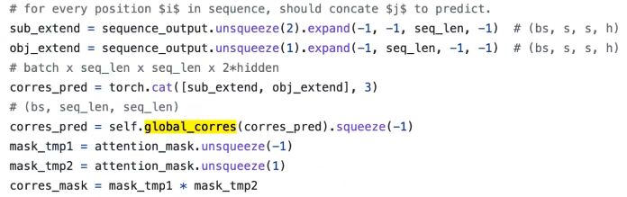

这里是变成了一维再拼接，显存消耗大

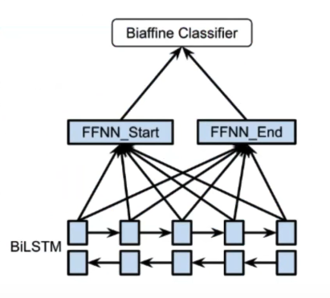

训练代码

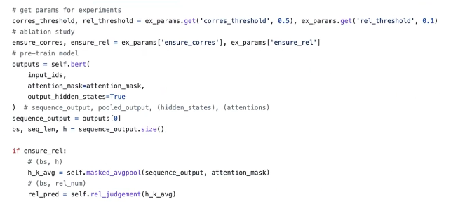

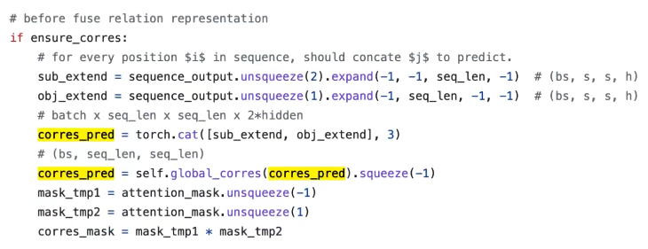

主客体的序列标注

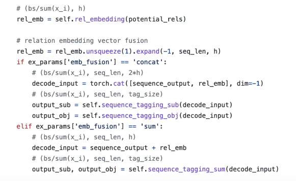

损失

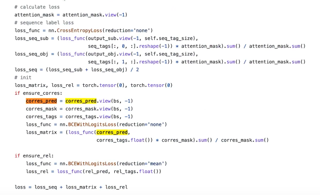

预测

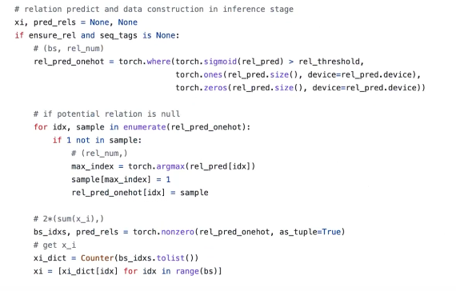

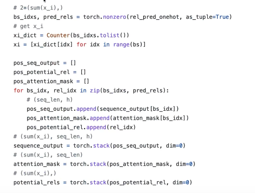

效果

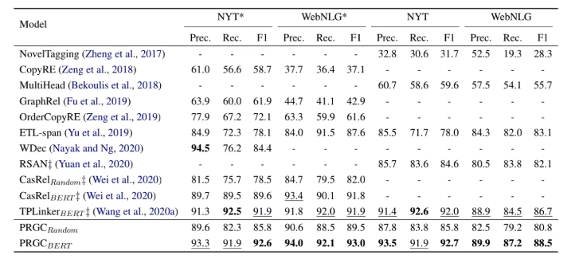

## 参考资料

[【Whalepaper】NLP分享：PRGC](https://www.bilibili.com/video/BV1EU4y1T7Xe)

