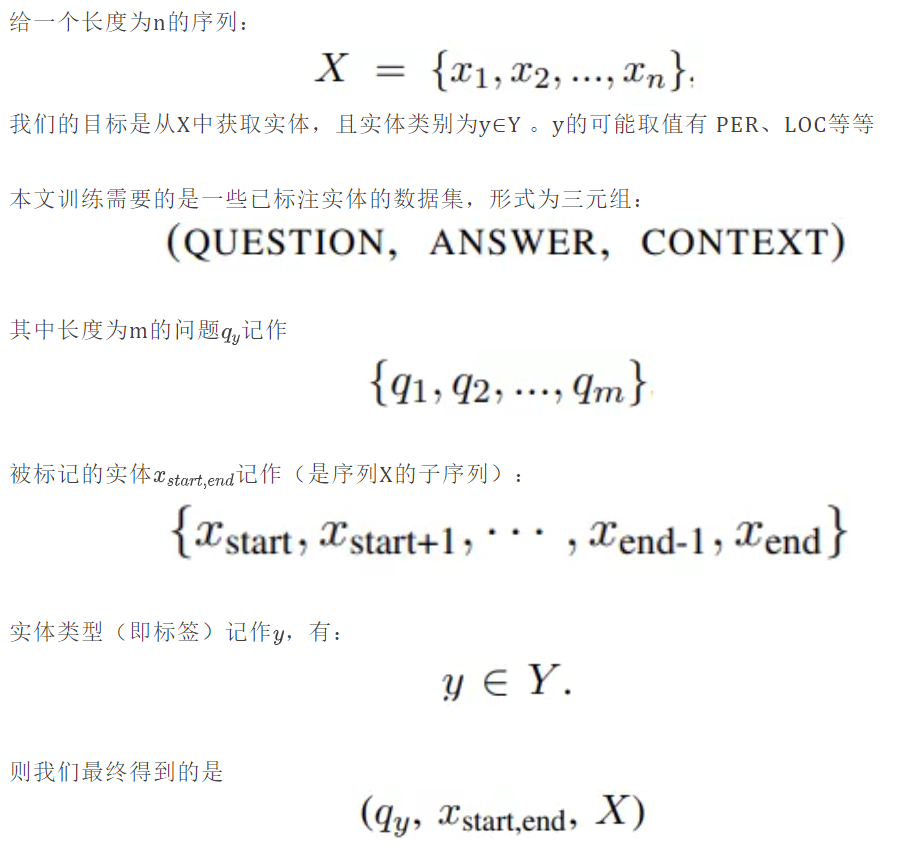
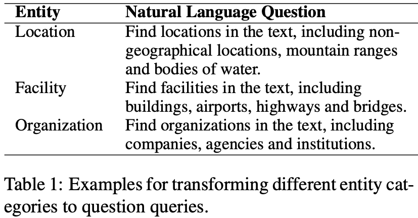
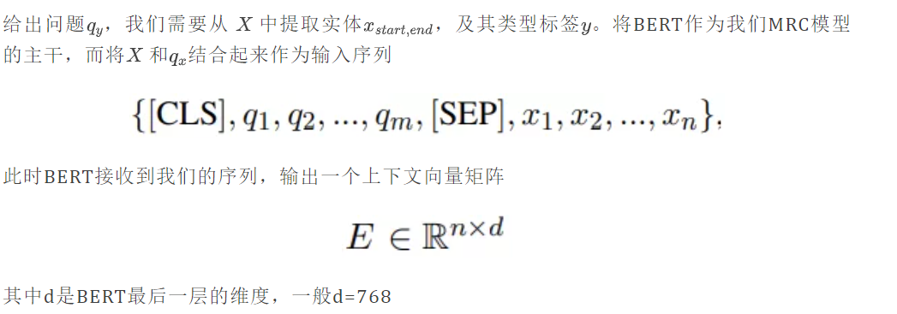
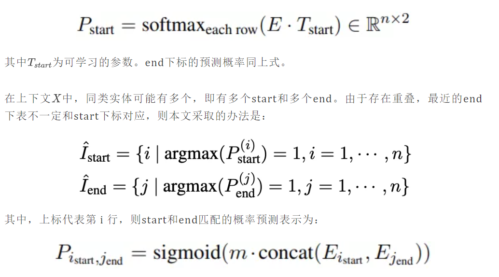
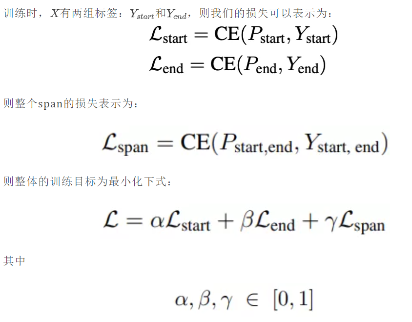

## MRC

Paper: A Unified MRC Framwork for Name Entity Recognition

Code: https://github.com/ShannonAI/mrc-for-flat-nested-ner

NER任务分为：

1.nested NER(嵌套命名实体识别，一个实体可能属于多个类型，如北京大学中的北同时属于 B-Location，也属于 B-Organization；而京也拥有 I-Location 与 I-Organization 两个标签。)

2.flat NER (普通命名实体识别，将实体识别看作序列标注任务来解决，不适用于存在实体嵌套的情况)

本文提出的统一化MRC框架则同时解决了上述两种类型的任务。如：

原任务：提取一个PER(PERSON)类型的实体

演变成：获取“文中提到了哪个人？”问题答案所在段（定位答案所在的span）

相当于把提取两个重叠的实体，转化成：回答两个独立的问题。

另外由于问题中对先验知识进行了编码，本文策略其实就相当于利用了实体提取的过程，在嵌套和非嵌套的NER任务上都能v表现更佳。

本文对nested NER和flat NER的实验，分别采用不同的数据集

### NER（Named Entity Recognition）

从2003年开始，传统的序列标注模型使用CRF作为主干，如LSTM-CRF、CNN-CRF、BiLSTM-CRF，最近的模型就是在之前的模型上加了BERT或者ELMo等预训练模型

### Nested NER

2003年重叠实体的识别还采用手工定义的规则，2007年提出两层CRF模型解决Nested NER的问题，第一层CRF识别最里层的实体，后续的CRF识别第二层/外层的实体。2009年提出的模型基于语法树，假设两个重叠实体中，一个是完全包含另一个的。2015年：超图。2017年：本地分类器。2018年：分层的方式。2019年：ARNs （Anchor-Region Networks）。

今年来，多加入预训练模型如BERT或者ELMo，2019年Strakova等将NER看作seq2seq的生成问题。

### MRC（Machine Reading Comprehension）

MRC模型是对于给出的一个问题Q在文本中提取答案所在的小段span，可以将此任务看作是两个多分类任务，比如预测答案span的开始位置和结束位置。近两年有将NLP任务转化为MRC问答的趋势，例如：关系类型R(x,y)可以表示为答案为y的问题 q_x。

## NER as MRC

另外，我们需要根据需要获取的实体类型，生成一些问题，如下图：

**模型主干**

**跨度选择**

MRC中跨度选择（span selection）的方法有两种：

1. 用2个n类分类器，分别预测start下标和end下标；但是此方法只能定位一个span
2. 用2个二分类器，每个分类器都判断某个分类器是否为start/end，这样可以输出多个start/end，再进行组合；此方法可以定位多个span

（跨度选择的整个过程是：得到start下标，得到end下标，匹配跨度）

本文采用上述第二种方法，得到BERT的输出E，预测某个下标是否为start下标的概率：

**训练与测试**

上述三个损失在端到端网络中联合训练。

测试时，start和end首先分开，然后再用排列的方法来定位跨度段span

本文将NER任务转化为MRC下的问答任务，好处有：

1. 可以处理重叠或嵌套的实体
2. 问题编码了重要的先验知识

同时在nested和flat数据上都取得了SOTA的效果

## 参考资料

[这篇文章告诉你，如何用阅读理解来做NER！](https://mp.weixin.qq.com/s/w_DwhhIHv0tPOP0I_P8EdA)