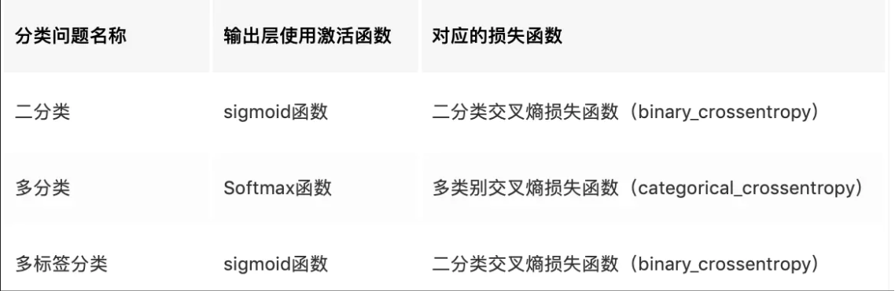

从学习任务的类型出发，可以从广义上将损失函数分为两大类——回归损失和分类损失。

 #td 

## 回归损失

### 均方误差/平方损失/L2损失

数学公式：

$MSE=\frac{\sum_{i=1}^n(y_i-\hat{y}_i)^2}{n}$

- 均方误差只考虑误差的平均大小，不考虑其方向。
- 由于经过平方，与真实值偏离较多的预测值会比偏离较少的预测值受到更为严重的惩罚。
- MSE 的数学特性很好，这使得计算梯度变得更容易。
- 便于梯度下降，误差大时下降快，误差小时下降慢，有利于函数收敛
- 受明显偏离正常范围的离群样本的影响较大

```python
# Tensorflow中集成的函数
mse = tf.losses.mean_squared_error(y_true, y_pred)

# 利用Tensorflow基础函数手工实现
mse = tf.reduce_sum(tf.square(y_true -  y_pred))
```


### 平均绝对误差/L1损失

数学公式：

$MAE=\frac{\sum_{i=1}^n|y_i-\hat{y}_i|}{n}$

* 这种度量方法也是在不考虑方向的情况下衡量误差大小
* MAE 需要像线性规划这样更复杂的工具来计算梯度
* MAE 对异常值更加稳健，因为它不使用平方
* 收敛速度比 MSE 慢，因为当误差大或小时其都保持同等速度下降，而且在某一点处还不可导，计算机求导比较困难。

```python
maes = tf.losses.absolute_difference(y_true, y_pred)
maes_loss = tf.reduce_sum(maes)
```


### 平均偏差误差(mean bias error)

数学公式：

$MBE=\frac{\sum_{i=1}^n(y_i-\hat{y}_i)}{n}$

正负误差可以互相抵消。尽管在实际应用中没那么准确，但它可以确定模型存在正偏差还是负偏差。

### Huber Loss

$$ L_{\delta}(a)= \begin{cases} \frac12a^2, &\text {for $|a|\le\delta$} \\ \delta\cdot(|a|-\frac12\delta), & \text{otherwise} \end{cases} $$

参数a通常表示residuals，也即$(y-\hat y)$。

核心思想是，检测真实值（y_true）和预测值（y_pred）之差的绝对值在超参数 δ 内时，使用 MSE 来计算 loss, 在 δ 外时使用**类** MAE 计算 loss。[sklearn 关于 huber 回归的文档](https://link.zhihu.com/?target=http%3A//scikit-learn.org/stable/modules/linear_model.html%23huber-regression)中建议将 δ=1.35 以达到 95% 的有效性。

```python3
hubers = tf.losses.huber_loss(y_true, y_pred)
hubers_loss = tf.reduce_sum(hubers)
```

```python
def huber_loss(e, d):
    return (abs(e)<=d)*e**2/2 + (e>d)*d*(abs(e)-d/2)
```


## 分类损失



### Hinge Loss/多分类SVM损失

数学公式：

$SVMLoss = \sum_{j\ne y_i}max(0, s_j-s_{y_i}+1)$

- 在一定的安全间隔内（通常是 1），正确类别的分数应高于所有错误类别的分数之和。
- 常用于最大间隔分类（maximum-margin classification），最常用的是支持向量机
- 尽管不可微，但它是一个凸函数，因此可以轻而易举地使用机器学习领域中常用的凸优化器

**tf.losses.hinge_loss：铰链损失函数 —— 不同与交叉熵思路的损失函数，类似 SVM**

```python
hinge_loss = tf.losses.hinge_loss(labels=y, logits=y_pred)
hinge_loss = tf.reduce_mean(hinge_loss)
```


### 交叉熵损失/负对数似然

数学公式：

$CrossEntropyLoss = -(y_ilog(\hat y_i)+(1-y_i)log(1-\hat y_i))$

- 随着预测概率偏离实际标签，交叉熵损失会逐渐增加
- 只是把对真实值类别的实际预测概率的对数相乘
- 交叉熵损失会重重惩罚那些置信度高但是错误的预测值。

物理意义：用于描述模型预测值与真实值的差距大小；最小化交叉熵的本质就是对数似然函数的最大化；对数似然函数的本质就是衡量在某个参数下，整体的估计和真实情况一样的概率，越大代表越相近；而损失函数的本质就是衡量预测值和真实值之间的差距，越大代表越不相近。

#### tf

**tf.nn.sigmoid_cross_entropy_with_logits：先 sigmoid 再求交叉熵 —— 二分类问题首选**

使用时，**一定不要将预测值（y_pred）进行 sigmoid 处理**，否则会影响训练的准确性，因为函数内部已经包含了 sigmoid 激活（若已先行 sigmoid 处理过了，则 tensorflow 提供了另外的函数） 。真实值（y_true）则要求是 One-hot 编码形式。

函数求得的结果是一组向量，是每个维度单独的交叉熵，如果想求总的交叉熵，使用 tf.reduce_sum() 相加即可；如果想求 loss ，则使用 tf.reduce_mean() 进行平均。

```python
# Tensorflow中集成的函数
sigmoids = tf.nn.sigmoid_cross_entropy_with_logits(labels=y, logits=y_pred)
sigmoids_loss = tf.reduce_mean(sigmoids)

# 利用Tensorflow基础函数手工实现
y_pred_si = 1.0/(1+tf.exp(-y_pred))
sigmoids = -y_true*tf.log(y_pred_si) - (1-y_true)*tf.log(1-y_pred_si)
sigmoids_loss = tf.reduce_mean(sigmoids)
```

**tf.losses.log_loss：交叉熵 —— 效果同上，预测值格式略有不同**

预测值（y_pred）计算完成后，若已先行进行了 sigmoid 处理，则使用此函数求 loss ，若还没经过 sigmoid 处理，可直接使用 sigmoid_cross_entropy_with_logits。

```python
# Tensorflow中集成的函数
logs = tf.losses.log_loss(labels=y, logits=y_pred)
logs_loss = tf.reduce_mean(logs)

# 利用Tensorflow基础函数手工实现
logs = -y_true*tf.log(y_pred) - (1-y_true)*tf.log(1-y_pred)
logs_loss = tf.reduce_mean(logs)
```

**tf.nn.softmax_cross_entropy_with_logits_v2：先 softmax 再求交叉熵 —— 多分类问题首选**

使用时，预测值（y_pred）同样是没有经过 softmax 处理过的值，真实值（y_true）要求是 One-hot 编码形式。

```python3
softmaxs = tf.nn.softmax_cross_entropy_with_logits_v2(labels=y, logits=y_pred)
softmaxs_loss = tf.reduce_mean(softmaxs)
```

> v1.8之前为 tf.nn.softmax_cross_entropy_with_logits()，新函数修补了旧函数的不足，两者在使用方法上是一样的。

**tf.nn.sparse_softmax_cross_entropy_with_logits：效果同上，真实值格式略有不同**

若真实值（y_true）不是 One-hot 格式的，可以使用此函数，可省略一步转换

```python3
softmaxs_sparse = tf.nn.sparse_softmax_cross_entropy_with_logits(labels=y, logits=y_pred)
softmaxs_sparse_loss = tf.reduce_mean(softmaxs_sparse)
```

**tf.nn.weighted_cross_entropy_with_logits：带权重的 sigmoid 交叉熵 —— 适用于正、负样本数量差距过大时**

增加了一个权重的系数，用来平衡正、负样本差距，可在一定程度上解决差距过大时训练结果严重偏向大样本的情况。

```python
# Tensorflow中集成的函数
sigmoids_weighted = tf.nn.weighted_cross_entropy_with_logits(targets=y, logits=y_pred, pos_weight)
sigmoids_weighted_loss = tf.reduce_mean(sigmoids_weighted)

# 利用Tensorflow基础函数手工实现
sigmoids_weighted = -y_true*tf.log(y_pred) * weight - (1-y_true)*tf.log(1-y_pred)
sigmoids_loss = tf.reduce_mean(sigmoids)
```

#### pytorch

torch.nn.BCELoss()

torch.nn.BCEWithLogitsLoss()

- BCEWithLogitsLoss就是把Sigmoid-BCELoss合成一步。先对x取sigmoid再计算BCELoss
- (BCELoss)BCEWithLogitsLoss用于单标签二分类或者多标签二分类，输出和目标的维度是(batch,C)，batch是样本数量，C是类别数量，对于每一个batch的C个值，对每个值求sigmoid到0-1之间，所以每个batch的C个值之间是没有关系的,相互独立的，所以之和不一定为1。每个C值代表属于一类标签的概率。如果是单标签二分类，那输出和目标的维度是(batch,1)即可。
- CrossEntropyLoss用于多类别分类，输出和目标的维度是(batch,C)，batch是样本数量，C是类别数量，每一个C之间是互斥的，相互关联的，对于每一个batch的C个值，一起求每个C的softmax，所以每个batch的所有C个值之和是1，哪个值大，代表其属于哪一类。如果用于二分类，那输出和目标的维度是(batch,2)。


## 自定义损失函数

例如下面的例子：当预测值（y_pred）比真实值（y_true）大时，使用 (y_pred-y_true)\*loss_more 作为 loss，反之，使用 (y_true-y_pred)*loss_less

```
loss = tf.reduce_sum(tf.where(tf.greater(y_pred, y_true), (y_pred-y_true)*loss_more,(y_true-y_pred)*loss_less))
```

tf.greater(x, y)：判断 x 是否大于 y，当维度不一致时广播后比较
tf.where(condition, x, y)：当 condition 为 true 时返回 x，否则返回 y 
tf.reduce_mean()：沿维度求平均
tf.reduce_sum()：沿维度相加
tf.reduce_prod()：沿维度相乘
tf.reduce_min()：沿维度找最小
tf.reduce_max()：沿维度找最大

## 参考资料

1. [多标签分类与BCEloss](https://www.jianshu.com/p/ac3bec3dde3e)